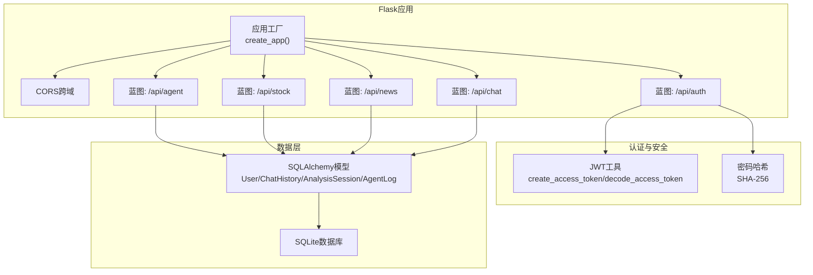
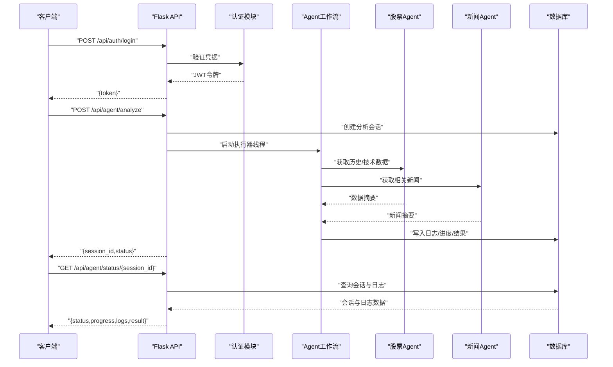

# API接口文档

<cite>
**本文档引用的文件**
- [src/api/main.py](file://src/api/main.py)
- [src/api/auth.py](file://src/api/auth.py)
- [src/api/agent.py](file://src/api/agent.py)
- [src/api/stock.py](file://src/api/stock.py)
- [src/api/news.py](file://src/api/news.py)
- [src/api/chat.py](file://src/api/chat.py)
- [src/api/agent_executor.py](file://src/api/agent_executor.py)
- [src/models/database.py](file://src/models/database.py)
- [src/utils/jwt_utils.py](file://src/utils/jwt_utils.py)
- [src/web/src/services/apiService.js](file://src/web/src/services/apiService.js)
- [src/web/src/services/apiClient.js](file://src/web/src/services/apiClient.js)
- [.env.example](file://.env.example)
</cite>

## 目录
1. [简介](#简介)
2. [项目结构](#项目结构)
3. [核心组件](#核心组件)
4. [架构总览](#架构总览)
5. [详细接口规范](#详细接口规范)
6. [依赖关系分析](#依赖关系分析)
7. [性能考虑](#性能考虑)
8. [故障排除指南](#故障排除指南)
9. [结论](#结论)
10. [附录](#附录)

## 简介
本API接口文档面向AI投资分析系统的后端服务，覆盖认证接口、Agent工作流接口、股票数据接口、新闻接口、聊天接口等全部RESTful端点。文档提供每个接口的HTTP方法、URL模式、请求/响应结构、参数说明、错误码处理，并包含认证方法、安全考虑、速率限制、版本兼容性等信息。同时提供前端客户端实现指南与具体使用示例。

## 项目结构
系统采用Flask微服务架构，按功能模块划分蓝图（Blueprint），统一在主应用中注册。数据库模型通过SQLAlchemy定义，JWT用于认证令牌管理。



**图表来源**
- [src/api/main.py](file://src/api/main.py#L40-L56)
- [src/api/auth.py](file://src/api/auth.py#L15-L15)
- [src/utils/jwt_utils.py](file://src/utils/jwt_utils.py#L13-L26)
- [src/models/database.py](file://src/models/database.py#L24-L86)

**章节来源**
- [src/api/main.py](file://src/api/main.py#L40-L56)
- [src/models/database.py](file://src/models/database.py#L24-L86)
- [src/utils/jwt_utils.py](file://src/utils/jwt_utils.py#L13-L26)

## 核心组件
- 应用工厂与蓝图注册：主应用创建时注册各功能蓝图，提供健康检查、用户资料管理等通用接口。
- 认证模块：提供注册、登录、用户资料管理；基于JWT颁发访问令牌，支持Bearer认证。
- Agent工作流：异步执行分析与查询任务，支持状态查询与会话列表。
- 股票数据：提供历史行情、技术指标、分析摘要等接口。
- 新闻接口：提供标题获取、关键词筛选、相关新闻推荐。
- 聊天接口：支持消息发送、历史查询、会话管理与简短问答。

**章节来源**
- [src/api/main.py](file://src/api/main.py#L85-L221)
- [src/api/auth.py](file://src/api/auth.py#L23-L118)
- [src/api/agent.py](file://src/api/agent.py#L20-L208)
- [src/api/stock.py](file://src/api/stock.py#L16-L126)
- [src/api/news.py](file://src/api/news.py#L16-L75)
- [src/api/chat.py](file://src/api/chat.py#L23-L216)

## 架构总览
下图展示从客户端到后端服务、数据库与外部数据源的整体交互流程。



**图表来源**
- [src/api/auth.py](file://src/api/auth.py#L78-L118)
- [src/api/agent.py](file://src/api/agent.py#L20-L108)
- [src/api/agent_executor.py](file://src/api/agent_executor.py#L93-L186)
- [src/models/database.py](file://src/models/database.py#L53-L86)

## 详细接口规范

### 认证接口
- 注册
  - 方法: POST
  - 路径: /api/auth/register
  - 请求体: { username, email, password, nickname?, phone? }
  - 成功响应: { message, token, user: { id, username, email, phone, nickname } }
  - 错误码: 400(缺少字段/已存在), 500(内部错误)
- 登录
  - 方法: POST
  - 路径: /api/auth/login
  - 请求体: { username, password }
  - 成功响应: { message, token, user: { id, username, email, phone, nickname } }
  - 错误码: 400(缺少字段), 401(用户名或密码错误/账户禁用), 500(内部错误)
- 用户资料管理
  - 获取资料: GET /api/user/profile → { id, username, email, phone, nickname, created_at }
  - 更新资料: PUT /api/user/profile → { message, user }
  - 更新手机: PUT /api/user/phone → { message, user }
  - 更新密码: PUT /api/user/password → { message }

**章节来源**
- [src/api/auth.py](file://src/api/auth.py#L23-L118)
- [src/api/main.py](file://src/api/main.py#L85-L221)

### Agent工作流接口
- 启动分析
  - 方法: POST
  - 路径: /api/agent/analyze
  - 请求体: { symbol, news_limit?, preferences? }
  - 成功响应: { message, session_id, status }
  - 错误码: 400(缺少symbol), 401(未授权), 500(内部错误)
- 启动查询
  - 方法: POST
  - 路径: /api/agent/query
  - 请求体: { query, preferences? }
  - 成功响应: { message, session_id, status }
  - 错误码: 400(缺少query), 401(未授权), 500(内部错误)
- 查询状态
  - 方法: GET
  - 路径: /api/agent/status/{session_id}
  - 成功响应: { session_id, status, progress, logs, result, error }
  - 错误码: 401(未授权), 404(会话不存在), 500(内部错误)
- 会话列表
  - 方法: GET
  - 路径: /api/agent/sessions?limit=&offset=
  - 成功响应: { sessions: [{ session_id, symbol, query, status, progress, created_at }] }
  - 错误码: 401(未授权), 500(内部错误)

**章节来源**
- [src/api/agent.py](file://src/api/agent.py#L20-L208)
- [src/api/agent_executor.py](file://src/api/agent_executor.py#L25-L282)

### 股票数据接口
- 股票分析
  - 方法: GET
  - 路径: /api/stock/analyze
  - 查询参数: symbol, start_date?, end_date?, period?, adjust?
  - 成功响应: 分析结果对象
  - 错误码: 400(缺少symbol), 401(未授权), 500(内部错误)
- 技术指标
  - 方法: GET
  - 路径: /api/stock/technical
  - 查询参数: symbol, start_date?, end_date?, period?, adjust?, ma_windows[] (可重复)
  - 成功响应: 技术指标结果
  - 错误码: 400(缺少symbol), 401(未授权), 500(内部错误)
- 历史行情
  - 方法: GET
  - 路径: /api/stock/history
  - 查询参数: symbol, start_date?, end_date?, period?, adjust?
  - 成功响应: 历史数据摘要
  - 错误码: 400(缺少symbol), 401(未授权), 500(内部错误)
- 股票汇总
  - 方法: GET
  - 路径: /api/stock/summary
  - 查询参数: symbol
  - 成功响应: 汇总信息
  - 错误码: 400(缺少symbol), 401(未授权), 500(内部错误)

**章节来源**
- [src/api/stock.py](file://src/api/stock.py#L16-L126)

### 新闻接口
- 获取标题
  - 方法: GET
  - 路径: /api/news/titles
  - 查询参数: limit?
  - 成功响应: { titles, count }
  - 错误码: 401(未授权), 500(内部错误)
- 关键词筛选
  - 方法: POST
  - 路径: /api/news/filter
  - 请求体: { keywords: string[], titles? }
  - 成功响应: { filtered_news, count }
  - 错误码: 400(缺少keywords), 401(未授权), 500(内部错误)
- 相关新闻
  - 方法: POST
  - 路径: /api/news/relevant
  - 请求体: { keywords: string[], limit? }
  - 成功响应: 推荐结果
  - 错误码: 400(缺少keywords), 401(未授权), 500(内部错误)

**章节来源**
- [src/api/news.py](file://src/api/news.py#L16-L75)

### 聊天接口
- 发送消息
  - 方法: POST
  - 路径: /api/chat/send
  - 请求体: { content, session_id?, role? }
  - 成功响应: { message, id, created_at }
  - 错误码: 400(缺少content), 401(未授权), 500(内部错误)
- 获取历史
  - 方法: GET
  - 路径: /api/chat/history
  - 查询参数: session_id?, limit?, offset?
  - 成功响应: { history: [...], count, session_id }
  - 错误码: 401(未授权), 500(内部错误)
- 会话列表
  - 方法: GET
  - 路径: /api/chat/sessions
  - 成功响应: { sessions: [{ session_id, last_message_time }] }
  - 错误码: 401(未授权), 500(内部错误)
- 清空历史
  - 方法: DELETE
  - 路径: /api/chat/clear?session_id=
  - 成功响应: { message }
  - 错误码: 401(未授权), 500(内部错误)
- 简短问答
  - 方法: POST
  - 路径: /api/chat/ask
  - 请求体: { content, session_id?, preferences? }
  - 成功响应: { message, reply, session_id }
  - 错误码: 400(缺少content), 401(未授权), 500(内部错误)

**章节来源**
- [src/api/chat.py](file://src/api/chat.py#L23-L216)

## 依赖关系分析

```mermaid
classDiagram
class User {
+int id
+string username
+string email
+string phone
+string password_hash
+string nickname
+datetime created_at
+datetime updated_at
+bool is_active
}
class ChatHistory {
+int id
+int user_id
+string role
+string content
+datetime created_at
+string session_id
}
class AnalysisSession {
+int id
+int user_id
+string session_id
+string symbol
+string query
+string status
+int progress
+string result_summary
+string error_message
+datetime created_at
+datetime updated_at
}
class AgentLog {
+int id
+string session_id
+string agent_name
+string step_name
+string status
+string log_message
+int progress_pct
+datetime created_at
}
User ||--o{ ChatHistory : "拥有"
User ||--o{ AnalysisSession : "拥有"
AnalysisSession ||--o{ AgentLog : "产生日志"
```

**图表来源**
- [src/models/database.py](file://src/models/database.py#L24-L86)

**章节来源**
- [src/models/database.py](file://src/models/database.py#L24-L86)

## 性能考虑
- 异步执行：Agent工作流通过线程池异步执行，避免阻塞主线程，提升并发能力。
- 进度与日志：通过会话与日志表记录执行进度与步骤，便于监控与重试。
- 数据缓存：新闻Agent具备默认缓存策略，减少重复网络请求。
- 数据库索引：用户、会话、日志均建立索引，优化查询性能。
- 代理与降级：股票Agent在数据源不可用时自动降级，保证服务可用性。

[本节为通用性能指导，不直接分析特定文件]

## 故障排除指南
- 401 未授权：检查Authorization头是否以Bearer开头且令牌有效。
- 400 参数错误：核对必填字段与参数类型，如缺少symbol、content等。
- 404 资源不存在：确认会话ID或用户是否存在。
- 500 服务器内部错误：查看后端日志定位异常，检查数据库连接与外部API可用性。
- JWT密钥：生产环境务必设置JWT_SECRET_KEY，避免使用默认值。

**章节来源**
- [src/api/main.py](file://src/api/main.py#L222-L234)
- [src/utils/jwt_utils.py](file://src/utils/jwt_utils.py#L13-L26)
- [.env.example](file://.env.example#L1-L19)

## 结论
本API文档系统化梳理了认证、Agent工作流、股票数据、新闻与聊天五大模块的全部端点，明确了请求/响应结构、参数约束与错误处理策略。配合JWT认证、数据库模型与异步执行机制，系统在功能完整性与运行稳定性方面具备良好基础。建议在生产环境中强化速率限制、日志审计与监控告警，并持续优化外部数据源的可用性与降级策略。

[本节为总结性内容，不直接分析特定文件]

## 附录

### 安全与认证
- 认证方式：Bearer Token（JWT）
- 令牌有效期：默认7天
- 密钥管理：通过环境变量JWT_SECRET_KEY配置
- 跨域：启用CORS，便于前端直连

**章节来源**
- [src/utils/jwt_utils.py](file://src/utils/jwt_utils.py#L13-L26)
- [src/api/auth.py](file://src/api/auth.py#L121-L136)
- [src/api/main.py](file://src/api/main.py#L42-L46)

### 速率限制与版本兼容
- 速率限制：当前实现未内置限流策略，建议在网关或反向代理层添加限流规则。
- 版本兼容：API路径以/api/前缀+功能模块区分，保持向后兼容；新增字段以可选形式提供，避免破坏既有客户端。

[本节为通用指导，不直接分析特定文件]

### 使用示例与客户端实现

- 健康检查
  - GET http://localhost:5000/api/health
- 认证
  - POST /api/auth/register
  - POST /api/auth/login
- 用户资料
  - GET /api/user/profile
  - PUT /api/user/profile
  - PUT /api/user/phone
  - PUT /api/user/password
- Agent工作流
  - POST /api/agent/analyze
  - POST /api/agent/query
  - GET /api/agent/status/{session_id}
  - GET /api/agent/sessions?limit=&offset=
- 股票数据
  - GET /api/stock/analyze?symbol=...
  - GET /api/stock/technical?symbol=...
  - GET /api/stock/history?symbol=...
  - GET /api/stock/summary?symbol=...
- 新闻
  - GET /api/news/titles?limit=
  - POST /api/news/filter
  - POST /api/news/relevant
- 聊天
  - POST /api/chat/send
  - GET /api/chat/history?session_id=&limit=&offset=
  - GET /api/chat/sessions
  - DELETE /api/chat/clear?session_id=
  - POST /api/chat/ask

**章节来源**
- [src/web/src/services/apiService.js](file://src/web/src/services/apiService.js#L1-L175)
- [src/web/src/services/apiClient.js](file://src/web/src/services/apiClient.js#L1-L130)