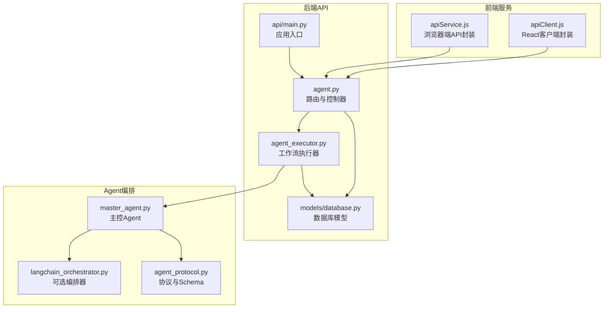
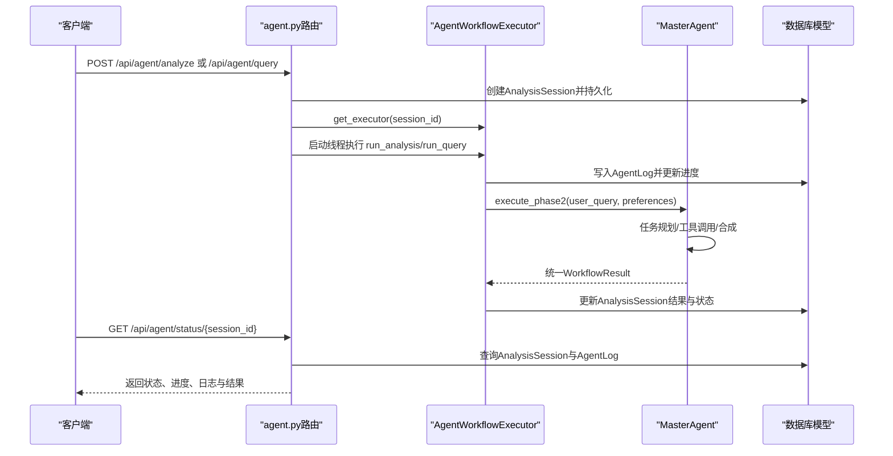
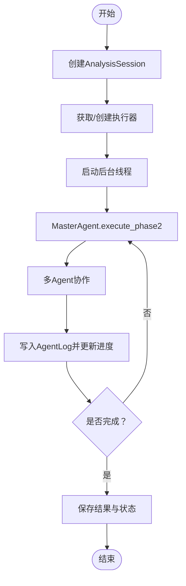
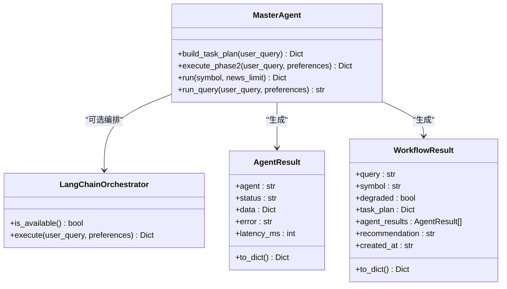
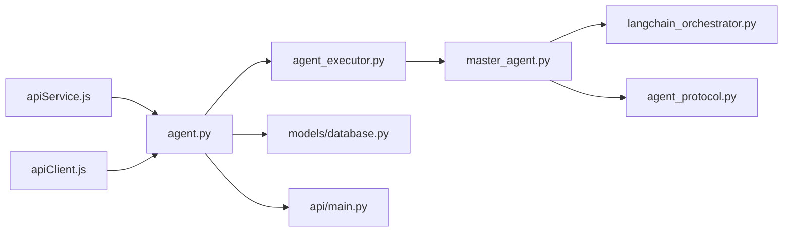

# Agent工作流接口

<cite>
**本文档引用的文件**
- [src/api/agent.py](file://src/api/agent.py)
- [src/api/agent_executor.py](file://src/api/agent_executor.py)
- [src/agent/master_agent.py](file://src/agent/master_agent.py)
- [src/agent/langchain_orchestrator.py](file://src/agent/langchain_orchestrator.py)
- [src/agent/agent_protocol.py](file://src/agent/agent_protocol.py)
- [src/models/database.py](file://src/models/database.py)
- [src/api/main.py](file://src/api/main.py)
- [src/web/src/services/apiService.js](file://src/web/src/services/apiService.js)
- [src/web/src/services/apiClient.js](file://src/web/src/services/apiClient.js)
</cite>

## 目录
1. [简介](#简介)
2. [项目结构](#项目结构)
3. [核心组件](#核心组件)
4. [架构总览](#架构总览)
5. [详细组件分析](#详细组件分析)
6. [依赖关系分析](#依赖关系分析)
7. [性能考虑](#性能考虑)
8. [故障排除指南](#故障排除指南)
9. [结论](#结论)
10. [附录](#附录)

## 简介
本文件为Agent工作流接口的完整API文档，覆盖以下关键能力：
- 分析查询接口：POST /api/agent/analyze（股票分析）与 POST /api/agent/query（通用查询）
- 状态查询接口：GET /api/agent/status/{session_id}
- 接口请求格式、响应结构、错误处理机制
- Agent执行流程、状态码定义、进度跟踪、并发控制与资源管理
- 性能优化建议与使用示例

## 项目结构
Agent工作流接口位于后端Flask应用中，采用蓝图模块化组织，配合数据库模型记录会话与日志，并通过前端服务封装调用。

**图表来源**
- [src/api/agent.py](file://src/api/agent.py#L1-L208)
- [src/api/agent_executor.py](file://src/api/agent_executor.py#L1-L282)
- [src/models/database.py](file://src/models/database.py#L53-L86)
- [src/api/main.py](file://src/api/main.py#L40-L57)
- [src/agent/master_agent.py](file://src/agent/master_agent.py#L24-L351)
- [src/agent/langchain_orchestrator.py](file://src/agent/langchain_orchestrator.py#L20-L273)
- [src/agent/agent_protocol.py](file://src/agent/agent_protocol.py#L16-L116)
- [src/web/src/services/apiService.js](file://src/web/src/services/apiService.js#L72-L94)
- [src/web/src/services/apiClient.js](file://src/web/src/services/apiClient.js#L94-L103)

**章节来源**
- [src/api/agent.py](file://src/api/agent.py#L1-L208)
- [src/api/main.py](file://src/api/main.py#L40-L57)

## 核心组件
- 路由与控制器：提供分析与查询的启动接口、状态查询与会话列表接口
- 工作流执行器：负责实际执行多Agent编排，维护会话状态与日志
- 主控Agent：统一任务规划与多Agent协作，支持LangChain编排器降级
- 数据库模型：记录分析会话、Agent日志与结果摘要
- 前端服务：封装API调用，便于Web应用集成

**章节来源**
- [src/api/agent.py](file://src/api/agent.py#L20-L208)
- [src/api/agent_executor.py](file://src/api/agent_executor.py#L25-L282)
- [src/agent/master_agent.py](file://src/agent/master_agent.py#L24-L351)
- [src/models/database.py](file://src/models/database.py#L53-L86)

## 架构总览
Agent工作流采用“请求-会话-执行器-多Agent”的分层设计。请求到达后端路由，创建会话并启动后台线程执行器，执行器通过主控Agent协调数据、新闻、知识与分析Agent，期间持续写入日志与更新会话进度，最终返回统一的结果结构。

**图表来源**
- [src/api/agent.py](file://src/api/agent.py#L20-L108)
- [src/api/agent_executor.py](file://src/api/agent_executor.py#L93-L271)
- [src/agent/master_agent.py](file://src/agent/master_agent.py#L155-L318)
- [src/models/database.py](file://src/models/database.py#L53-L86)

## 详细组件分析

### 分析查询接口（POST /api/agent/analyze 与 POST /api/agent/query）

- 接口路径
  - POST /api/agent/analyze（股票分析）
  - POST /api/agent/query（通用查询）

- 请求头
  - Content-Type: application/json
  - Authorization: Bearer {token}

- 请求体字段
  - analyze接口
    - symbol: 股票代码（必填）
    - news_limit: 新闻标题数量，默认20（可选）
    - preferences: 用户偏好配置（可选）
  - query接口
    - query: 用户查询内容（必填）
    - preferences: 用户偏好配置（可选）

- 成功响应
  - message: 提示信息
  - session_id: 会话标识符
  - status: 当前状态（processing）

- 错误响应
  - 400: 缺少必要参数
  - 401: 未授权
  - 500: 启动失败（异常信息）

- 并发与执行
  - 后台线程启动执行器，不阻塞请求
  - 执行器内部维护会话状态与日志

**章节来源**
- [src/api/agent.py](file://src/api/agent.py#L20-L108)
- [src/web/src/services/apiService.js](file://src/web/src/services/apiService.js#L72-L94)
- [src/web/src/services/apiClient.js](file://src/web/src/services/apiClient.js#L94-L99)

### 状态查询接口（GET /api/agent/status/{session_id}）

- 接口路径
  - GET /api/agent/status/{session_id}

- 请求头
  - Authorization: Bearer {token}

- 成功响应字段
  - session_id: 会话标识符
  - status: 会话状态（pending、processing、completed、failed）
  - progress: 进度百分比（0-100）
  - logs: Agent执行日志列表
    - agent: Agent名称
    - step: 步骤名称
    - text: 日志消息
    - status: 日志状态（pending、active、completed、failed）
    - progress: 进度百分比
    - timestamp: 时间戳
  - result: 结果摘要（JSON对象或字符串）
  - error: 错误信息（如有）

- 错误响应
  - 401: 未授权
  - 404: 会话不存在
  - 500: 获取状态失败

- 状态码定义
  - pending: 初始等待状态
  - processing: 执行中
  - completed: 执行完成
  - failed: 执行失败

- 进度跟踪
  - 执行器在不同阶段更新进度与日志
  - 前端可轮询该接口获取实时状态

**章节来源**
- [src/api/agent.py](file://src/api/agent.py#L111-L168)
- [src/models/database.py](file://src/models/database.py#L63-L65)
- [src/api/agent_executor.py](file://src/api/agent_executor.py#L57-L92)

### Agent执行流程

- 流程概览
  - 路由接收请求，创建AnalysisSession并持久化
  - 获取或创建AgentWorkflowExecutor实例
  - 启动后台线程执行run_analysis或run_query
  - 执行器通过MasterAgent执行phase2编排
  - 多Agent协作：StockAgent、NewsAgent、KnowledgeAgent、AnalysisAgent
  - 执行器记录AgentLog并更新AnalysisSession
  - 完成后返回统一WorkflowResult结构

- 执行器状态与日志
  - _log方法写入AgentLog并同步更新会话进度
  - run_analysis与run_query分别处理股票分析与通用查询
  - get_status提供执行器内部状态快照

**图表来源**
- [src/api/agent_executor.py](file://src/api/agent_executor.py#L93-L271)
- [src/agent/master_agent.py](file://src/agent/master_agent.py#L155-L318)
- [src/models/database.py](file://src/models/database.py#L73-L86)

**章节来源**
- [src/api/agent_executor.py](file://src/api/agent_executor.py#L25-L282)
- [src/agent/master_agent.py](file://src/agent/master_agent.py#L155-L318)

### 多Agent编排与协议

- 主控Agent（MasterAgent）
  - 任务规划：根据用户查询识别股票代码并生成任务计划
  - 编排策略：优先LangChain编排器，失败则回退自研编排
  - 协同执行：调用StockAgent、NewsAgent、KnowledgeAgent、AnalysisAgent
  - 统一输出：WorkflowResult，包含推荐结论与各Agent结果

- LangChain编排器（可选）
  - 使用工具调用模式，自动选择合适Agent
  - 回退逻辑：当LangChain不可用或失败时切换自研编排

- 协议与Schema
  - AgentResult：统一Agent输出结构（agent、status、data、error、latency_ms）
  - WorkflowResult：统一工作流输出结构（query、symbol、degraded、task_plan、agent_results、recommendation、created_at）
  - Schema校验：确保输入输出结构一致

**图表来源**
- [src/agent/master_agent.py](file://src/agent/master_agent.py#L24-L351)
- [src/agent/langchain_orchestrator.py](file://src/agent/langchain_orchestrator.py#L20-L273)
- [src/agent/agent_protocol.py](file://src/agent/agent_protocol.py#L74-L116)

**章节来源**
- [src/agent/master_agent.py](file://src/agent/master_agent.py#L137-L318)
- [src/agent/langchain_orchestrator.py](file://src/agent/langchain_orchestrator.py#L151-L273)
- [src/agent/agent_protocol.py](file://src/agent/agent_protocol.py#L16-L116)

### 数据模型与状态持久化

- AnalysisSession
  - 字段：user_id、session_id、symbol、query、status、progress、result_summary、error_message、created_at、updated_at
  - 状态枚举：pending、processing、completed、failed

- AgentLog
  - 字段：session_id、agent_name、step_name、status、log_message、progress_pct、created_at
  - 日志状态枚举：pending、active、completed、failed

- 生命周期
  - 创建会话 -> 记录初始日志 -> 执行阶段日志 -> 更新会话状态与进度 -> 保存结果摘要

**章节来源**
- [src/models/database.py](file://src/models/database.py#L53-L86)

## 依赖关系分析

**图表来源**
- [src/api/agent.py](file://src/api/agent.py#L1-L208)
- [src/api/agent_executor.py](file://src/api/agent_executor.py#L1-L282)
- [src/agent/master_agent.py](file://src/agent/master_agent.py#L1-L351)
- [src/agent/langchain_orchestrator.py](file://src/agent/langchain_orchestrator.py#L1-L273)
- [src/agent/agent_protocol.py](file://src/agent/agent_protocol.py#L1-L116)
- [src/models/database.py](file://src/models/database.py#L1-L86)
- [src/api/main.py](file://src/api/main.py#L1-L243)
- [src/web/src/services/apiService.js](file://src/web/src/services/apiService.js#L1-L175)
- [src/web/src/services/apiClient.js](file://src/web/src/services/apiClient.js#L1-L175)

**章节来源**
- [src/api/agent.py](file://src/api/agent.py#L1-L208)
- [src/api/agent_executor.py](file://src/api/agent_executor.py#L1-L282)
- [src/agent/master_agent.py](file://src/agent/master_agent.py#L1-L351)
- [src/agent/langchain_orchestrator.py](file://src/agent/langchain_orchestrator.py#L1-L273)
- [src/agent/agent_protocol.py](file://src/agent/agent_protocol.py#L1-L116)
- [src/models/database.py](file://src/models/database.py#L1-L86)
- [src/api/main.py](file://src/api/main.py#L1-L243)
- [src/web/src/services/apiService.js](file://src/web/src/services/apiService.js#L1-L175)
- [src/web/src/services/apiClient.js](file://src/web/src/services/apiClient.js#L1-L175)

## 性能考虑
- 并发控制
  - 使用线程池/锁保护执行器实例缓存，避免重复创建
  - 后台线程执行，不阻塞HTTP请求
- 资源管理
  - 执行器在finally中关闭数据库连接，防止连接泄漏
  - 执行器实例在完成后可移除，释放内存
- I/O与网络
  - 股票数据与新闻搜索可能受外部API限制，建议设置合理的超时与重试
- 日志与监控
  - 通过AgentLog记录阶段耗时与状态，便于性能分析
- 缓存与降级
  - LangChain编排器不可用时自动回退至自研编排
  - 股票Agent提供多数据源回退策略

[本节为通用指导，无需特定文件来源]

## 故障排除指南
- 常见错误与处理
  - 401 未授权：检查Authorization头与登录状态
  - 400 缺少参数：确认请求体包含symbol或query
  - 404 会话不存在：确认session_id正确且属于当前用户
  - 500 启动/状态获取失败：查看后端日志定位异常
- 状态码含义
  - pending：会话已创建，等待执行
  - processing：执行中，可继续轮询
  - completed：执行完成，可读取result
  - failed：执行失败，可读取error
- 建议排查步骤
  - 确认前端已正确设置Authorization头
  - 检查后端日志中的错误堆栈
  - 在状态接口中查看AgentLog，定位失败阶段
  - 若使用LangChain编排器，确认环境变量与依赖可用

**章节来源**
- [src/api/agent.py](file://src/api/agent.py#L20-L168)
- [src/models/database.py](file://src/models/database.py#L63-L65)

## 结论
Agent工作流接口提供了从请求到执行再到状态查询的完整闭环，具备良好的扩展性与容错能力。通过统一的协议与日志体系，能够清晰追踪每个阶段的执行情况，并在LangChain不可用时自动回退。建议在生产环境中结合限流、缓存与监控，进一步提升稳定性与性能。

[本节为总结，无需特定文件来源]

## 附录

### 使用示例

- 启动股票分析
  - 方法：POST /api/agent/analyze
  - 请求体：{ "symbol": "600036", "news_limit": 20, "preferences": { "debug_mode": false } }
  - 成功响应：包含session_id与status

- 启动通用查询
  - 方法：POST /api/agent/query
  - 请求体：{ "query": "如何评估某只股票的投资价值？", "preferences": { "debug_mode": false } }
  - 成功响应：包含session_id与status

- 轮询状态
  - 方法：GET /api/agent/status/{session_id}
  - 成功响应：包含status、progress、logs与result

- 获取会话列表
  - 方法：GET /api/agent/sessions?limit=20&offset=0
  - 成功响应：包含sessions数组

**章节来源**
- [src/web/src/services/apiService.js](file://src/web/src/services/apiService.js#L72-L94)
- [src/web/src/services/apiClient.js](file://src/web/src/services/apiClient.js#L94-L103)
- [src/api/agent.py](file://src/api/agent.py#L171-L208)