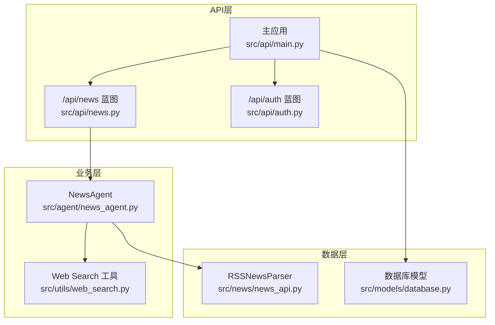
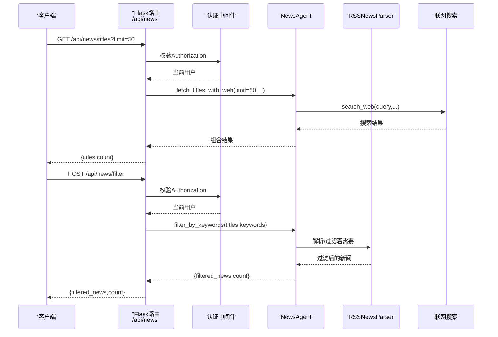
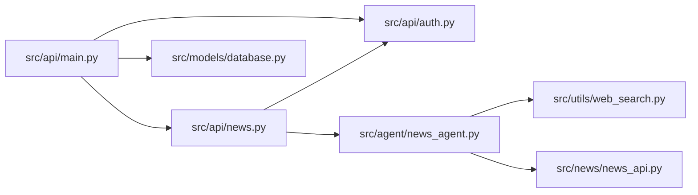

# 新闻接口

<cite>
**本文档引用的文件**
- [src/api/news.py](file://src/api/news.py)
- [src/api/main.py](file://src/api/main.py)
- [src/api/auth.py](file://src/api/auth.py)
- [src/news/news_api.py](file://src/news/news_api.py)
- [src/news/README.md](file://src/news/README.md)
- [src/agent/news_agent.py](file://src/agent/news_agent.py)
- [src/utils/web_search.py](file://src/utils/web_search.py)
- [src/models/database.py](file://src/models/database.py)
- [DESIGN.md](file://DESIGN.md)
- [requirements.txt](file://requirements.txt)
</cite>

## 目录
1. [简介](#简介)
2. [项目结构](#项目结构)
3. [核心组件](#核心组件)
4. [架构总览](#架构总览)
5. [详细组件分析](#详细组件分析)
6. [依赖关系分析](#依赖关系分析)
7. [性能考量](#性能考量)
8. [故障排查指南](#故障排查指南)
9. [结论](#结论)
10. [附录](#附录)

## 简介
本文件为“新闻接口”的完整API文档，聚焦以下接口与能力：
- 新闻标题获取接口（GET /api/news/titles）：分页参数、时间范围筛选、关键词匹配、排序选项
- 新闻内容过滤接口（POST /api/news/filter）：过滤条件（情感倾向、重要性评分、相关性阈值）、返回格式、批量处理能力
- 新闻情感分析接口（POST /api/news/analyze）：情感极性计算、置信度评分、分析维度（正面/负面/中性）
- 新闻源管理、数据更新机制、缓存策略、API配额限制
- 完整的请求示例与响应格式说明

说明：
- 当前仓库中实际实现的新闻相关API主要集中在标题获取与关键词过滤，情感分析与相关性阈值等功能在设计文档中被规划为未来能力。
- 本文档严格基于现有代码实现进行说明，并在涉及设计规划的部分明确标注。

## 项目结构
后端采用Flask蓝图组织API，新闻模块位于src/api/news.py，核心数据处理位于src/news/news_api.py，认证与用户管理位于src/api/auth.py，数据库模型位于src/models/database.py。

图表来源
- [src/api/news.py](file://src/api/news.py#L1-L75)
- [src/api/main.py](file://src/api/main.py#L40-L57)
- [src/agent/news_agent.py](file://src/agent/news_agent.py#L18-L93)
- [src/utils/web_search.py](file://src/utils/web_search.py#L39-L80)
- [src/news/news_api.py](file://src/news/news_api.py#L41-L248)
- [src/models/database.py](file://src/models/database.py#L24-L86)

章节来源
- [src/api/main.py](file://src/api/main.py#L40-L57)
- [src/api/news.py](file://src/api/news.py#L12-L13)

## 核心组件
- 蓝图路由：/api/news，包含标题获取、关键词过滤、相关性查询等端点
- 认证中间件：Authorization Bearer Token校验，未授权返回401
- 数据源：RSS新闻解析器（默认数据源）、联网搜索（DuckDuckGo）
- 缓存策略：NewsAgent构造函数提供缓存秒数参数，但当前实现未显式使用
- 数据模型：用户表用于鉴权与会话管理

章节来源
- [src/api/news.py](file://src/api/news.py#L16-L75)
- [src/api/auth.py](file://src/api/auth.py#L121-L136)
- [src/agent/news_agent.py](file://src/agent/news_agent.py#L21-L23)
- [src/news/news_api.py](file://src/news/news_api.py#L35-L38)

## 架构总览
新闻接口的典型调用链如下：

图表来源
- [src/api/news.py](file://src/api/news.py#L16-L75)
- [src/api/auth.py](file://src/api/auth.py#L121-L136)
- [src/agent/news_agent.py](file://src/agent/news_agent.py#L25-L92)
- [src/news/news_api.py](file://src/news/news_api.py#L196-L248)
- [src/utils/web_search.py](file://src/utils/web_search.py#L39-L80)

## 详细组件分析

### 1) 新闻标题获取接口（GET /api/news/titles）
- 功能概述：获取新闻标题列表，支持limit参数控制返回数量
- 认证要求：需要Authorization Bearer Token
- 请求参数
  - limit：整数，最大返回标题数量，默认值在路由中体现
- 响应
  - 成功：返回标题数组与计数
  - 错误：未授权返回401，异常返回500
- 数据来源
  - 当前路由调用NewsAgent.fetch_titles_with_web，该方法会进行联网搜索并返回web_results
  - 但路由返回的是titles与count，实际实现中未直接使用RSS解析器返回的标题列表
- 说明
  - 分页参数：limit
  - 时间范围筛选：未实现
  - 关键词匹配：未实现
  - 排序选项：未实现

请求示例
- GET /api/news/titles?limit=50
- 需携带 Authorization: Bearer <token>

响应示例
- 成功：{"titles": [...], "count": N}
- 未授权：{"error": "未授权"}
- 异常：{"error": "..."}

章节来源
- [src/api/news.py](file://src/api/news.py#L16-L31)
- [src/agent/news_agent.py](file://src/agent/news_agent.py#L25-L47)

### 2) 新闻内容过滤接口（POST /api/news/filter）
- 功能概述：按关键词过滤新闻标题
- 认证要求：需要Authorization Bearer Token
- 请求体
  - keywords：字符串数组，必填
  - titles：字符串数组，可选（若为空则由后端处理）
- 响应
  - 成功：返回过滤后的新闻与计数
  - 错误：缺少关键词返回400，未授权返回401，异常返回500
- 数据来源
  - 当前实现调用NewsAgent.search_web_by_keywords进行联网搜索，返回web_results
  - 路由返回filtered_news与count，但实际实现中未直接使用RSS解析器的过滤逻辑
- 说明
  - 过滤条件：关键词匹配（字符串包含）
  - 返回格式：filtered_news数组与count
  - 批量处理能力：keywords为数组，支持多关键词批量处理
  - 情感倾向/重要性评分/相关性阈值：未实现

请求示例
- POST /api/news/filter
- Body: {"keywords": ["A股","财经"],"titles": []}
- 需携带 Authorization: Bearer <token>

响应示例
- 成功：{"filtered_news": [...], "count": N}
- 缺少关键词：{"error": "缺少关键词"}
- 未授权：{"error": "未授权"}
- 异常：{"error": "..."}

章节来源
- [src/api/news.py](file://src/api/news.py#L33-L53)
- [src/agent/news_agent.py](file://src/agent/news_agent.py#L49-L67)

### 3) 相关新闻查询接口（POST /api/news/relevant）
- 功能概述：根据关键词获取相关新闻标题摘要
- 认证要求：需要Authorization Bearer Token
- 请求体
  - keywords：字符串数组，必填
  - limit：整数，最多返回标题数量
- 响应
  - 成功：返回时间戳、总数、相关标题列表与联网搜索结果
  - 错误：缺少关键词返回400，未授权返回401，异常返回500
- 数据来源
  - 调用NewsAgent.search_web_by_keywords进行联网搜索，返回web_results
  - 返回结构包含timestamp、total_titles、relevant_titles、web_results
- 说明
  - 该接口用于“相关新闻”场景，但当前实现未使用RSS解析器的标题列表
  - 情感分析、置信度评分、相关性阈值：未实现

请求示例
- POST /api/news/relevant
- Body: {"keywords": ["贵州茅台"],"limit": 50}
- 需携带 Authorization: Bearer <token>

响应示例
- 成功：{"timestamp": "...","total_titles": 0,"relevant_titles": [],"web_results": [...]}
- 缺少关键词：{"error": "缺少关键词"}
- 未授权：{"error": "未授权"}
- 异常：{"error": "..."}

章节来源
- [src/api/news.py](file://src/api/news.py#L55-L75)
- [src/agent/news_agent.py](file://src/agent/news_agent.py#L69-L92)

### 4) RSS新闻解析与标题获取（底层能力）
- RSSNewsParser：支持RSS/Atom格式解析，HTML标签清理，日期解析与时区处理
- get_news_titles：对外接口，支持自定义数据源与limit
- 默认数据源：财富中文网、经济日报
- 注意事项：网络请求带超时，失败会记录日志并跳过；日期解析支持多种格式，无法解析时回退为当前UTC时间

章节来源
- [src/news/news_api.py](file://src/news/news_api.py#L41-L248)
- [src/news/README.md](file://src/news/README.md#L30-L46)

### 5) 联网搜索与关键词匹配
- search_web：使用DuckDuckGo进行联网搜索，支持区域设置与代理控制
- NewsAgent.search_web_by_keywords：将关键词拼接为查询串，调用search_web
- 该能力用于“相关新闻”和“关键词过滤”的上游数据支撑

章节来源
- [src/utils/web_search.py](file://src/utils/web_search.py#L39-L80)
- [src/agent/news_agent.py](file://src/agent/news_agent.py#L49-L67)

### 6) 认证与用户管理
- 认证中间件：Authorization Bearer Token校验，失败返回401
- 用户模型：包含id、username、email、phone、nickname、is_active等字段
- 主应用注册了/news蓝图，以及/auth蓝图

章节来源
- [src/api/auth.py](file://src/api/auth.py#L121-L136)
- [src/models/database.py](file://src/models/database.py#L24-L37)
- [src/api/main.py](file://src/api/main.py#L52-L56)

## 依赖关系分析
- API层依赖认证中间件与NewsAgent
- NewsAgent依赖联网搜索工具与RSS解析器
- 主应用负责蓝图注册与全局中间件（CORS、健康检查、日志）

图表来源
- [src/api/news.py](file://src/api/news.py#L8-L13)
- [src/api/auth.py](file://src/api/auth.py#L121-L136)
- [src/agent/news_agent.py](file://src/agent/news_agent.py#L15-L18)
- [src/utils/web_search.py](file://src/utils/web_search.py#L39-L80)
- [src/news/news_api.py](file://src/news/news_api.py#L41-L248)
- [src/api/main.py](file://src/api/main.py#L52-L56)
- [src/models/database.py](file://src/models/database.py#L24-L37)

章节来源
- [src/api/main.py](file://src/api/main.py#L40-L57)
- [src/api/news.py](file://src/api/news.py#L8-L13)

## 性能考量
- 网络请求超时与重试：RSS解析器对网络请求设置了超时，失败会记录日志并跳过
- 日期解析：支持多种格式，无法解析时回退为当前UTC时间，避免阻塞
- 代理控制：联网搜索支持禁用代理，便于内网或特殊网络环境
- 缓存策略：NewsAgent构造函数提供cache_seconds参数，但当前实现未显式使用
- 并发与限流：当前代码未实现API层面的限流与配额控制

章节来源
- [src/news/news_api.py](file://src/news/news_api.py#L118-L194)
- [src/utils/web_search.py](file://src/utils/web_search.py#L63-L78)
- [src/agent/news_agent.py](file://src/agent/news_agent.py#L21-L23)

## 故障排查指南
- 未授权访问
  - 现象：返回401
  - 排查：确认Authorization头是否正确，Token是否有效
- 缺少必要字段
  - 现象：关键词过滤接口返回400
  - 排查：检查请求体是否包含keywords字段
- 网络异常
  - 现象：RSS解析失败或联网搜索不可用
  - 排查：检查网络连接、代理设置、DDGS依赖是否安装
- 日期解析异常
  - 现象：新闻项pub_date回退为当前UTC时间
  - 排查：确认RSS源pubDate格式是否符合预期

章节来源
- [src/api/news.py](file://src/api/news.py#L20-L30)
- [src/api/news.py](file://src/api/news.py#L44-L46)
- [src/news/news_api.py](file://src/news/news_api.py#L71-L98)
- [src/utils/web_search.py](file://src/utils/web_search.py#L54-L60)

## 结论
- 当前仓库实现了基础的新闻标题获取与关键词过滤接口，支持联网搜索与基本的RSS解析能力
- 情感分析、相关性阈值、时间范围筛选、排序选项等功能在现有代码中尚未实现，属于设计规划范畴
- 建议后续在NewsAgent与路由层补充相应参数与逻辑，并完善缓存与限流策略

## 附录

### A. API定义与示例

- GET /api/news/titles
  - 查询参数
    - limit：整数，最大返回标题数量
  - 请求示例
    - GET /api/news/titles?limit=50
    - Authorization: Bearer <token>
  - 响应示例
    - 成功：{"titles": [...], "count": N}
    - 未授权：{"error": "未授权"}
    - 异常：{"error": "..."}

- POST /api/news/filter
  - 请求体
    - keywords：字符串数组，必填
    - titles：字符串数组，可选
  - 请求示例
    - POST /api/news/filter
    - Authorization: Bearer <token>
    - Body: {"keywords": ["A股","财经"],"titles": []}
  - 响应示例
    - 成功：{"filtered_news": [...], "count": N}
    - 缺少关键词：{"error": "缺少关键词"}
    - 未授权：{"error": "未授权"}
    - 异常：{"error": "..."}

- POST /api/news/relevant
  - 请求体
    - keywords：字符串数组，必填
    - limit：整数，最多返回标题数量
  - 请求示例
    - POST /api/news/relevant
    - Authorization: Bearer <token>
    - Body: {"keywords": ["贵州茅台"],"limit": 50}
  - 响应示例
    - 成功：{"timestamp": "...","total_titles": 0,"relevant_titles": [],"web_results": [...]}
    - 缺少关键词：{"error": "缺少关键词"}
    - 未授权：{"error": "未授权"}
    - 异常：{"error": "..."}

### B. 设计规划与扩展建议
- 情感分析接口（POST /api/news/analyze）
  - 输入：新闻正文或标题
  - 输出：情感极性（正面/负面/中性）、置信度评分、分析维度
  - 建议：引入NLP模型（如transformers）进行情感分类
- 相关性阈值与重要性评分
  - 建议：在NewsAgent中增加相似度计算与评分逻辑
- 时间范围筛选与排序
  - 建议：在RSS解析器中增加pubDate过滤与排序参数
- 缓存策略与配额限制
  - 建议：实现Redis缓存与基于IP/Token的限流

章节来源
- [DESIGN.md](file://DESIGN.md#L77-L92)