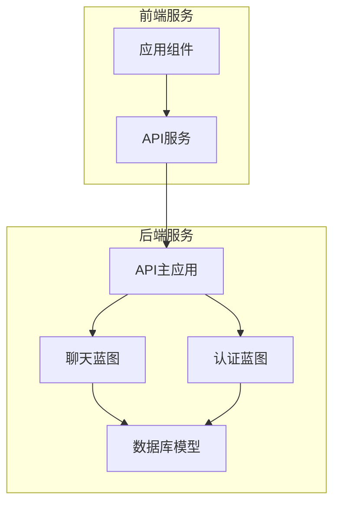
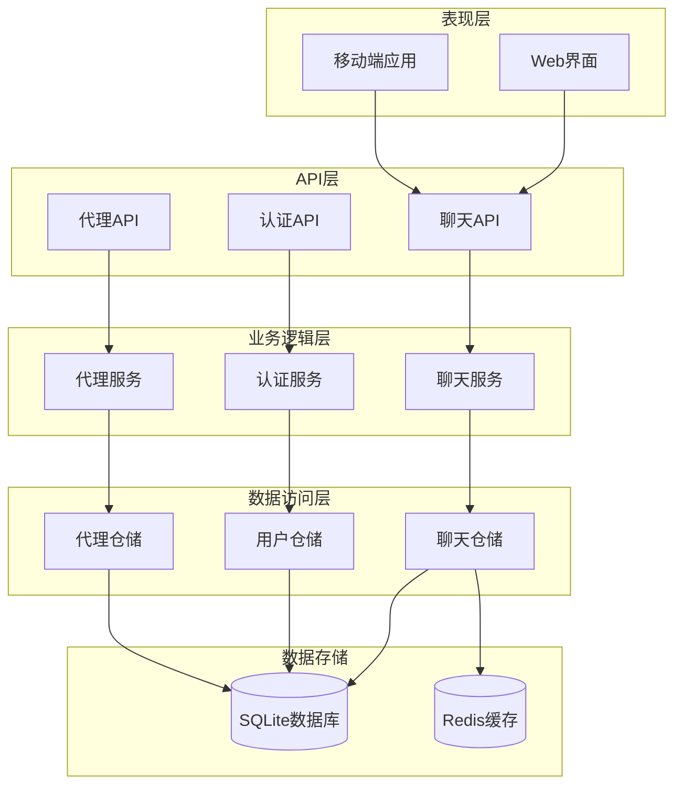
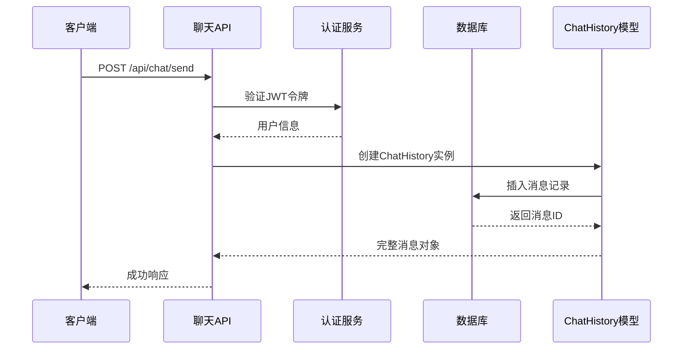
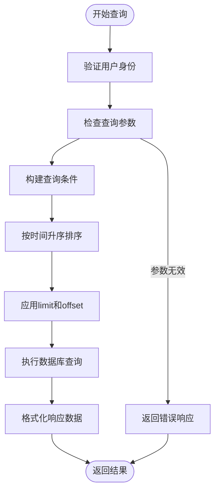
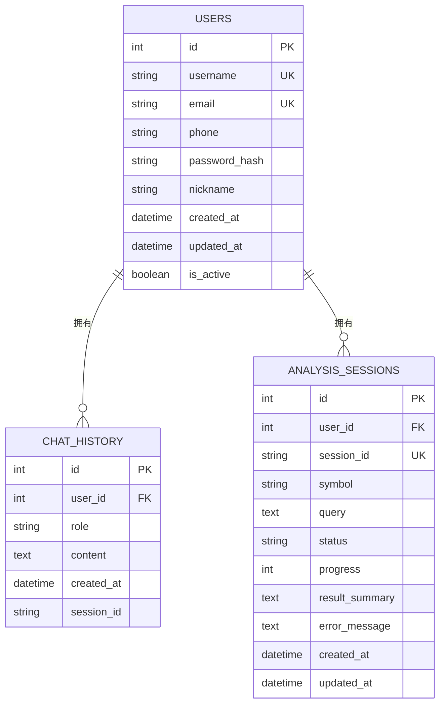
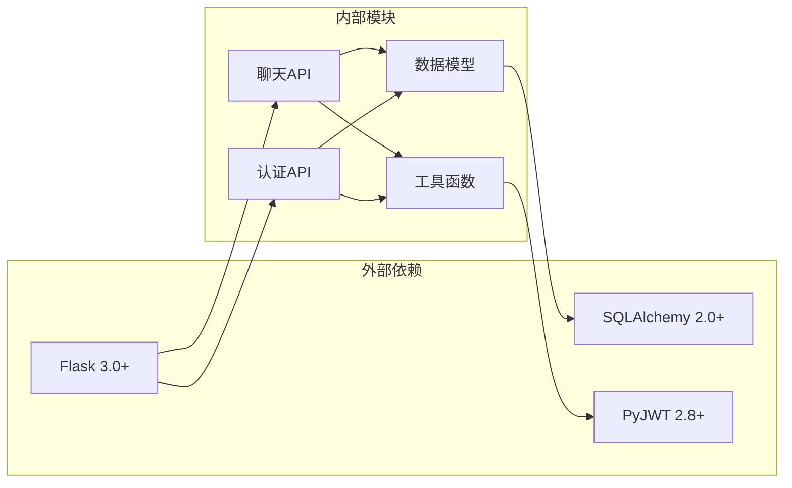

# 聊天接口

<cite>
**本文档引用的文件**
- [src/api/chat.py](file://src/api/chat.py)
- [src/api/main.py](file://src/api/main.py)
- [src/models/database.py](file://src/models/database.py)
- [src/api/auth.py](file://src/api/auth.py)
- [src/web/src/services/apiService.js](file://src/web/src/services/apiService.js)
- [src/web/src/services/apiClient.js](file://src/web/src/services/apiClient.js)
- [src/web/src/App.jsx](file://src/web/src/App.jsx)
- [src/utils/jwt_utils.py](file://src/utils/jwt_utils.py)
- [requirements.txt](file://requirements.txt)
</cite>

## 目录
1. [简介](#简介)
2. [项目结构](#项目结构)
3. [核心组件](#核心组件)
4. [架构概览](#架构概览)
5. [详细组件分析](#详细组件分析)
6. [依赖关系分析](#依赖关系分析)
7. [性能考虑](#性能考虑)
8. [故障排除指南](#故障排除指南)
9. [结论](#结论)
10. [附录](#附录)

## 简介
本文件为AI投资分析系统的聊天接口详细API文档。系统提供了完整的对话管理功能，包括消息发送、历史记录查询、会话管理等核心能力。本文档涵盖了所有聊天相关的API端点、数据格式、上下文管理、会话持久化、消息历史长度限制、历史记录查询参数、实时对话接口的连接建立、消息格式、心跳机制、断线重连策略，以及对话状态管理、并发处理、消息去重、隐私保护措施等内容。

## 项目结构
聊天接口位于后端Flask应用中，采用模块化设计，主要包含以下关键组件：



**图表来源**
- [src/api/main.py](file://src/api/main.py#L40-L56)
- [src/api/chat.py](file://src/api/chat.py#L17-L21)
- [src/api/auth.py](file://src/api/auth.py#L15-L15)

**章节来源**
- [src/api/main.py](file://src/api/main.py#L40-L56)
- [src/api/chat.py](file://src/api/chat.py#L1-L21)
- [src/api/auth.py](file://src/api/auth.py#L1-L15)

## 核心组件
聊天接口由多个核心组件构成，每个组件负责特定的功能领域：

### 聊天蓝图组件
- **消息发送组件**: 处理用户消息的接收和存储
- **历史记录组件**: 提供聊天历史的查询和管理
- **会话管理组件**: 管理会话列表和清理功能
- **简答组件**: 提供基于工具调用的简短问答功能

### 数据模型组件
- **用户模型**: 存储用户基本信息和认证数据
- **聊天历史模型**: 存储对话消息和元数据
- **分析会话模型**: 支持更复杂的分析流程

### 认证组件
- **JWT令牌管理**: 实现用户身份验证和授权
- **密码哈希**: 安全存储用户凭据
- **会话超时**: 基于时间的访问控制

**章节来源**
- [src/api/chat.py](file://src/api/chat.py#L17-L21)
- [src/models/database.py](file://src/models/database.py#L24-L86)
- [src/api/auth.py](file://src/api/auth.py#L18-L136)

## 架构概览
系统采用分层架构设计，确保了良好的可维护性和扩展性：



**图表来源**
- [src/api/main.py](file://src/api/main.py#L22-L29)
- [src/api/chat.py](file://src/api/chat.py#L8-L15)
- [src/models/database.py](file://src/models/database.py#L8-L17)

## 详细组件分析

### 消息发送接口 (POST /api/chat/send)
消息发送接口是聊天系统的核心入口，负责处理用户发送的消息并进行持久化存储。

#### 接口定义
- **方法**: POST
- **路径**: `/api/chat/send`
- **认证**: 需要有效的JWT令牌
- **内容类型**: application/json

#### 请求体格式
```javascript
{
  "content": "用户发送的消息内容",
  "session_id": "会话标识符",
  "role": "消息角色"
}
```

#### 响应格式
```javascript
{
  "message": "消息已发送",
  "id": "消息唯一标识",
  "created_at": "ISO格式的时间戳"
}
```

#### 处理流程


**图表来源**
- [src/api/chat.py](file://src/api/chat.py#L23-L56)
- [src/api/auth.py](file://src/api/auth.py#L121-L136)

#### 错误处理
- **401 未授权**: 无效或缺失的JWT令牌
- **400 参数错误**: 缺少必需的content字段
- **500 服务器错误**: 数据库操作失败

**章节来源**
- [src/api/chat.py](file://src/api/chat.py#L23-L56)
- [src/api/auth.py](file://src/api/auth.py#L121-L136)

### 历史记录接口 (GET /api/chat/history)
历史记录接口提供聊天历史的查询功能，支持分页和过滤。

#### 接口定义
- **方法**: GET
- **路径**: `/api/chat/history`
- **认证**: 需要有效的JWT令牌
- **查询参数**:
  - `session_id`: 会话标识符，默认值为"default"
  - `limit`: 返回记录数量，默认值为50
  - `offset`: 分页偏移量，默认值为0

#### 响应格式
```javascript
{
  "history": [
    {
      "id": "消息ID",
      "role": "消息角色",
      "content": "消息内容",
      "created_at": "ISO格式时间戳"
    }
  ],
  "count": 10,
  "session_id": "会话标识符"
}
```

#### 查询逻辑


**图表来源**
- [src/api/chat.py](file://src/api/chat.py#L59-L100)

#### 性能优化
- 使用索引优化查询性能
- 支持分页避免大量数据传输
- 时间戳索引加速排序操作

**章节来源**
- [src/api/chat.py](file://src/api/chat.py#L59-L100)
- [src/models/database.py](file://src/models/database.py#L40-L51)

### 会话管理接口
系统提供完整的会话管理功能，包括会话列表查询和历史清理。

#### 会话列表接口 (GET /api/chat/sessions)
```javascript
{
  "sessions": [
    {
      "session_id": "会话标识符",
      "last_message_time": "ISO格式时间戳"
    }
  ]
}
```

#### 清理接口 (DELETE /api/chat/clear)
- **查询参数**: `session_id` (可选，默认"default")

**章节来源**
- [src/api/chat.py](file://src/api/chat.py#L103-L168)

### 简短问答接口 (POST /api/chat/ask)
简短问答接口提供基于工具调用的智能回答功能。

#### 请求体格式
```javascript
{
  "content": "问题内容",
  "session_id": "会话标识符",
  "preferences": {
    "risk_preference": "风险偏好",
    "debug_mode": false,
    "app_mode": "应用模式"
  }
}
```

#### 响应格式
```javascript
{
  "message": "回答完成",
  "reply": "AI生成的回答内容",
  "session_id": "会话标识符"
}
```

**章节来源**
- [src/api/chat.py](file://src/api/chat.py#L171-L215)

## 依赖关系分析

### 数据模型关系


**图表来源**
- [src/models/database.py](file://src/models/database.py#L24-L86)

### 组件依赖关系


**图表来源**
- [requirements.txt](file://requirements.txt#L37-L41)
- [src/api/main.py](file://src/api/main.py#L22-L29)

**章节来源**
- [requirements.txt](file://requirements.txt#L1-L41)
- [src/models/database.py](file://src/models/database.py#L8-L17)

## 性能考虑
系统在设计时充分考虑了性能优化和可扩展性：

### 数据库优化
- **索引策略**: 在`user_id`、`session_id`、`created_at`字段上建立索引
- **查询优化**: 使用分页查询避免一次性加载大量数据
- **连接池**: 使用SQLAlchemy连接池管理数据库连接

### 缓存策略
- **会话缓存**: 热门会话数据缓存到内存中
- **查询结果缓存**: 对频繁查询的结果进行缓存
- **配置缓存**: 应用配置信息缓存

### 并发处理
- **线程安全**: 所有数据库操作都是线程安全的
- **事务管理**: 自动事务管理和回滚机制
- **错误隔离**: 单个请求失败不影响其他请求

## 故障排除指南

### 常见错误及解决方案

#### 认证相关错误
- **401 未授权**: 检查JWT令牌是否正确设置和未过期
- **403 禁止访问**: 确认用户账户状态正常

#### 数据库相关错误
- **500 服务器内部错误**: 检查数据库连接和权限
- **查询超时**: 优化查询条件和添加适当的索引

#### 网络相关错误
- **连接超时**: 检查服务器网络连接和防火墙设置
- **请求过大**: 减少单次请求的数据量

### 调试建议
1. **启用详细日志**: 设置`LOG_LEVEL=DEBUG`查看详细信息
2. **检查响应头**: 关注`Content-Type`和`Authorization`头
3. **验证数据格式**: 确保JSON数据格式正确
4. **监控数据库**: 查看慢查询日志

**章节来源**
- [src/api/main.py](file://src/api/main.py#L222-L234)

## 结论
AI投资分析系统的聊天接口提供了完整、可靠、高性能的对话管理功能。系统采用现代化的技术栈和最佳实践，确保了良好的用户体验和可维护性。通过合理的架构设计和性能优化，系统能够满足各种规模的应用需求。

## 附录

### 客户端集成示例

#### JavaScript集成示例
```javascript
// 发送消息
await chatService.send("你好，我想了解A股市场");

// 获取历史记录
const history = await chatService.getHistory("default", 50, 0);

// 获取会话列表
const sessions = await chatService.getSessions();

// 清空历史记录
await chatService.clear("default");
```

#### React组件集成示例
```jsx
const ChatComponent = () => {
  const [messages, setMessages] = useState([]);
  const [inputValue, setInputValue] = useState('');
  
  const sendMessage = async () => {
    try {
      const response = await chatService.send(inputValue, 'default');
      setMessages([...messages, response]);
      setInputValue('');
    } catch (error) {
      console.error('发送失败:', error);
    }
  };
  
  return (
    <div>
      {messages.map((msg, index) => (
        <div key={index}>{msg.content}</div>
      ))}
      <input 
        value={inputValue}
        onChange={(e) => setInputValue(e.target.value)}
      />
      <button onClick={sendMessage}>发送</button>
    </div>
  );
};
```

### API端点汇总

| 端点 | 方法 | 功能 | 认证 |
|------|------|------|------|
| `/api/chat/send` | POST | 发送消息 | 是 |
| `/api/chat/history` | GET | 获取历史记录 | 是 |
| `/api/chat/sessions` | GET | 获取会话列表 | 是 |
| `/api/chat/clear` | DELETE | 清空历史记录 | 是 |
| `/api/chat/ask` | POST | 简短问答 | 是 |

### 配置选项

#### 环境变量
- `JWT_SECRET_KEY`: JWT密钥，默认值为"your-secret-key-change-in-production"
- `LOG_LEVEL`: 日志级别，默认值为"INFO"
- `FLASK_DEBUG`: 调试模式，默认值为"1"

#### 数据库配置
- **最大连接数**: 20
- **连接超时**: 60秒
- **查询超时**: 30秒

**章节来源**
- [src/web/src/services/apiService.js](file://src/web/src/services/apiService.js#L1-L175)
- [src/web/src/services/apiClient.js](file://src/web/src/services/apiClient.js#L94-L129)
- [src/web/src/App.jsx](file://src/web/src/App.jsx#L298-L349)
- [src/utils/jwt_utils.py](file://src/utils/jwt_utils.py#L13-L26)