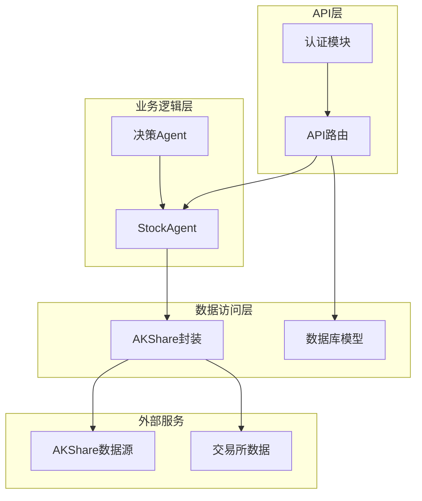
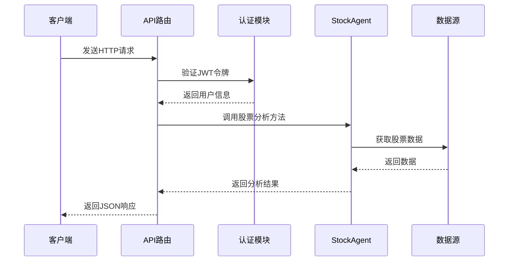
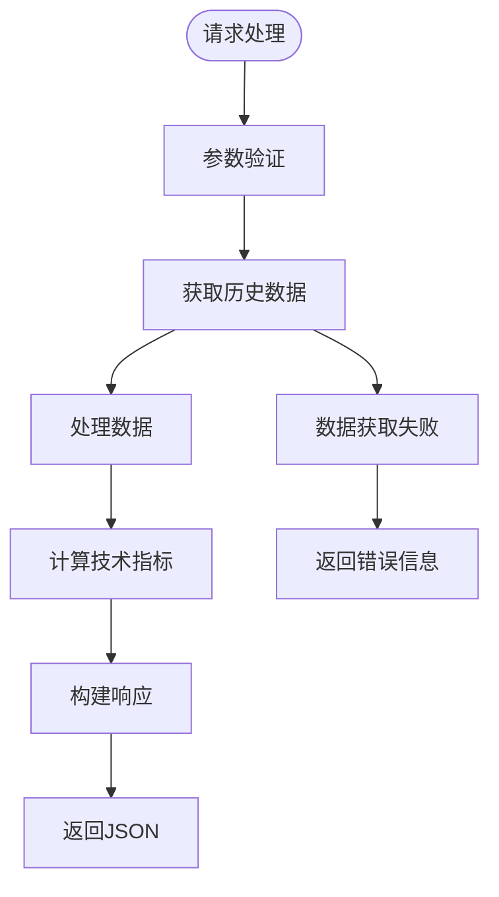
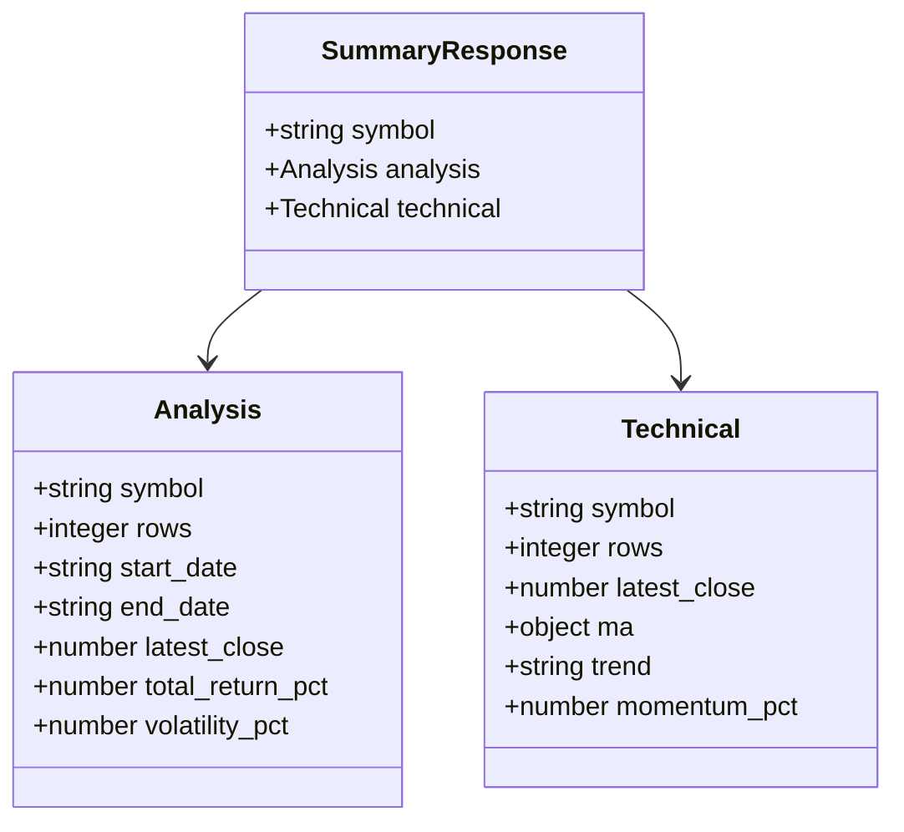
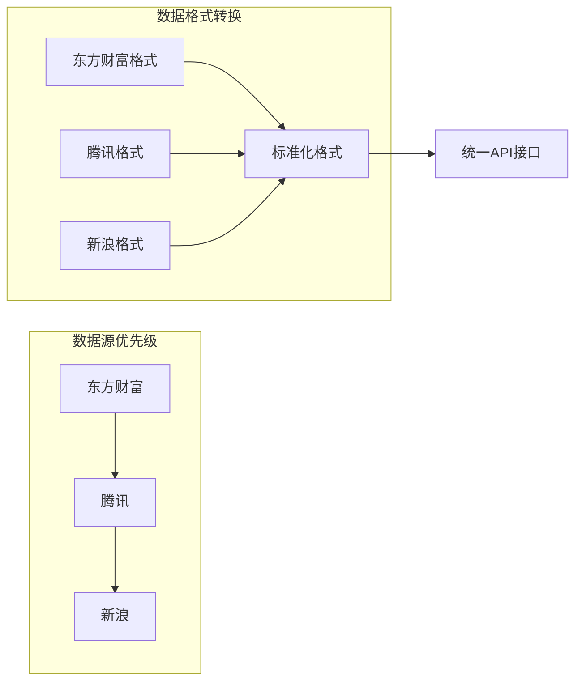
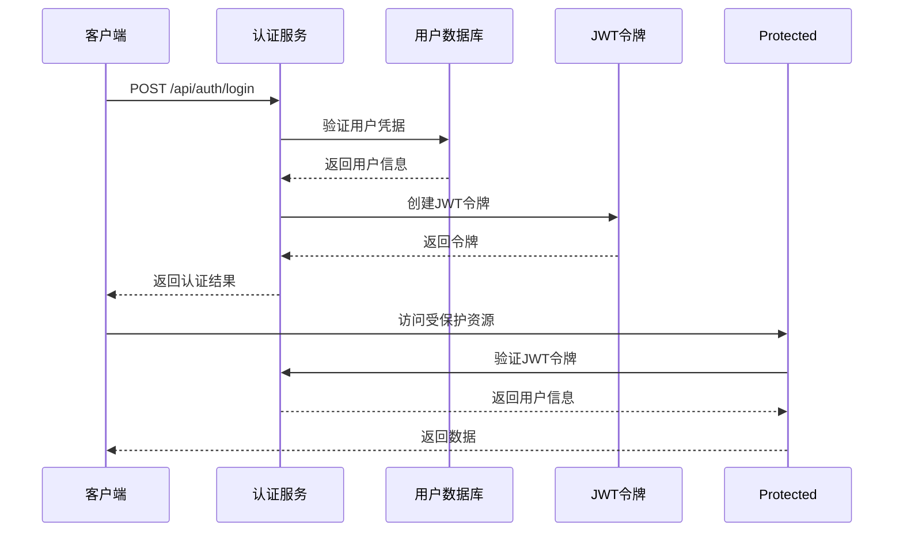
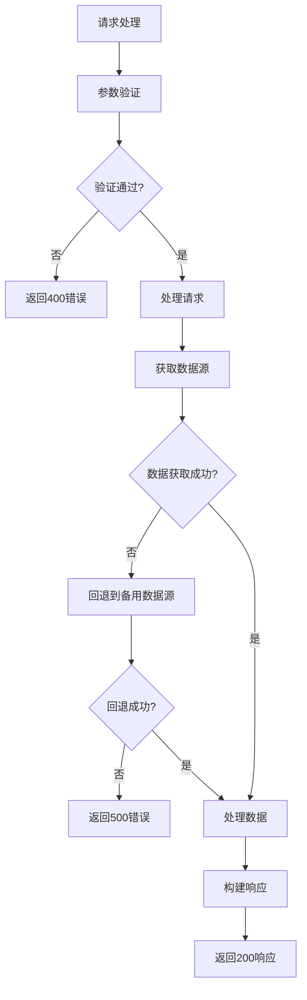

# 股票数据接口

<cite>
**本文档引用的文件**
- [src/api/stock.py](file://src/api/stock.py)
- [src/api/main.py](file://src/api/main.py)
- [src/agent/stock_agent.py](file://src/agent/stock_agent.py)
- [src/stock/stock_api.py](file://src/stock/stock_api.py)
- [src/api/auth.py](file://src/api/auth.py)
- [src/models/database.py](file://src/models/database.py)
- [.env](file://.env)
- [.env.example](file://.env.example)
- [src/web/src/services/apiService.js](file://src/web/src/services/apiService.js)
</cite>

## 目录
1. [简介](#简介)
2. [项目结构](#项目结构)
3. [核心组件](#核心组件)
4. [架构概览](#架构概览)
5. [详细组件分析](#详细组件分析)
6. [依赖关系分析](#依赖关系分析)
7. [性能考虑](#性能考虑)
8. [故障排除指南](#故障排除指南)
9. [结论](#结论)

## 简介

本文档详细描述了AI投资分析系统的股票数据接口，包括股票分析接口、历史数据接口和股票搜索接口的完整API文档。该系统基于Flask框架构建，集成了AKShare数据源，提供了完整的股票数据分析功能。

## 项目结构

AI投资分析系统采用模块化架构设计，主要包含以下核心模块：

**图表来源**
- [src/api/stock.py](file://src/api/stock.py#L1-L126)
- [src/agent/stock_agent.py](file://src/agent/stock_agent.py#L1-L572)
- [src/stock/stock_api.py](file://src/stock/stock_api.py#L1-L425)

**章节来源**
- [src/api/stock.py](file://src/api/stock.py#L1-L126)
- [src/agent/stock_agent.py](file://src/agent/stock_agent.py#L1-L572)
- [src/stock/stock_api.py](file://src/stock/stock_api.py#L1-L425)

## 核心组件

### API路由模块

系统提供四个主要的股票相关API端点：

1. **股票分析接口** (`/api/stock/analyze`)
2. **技术指标接口** (`/api/stock/technical`)
3. **历史行情接口** (`/api/stock/history`)
4. **股票汇总接口** (`/api/stock/summary`)

### 认证系统

所有股票相关接口都需要有效的用户认证，系统使用JWT令牌进行身份验证。

### 数据代理层

StockAgent作为核心数据代理，负责：
- 股票代码标准化处理
- 多数据源回退机制
- 技术指标计算
- 数据分析和聚合

**章节来源**
- [src/api/stock.py](file://src/api/stock.py#L16-L126)
- [src/api/auth.py](file://src/api/auth.py#L121-L136)
- [src/agent/stock_agent.py](file://src/agent/stock_agent.py#L30-L572)

## 架构概览

系统采用分层架构设计，确保了良好的可维护性和扩展性：

**图表来源**
- [src/api/stock.py](file://src/api/stock.py#L16-L126)
- [src/api/auth.py](file://src/api/auth.py#L121-L136)
- [src/agent/stock_agent.py](file://src/agent/stock_agent.py#L30-L572)

## 详细组件分析

### 股票分析接口

#### 接口定义

**端点**: `GET /api/stock/analyze`

**功能**: 提供股票历史行情的综合分析，包括实时价格、技术指标和财务数据。

#### 请求参数

| 参数名 | 类型 | 必填 | 默认值 | 描述 |
|--------|------|------|--------|------|
| symbol | string | 是 | 无 | 股票代码（支持多种格式） |
| start_date | string | 否 | 90天前 | 开始日期，格式YYYYMMDD |
| end_date | string | 否 | 今日 | 结束日期，格式YYYYMMDD |
| period | string | 否 | daily | 时间周期（daily/weekly/monthly） |
| adjust | string | 否 | 空 | 复权类型（""/qfq/hfq） |

#### 响应格式

**图表来源**
- [src/agent/stock_agent.py](file://src/agent/stock_agent.py#L305-L432)

#### 响应数据结构

| 字段名 | 类型 | 描述 | 精度 |
|--------|------|------|------|
| symbol | string | 股票代码 | 原始格式 |
| rows | integer | 数据行数 | 整数 |
| start_date | string | 开始日期 | YYYYMMDD |
| end_date | string | 结束日期 | YYYYMMDD |
| latest_close | number | 最新收盘价 | 保留4位小数 |
| first_close | number | 首日收盘价 | 保留4位小数 |
| total_return_pct | number | 总收益率 | 保留4位小数 |
| latest_open | number | 最新开盘价 | 保留4位小数 |
| high_max | number | 历史最高价 | 保留4位小数 |
| low_min | number | 历史最低价 | 保留4位小数 |
| latest_change_pct | number | 最新涨跌幅 | 保留4位小数 |
| volatility_pct | number | 波动率 | 保留4位小数 |
| avg_volume | number | 平均成交量 | 保留4位小数 |
| avg_amount | number | 平均成交额 | 保留4位小数 |

#### 数据精度说明

- **价格类数据**: 保留4位小数
- **百分比数据**: 保留4位小数
- **成交量数据**: 保留4位小数
- **日期格式**: YYYYMMDD字符串

**章节来源**
- [src/api/stock.py](file://src/api/stock.py#L16-L44)
- [src/agent/stock_agent.py](file://src/agent/stock_agent.py#L305-L432)

### 技术指标接口

#### 接口定义

**端点**: `GET /api/stock/technical`

**功能**: 计算股票的技术指标，包括移动平均线、趋势分析和动量指标。

#### 请求参数

| 参数名 | 类型 | 必填 | 默认值 | 描述 |
|--------|------|------|--------|------|
| symbol | string | 是 | 无 | 股票代码 |
| start_date | string | 否 | 90天前 | 开始日期，格式YYYYMMDD |
| end_date | string | 否 | 今日 | 结束日期，格式YYYYMMDD |
| period | string | 否 | daily | 时间周期 |
| adjust | string | 否 | 空 | 复权类型 |
| ma_windows | array | 否 | [5,10,20,60] | 移动平均线窗口 |

#### 响应格式

| 字段名 | 类型 | 描述 |
|--------|------|------|
| symbol | string | 股票代码 |
| rows | integer | 数据行数 |
| latest_close | number | 最新收盘价 |
| ma | object | 移动平均值集合 |
| trend | string | 趋势方向（上行/下行/横盘） |
| momentum_pct | number | 动量百分比 |

**章节来源**
- [src/api/stock.py](file://src/api/stock.py#L46-L76)
- [src/agent/stock_agent.py](file://src/agent/stock_agent.py#L434-L552)

### 历史行情接口

#### 接口定义

**端点**: `GET /api/stock/history`

**功能**: 获取指定时间段内的股票历史行情数据摘要。

#### 请求参数

| 参数名 | 类型 | 必填 | 默认值 | 描述 |
|--------|------|------|--------|------|
| symbol | string | 是 | 无 | 股票代码 |
| start_date | string | 否 | 90天前 | 开始日期，格式YYYYMMDD |
| end_date | string | 否 | 今日 | 结束日期，格式YYYYMMDD |
| period | string | 否 | daily | 时间周期 |
| adjust | string | 否 | 空 | 复权类型 |

#### 响应格式

| 字段名 | 类型 | 描述 |
|--------|------|------|
| symbol | string | 股票代码 |
| rows | integer | 数据行数 |
| columns | array | 列名数组 |
| head | array | 前3行数据样本 |

#### 数据点数量限制

- **默认数据范围**: 90个交易日
- **最大数据范围**: 可根据具体需求调整
- **数据完整性**: 系统自动处理缺失数据

**章节来源**
- [src/api/stock.py](file://src/api/stock.py#L78-L106)
- [src/agent/stock_agent.py](file://src/agent/stock_agent.py#L68-L128)

### 股票汇总接口

#### 接口定义

**端点**: `GET /api/stock/summary`

**功能**: 综合返回股票的基础信息、技术分析和财务数据。

#### 请求参数

| 参数名 | 类型 | 必填 | 默认值 | 描述 |
|--------|------|------|--------|------|
| symbol | string | 是 | 无 | 股票代码 |

#### 响应格式

**图表来源**
- [src/agent/stock_agent.py](file://src/agent/stock_agent.py#L554-L572)

**章节来源**
- [src/api/stock.py](file://src/api/stock.py#L108-L126)
- [src/agent/stock_agent.py](file://src/agent/stock_agent.py#L554-L572)

## 依赖关系分析

### 数据源依赖

系统采用多数据源回退机制，确保数据获取的可靠性：

**图表来源**
- [src/agent/stock_agent.py](file://src/agent/stock_agent.py#L129-L168)
- [src/stock/stock_api.py](file://src/stock/stock_api.py#L212-L283)

### 认证依赖

**图表来源**
- [src/api/auth.py](file://src/api/auth.py#L78-L118)
- [src/models/database.py](file://src/models/database.py#L24-L37)

**章节来源**
- [src/agent/stock_agent.py](file://src/agent/stock_agent.py#L129-L168)
- [src/api/auth.py](file://src/api/auth.py#L1-L136)
- [src/models/database.py](file://src/models/database.py#L1-L86)

## 性能考虑

### 数据获取优化

1. **多数据源回退**: 当主数据源失败时自动切换到备用数据源
2. **代理配置**: 支持禁用代理以提高访问速度
3. **缓存机制**: 决策Agent实现了工具结果缓存

### 错误处理策略

**图表来源**
- [src/agent/stock_agent.py](file://src/agent/stock_agent.py#L129-L168)

### API限流

系统当前未实现内置的API限流机制，建议在生产环境中添加以下限流策略：

1. **基于IP的请求频率限制**
2. **基于用户的API调用配额**
3. **速率限制中间件**

## 故障排除指南

### 常见问题及解决方案

#### 数据获取失败

**症状**: API返回错误信息或空数据

**可能原因**:
1. 网络连接问题
2. 数据源API限制
3. 股票代码格式不正确
4. 日期范围超出数据源支持范围

**解决步骤**:
1. 验证网络连接状态
2. 检查股票代码格式（支持多种格式）
3. 缩短日期范围
4. 稍后重试请求

#### 认证失败

**症状**: 返回401未授权错误

**解决方法**:
1. 确认JWT令牌有效性
2. 检查令牌格式（Bearer token）
3. 重新登录获取新令牌

#### 数据源超时

**症状**: 请求处理时间过长

**解决方法**:
1. 设置合理的超时时间
2. 实现重试机制
3. 考虑添加本地缓存

**章节来源**
- [src/agent/stock_agent.py](file://src/agent/stock_agent.py#L103-L114)
- [src/api/auth.py](file://src/api/auth.py#L121-L136)

## 结论

AI投资分析系统的股票数据接口提供了完整的股票数据分析功能，具有以下特点：

1. **多数据源支持**: 通过AKShare集成多个数据源，确保数据获取的可靠性
2. **灵活的参数配置**: 支持多种时间周期、复权类型和分析维度
3. **标准化的数据格式**: 统一的响应格式便于前端展示和后续处理
4. **完善的错误处理**: 包含多层错误处理和回退机制

建议在生产环境中进一步完善：
- 添加API限流和监控机制
- 实现更完善的缓存策略
- 增强数据质量验证
- 提供更详细的错误诊断信息