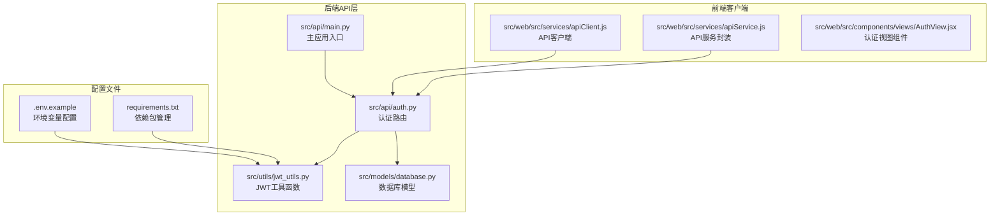
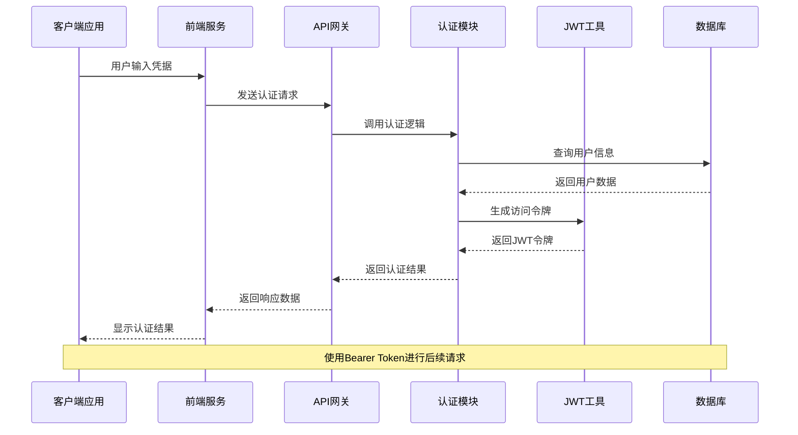
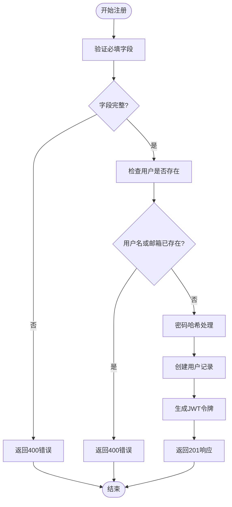
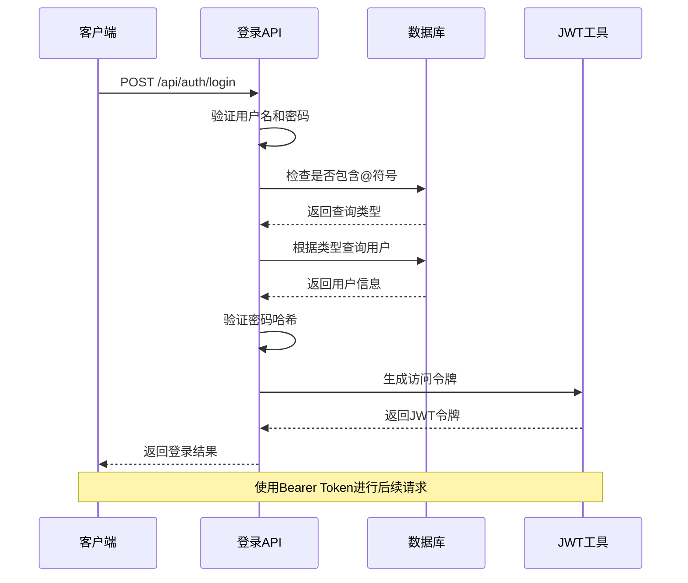
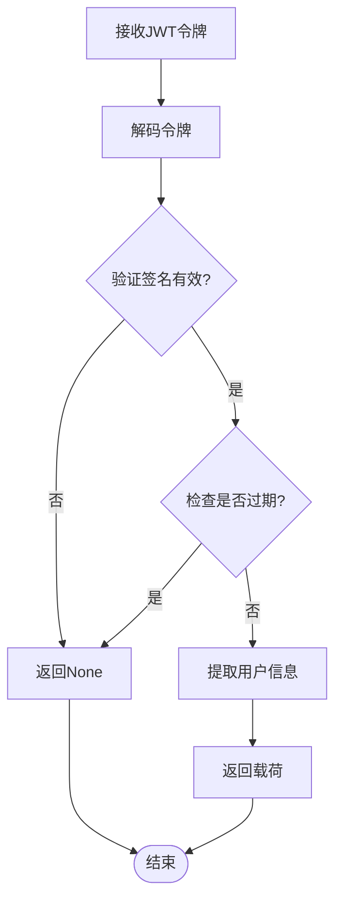
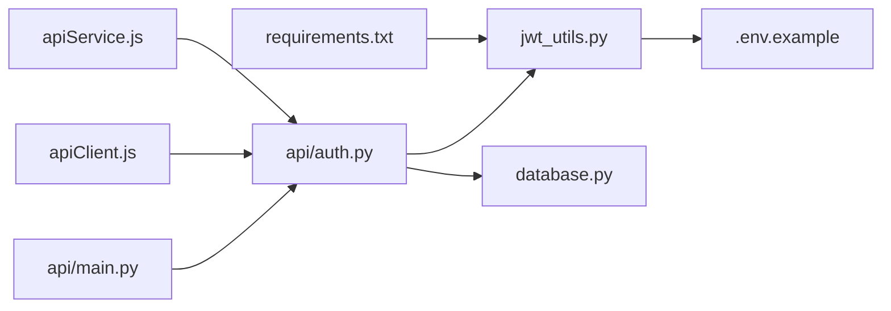

# 认证接口

<cite>
**本文档引用的文件**
- [src/api/auth.py](file://src/api/auth.py)
- [src/utils/jwt_utils.py](file://src/utils/jwt_utils.py)
- [src/models/database.py](file://src/models/database.py)
- [src/api/main.py](file://src/api/main.py)
- [src/web/src/services/apiClient.js](file://src/web/src/services/apiClient.js)
- [src/web/src/services/apiService.js](file://src/web/src/services/apiService.js)
- [.env.example](file://.env.example)
- [requirements.txt](file://requirements.txt)
</cite>

## 目录
1. [简介](#简介)
2. [项目结构](#项目结构)
3. [核心组件](#核心组件)
4. [架构概览](#架构概览)
5. [详细组件分析](#详细组件分析)
6. [依赖关系分析](#依赖关系分析)
7. [性能考虑](#性能考虑)
8. [故障排除指南](#故障排除指南)
9. [结论](#结论)

## 简介

本文件为AI投资分析系统的认证接口详细API文档，涵盖用户注册和登录功能的完整技术规范。该系统采用Flask作为后端框架，JWT（JSON Web Token）进行身份认证，SQLite作为数据库存储用户信息。

## 项目结构

认证接口位于后端API模块中，主要涉及以下关键文件：



**图表来源**
- [src/api/auth.py](file://src/api/auth.py#L1-L136)
- [src/utils/jwt_utils.py](file://src/utils/jwt_utils.py#L1-L36)
- [src/models/database.py](file://src/models/database.py#L1-L86)
- [src/api/main.py](file://src/api/main.py#L1-L243)

**章节来源**
- [src/api/auth.py](file://src/api/auth.py#L1-L136)
- [src/api/main.py](file://src/api/main.py#L50-L56)

## 核心组件

### 用户模型设计

系统使用SQLAlchemy ORM定义用户模型，包含以下核心字段：

| 字段名 | 类型 | 约束 | 描述 |
|--------|------|------|------|
| id | Integer | 主键, 自增 | 用户唯一标识符 |
| username | String(50) | 唯一, 非空, 索引 | 用户名，唯一约束 |
| email | String(100) | 唯一, 非空, 索引 | 邮箱地址，唯一约束 |
| phone | String(30) | 可空, 索引 | 电话号码 |
| password_hash | String(255) | 非空 | 密码哈希值 |
| nickname | String(50) | 非空 | 昵称 |
| created_at | DateTime | 默认值 | 创建时间 |
| updated_at | DateTime | 默认值, 更新时自动 | 最后更新时间 |
| is_active | Boolean | 默认值 | 账户状态 |

**章节来源**
- [src/models/database.py](file://src/models/database.py#L24-L38)

### JWT令牌配置

系统使用PyJWT库实现令牌管理，配置参数如下：

- **算法**: HS256 (HMAC SHA256)
- **密钥**: 从环境变量JWT_SECRET_KEY读取，默认值为"your-secret-key-change-in-production"
- **有效期**: 7天 (10080分钟)
- **载荷**: 包含user_id和username

**章节来源**
- [src/utils/jwt_utils.py](file://src/utils/jwt_utils.py#L13-L15)
- [src/utils/jwt_utils.py](file://src/utils/jwt_utils.py#L18-L26)

## 架构概览

认证系统的整体架构采用分层设计，从前端到后端的数据流向如下：



**图表来源**
- [src/web/src/services/apiClient.js](file://src/web/src/services/apiClient.js#L4-L8)
- [src/api/auth.py](file://src/api/auth.py#L23-L76)
- [src/utils/jwt_utils.py](file://src/utils/jwt_utils.py#L18-L26)

## 详细组件分析

### 注册接口 (POST /api/auth/register)

#### 请求参数

| 参数名 | 必填 | 类型 | 描述 | 示例 |
|--------|------|------|------|------|
| username | 是 | String | 用户名 | john_doe |
| email | 是 | String | 邮箱地址 | john@example.com |
| password | 是 | String | 密码 | securePassword123 |
| nickname | 否 | String | 昵称，默认使用用户名 | John Doe |
| phone | 否 | String | 电话号码 | 13800001111 |

#### 响应格式

**成功响应 (201 Created)**:
```json
{
  "message": "注册成功",
  "token": "eyJhbGciOiJIUzI1NiIsInR5cCI6IkpXVCJ9...",
  "user": {
    "id": 1,
    "username": "john_doe",
    "email": "john@example.com",
    "phone": "13800001111",
    "nickname": "John Doe"
  }
}
```

**错误响应 (400 Bad Request)**:
```json
{
  "error": "缺少必要字段"
}
```

**错误响应 (400 Bad Request - 用户已存在)**:
```json
{
  "error": "用户名或邮箱已存在"
}
```

**错误响应 (500 Internal Server Error)**:
```json
{
  "error": "注册失败: 数据库错误详情"
}
```

#### 认证流程



**图表来源**
- [src/api/auth.py](file://src/api/auth.py#L23-L76)

**章节来源**
- [src/api/auth.py](file://src/api/auth.py#L23-L76)

### 登录接口 (POST /api/auth/login)

#### 认证流程

系统支持用户名或邮箱两种登录方式，具体流程如下：



**图表来源**
- [src/api/auth.py](file://src/api/auth.py#L78-L118)
- [src/utils/jwt_utils.py](file://src/utils/jwt_utils.py#L18-L26)

#### 请求参数

| 参数名 | 必填 | 类型 | 描述 | 示例 |
|--------|------|------|------|------|
| username | 是 | String | 用户名或邮箱 | john_doe 或 john@example.com |
| password | 是 | String | 密码 | securePassword123 |

#### 响应格式

**成功响应 (200 OK)**:
```json
{
  "message": "登录成功",
  "token": "eyJhbGciOiJIUzI1NiIsInR5cCI6IkpXVCJ9...",
  "user": {
    "id": 1,
    "username": "john_doe",
    "email": "john@example.com",
    "phone": "13800001111",
    "nickname": "John Doe"
  }
}
```

**错误响应 (400 Bad Request)**:
```json
{
  "error": "缺少用户名或密码"
}
```

**错误响应 (401 Unauthorized)**:
```json
{
  "error": "用户名或密码错误"
}
```

**错误响应 (401 Unauthorized - 账户禁用)**:
```json
{
  "error": "账户已被禁用"
}
```

**错误响应 (500 Internal Server Error)**:
```json
{
  "error": "登录失败: 数据库查询错误"
}
```

**章节来源**
- [src/api/auth.py](file://src/api/auth.py#L78-L118)

### JWT令牌管理

#### 令牌生成

系统使用PyJWT库生成JWT令牌，包含以下步骤：
1. 复制传入的数据载荷
2. 计算过期时间（当前时间+7天）
3. 添加exp声明到载荷
4. 使用HS256算法和密钥进行签名

#### 令牌验证



**图表来源**
- [src/utils/jwt_utils.py](file://src/utils/jwt_utils.py#L29-L36)

**章节来源**
- [src/utils/jwt_utils.py](file://src/utils/jwt_utils.py#L18-L36)

## 依赖关系分析

### 外部依赖

系统的关键外部依赖包括：

| 依赖包 | 版本要求 | 用途 |
|--------|----------|------|
| flask | >=3.0.0 | Web框架 |
| flask-cors | >=4.0.0 | 跨域支持 |
| sqlalchemy | >=2.0.0 | ORM数据库操作 |
| pyjwt | >=2.8.0 | JWT令牌处理 |
| cryptography | >=42.0.0 | 加密功能 |
| pymysql | >=1.1.0 | MySQL连接 |

### 内部模块依赖



**图表来源**
- [src/api/auth.py](file://src/api/auth.py#L8-L13)
- [src/api/main.py](file://src/api/main.py#L22-L29)
- [src/web/src/services/apiClient.js](file://src/web/src/services/apiClient.js#L1-L8)

**章节来源**
- [requirements.txt](file://requirements.txt#L37-L41)
- [src/api/auth.py](file://src/api/auth.py#L8-L13)

## 性能考虑

### 数据库优化

- **索引策略**: 用户名、邮箱、电话号码都建立了数据库索引，提高查询性能
- **事务管理**: 使用上下文管理器确保数据库事务的正确提交和回滚
- **连接池**: SQLAlchemy提供连接池管理，减少连接开销

### JWT性能优化

- **令牌有效期**: 7天的有效期平衡了安全性与用户体验
- **内存缓存**: JWT解码结果可缓存，避免重复计算
- **算法选择**: HS256算法相比RS256更轻量级

### 前端性能

- **本地存储**: 使用localStorage存储令牌，避免每次请求重新认证
- **请求合并**: 前端服务封装了多个API调用，减少网络往返

## 故障排除指南

### 常见错误码说明

| 状态码 | 错误类型 | 可能原因 | 解决方案 |
|--------|----------|----------|----------|
| 400 | Bad Request | 缺少必要字段或数据格式错误 | 检查请求体中的必需字段 |
| 401 | Unauthorized | 认证失败或令牌无效 | 验证用户名密码或重新登录 |
| 409 | Conflict | 用户名或邮箱已存在 | 更换用户名或邮箱 |
| 500 | Internal Server Error | 服务器内部错误 | 检查服务器日志和数据库连接 |

### 安全问题排查

#### 密码安全
- **哈希算法**: 使用SHA-256进行密码哈希，但建议升级到bcrypt
- **盐值缺失**: 当前实现缺少随机盐值，存在彩虹表攻击风险
- **传输安全**: 建议启用HTTPS强制传输加密

#### 令牌安全
- **密钥管理**: 生产环境中必须设置强随机的JWT_SECRET_KEY
- **令牌存储**: 建议使用HttpOnly Cookie替代localStorage
- **刷新机制**: 当前缺少刷新令牌机制，建议实现短期访问令牌+长期刷新令牌

### 前端集成问题

#### 令牌传递
- **Authorization头格式**: 必须使用"Bearer "前缀
- **本地存储**: 确保令牌正确存储在localStorage中
- **请求拦截**: 前端需要自动为受保护的请求添加认证头

**章节来源**
- [src/api/auth.py](file://src/api/auth.py#L121-L136)
- [src/web/src/services/apiClient.js](file://src/web/src/services/apiClient.js#L4-L8)

## 结论

本认证接口实现了基本的用户注册和登录功能，采用JWT进行无状态认证。系统具有以下特点：

**优势**:
- 清晰的分层架构设计
- 完整的错误处理机制
- 前后端分离的现代化架构
- 良好的扩展性设计

**改进建议**:
- 升级密码哈希算法至bcrypt
- 实现HTTPS强制传输
- 添加令牌刷新机制
- 增强安全审计功能
- 实现多因素认证支持

该系统为AI投资分析平台提供了可靠的身份认证基础，可根据业务需求进一步完善安全性和功能性。