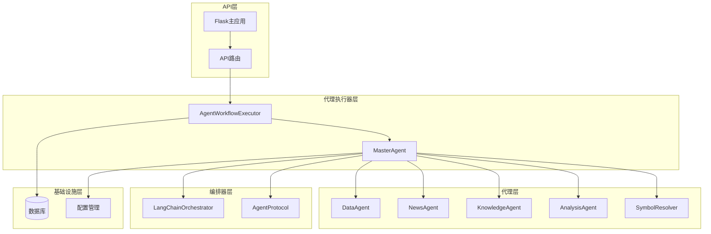
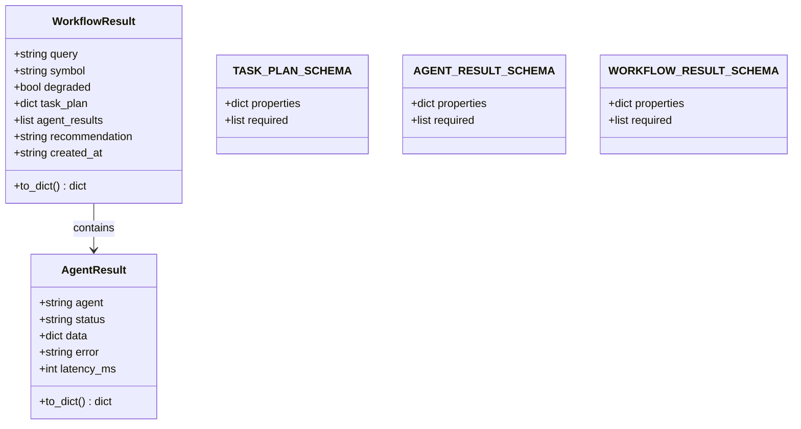
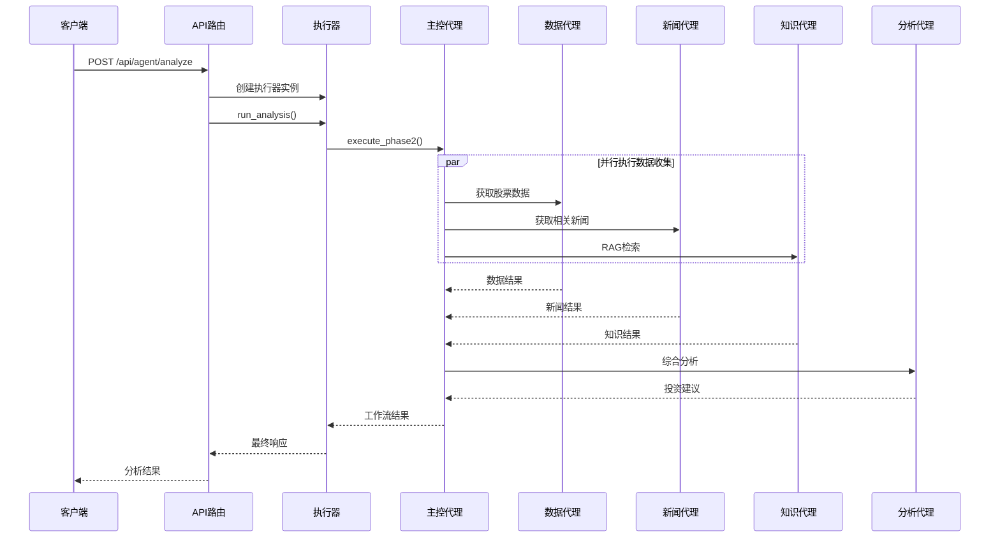
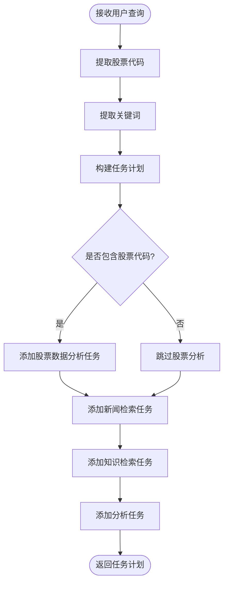
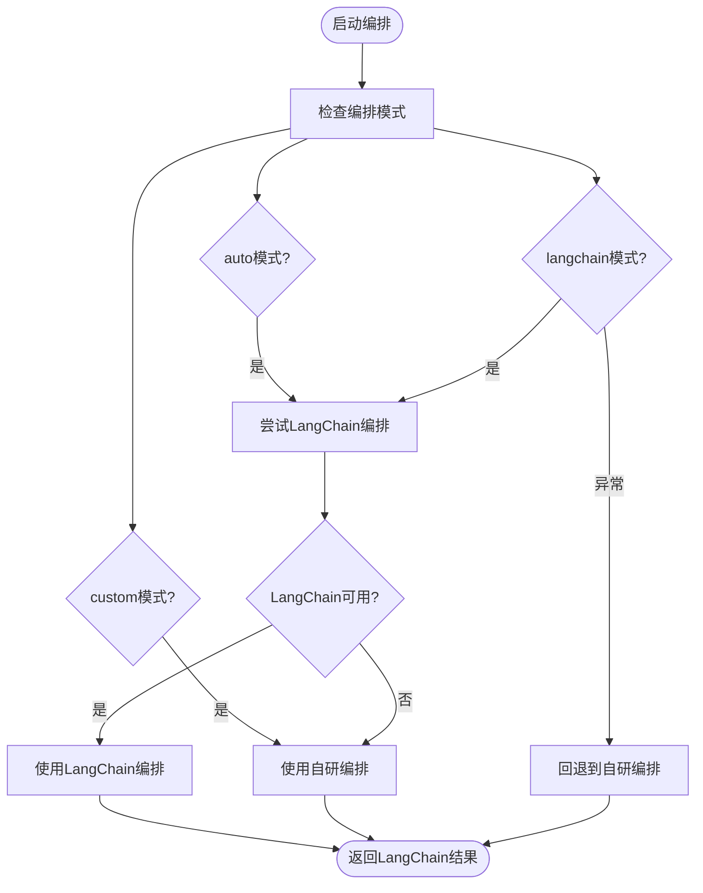
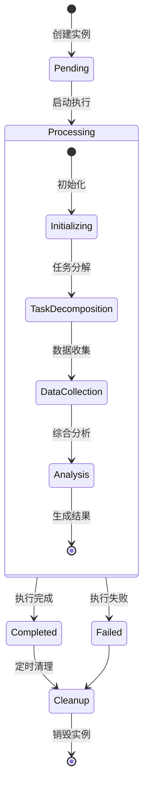
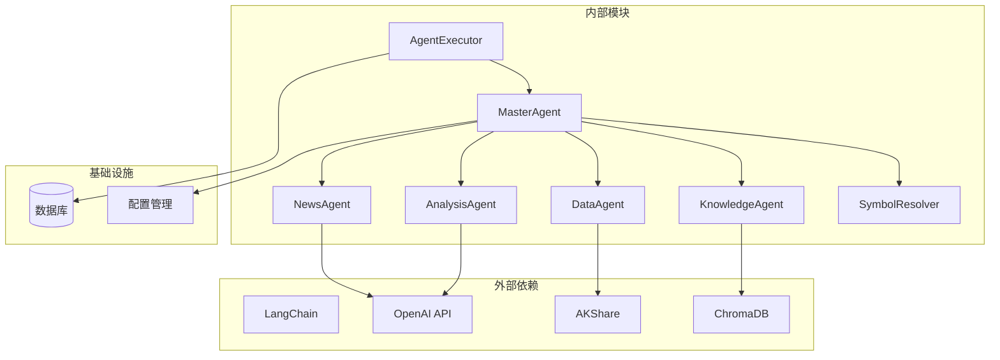

# 代理执行器

<cite>
**本文档引用的文件**
- [agent_protocol.py](file://src/agent/agent_protocol.py)
- [master_agent.py](file://src/agent/master_agent.py)
- [langchain_orchestrator.py](file://src/agent/langchain_orchestrator.py)
- [agent_executor.py](file://src/api/agent_executor.py)
- [analysis_agent.py](file://src/agent/analysis_agent.py)
- [data_agent.py](file://src/agent/data_agent.py)
- [news_agent.py](file://src/agent/news_agent.py)
- [knowledge_agent.py](file://src/agent/knowledge_agent.py)
- [symbol_resolver.py](file://src/agent/symbol_resolver.py)
- [llm_common.py](file://src/agent/llm_common.py)
- [main.py](file://src/api/main.py)
- [agent.py](file://src/api/agent.py)
- [database.py](file://src/models/database.py)
- [test_master_agent.py](file://src/agent/test/test_master_agent.py)
- [test_symbol_resolver.py](file://src/agent/test/test_symbol_resolver.py)
</cite>

## 目录
1. [简介](#简介)
2. [项目结构](#项目结构)
3. [核心组件](#核心组件)
4. [架构概览](#架构概览)
5. [详细组件分析](#详细组件分析)
6. [依赖关系分析](#依赖关系分析)
7. [性能考虑](#性能考虑)
8. [故障排除指南](#故障排除指南)
9. [结论](#结论)

## 简介

代理执行器是AI投资分析系统的核心组件，负责协调多个专业代理（Agent）完成复杂的股票分析任务。该系统采用多代理协作架构，支持实时股票数据获取、新闻信息检索、知识库RAG检索和智能分析决策。

系统提供了两种编排模式：LangChain AgentExecutor编排器和自研编排器，具备自动回退机制，确保在不同环境下都能稳定运行。每个代理都有明确的职责分工，通过统一的协议规范实现标准化输出。

## 项目结构

**图表来源**
- [agent_executor.py:25-430](file://src/api/agent_executor.py#L25-L430)
- [master_agent.py:25-447](file://src/agent/master_agent.py#L25-L447)
- [main.py:40-322](file://src/api/main.py#L40-L322)

**章节来源**
- [agent_executor.py:25-430](file://src/api/agent_executor.py#L25-L430)
- [master_agent.py:25-447](file://src/agent/master_agent.py#L25-L447)
- [main.py:40-322](file://src/api/main.py#L40-L322)

## 核心组件

### Agent协议规范

系统定义了统一的代理协议，确保不同代理之间的输出格式一致性：

**图表来源**
- [agent_protocol.py:74-116](file://src/agent/agent_protocol.py#L74-L116)

### 代理执行器

AgentWorkflowExecutor是整个系统的核心执行器，负责：

- **会话管理**：维护用户会话状态和进度
- **异步执行**：支持多任务并发处理
- **状态跟踪**：实时记录执行进度和日志
- **结果聚合**：收集各代理的执行结果

**章节来源**
- [agent_executor.py:25-430](file://src/api/agent_executor.py#L25-L430)

## 架构概览

**图表来源**
- [agent_executor.py:262-349](file://src/api/agent_executor.py#L262-L349)
- [master_agent.py:322-414](file://src/agent/master_agent.py#L322-L414)

## 详细组件分析

### 主控代理（MasterAgent）

主控代理是整个多代理系统的协调者，负责：

#### 任务规划

**图表来源**
- [master_agent.py:138-154](file://src/agent/master_agent.py#L138-L154)

#### 并行执行策略

系统支持两种执行模式：

1. **并行执行**：使用ThreadPoolExecutor同时执行三个数据收集代理
2. **串行执行**：按顺序执行，确保资源使用最小化

**章节来源**
- [master_agent.py:265-316](file://src/agent/master_agent.py#L265-L316)

### 编排器选择机制

**图表来源**
- [master_agent.py:332-357](file://src/agent/master_agent.py#L332-L357)
- [langchain_orchestrator.py:62-69](file://src/agent/langchain_orchestrator.py#L62-L69)

**章节来源**
- [master_agent.py:332-414](file://src/agent/master_agent.py#L332-L414)
- [langchain_orchestrator.py:151-273](file://src/agent/langchain_orchestrator.py#L151-L273)

### 代理执行器状态管理

**图表来源**
- [agent_executor.py:420-430](file://src/api/agent_executor.py#L420-L430)

**章节来源**
- [agent_executor.py:420-430](file://src/api/agent_executor.py#L420-L430)

### 数据代理（DataAgent）

数据代理负责股票数据的获取和分析：

#### 数据获取策略
- **多数据源回退**：优先使用东方财富，失败时回退到腾讯、新浪
- **代理配置**：支持禁用代理进行数据获取
- **格式标准化**：统一股票代码格式（去除前缀和后缀）

#### 技术指标计算
- **移动平均线**：支持多种周期（5日、10日、20日等）
- **趋势分析**：基于均线关系判断上升、下降或横盘
- **动量指标**：计算短期价格变动百分比

**章节来源**
- [data_agent.py:129-168](file://src/agent/data_agent.py#L129-L168)
- [data_agent.py:434-552](file://src/agent/data_agent.py#L434-L552)

### 新闻代理（NewsAgent）

新闻代理专注于新闻信息的获取和处理：

#### 搜索策略
- **关键词匹配**：基于标题和摘要中的关键词频率评分
- **去重机制**：按标题标准化后去重，保留首次出现的条目
- **相关性排序**：按关键词匹配次数降序排列

#### 搜索范围
- **默认查询**："A股 财经 新闻 最新"
- **扩展搜索**：支持额外的联网搜索结果补充

**章节来源**
- [news_agent.py:69-131](file://src/agent/news_agent.py#L69-L131)

### 知识代理（KnowledgeAgent）

知识代理集成RAG检索功能：

#### 检索能力
- **向量相似度**：基于sentence-transformers计算语义相似度
- **多源知识**：支持行业研究模板、财务指标等文档
- **引用标注**：返回知识片段的来源信息

**章节来源**
- [knowledge_agent.py:16-28](file://src/agent/knowledge_agent.py#L16-L28)

### 分析代理（AnalysisAgent）

分析代理负责综合各个代理的结果并生成最终的投资建议：

#### 分析流程
1. **数据清洗**：过滤调试信息，保护隐私
2. **多源融合**：整合股票数据、新闻信息、知识库结果
3. **合规输出**：生成符合监管要求的分析报告

#### 模式切换
- **调试模式**：详细展示分析过程和数据来源
- **使用模式**：生成简洁明了的投资建议

**章节来源**
- [analysis_agent.py:27-92](file://src/agent/analysis_agent.py#L27-L92)

### 符号解析器（SymbolResolver）

符号解析器提供股票代码解析功能：

#### 解析策略
- **显式代码**：直接从查询中提取6位数字代码
- **离线主数据**：使用本地股票清单进行模糊匹配
- **缓存机制**：支持TTL缓存减少重复解析

#### 匹配算法
- **多维度评分**：基于公司名称、别名、拼音的匹配程度
- **去重处理**：同一股票代码只保留最高分记录
- **歧义处理**：当存在多个候选时返回最佳匹配

**章节来源**
- [symbol_resolver.py:190-244](file://src/agent/symbol_resolver.py#L190-L244)

## 依赖关系分析

**图表来源**
- [agent_executor.py:17-21](file://src/api/agent_executor.py#L17-L21)
- [master_agent.py:15-22](file://src/agent/master_agent.py#L15-L22)

**章节来源**
- [agent_executor.py:17-21](file://src/api/agent_executor.py#L17-L21)
- [master_agent.py:15-22](file://src/agent/master_agent.py#L15-L22)

## 性能考虑

### 并行执行优化

系统通过以下机制优化性能：

1. **线程池管理**：限制最大并发数，避免资源耗尽
2. **超时控制**：为并行任务设置合理的超时时间
3. **进度跟踪**：实时更新执行进度，提升用户体验

### 缓存策略

- **符号解析缓存**：1小时TTL，减少重复解析开销
- **执行器实例缓存**：后台清理过期实例，控制内存使用

### 错误处理

- **渐进式降级**：单个代理失败不影响整体流程
- **回退机制**：LangChain编排失败自动切换到自研编排
- **超时处理**：并行任务超时自动标记为失败

## 故障排除指南

### 常见问题诊断

#### 编排器问题
- **LangChain不可用**：检查环境变量配置和依赖安装
- **API密钥错误**：验证OPENAI_API_KEY或DEEPSEEK_API_KEY设置
- **模型配置错误**：确认模型名称和base_url配置

#### 数据获取问题
- **股票数据异常**：检查AKShare数据源可用性和网络连接
- **新闻搜索失败**：验证搜索引擎配置和网络访问权限
- **知识库检索效果差**：重新构建Chroma索引

#### 性能问题
- **执行缓慢**：检查并行配置和系统资源使用情况
- **内存泄漏**：监控AgentWorkflowExecutor实例数量
- **超时错误**：调整AGENT_PARALLEL_TIMEOUT配置

**章节来源**
- [agent_executor.py:329-418](file://src/api/agent_executor.py#L329-L418)
- [master_agent.py:349-357](file://src/agent/master_agent.py#L349-L357)

### 调试技巧

1. **启用调试模式**：通过preferences.debug_mode获取详细分析过程
2. **查看执行日志**：通过/get_status接口获取详细的执行步骤
3. **监控系统状态**：使用/health接口检查系统运行状态

**章节来源**
- [analysis_agent.py:60-77](file://src/agent/analysis_agent.py#L60-L77)
- [agent.py:206-263](file://src/api/agent.py#L206-L263)

## 结论

代理执行器系统通过模块化的多代理架构实现了高度灵活和可靠的股票分析能力。系统的主要优势包括：

1. **架构清晰**：每个代理职责明确，便于维护和扩展
2. **容错性强**：完善的错误处理和回退机制确保系统稳定性
3. **性能优化**：支持并行执行和缓存策略，提升响应速度
4. **合规设计**：分析输出符合金融监管要求，避免不当表述

未来可以考虑的改进方向：
- 增加更多的代理类型以支持更复杂的分析场景
- 优化缓存策略以适应更大的数据规模
- 增强监控和告警机制以提升运维效率