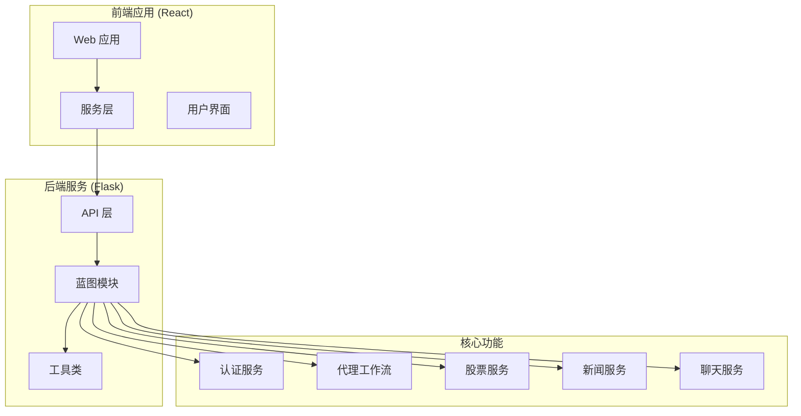
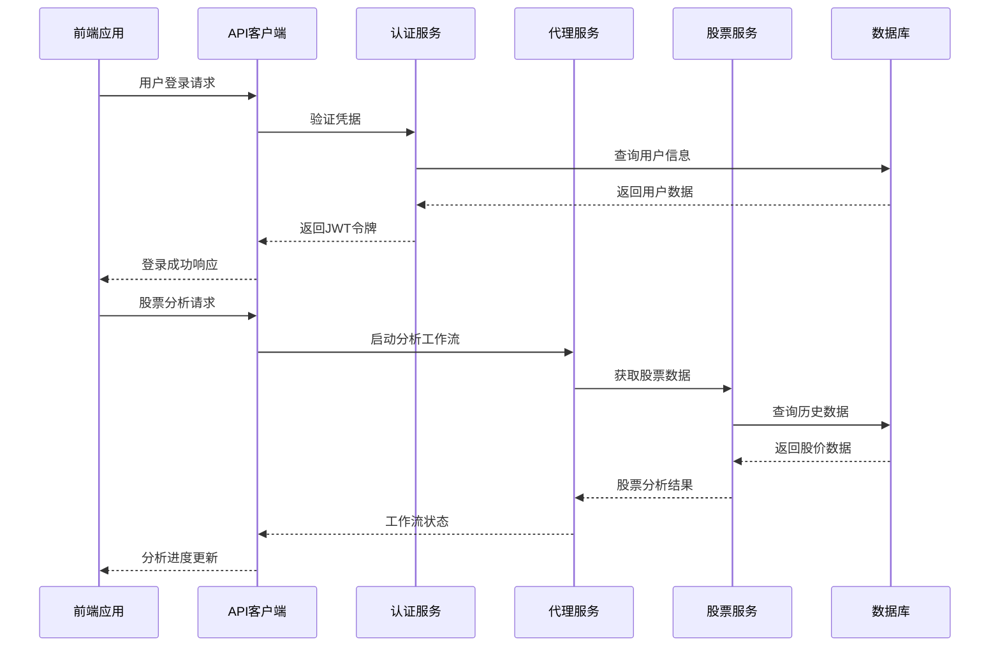
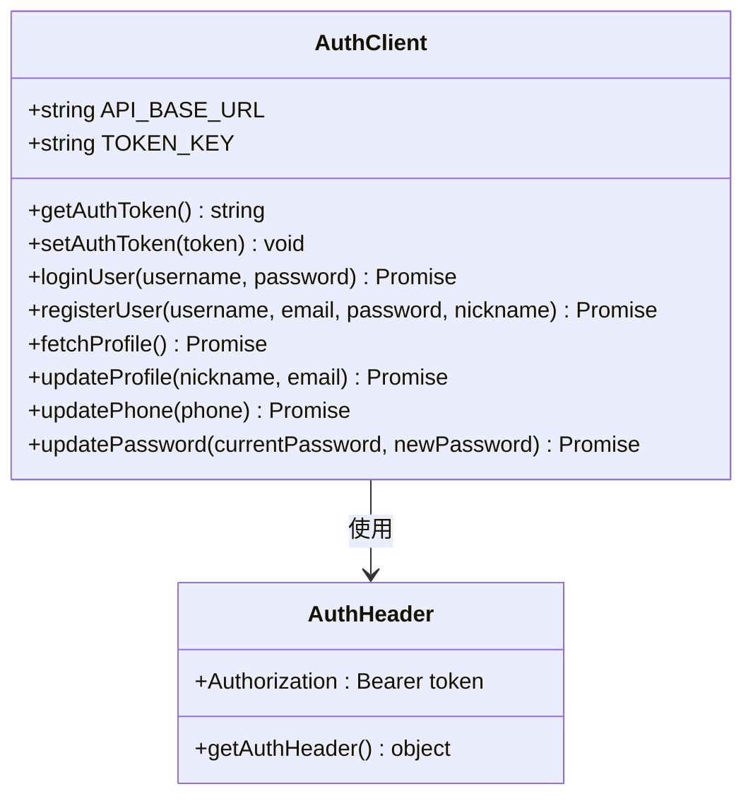
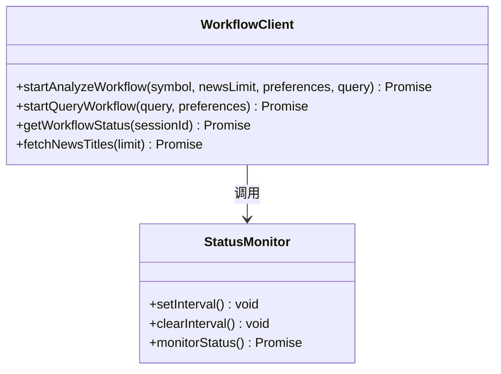
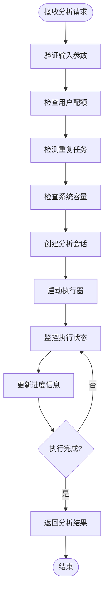
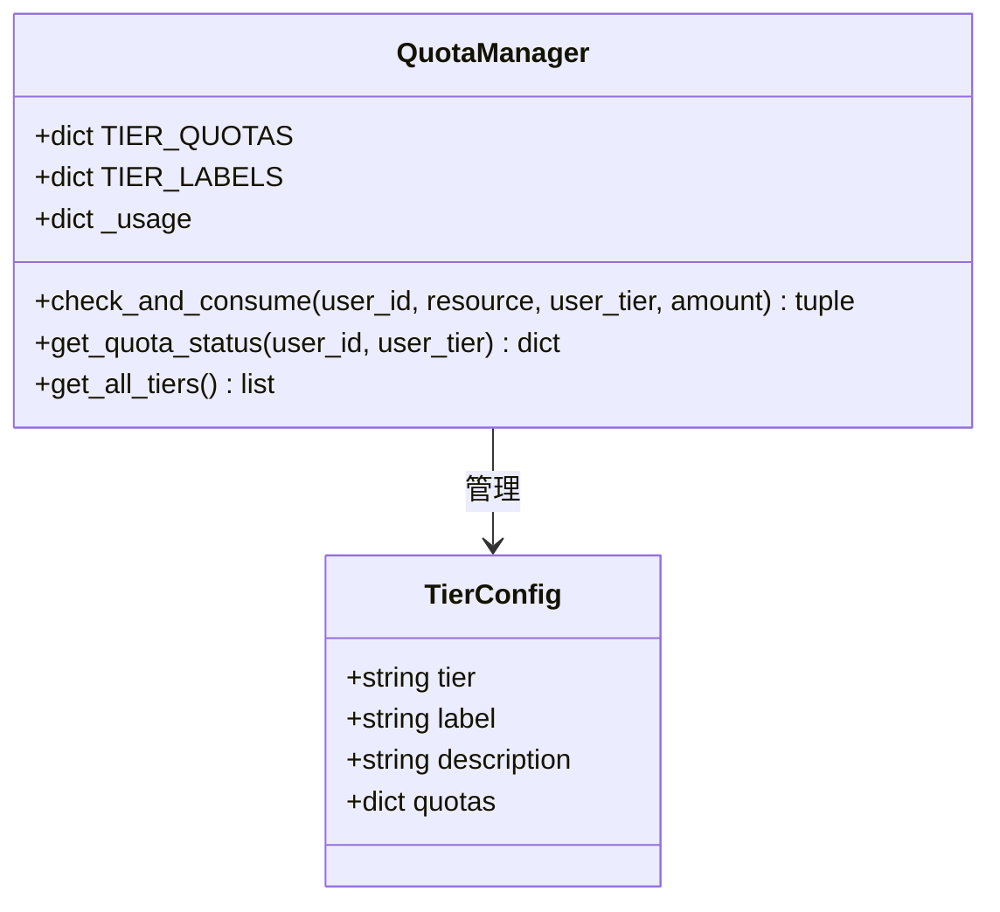
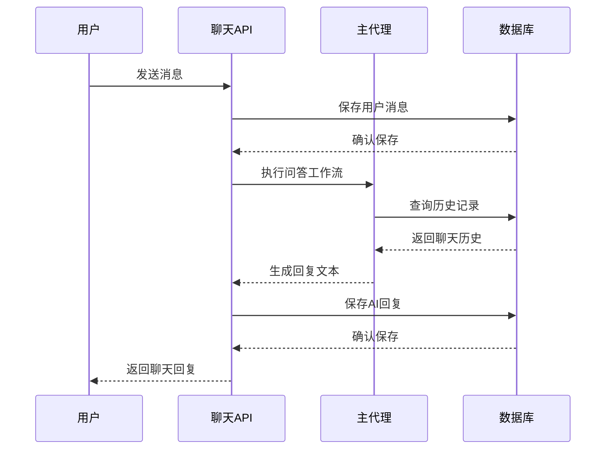
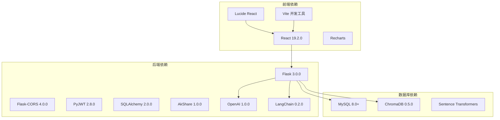
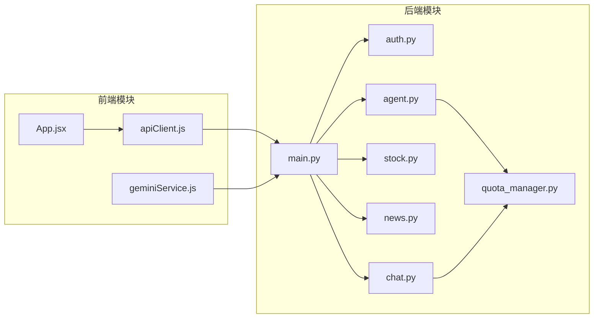

# Api 客户端

<cite>
**本文档引用的文件**
- [apiClient.js](file://src/web/src/services/apiClient.js)
- [apiService.js](file://src/web/src/services/apiService.js)
- [geminiService.js](file://src/web/src/services/geminiService.js)
- [main.py](file://src/api/main.py)
- [auth.py](file://src/api/auth.py)
- [agent.py](file://src/api/agent.py)
- [stock.py](file://src/api/stock.py)
- [news.py](file://src/api/news.py)
- [chat.py](file://src/api/chat.py)
- [quota_manager.py](file://src/utils/quota_manager.py)
- [App.jsx](file://src/web/src/App.jsx)
- [run.py](file://run.py)
- [requirements.txt](file://requirements.txt)
</cite>

## 目录
1. [简介](#简介)
2. [项目结构](#项目结构)
3. [核心组件](#核心组件)
4. [架构概览](#架构概览)
5. [详细组件分析](#详细组件分析)
6. [依赖关系分析](#依赖关系分析)
7. [性能考虑](#性能考虑)
8. [故障排除指南](#故障排除指南)
9. [结论](#结论)

## 简介

AI投资分析系统是一个基于React前端和Flask后端的全栈应用程序，提供智能投资分析、股票数据查询、新闻资讯和聊天交互等功能。该系统的核心是API客户端层，负责与后端服务进行通信，处理用户认证、数据获取和业务逻辑调用。

系统采用模块化设计，前端通过API客户端封装了所有后端接口调用，后端通过蓝图(BP)组织不同功能模块的服务端点。整个系统支持用户配额管理、权限控制和实时工作流监控。

## 项目结构

项目采用前后端分离的架构设计，主要包含以下核心目录：

**图表来源**
- [main.py:40-56](file://src/api/main.py#L40-L56)
- [App.jsx:15-25](file://src/web/src/App.jsx#L15-L25)

**章节来源**
- [main.py:1-322](file://src/api/main.py#L1-L322)
- [run.py:1-60](file://run.py#L1-L60)

## 核心组件

### 前端API客户端

前端提供了两种API客户端实现，分别服务于不同的使用场景：

#### apiClient.js - 主要API客户端
- **认证管理**: 处理JWT令牌存储和验证头设置
- **用户管理**: 用户注册、登录、资料更新
- **工作流管理**: 股票分析和查询工作流的启动与状态监控
- **聊天功能**: 实时聊天消息发送和历史记录获取
- **配额管理**: 用户等级和使用配额查询

#### apiService.js - 替代API服务
- **统一URL管理**: 集中管理API基础URL
- **错误处理**: 统一的错误响应处理机制
- **服务分组**: 按功能模块组织API调用

**章节来源**
- [apiClient.js:1-148](file://src/web/src/services/apiClient.js#L1-L148)
- [apiService.js:1-175](file://src/web/src/services/apiService.js#L1-L175)

### 后端API服务

#### Flask应用架构
- **蓝图注册**: 将认证、代理、股票、新闻、聊天服务注册到主应用
- **CORS支持**: 跨域资源共享配置
- **日志记录**: 统一的日志记录和请求追踪
- **健康检查**: 系统状态监控和工作流执行器状态检查

#### 认证服务
- **JWT令牌**: 使用JSON Web Token进行用户身份验证
- **密码哈希**: SHA256算法进行密码安全存储
- **用户管理**: 用户注册、登录、资料维护

**章节来源**
- [main.py:40-314](file://src/api/main.py#L40-L314)
- [auth.py:1-138](file://src/api/auth.py#L1-L138)

## 架构概览

系统采用分层架构设计，确保前后端分离和职责清晰：

**图表来源**
- [App.jsx:197-293](file://src/web/src/App.jsx#L197-L293)
- [agent.py:58-132](file://src/api/agent.py#L58-L132)

**章节来源**
- [App.jsx:1-800](file://src/web/src/App.jsx#L1-L800)
- [agent.py:1-303](file://src/api/agent.py#L1-L303)

## 详细组件分析

### API客户端组件

#### 认证客户端分析

**图表来源**
- [apiClient.js:4-18](file://src/web/src/services/apiClient.js#L4-L18)
- [apiClient.js:43-83](file://src/web/src/services/apiClient.js#L43-L83)

#### 工作流客户端分析

**图表来源**
- [apiClient.js:85-107](file://src/web/src/services/apiClient.js#L85-L107)
- [App.jsx:231-287](file://src/web/src/App.jsx#L231-L287)

**章节来源**
- [apiClient.js:1-148](file://src/web/src/services/apiClient.js#L1-L148)
- [App.jsx:196-293](file://src/web/src/App.jsx#L196-L293)

### 后端API服务组件

#### 代理工作流服务

**图表来源**
- [agent.py:58-132](file://src/api/agent.py#L58-L132)
- [agent.py:206-263](file://src/api/agent.py#L206-L263)

#### 配额管理系统

**图表来源**
- [quota_manager.py:47-140](file://src/utils/quota_manager.py#L47-L140)

**章节来源**
- [agent.py:1-303](file://src/api/agent.py#L1-L303)
- [quota_manager.py:1-140](file://src/utils/quota_manager.py#L1-L140)

### 聊天服务组件

#### 聊天工作流序列图

**图表来源**
- [chat.py:21-54](file://src/api/chat.py#L21-L54)
- [chat.py:169-222](file://src/api/chat.py#L169-L222)

**章节来源**
- [chat.py:1-223](file://src/api/chat.py#L1-L223)

## 依赖关系分析

### 前后端依赖关系

**图表来源**
- [requirements.txt:1-41](file://requirements.txt#L1-L41)
- [package.json:12-31](file://src/web/package.json#L12-L31)

### 内部模块依赖

**图表来源**
- [main.py:22-28](file://src/api/main.py#L22-L28)
- [App.jsx:15-25](file://src/web/src/App.jsx#L15-L25)

**章节来源**
- [requirements.txt:1-41](file://requirements.txt#L1-L41)
- [main.py:1-322](file://src/api/main.py#L1-L322)

## 性能考虑

### 前端性能优化

1. **API调用缓存**: 建议在前端实现API响应缓存机制，避免重复请求
2. **并发控制**: 限制同时进行的API请求数量，防止系统过载
3. **懒加载**: 对大型组件和数据进行懒加载，提升初始加载速度
4. **状态管理**: 使用高效的React状态管理模式，减少不必要的重新渲染

### 后端性能优化

1. **线程池管理**: 代理工作流使用ThreadPoolExecutor限制最大并发数
2. **内存配额管理**: 基于内存的每日配额控制，支持多等级用户
3. **数据库连接池**: 建议实现数据库连接池以提高查询效率
4. **缓存策略**: 对频繁访问的数据实现缓存机制

### 网络性能

1. **请求合并**: 将多个小请求合并为批量请求
2. **压缩传输**: 启用Gzip压缩减少传输数据量
3. **CDN加速**: 对静态资源使用CDN加速
4. **连接复用**: 使用HTTP/2连接复用特性

## 故障排除指南

### 常见问题诊断

#### 认证相关问题
- **令牌失效**: 检查JWT令牌过期时间和刷新机制
- **权限不足**: 验证用户等级和配额状态
- **登录失败**: 确认用户名密码格式和数据库连接

#### API调用问题
- **跨域错误**: 检查CORS配置和代理设置
- **请求超时**: 监控网络延迟和服务器响应时间
- **数据格式错误**: 验证API响应数据结构和字段完整性

#### 工作流执行问题
- **任务阻塞**: 检查线程池状态和系统资源使用情况
- **重复任务**: 验证去重机制和任务键生成逻辑
- **状态同步**: 确保工作流状态更新的原子性和一致性

### 调试工具和技巧

1. **浏览器开发者工具**: 使用Network面板监控API请求和响应
2. **后端日志**: 启用详细的日志记录和错误追踪
3. **性能分析**: 使用性能分析工具识别瓶颈
4. **单元测试**: 编写全面的测试用例确保代码质量

**章节来源**
- [main.py:237-248](file://src/api/main.py#L237-L248)
- [auth.py:123-138](file://src/api/auth.py#L123-L138)

## 结论

AI投资分析系统的API客户端层设计合理，实现了前后端的有效分离和职责明确的模块化架构。系统具备以下优势：

1. **模块化设计**: 前后端都采用了清晰的模块划分，便于维护和扩展
2. **完整的认证体系**: 基于JWT的认证机制和配额管理确保了系统的安全性
3. **灵活的工作流**: 支持多种分析模式和实时状态监控
4. **可扩展性**: 基于蓝图的架构设计便于添加新的功能模块

建议的改进方向：
- 实现更完善的错误处理和重试机制
- 添加API调用的超时控制和重试策略
- 优化前端状态管理和性能监控
- 增强安全防护措施，如CSRF保护和输入验证

该系统为投资分析领域提供了一个功能完整、架构清晰的技术平台，具有良好的扩展性和实用性。