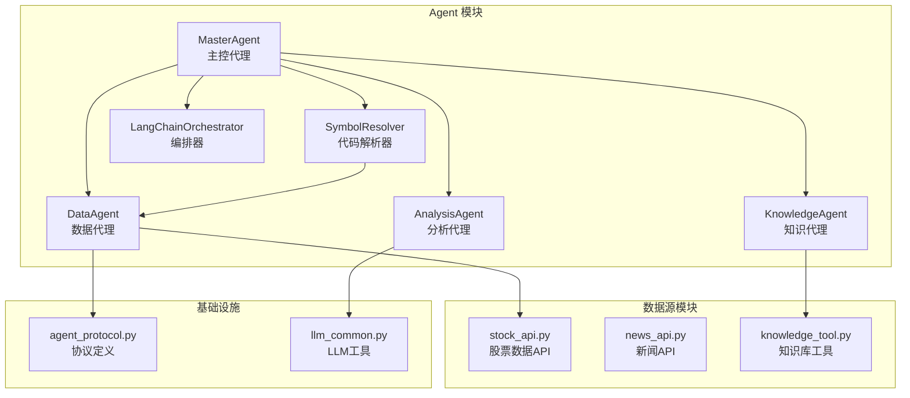
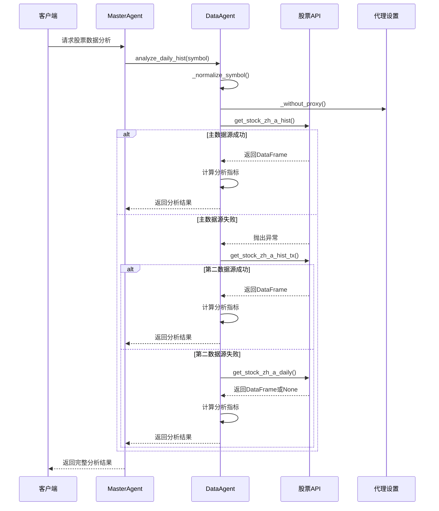
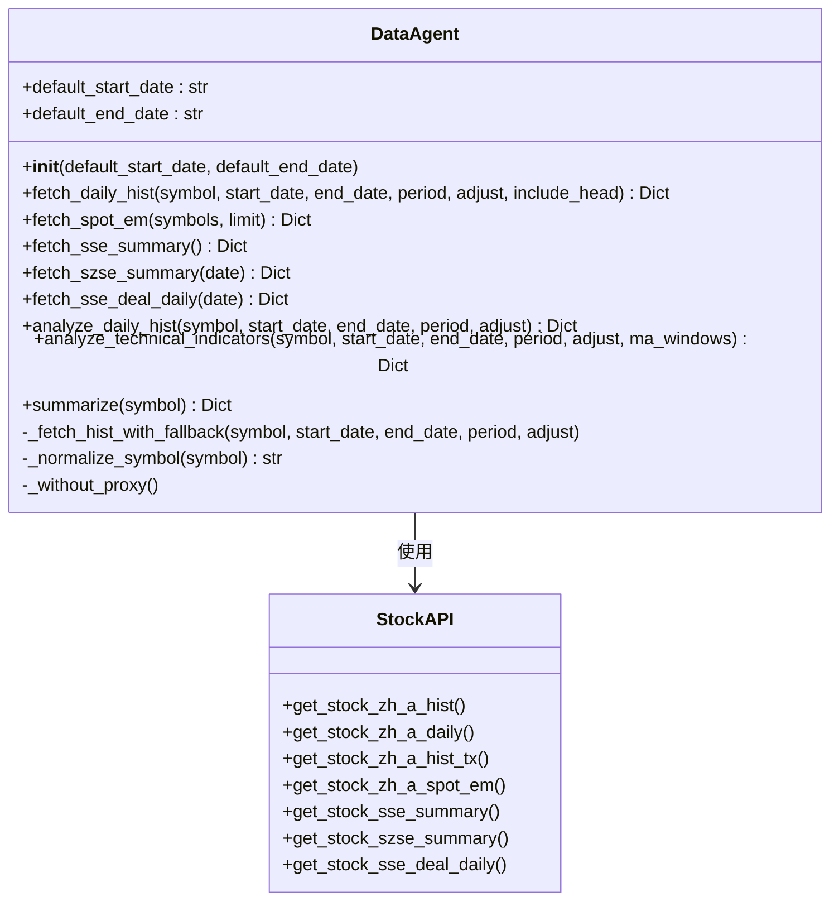
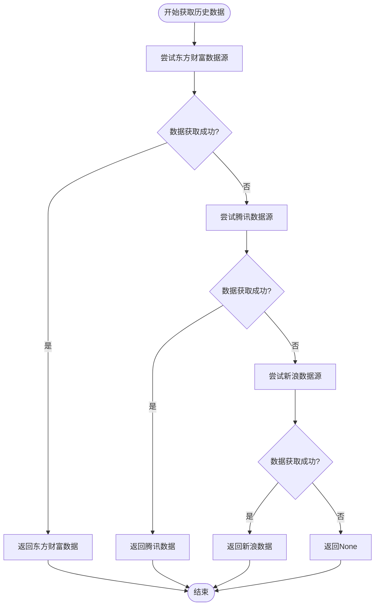
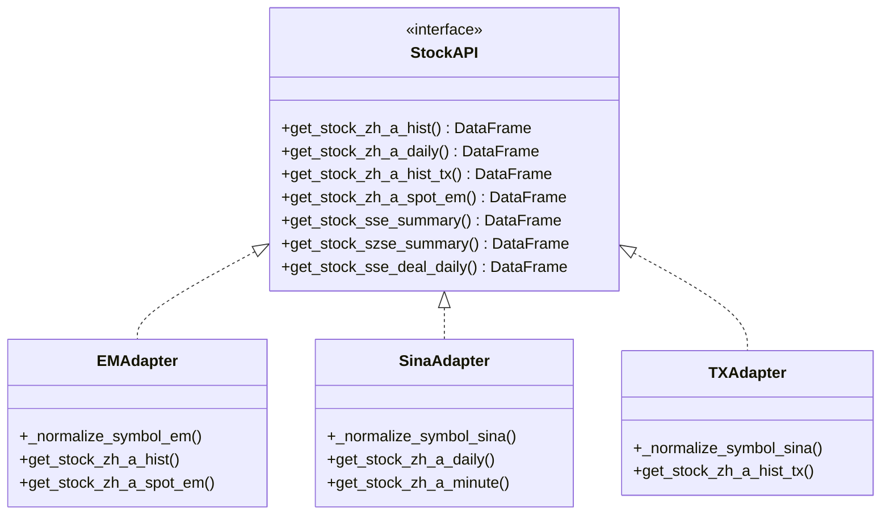
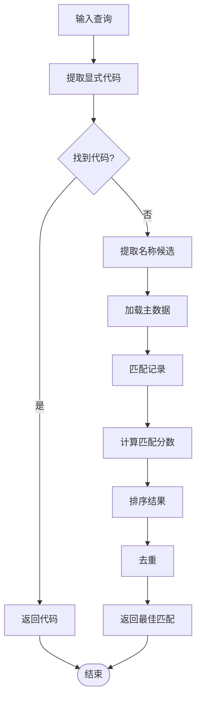
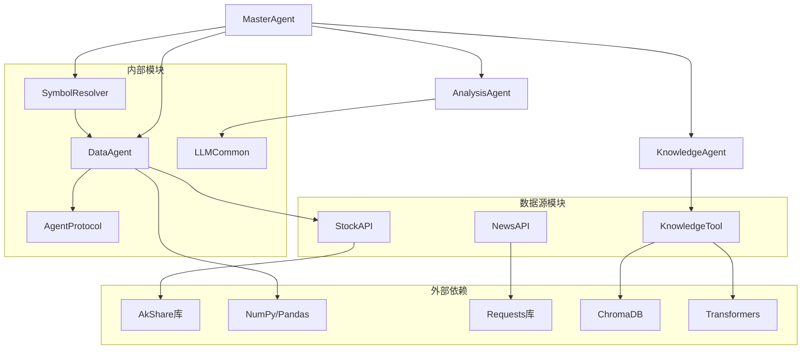

# Data Agent 数据代理

<cite>
**本文档引用的文件**
- [data_agent.py](file://src/agent/data_agent.py)
- [master_agent.py](file://src/agent/master_agent.py)
- [agent_protocol.py](file://src/agent/agent_protocol.py)
- [symbol_resolver.py](file://src/agent/symbol_resolver.py)
- [analysis_agent.py](file://src/agent/analysis_agent.py)
- [stock_api.py](file://src/stock/stock_api.py)
- [news_api.py](file://src/news/news_api.py)
- [knowledge_tool.py](file://src/rag/knowledge_tool.py)
- [llm_common.py](file://src/agent/llm_common.py)
- [langchain_orchestrator.py](file://src/agent/langchain_orchestrator.py)
- [test_data_agent_fallback.py](file://src/agent/test/test_data_agent_fallback.py)
- [README.md](file://src/agent/README.md)
- [README.md](file://README.md)
</cite>

## 目录
1. [简介](#简介)
2. [项目结构](#项目结构)
3. [核心组件](#核心组件)
4. [架构概览](#架构概览)
5. [详细组件分析](#详细组件分析)
6. [依赖关系分析](#依赖关系分析)
7. [性能考虑](#性能考虑)
8. [故障排除指南](#故障排除指南)
9. [结论](#结论)

## 简介

Data Agent 是 AI 投资分析系统中的核心数据获取和分析组件，负责从多个数据源获取股票市场数据、执行技术分析，并提供市场概览功能。该组件采用多级回退策略确保数据获取的可靠性，支持多种数据源和分析维度。

Data Agent 作为 Phase 2 多 Agent 协同分析系统的重要组成部分，与其他 Agent（News Agent、Knowledge Agent、Analysis Agent）协同工作，为用户提供完整的投资分析服务。

## 项目结构

AI 投资分析系统采用模块化的架构设计，Data Agent 位于 agent 模块的核心位置，负责数据获取和处理。

**图表来源**
- [data_agent.py:1-572](file://src/agent/data_agent.py#L1-L572)
- [master_agent.py:1-447](file://src/agent/master_agent.py#L1-L447)
- [stock_api.py:1-425](file://src/stock/stock_api.py#L1-L425)

**章节来源**
- [README.md:1-215](file://README.md#L1-L215)
- [src/agent/README.md:1-189](file://src/agent/README.md#L1-L189)

## 核心组件

Data Agent 的核心功能围绕以下几个关键组件展开：

### DataAgent 类
DataAgent 是主要的数据获取和分析类，提供以下核心功能：
- 历史行情数据获取和回退机制
- 实时行情数据获取
- 技术指标计算
- 市场概览数据获取
- 股票代码标准化处理

### 股票数据API封装
stock_api.py 提供了对 AKShare 库的封装，支持多种数据源：
- 东方财富数据源
- 新浪财经数据源  
- 腾讯证券数据源
- 上交所/深交所市场数据

### 符号解析器
SymbolResolver 提供离线的股票代码解析功能，支持：
- 显式代码识别
- 公司名称匹配
- 多语言支持（中文、拼音）
- 缓存机制优化性能

**章节来源**
- [data_agent.py:30-572](file://src/agent/data_agent.py#L30-L572)
- [stock_api.py:1-425](file://src/stock/stock_api.py#L1-L425)
- [symbol_resolver.py:18-244](file://src/agent/symbol_resolver.py#L18-L244)

## 架构概览

Data Agent 采用分层架构设计，确保功能的模块化和可维护性。

**图表来源**
- [data_agent.py:129-168](file://src/agent/data_agent.py#L129-L168)
- [master_agent.py:160-189](file://src/agent/master_agent.py#L160-L189)

## 详细组件分析

### DataAgent 类详细分析

DataAgent 类是整个数据代理系统的核心，提供了完整的股票数据获取和分析功能。

#### 数据获取方法

DataAgent 提供了多种数据获取方法：

**图表来源**
- [data_agent.py:30-572](file://src/agent/data_agent.py#L30-L572)
- [stock_api.py:68-425](file://src/stock/stock_api.py#L68-L425)

#### 多级回退机制

DataAgent 实现了三级数据源回退机制，确保数据获取的可靠性：

**图表来源**
- [data_agent.py:129-168](file://src/agent/data_agent.py#L129-L168)

#### 技术分析功能

DataAgent 提供了全面的技术分析功能，包括：

1. **基础统计指标**：最高价、最低价、收盘价、开盘价、涨跌幅
2. **波动性分析**：计算价格波动率
3. **成交量分析**：平均成交量和成交金额
4. **移动平均线**：支持多种窗口长度的均线计算
5. **趋势判断**：基于均线关系的趋势分析

**章节来源**
- [data_agent.py:305-552](file://src/agent/data_agent.py#L305-L552)

### 股票数据API封装

stock_api.py 提供了对 AKShare 库的统一封装，支持多种数据源和格式：

#### 数据源适配器

**图表来源**
- [stock_api.py:15-63](file://src/stock/stock_api.py#L15-L63)
- [stock_api.py:212-252](file://src/stock/stock_api.py#L212-L252)

#### 代码格式标准化

DataAgent 实现了统一的股票代码格式处理：

| 输入格式 | 输出格式 | 说明 |
|---------|---------|------|
| 600519 | 600519 | 6位数字代码 |
| SH600519 | 600519 | 带市场前缀 |
| 600519.SH | 600519 | 带后缀 |
| sh600519 | 600519 | 小写市场前缀 |
| sz000001 | 000001 | 深市代码 |

**章节来源**
- [data_agent.py:170-182](file://src/agent/data_agent.py#L170-L182)
- [stock_api.py:15-63](file://src/stock/stock_api.py#L15-L63)

### 符号解析器

SymbolResolver 提供了强大的股票代码解析功能，支持离线主数据匹配：

#### 解析策略

**图表来源**
- [symbol_resolver.py:190-244](file://src/agent/symbol_resolver.py#L190-L244)

#### 缓存机制

SymbolResolver 实现了查询级缓存机制，提高重复查询的性能：

- **TTL 设置**：默认 3600 秒（1小时）
- **缓存键**：标准化后的查询文本
- **内存存储**：使用字典存储缓存数据
- **自动清理**：过期缓存自动移除

**章节来源**
- [symbol_resolver.py:21-27](file://src/agent/symbol_resolver.py#L21-L27)
- [symbol_resolver.py:200-244](file://src/agent/symbol_resolver.py#L200-L244)

## 依赖关系分析

Data Agent 的依赖关系体现了清晰的模块化设计：

**图表来源**
- [data_agent.py:19-27](file://src/agent/data_agent.py#L19-L27)
- [symbol_resolver.py:22-27](file://src/agent/symbol_resolver.py#L22-L27)
- [knowledge_tool.py:16-17](file://src/rag/knowledge_tool.py#L16-L17)

### 关键依赖特性

1. **数据获取依赖**：DataAgent 依赖 stock_api.py 提供的数据获取功能
2. **解析依赖**：SymbolResolver 依赖本地主数据文件
3. **分析依赖**：AnalysisAgent 依赖 LLM 客户端进行最终分析
4. **检索依赖**：KnowledgeAgent 依赖 ChromaDB 进行向量检索

**章节来源**
- [master_agent.py:15-22](file://src/agent/master_agent.py#L15-L22)
- [analysis_agent.py:12-25](file://src/agent/analysis_agent.py#L12-L25)

## 性能考虑

Data Agent 在设计时充分考虑了性能优化：

### 缓存策略
- **符号解析缓存**：SymbolResolver 使用 TTL 缓存减少重复解析开销
- **查询结果缓存**：RAG 知识库实现查询缓存机制
- **代理设置缓存**：DataAgent 临时移除代理设置避免重复配置

### 并行处理
- **多线程执行**：MasterAgent 支持并行执行多个 Agent
- **超时控制**：并行执行设置超时时间防止阻塞
- **资源管理**：使用 ThreadPoolExecutor 管理线程池

### 数据处理优化
- **向量化计算**：使用 Pandas 进行向量化数据分析
- **内存管理**：及时释放不需要的数据对象
- **数据类型优化**：合理使用数据类型减少内存占用

## 故障排除指南

### 常见问题及解决方案

#### 数据获取失败
**问题**：股票数据获取失败
**原因**：
- 网络连接问题
- 数据源不可用
- 代理设置冲突

**解决方案**：
1. 检查网络连接状态
2. 设置 `AKSHARE_DISABLE_PROXY=1` 禁用代理
3. 验证股票代码格式正确性

#### 分析结果异常
**问题**：技术分析结果不准确
**原因**：
- 数据源回退导致数据质量下降
- 参数设置不当
- 数据格式不匹配

**解决方案**：
1. 检查数据源可用性
2. 验证输入参数格式
3. 确认数据列名匹配

#### 性能问题
**问题**：响应时间过长
**原因**：
- 并行执行超时
- 缓存未生效
- 数据量过大

**解决方案**：
1. 调整并行超时设置
2. 检查缓存配置
3. 优化查询参数范围

**章节来源**
- [data_agent.py:34-55](file://src/agent/data_agent.py#L34-L55)
- [test_data_agent_fallback.py:22-83](file://src/agent/test/test_data_agent_fallback.py#L22-L83)

## 结论

Data Agent 作为 AI 投资分析系统的核心组件，展现了优秀的架构设计和实现质量。其主要特点包括：

### 设计优势
1. **多级回退机制**：确保数据获取的高可用性
2. **模块化设计**：清晰的职责分离和依赖管理
3. **性能优化**：缓存机制和并行处理提升效率
4. **容错处理**：完善的异常处理和降级策略

### 功能完整性
1. **数据获取**：支持多种数据源和格式
2. **技术分析**：提供全面的技术指标计算
3. **市场概览**：涵盖交易所统计数据
4. **代码解析**：离线主数据支持

### 扩展性
1. **插件化架构**：易于集成新的数据源
2. **配置驱动**：通过环境变量灵活配置
3. **协议标准化**：统一的输出格式便于集成

Data Agent 为整个 AI 投资分析系统奠定了坚实的基础，为用户提供可靠、准确的投资分析服务。