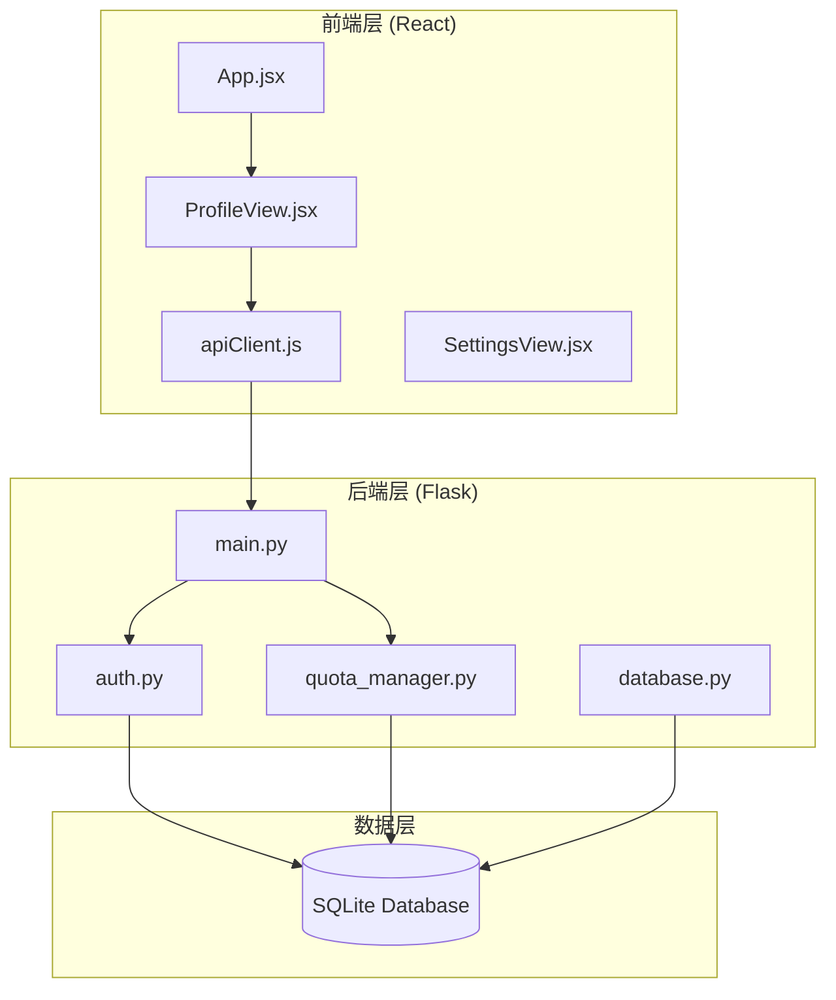
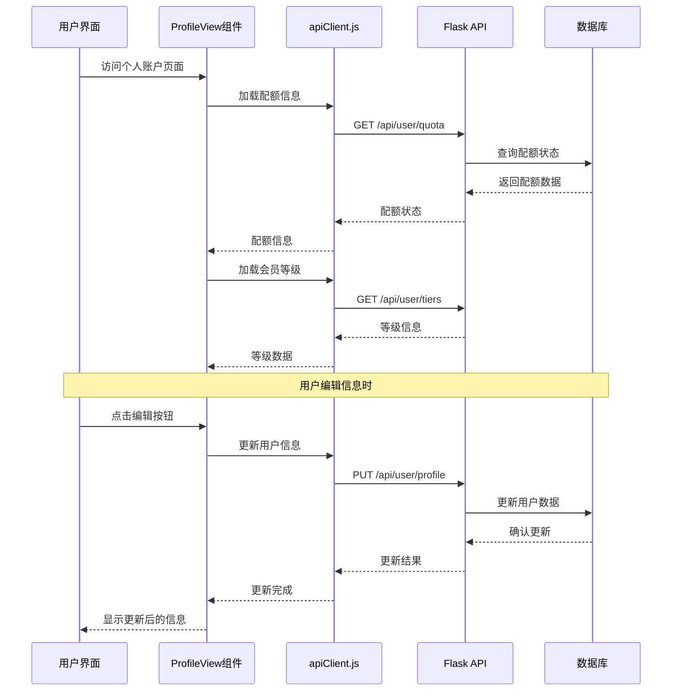
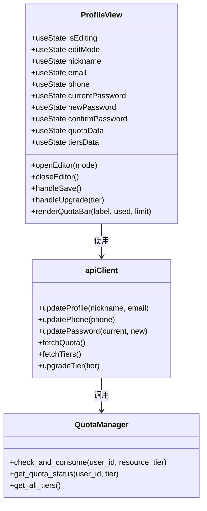
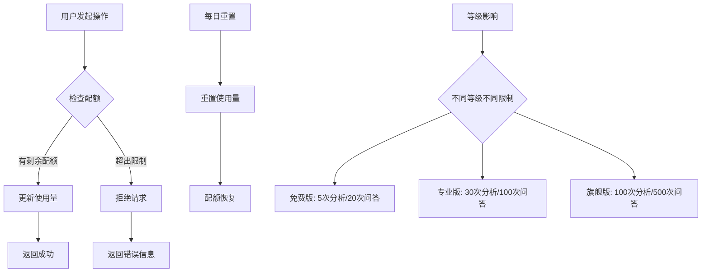
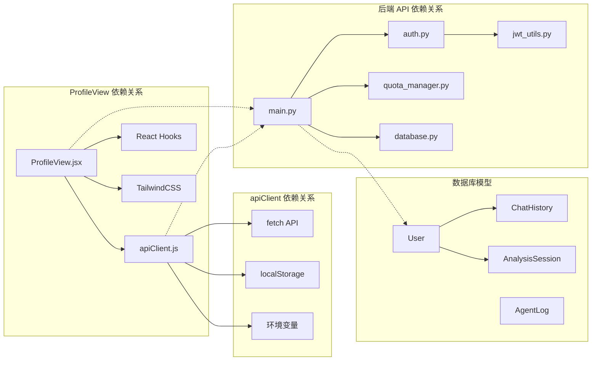

# Profile View

<cite>
**本文档引用的文件**
- [ProfileView.jsx](file://src/web/src/components/views/ProfileView.jsx)
- [apiClient.js](file://src/web/src/services/apiClient.js)
- [main.py](file://src/api/main.py)
- [auth.py](file://src/api/auth.py)
- [quota_manager.py](file://src/utils/quota_manager.py)
- [database.py](file://src/models/database.py)
- [App.jsx](file://src/web/src/App.jsx)
- [README.md](file://README.md)
- [DESIGN.md](file://DESIGN.md)
</cite>

## 目录
1. [简介](#简介)
2. [项目结构](#项目结构)
3. [核心组件](#核心组件)
4. [架构概览](#架构概览)
5. [详细组件分析](#详细组件分析)
6. [依赖关系分析](#依赖关系分析)
7. [性能考虑](#性能考虑)
8. [故障排除指南](#故障排除指南)
9. [结论](#结论)

## 简介

Profile View 是 AI 投资分析系统中的个人账户管理界面，为用户提供个人信息管理、配额使用情况查看和会员等级升级等功能。该组件采用现代化的 React 构建，结合 TailwindCSS 样式系统，提供直观的用户体验。

系统基于 Flask + React + 多 Agent 协作的技术架构，支持用户认证、股票与新闻信息聚合、对话分析与 RAG 知识检索等核心功能。Profile View 作为前端界面的重要组成部分，负责展示和管理用户的账户信息。

## 项目结构

该项目采用前后端分离的架构设计，主要分为以下几个层次：

**图表来源**
- [ProfileView.jsx:1-511](file://src/web/src/components/views/ProfileView.jsx#L1-L511)
- [apiClient.js:1-148](file://src/web/src/services/apiClient.js#L1-L148)
- [main.py:1-322](file://src/api/main.py#L1-L322)

**章节来源**
- [README.md:24-40](file://README.md#L24-L40)
- [ProfileView.jsx:1-511](file://src/web/src/components/views/ProfileView.jsx#L1-L511)

## 核心组件

Profile View 组件是整个系统中用户账户管理的核心界面，具有以下主要特性：

### 用户信息管理
- **基本信息展示**：显示用户的昵称、用户名、邮箱、手机号和注册时间
- **编辑功能**：支持昵称、邮箱、手机号和密码的在线编辑
- **实时更新**：编辑后的信息会立即反映在用户界面中

### 配额管理系统
- **使用情况监控**：实时显示每日分析和问答的使用情况
- **可视化展示**：通过进度条直观展示配额使用率
- **等级关联**：根据用户等级显示不同的配额限制

### 会员升级功能
- **多等级支持**：免费版、专业版、旗舰版三种等级
- **功能对比**：清晰展示各等级的功能差异
- **一键升级**：简化升级流程，支持无缝等级切换

**章节来源**
- [ProfileView.jsx:5-511](file://src/web/src/components/views/ProfileView.jsx#L5-L511)
- [quota_manager.py:16-44](file://src/utils/quota_manager.py#L16-L44)

## 架构概览

Profile View 的整体架构采用分层设计，确保了良好的可维护性和扩展性：

**图表来源**
- [ProfileView.jsx:29-47](file://src/web/src/components/views/ProfileView.jsx#L29-L47)
- [apiClient.js:57-83](file://src/web/src/services/apiClient.js#L57-L83)
- [main.py:94-166](file://src/api/main.py#L94-L166)

## 详细组件分析

### ProfileView 组件架构

ProfileView 组件采用了现代化的 React Hooks 设计模式，实现了完整的用户交互和状态管理：

**图表来源**
- [ProfileView.jsx:5-511](file://src/web/src/components/views/ProfileView.jsx#L5-L511)
- [apiClient.js:61-147](file://src/web/src/services/apiClient.js#L61-L147)
- [quota_manager.py:47-139](file://src/utils/quota_manager.py#L47-L139)

### 配额使用流程

系统通过配额管理器实现精确的使用量控制：

**图表来源**
- [quota_manager.py:64-106](file://src/utils/quota_manager.py#L64-L106)
- [main.py:256-274](file://src/api/main.py#L256-L274)

### 会员升级机制

会员升级功能提供了灵活的等级管理：

| 等级 | 月费 | 深度分析 | 智能问答 | 特色功能 |
|------|------|----------|----------|----------|
| 免费版 | ¥0 | 5次/日 | 20次/日 | 基础行情数据 |
| 专业版 | ¥29 | 30次/日 | 100次/日 | 实时行情 + 新闻聚合 |
| 旗舰版 | ¥99 | 100次/日 | 500次/日 | 全部功能无限制 |

**章节来源**
- [ProfileView.jsx:328-396](file://src/web/src/components/views/ProfileView.jsx#L328-L396)
- [quota_manager.py:16-44](file://src/utils/quota_manager.py#L16-L44)

## 依赖关系分析

Profile View 组件与系统其他模块的依赖关系如下：

**图表来源**
- [ProfileView.jsx:1-511](file://src/web/src/components/views/ProfileView.jsx#L1-L511)
- [apiClient.js:1-148](file://src/web/src/services/apiClient.js#L1-L148)
- [main.py:22-314](file://src/api/main.py#L22-L314)

**章节来源**
- [App.jsx:11-14](file://src/web/src/App.jsx#L11-L14)
- [database.py:24-87](file://src/models/database.py#L24-L87)

## 性能考虑

### 前端性能优化

Profile View 组件在设计时充分考虑了性能优化：

- **懒加载策略**：配额和等级信息采用异步加载，避免阻塞主界面渲染
- **状态管理**：使用 React Hooks 实现细粒度的状态更新，减少不必要的重渲染
- **内存管理**：及时清理定时器和事件监听器，防止内存泄漏

### 后端性能优化

系统后端通过以下机制确保高效运行：

- **连接池管理**：数据库连接采用连接池技术，提高资源利用率
- **缓存策略**：热门数据采用内存缓存，减少数据库查询压力
- **并发控制**：通过配额管理器实现并发访问控制

## 故障排除指南

### 常见问题及解决方案

| 问题类型 | 症状 | 可能原因 | 解决方案 |
|----------|------|----------|----------|
| 登录失败 | 无法访问个人账户 | Token 过期或无效 | 清除浏览器缓存，重新登录 |
| 配额显示异常 | 配额使用量不准确 | 缓存数据过期 | 刷新页面或重新登录 |
| 升级失败 | 会员等级无法变更 | 支付系统问题 | 联系客服或稍后重试 |
| 编辑功能失效 | 无法修改个人信息 | 网络请求失败 | 检查网络连接或重试 |

### 调试技巧

1. **开发者工具**：使用浏览器开发者工具监控网络请求和状态变化
2. **日志查看**：通过浏览器控制台查看详细的错误信息
3. **API 测试**：使用 Postman 或 curl 测试后端 API 接口

**章节来源**
- [main.py:237-249](file://src/api/main.py#L237-L249)
- [apiClient.js:20-41](file://src/web/src/services/apiClient.js#L20-L41)

## 结论

Profile View 作为 AI 投资分析系统的核心界面组件，成功实现了用户账户管理的完整功能。通过现代化的 React 架构和 Flask 后端支持，系统提供了流畅的用户体验和可靠的功能保障。

该组件的设计体现了以下优势：
- **用户友好**：直观的界面设计和简洁的操作流程
- **功能完整**：涵盖用户管理、配额控制、会员升级等核心功能
- **性能优异**：通过合理的架构设计和优化策略确保系统稳定性
- **易于维护**：清晰的代码结构和完善的错误处理机制

未来可以在以下方面进一步优化：
- 增加更多的个性化设置选项
- 优化移动端适配体验
- 添加更多数据分析和可视化功能
- 增强安全性和隐私保护措施