# RAG知识库系统

<cite>
**本文档引用的文件**
- [README.md](file://README.md)
- [requirements.txt](file://requirements.txt)
- [src/rag/config/rag_config.json](file://src/rag/config/rag_config.json)
- [src/rag/knowledge_tool.py](file://src/rag/knowledge_tool.py)
- [src/rag/scripts/prepare_chunks.py](file://src/rag/scripts/prepare_chunks.py)
- [src/rag/scripts/build_chroma_index.py](file://src/rag/scripts/build_chroma_index.py)
- [src/rag/scripts/query_chroma.py](file://src/rag/scripts/query_chroma.py)
- [src/rag/scripts/build_index.py](file://src/rag/scripts/build_index.py)
- [src/rag/scripts/query_index.py](file://src/rag/scripts/query_index.py)
- [src/rag/data/chunks/chunks.jsonl](file://src/rag/data/chunks/chunks.jsonl)
</cite>

## 目录
1. [简介](#简介)
2. [项目结构](#项目结构)
3. [核心组件](#核心组件)
4. [架构概览](#架构概览)
5. [详细组件分析](#详细组件分析)
6. [依赖关系分析](#依赖关系分析)
7. [性能考虑](#性能考虑)
8. [故障排除指南](#故障排除指南)
9. [结论](#结论)
10. [附录](#附录)

## 简介

AI投资分析系统是一个基于Flask + React + 多Agent协作的投资分析项目，支持用户认证、股票与新闻信息聚合、对话分析与RAG知识检索。该项目的核心功能包括：

- 用户注册/登录与JWT鉴权
- 股票数据查询与分析（AKShare）
- 新闻联网检索与分析
- 多Agent协同分析流程（主控、数据、新闻、知识、分析）
- 可切换编排器（LangChain AgentExecutor / 自研编排自动回退）
- 聊天记录与分析会话持久化（SQLite/可切换数据库）
- RAG本地知识库检索（Chroma）
- React前端可视化界面

本项目特别强调了RAG知识库系统的实现，包括本地知识库检索架构、知识库构建流程、混合检索策略、配置管理和扩展指南。

## 项目结构

项目采用模块化设计，主要包含以下核心模块：

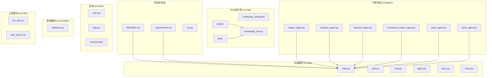

**图表来源**
- [README.md](file://README.md#L24-L40)
- [requirements.txt](file://requirements.txt#L1-L41)

**章节来源**
- [README.md](file://README.md#L24-L40)
- [requirements.txt](file://requirements.txt#L1-L41)

## 核心组件

### RAG知识库系统架构

RAG知识库系统采用多层次架构设计，包含数据处理层、索引构建层、检索引擎层和查询接口层：

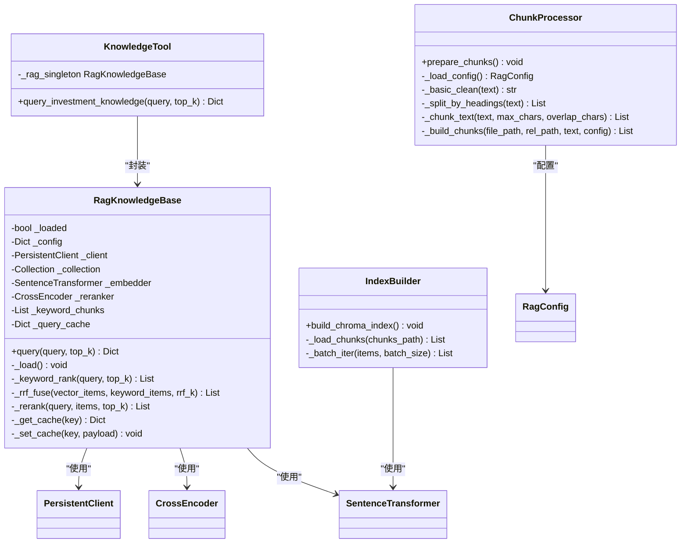

**图表来源**
- [src/rag/knowledge_tool.py](file://src/rag/knowledge_tool.py#L22-L273)
- [src/rag/scripts/prepare_chunks.py](file://src/rag/scripts/prepare_chunks.py#L17-L165)
- [src/rag/scripts/build_chroma_index.py](file://src/rag/scripts/build_chroma_index.py#L18-L88)

### 配置管理系统

系统采用JSON配置文件管理所有可调参数，包括数据路径、索引设置、嵌入模型、重排序参数等：

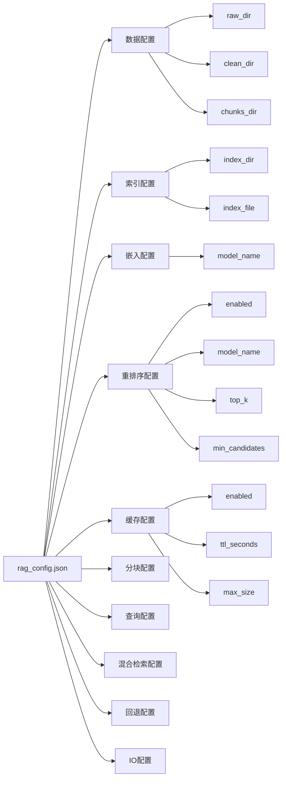

**图表来源**
- [src/rag/config/rag_config.json](file://src/rag/config/rag_config.json#L1-L58)

**章节来源**
- [src/rag/config/rag_config.json](file://src/rag/config/rag_config.json#L1-L58)
- [src/rag/knowledge_tool.py](file://src/rag/knowledge_tool.py#L22-L60)

## 架构概览

### 系统整体架构

RAG知识库系统采用分层架构设计，实现了从原始数据到最终检索结果的完整处理流程：

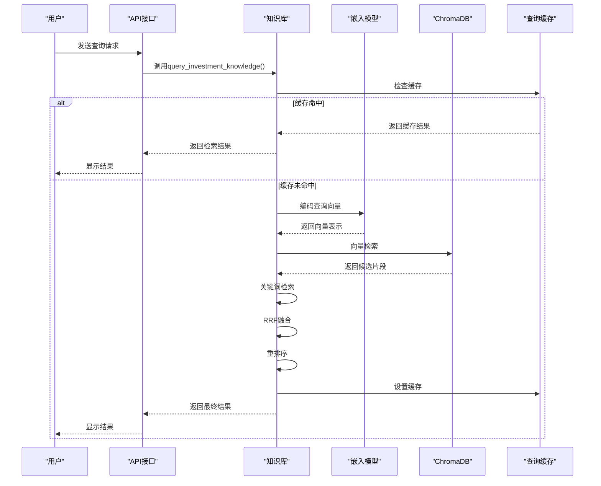

**图表来源**
- [src/rag/knowledge_tool.py](file://src/rag/knowledge_tool.py#L177-L248)
- [src/rag/scripts/query_chroma.py](file://src/rag/scripts/query_chroma.py#L45-L86)

### 数据处理流水线

系统实现了完整的数据处理流水线，从原始文档到可检索的知识块：

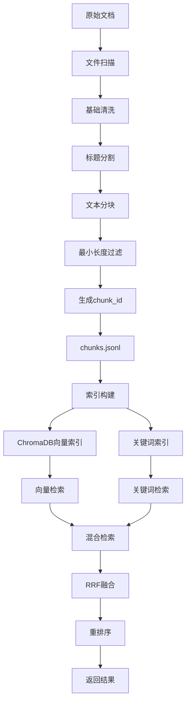

**图表来源**
- [src/rag/scripts/prepare_chunks.py](file://src/rag/scripts/prepare_chunks.py#L141-L161)
- [src/rag/scripts/build_chroma_index.py](file://src/rag/scripts/build_chroma_index.py#L68-L81)

**章节来源**
- [src/rag/scripts/prepare_chunks.py](file://src/rag/scripts/prepare_chunks.py#L109-L138)
- [src/rag/scripts/build_chroma_index.py](file://src/rag/scripts/build_chroma_index.py#L37-L81)

## 详细组件分析

### 知识库查询引擎

RagKnowledgeBase类是整个RAG系统的核心，实现了完整的查询处理逻辑：

#### 查询处理流程

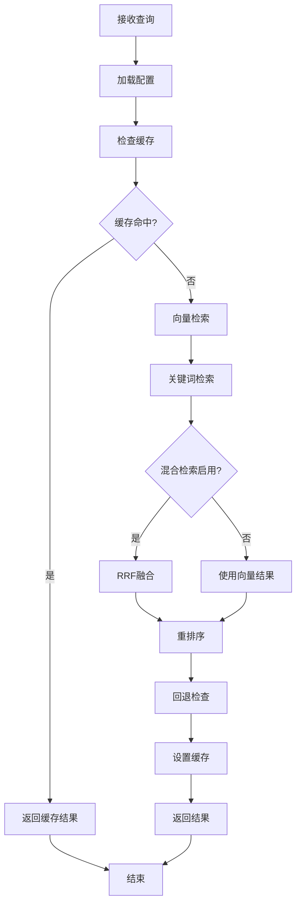

**图表来源**
- [src/rag/knowledge_tool.py](file://src/rag/knowledge_tool.py#L177-L248)

#### 关键词检索算法

系统实现了基于TF-IDF思想的关键词匹配算法：

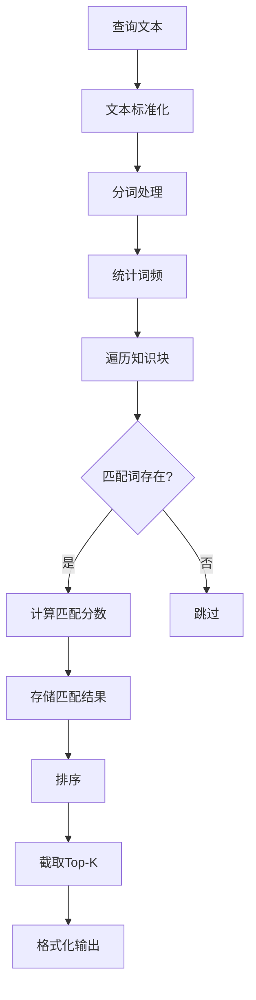

**图表来源**
- [src/rag/knowledge_tool.py](file://src/rag/knowledge_tool.py#L84-L112)

**章节来源**
- [src/rag/knowledge_tool.py](file://src/rag/knowledge_tool.py#L22-L273)

### 混合检索策略

系统实现了基于RRF（Reciprocal Rank Fusion）的混合检索策略，结合向量检索和关键词检索的优势：

#### RRF融合算法

```mermaid
flowchart TD
A[向量检索结果] --> B[RRF计算1]
C[关键词检索结果] --> D[RRF计算2]
B --> E[合并结果集]
D --> E
E --> F[计算融合分数]
F --> G[排序]
G --> H[截取Top-K]
B1[向量结果分数] --> B2[1/(k+rank)]
C1[关键词结果分数] --> C2[1/(k+rank)]
B2 --> E
C2 --> E
```

**图表来源**
- [src/rag/knowledge_tool.py](file://src/rag/knowledge_tool.py#L115-L138)

#### 重排序机制

系统使用CrossEncoder模型对混合检索结果进行重排序：

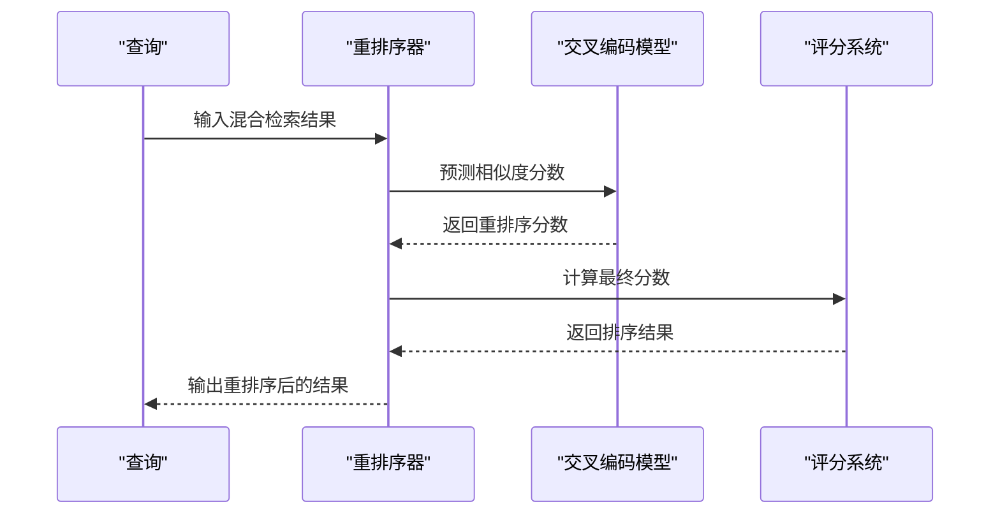

**图表来源**
- [src/rag/knowledge_tool.py](file://src/rag/knowledge_tool.py#L140-L151)

**章节来源**
- [src/rag/knowledge_tool.py](file://src/rag/knowledge_tool.py#L115-L151)

### 索引构建系统

#### 文本分块处理器

ChunkProcessor类负责将原始文档分割为可处理的知识块：

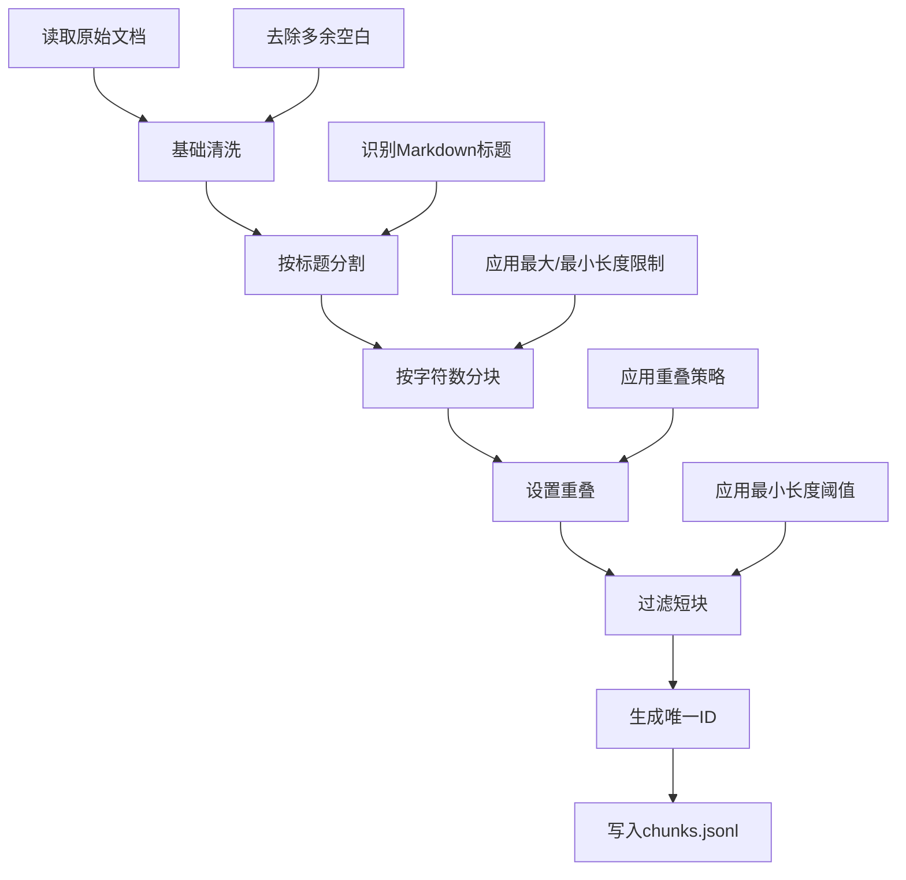

**图表来源**
- [src/rag/scripts/prepare_chunks.py](file://src/rag/scripts/prepare_chunks.py#L53-L94)

#### ChromaDB索引构建

IndexBuilder类负责将文本块转换为向量并构建ChromaDB索引：

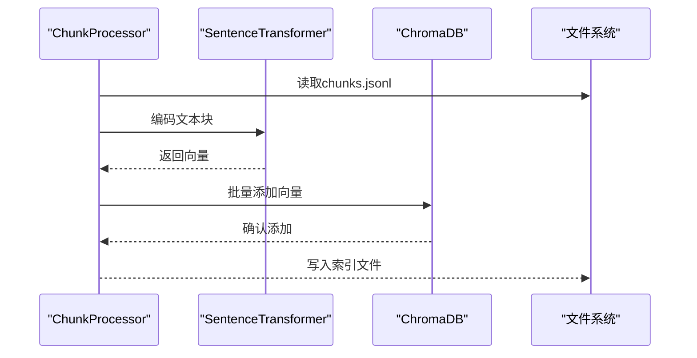

**图表来源**
- [src/rag/scripts/build_chroma_index.py](file://src/rag/scripts/build_chroma_index.py#L68-L81)

**章节来源**
- [src/rag/scripts/prepare_chunks.py](file://src/rag/scripts/prepare_chunks.py#L109-L138)
- [src/rag/scripts/build_chroma_index.py](file://src/rag/scripts/build_chroma_index.py#L37-L81)

### 查询接口系统

#### 知识库查询接口

query_investment_knowledge函数提供了统一的查询接口：

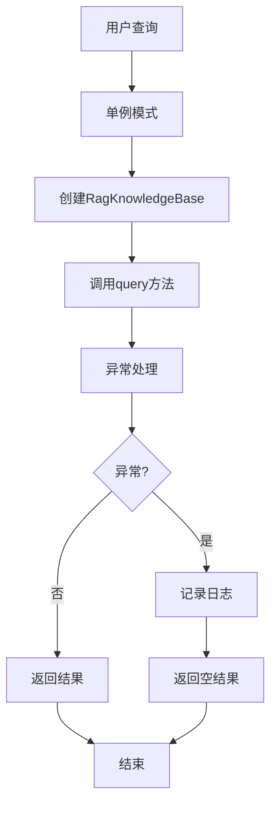

**图表来源**
- [src/rag/knowledge_tool.py](file://src/rag/knowledge_tool.py#L254-L273)

#### 独立查询脚本

系统提供了多个独立的查询脚本用于测试和调试：

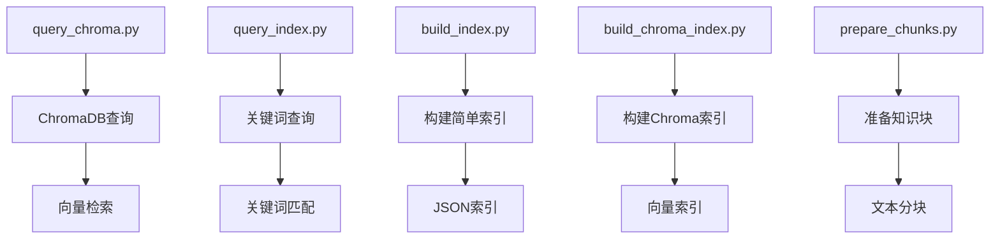

**图表来源**
- [src/rag/scripts/query_chroma.py](file://src/rag/scripts/query_chroma.py#L45-L86)
- [src/rag/scripts/query_index.py](file://src/rag/scripts/query_index.py#L72-L94)

**章节来源**
- [src/rag/knowledge_tool.py](file://src/rag/knowledge_tool.py#L254-L273)
- [src/rag/scripts/query_chroma.py](file://src/rag/scripts/query_chroma.py#L45-L86)
- [src/rag/scripts/query_index.py](file://src/rag/scripts/query_index.py#L72-L94)

## 依赖关系分析

### 外部依赖关系

系统依赖于多个Python包来实现RAG功能：

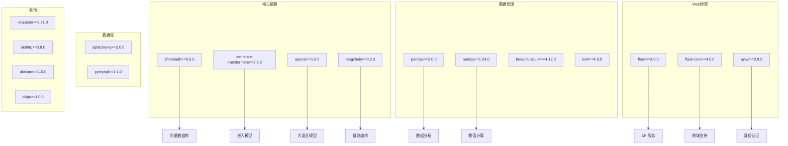

**图表来源**
- [requirements.txt](file://requirements.txt#L1-L41)

### 内部模块依赖

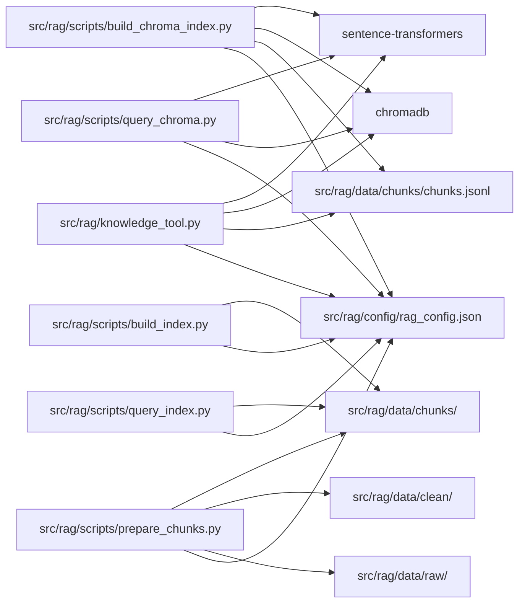

**图表来源**
- [src/rag/knowledge_tool.py](file://src/rag/knowledge_tool.py#L35-L60)
- [src/rag/scripts/prepare_chunks.py](file://src/rag/scripts/prepare_chunks.py#L141-L161)
- [src/rag/scripts/build_chroma_index.py](file://src/rag/scripts/build_chroma_index.py#L37-L60)

**章节来源**
- [requirements.txt](file://requirements.txt#L1-L41)
- [src/rag/knowledge_tool.py](file://src/rag/knowledge_tool.py#L35-L60)

## 性能考虑

### 缓存策略

系统实现了多级缓存机制来提升查询性能：

#### 查询缓存实现

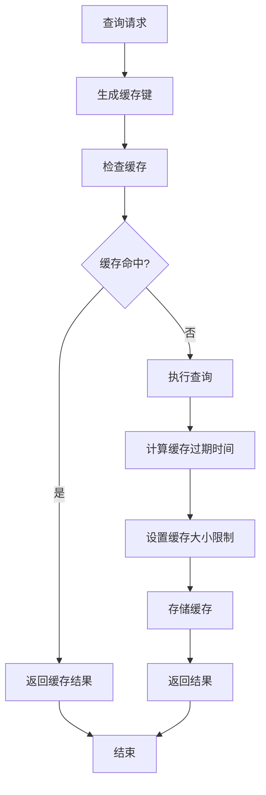

**图表来源**
- [src/rag/knowledge_tool.py](file://src/rag/knowledge_tool.py#L153-L175)

#### 批处理优化

ChromaDB索引构建采用了批量处理策略：

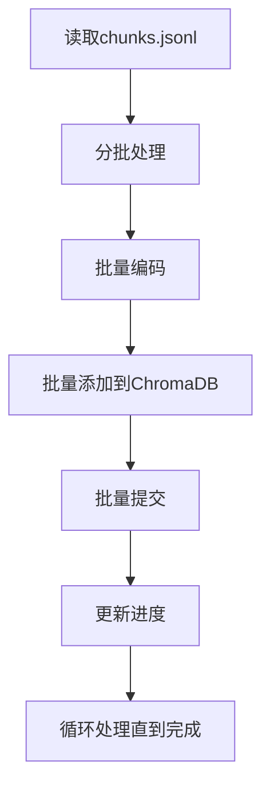

**图表来源**
- [src/rag/scripts/build_chroma_index.py](file://src/rag/scripts/build_chroma_index.py#L68-L81)

### 性能调优建议

1. **嵌入模型优化**：选择合适的嵌入模型平衡精度和速度
2. **索引参数调优**：根据数据量调整batch_size和top_k参数
3. **内存管理**：合理设置缓存大小和过期时间
4. **并发处理**：在高并发场景下考虑连接池配置

## 故障排除指南

### 常见问题诊断

#### 索引构建失败

**问题症状**：构建索引时报错或索引为空

**可能原因**：
1. chunks.jsonl文件不存在或格式错误
2. 嵌入模型下载失败
3. ChromaDB权限问题

**解决方案**：
1. 检查chunks.jsonl文件是否存在
2. 验证嵌入模型配置正确
3. 确认ChromaDB目录权限

#### 查询结果为空

**问题症状**：查询返回空结果或很少结果

**可能原因**：
1. 查询向量编码失败
2. ChromaDB索引损坏
3. 混合检索参数不当

**解决方案**：
1. 重新构建ChromaDB索引
2. 调整混合检索参数
3. 检查嵌入模型加载

#### 性能问题

**问题症状**：查询响应缓慢

**可能原因**：
1. 缓存未生效
2. 批处理大小不合适
3. 硬件资源不足

**解决方案**：
1. 检查缓存配置
2. 调整batch_size参数
3. 监控系统资源使用

**章节来源**
- [src/rag/knowledge_tool.py](file://src/rag/knowledge_tool.py#L268-L272)
- [src/rag/scripts/build_chroma_index.py](file://src/rag/scripts/build_chroma_index.py#L44-L45)

### 调试技巧

1. **日志记录**：利用Python logging模块记录详细信息
2. **异常处理**：捕获并记录所有异常信息
3. **性能监控**：监控查询时间和内存使用
4. **数据验证**：验证输入数据格式和完整性

## 结论

RAG知识库系统是一个功能完整、架构清晰的投资分析辅助工具。系统的主要特点包括：

1. **模块化设计**：采用分层架构，职责分离明确
2. **混合检索**：结合向量检索和关键词检索的优势
3. **可扩展性**：支持自定义检索算法和评估指标
4. **性能优化**：实现多级缓存和批量处理
5. **易于维护**：配置文件化管理，便于部署和维护

该系统为投资分析提供了强大的知识检索能力，能够帮助用户快速获取相关信息，提高决策效率。通过合理的配置和优化，系统可以在不同规模的应用场景中发挥重要作用。

## 附录

### 配置参数说明

#### 基础配置参数

| 参数名 | 类型 | 默认值 | 描述 |
|--------|------|--------|------|
| raw_dir | 字符串 | data/raw | 原始文档目录 |
| clean_dir | 字符串 | data/clean | 清洗后文档目录 |
| chunks_dir | 字符串 | data/chunks | 知识块目录 |

#### 索引配置参数

| 参数名 | 类型 | 默认值 | 描述 |
|--------|------|--------|------|
| index_dir | 字符串 | index | 索引目录 |
| index_file | 字符串 | simple_index.json | 简单索引文件名 |

#### ChromaDB配置参数

| 参数名 | 类型 | 默认值 | 描述 |
|--------|------|--------|------|
| persist_dir | 字符串 | index/chroma | 持久化目录 |
| collection | 字符串 | rag_knowledge | 集合名称 |
| reset | 布尔值 | true | 是否重置索引 |
| batch_size | 整数 | 64 | 批处理大小 |

#### 嵌入模型配置参数

| 参数名 | 类型 | 默认值 | 描述 |
|--------|------|--------|------|
| model_name | 字符串 | BAAI/bge-small-zh-v1.5 | 嵌入模型名称 |

#### 重排序配置参数

| 参数名 | 类型 | 默认值 | 描述 |
|--------|------|--------|------|
| enabled | 布尔值 | true | 是否启用重排序 |
| model_name | 字符串 | BAAI/bge-reranker-base | 重排序模型名称 |
| top_k | 整数 | 3 | 重排序返回数量 |
| min_candidates | 整数 | 3 | 最小候选数量 |

#### 缓存配置参数

| 参数名 | 类型 | 默认值 | 描述 |
|--------|------|--------|------|
| enabled | 布尔值 | true | 是否启用缓存 |
| ttl_seconds | 整数 | 300 | 缓存过期时间(秒) |
| max_size | 整数 | 256 | 缓存最大数量 |

#### 分块配置参数

| 参数名 | 类型 | 默认值 | 描述 |
|--------|------|--------|------|
| max_chars | 整数 | 800 | 最大字符数 |
| min_chars | 整数 | 200 | 最小字符数 |
| overlap_chars | 整数 | 80 | 重叠字符数 |
| heading_weight | 布尔值 | true | 标题权重 |

#### 查询配置参数

| 参数名 | 类型 | 默认值 | 描述 |
|--------|------|--------|------|
| top_k | 整数 | 5 | 返回结果数量 |

#### 混合检索配置参数

| 参数名 | 类型 | 默认值 | 描述 |
|--------|------|--------|------|
| enabled | 布尔值 | true | 是否启用混合检索 |
| vector_top_k | 整数 | 8 | 向量检索返回数量 |
| keyword_top_k | 整数 | 8 | 关键词检索返回数量 |
| rrf_k | 整数 | 60 | RRF融合参数 |

#### 回退配置参数

| 参数名 | 类型 | 默认值 | 描述 |
|--------|------|--------|------|
| min_results | 整数 | 1 | 最小结果数量 |
| min_score | 浮点数 | 0.02 | 最小分数阈值 |

#### IO配置参数

| 参数名 | 类型 | 默认值 | 描述 |
|--------|------|--------|------|
| encoding | 字符串 | utf-8 | 文件编码 |
| allowed_exts | 数组 | [".md",".txt"] | 允许的文件扩展名 |

### 扩展指南

#### 新增知识源

1. **添加数据格式支持**：修改文件扫描逻辑以支持新的文件格式
2. **自定义清洗规则**：根据新格式编写相应的清洗函数
3. **更新配置文件**：添加新的数据源配置参数

#### 自定义检索算法

1. **实现新检索器**：继承基础检索类并实现自定义算法
2. **集成到查询流程**：在主查询方法中调用新检索器
3. **配置参数调整**：添加新算法的配置参数

#### 评估指标

1. **定义评估指标**：根据业务需求定义合适的评估指标
2. **实现评估函数**：编写评估函数计算各项指标
3. **集成到测试流程**：在测试脚本中集成评估流程