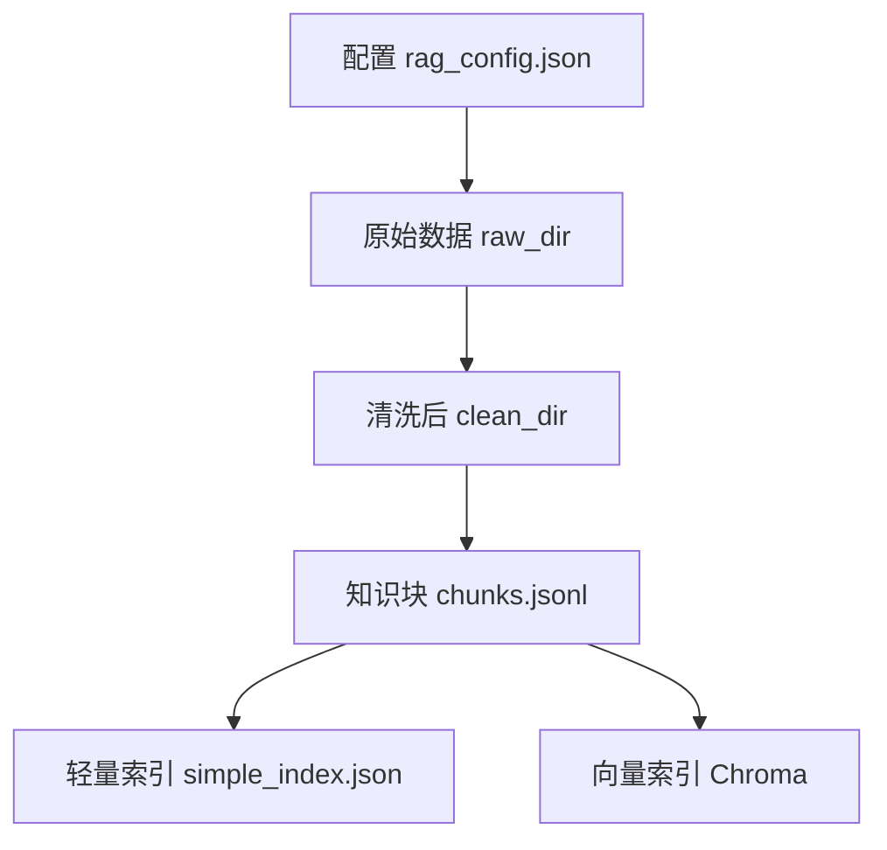
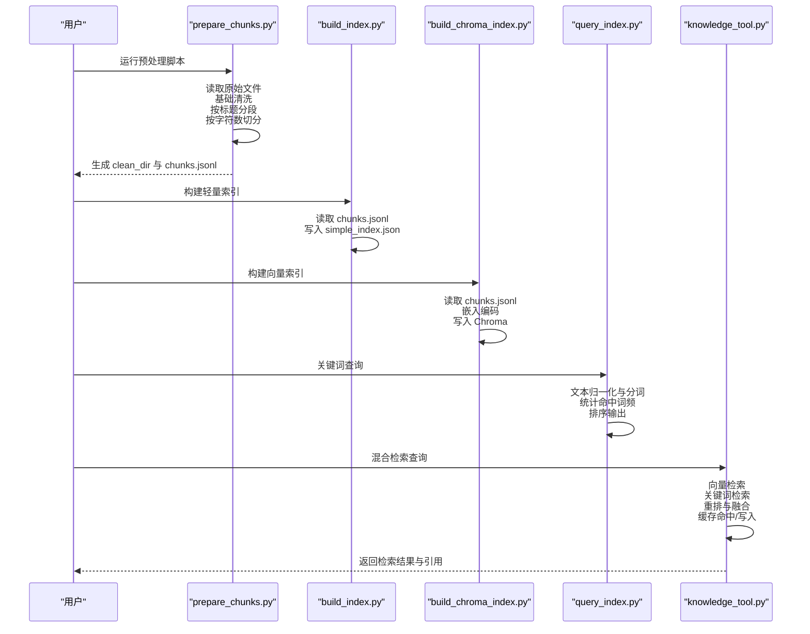
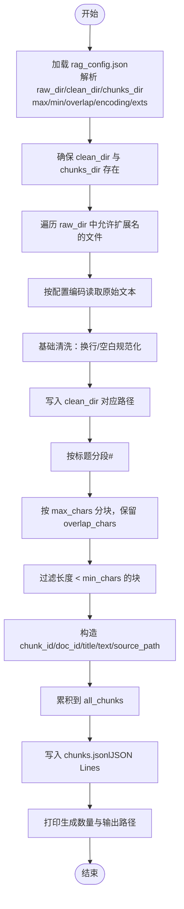
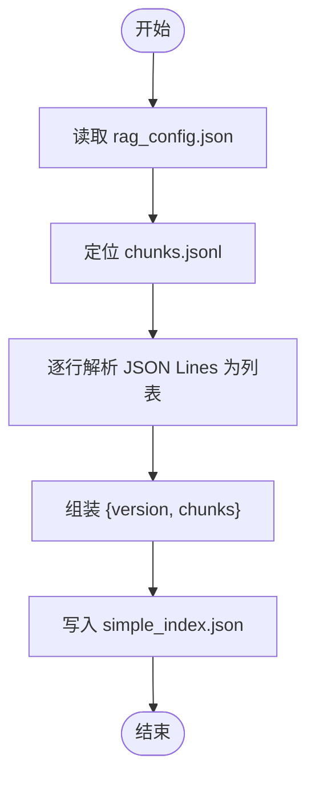
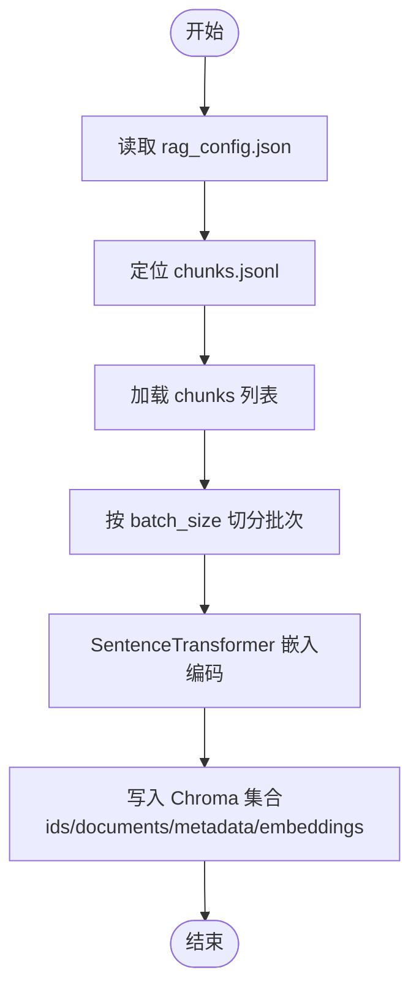
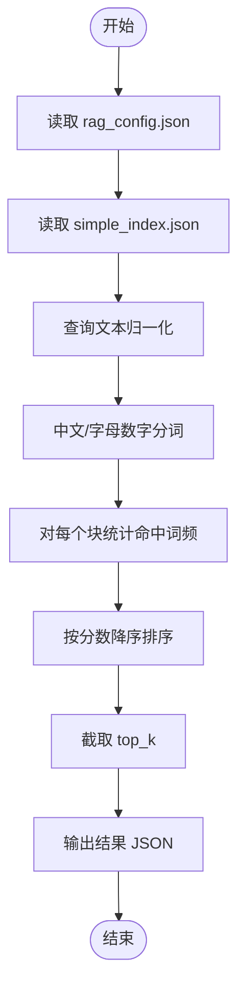
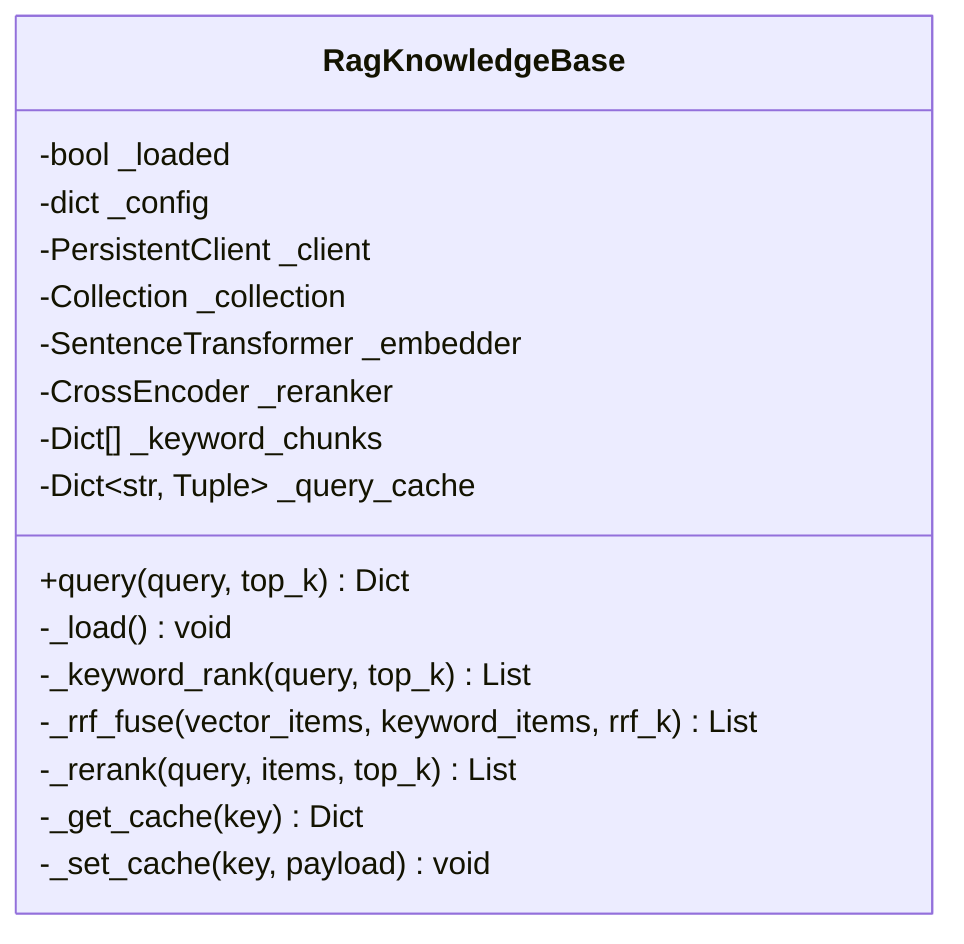
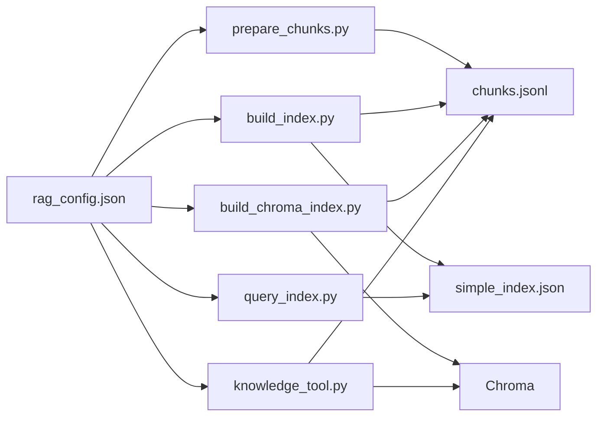

# 数据预处理与清洗

<cite>
**本文引用的文件**
- [prepare_chunks.py](file://src/rag/scripts/prepare_chunks.py)
- [build_index.py](file://src/rag/scripts/build_index.py)
- [build_chroma_index.py](file://src/rag/scripts/build_chroma_index.py)
- [query_index.py](file://src/rag/scripts/query_index.py)
- [knowledge_tool.py](file://src/rag/knowledge_tool.py)
- [rag_config.json](file://src/rag/config/rag_config.json)
- [chunks.jsonl](file://src/rag/data/chunks/chunks.jsonl)
- [A股交易与监管规则.md](file://src/rag/data/clean/A股交易与监管规则.md)
</cite>

## 目录
1. [简介](#简介)
2. [项目结构](#项目结构)
3. [核心组件](#核心组件)
4. [架构总览](#架构总览)
5. [详细组件分析](#详细组件分析)
6. [依赖关系分析](#依赖关系分析)
7. [性能考量](#性能考量)
8. [故障排查指南](#故障排查指南)
9. [结论](#结论)
10. [附录](#附录)

## 简介
本文件面向知识库数据的预处理与清洗流程，系统化阐述从原始文档到可检索知识块的完整管线，涵盖中文文本清洗、特殊字符清理、格式标准化、分块策略（大小、重叠、语义完整性）、关键词分块加载与存储、数据质量检查与验证方法，以及数据预处理脚本的使用指南与参数配置。目标读者既包括开发者也包括非技术使用者，力求以循序渐进的方式呈现。

## 项目结构
RAG 数据管线位于 src/rag 目录，包含配置、原始数据、清洗后数据、知识块、索引与脚本等层次化组织。核心流程如下：
- 配置：通过 rag_config.json 统一管理路径、编码、分块参数、IO 限制等
- 原始数据：src/rag/data/raw 下存放 Markdown/文本原始文档
- 清洗后数据：src/rag/data/clean 输出标准化后的文档
- 知识块：src/rag/data/chunks 生成 chunks.jsonl（JSON Lines）
- 索引：构建轻量关键词索引（simple_index.json）与向量索引（Chroma）
- 脚本：prepare_chunks.py、build_index.py、build_chroma_index.py、query_index.py
- 工具：knowledge_tool.py 提供查询与融合排序能力

**图示来源**
- [rag_config.json](file://src/rag/config/rag_config.json#L1-L58)
- [prepare_chunks.py](file://src/rag/scripts/prepare_chunks.py#L141-L161)
- [build_index.py](file://src/rag/scripts/build_index.py#L30-L54)
- [build_chroma_index.py](file://src/rag/scripts/build_chroma_index.py#L37-L83)

**章节来源**
- [rag_config.json](file://src/rag/config/rag_config.json#L1-L58)

## 核心组件
- 预处理脚本 prepare_chunks.py：负责读取原始文件、执行基础清洗、按标题分段、按字符数切分、写入清洗后文件与知识块 JSON Lines
- 轻量索引构建 build_index.py：将 chunks.jsonl 加载为内存索引并持久化为 simple_index.json
- 向量索引构建 build_chroma_index.py：使用嵌入模型将知识块向量化并写入 Chroma
- 查询脚本 query_index.py：对轻量索引进行关键词匹配与打分
- 知识库工具 knowledge_tool.py：封装向量检索、关键词检索、重排（rerank）、融合（RRF）与缓存

**章节来源**
- [prepare_chunks.py](file://src/rag/scripts/prepare_chunks.py#L141-L161)
- [build_index.py](file://src/rag/scripts/build_index.py#L30-L54)
- [build_chroma_index.py](file://src/rag/scripts/build_chroma_index.py#L37-L83)
- [query_index.py](file://src/rag/scripts/query_index.py#L72-L97)
- [knowledge_tool.py](file://src/rag/knowledge_tool.py#L22-L273)

## 架构总览
下图展示了从原始文档到检索系统的端到端流程，包括清洗、分块、索引构建与查询融合。

**图示来源**
- [prepare_chunks.py](file://src/rag/scripts/prepare_chunks.py#L141-L161)
- [build_index.py](file://src/rag/scripts/build_index.py#L30-L54)
- [build_chroma_index.py](file://src/rag/scripts/build_chroma_index.py#L37-L83)
- [query_index.py](file://src/rag/scripts/query_index.py#L72-L97)
- [knowledge_tool.py](file://src/rag/knowledge_tool.py#L177-L248)

## 详细组件分析

### 预处理与清洗：prepare_chunks.py
- 基础清洗（空白与换行规范化、多余空白压缩）
- 标题分段（Markdown 一级到六级标题作为分段边界）
- 字符数分块（支持 overlap 重叠，过滤小于 min_chars 的块）
- 输出：清洗后文档写入 clean_dir；知识块写入 chunks.jsonl（每行一条 JSON）

**图示来源**
- [prepare_chunks.py](file://src/rag/scripts/prepare_chunks.py#L29-L161)

**章节来源**
- [prepare_chunks.py](file://src/rag/scripts/prepare_chunks.py#L17-L161)
- [rag_config.json](file://src/rag/config/rag_config.json#L34-L56)

### 轻量索引构建：build_index.py
- 读取 rag_config.json，定位 chunks.jsonl
- 将所有知识块加载为内存索引结构（version + chunks）
- 写入 simple_index.json，便于无需向量模型的快速检索

**图示来源**
- [build_index.py](file://src/rag/scripts/build_index.py#L15-L54)

**章节来源**
- [build_index.py](file://src/rag/scripts/build_index.py#L30-L54)

### 向量索引构建：build_chroma_index.py
- 读取 rag_config.json，定位 chunks.jsonl
- 创建/获取 Chroma 集合，按 batch_size 批量嵌入编码
- 写入向量索引（支持 reset 重置集合）

**图示来源**
- [build_chroma_index.py](file://src/rag/scripts/build_chroma_index.py#L18-L83)

**章节来源**
- [build_chroma_index.py](file://src/rag/scripts/build_chroma_index.py#L37-L83)

### 关键词查询：query_index.py
- 读取 simple_index.json
- 查询文本归一化与分词，统计命中文本的词频作为分数
- 按分数降序返回 top_k 结果

**图示来源**
- [query_index.py](file://src/rag/scripts/query_index.py#L16-L97)

**章节来源**
- [query_index.py](file://src/rag/scripts/query_index.py#L72-L97)

### 混合检索与重排：knowledge_tool.py
- 初始化：连接 Chroma、加载嵌入模型与可选重排模型
- 关键词检索：从 chunks.jsonl 加载关键词块，基于词频打分
- 向量检索：基于嵌入查询，返回 top_k
- 融合（RRF）：对向量与关键词结果按秩倒数融合
- 重排（rerank）：对候选对（query, text）进行交叉编码打分
- 缓存：按查询串与配置生成缓存键，支持 TTL 与容量上限
- 回退：当结果数量不足或最高分低于阈值时标记回退并附加提示

**图示来源**
- [knowledge_tool.py](file://src/rag/knowledge_tool.py#L22-L273)

**章节来源**
- [knowledge_tool.py](file://src/rag/knowledge_tool.py#L22-L273)

## 依赖关系分析
- 配置驱动：所有脚本与工具均通过 rag_config.json 解析路径与参数
- 文件依赖：prepare_chunks.py 输出 chunks.jsonl，build_index.py 与 build_chroma_index.py 均依赖该文件
- 模块依赖：knowledge_tool.py 依赖 Chroma 与嵌入模型，可选依赖重排模型
- 数据依赖：query_index.py 依赖 simple_index.json；knowledge_tool.py 依赖 Chroma 与 chunks.jsonl

**图示来源**
- [rag_config.json](file://src/rag/config/rag_config.json#L1-L58)
- [prepare_chunks.py](file://src/rag/scripts/prepare_chunks.py#L141-L161)
- [build_index.py](file://src/rag/scripts/build_index.py#L30-L54)
- [build_chroma_index.py](file://src/rag/scripts/build_chroma_index.py#L37-L83)
- [query_index.py](file://src/rag/scripts/query_index.py#L72-L97)
- [knowledge_tool.py](file://src/rag/knowledge_tool.py#L22-L273)

**章节来源**
- [rag_config.json](file://src/rag/config/rag_config.json#L1-L58)

## 性能考量
- 分块参数
  - max_chars：单块最大字符数，影响检索精度与上下文完整性
  - min_chars：过滤过短块，减少噪声
  - overlap_chars：前后块重叠，提升跨段落语义连贯性
- 批处理与并发
  - build_chroma_index.py 使用 batch_size 控制写入吞吐
  - prepare_chunks.py 采用流式写入 chunks.jsonl，避免内存峰值
- 模型与缓存
  - 向量嵌入与重排为 CPU/GPU 密集任务，建议在本地或 GPU 环境执行
  - knowledge_tool.py 的查询缓存可显著降低重复查询开销
- I/O 与编码
  - 统一 UTF-8 编码，避免跨平台乱码
  - 允许扩展名白名单控制处理范围

[本节为通用指导，无需特定文件分析]

## 故障排查指南
- 未找到知识块文件
  - 现象：构建索引或向量索引时报错
  - 排查：确认 chunks.jsonl 是否存在，路径是否与配置一致
  - 参考
    - [build_index.py](file://src/rag/scripts/build_index.py#L40-L42)
    - [build_chroma_index.py](file://src/rag/scripts/build_chroma_index.py#L44-L45)
- 索引文件缺失
  - 现象：关键词查询报错
  - 排查：确认 simple_index.json 是否存在
  - 参考
    - [query_index.py](file://src/rag/scripts/query_index.py#L79-L80)
- 查询为空
  - 现象：关键词查询直接退出
  - 排查：检查输入是否为空
  - 参考
    - [query_index.py](file://src/rag/scripts/query_index.py#L85-L88)
- 向量检索无结果
  - 现象：混合检索返回空或少量结果
  - 排查：确认 Chroma 集合是否存在、嵌入模型是否加载成功、batch_size 是否合理
  - 参考
    - [build_chroma_index.py](file://src/rag/scripts/build_chroma_index.py#L53-L59)
    - [knowledge_tool.py](file://src/rag/knowledge_tool.py#L42-L49)
- 结果质量不佳
  - 现象：关键词命中过多噪音或向量检索语义不相关
  - 排查：调整分块参数（max_chars/min_chars/overlap_chars）、启用重排、提高 rerank 的 min_candidates 或调整 top_k
  - 参考
    - [rag_config.json](file://src/rag/config/rag_config.json#L34-L52)
    - [knowledge_tool.py](file://src/rag/knowledge_tool.py#L190-L224)

**章节来源**
- [build_index.py](file://src/rag/scripts/build_index.py#L40-L42)
- [build_chroma_index.py](file://src/rag/scripts/build_chroma_index.py#L44-L45)
- [query_index.py](file://src/rag/scripts/query_index.py#L79-L88)
- [knowledge_tool.py](file://src/rag/knowledge_tool.py#L42-L49)

## 结论
本数据预处理与清洗方案以配置为中心，通过 prepare_chunks.py 完成中文文本清洗、标题分段与字符数分块，产出标准化知识块；随后通过 build_index.py 与 build_chroma_index.py 构建轻量关键词索引与向量索引；最后由 knowledge_tool.py 提供混合检索、重排与缓存能力。合理的分块参数与索引策略能够兼顾检索精度与性能，满足投资研究场景的知识检索需求。

[本节为总结，无需特定文件分析]

## 附录

### 数据质量检查与验证方法
- 文本完整性
  - 检查清洗后文档是否保留原文核心信息与结构（标题、表格、公式等）
  - 参考示例文件
    - [A股交易与监管规则.md](file://src/rag/data/clean/A股交易与监管规则.md#L1-L256)
- 分块合理性
  - 统计 chunks.jsonl 中块长度分布，核对 min_chars/max_chars 设置是否生效
  - 参考输出文件
    - [chunks.jsonl](file://src/rag/data/chunks/chunks.jsonl#L1-L101)
- 索引一致性
  - 对比 simple_index.json 与 chunks.jsonl 的条目数量
  - 参考
    - [build_index.py](file://src/rag/scripts/build_index.py#L50-L54)
- 检索效果验证
  - 使用 query_index.py 对代表性问题进行关键词检索，观察命中块是否相关
  - 使用 knowledge_tool.py 进行混合检索，评估融合与重排效果

**章节来源**
- [A股交易与监管规则.md](file://src/rag/data/clean/A股交易与监管规则.md#L1-L256)
- [chunks.jsonl](file://src/rag/data/chunks/chunks.jsonl#L1-L101)
- [build_index.py](file://src/rag/scripts/build_index.py#L50-L54)
- [query_index.py](file://src/rag/scripts/query_index.py#L72-L97)
- [knowledge_tool.py](file://src/rag/knowledge_tool.py#L177-L248)

### 数据预处理脚本使用指南与参数配置
- 运行步骤
  1) 准备原始文档至 raw_dir（默认 data/raw）
  2) 运行 prepare_chunks.py 生成 clean_dir 与 chunks.jsonl
  3) 可选：运行 build_index.py 生成 simple_index.json
  4) 可选：运行 build_chroma_index.py 生成 Chroma 向量索引
  5) 使用 query_index.py 或 knowledge_tool.py 进行查询
- 关键参数（来自 rag_config.json）
  - data：raw_dir、clean_dir、chunks_dir
  - io：encoding、allowed_exts
  - chunking：max_chars、min_chars、overlap_chars
  - index：index_dir、index_file
  - chroma：persist_dir、collection、reset、batch_size
  - embedding：model_name
  - rerank：enabled、model_name、top_k、min_candidates
  - cache：enabled、ttl_seconds、max_size
  - hf：local_files_only
  - query：top_k
  - hybrid：enabled、vector_top_k、keyword_top_k、rrf_k
  - fallback：min_results、min_score

**章节来源**
- [prepare_chunks.py](file://src/rag/scripts/prepare_chunks.py#L141-L161)
- [build_index.py](file://src/rag/scripts/build_index.py#L30-L54)
- [build_chroma_index.py](file://src/rag/scripts/build_chroma_index.py#L37-L83)
- [query_index.py](file://src/rag/scripts/query_index.py#L72-L97)
- [knowledge_tool.py](file://src/rag/knowledge_tool.py#L177-L248)
- [rag_config.json](file://src/rag/config/rag_config.json#L1-L58)