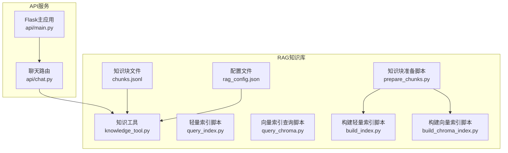
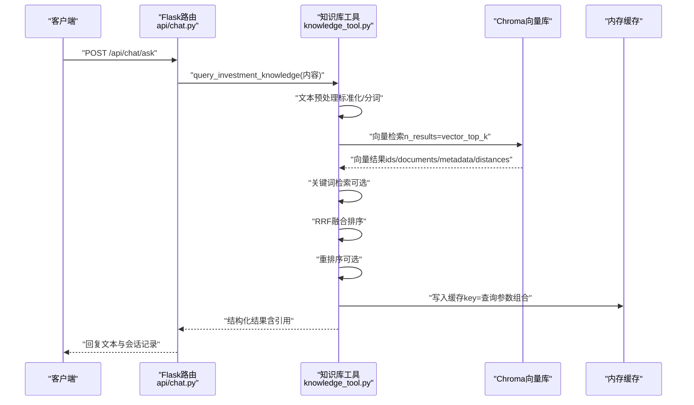
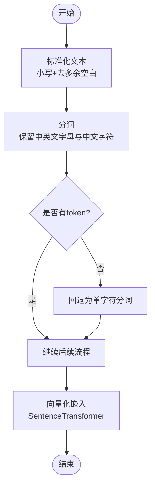
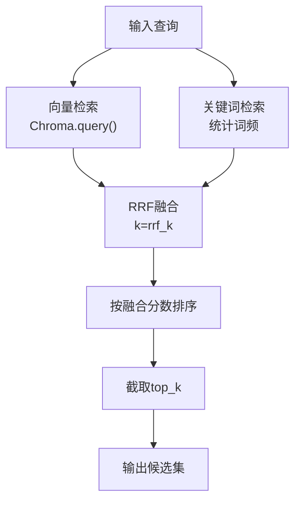
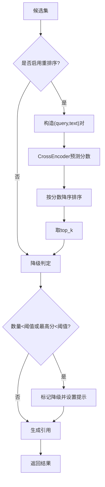
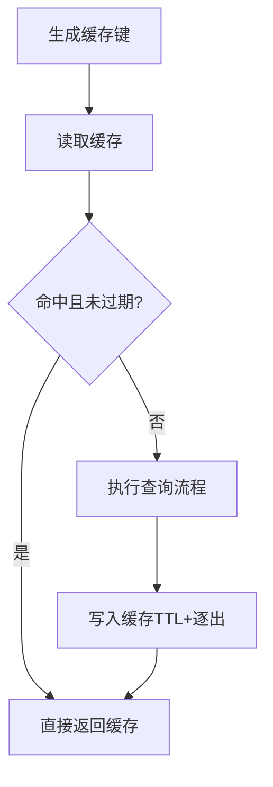
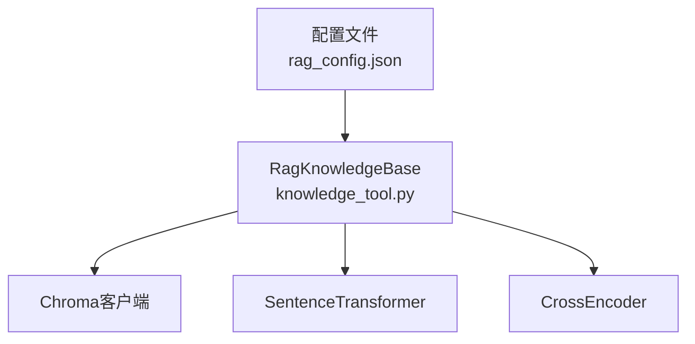

# 查询处理与缓存

<cite>
**本文档引用的文件**
- [src/rag/knowledge_tool.py](file://src/rag/knowledge_tool.py)
- [src/rag/scripts/query_index.py](file://src/rag/scripts/query_index.py)
- [src/rag/scripts/query_chroma.py](file://src/rag/scripts/query_chroma.py)
- [src/rag/scripts/build_index.py](file://src/rag/scripts/build_index.py)
- [src/rag/scripts/build_chroma_index.py](file://src/rag/scripts/build_chroma_index.py)
- [src/rag/scripts/prepare_chunks.py](file://src/rag/scripts/prepare_chunks.py)
- [src/rag/config/rag_config.json](file://src/rag/config/rag_config.json)
- [src/rag/data/chunks/chunks.jsonl](file://src/rag/data/chunks/chunks.jsonl)
- [src/api/main.py](file://src/api/main.py)
- [src/api/chat.py](file://src/api/chat.py)
</cite>

## 目录
1. [简介](#简介)
2. [项目结构](#项目结构)
3. [核心组件](#核心组件)
4. [架构概览](#架构概览)
5. [详细组件分析](#详细组件分析)
6. [依赖分析](#依赖分析)
7. [性能考虑](#性能考虑)
8. [故障排查指南](#故障排查指南)
9. [结论](#结论)
10. [附录](#附录)

## 简介
本文件面向RAG查询处理与缓存机制，系统性阐述从查询预处理、向量化检索、混合排序、重排序、缓存策略、降级与错误处理，到结果后处理与性能优化的完整流程。文档同时提供查询示例与最佳实践，帮助开发者与运维人员高效部署与维护。

## 项目结构
RAG相关代码集中在src/rag目录，包含配置、脚本与知识工具模块；API入口位于src/api，负责请求接入与日志记录。

**图表来源**
- [src/rag/config/rag_config.json](file://src/rag/config/rag_config.json#L1-L58)
- [src/rag/knowledge_tool.py](file://src/rag/knowledge_tool.py#L22-L273)
- [src/rag/scripts/query_index.py](file://src/rag/scripts/query_index.py#L72-L97)
- [src/rag/scripts/query_chroma.py](file://src/rag/scripts/query_chroma.py#L45-L89)
- [src/rag/scripts/build_index.py](file://src/rag/scripts/build_index.py#L30-L55)
- [src/rag/scripts/build_chroma_index.py](file://src/rag/scripts/build_chroma_index.py#L37-L84)
- [src/rag/scripts/prepare_chunks.py](file://src/rag/scripts/prepare_chunks.py#L141-L161)
- [src/rag/data/chunks/chunks.jsonl](file://src/rag/data/chunks/chunks.jsonl#L1-L101)
- [src/api/main.py](file://src/api/main.py#L40-L243)
- [src/api/chat.py](file://src/api/chat.py#L171-L216)

**章节来源**
- [src/rag/config/rag_config.json](file://src/rag/config/rag_config.json#L1-L58)
- [src/rag/knowledge_tool.py](file://src/rag/knowledge_tool.py#L22-L273)
- [src/api/main.py](file://src/api/main.py#L40-L243)

## 核心组件
- 知识库工具（RagKnowledgeBase）：封装Chroma向量检索、关键词检索、重排序、融合排序（RRF）、缓存与降级逻辑。
- 查询脚本：提供独立的向量检索与关键词检索CLI工具，便于调试与验证。
- 索引构建脚本：将清洗后的知识块批量嵌入并写入Chroma或生成轻量JSON索引。
- API集成：在聊天路由中调用知识库工具，返回结构化结果并记录请求耗时。

**章节来源**
- [src/rag/knowledge_tool.py](file://src/rag/knowledge_tool.py#L22-L273)
- [src/rag/scripts/query_index.py](file://src/rag/scripts/query_index.py#L72-L97)
- [src/rag/scripts/query_chroma.py](file://src/rag/scripts/query_chroma.py#L45-L89)
- [src/rag/scripts/build_index.py](file://src/rag/scripts/build_index.py#L30-L55)
- [src/rag/scripts/build_chroma_index.py](file://src/rag/scripts/build_chroma_index.py#L37-L84)
- [src/api/chat.py](file://src/api/chat.py#L171-L216)

## 架构概览
RAG查询处理链路如下：客户端请求经API路由进入聊天接口，调用知识库工具执行查询；工具内部按配置执行文本预处理、向量化检索、关键词检索、融合排序与重排序，最后写入缓存并返回结构化结果。

**图表来源**
- [src/api/chat.py](file://src/api/chat.py#L171-L216)
- [src/rag/knowledge_tool.py](file://src/rag/knowledge_tool.py#L177-L248)
- [src/rag/scripts/query_chroma.py](file://src/rag/scripts/query_chroma.py#L45-L89)

## 详细组件分析

### 文本预处理与向量化
- 文本标准化：统一大小写、去除多余空白。
- 分词策略：保留中英文字符，支持中文分词效果；若无有效token，则回退为单字符分词。
- 向量化：使用SentenceTransformer加载指定模型，对查询进行嵌入编码并归一化。

**图表来源**
- [src/rag/knowledge_tool.py](file://src/rag/knowledge_tool.py#L74-L83)
- [src/rag/knowledge_tool.py](file://src/rag/knowledge_tool.py#L197-L198)

**章节来源**
- [src/rag/knowledge_tool.py](file://src/rag/knowledge_tool.py#L74-L83)
- [src/rag/knowledge_tool.py](file://src/rag/knowledge_tool.py#L197-L198)

### 向量检索与关键词检索
- 向量检索：通过Chroma客户端查询，返回ids、documents、metadatas与distances。
- 关键词检索：对知识块进行标准化与分词，统计查询词在文本中的出现次数作为关键词分数。
- 混合检索：当启用混合模式时，将向量与关键词结果按RRF公式融合，按融合分数排序。

**图表来源**
- [src/rag/knowledge_tool.py](file://src/rag/knowledge_tool.py#L197-L217)
- [src/rag/knowledge_tool.py](file://src/rag/knowledge_tool.py#L84-L112)
- [src/rag/knowledge_tool.py](file://src/rag/knowledge_tool.py#L115-L138)

**章节来源**
- [src/rag/knowledge_tool.py](file://src/rag/knowledge_tool.py#L197-L217)
- [src/rag/knowledge_tool.py](file://src/rag/knowledge_tool.py#L84-L112)
- [src/rag/knowledge_tool.py](file://src/rag/knowledge_tool.py#L115-L138)

### 重排序与降级机制
- 重排序：对候选集与查询组成pair，使用CrossEncoder模型预测相关性分数，按分数降序取top_k。
- 降级判定：若候选数量不足或最高融合分数低于阈值，则标记为降级并附加提示信息。
- 引用生成：从元数据提取标题与来源，用于结果引用。

**图表来源**
- [src/rag/knowledge_tool.py](file://src/rag/knowledge_tool.py#L219-L248)

**章节来源**
- [src/rag/knowledge_tool.py](file://src/rag/knowledge_tool.py#L219-L248)

### 查询缓存机制
- 缓存键：由查询文本、返回条数与混合检索开关共同构成，确保不同参数组合的独立缓存。
- TTL管理：默认5分钟，超时自动清理。
- 内存控制：最大缓存条目数默认256，超过上限逐出最旧条目。
- 命中与写入：命中直接返回；未命中则在返回前写入缓存。

**图表来源**
- [src/rag/knowledge_tool.py](file://src/rag/knowledge_tool.py#L153-L175)
- [src/rag/knowledge_tool.py](file://src/rag/knowledge_tool.py#L182-L185)
- [src/rag/knowledge_tool.py](file://src/rag/knowledge_tool.py#L247-L248)

**章节来源**
- [src/rag/knowledge_tool.py](file://src/rag/knowledge_tool.py#L153-L175)
- [src/rag/knowledge_tool.py](file://src/rag/knowledge_tool.py#L182-L185)
- [src/rag/knowledge_tool.py](file://src/rag/knowledge_tool.py#L247-L248)

### 结果后处理与格式化
- 去重：融合阶段以chunk_id为键合并，天然去重。
- 排序：优先融合分数（RRF），其次重排序分数（如启用）。
- 格式化：输出包含查询语句、候选结果、引用信息与降级标记，便于前端渲染与溯源。

**章节来源**
- [src/rag/knowledge_tool.py](file://src/rag/knowledge_tool.py#L138-L151)
- [src/rag/knowledge_tool.py](file://src/rag/knowledge_tool.py#L240-L246)

### 错误处理与降级策略
- 工具层捕获异常并返回结构化错误字段，避免服务崩溃。
- 降级提示：当结果不足或相关性过低时，返回降级标记与提示信息，引导用户调整查询或补充信息。

**章节来源**
- [src/rag/knowledge_tool.py](file://src/rag/knowledge_tool.py#L254-L272)
- [src/rag/knowledge_tool.py](file://src/rag/knowledge_tool.py#L225-L228)

### API集成与监控
- 请求监控：全局中间件记录请求开始时间与耗时，统一输出日志。
- 聊天路由：在问答流程中调用知识库工具，将用户消息与助手回复写入历史表。

**章节来源**
- [src/api/main.py](file://src/api/main.py#L68-L83)
- [src/api/chat.py](file://src/api/chat.py#L171-L216)

## 依赖分析
RAG知识库工具依赖Chroma向量库与SentenceTransformer模型，支持可选的重排序模型；配置文件集中管理模型、索引、缓存与混合检索参数。

**图表来源**
- [src/rag/knowledge_tool.py](file://src/rag/knowledge_tool.py#L25-L54)
- [src/rag/config/rag_config.json](file://src/rag/config/rag_config.json#L11-L29)

**章节来源**
- [src/rag/knowledge_tool.py](file://src/rag/knowledge_tool.py#L25-L54)
- [src/rag/config/rag_config.json](file://src/rag/config/rag_config.json#L11-L29)

## 性能考虑
- 向量检索top_k：向量检索阶段先扩大到vector_top_k，再在融合阶段统一截断，提高召回质量。
- 混合检索：关键词检索与向量检索互补，RRF融合提升排序稳定性。
- 重排序：仅在候选数量与查询长度满足阈值时启用，避免无效计算。
- 缓存：启用内存缓存显著降低重复查询延迟，建议根据业务QPS调整max_size与ttl。
- 批量写入：构建Chroma索引时采用批次写入，减少内存峰值与IO压力。

**章节来源**
- [src/rag/knowledge_tool.py](file://src/rag/knowledge_tool.py#L193-L195)
- [src/rag/knowledge_tool.py](file://src/rag/knowledge_tool.py#L219-L223)
- [src/rag/knowledge_tool.py](file://src/rag/knowledge_tool.py#L167-L175)
- [src/rag/scripts/build_chroma_index.py](file://src/rag/scripts/build_chroma_index.py#L68-L80)

## 故障排查指南
- 模型加载失败：检查配置中的模型名称与本地文件策略，确认模型文件存在。
- Chroma连接异常：确认持久化目录权限与磁盘空间，检查集合名称一致性。
- 查询结果为空：检查混合检索开关、关键词索引是否存在、查询长度是否过短。
- 缓存未生效：确认缓存开关与TTL设置，检查max_size是否过小导致频繁逐出。
- API响应慢：开启请求耗时日志，定位瓶颈在向量检索、重排序还是缓存未命中。

**章节来源**
- [src/rag/config/rag_config.json](file://src/rag/config/rag_config.json#L17-L29)
- [src/rag/knowledge_tool.py](file://src/rag/knowledge_tool.py#L153-L175)
- [src/api/main.py](file://src/api/main.py#L68-L83)

## 结论
本方案通过“向量检索+关键词检索+RRF融合+可选重排序”的混合策略，结合内存缓存与降级提示，实现了高质量、低延迟的RAG查询体验。配合完善的配置管理与监控日志，可在生产环境中稳定运行并持续优化。

## 附录

### 查询示例与最佳实践
- 示例查询：围绕“A股交易与监管规则”“估值与分析框架”等主题提问，建议使用具体术语与限定范围，提升检索精度。
- 最佳实践：
  - 合理设置top_k与vector_top_k，兼顾召回与性能。
  - 启用混合检索与重排序，提升排序质量。
  - 调整缓存max_size与ttl，适配业务流量。
  - 定期评估降级率，优化查询与索引质量。

**章节来源**
- [src/rag/knowledge_tool.py](file://src/rag/knowledge_tool.py#L190-L195)
- [src/rag/knowledge_tool.py](file://src/rag/knowledge_tool.py#L219-L223)
- [src/rag/knowledge_tool.py](file://src/rag/knowledge_tool.py#L167-L175)