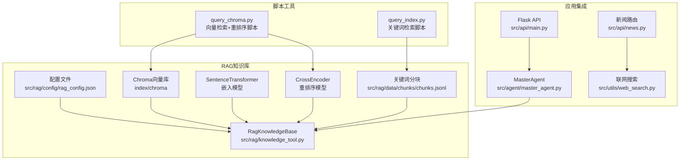
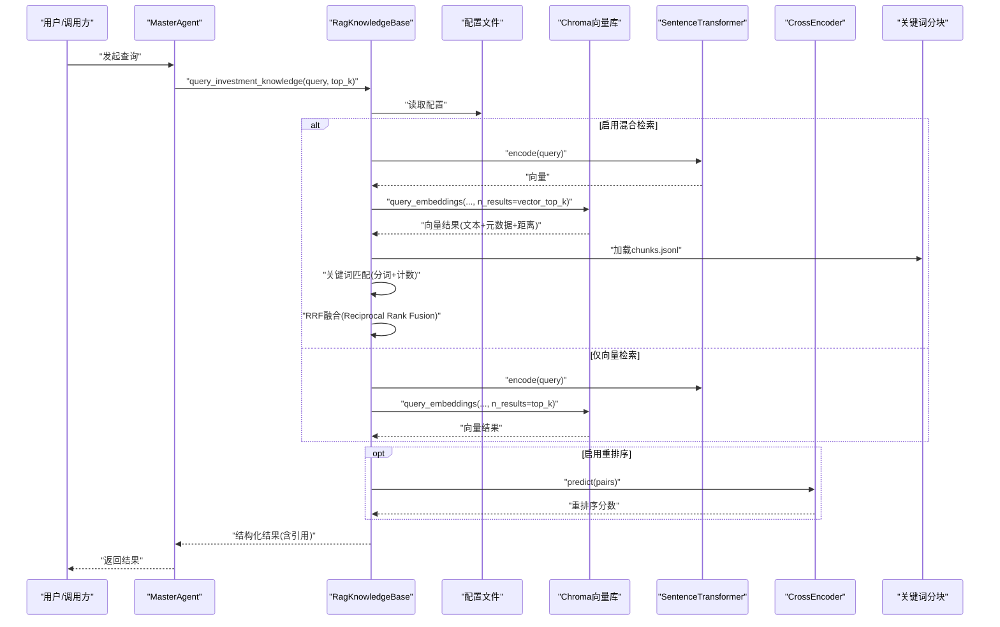
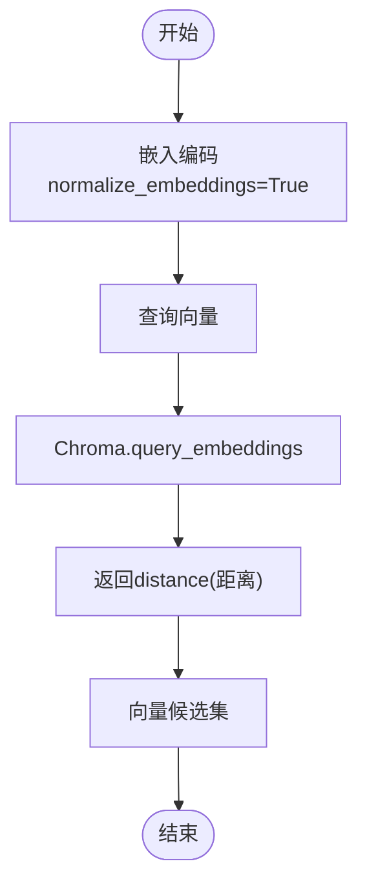
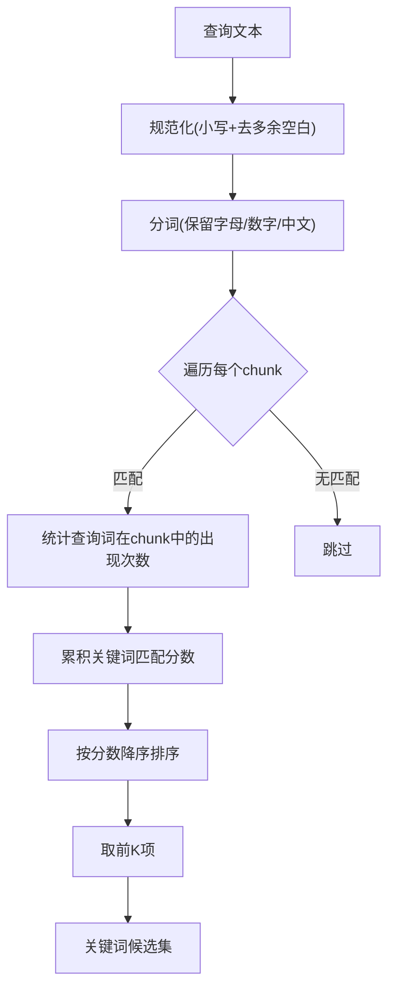
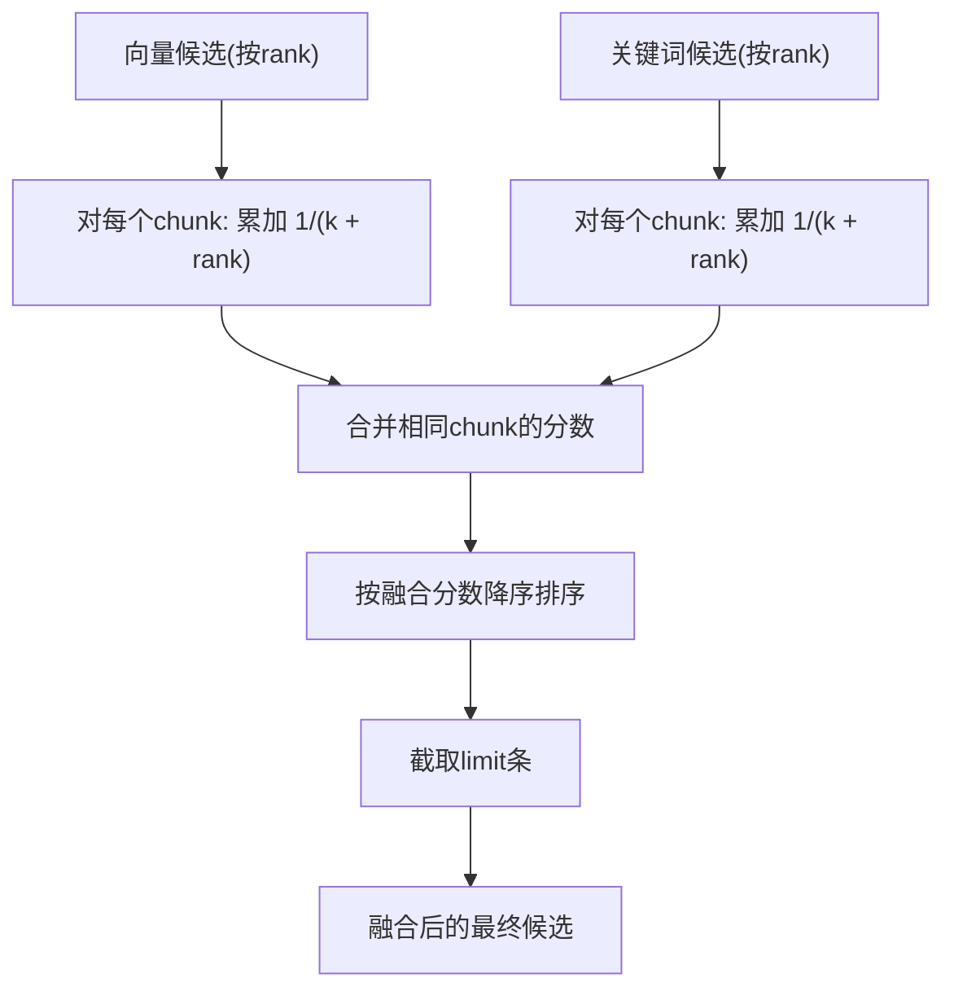
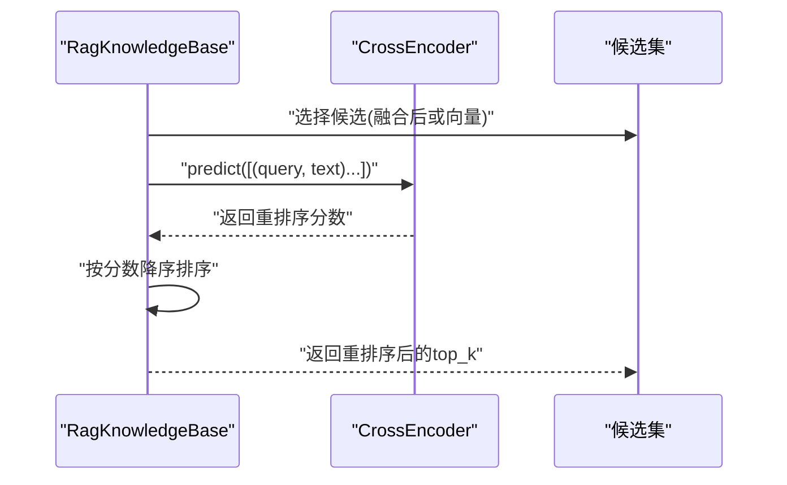
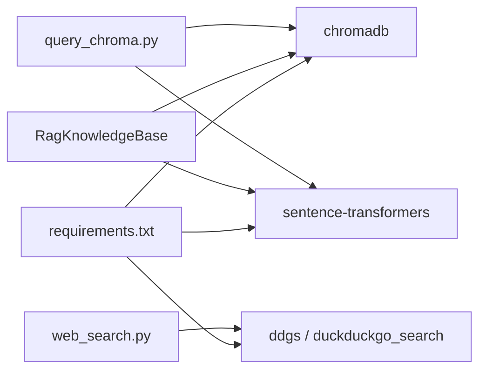

# 混合检索策略

<cite>
**本文引用的文件**   
- [src/rag/knowledge_tool.py](file://src/rag/knowledge_tool.py)
- [src/rag/config/rag_config.json](file://src/rag/config/rag_config.json)
- [src/rag/scripts/query_index.py](file://src/rag/scripts/query_index.py)
- [src/rag/scripts/query_chroma.py](file://src/rag/scripts/query_chroma.py)
- [src/rag/data/chunks/chunks.jsonl](file://src/rag/data/chunks/chunks.jsonl)
- [src/agent/master_agent.py](file://src/agent/master_agent.py)
- [src/utils/web_search.py](file://src/utils/web_search.py)
- [src/api/main.py](file://src/api/main.py)
- [src/api/news.py](file://src/api/news.py)
- [requirements.txt](file://requirements.txt)
</cite>

## 目录
1. [简介](#简介)
2. [项目结构](#项目结构)
3. [核心组件](#核心组件)
4. [架构总览](#架构总览)
5. [详细组件分析](#详细组件分析)
6. [依赖分析](#依赖分析)
7. [性能考量](#性能考量)
8. [故障排查指南](#故障排查指南)
9. [结论](#结论)
10. [附录](#附录)

## 简介
本文件系统化阐述本项目的混合检索策略，涵盖向量检索、关键词检索与重排序的融合机制。重点包括：
- 向量相似度计算与距离度量方法
- 关键词匹配算法（分词、匹配分数计算）
- RRF（Reciprocal Rank Fusion）融合算法的实现与参数调优
- 重排序模型的使用时机与效果评估
- 混合检索的性能对比与效果分析

## 项目结构
混合检索策略主要集中在 RAG 知识库模块，配合配置文件、脚本工具与前端/后端集成入口。

**图表来源**
- [src/rag/knowledge_tool.py](file://src/rag/knowledge_tool.py#L22-L248)
- [src/rag/config/rag_config.json](file://src/rag/config/rag_config.json#L1-L58)
- [src/rag/scripts/query_index.py](file://src/rag/scripts/query_index.py#L1-L98)
- [src/rag/scripts/query_chroma.py](file://src/rag/scripts/query_chroma.py#L1-L90)
- [src/rag/data/chunks/chunks.jsonl](file://src/rag/data/chunks/chunks.jsonl#L1-L101)
- [src/agent/master_agent.py](file://src/agent/master_agent.py#L155-L318)
- [src/api/main.py](file://src/api/main.py#L40-L235)
- [src/api/news.py](file://src/api/news.py#L1-L75)
- [src/utils/web_search.py](file://src/utils/web_search.py#L1-L80)

**章节来源**
- [src/rag/knowledge_tool.py](file://src/rag/knowledge_tool.py#L22-L248)
- [src/rag/config/rag_config.json](file://src/rag/config/rag_config.json#L1-L58)
- [src/rag/scripts/query_index.py](file://src/rag/scripts/query_index.py#L1-L98)
- [src/rag/scripts/query_chroma.py](file://src/rag/scripts/query_chroma.py#L1-L90)
- [src/rag/data/chunks/chunks.jsonl](file://src/rag/data/chunks/chunks.jsonl#L1-L101)
- [src/agent/master_agent.py](file://src/agent/master_agent.py#L155-L318)
- [src/api/main.py](file://src/api/main.py#L40-L235)
- [src/api/news.py](file://src/api/news.py#L1-L75)
- [src/utils/web_search.py](file://src/utils/web_search.py#L1-L80)

## 核心组件
- 混合检索核心类：RagKnowledgeBase（向量检索、关键词检索、RRF融合、重排序、缓存）
- 配置中心：rag_config.json（启用开关、模型与参数、混合检索参数、重排序参数、缓存参数）
- 轻量关键词检索脚本：query_index.py（纯关键词匹配，便于对比）
- 向量检索+重排序脚本：query_chroma.py（向量检索与重排序的演示）
- 关键词分块数据：chunks.jsonl（用于关键词检索的候选集）
- 应用集成：MasterAgent 通过 query_investment_knowledge 调用混合检索
- 外部搜索：web_search.py（联网搜索工具，作为补充）

**章节来源**
- [src/rag/knowledge_tool.py](file://src/rag/knowledge_tool.py#L22-L248)
- [src/rag/config/rag_config.json](file://src/rag/config/rag_config.json#L1-L58)
- [src/rag/scripts/query_index.py](file://src/rag/scripts/query_index.py#L1-L98)
- [src/rag/scripts/query_chroma.py](file://src/rag/scripts/query_chroma.py#L1-L90)
- [src/rag/data/chunks/chunks.jsonl](file://src/rag/data/chunks/chunks.jsonl#L1-L101)
- [src/agent/master_agent.py](file://src/agent/master_agent.py#L155-L318)
- [src/utils/web_search.py](file://src/utils/web_search.py#L1-L80)

## 架构总览
混合检索的整体流程如下：
- 输入查询 → 加载配置 → 向量检索（Chroma + 嵌入模型）→ 关键词检索（分词+匹配）→ RRF 融合 → 重排序（可选）→ 缓存 → 返回结果

**图表来源**
- [src/rag/knowledge_tool.py](file://src/rag/knowledge_tool.py#L177-L248)
- [src/rag/config/rag_config.json](file://src/rag/config/rag_config.json#L1-L58)
- [src/rag/data/chunks/chunks.jsonl](file://src/rag/data/chunks/chunks.jsonl#L1-L101)
- [src/rag/scripts/query_chroma.py](file://src/rag/scripts/query_chroma.py#L45-L85)
- [src/agent/master_agent.py](file://src/agent/master_agent.py#L254-L272)

## 详细组件分析

### 向量检索与相似度计算
- 嵌入模型：BAAI/bge-small-zh-v1.5（本地加载）
- 向量归一化：查询向量经 normalize_embeddings=True 归一化
- 向量库：ChromaDB（持久化目录与集合名在配置中指定）
- 相似度与距离：
  - Chroma 查询返回 distance 字段，用于记录向量距离
  - 本实现以 distance 作为向量相似度的参考（越小越相似）
  - 若需余弦相似度，可在应用层将向量归一化后使用点积

**图表来源**
- [src/rag/knowledge_tool.py](file://src/rag/knowledge_tool.py#L197-L209)
- [src/rag/config/rag_config.json](file://src/rag/config/rag_config.json#L11-L16)
- [src/rag/config/rag_config.json](file://src/rag/config/rag_config.json#L17-L19)

**章节来源**
- [src/rag/knowledge_tool.py](file://src/rag/knowledge_tool.py#L197-L209)
- [src/rag/config/rag_config.json](file://src/rag/config/rag_config.json#L11-L19)

### 关键词检索与匹配算法
- 分词策略：保留字母、数字与中文字符，其余替换为空格，随后按空白分词；若无分词结果，则按字符粒度切分
- 匹配分数：对查询词在文本中的出现次数求和，作为关键词匹配分数
- 候选集：来源于 chunks.jsonl，包含 chunk_id、doc_id、title、text、source_path 等

**图表来源**
- [src/rag/knowledge_tool.py](file://src/rag/knowledge_tool.py#L74-L112)
- [src/rag/data/chunks/chunks.jsonl](file://src/rag/data/chunks/chunks.jsonl#L1-L101)

**章节来源**
- [src/rag/knowledge_tool.py](file://src/rag/knowledge_tool.py#L74-L112)
- [src/rag/data/chunks/chunks.jsonl](file://src/rag/data/chunks/chunks.jsonl#L1-L101)

### RRF（Reciprocal Rank Fusion）融合算法
- 融合思想：对同一 chunk 在向量与关键词两条排序链上的相对位置进行融合
- 公式：对每个 chunk，累加 1/(k + rank)，k 为融合参数，rank 为在各自排序中的名次
- 参数 k：在配置中通过 hybrid.rrf_k 控制（默认60）
- 融合步骤：
  1) 遍历向量候选，按 rank 累加 1/(k + rank)
  2) 遍历关键词候选，按 rank 累加 1/(k + rank)
  3) 按融合分数降序排序，截取 limit

**图表来源**
- [src/rag/knowledge_tool.py](file://src/rag/knowledge_tool.py#L115-L138)
- [src/rag/config/rag_config.json](file://src/rag/config/rag_config.json#L43-L48)

**章节来源**
- [src/rag/knowledge_tool.py](file://src/rag/knowledge_tool.py#L115-L138)
- [src/rag/config/rag_config.json](file://src/rag/config/rag_config.json#L43-L48)

### 重排序（Rerank）模型
- 模型：BAAI/bge-reranker-base（本地加载）
- 触发条件：当配置 rerank.enabled=true 且候选数≥min_candidates、查询长度≥2 时启用
- 重排序过程：将 (query, text) 对打包喂给 CrossEncoder，得到重排序分数，按分数降序排序，取 top_k
- 重排序参数：rerank.top_k、rerank.min_candidates

**图表来源**
- [src/rag/knowledge_tool.py](file://src/rag/knowledge_tool.py#L140-L151)
- [src/rag/config/rag_config.json](file://src/rag/config/rag_config.json#L20-L25)

**章节来源**
- [src/rag/knowledge_tool.py](file://src/rag/knowledge_tool.py#L140-L151)
- [src/rag/config/rag_config.json](file://src/rag/config/rag_config.json#L20-L25)

### 缓存与回退策略
- 缓存：内存字典缓存，支持 TTL 与最大容量，命中直接返回
- 回退：当最终结果数量不足或最高分低于阈值时，标记 fallback 并附加提示信息

**章节来源**
- [src/rag/knowledge_tool.py](file://src/rag/knowledge_tool.py#L153-L176)
- [src/rag/knowledge_tool.py](file://src/rag/knowledge_tool.py#L225-L247)
- [src/rag/config/rag_config.json](file://src/rag/config/rag_config.json#L26-L30)
- [src/rag/config/rag_config.json](file://src/rag/config/rag_config.json#L49-L52)

### 与应用集成
- MasterAgent 在执行 Phase 2 时，调用 query_investment_knowledge 获取知识库检索结果
- API 层提供健康检查与蓝图注册，前端通过聊天/新闻等路由间接触发检索

**章节来源**
- [src/agent/master_agent.py](file://src/agent/master_agent.py#L155-L318)
- [src/rag/knowledge_tool.py](file://src/rag/knowledge_tool.py#L254-L272)
- [src/api/main.py](file://src/api/main.py#L40-L235)

## 依赖分析
- 向量检索依赖：chromadb、sentence-transformers
- 重排序依赖：sentence-transformers（CrossEncoder）
- 关键词检索依赖：本地分词与计数逻辑
- 外部搜索：ddgs 或 duckduckgo_search（可选）

**图表来源**
- [requirements.txt](file://requirements.txt#L30-L41)
- [src/rag/knowledge_tool.py](file://src/rag/knowledge_tool.py#L14-L53)
- [src/rag/scripts/query_chroma.py](file://src/rag/scripts/query_chroma.py#L14-L15)
- [src/utils/web_search.py](file://src/utils/web_search.py#L53-L60)

**章节来源**
- [requirements.txt](file://requirements.txt#L30-L41)
- [src/rag/knowledge_tool.py](file://src/rag/knowledge_tool.py#L14-L53)
- [src/rag/scripts/query_chroma.py](file://src/rag/scripts/query_chroma.py#L14-L15)
- [src/utils/web_search.py](file://src/utils/web_search.py#L53-L60)

## 性能考量
- 向量检索
  - 向量归一化可提升相似度稳定性
  - 合理设置 vector_top_k，避免过多候选导致重排序开销增大
- 关键词检索
  - 分词与匹配为 O(N_chunks × N_query_tokens)，建议控制查询词数量与分块大小
- RRF 融合
  - k 值越大，向量与关键词贡献越均衡；k 过小会偏向排名靠前的来源
- 重排序
  - 启用条件与 top_k 控制计算量；仅在候选足够时启用可避免无效重排
- 缓存
  - 启用缓存可显著降低重复查询延迟；合理设置 TTL 与容量

[本节为通用性能指导，无需特定文件引用]

## 故障排查指南
- 模块导入错误：确认在项目根目录运行，Python 路径包含项目根
- 向量检索失败：检查 Chroma 持久化目录与集合是否存在，模型是否可本地加载
- 重排序不可用：确认 CrossEncoder 模型可用，或关闭 rerank.enabled
- 关键词检索为空：检查 chunks.jsonl 是否存在且可读
- API 500：查看后端日志，定位异常栈；确认数据库初始化与蓝图注册
- 联网搜索失败：检查代理设置与网络，确认 DDGS 可用

**章节来源**
- [src/api/main.py](file://src/api/main.py#L222-L234)
- [src/rag/knowledge_tool.py](file://src/rag/knowledge_tool.py#L268-L272)
- [src/utils/web_search.py](file://src/utils/web_search.py#L53-L78)
- [README.md](file://README.md#L205-L215)

## 结论
本混合检索策略通过向量检索与关键词检索互补，采用 RRF 融合实现统一排序，并在满足条件时引入重排序模型提升相关性。配置化参数（向量/关键词 top_k、rrf_k、重排序参数、缓存参数）为不同场景提供了灵活调优空间。结合缓存与回退策略，系统在准确性与性能之间取得平衡。

[本节为总结性内容，无需特定文件引用]

## 附录

### 参数调优建议
- rrf_k
  - 增大：更均衡融合，适合向量与关键词质量相当
  - 减小：向量权重更大，适合向量质量较高场景
- vector_top_k / keyword_top_k
  - 建议略大于最终 top_k，为 RRF 与重排序预留候选
- rerank.min_candidates / rerank.top_k
  - 建议 ≥2，避免小样本噪声；top_k 控制重排序候选规模
- 缓存 TTL 与容量
  - 根据热点查询频率与内存限制调整

**章节来源**
- [src/rag/config/rag_config.json](file://src/rag/config/rag_config.json#L43-L52)
- [src/rag/knowledge_tool.py](file://src/rag/knowledge_tool.py#L193-L196)
- [src/rag/knowledge_tool.py](file://src/rag/knowledge_tool.py#L219-L223)
- [src/rag/config/rag_config.json](file://src/rag/config/rag_config.json#L26-L30)

### 对比脚本使用
- query_index.py：执行关键词检索，便于与向量/混合检索对比
- query_chroma.py：执行向量检索并可选重排序，便于理解单模块效果

**章节来源**
- [src/rag/scripts/query_index.py](file://src/rag/scripts/query_index.py#L72-L97)
- [src/rag/scripts/query_chroma.py](file://src/rag/scripts/query_chroma.py#L45-L89)