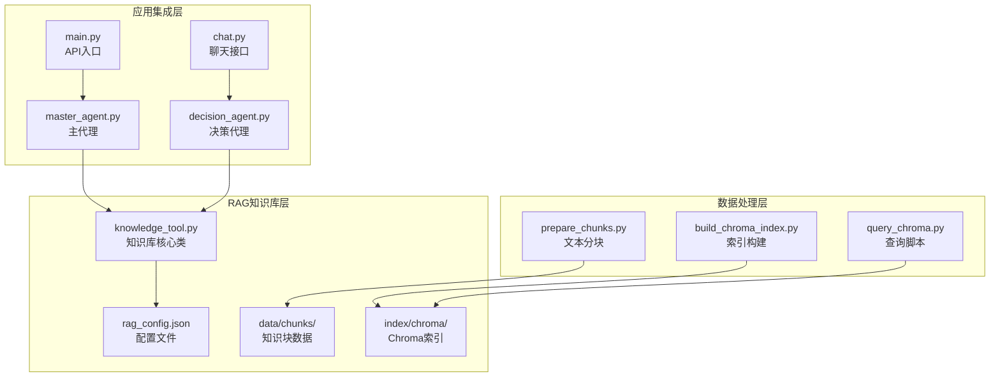
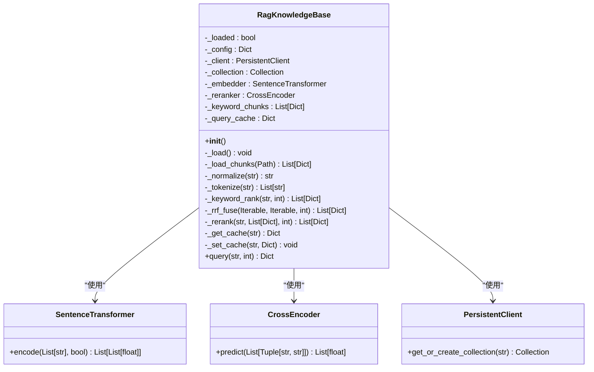
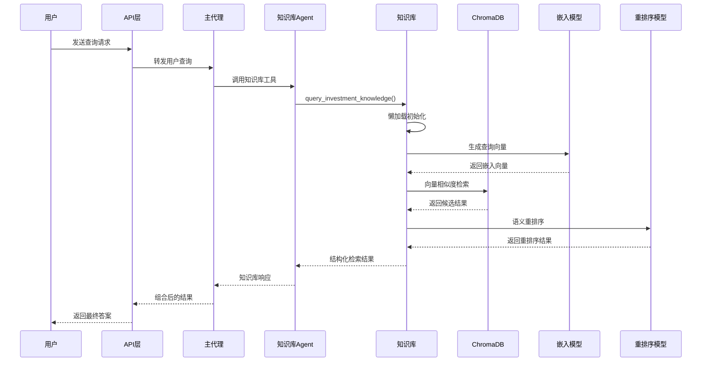
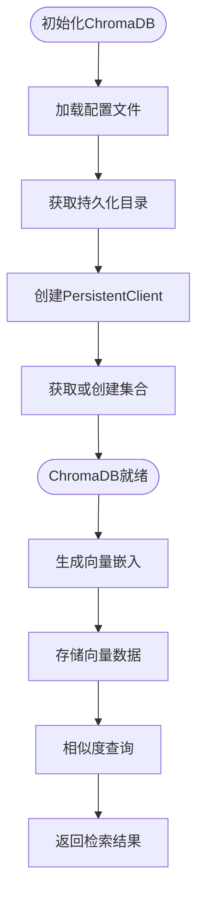
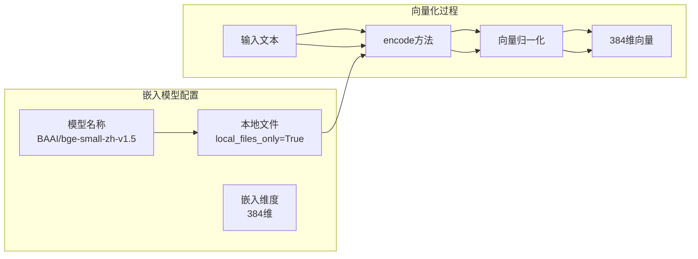
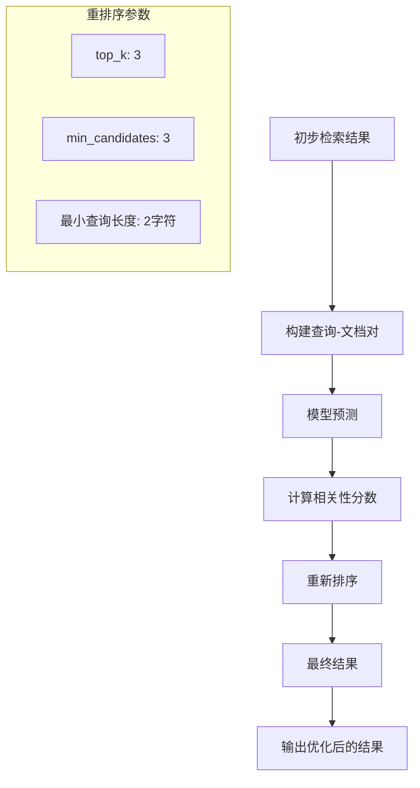
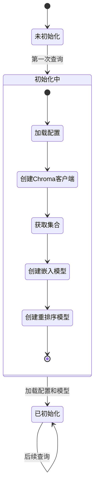
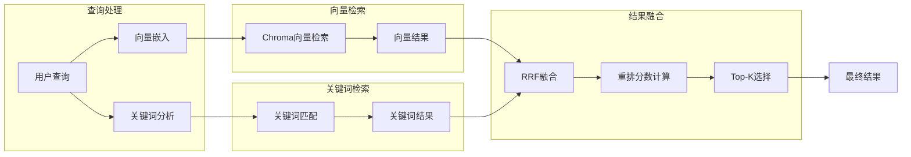
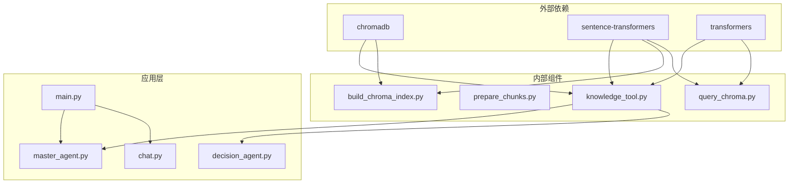
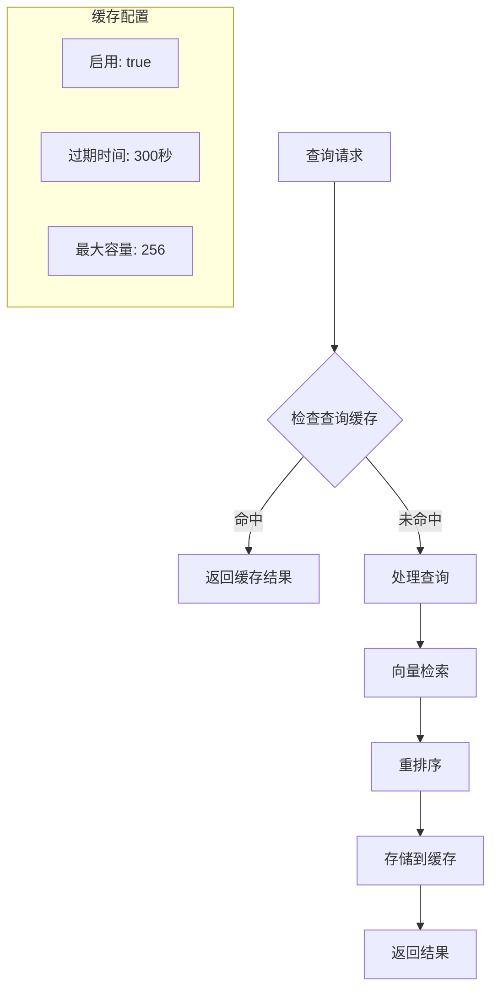

# 知识库架构设计

<cite>
**本文档引用的文件**
- [knowledge_tool.py](file://src/rag/knowledge_tool.py)
- [rag_config.json](file://src/rag/config/rag_config.json)
- [build_chroma_index.py](file://src/rag/scripts/build_chroma_index.py)
- [query_chroma.py](file://src/rag/scripts/query_chroma.py)
- [prepare_chunks.py](file://src/rag/scripts/prepare_chunks.py)
- [chunks.jsonl](file://src/rag/data/chunks/chunks.jsonl)
- [chroma.sqlite3](file://src/rag/index/chroma/chroma.sqlite3)
- [master_agent.py](file://src/agent/master_agent.py)
- [decision_agent.py](file://src/agent/decision_agent.py)
- [main.py](file://src/api/main.py)
- [chat.py](file://src/api/chat.py)
</cite>

## 目录
1. [简介](#简介)
2. [项目结构](#项目结构)
3. [核心组件](#核心组件)
4. [架构概览](#架构概览)
5. [详细组件分析](#详细组件分析)
6. [依赖关系分析](#依赖关系分析)
7. [性能考虑](#性能考虑)
8. [故障排除指南](#故障排除指南)
9. [结论](#结论)

## 简介

本项目是一个基于RAG（检索增强生成）的知识库系统，专注于投资领域的知识管理与检索。系统采用ChromaDB作为向量数据库，结合SentenceTransformer嵌入模型和CrossEncoder重排序模型，实现了高效的语义检索功能。

该知识库架构设计的核心特点包括：
- **模块化设计**：清晰的分层架构，便于维护和扩展
- **高性能检索**：基于向量相似度的快速检索机制
- **智能重排序**：多模型融合的检索结果优化
- **懒加载机制**：按需初始化资源，提高系统启动效率
- **单例模式**：确保知识库实例的唯一性和资源共享

## 项目结构

项目采用分层架构设计，RAG相关组件主要位于`src/rag/`目录下：

**图表来源**
- [knowledge_tool.py](file://src/rag/knowledge_tool.py#L1-L273)
- [rag_config.json](file://src/rag/config/rag_config.json#L1-L58)

**章节来源**
- [knowledge_tool.py](file://src/rag/knowledge_tool.py#L1-L273)
- [rag_config.json](file://src/rag/config/rag_config.json#L1-L58)

## 核心组件

### RagKnowledgeBase类

RagKnowledgeBase是知识库的核心类，实现了完整的RAG检索功能：

**图表来源**
- [knowledge_tool.py](file://src/rag/knowledge_tool.py#L22-L248)

### 配置管理系统

系统采用JSON配置文件管理所有参数，包括：

- **数据配置**：原始数据、清洗数据、知识块目录结构
- **索引配置**：Chroma数据库路径、集合名称、批量大小
- **嵌入配置**：模型名称、本地文件设置
- **重排序配置**：启用状态、模型名称、top_k数量
- **缓存配置**：启用状态、TTL时间、最大缓存大小
- **查询配置**：默认返回数量、混合检索参数

**章节来源**
- [knowledge_tool.py](file://src/rag/knowledge_tool.py#L22-L60)
- [rag_config.json](file://src/rag/config/rag_config.json#L1-L58)

## 架构概览

系统采用分层架构设计，实现了从数据预处理到最终检索的完整流程：

**图表来源**
- [master_agent.py](file://src/agent/master_agent.py#L258-L278)
- [knowledge_tool.py](file://src/rag/knowledge_tool.py#L177-L248)

## 详细组件分析

### ChromaDB向量数据库集成

#### 持久化客户端配置

ChromaDB采用持久化存储方式，确保数据的长期保存：

**图表来源**
- [knowledge_tool.py](file://src/rag/knowledge_tool.py#L42-L59)
- [build_chroma_index.py](file://src/rag/scripts/build_chroma_index.py#L50-L59)

#### 集合管理

系统使用单个集合存储所有知识块，集合名称在配置文件中定义：

- **集合名称**：`rag_knowledge`
- **持久化路径**：`index/chroma/`
- **索引文件**：`chroma.sqlite3`

#### 索引结构

ChromaDB内部使用SQLite作为存储引擎，包含以下关键表结构：

- **collections**：存储集合元数据
- **embeddings**：存储向量嵌入数据
- **embedding_metadata**：存储向量元数据
- **segments**：存储分段信息

**章节来源**
- [knowledge_tool.py](file://src/rag/knowledge_tool.py#L42-L59)
- [chroma.sqlite3](file://src/rag/index/chroma/chroma.sqlite3#L1-L200)

### SentenceTransformer嵌入模型

#### 模型加载

系统使用BAAI/bge-small-zh-v1.5模型进行中文文本向量化：

**图表来源**
- [knowledge_tool.py](file://src/rag/knowledge_tool.py#L47-L49)
- [build_chroma_index.py](file://src/rag/scripts/build_chroma_index.py#L61-L63)

#### 向量化处理

嵌入模型提供以下核心功能：

- **批量向量化**：支持批量文本处理，提高效率
- **向量归一化**：使用L2范数归一化，确保余弦相似度计算
- **中文优化**：针对中文文本进行专门优化

**章节来源**
- [knowledge_tool.py](file://src/rag/knowledge_tool.py#L197-L198)
- [build_chroma_index.py](file://src/rag/scripts/build_chroma_index.py#L79-L80)

### CrossEncoder重排序模型

#### 作用机制

CrossEncoder模型用于对初步检索结果进行语义层面的精细重排序：

**图表来源**
- [knowledge_tool.py](file://src/rag/knowledge_tool.py#L140-L151)

#### 实现细节

- **模型名称**：BAAI/bge-reranker-base
- **启用条件**：候选数量≥3且查询长度≥2字符
- **重排序数量**：取前3个结果
- **最小候选数**：至少3个候选才进行重排序

**章节来源**
- [knowledge_tool.py](file://src/rag/knowledge_tool.py#L219-L223)
- [rag_config.json](file://src/rag/config/rag_config.json#L20-L25)

### 单例模式设计

系统采用单例模式确保知识库实例的唯一性：

**图表来源**
- [knowledge_tool.py](file://src/rag/knowledge_tool.py#L251-L272)

#### 懒加载机制

- **按需初始化**：只有在首次查询时才加载模型和数据库连接
- **资源管理**：避免不必要的内存占用
- **延迟加载**：提高系统启动速度

**章节来源**
- [knowledge_tool.py](file://src/rag/knowledge_tool.py#L25-L60)
- [knowledge_tool.py](file://src/rag/knowledge_tool.py#L251-L272)

### 混合检索策略

系统实现了向量检索与关键词检索的融合：

**图表来源**
- [knowledge_tool.py](file://src/rag/knowledge_tool.py#L84-L138)
- [knowledge_tool.py](file://src/rag/knowledge_tool.py#L213-L217)

#### RRF融合算法

- **重排分数**：`1/(k+rank)`，其中k=60
- **融合策略**：向量结果和关键词结果的加权融合
- **最终排序**：按融合后的重排分数降序排列

**章节来源**
- [knowledge_tool.py](file://src/rag/knowledge_tool.py#L115-L138)
- [rag_config.json](file://src/rag/config/rag_config.json#L43-L48)

## 依赖关系分析

### 组件间依赖

**图表来源**
- [knowledge_tool.py](file://src/rag/knowledge_tool.py#L16-L17)
- [build_chroma_index.py](file://src/rag/scripts/build_chroma_index.py#L14-L15)
- [query_chroma.py](file://src/rag/scripts/query_chroma.py#L14-L15)

### 数据流分析

系统中的数据流向如下：

1. **数据准备阶段**：原始文档 → 文本清洗 → 知识块生成 → JSONL文件
2. **索引构建阶段**：知识块 → 向量化 → ChromaDB存储
3. **查询处理阶段**：用户查询 → 向量检索 → 重排序 → 结果返回

**章节来源**
- [prepare_chunks.py](file://src/rag/scripts/prepare_chunks.py#L141-L160)
- [build_chroma_index.py](file://src/rag/scripts/build_chroma_index.py#L68-L80)

## 性能考虑

### 缓存机制

系统实现了多层次的缓存策略：

**图表来源**
- [knowledge_tool.py](file://src/rag/knowledge_tool.py#L153-L175)

### 性能优化策略

1. **懒加载优化**：按需加载模型和数据库连接
2. **批量处理**：索引构建时使用批量插入提高效率
3. **缓存机制**：减少重复查询的计算开销
4. **向量归一化**：使用余弦相似度提高检索精度

### 内存管理

- **模型加载**：仅在首次查询时加载嵌入模型和重排序模型
- **数据库连接**：复用ChromaDB客户端连接
- **缓存控制**：限制最大缓存条目数量，避免内存溢出

**章节来源**
- [knowledge_tool.py](file://src/rag/knowledge_tool.py#L153-L175)
- [build_chroma_index.py](file://src/rag/scripts/build_chroma_index.py#L68-L80)

## 故障排除指南

### 常见问题及解决方案

#### ChromaDB连接问题

**症状**：无法连接到ChromaDB数据库
**原因**：
- 数据库文件损坏
- 权限不足
- 路径配置错误

**解决方案**：
1. 检查`chroma.sqlite3`文件是否存在
2. 验证数据库文件权限
3. 确认配置文件中的路径设置

#### 模型加载失败

**症状**：嵌入模型或重排序模型加载失败
**原因**：
- 网络连接问题
- 模型文件下载失败
- 磁盘空间不足

**解决方案**：
1. 检查网络连接状态
2. 验证模型文件下载路径
3. 确认磁盘空间充足

#### 查询结果为空

**症状**：查询返回空结果
**原因**：
- 知识库未正确构建
- 查询向量生成失败
- 检索阈值设置过高

**解决方案**：
1. 重新构建知识库索引
2. 检查查询文本预处理
3. 调整检索参数配置

**章节来源**
- [knowledge_tool.py](file://src/rag/knowledge_tool.py#L265-L272)

### 调试技巧

1. **启用详细日志**：查看详细的错误信息和调试输出
2. **检查配置文件**：验证所有配置参数的正确性
3. **单元测试**：编写测试用例验证各个组件的功能
4. **性能监控**：监控内存使用和查询响应时间

## 结论

本知识库架构设计实现了高效、可扩展的RAG检索系统。通过ChromaDB的向量检索、SentenceTransformer的语义理解能力和CrossEncoder的精细重排序，系统能够提供准确的检索结果。

系统的主要优势包括：

1. **模块化设计**：清晰的组件分离便于维护和扩展
2. **高性能实现**：懒加载和缓存机制确保系统响应速度
3. **智能化处理**：多模型融合提供更好的检索质量
4. **易于集成**：与现有应用架构无缝对接

未来可以考虑的改进方向：
- 支持更多的嵌入模型
- 实现增量索引更新
- 添加更多类型的重排序模型
- 优化大规模数据的处理能力