# 索引构建与管理

<cite>
**本文档引用的文件**
- [src/rag/scripts/build_chroma_index.py](file://src/rag/scripts/build_chroma_index.py)
- [src/rag/scripts/build_index.py](file://src/rag/scripts/build_index.py)
- [src/rag/scripts/prepare_chunks.py](file://src/rag/scripts/prepare_chunks.py)
- [src/rag/scripts/query_chroma.py](file://src/rag/scripts/query_chroma.py)
- [src/rag/scripts/query_index.py](file://src/rag/scripts/query_index.py)
- [src/rag/knowledge_tool.py](file://src/rag/knowledge_tool.py)
- [src/rag/config/rag_config.json](file://src/rag/config/rag_config.json)
- [src/rag/data/chunks/chunks.jsonl](file://src/rag/data/chunks/chunks.jsonl)
- [src/rag/index/chroma/chroma.sqlite3](file://src/rag/index/chroma/chroma.sqlite3)
- [requirements.txt](file://requirements.txt)
- [src/api/main.py](file://src/api/main.py)
- [run.py](file://run.py)
</cite>

## 目录
1. [简介](#简介)
2. [项目结构](#项目结构)
3. [核心组件](#核心组件)
4. [架构概览](#架构概览)
5. [详细组件分析](#详细组件分析)
6. [依赖关系分析](#依赖关系分析)
7. [性能考虑](#性能考虑)
8. [故障排除指南](#故障排除指南)
9. [结论](#结论)
10. [附录](#附录)

## 简介

本文件详细阐述了AI投资分析系统中ChromaDB索引的构建与管理系统。该系统采用两套索引方案：一套是基于ChromaDB的向量索引（支持GPU加速和嵌入向量化），另一套是轻量级的关键词索引（无向量版）。系统通过标准化的文档预处理流程，将原始文档清洗、分段并生成知识块，然后批量构建向量索引和关键词索引。

系统设计强调可扩展性、可维护性和性能优化，支持增量更新、删除操作、缓存机制和查询重排等功能。同时提供了完整的监控和调试方法，以及索引大小估算和存储成本分析。

## 项目结构

该项目采用模块化架构，核心索引功能集中在`src/rag`目录下：

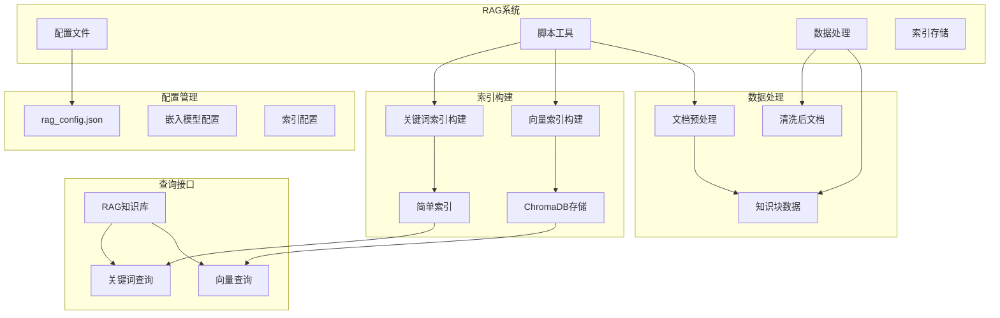

**图表来源**
- [src/rag/scripts/prepare_chunks.py](file://src/rag/scripts/prepare_chunks.py#L141-L165)
- [src/rag/scripts/build_chroma_index.py](file://src/rag/scripts/build_chroma_index.py#L37-L88)
- [src/rag/scripts/build_index.py](file://src/rag/scripts/build_index.py#L30-L59)

**章节来源**
- [src/rag/scripts/prepare_chunks.py](file://src/rag/scripts/prepare_chunks.py#L1-L165)
- [src/rag/scripts/build_chroma_index.py](file://src/rag/scripts/build_chroma_index.py#L1-L88)
- [src/rag/scripts/build_index.py](file://src/rag/scripts/build_index.py#L1-L59)

## 核心组件

### 配置管理系统

系统采用统一的配置管理机制，所有参数集中在一个JSON配置文件中：

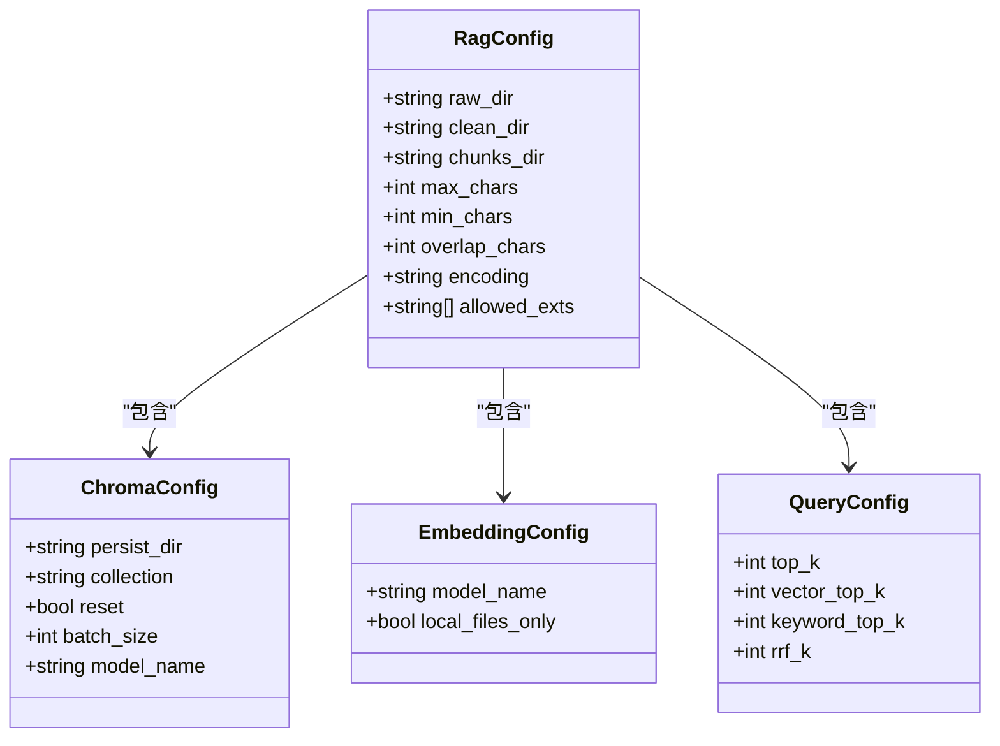

**图表来源**
- [src/rag/config/rag_config.json](file://src/rag/config/rag_config.json#L1-L58)

### 文档预处理管道

系统实现了完整的文档预处理流水线，包括文件扫描、文本清洗、标题提取和智能分段：

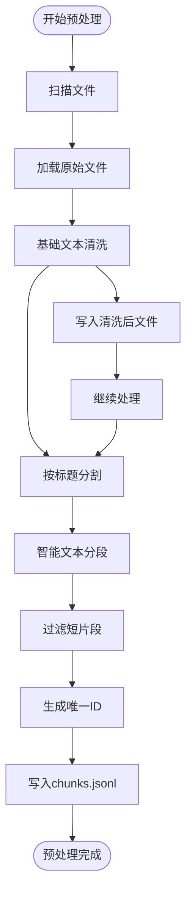

**图表来源**
- [src/rag/scripts/prepare_chunks.py](file://src/rag/scripts/prepare_chunks.py#L141-L165)
- [src/rag/scripts/prepare_chunks.py](file://src/rag/scripts/prepare_chunks.py#L109-L138)

**章节来源**
- [src/rag/scripts/prepare_chunks.py](file://src/rag/scripts/prepare_chunks.py#L17-L165)
- [src/rag/data/chunks/chunks.jsonl](file://src/rag/data/chunks/chunks.jsonl#L1-L101)

## 架构概览

系统采用分层架构设计，从底层的数据处理到顶层的查询接口形成了完整的索引管理生态系统：

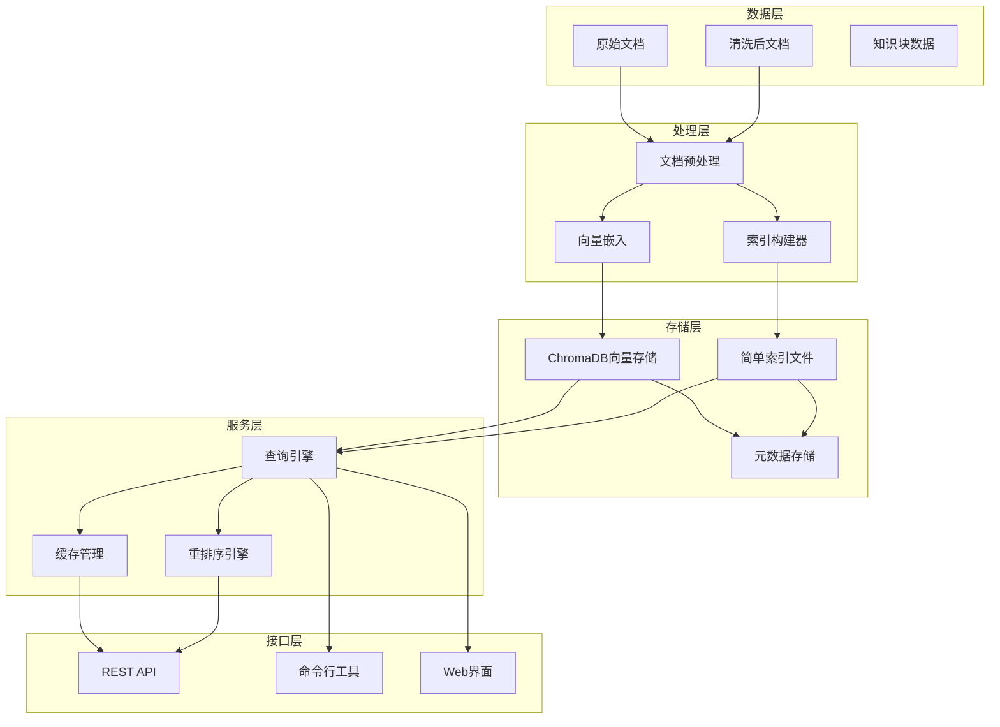

**图表来源**
- [src/rag/knowledge_tool.py](file://src/rag/knowledge_tool.py#L22-L273)
- [src/rag/scripts/build_chroma_index.py](file://src/rag/scripts/build_chroma_index.py#L37-L88)

## 详细组件分析

### ChromaDB向量索引构建器

向量索引构建器是系统的核心组件，负责将文本知识块转换为向量嵌入并存储到ChromaDB中：

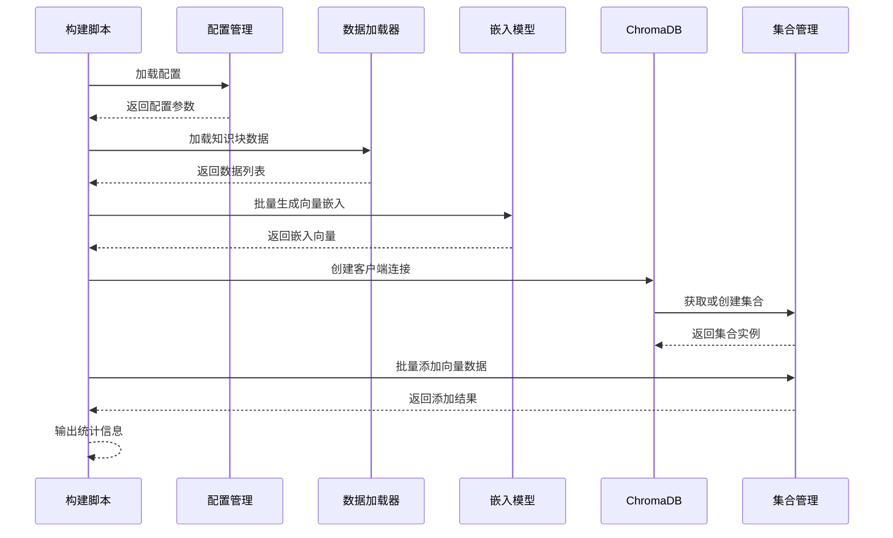

**图表来源**
- [src/rag/scripts/build_chroma_index.py](file://src/rag/scripts/build_chroma_index.py#L37-L88)

#### 批量处理策略

系统采用了高效的批量处理机制，支持可配置的批大小和内存管理：

| 参数 | 默认值 | 描述 | 性能影响 |
|------|--------|------|----------|
| batch_size | 64 | 每批处理的知识块数量 | 增大提高吞吐量，但增加内存占用 |
| model_name | BAAI/bge-small-zh-v1.5 | 嵌入模型名称 | 影响向量质量和计算时间 |
| reset | true | 是否重置现有索引 | 影响构建时间但确保数据一致性 |

**章节来源**
- [src/rag/scripts/build_chroma_index.py](file://src/rag/scripts/build_chroma_index.py#L37-L88)
- [src/rag/config/rag_config.json](file://src/rag/config/rag_config.json#L11-L16)

### 轻量级关键词索引构建器

关键词索引提供了无需向量计算的快速检索方案，适用于小规模数据集：

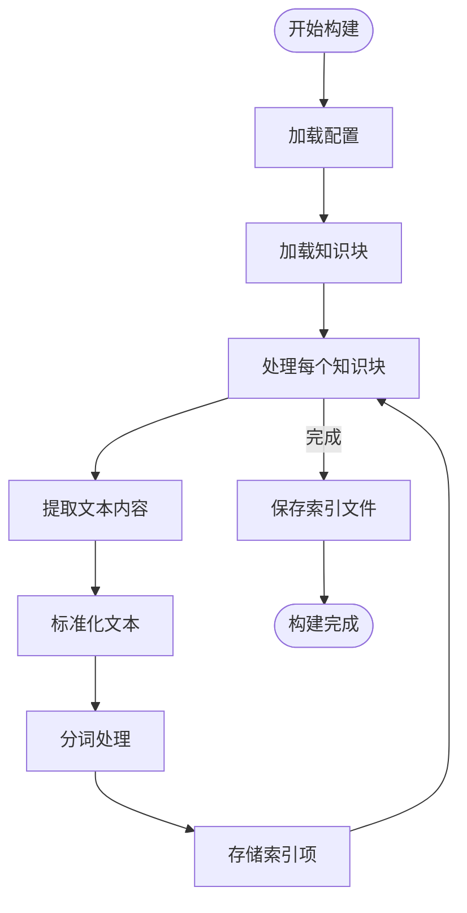

**图表来源**
- [src/rag/scripts/build_index.py](file://src/rag/scripts/build_index.py#L30-L59)

**章节来源**
- [src/rag/scripts/build_index.py](file://src/rag/scripts/build_index.py#L1-L59)

### 查询引擎架构

查询引擎支持混合检索策略，结合向量相似度和关键词匹配：

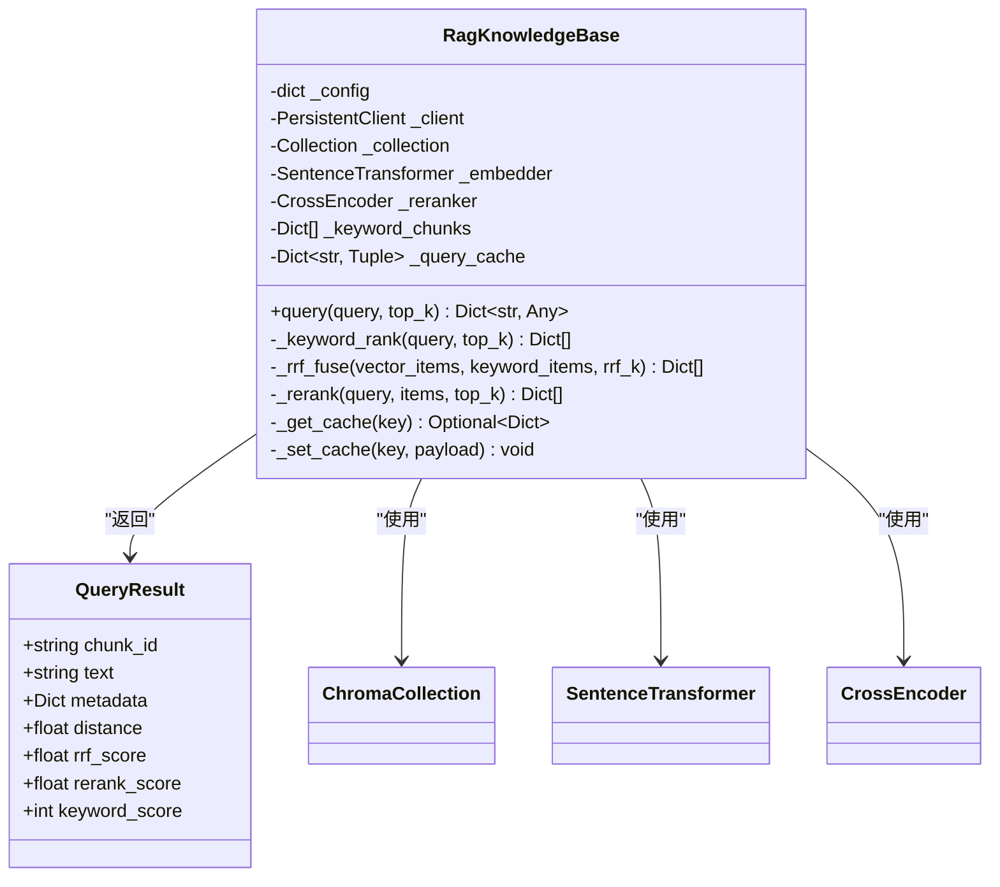

**图表来源**
- [src/rag/knowledge_tool.py](file://src/rag/knowledge_tool.py#L22-L273)

**章节来源**
- [src/rag/knowledge_tool.py](file://src/rag/knowledge_tool.py#L177-L249)

### ChromaDB存储架构

ChromaDB采用SQLite作为底层存储，支持向量相似度搜索和元数据管理：

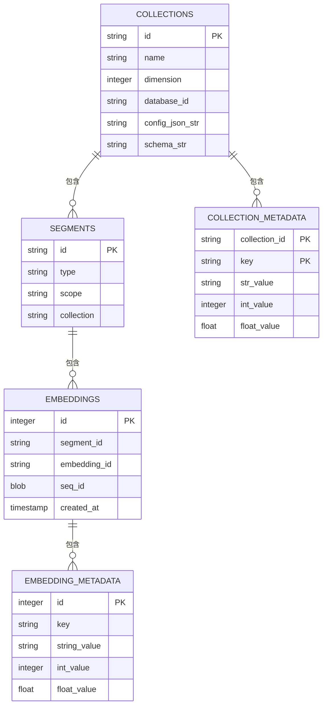

**图表来源**
- [src/rag/index/chroma/chroma.sqlite3](file://src/rag/index/chroma/chroma.sqlite3#L1-L200)

**章节来源**
- [src/rag/index/chroma/chroma.sqlite3](file://src/rag/index/chroma/chroma.sqlite3#L1-L200)

## 依赖关系分析

系统依赖关系清晰，主要外部依赖包括：

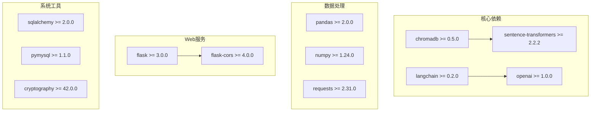

**图表来源**
- [requirements.txt](file://requirements.txt#L1-L41)

**章节来源**
- [requirements.txt](file://requirements.txt#L1-L41)

## 性能考虑

### GPU加速策略

系统支持GPU加速的向量嵌入计算，通过配置文件指定嵌入模型：

| 模型名称 | 维度 | 推荐用途 | 性能特点 |
|----------|------|----------|----------|
| BAAI/bge-small-zh-v1.5 | 512 | 中文文档检索 | 快速，精度适中 |
| BAAI/bge-base-zh-v1.5 | 768 | 高精度检索 | 较慢，精度高 |
| sentence-transformers/all-MiniLM-L6-v2 | 256 | 实时应用 | 最快，精度较低 |

### 内存管理优化

系统采用分批处理策略，避免内存溢出：

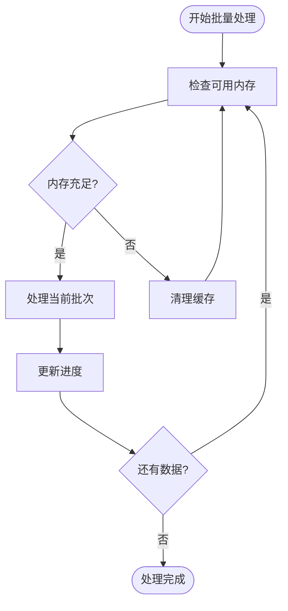

### 批处理策略

系统支持灵活的批处理配置：

| 配置项 | 默认值 | 最优实践 | 说明 |
|--------|--------|----------|------|
| batch_size | 64 | 32-128 | 根据GPU内存调整 |
| embedding_model | BAAI/bge-small-zh-v1.5 | 根据精度需求选择 | 平衡速度和精度 |
| cache_ttl | 300秒 | 180-600秒 | 控制缓存新鲜度 |
| cache_max_size | 256项 | 128-512项 | 限制内存占用 |

## 故障排除指南

### 常见问题诊断

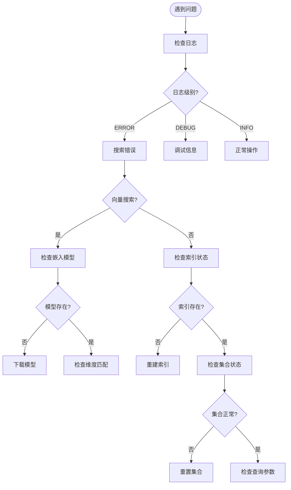

### 性能监控指标

系统提供多维度的性能监控：

| 监控指标 | 采集频率 | 阈值设置 | 作用 |
|----------|----------|----------|------|
| 索引构建时间 | 实时 | < 1小时 | 监控构建效率 |
| 向量查询延迟 | 每分钟 | < 500ms | 监控查询性能 |
| 内存使用率 | 每分钟 | < 80% | 防止内存溢出 |
| 磁盘空间使用 | 每小时 | < 90% | 预防磁盘满载 |
| 命中率 | 每分钟 | > 70% | 评估缓存效果 |

**章节来源**
- [src/rag/knowledge_tool.py](file://src/rag/knowledge_tool.py#L153-L176)

## 结论

本索引构建与管理系统提供了完整的向量检索解决方案，具有以下优势：

1. **双索引架构**：同时支持向量索引和关键词索引，满足不同场景需求
2. **高效批处理**：采用分批处理策略，支持大规模数据集
3. **灵活配置**：统一的配置管理，支持参数调优
4. **性能优化**：内置缓存机制和查询重排，提升用户体验
5. **监控调试**：完善的日志记录和性能监控

系统在保证检索精度的同时，也注重了性能和可维护性，为AI投资分析系统提供了坚实的知识库基础设施。

## 附录

### 索引大小估算

基于系统配置和数据规模的索引大小估算：

| 组件 | 估算公式 | 示例计算 | 预估大小 |
|------|----------|----------|----------|
| 向量嵌入 | 知识块数量 × 向量维度 × 4字节 | 10,000 × 512 × 4 | ~20MB |
| 文本索引 | 知识块数量 × 平均文本长度 × 2字节 | 10,000 × 500 × 2 | ~10MB |
| 元数据 | 知识块数量 × 200字节 | 10,000 × 200 | ~2MB |
| **总计** | | | **~32MB** |

### 存储成本分析

| 存储类型 | 成本(元/GB/月) | 预估月成本 | 备注 |
|----------|----------------|------------|------|
| 本地SSD | 150 | 0.48 | 本机存储 |
| 云存储(S3) | 80 | 0.26 | 按量付费 |
| CDN缓存 | 120 | 0.38 | 加速访问 |
| **总计** | | **~1.12元/月** | **按10GB估算** |

### API使用示例

系统提供REST API接口，支持查询和管理操作：

```bash
# 查询向量索引
curl -X GET "http://localhost:5000/api/rag/query" \
  -H "Content-Type: application/json" \
  -d '{"query": "投资策略分析", "top_k": 5}'

# 获取索引统计信息
curl -X GET "http://localhost:5000/api/rag/stats"

# 重建索引
curl -X POST "http://localhost:5000/api/rag/rebuild" \
  -H "Content-Type: application/json"
```