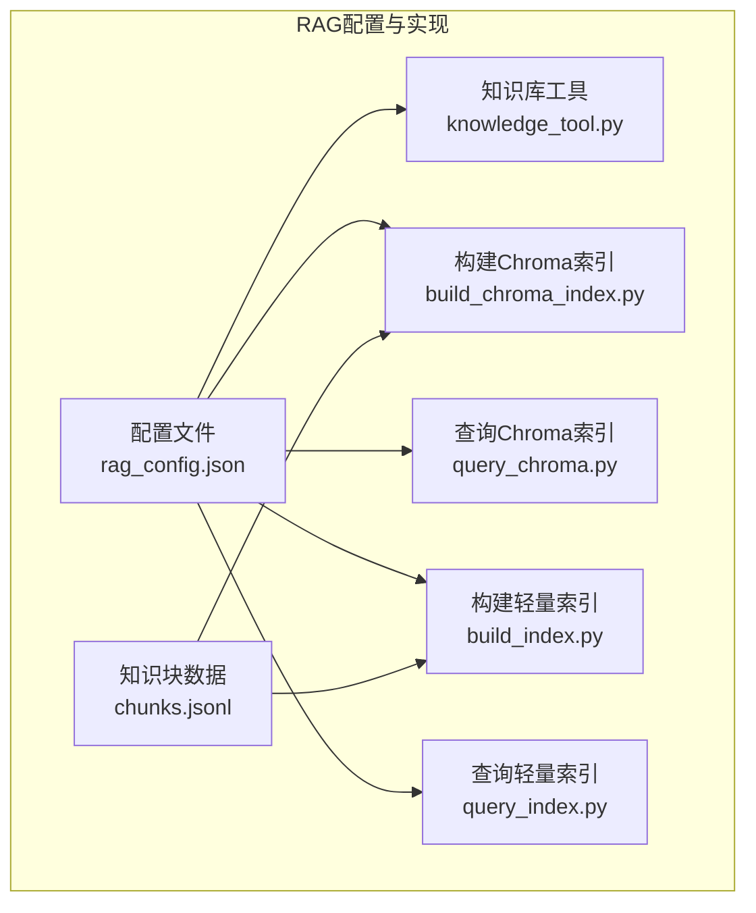
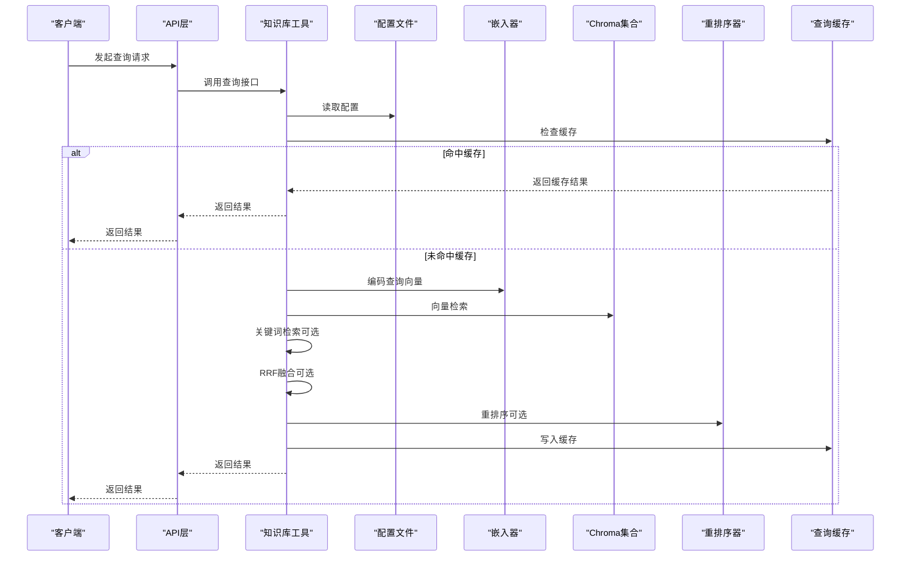
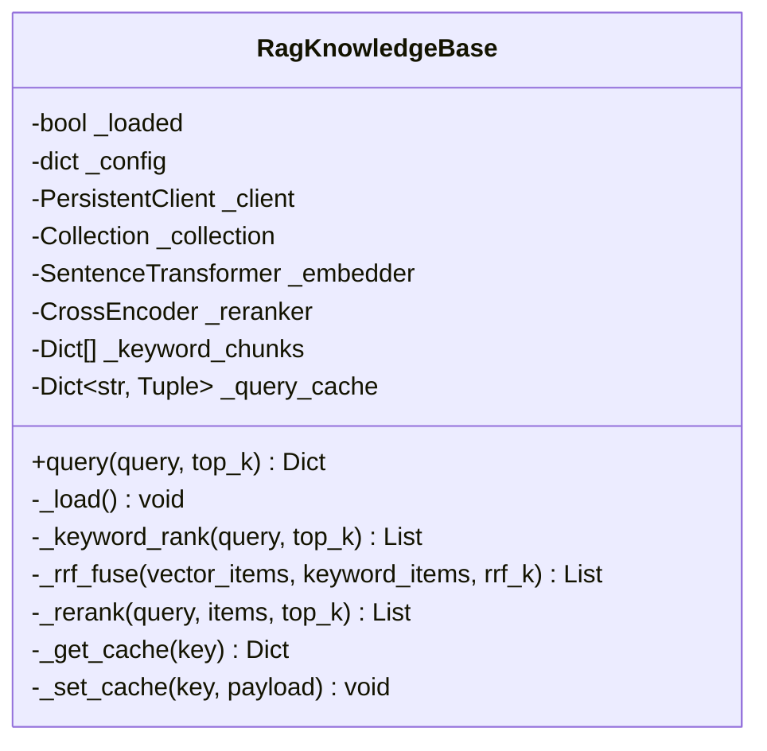
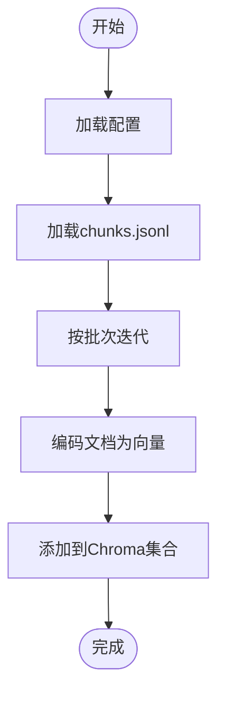
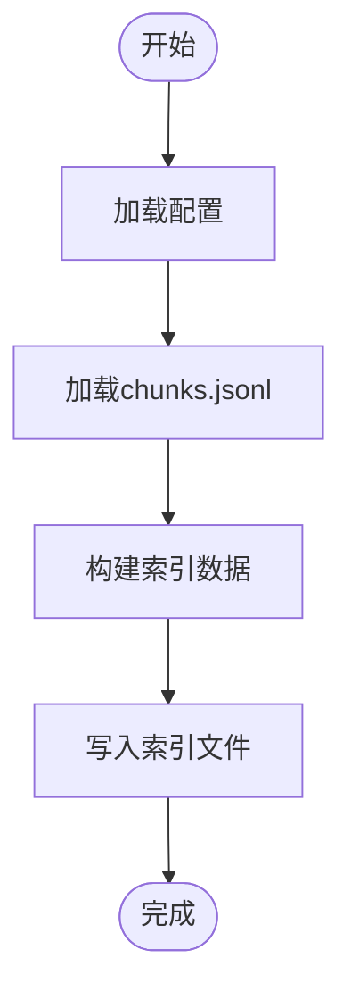
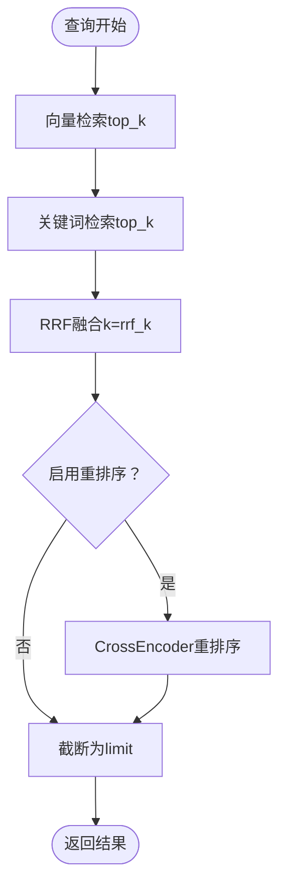
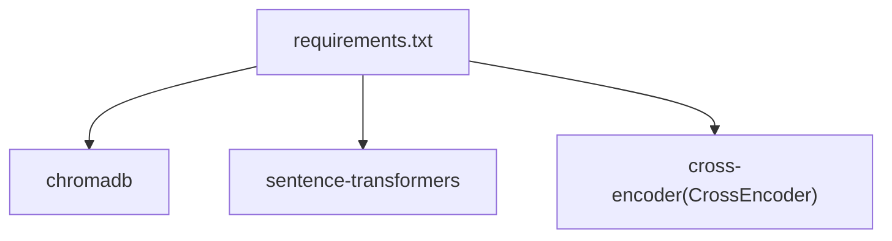

# 配置管理与优化

<cite>
**本文引用的文件**
- [rag_config.json](file://src/rag/config/rag_config.json)
- [knowledge_tool.py](file://src/rag/knowledge_tool.py)
- [build_chroma_index.py](file://src/rag/scripts/build_chroma_index.py)
- [query_chroma.py](file://src/rag/scripts/query_chroma.py)
- [query_index.py](file://src/rag/scripts/query_index.py)
- [build_index.py](file://src/rag/scripts/build_index.py)
- [chunks.jsonl](file://src/rag/data/chunks/chunks.jsonl)
- [requirements.txt](file://requirements.txt)
- [main.py](file://src/api/main.py)
- [README.md](file://README.md)
</cite>

## 目录
1. [简介](#简介)
2. [项目结构](#项目结构)
3. [核心组件](#核心组件)
4. [架构总览](#架构总览)
5. [详细组件分析](#详细组件分析)
6. [依赖分析](#依赖分析)
7. [性能考量](#性能考量)
8. [故障排除指南](#故障排除指南)
9. [结论](#结论)
10. [附录](#附录)

## 简介
本文件面向RAG系统的配置管理与优化，围绕配置文件结构、向量模型与重排序模型、混合检索参数、性能相关参数（如top_k、rrf_k）、缓存配置、模型选择与版本管理策略、配置变更影响分析与回滚机制，以及最佳实践与故障排除进行系统化说明。文档以实际代码与配置为依据，帮助读者在不直接阅读代码的前提下，理解并正确调优RAG系统。

## 项目结构
RAG相关配置与实现集中在src/rag目录，主要包括：
- 配置文件：src/rag/config/rag_config.json
- 知识库工具：src/rag/knowledge_tool.py
- 索引构建与查询脚本：src/rag/scripts/（build_chroma_index.py、query_chroma.py、build_index.py、query_index.py）
- 知识块数据：src/rag/data/chunks/chunks.jsonl
- 外部依赖：requirements.txt

**图表来源**
- [rag_config.json](file://src/rag/config/rag_config.json#L1-L58)
- [knowledge_tool.py](file://src/rag/knowledge_tool.py#L1-L273)
- [build_chroma_index.py](file://src/rag/scripts/build_chroma_index.py#L1-L88)
- [query_chroma.py](file://src/rag/scripts/query_chroma.py#L1-L90)
- [build_index.py](file://src/rag/scripts/build_index.py#L1-L59)
- [query_index.py](file://src/rag/scripts/query_index.py#L1-L98)
- [chunks.jsonl](file://src/rag/data/chunks/chunks.jsonl#L1-L101)

**章节来源**
- [rag_config.json](file://src/rag/config/rag_config.json#L1-L58)
- [knowledge_tool.py](file://src/rag/knowledge_tool.py#L1-L273)
- [build_chroma_index.py](file://src/rag/scripts/build_chroma_index.py#L1-L88)
- [query_chroma.py](file://src/rag/scripts/query_chroma.py#L1-L90)
- [build_index.py](file://src/rag/scripts/build_index.py#L1-L59)
- [query_index.py](file://src/rag/scripts/query_index.py#L1-L98)
- [chunks.jsonl](file://src/rag/data/chunks/chunks.jsonl#L1-L101)

## 核心组件
- 配置中心：集中定义数据路径、索引位置、向量模型、重排序模型、缓存、分块策略、查询参数、混合检索、回退策略、IO设置等。
- 知识库工具：封装Chroma客户端、SentenceTransformer嵌入器、CrossEncoder重排序器、关键词检索、RRF融合、查询缓存、回退判定等。
- 索引构建与查询脚本：分别负责Chroma向量索引与轻量关键词索引的构建与查询，读取配置并执行相应流程。
- 知识块数据：chunks.jsonl提供分块文本、元数据，供索引构建与关键词检索使用。

**章节来源**
- [rag_config.json](file://src/rag/config/rag_config.json#L1-L58)
- [knowledge_tool.py](file://src/rag/knowledge_tool.py#L22-L273)
- [build_chroma_index.py](file://src/rag/scripts/build_chroma_index.py#L37-L84)
- [query_chroma.py](file://src/rag/scripts/query_chroma.py#L45-L85)
- [build_index.py](file://src/rag/scripts/build_index.py#L30-L54)
- [query_index.py](file://src/rag/scripts/query_index.py#L72-L93)
- [chunks.jsonl](file://src/rag/data/chunks/chunks.jsonl#L1-L101)

## 架构总览
RAG系统通过配置文件驱动，知识库工具在运行时加载配置，连接Chroma向量库，使用SentenceTransformer进行嵌入，必要时使用CrossEncoder进行重排序，并结合关键词检索与RRF融合，最终返回结构化结果与引用信息。查询请求可命中内存缓存以提升性能。

**图表来源**
- [knowledge_tool.py](file://src/rag/knowledge_tool.py#L177-L248)
- [rag_config.json](file://src/rag/config/rag_config.json#L1-L58)

**章节来源**
- [knowledge_tool.py](file://src/rag/knowledge_tool.py#L177-L248)
- [rag_config.json](file://src/rag/config/rag_config.json#L1-L58)

## 详细组件分析

### 配置文件结构与参数详解
配置文件涵盖以下关键域：
- data：原始/清洗/分块数据目录
- index：轻量索引文件位置
- chroma：Chroma持久化目录、集合名、重置开关、批量大小
- embedding：嵌入模型名称
- rerank：重排序开关、模型名称、top_k、最小候选数
- cache：缓存开关、TTL秒数、最大容量
- hf：本地文件优先
- chunking：分块最大/最小字符、重叠字符、标题权重
- query：默认返回条目数
- hybrid：混合检索开关、向量top_k、关键词top_k、rrf_k
- fallback：最小结果数、最小分数
- io：编码、允许扩展名

这些参数直接影响索引构建、查询性能、召回质量与重排序效果。

**章节来源**
- [rag_config.json](file://src/rag/config/rag_config.json#L1-L58)

### 知识库工具（RagKnowledgeBase）
- 初始化与加载：读取配置、连接Chroma、初始化嵌入器与重排序器、加载关键词分块。
- 查询流程：缓存命中则直接返回；否则执行向量检索，可选关键词检索与RRF融合，可选重排序，最后写入缓存。
- 回退策略：当结果数量不足或最高分低于阈值时标记回退并附加提示信息。
- 缓存策略：基于TTL与最大容量的LRU淘汰。

**图表来源**
- [knowledge_tool.py](file://src/rag/knowledge_tool.py#L22-L273)

**章节来源**
- [knowledge_tool.py](file://src/rag/knowledge_tool.py#L22-L273)

### Chroma索引构建与查询
- 构建脚本：读取配置，加载chunks.jsonl，按批次编码并写入Chroma集合。
- 查询脚本：读取配置，编码查询向量，执行向量检索，可选重排序。

**图表来源**
- [build_chroma_index.py](file://src/rag/scripts/build_chroma_index.py#L37-L84)

**章节来源**
- [build_chroma_index.py](file://src/rag/scripts/build_chroma_index.py#L37-L84)
- [query_chroma.py](file://src/rag/scripts/query_chroma.py#L45-L85)

### 轻量索引构建与查询
- 构建脚本：读取配置与chunks.jsonl，生成简单索引文件。
- 查询脚本：读取配置与索引文件，执行关键词匹配与打分排序。

**图表来源**
- [build_index.py](file://src/rag/scripts/build_index.py#L30-L54)

**章节来源**
- [build_index.py](file://src/rag/scripts/build_index.py#L30-L54)
- [query_index.py](file://src/rag/scripts/query_index.py#L72-L93)

### 混合检索与重排序
- 混合检索：向量检索与关键词检索并行，使用RRF融合，融合参数由rrf_k控制。
- 重排序：基于CrossEncoder对候选进行重排序，受rerank.top_k与min_candidates约束。

**图表来源**
- [knowledge_tool.py](file://src/rag/knowledge_tool.py#L177-L248)
- [rag_config.json](file://src/rag/config/rag_config.json#L40-L48)

**章节来源**
- [knowledge_tool.py](file://src/rag/knowledge_tool.py#L114-L151)
- [rag_config.json](file://src/rag/config/rag_config.json#L20-L48)

## 依赖分析
- 外部依赖：Chroma、SentenceTransformer、CrossEncoder等模型库与向量检索组件。
- 运行时依赖：配置文件驱动，脚本与工具均从配置读取路径、模型与参数。

**图表来源**
- [requirements.txt](file://requirements.txt#L30-L35)

**章节来源**
- [requirements.txt](file://requirements.txt#L30-L35)
- [build_chroma_index.py](file://src/rag/scripts/build_chroma_index.py#L14-L15)
- [query_chroma.py](file://src/rag/scripts/query_chroma.py#L14-L15)
- [knowledge_tool.py](file://src/rag/knowledge_tool.py#L16-L17)

## 性能考量
- top_k与limit：query.top_k决定向量检索的候选规模，最终返回条目由limit控制；增大top_k可提升召回但增加延迟与重排序开销。
- rrf_k：RRF融合的平滑参数，rrf_k越大，远位排序的贡献越小，融合更偏向近位结果，有助于减少噪声。
- 缓存：cache.enabled开启后，按TTL与最大容量管理内存缓存，显著降低重复查询的延迟。
- 批量大小：chroma.batch_size控制索引构建的批次规模，影响构建吞吐与内存占用。
- 重排序：rerank.enabled与rerank.top_k、min_candidates共同控制重排序的触发与输出规模，重排序成本较高，应结合业务需求权衡。
- 回退策略：fallback.min_results与min_score用于兜底，当结果不足或最高分过低时提示知识库覆盖不足。

**章节来源**
- [rag_config.json](file://src/rag/config/rag_config.json#L40-L56)
- [knowledge_tool.py](file://src/rag/knowledge_tool.py#L153-L175)
- [knowledge_tool.py](file://src/rag/knowledge_tool.py#L177-L248)

## 故障排除指南
- 未找到索引/知识块文件
  - 现象：构建或查询脚本报错提示文件不存在。
  - 排查：确认data.chunks_dir与index.index_dir路径正确，chunks.jsonl是否存在。
  - 参考：构建脚本与查询脚本均包含文件存在性检查。
- Chroma连接失败
  - 现象：无法连接或创建集合。
  - 排查：确认chroma.persist_dir可写，集合名一致，必要时启用reset删除重建。
- 模型加载失败
  - 现象：嵌入器或重排序器初始化异常。
  - 排查：确认embedding.model_name与rerank.model_name正确，hf.local_files_only设置是否符合本地模型部署策略。
- 查询结果为空或质量差
  - 现象：返回空列表或相关性不佳。
  - 排查：提高query.top_k、调整rrf_k、启用重排序、检查fallback阈值是否过高。
- 缓存命中异常
  - 现象：缓存未生效或过期。
  - 排查：确认cache.enabled、ttl_seconds、max_size配置，检查缓存键拼接逻辑。
- API层日志与健康检查
  - 现象：服务运行状态未知。
  - 排查：访问/api/health与日志级别，确认Flask应用启动与路由注册。

**章节来源**
- [build_index.py](file://src/rag/scripts/build_index.py#L40-L41)
- [query_index.py](file://src/rag/scripts/query_index.py#L79-L80)
- [build_chroma_index.py](file://src/rag/scripts/build_chroma_index.py#L53-L57)
- [query_chroma.py](file://src/rag/scripts/query_chroma.py#L56-L64)
- [knowledge_tool.py](file://src/rag/knowledge_tool.py#L153-L175)
- [main.py](file://src/api/main.py#L64-L66)

## 结论
通过集中化的配置文件与模块化的实现，RAG系统实现了对向量模型、重排序模型、混合检索与缓存策略的统一管理。合理设置top_k、rrf_k、缓存参数与回退阈值，可在召回质量与响应性能之间取得平衡。建议在生产环境中结合监控与日志，持续评估与微调配置，确保系统稳定高效运行。

## 附录

### 配置参数速览与建议
- 向量模型与嵌入
  - embedding.model_name：选择中文场景的高质量嵌入模型，如配置文件所示。
  - hf.local_files_only：本地部署时建议开启，避免在线下载。
- 重排序
  - rerank.enabled：在需要提升相关性时启用。
  - rerank.top_k/min_candidates：控制重排序候选规模与触发条件。
- 混合检索
  - hybrid.enabled：启用关键词与向量融合。
  - hybrid.vector_top_k/keyword_top_k：分别控制向量与关键词的候选规模。
  - hybrid.rrf_k：融合平滑参数，建议从配置默认值开始尝试。
- 查询与缓存
  - query.top_k：默认返回条目数，结合业务调优。
  - cache.enabled/ttl_seconds/max_size：缓存开关与容量，建议按QPS与内存预算设置。
- 回退策略
  - fallback.min_results/min_score：兜底阈值，避免低质量结果返回。
- IO与数据
  - io.encoding/allowed_exts：确保文本读取与扩展名过滤正确。

**章节来源**
- [rag_config.json](file://src/rag/config/rag_config.json#L17-L56)

### 配置变更影响分析与回滚机制
- 影响分析
  - 模型参数变更：可能改变召回质量与延迟，需A/B测试或灰度发布。
  - 检索参数变更：top_k、rrf_k直接影响结果数量与相关性，应结合业务指标评估。
  - 缓存参数变更：影响命中率与内存占用，需监控缓存命中率与延迟。
- 回滚机制
  - 版本化配置：将配置文件纳入版本控制，变更前保留备份。
  - 渐进式发布：先在小流量或特定用户组启用新配置，观察指标后扩大范围。
  - 快速回滚：通过版本控制系统恢复上一个稳定配置，或在配置中心提供一键回滚。

**章节来源**
- [rag_config.json](file://src/rag/config/rag_config.json#L1-L58)
- [README.md](file://README.md#L97-L134)