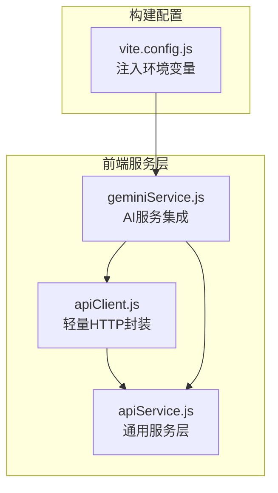
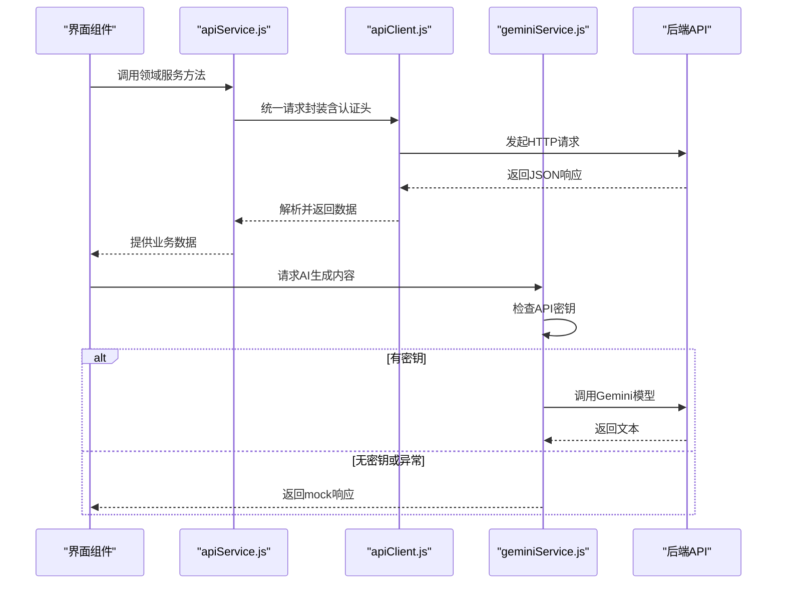
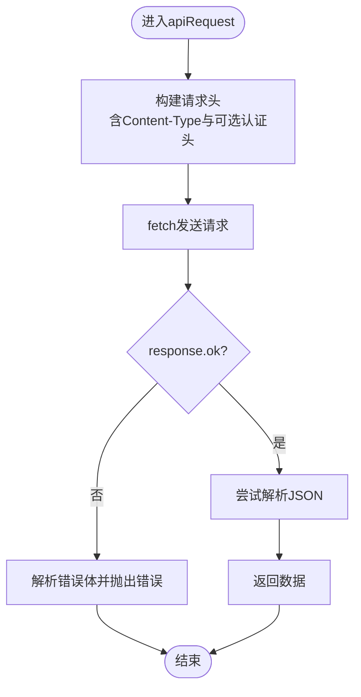
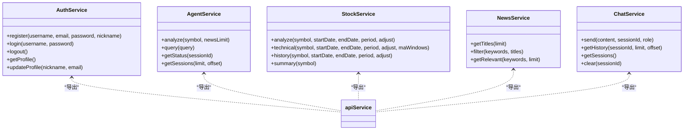
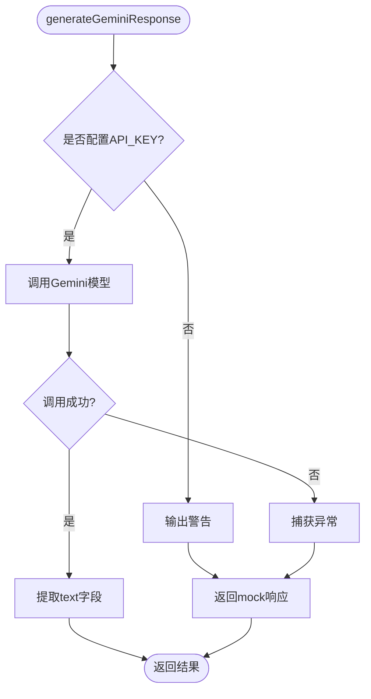
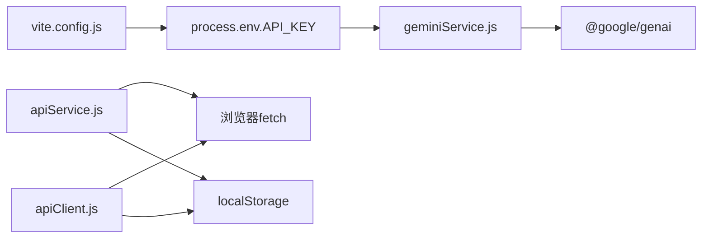
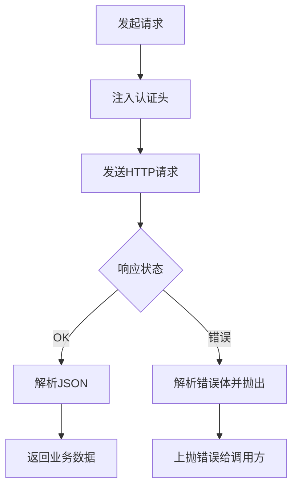

# API集成

<cite>
**本文引用的文件**
- [apiClient.js](file://src/web/src/services/apiClient.js)
- [apiService.js](file://src/web/src/services/apiService.js)
- [geminiService.js](file://src/web/src/services/geminiService.js)
- [vite.config.js](file://src/web/vite.config.js)
- [package.json](file://src/web/package.json)
</cite>

## 目录
1. [简介](#简介)
2. [项目结构](#项目结构)
3. [核心组件](#核心组件)
4. [架构总览](#架构总览)
5. [详细组件分析](#详细组件分析)
6. [依赖分析](#依赖分析)
7. [性能考虑](#性能考虑)
8. [故障排查指南](#故障排查指南)
9. [结论](#结论)
10. [附录](#附录)

## 简介
本文件聚焦于前端Web应用中的API集成设计，系统性梳理以下模块：apiClient.js（HTTP客户端封装）、apiService.js（通用服务层）、geminiService.js（AI服务集成）以及mockService.js（模拟服务）。文档从架构、数据流、处理逻辑、错误处理、认证集成、拦截器配置、缓存策略、并发与重试、超时控制、版本管理、安全与性能监控等维度进行深入说明，并给出可操作的最佳实践建议。

## 项目结构
前端位于 src/web，服务层位于 src/web/src/services，包含四个关键文件：
- apiClient.js：面向具体业务的轻量HTTP封装，内置认证头注入与错误处理
- apiService.js：通用服务层，按领域拆分（用户、代理、股票、新闻、聊天），统一请求与参数序列化
- geminiService.js：AI服务集成，支持真实Gemini调用与降级mock
- vite.config.js：构建期注入环境变量，供AI服务使用

图表来源
- [apiClient.js](file://src/web/src/services/apiClient.js#L1-L130)
- [apiService.js](file://src/web/src/services/apiService.js#L1-L175)
- [geminiService.js](file://src/web/src/services/geminiService.js#L1-L28)
- [vite.config.js](file://src/web/vite.config.js#L1-L15)

章节来源
- [apiClient.js](file://src/web/src/services/apiClient.js#L1-L130)
- [apiService.js](file://src/web/src/services/apiService.js#L1-L175)
- [geminiService.js](file://src/web/src/services/geminiService.js#L1-L28)
- [vite.config.js](file://src/web/vite.config.js#L1-L15)

## 核心组件
- apiClient.js：提供登录、注册、用户资料、密码与手机号更新、工作流启动与状态查询、新闻标题获取、聊天消息发送与历史查询等方法；内部通过fetch发起请求，自动注入认证头，对非OK响应抛出错误
- apiService.js：以领域划分的服务集合，统一处理认证令牌、请求头、错误处理与JSON解析；提供认证、代理、股票、新闻、聊天等服务
- geminiService.js：封装Gemini调用，若未配置API密钥则回退到mock响应；捕获异常并返回mock作为兜底
- mockService.js：被geminiService引用的模拟响应模块（文件存在但二进制无法读取，实际内容以mock实现为准）

章节来源
- [apiClient.js](file://src/web/src/services/apiClient.js#L43-L130)
- [apiService.js](file://src/web/src/services/apiService.js#L37-L175)
- [geminiService.js](file://src/web/src/services/geminiService.js#L1-L28)

## 架构总览
前端通过服务层向后端API发起请求，认证信息通过本地存储传递；AI能力通过Gemini服务封装，具备无API密钥时的降级策略。

图表来源
- [apiService.js](file://src/web/src/services/apiService.js#L14-L35)
- [apiClient.js](file://src/web/src/services/apiClient.js#L20-L41)
- [geminiService.js](file://src/web/src/services/geminiService.js#L4-L27)

## 详细组件分析

### apiClient.js：HTTP客户端封装与认证集成
- 基础URL与令牌键值：通过环境变量注入基础地址，令牌键名固定
- 认证头注入：当启用auth标志时，从本地存储读取令牌并附加到Authorization头
- 错误处理：对非OK响应解析错误体并抛出错误；对响应体解析失败返回空对象避免崩溃
- 方法覆盖：提供登录、注册、用户资料、密码与手机号更新、工作流启动与状态查询、新闻标题获取、聊天消息发送与历史查询等常用接口

图表来源
- [apiClient.js](file://src/web/src/services/apiClient.js#L20-L41)

章节来源
- [apiClient.js](file://src/web/src/services/apiClient.js#L1-L130)

### apiService.js：通用服务层设计
- 统一请求：封装apiRequest，集中处理URL拼接、认证头、错误处理与JSON解析
- 认证服务：注册、登录、登出、获取与更新用户资料；登录成功后持久化令牌
- 代理服务：分析、查询、状态查询、会话列表
- 股票服务：分析、技术指标、历史行情、摘要；支持参数序列化与多时间周期
- 新闻服务：标题列表、关键词过滤、相关资讯
- 聊天服务：发送消息、获取历史、会话列表、清空会话

图表来源
- [apiService.js](file://src/web/src/services/apiService.js#L37-L175)

章节来源
- [apiService.js](file://src/web/src/services/apiService.js#L1-L175)

### geminiService.js：AI服务集成与降级策略
- API密钥检查：在运行时读取环境变量API_KEY
- 无密钥降级：若未配置API密钥，输出警告并返回mock响应
- 异常兜底：调用失败时记录错误并回退到mock响应
- 文本提取：从响应中提取文本字段，若为空返回默认提示

图表来源
- [geminiService.js](file://src/web/src/services/geminiService.js#L4-L27)

章节来源
- [geminiService.js](file://src/web/src/services/geminiService.js#L1-L28)
- [vite.config.js](file://src/web/vite.config.js#L9-L12)

### mockService.js：模拟服务实现
- 文件存在且被geminiService引用，用于在无API密钥或调用异常时提供稳定响应
- 由于文件为二进制不可读，实际内容以mock实现为准

章节来源
- [geminiService.js](file://src/web/src/services/geminiService.js#L1-L2)

## 依赖分析
- 构建期注入：vite.config.js在define中将环境变量注入到运行时，使geminiService可读取API_KEY
- 运行时依赖：geminiService依赖@google/genai包；apiClient与apiService基于浏览器fetch标准API
- 本地存储：apiClient.js与apiService.js均使用localStorage存储令牌

图表来源
- [vite.config.js](file://src/web/vite.config.js#L9-L12)
- [geminiService.js](file://src/web/src/services/geminiService.js#L1-L2)
- [apiService.js](file://src/web/src/services/apiService.js#L3-L12)
- [apiClient.js](file://src/web/src/services/apiClient.js#L1-L18)

章节来源
- [vite.config.js](file://src/web/vite.config.js#L1-L15)
- [package.json](file://src/web/package.json#L12-L31)
- [apiService.js](file://src/web/src/services/apiService.js#L1-L175)
- [apiClient.js](file://src/web/src/services/apiClient.js#L1-L130)

## 性能考虑
- 并发控制：当前实现未显式限制并发数，建议在调用层引入队列或信号量，避免过度并发导致资源争用
- 缓存策略：apiService.js未内置缓存；可在高频查询场景增加内存缓存或LRU缓存，结合参数哈希作为key
- 超时控制：当前未设置fetch超时，建议为长耗时请求添加AbortController超时机制
- 重试机制：对网络瞬时错误（如5xx、ECONNRESET）建议实现指数退避重试
- 流式响应：若后端提供流式接口，前端需支持流式读取与断线重连
- 监控埋点：在apiService与apiClient中埋点记录请求耗时、成功率、错误类型，便于性能分析

## 故障排查指南
- 认证失败：检查本地存储令牌是否存在与有效；确认apiClient与apiService的auth开关使用是否正确
- 网络错误：查看apiRequest/apiService的错误处理日志；确认后端地址与跨域配置
- AI调用异常：若出现Gemini调用失败，确认API_KEY是否正确注入；检查mockService是否正常返回
- 参数问题：核对URL参数与JSON Body格式，确保字段命名与后端一致

章节来源
- [apiClient.js](file://src/web/src/services/apiClient.js#L20-L41)
- [apiService.js](file://src/web/src/services/apiService.js#L14-L35)
- [geminiService.js](file://src/web/src/services/geminiService.js#L13-L26)

## 结论
该API集成方案采用“轻量HTTP封装 + 通用服务层 + AI降级”的组合，既满足日常业务请求，又保证在无外部API密钥时的可用性。建议后续完善并发控制、缓存、超时与重试策略，并在服务层增加统一的监控埋点，以提升稳定性与可观测性。

## 附录

### API调用最佳实践清单
- 错误处理策略
  - 对非OK响应统一解析错误体并抛出
  - 区分网络错误与业务错误，分别处理
- 重试机制
  - 对幂等请求（GET/DELETE）允许有限次数重试
  - 使用指数退避与抖动，避免雪崩效应
- 超时控制
  - 为长请求设置超时，超时后主动取消
- 并发管理
  - 限制同时请求数，避免资源争用
  - 对高频请求使用去抖/节流
- 版本管理
  - 在URL或Header中携带API版本号，保持兼容
- 安全考虑
  - 令牌仅保存在安全存储中，避免明文泄露
  - 严格校验入参，防止注入攻击
- 性能监控
  - 记录请求耗时、成功率、错误码分布
  - 对慢请求与高错误率进行告警

### 关键流程图示例（概念性）
