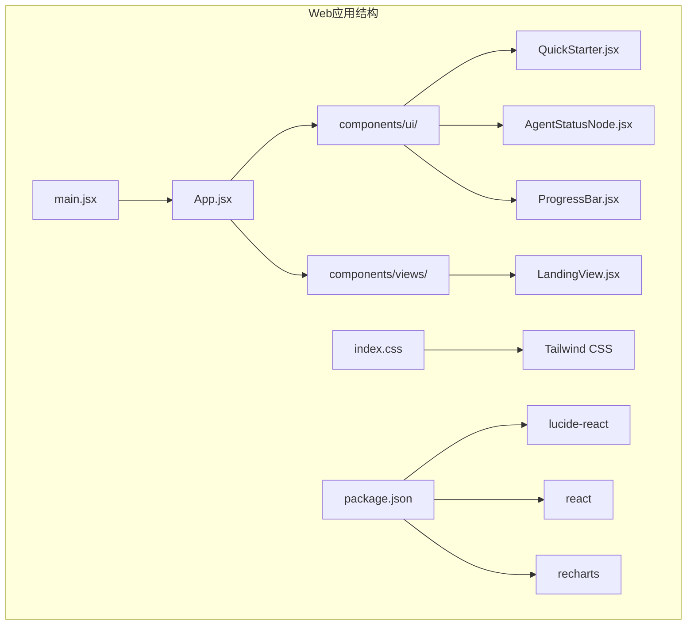
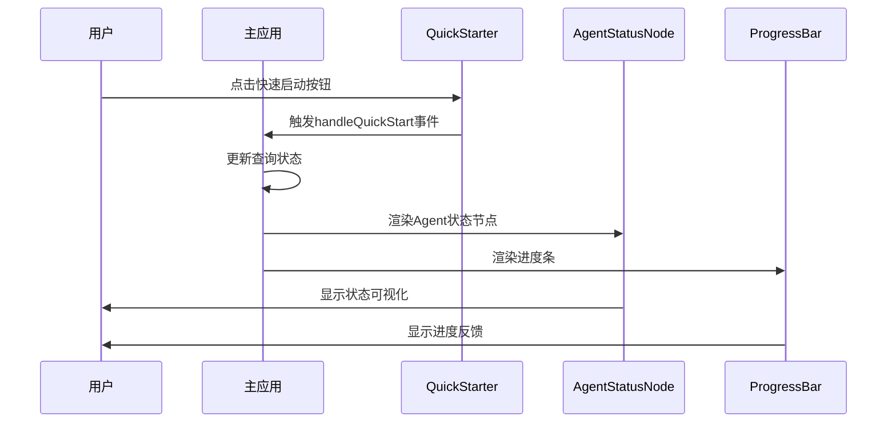
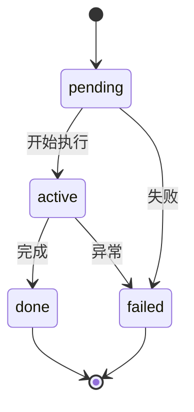
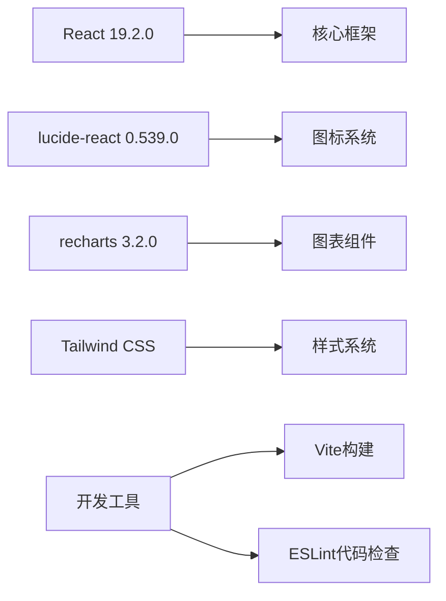
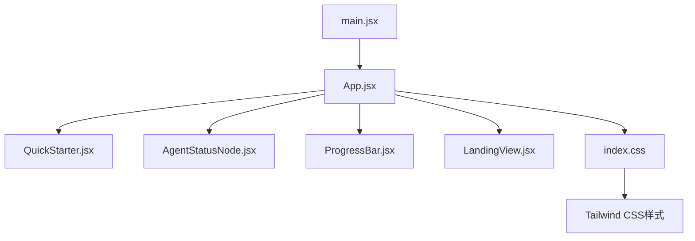

# UI组件系统

<cite>
**本文档引用的文件**
- [QuickStarter.jsx](file://src/web/src/components/ui/QuickStarter.jsx)
- [AgentStatusNode.jsx](file://src/web/src/components/ui/AgentStatusNode.jsx)
- [ProgressBar.jsx](file://src/web/src/components/ui/ProgressBar.jsx)
- [App.jsx](file://src/web/src/App.jsx)
- [main.jsx](file://src/web/src/main.jsx)
- [index.css](file://src/web/src/index.css)
- [package.json](file://src/web/package.json)
- [LandingView.jsx](file://src/web/src/components/views/LandingView.jsx)
</cite>

## 目录
1. [简介](#简介)
2. [项目结构](#项目结构)
3. [核心组件](#核心组件)
4. [架构概览](#架构概览)
5. [详细组件分析](#详细组件分析)
6. [依赖关系分析](#依赖关系分析)
7. [性能考虑](#性能考虑)
8. [故障排除指南](#故障排除指南)
9. [结论](#结论)
10. [附录](#附录)

## 简介
本项目是一个基于React的AI投资助手前端应用，专注于为用户提供智能化的投资分析服务。UI组件系统是整个应用的核心界面层，负责展示投资分析流程、状态可视化和用户交互。本文档深入解析三个核心UI组件：QuickStarter快速启动器、AgentStatusNode状态节点和ProgressBar进度条组件的设计与实现。

## 项目结构
项目采用模块化组织方式，UI组件集中在`src/web/src/components/ui/`目录下，主应用逻辑在`App.jsx`中实现，样式通过Tailwind CSS进行统一管理。



**图表来源**
- [main.jsx](file://src/web/src/main.jsx#L1-L11)
- [App.jsx](file://src/web/src/App.jsx#L1-L50)
- [package.json](file://src/web/package.json#L1-L33)

**章节来源**
- [main.jsx](file://src/web/src/main.jsx#L1-L11)
- [package.json](file://src/web/package.json#L1-L33)

## 核心组件
UI组件系统包含三个核心组件，每个组件都有明确的职责分工：

### QuickStarter 快速启动器
- **功能**：提供预设查询模板，简化用户输入
- **交互**：点击触发查询，支持多种投资主题
- **样式**：深色主题，悬停效果，渐变色彩

### AgentStatusNode 状态节点
- **功能**：可视化Agent工作流状态
- **状态**：active(进行中)、done(已完成)、pending(待开始)
- **视觉反馈**：颜色编码、缩放动画、旋转加载

### ProgressBar 进度条
- **功能**：显示整体处理进度
- **样式**：渐变色彩，平滑过渡动画
- **响应**：实时进度更新

**章节来源**
- [QuickStarter.jsx](file://src/web/src/components/ui/QuickStarter.jsx#L1-L15)
- [AgentStatusNode.jsx](file://src/web/src/components/ui/AgentStatusNode.jsx#L1-L17)
- [ProgressBar.jsx](file://src/web/src/components/ui/ProgressBar.jsx#L1-L13)

## 架构概览
应用采用组件化架构，主应用容器管理全局状态，三个UI组件通过props接收数据并渲染相应的视觉效果。



**图表来源**
- [App.jsx](file://src/web/src/App.jsx#L646-L648)
- [QuickStarter.jsx](file://src/web/src/components/ui/QuickStarter.jsx#L4-L12)
- [AgentStatusNode.jsx](file://src/web/src/components/ui/AgentStatusNode.jsx#L4-L14)
- [ProgressBar.jsx](file://src/web/src/components/ui/ProgressBar.jsx#L3-L10)

## 详细组件分析

### QuickStarter 快速启动器组件

QuickStarter组件是一个轻量级的按钮组件，提供预设的投资查询模板，简化用户的操作流程。

#### 组件设计特点
- **简洁接口**：仅接受`text`和`onClick`两个props
- **一致性设计**：统一的样式规范和交互行为
- **语义化图标**：使用Activity图标表示活动状态

#### Props接口设计
```javascript
// QuickStarter Props
{
  text: string,        // 显示的按钮文本
  onClick: function    // 点击事件处理器
}
```

#### 事件处理机制
组件内部实现了简单的点击事件处理，将用户交互传递给父组件：
- 点击事件触发`onClick`回调函数
- 支持任意自定义处理逻辑
- 保持组件的无状态特性

#### 样式定制方案
- **基础样式**：深灰色背景，浅灰色文字
- **悬停效果**：颜色渐变，边框变化
- **尺寸规范**：紧凑的内边距，适合密集排列

**章节来源**
- [QuickStarter.jsx](file://src/web/src/components/ui/QuickStarter.jsx#L1-L15)
- [App.jsx](file://src/web/src/App.jsx#L864-L869)

### AgentStatusNode 状态节点组件

AgentStatusNode组件负责可视化Agent工作流的状态，提供清晰的进度指示和状态反馈。

#### 状态管理系统
组件支持三种状态，每种状态都有独特的视觉表现：



**图表来源**
- [AgentStatusNode.jsx](file://src/web/src/components/ui/AgentStatusNode.jsx#L4-L14)

#### 视觉设计系统
- **颜色编码**：
  - active: 红色系（边框、背景、文字）
  - done: 蓝色系（边框、背景、文字）
  - pending: 灰色系（边框、背景、文字）
- **动画效果**：500ms过渡时间，active状态110%缩放
- **图标系统**：active状态使用旋转加载图标，其他状态使用传入的Icon组件

#### 组件复杂度分析
- **时间复杂度**：O(1) - 状态判断和渲染都是常量时间
- **空间复杂度**：O(1) - 固定的DOM结构和样式类
- **渲染优化**：使用CSS类名切换而非内联样式，提升渲染性能

**章节来源**
- [AgentStatusNode.jsx](file://src/web/src/components/ui/AgentStatusNode.jsx#L1-L17)
- [App.jsx](file://src/web/src/App.jsx#L882-L899)

### ProgressBar 进度条组件

ProgressBar组件提供直观的进度可视化，支持实时进度更新和流畅的动画效果。

#### 进度计算机制
组件通过`progress` prop接收百分比值，动态调整进度条宽度：
- **范围限制**：0-100%的进度范围
- **平滑动画**：300ms过渡时间，ease-out缓动函数
- **渐变色彩**：从红色到橙色的渐变效果

#### 动画效果设计
- **过渡属性**：width属性的平滑变化
- **持续时间**：300毫秒的动画时长
- **缓动函数**：ease-out提供自然的结束效果

#### 性能优化策略
- **最小化重绘**：仅改变width样式属性
- **硬件加速**：利用浏览器的GPU加速能力
- **内存管理**：无状态组件，避免不必要的状态存储

**章节来源**
- [ProgressBar.jsx](file://src/web/src/components/ui/ProgressBar.jsx#L1-L13)
- [App.jsx](file://src/web/src/App.jsx#L901-L902)

## 依赖关系分析

### 外部依赖
项目使用以下关键依赖包：



**图表来源**
- [package.json](file://src/web/package.json#L12-L31)

### 内部依赖关系
组件间的依赖关系相对简单，主要通过App.jsx协调：



**图表来源**
- [App.jsx](file://src/web/src/App.jsx#L1-L50)
- [main.jsx](file://src/web/src/main.jsx#L1-L11)

**章节来源**
- [package.json](file://src/web/package.json#L1-L33)
- [index.css](file://src/web/src/index.css#L1-L14)

## 性能考虑

### 渲染性能优化
1. **组件拆分**：三个UI组件都是纯函数组件，避免不必要的重渲染
2. **样式优化**：使用CSS类名而非内联样式，提升渲染效率
3. **事件处理**：在父组件中集中处理事件，减少子组件的事件绑定开销

### 内存管理
1. **无状态设计**：组件不维护本地状态，减少内存占用
2. **及时清理**：定时器在组件卸载时自动清理
3. **引用管理**：使用useRef管理DOM引用，避免循环引用

### 动画性能
1. **GPU加速**：使用transform和opacity属性触发动画
2. **硬件加速**：合理使用will-change属性
3. **帧率优化**：避免在动画过程中触发布局计算

## 故障排除指南

### 常见问题及解决方案

#### QuickStarter组件问题
- **问题**：点击事件无效
- **原因**：onClick prop未正确传递
- **解决**：确保父组件正确传递onClick函数

#### AgentStatusNode状态异常
- **问题**：状态显示不正确
- **原因**：status prop值不在预期范围内
- **解决**：确保status值为'active'、'done'或'pending'

#### ProgressBar不显示
- **问题**：进度条不显示或显示异常
- **原因**：progress值超出0-100范围
- **解决**：验证progress值的有效性

**章节来源**
- [QuickStarter.jsx](file://src/web/src/components/ui/QuickStarter.jsx#L4-L12)
- [AgentStatusNode.jsx](file://src/web/src/components/ui/AgentStatusNode.jsx#L4-L14)
- [ProgressBar.jsx](file://src/web/src/components/ui/ProgressBar.jsx#L3-L10)

## 结论
UI组件系统展现了现代React应用的最佳实践，通过简洁的组件设计、清晰的职责分离和高效的性能优化，为用户提供流畅的交互体验。三个核心组件各司其职，共同构建了完整的投资分析界面生态系统。

## 附录

### 组件开发最佳实践

#### Props接口设计原则
1. **最小化接口**：只暴露必要的props
2. **类型安全**：明确参数类型和默认值
3. **向后兼容**：新增props时保持向后兼容

#### 样式定制指南
1. **主题一致性**：遵循应用的整体设计语言
2. **响应式设计**：适配不同屏幕尺寸
3. **可访问性**：确保足够的对比度和键盘导航支持

#### 性能优化技巧
1. **组件拆分**：将复杂逻辑拆分为多个小组件
2. **懒加载**：对不常用的组件使用懒加载
3. **虚拟化**：对大量列表数据使用虚拟化技术