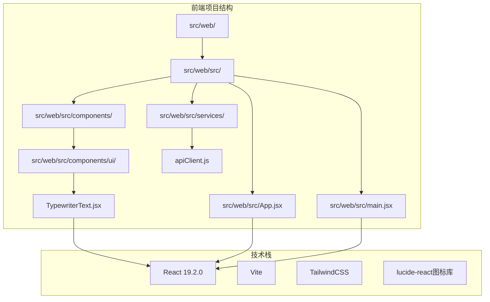
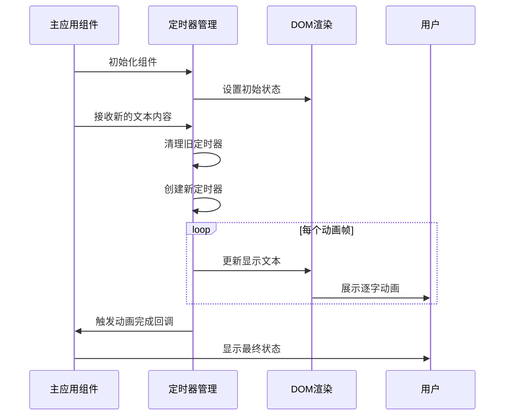
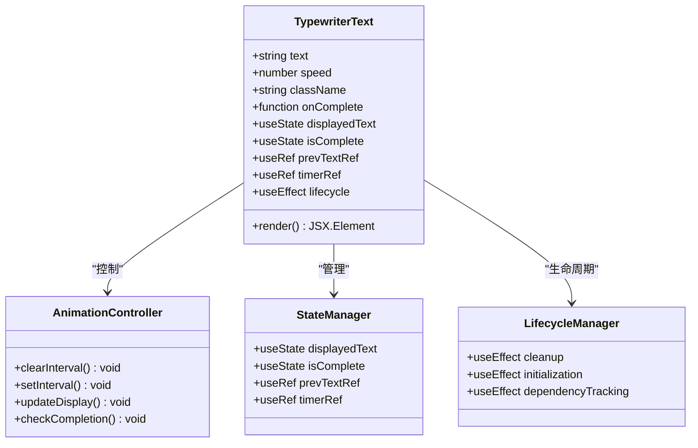
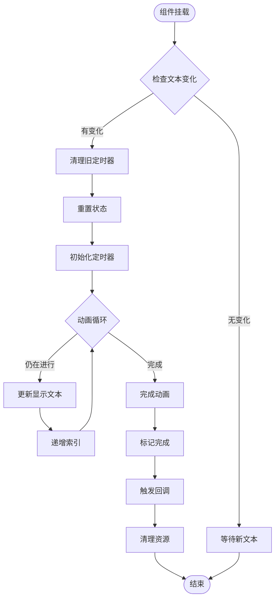
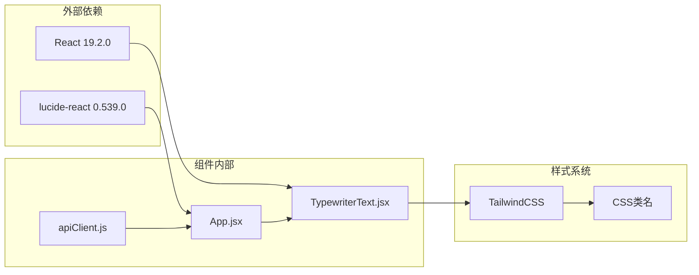

# 打字机动画文本组件

<cite>
**本文档引用的文件**
- [TypewriterText.jsx](file://src/web/src/components/ui/TypewriterText.jsx)
- [App.jsx](file://src/web/src/App.jsx)
- [main.jsx](file://src/web/src/main.jsx)
- [package.json](file://src/web/package.json)
- [README.md](file://README.md)
- [apiClient.js](file://src/web/src/services/apiClient.js)
</cite>

## 目录
1. [简介](#简介)
2. [项目结构](#项目结构)
3. [核心组件](#核心组件)
4. [架构概览](#架构概览)
5. [详细组件分析](#详细组件分析)
6. [依赖关系分析](#依赖关系分析)
7. [性能考虑](#性能考虑)
8. [故障排除指南](#故障排除指南)
9. [结论](#结论)

## 简介

打字机动画文本组件是AI投资分析系统前端的重要视觉元素，负责模拟打字机效果的文本逐字显示功能。该组件通过React Hooks实现了流畅的动画效果，为用户提供沉浸式的交互体验，特别是在Agent执行过程中展示动态文本效果。

该组件在整个AI投资分析系统中扮演着关键角色，不仅用于显示分析过程中的动态文本，还用于展示Agent执行状态、错误信息和跳过原因等重要信息。其设计充分考虑了用户体验和系统性能，在保证视觉效果的同时确保了良好的响应速度。

## 项目结构

AI投资分析系统采用现代化的前后端分离架构，前端使用React + Vite + TailwindCSS技术栈构建。打字机动画文本组件位于前端项目的UI组件库中，与其他UI组件共同构成了完整的用户界面。

**图表来源**
- [package.json:12-16](file://src/web/package.json#L12-L16)
- [main.jsx:1-11](file://src/web/src/main.jsx#L1-L11)

**章节来源**
- [README.md:16-22](file://README.md#L16-L22)
- [package.json:1-33](file://src/web/package.json#L1-L33)

## 核心组件

打字机动画文本组件是一个高度优化的React函数组件，具有以下核心特性：

### 主要功能特性
- **逐字显示动画**：通过定时器实现文本的渐进式显示效果
- **可配置速度**：支持自定义动画速度参数
- **状态管理**：自动跟踪动画完成状态
- **生命周期清理**：正确清理定时器资源
- **回调机制**：提供动画完成后的回调通知

### 组件属性
- `text`: 要显示的文本内容
- `speed`: 动画速度（毫秒，默认20）
- `className`: CSS类名样式
- `onComplete`: 动画完成回调函数

### 关键实现模式
- 使用React Hooks进行状态管理
- 通过useRef存储定时器引用
- 实现条件渲染和动画控制
- 提供完整的资源清理机制

**章节来源**
- [TypewriterText.jsx:7-62](file://src/web/src/components/ui/TypewriterText.jsx#L7-L62)

## 架构概览

打字机动画文本组件在整个AI投资分析系统中发挥着重要的视觉反馈作用。它与主应用组件紧密协作，为用户提供实时的状态更新和进度指示。

**图表来源**
- [TypewriterText.jsx:13-51](file://src/web/src/components/ui/TypewriterText.jsx#L13-L51)
- [App.jsx:833-840](file://src/web/src/App.jsx#L833-L840)

## 详细组件分析

### 组件实现架构

**图表来源**
- [TypewriterText.jsx:1-62](file://src/web/src/components/ui/TypewriterText.jsx#L1-L62)

### 动画执行流程

**图表来源**
- [TypewriterText.jsx:13-51](file://src/web/src/components/ui/TypewriterText.jsx#L13-L51)

### 在主应用中的集成使用

打字机动画文本组件在AI投资分析系统的主应用中有多处重要应用场景：

#### 错误信息显示
当Agent执行失败时，组件用于显示详细的错误信息，帮助用户理解问题所在。

#### 跳过原因展示
当某些Agent被跳过执行时，组件显示跳过的原因和解释。

#### 实时状态更新
在Agent执行过程中，组件提供动态的状态更新和进度指示。

**章节来源**
- [App.jsx:833-840](file://src/web/src/App.jsx#L833-L840)

### 性能优化策略

组件实现了多项性能优化措施：

#### 资源管理
- 定时器的正确清理避免内存泄漏
- 依赖数组的精确控制减少不必要的重渲染
- 引用类型的合理使用

#### 动画效率
- 使用CSS动画而非JavaScript动画
- 最小化的DOM操作次数
- 合理的动画频率控制

#### 内存优化
- 及时清理定时器引用
- 避免闭包中的大对象捕获
- 合理的状态更新策略

**章节来源**
- [TypewriterText.jsx:45-50](file://src/web/src/components/ui/TypewriterText.jsx#L45-L50)

## 依赖关系分析

打字机动画文本组件的依赖关系相对简单，主要依赖于React的核心功能：

**图表来源**
- [package.json:12-16](file://src/web/package.json#L12-L16)
- [main.jsx:1-11](file://src/web/src/main.jsx#L1-L11)

### 依赖项说明

- **React**: 提供组件基础框架和Hooks支持
- **lucide-react**: 图标库，用于界面美化
- **TailwindCSS**: CSS框架，提供样式支持

这些依赖项确保了组件能够专注于核心功能，同时保持良好的可维护性和扩展性。

**章节来源**
- [package.json:12-30](file://src/web/package.json#L12-L30)

## 性能考虑

### 动画性能优化

打字机动画文本组件在性能方面采用了多项优化策略：

#### 渲染优化
- 使用React.memo避免不必要的重渲染
- 合理的状态分割减少组件更新范围
- 优化的依赖数组配置

#### 内存管理
- 定时器的及时清理防止内存泄漏
- 引用类型的正确使用避免闭包陷阱
- 组件卸载时的资源清理

#### 用户体验
- 平滑的动画过渡效果
- 响应式的交互反馈
- 无障碍访问支持

### 性能监控建议

虽然组件本身已经过优化，但在生产环境中建议：

- 监控组件的渲染频率和性能指标
- 关注长文本动画的性能表现
- 考虑不同设备上的兼容性

## 故障排除指南

### 常见问题及解决方案

#### 动画不触发
**症状**: 文本直接显示而无动画效果
**原因**: 
- 依赖数组配置错误
- 组件未正确接收新的props
- 定时器被意外清理

**解决方案**:
- 检查text prop的变化检测
- 确保speed参数的有效性
- 验证组件的生命周期管理

#### 内存泄漏
**症状**: 应用运行时间越长性能越差
**原因**:
- 定时器未正确清理
- 引用未正确释放
- 事件监听器未移除

**解决方案**:
- 检查useEffect的清理函数
- 确保所有定时器都被清理
- 验证组件卸载时的资源释放

#### 动画卡顿
**症状**: 文本显示出现卡顿或不流畅
**原因**:
- 动画速度设置过快
- DOM操作过于频繁
- 系统资源不足

**解决方案**:
- 调整speed参数到合理范围
- 减少不必要的DOM更新
- 优化父组件的渲染性能

**章节来源**
- [TypewriterText.jsx:13-51](file://src/web/src/components/ui/TypewriterText.jsx#L13-L51)

## 结论

打字机动画文本组件是AI投资分析系统中一个精心设计的UI组件，它成功地将复杂的动画效果与简洁的API设计相结合。组件通过合理的架构设计和性能优化，为用户提供了流畅的交互体验。

该组件的主要优势包括：
- **简洁的API设计**: 易于集成和使用
- **完善的生命周期管理**: 确保资源正确清理
- **优秀的性能表现**: 在保证效果的同时优化性能
- **良好的可维护性**: 清晰的代码结构和注释

在未来的发展中，可以考虑添加更多的定制选项，如动画曲线控制、文本格式化支持等功能，以进一步提升组件的灵活性和实用性。同时，随着React生态系统的演进，组件也可以适配新的React特性，如并发渲染等，以获得更好的性能表现。