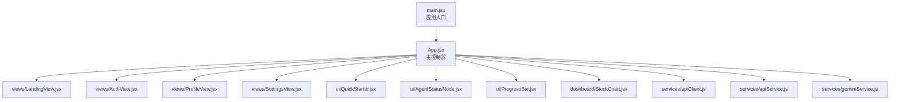
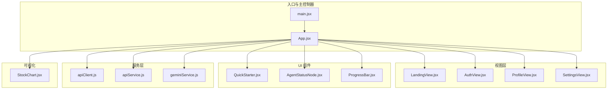
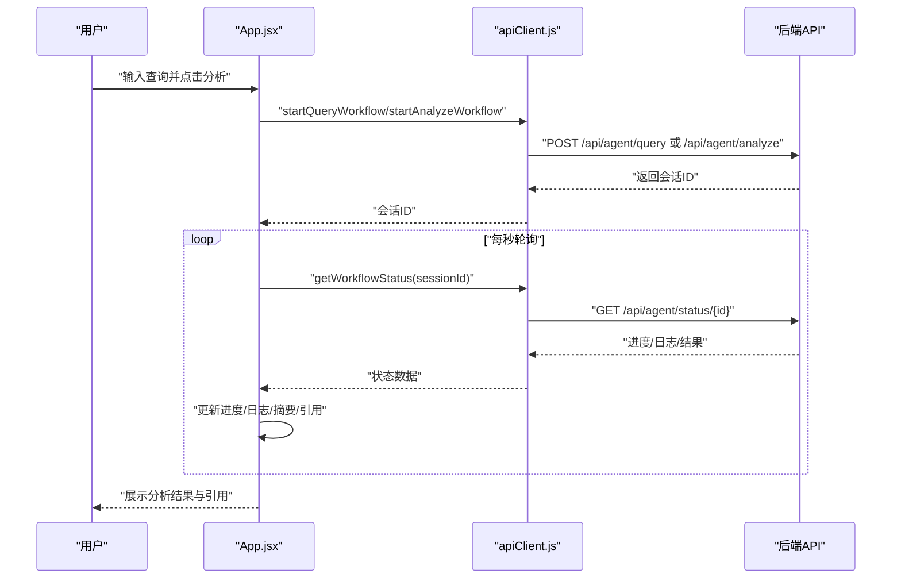
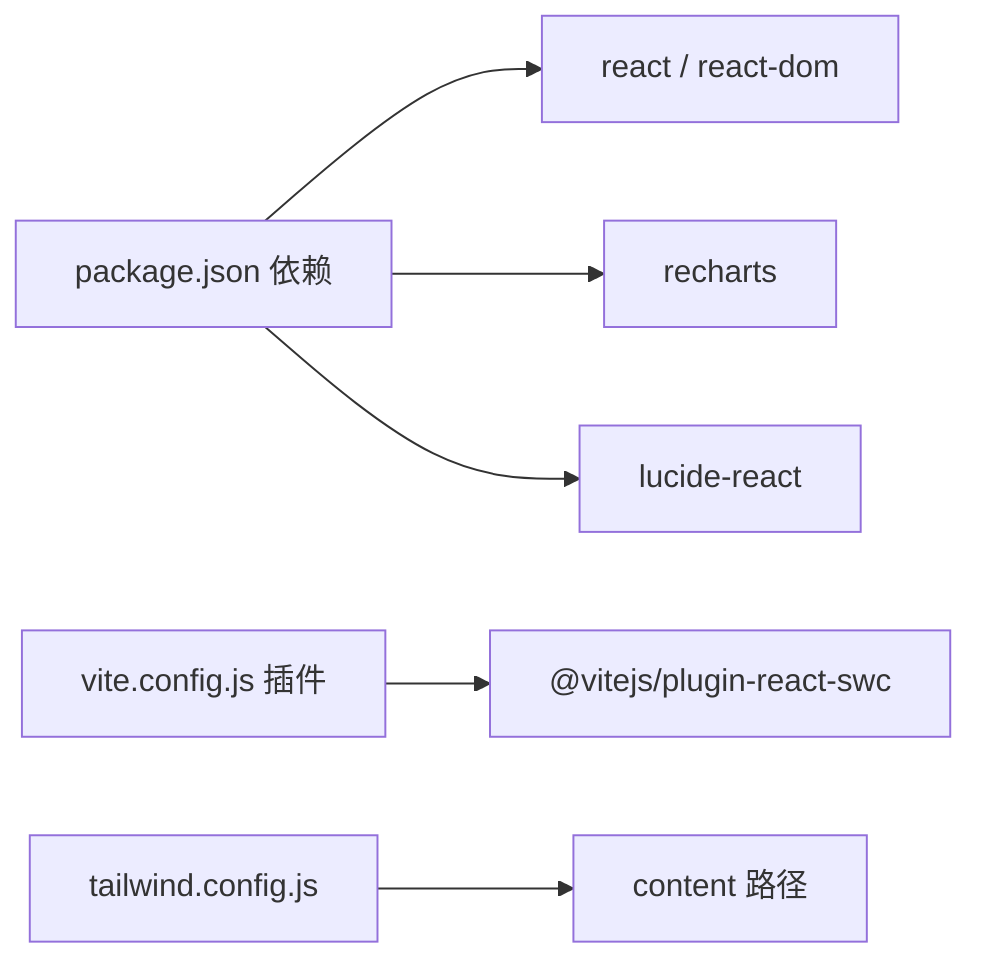
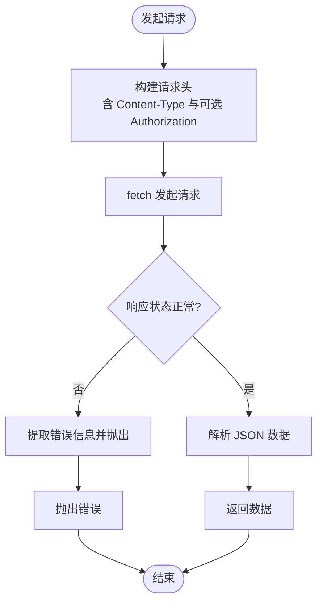

# 前端系统

<cite>
**本文引用的文件**
- [package.json](file://src/web/package.json)
- [vite.config.js](file://src/web/vite.config.js)
- [tailwind.config.js](file://src/web/tailwind.config.js)
- [main.jsx](file://src/web/src/main.jsx)
- [App.jsx](file://src/web/src/App.jsx)
- [index.css](file://src/web/src/index.css)
- [QuickStarter.jsx](file://src/web/src/components/ui/QuickStarter.jsx)
- [AgentStatusNode.jsx](file://src/web/src/components/ui/AgentStatusNode.jsx)
- [ProgressBar.jsx](file://src/web/src/components/ui/ProgressBar.jsx)
- [apiClient.js](file://src/web/src/services/apiClient.js)
- [apiService.js](file://src/web/src/services/apiService.js)
- [geminiService.js](file://src/web/src/services/geminiService.js)
- [LandingView.jsx](file://src/web/src/components/views/LandingView.jsx)
- [AuthView.jsx](file://src/web/src/components/views/AuthView.jsx)
- [StockChart.jsx](file://src/web/src/components/dashboard/StockChart.jsx)
- [README.md（前端）](file://src/web/README.md)
- [README.md（项目总览）](file://src/web/README.md)
</cite>

## 目录
1. [简介](#简介)
2. [项目结构](#项目结构)
3. [核心组件](#核心组件)
4. [架构总览](#架构总览)
5. [组件详解](#组件详解)
6. [依赖关系分析](#依赖关系分析)
7. [性能与构建优化](#性能与构建优化)
8. [故障排查指南](#故障排查指南)
9. [结论](#结论)
10. [附录](#附录)

## 简介
本项目前端采用 React + Vite + TailwindCSS 技术栈，配合 Recharts 实现可视化展示，围绕“AI 驱动的投资分析”场景构建。系统提供用户认证、自然语言/股票代码分析、多 Agent 执行流程可视化、聊天问答与引用链接展示等功能。本文档从架构设计、组件层次、状态管理、路由配置、API 客户端设计、组件开发指南、构建与部署优化、性能监控等方面进行系统化说明。

## 项目结构
前端位于 src/web 目录，采用按功能域划分的组织方式：
- src/web/src/main.jsx：应用入口，挂载根组件
- src/web/src/App.jsx：应用主控制器，集中管理状态、路由与业务流程
- src/web/src/components/ui/*：可复用 UI 组件（QuickStarter、AgentStatusNode、ProgressBar）
- src/web/src/components/views/*：页面级视图（LandingView、AuthView、ProfileView、SettingsView）
- src/web/src/components/dashboard/*：仪表盘组件（StockChart）
- src/web/src/services/*：API 客户端与第三方服务封装（apiClient、apiService、geminiService）
- src/web/vite.config.js、tailwind.config.js、package.json：构建与样式配置
- src/web/src/index.css：全局样式入口（Tailwind 指令）

图表来源
- [main.jsx](file://src/web/src/main.jsx#L1-L11)
- [App.jsx](file://src/web/src/App.jsx#L1-L120)
- [QuickStarter.jsx](file://src/web/src/components/ui/QuickStarter.jsx#L1-L15)
- [AgentStatusNode.jsx](file://src/web/src/components/ui/AgentStatusNode.jsx#L1-L17)
- [ProgressBar.jsx](file://src/web/src/components/ui/ProgressBar.jsx#L1-L13)
- [apiClient.js](file://src/web/src/services/apiClient.js#L1-L130)
- [apiService.js](file://src/web/src/services/apiService.js#L1-L175)
- [geminiService.js](file://src/web/src/services/geminiService.js#L1-L28)
- [LandingView.jsx](file://src/web/src/components/views/LandingView.jsx#L1-L64)
- [AuthView.jsx](file://src/web/src/components/views/AuthView.jsx#L1-L160)
- [StockChart.jsx](file://src/web/src/components/dashboard/StockChart.jsx#L1-L79)

章节来源
- [package.json](file://src/web/package.json#L1-L33)
- [vite.config.js](file://src/web/vite.config.js#L1-L15)
- [tailwind.config.js](file://src/web/tailwind.config.js#L1-L9)
- [index.css](file://src/web/src/index.css#L1-L14)

## 核心组件
- 应用主控制器：集中管理查询输入、分析状态、进度、日志、聊天、会话、用户信息、视图切换等
- 视图层：LandingView（落地页）、AuthView（登录/注册）、ProfileView、SettingsView
- UI 组件：QuickStarter（快速启动器）、AgentStatusNode（Agent 状态节点）、ProgressBar（进度条）
- 服务层：apiClient（统一请求封装与鉴权）、apiService（按领域拆分的服务封装）、geminiService（AI 生成服务封装）
- 可视化：StockChart（股价面积图）

章节来源
- [App.jsx](file://src/web/src/App.jsx#L1-L120)
- [QuickStarter.jsx](file://src/web/src/components/ui/QuickStarter.jsx#L1-L15)
- [AgentStatusNode.jsx](file://src/web/src/components/ui/AgentStatusNode.jsx#L1-L17)
- [ProgressBar.jsx](file://src/web/src/components/ui/ProgressBar.jsx#L1-L13)
- [apiClient.js](file://src/web/src/services/apiClient.js#L1-L130)
- [apiService.js](file://src/web/src/services/apiService.js#L1-L175)
- [geminiService.js](file://src/web/src/services/geminiService.js#L1-L28)
- [StockChart.jsx](file://src/web/src/components/dashboard/StockChart.jsx#L1-L79)

## 架构总览
前端采用“单页应用 + 组件化 + 服务层”的架构：
- 入口文件负责渲染根组件
- 主控制器负责状态与流程编排（分析启动、状态轮询、聊天交互、用户菜单）
- 视图组件负责页面级布局与交互
- UI 组件负责可复用的原子能力（按钮、节点、进度条）
- 服务层负责与后端 API 与第三方服务交互，并提供统一错误处理

图表来源
- [main.jsx](file://src/web/src/main.jsx#L1-L11)
- [App.jsx](file://src/web/src/App.jsx#L1-L120)
- [LandingView.jsx](file://src/web/src/components/views/LandingView.jsx#L1-L64)
- [AuthView.jsx](file://src/web/src/components/views/AuthView.jsx#L1-L160)
- [QuickStarter.jsx](file://src/web/src/components/ui/QuickStarter.jsx#L1-L15)
- [AgentStatusNode.jsx](file://src/web/src/components/ui/AgentStatusNode.jsx#L1-L17)
- [ProgressBar.jsx](file://src/web/src/components/ui/ProgressBar.jsx#L1-L13)
- [apiClient.js](file://src/web/src/services/apiClient.js#L1-L130)
- [apiService.js](file://src/web/src/services/apiService.js#L1-L175)
- [geminiService.js](file://src/web/src/services/geminiService.js#L1-L28)
- [StockChart.jsx](file://src/web/src/components/dashboard/StockChart.jsx#L1-L79)

## 组件详解

### QuickStarter 快速启动器
- 功能：提供一组预设问题/语句，点击后填充到查询框，便于快速发起分析
- 设计要点：轻量按钮组件，使用图标与文案组合，具备悬停态与过渡动画
- 使用场景：落地页与分析页顶部的快捷入口

章节来源
- [QuickStarter.jsx](file://src/web/src/components/ui/QuickStarter.jsx#L1-L15)

### AgentStatusNode 状态节点
- 功能：展示单个 Agent 的执行状态（待定/进行中/已完成），并根据状态切换样式与动画
- 设计要点：根据状态动态计算边框色、背景色、图标与旋转动画；标签文字简洁清晰

章节来源
- [AgentStatusNode.jsx](file://src/web/src/components/ui/AgentStatusNode.jsx#L1-L17)

### ProgressBar 进度条
- 功能：展示整体分析流程的进度百分比
- 设计要点：容器使用暗色背景，进度条使用渐变色，宽度随进度变化平滑过渡

章节来源
- [ProgressBar.jsx](file://src/web/src/components/ui/ProgressBar.jsx#L1-L13)

### LandingView 落地页
- 功能：引导用户注册/登录，展示产品卖点
- 设计要点：导航栏、英雄标题、副标题、CTA 按钮与页脚；使用渐变与阴影增强视觉层次

章节来源
- [LandingView.jsx](file://src/web/src/components/views/LandingView.jsx#L1-L64)

### AuthView 登录/注册
- 功能：表单校验、提交、错误提示、加载态、视图切换
- 设计要点：用户名/邮箱/密码输入框、图标前缀、错误气泡、加载态按钮、返回首页按钮

章节来源
- [AuthView.jsx](file://src/web/src/components/views/AuthView.jsx#L1-L160)

### StockChart 股价图表
- 功能：展示股价时间序列，支持响应式容器与自定义 Tooltip
- 设计要点：Area 图、线性渐变填充、网格与坐标轴样式、自定义 Tooltip 展示价格

章节来源
- [StockChart.jsx](file://src/web/src/components/dashboard/StockChart.jsx#L1-L79)

### App.jsx 主控制器
- 功能：集中管理应用状态、路由视图、分析流程、聊天交互、用户菜单、引用链接等
- 关键流程：
  - 初始化认证：读取本地 Token，拉取用户资料，进入主视图
  - 分析流程：区分股票代码与自然语言查询，启动工作流并轮询状态，解析日志与结果，生成摘要与引用
  - 聊天流程：发送消息、拉取历史、滚动至底部、加载态处理
  - 用户菜单：头像点击、下拉菜单、登出重置
- 状态与副作用：useEffect 管理认证初始化、点击外部关闭菜单、聊天自动滚动、定时器清理

图表来源
- [App.jsx](file://src/web/src/App.jsx#L183-L269)
- [apiClient.js](file://src/web/src/services/apiClient.js#L85-L103)

章节来源
- [App.jsx](file://src/web/src/App.jsx#L1-L120)

## 依赖关系分析
- 构建与打包：Vite 作为开发服务器与打包工具，SWC 加速 React 刷新
- 样式：TailwindCSS 提供原子类与主题扩展，全局暗色主题
- 可视化：Recharts 用于图表绘制
- 图标：Lucide React 提供图标
- 环境变量：Vite 在构建时注入 API_KEY 与 GEMINI_API_KEY

图表来源
- [package.json](file://src/web/package.json#L12-L31)
- [vite.config.js](file://src/web/vite.config.js#L1-L15)
- [tailwind.config.js](file://src/web/tailwind.config.js#L1-L9)

章节来源
- [package.json](file://src/web/package.json#L1-L33)
- [vite.config.js](file://src/web/vite.config.js#L1-L15)
- [tailwind.config.js](file://src/web/tailwind.config.js#L1-L9)

## 性能与构建优化
- 构建与预览
  - 开发：npm run dev（热更新）
  - 构建：npm run build（产物输出至 dist）
  - 预览：npm run preview（本地预览生产包）
- 代码质量
  - ESLint 与 React Hooks/Refresh 插件，建议在团队中启用类型检查（TypeScript）
- 样式与体积
  - Tailwind 通过 content 白名单裁剪未使用类名
  - 按需引入图标与图表组件，避免全局引入
- 第三方服务降级
  - Gemini 服务在无 API Key 或调用异常时回退到 mock 响应，保证前端可用性

章节来源
- [README.md（前端）](file://src/web/README.md#L1-L17)
- [geminiService.js](file://src/web/src/services/geminiService.js#L1-L28)

## 故障排查指南
- 认证失败
  - 现象：登录后无法进入主视图或出现 Token 清理
  - 排查：确认后端接口返回 Token，检查本地存储键值，查看初始化认证的错误分支
- 分析流程中断
  - 现象：进度条不动、日志为空、最终失败
  - 排查：检查会话 ID 是否正确传入，轮询间隔是否被清理，后端返回状态字段是否符合预期
- 聊天无响应
  - 现象：发送消息后无回复、加载态不消失
  - 排查：确认 Token 是否存在，接口路径与参数是否正确，后端是否返回内容
- 样式异常
  - 现象：暗色主题不生效、类名未被识别
  - 排查：确认 Tailwind 指令已引入，content 路径包含目标文件，未使用未编译的类名

章节来源
- [App.jsx](file://src/web/src/App.jsx#L54-L74)
- [apiClient.js](file://src/web/src/services/apiClient.js#L10-L18)
- [AuthView.jsx](file://src/web/src/components/views/AuthView.jsx#L15-L37)

## 结论
本前端系统以 React + Vite + TailwindCSS 为基础，围绕“AI 投资分析”场景构建了完整的用户体验闭环：从落地页到认证，再到分析流程与聊天问答。通过主控制器集中管理状态与流程、UI 组件提供可复用能力、服务层封装 API 与第三方能力，系统具备良好的可维护性与扩展性。建议在团队中引入 TypeScript 与更严格的 ESLint 规则，持续优化构建体积与运行性能。

## 附录

### 组件开发指南
- 新组件创建
  - UI 组件：放置于 src/web/src/components/ui，使用 Tailwind 原子类与 lucide-react 图标
  - 页面组件：放置于 src/web/src/components/views，遵循单一职责与可复用原则
  - 仪表盘组件：放置于 src/web/src/components/dashboard，确保响应式与可配置
- 样式定制
  - 在 src/web/src/index.css 中引入 Tailwind 指令，避免全局污染
  - 使用 content 白名单确保按需生成样式
- 响应式设计
  - 使用 Tailwind 断点类与 Recharts 的 ResponsiveContainer
  - 避免固定宽高，优先使用相对单位与弹性布局

章节来源
- [index.css](file://src/web/src/index.css#L1-L14)
- [tailwind.config.js](file://src/web/tailwind.config.js#L1-L9)
- [StockChart.jsx](file://src/web/src/components/dashboard/StockChart.jsx#L40-L74)

### API 客户端设计
- 统一请求封装
  - apiClient：集中处理 BaseURL、Token 注入、错误提取与抛出
  - apiService：按领域拆分（auth、agent、stock、news、chat），便于维护与测试
- 错误处理
  - 对非 OK 响应统一提取 error/message 字段，保证前端友好提示
- 认证集成
  - 本地存储 Token，请求头自动附加 Authorization: Bearer
  - 登录成功后回调 onAuthSuccess，刷新用户资料与视图

图表来源
- [apiClient.js](file://src/web/src/services/apiClient.js#L20-L41)
- [apiService.js](file://src/web/src/services/apiService.js#L14-L35)

章节来源
- [apiClient.js](file://src/web/src/services/apiClient.js#L1-L130)
- [apiService.js](file://src/web/src/services/apiService.js#L1-L175)