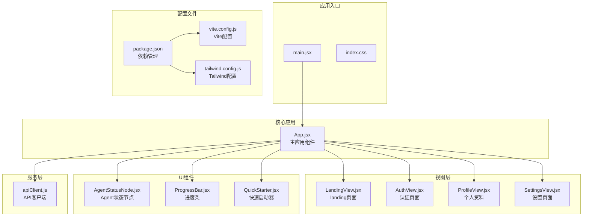
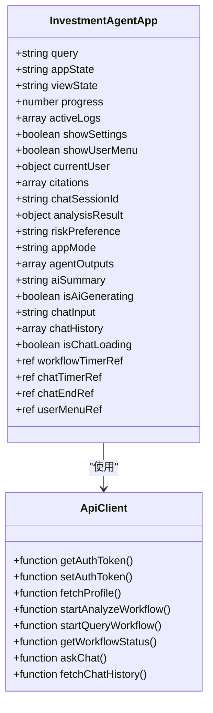
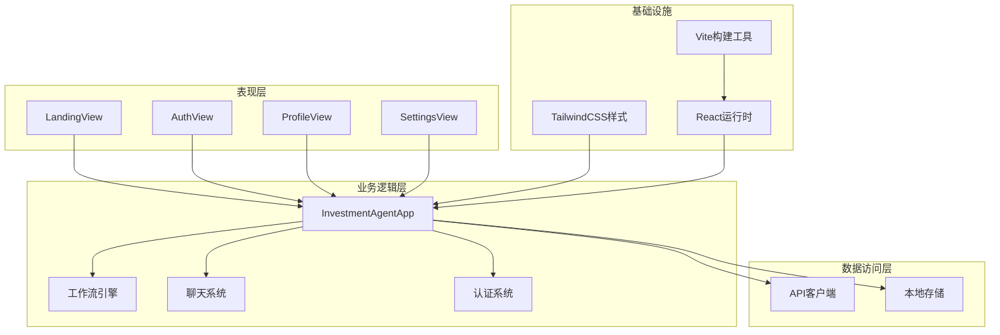
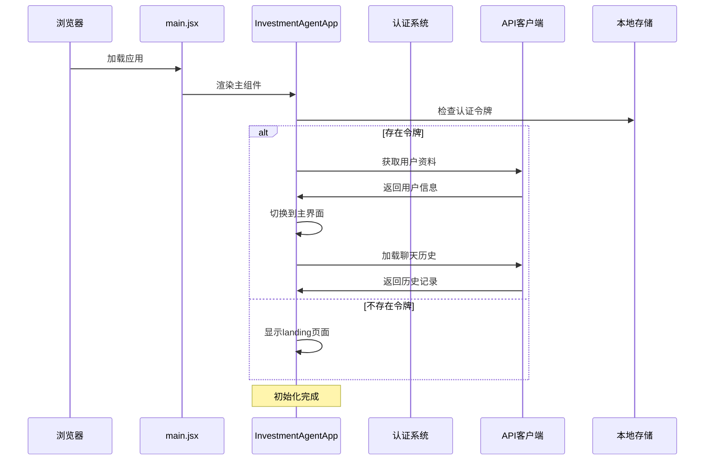
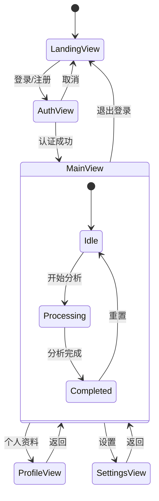
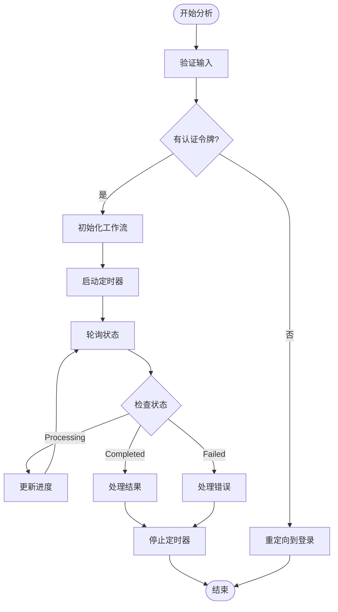
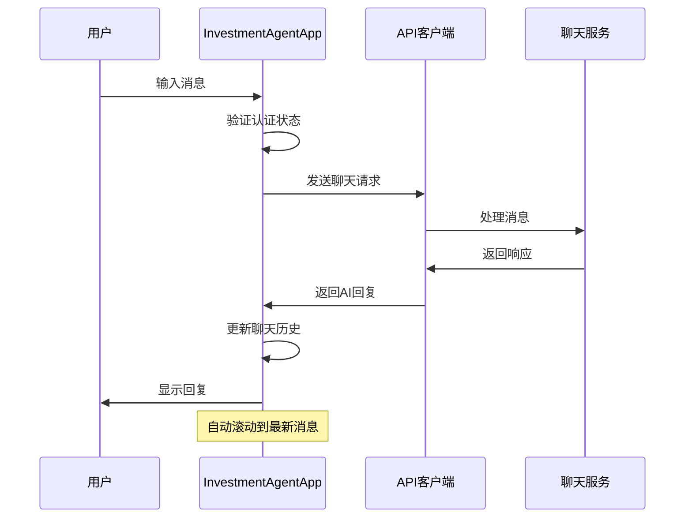
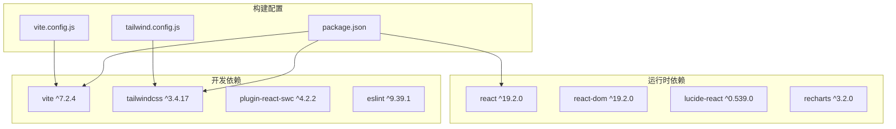
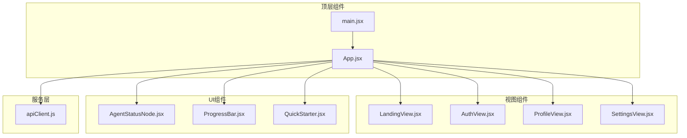

# 应用架构设计

<cite>
**本文档引用的文件**
- [App.jsx](file://src/web/src/App.jsx)
- [main.jsx](file://src/web/src/main.jsx)
- [apiClient.js](file://src/web/src/services/apiClient.js)
- [AuthView.jsx](file://src/web/src/components/views/AuthView.jsx)
- [LandingView.jsx](file://src/web/src/components/views/LandingView.jsx)
- [ProfileView.jsx](file://src/web/src/components/views/ProfileView.jsx)
- [SettingsView.jsx](file://src/web/src/components/views/SettingsView.jsx)
- [AgentStatusNode.jsx](file://src/web/src/components/ui/AgentStatusNode.jsx)
- [ProgressBar.jsx](file://src/web/src/components/ui/ProgressBar.jsx)
- [QuickStarter.jsx](file://src/web/src/components/ui/QuickStarter.jsx)
- [index.css](file://src/web/src/index.css)
- [package.json](file://src/web/package.json)
- [vite.config.js](file://src/web/vite.config.js)
- [tailwind.config.js](file://src/web/tailwind.config.js)
</cite>

## 目录
1. [简介](#简介)
2. [项目结构](#项目结构)
3. [核心组件](#核心组件)
4. [架构总览](#架构总览)
5. [详细组件分析](#详细组件分析)
6. [依赖关系分析](#依赖关系分析)
7. [性能考虑](#性能考虑)
8. [故障排除指南](#故障排除指南)
9. [结论](#结论)

## 简介
本项目是一个基于 React + Vite + TailwindCSS 的前端应用，采用现代化的前端技术栈构建。应用的核心功能围绕投资分析与AI辅助决策展开，包含完整的用户认证、会话管理、实时工作流状态跟踪以及交互式聊天功能。本文档将深入解析应用的整体架构设计，包括组件层次结构、状态管理模式、路由系统、视图切换机制以及初始化流程。

## 项目结构
应用采用清晰的分层组织结构，按照功能模块进行划分：

**图表来源**
- [main.jsx](file://src/web/src/main.jsx#L1-L11)
- [App.jsx](file://src/web/src/App.jsx#L1-L1085)
- [apiClient.js](file://src/web/src/services/apiClient.js#L1-L130)

**章节来源**
- [main.jsx](file://src/web/src/main.jsx#L1-L11)
- [package.json](file://src/web/package.json#L1-L33)

## 核心组件
应用的核心组件是 InvestmentAgentApp（App.jsx），它承担着以下关键职责：

### 主应用组件架构
主应用组件采用函数式组件设计，集成了多种状态管理和业务逻辑：

- **状态管理**：使用 useState 管理应用状态，包括查询输入、应用状态、视图状态、进度条、日志信息等
- **副作用处理**：通过 useEffect 处理认证初始化、点击外部关闭、自动滚动等功能
- **引用管理**：使用 useRef 管理定时器引用、DOM 引用等
- **工作流控制**：实现 AI 分析工作流的启动、监控和结果处理

### 关键状态类型
应用维护了多层次的状态结构：

**图表来源**
- [App.jsx](file://src/web/src/App.jsx#L26-L53)
- [apiClient.js](file://src/web/src/services/apiClient.js#L1-L130)

**章节来源**
- [App.jsx](file://src/web/src/App.jsx#L26-L53)

## 架构总览
应用采用模块化架构设计，实现了清晰的关注点分离：

**图表来源**
- [App.jsx](file://src/web/src/App.jsx#L648-L800)
- [apiClient.js](file://src/web/src/services/apiClient.js#L1-L130)

## 详细组件分析

### 初始化流程分析
应用的初始化流程遵循严格的顺序，确保用户体验的一致性：

**图表来源**
- [App.jsx](file://src/web/src/App.jsx#L54-L74)
- [apiClient.js](file://src/web/src/services/apiClient.js#L10-L18)

### 路由系统与视图切换
应用采用基于状态的路由系统，通过 viewState 控制不同视图的渲染：

**图表来源**
- [App.jsx](file://src/web/src/App.jsx#L665-L763)

### 状态管理模式
应用采用多种状态管理模式来处理不同类型的数据：

#### 1. 基础状态管理
使用 useState 管理简单状态，如用户输入、界面状态等：

**章节来源**
- [App.jsx](file://src/web/src/App.jsx#L27-L41)

#### 2. 副作用管理
通过 useEffect 处理异步操作和生命周期事件：

**章节来源**
- [App.jsx](file://src/web/src/App.jsx#L54-L74)
- [App.jsx](file://src/web/src/App.jsx#L161-L174)

#### 3. 引用管理
使用 useRef 管理定时器和 DOM 引用：

**章节来源**
- [App.jsx](file://src/web/src/App.jsx#L41-L53)

### 工作流状态跟踪
应用实现了复杂的工作流状态跟踪机制：

**图表来源**
- [App.jsx](file://src/web/src/App.jsx#L184-L269)

**章节来源**
- [App.jsx](file://src/web/src/App.jsx#L184-L269)

### 聊天系统架构
聊天系统提供了与AI模型的交互能力：

**图表来源**
- [App.jsx](file://src/web/src/App.jsx#L298-L325)
- [apiClient.js](file://src/web/src/services/apiClient.js#L117-L123)

**章节来源**
- [App.jsx](file://src/web/src/App.jsx#L298-L339)

## 依赖关系分析

### 技术栈依赖
应用的技术栈具有清晰的层次结构：

**图表来源**
- [package.json](file://src/web/package.json#L12-L31)
- [vite.config.js](file://src/web/vite.config.js#L1-L15)
- [tailwind.config.js](file://src/web/tailwind.config.js#L1-L9)

### 组件依赖关系
应用组件之间的依赖关系体现了良好的模块化设计：

**图表来源**
- [App.jsx](file://src/web/src/App.jsx#L1-L25)
- [main.jsx](file://src/web/src/main.jsx#L1-L11)

**章节来源**
- [App.jsx](file://src/web/src/App.jsx#L1-L25)

## 性能考虑
应用在性能方面采用了多项优化策略：

### 1. 状态更新优化
- 使用对象解构避免不必要的重新渲染
- 合理的依赖数组配置防止无限循环
- 及时清理定时器避免内存泄漏

### 2. 渲染优化
- 条件渲染减少DOM节点数量
- 使用CSS类名控制动画效果
- 合理的组件拆分提高复用性

### 3. API调用优化
- 批量API调用合并
- 适当的错误处理和重试机制
- 缓存策略避免重复请求

## 故障排除指南

### 常见问题诊断
1. **认证失败**
   - 检查本地存储中的token是否有效
   - 验证API端点的可达性
   - 确认网络连接状态

2. **工作流卡死**
   - 检查定时器是否正确清理
   - 验证API响应格式
   - 查看控制台错误信息

3. **聊天功能异常**
   - 确认会话ID的有效性
   - 检查网络请求状态
   - 验证AI服务可用性

### 调试技巧
- 使用浏览器开发者工具监控网络请求
- 在控制台输出关键状态变化
- 实施渐进式的功能测试

**章节来源**
- [App.jsx](file://src/web/src/App.jsx#L70-L74)
- [App.jsx](file://src/web/src/App.jsx#L255-L262)

## 结论
本应用展现了现代React应用的最佳实践，通过清晰的架构设计、合理的状态管理模式和完善的错误处理机制，构建了一个功能完整、性能优良的投资分析平台。应用采用的技术栈选择恰当，组件设计模块化程度高，为后续的功能扩展和维护奠定了坚实的基础。

应用的主要优势包括：
- 清晰的组件层次结构和职责分离
- 完善的状态管理和副作用处理
- 优雅的用户界面和交互体验
- 良好的性能优化和错误处理
- 现代化的开发工具链支持

这些设计原则和实践为类似的投资分析类应用提供了有价值的参考模板。