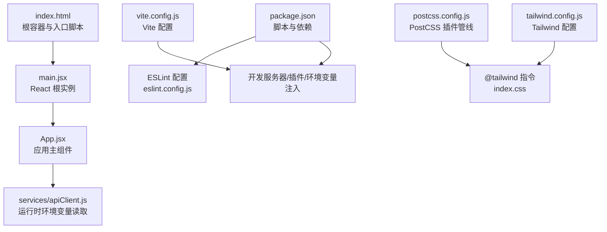
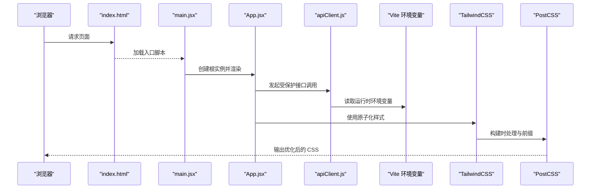
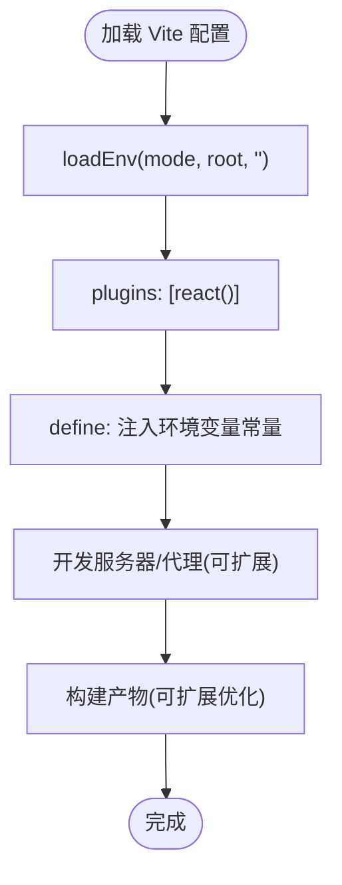
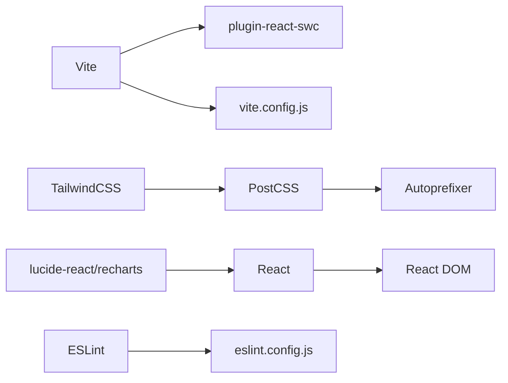

# 构建配置

<cite>
**本文引用的文件**
- [package.json](file://src/web/package.json)
- [vite.config.js](file://src/web/vite.config.js)
- [tailwind.config.js](file://src/web/tailwind.config.js)
- [postcss.config.js](file://src/web/postcss.config.js)
- [eslint.config.js](file://src/web/eslint.config.js)
- [index.html](file://src/web/index.html)
- [main.jsx](file://src/web/src/main.jsx)
- [App.jsx](file://src/web/src/App.jsx)
- [index.css](file://src/web/src/index.css)
- [App.css](file://src/web/src/App.css)
- [apiClient.js](file://src/web/src/services/apiClient.js)
- [.env.example](file://.env.example)
- [.env](file://.env)
</cite>

## 目录
1. [简介](#简介)
2. [项目结构](#项目结构)
3. [核心组件](#核心组件)
4. [架构总览](#架构总览)
5. [详细组件分析](#详细组件分析)
6. [依赖关系分析](#依赖关系分析)
7. [性能考量](#性能考量)
8. [故障排查指南](#故障排查指南)
9. [结论](#结论)
10. [附录](#附录)

## 简介
本文件聚焦于前端构建系统与配置管理，围绕 Vite 构建配置（开发服务器、代理、插件系统、构建优化）、package.json 依赖与脚本、TailwindCSS 主题与实用类、PostCSS 自动前缀与优化、以及开发/生产优化与部署实践进行系统化说明。内容严格基于仓库中的实际配置文件，帮助开发者快速理解并高效维护前端构建链路。

## 项目结构
前端工程位于 src/web 目录，采用 Vite 作为构建工具，React 作为视图层，TailwindCSS 提供样式基础，PostCSS 负责自动前缀与优化。入口 HTML 与 React 根节点在 src/web 下，样式通过 Tailwind 指令引入，ESLint 配置统一代码规范。

图表来源
- [index.html](file://src/web/index.html#L1-L14)
- [main.jsx](file://src/web/src/main.jsx#L1-L11)
- [App.jsx](file://src/web/src/App.jsx#L1-L800)
- [apiClient.js](file://src/web/src/services/apiClient.js#L1-L130)
- [vite.config.js](file://src/web/vite.config.js#L1-L15)
- [tailwind.config.js](file://src/web/tailwind.config.js#L1-L9)
- [postcss.config.js](file://src/web/postcss.config.js#L1-L7)
- [package.json](file://src/web/package.json#L1-L33)
- [eslint.config.js](file://src/web/eslint.config.js#L1-L30)

章节来源
- [package.json](file://src/web/package.json#L1-L33)
- [vite.config.js](file://src/web/vite.config.js#L1-L15)
- [tailwind.config.js](file://src/web/tailwind.config.js#L1-L9)
- [postcss.config.js](file://src/web/postcss.config.js#L1-L7)
- [eslint.config.js](file://src/web/eslint.config.js#L1-L30)
- [index.html](file://src/web/index.html#L1-L14)
- [main.jsx](file://src/web/src/main.jsx#L1-L11)
- [App.jsx](file://src/web/src/App.jsx#L1-L800)
- [index.css](file://src/web/src/index.css#L1-L14)
- [App.css](file://src/web/src/App.css#L1-L43)

## 核心组件
- Vite 构建配置：定义插件、环境变量注入、开发服务器行为（如代理）。
- TailwindCSS：内容扫描路径、主题扩展、插件启用。
- PostCSS：自动前缀与 TailwindCSS 集成。
- ESLint：推荐规则集与语言选项，确保一致的代码质量。
- package.json：脚本命令、依赖声明与版本管理。

章节来源
- [vite.config.js](file://src/web/vite.config.js#L1-L15)
- [tailwind.config.js](file://src/web/tailwind.config.js#L1-L9)
- [postcss.config.js](file://src/web/postcss.config.js#L1-L7)
- [eslint.config.js](file://src/web/eslint.config.js#L1-L30)
- [package.json](file://src/web/package.json#L1-L33)

## 架构总览
前端构建链路自上而下：入口 HTML 加载 main.jsx，React 初始化后渲染 App.jsx；运行时通过 import.meta.env 读取 Vite 注入的环境变量；样式由 Tailwind 指令驱动，PostCSS 在构建时自动添加浏览器前缀；ESLint 在开发阶段保障代码风格与安全规则。

图表来源
- [index.html](file://src/web/index.html#L1-L14)
- [main.jsx](file://src/web/src/main.jsx#L1-L11)
- [App.jsx](file://src/web/src/App.jsx#L1-L800)
- [apiClient.js](file://src/web/src/services/apiClient.js#L1-L130)
- [vite.config.js](file://src/web/vite.config.js#L1-L15)
- [tailwind.config.js](file://src/web/tailwind.config.js#L1-L9)
- [postcss.config.js](file://src/web/postcss.config.js#L1-L7)

## 详细组件分析

### Vite 构建配置
- 插件系统：启用 React 生态插件，提升开发体验与编译效率。
- 环境变量注入：通过 loadEnv 读取 .env 文件，将指定键注入到全局常量，便于运行时访问。
- 开发服务器：默认行为由 Vite 提供，可通过扩展配置实现代理、HTTPS、端口等。
- 构建优化：可结合产物分析与分包策略进一步优化。

图表来源
- [vite.config.js](file://src/web/vite.config.js#L1-L15)

章节来源
- [vite.config.js](file://src/web/vite.config.js#L1-L15)

### package.json 依赖与脚本
- 脚本命令：dev、build、lint、preview，分别对应开发、构建、代码检查与预览。
- 依赖分类：运行时依赖（React、UI 图标库、图表库）与开发依赖（Vite、React 插件、TailwindCSS、PostCSS、ESLint 及其插件）。
- 版本管理：遵循语义化版本，建议使用锁定文件与定期更新策略。

章节来源
- [package.json](file://src/web/package.json#L1-L33)

### TailwindCSS 配置与定制
- 内容扫描：仅扫描 HTML 与源码目录，避免无谓的样式扫描开销。
- 主题扩展：当前为空，可在 theme.extend 中按需扩展颜色、字体、间距等。
- 插件：当前为空，可接入官方或社区插件增强能力。
- 实用类：通过原子化类名实现样式复用与主题一致性。

章节来源
- [tailwind.config.js](file://src/web/tailwind.config.js#L1-L9)
- [index.css](file://src/web/src/index.css#L1-L14)

### PostCSS 处理流程
- 插件顺序：TailwindCSS → Autoprefixer，保证样式优先生成再补全前缀。
- 作用范围：构建时处理，减少运行时负担，提升首屏性能。

章节来源
- [postcss.config.js](file://src/web/postcss.config.js#L1-L7)

### ESLint 配置
- 规则集：基于推荐规则，启用 React Hooks 与 React Refresh 支持。
- 语言选项：模块化解析、JSX 支持与浏览器全局。
- 忽略规则：示例中对 dist 目录忽略，避免误报。

章节来源
- [eslint.config.js](file://src/web/eslint.config.js#L1-L30)

### 运行时环境变量与 API 客户端
- 环境变量：通过 import.meta.env 读取，例如 API 基础地址与第三方服务密钥。
- 客户端封装：集中处理鉴权头、错误处理与响应解析，降低重复逻辑。

章节来源
- [apiClient.js](file://src/web/src/services/apiClient.js#L1-L130)
- [vite.config.js](file://src/web/vite.config.js#L1-L15)

## 依赖关系分析
- Vite 与插件：Vite 依赖 @vitejs/plugin-react-swc 以加速 React 开发体验。
- TailwindCSS 与 PostCSS：TailwindCSS 与 Autoprefixer 通过 PostCSS 组合，形成稳定的样式管线。
- React 生态：React、React DOM、图标库与图表库共同构成界面层。
- Lint 工具链：ESLint 与其插件保障代码质量与一致性。

图表来源
- [package.json](file://src/web/package.json#L1-L33)
- [vite.config.js](file://src/web/vite.config.js#L1-L15)
- [postcss.config.js](file://src/web/postcss.config.js#L1-L7)
- [eslint.config.js](file://src/web/eslint.config.js#L1-L30)

章节来源
- [package.json](file://src/web/package.json#L1-L33)
- [vite.config.js](file://src/web/vite.config.js#L1-L15)
- [postcss.config.js](file://src/web/postcss.config.js#L1-L7)
- [eslint.config.js](file://src/web/eslint.config.js#L1-L30)

## 性能考量
- 代码分割：利用 Vite 的动态导入实现路由级或组件级懒加载，减少首屏体积。
- 构建优化：开启压缩与 Tree Shaking，合理拆分 vendor 与业务代码，提升缓存命中率。
- 资源优化：图片与字体按需加载，CSS 采用原子化与最小化策略。
- 缓存策略：静态资源采用长效缓存，HTML 与 JS 采用协商缓存或短缓存。
- 开发体验：热更新与快速冷启动，结合 ESLint 与格式化工具提升迭代速度。

## 故障排查指南
- 环境变量未生效
  - 确认 .env 文件键名与 Vite 注入的键一致，且在运行时通过 import.meta.env 读取。
  - 检查 vite.config.js 中 define 配置是否正确映射。
- 样式未生效或未按预期生成
  - 确认 Tailwind 指令存在于入口 CSS，并检查 tailwind.config.js 的 content 扫描路径。
  - 确保 PostCSS 插件顺序正确，先 Tailwind 后 Autoprefixer。
- ESLint 报错
  - 检查 eslint.config.js 的规则与语言选项，必要时调整忽略规则或新增规则。
- 构建失败或产物异常
  - 查看 Vite 插件与配置项，确认插件版本兼容性与配置正确性。

章节来源
- [vite.config.js](file://src/web/vite.config.js#L1-L15)
- [tailwind.config.js](file://src/web/tailwind.config.js#L1-L9)
- [postcss.config.js](file://src/web/postcss.config.js#L1-L7)
- [eslint.config.js](file://src/web/eslint.config.js#L1-L30)
- [apiClient.js](file://src/web/src/services/apiClient.js#L1-L130)

## 结论
本项目前端构建体系以 Vite 为核心，配合 React、TailwindCSS 与 PostCSS 形成高效、可维护的开发与构建链路。通过合理的环境变量注入、样式管线与代码规范，能够稳定支持开发与生产场景。建议在现有基础上逐步完善代理配置、构建优化与部署流水线，持续提升性能与可运维性。

## 附录
- 开发环境配置要点
  - 确保 .env 与 .env.example 中的键位一致，避免运行时缺失。
  - 在 vite.config.js 中按需扩展代理与开发服务器选项。
- 生产环境优化建议
  - 启用代码压缩与资源内联策略，合理拆分包体。
  - 使用长效缓存与版本化资源，提升 CDN 命中率。
- 部署与 CI/CD 集成
  - 在 CI 中固定依赖版本，执行 lint 与构建，上传构建产物至静态托管或容器镜像。
  - 将 .env 示例纳入仓库，生产环境通过平台变量注入。