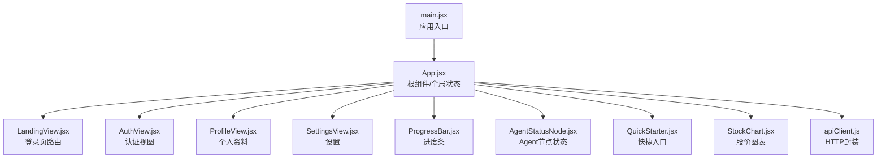
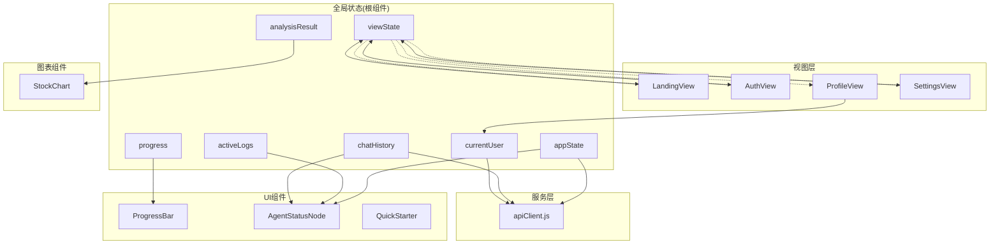
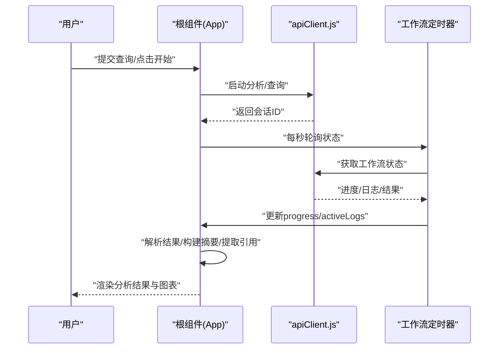
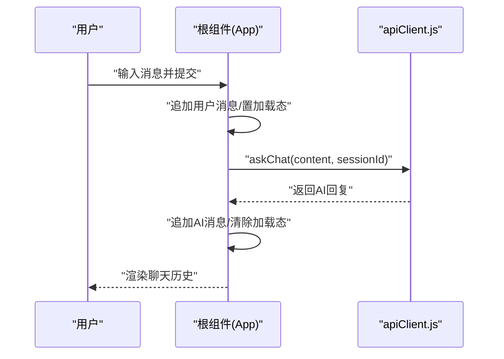
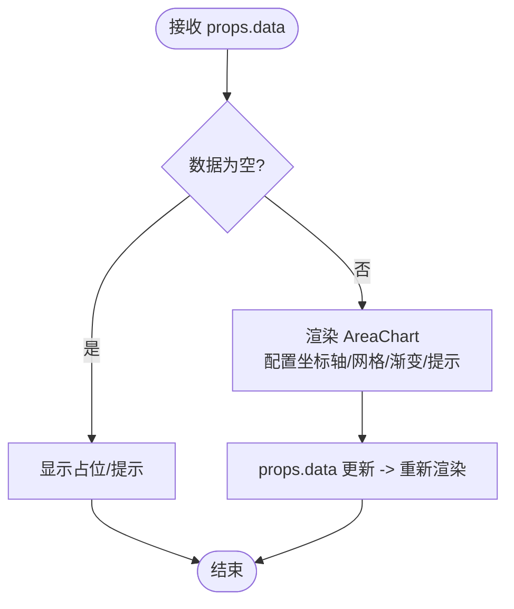
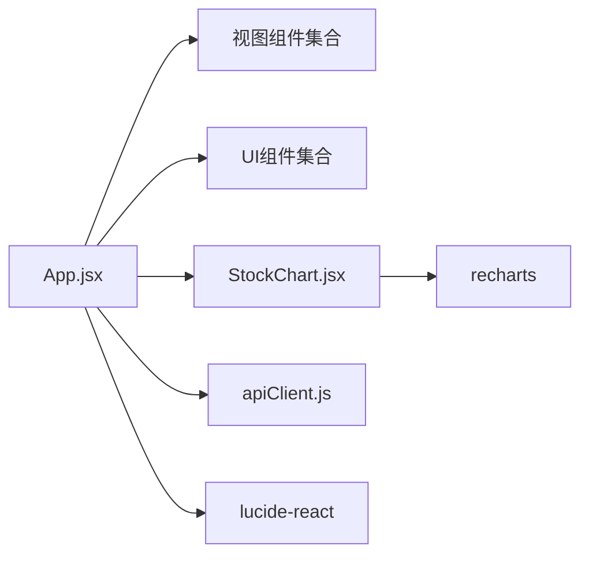

# 状态管理

<cite>
**本文引用的文件**
- [src/web/src/App.jsx](file://src/web/src/App.jsx)
- [src/web/src/main.jsx](file://src/web/src/main.jsx)
- [src/web/src/components/dashboard/StockChart.jsx](file://src/web/src/components/dashboard/StockChart.jsx)
- [src/web/src/components/ui/ProgressBar.jsx](file://src/web/src/components/ui/ProgressBar.jsx)
- [src/web/src/components/ui/AgentStatusNode.jsx](file://src/web/src/components/ui/AgentStatusNode.jsx)
- [src/web/src/components/ui/QuickStarter.jsx](file://src/web/src/components/ui/QuickStarter.jsx)
- [src/web/src/components/views/LandingView.jsx](file://src/web/src/components/views/LandingView.jsx)
- [src/web/src/components/views/AuthView.jsx](file://src/web/src/components/views/AuthView.jsx)
- [src/web/src/components/views/ProfileView.jsx](file://src/web/src/components/views/ProfileView.jsx)
- [src/web/src/components/views/SettingsView.jsx](file://src/web/src/components/views/SettingsView.jsx)
- [src/web/src/services/apiClient.js](file://src/web/src/services/apiClient.js)
- [src/web/package.json](file://src/web/package.json)
</cite>

## 目录
1. [简介](#简介)
2. [项目结构](#项目结构)
3. [核心组件](#核心组件)
4. [架构总览](#架构总览)
5. [详细组件分析](#详细组件分析)
6. [依赖分析](#依赖分析)
7. [性能考量](#性能考量)
8. [故障排查指南](#故障排查指南)
9. [结论](#结论)
10. [附录](#附录)

## 简介
本文件系统性梳理前端应用的状态管理策略与实现，聚焦以下方面：
- 全局状态管理：useState 使用模式、状态提升、父子组件通信
- 复杂状态组织：appState、viewState、progress、activeLogs 等
- 异步状态处理：工作流状态、聊天状态、加载状态
- 图表组件状态：StockChart 数据绑定、交互状态、实时更新
- 最佳实践：状态规范化、不可变性、性能优化、调试技巧
- 进阶主题：状态持久化、时间旅行调试、状态同步策略

## 项目结构
前端采用 Vite + React 架构，入口为 main.jsx，根组件为 App.jsx；页面视图由 LandingView、AuthView、ProfileView、SettingsView 组成；UI 组件包含 ProgressBar、AgentStatusNode、QuickStarter；图表组件为 StockChart；服务层通过 apiClient.js 封装 HTTP 请求。

**图表来源**
- [src/web/src/main.jsx](file://src/web/src/main.jsx#L1-L11)
- [src/web/src/App.jsx](file://src/web/src/App.jsx#L1-L120)
- [src/web/src/components/views/LandingView.jsx](file://src/web/src/components/views/LandingView.jsx#L1-L64)
- [src/web/src/components/views/AuthView.jsx](file://src/web/src/components/views/AuthView.jsx#L1-L160)
- [src/web/src/components/views/ProfileView.jsx](file://src/web/src/components/views/ProfileView.jsx#L1-L342)
- [src/web/src/components/views/SettingsView.jsx](file://src/web/src/components/views/SettingsView.jsx#L1-L40)
- [src/web/src/components/ui/ProgressBar.jsx](file://src/web/src/components/ui/ProgressBar.jsx#L1-L13)
- [src/web/src/components/ui/AgentStatusNode.jsx](file://src/web/src/components/ui/AgentStatusNode.jsx#L1-L17)
- [src/web/src/components/ui/QuickStarter.jsx](file://src/web/src/components/ui/QuickStarter.jsx#L1-L15)
- [src/web/src/components/dashboard/StockChart.jsx](file://src/web/src/components/dashboard/StockChart.jsx#L1-L79)
- [src/web/src/services/apiClient.js](file://src/web/src/services/apiClient.js#L1-L130)

**章节来源**
- [src/web/src/main.jsx](file://src/web/src/main.jsx#L1-L11)
- [src/web/src/App.jsx](file://src/web/src/App.jsx#L1-L120)
- [src/web/package.json](file://src/web/package.json#L1-L33)

## 核心组件
本节聚焦全局状态的定义与使用模式，以及父子组件间的状态传递与回调。

- 全局状态声明（根组件）
  - 查询输入与工作流控制：query、appState、progress、analysisResult、riskPreference、appMode、agentOutputs
  - 视图状态：viewState、showSettings、showUserMenu
  - 用户与会话：currentUser、chatSessionId、citations
  - 聊天与AI：aiSummary、isAiGenerating、chatInput、chatHistory、isChatLoading
  - 引用与定时器：workflowTimerRef、chatTimerRef、chatEndRef、userMenuRef

- 状态提升与父子通信
  - LandingView/AuthView/ProfileView/SettingsView 通过 setViewState 在根组件中切换视图
  - AuthView 通过 onAuthSuccess 回调在成功后设置 token、用户信息并进入主界面
  - QuickStarter 通过 handleQuickStart 将预设文本写入 query，触发分析流程
  - ProfileView 通过 onProfileUpdated 回调更新 currentUser

- 状态提升示例路径
  - [视图切换与用户菜单](file://src/web/src/App.jsx#L662-L665)
  - [登录成功回调](file://src/web/src/components/views/AuthView.jsx#L20-L37)
  - [快捷入口写入查询](file://src/web/src/App.jsx#L646-L648)
  - [资料更新回调](file://src/web/src/components/views/ProfileView.jsx#L109-L111)

**章节来源**
- [src/web/src/App.jsx](file://src/web/src/App.jsx#L26-L52)
- [src/web/src/App.jsx](file://src/web/src/App.jsx#L646-L665)
- [src/web/src/components/views/AuthView.jsx](file://src/web/src/components/views/AuthView.jsx#L20-L37)
- [src/web/src/components/views/ProfileView.jsx](file://src/web/src/components/views/ProfileView.jsx#L109-L111)

## 架构总览
下图展示前端状态在根组件中的集中式管理，以及与视图、UI 组件、图表组件和服务层的交互关系。

**图表来源**
- [src/web/src/App.jsx](file://src/web/src/App.jsx#L26-L52)
- [src/web/src/App.jsx](file://src/web/src/App.jsx#L662-L665)
- [src/web/src/components/ui/ProgressBar.jsx](file://src/web/src/components/ui/ProgressBar.jsx#L1-L13)
- [src/web/src/components/ui/AgentStatusNode.jsx](file://src/web/src/components/ui/AgentStatusNode.jsx#L1-L17)
- [src/web/src/components/ui/QuickStarter.jsx](file://src/web/src/components/ui/QuickStarter.jsx#L1-L15)
- [src/web/src/components/dashboard/StockChart.jsx](file://src/web/src/components/dashboard/StockChart.jsx#L1-L79)
- [src/web/src/services/apiClient.js](file://src/web/src/services/apiClient.js#L1-L130)

## 详细组件分析

### 全局状态与工作流状态管理
- 状态组织
  - appState：驱动主分析流程的总体状态（idle/processing/completed）
  - viewState：控制视图路由（landing/login/register/main/profile/settings）
  - progress：工作流进度百分比
  - activeLogs：工作流步骤日志列表，用于可视化与阶段推导
  - analysisResult：最终分析结果对象
  - agentOutputs：各 Agent 输出聚合
- 工作流推进机制
  - 启动分析时清空历史状态，启动轮询获取状态与日志，根据状态更新进度与日志
  - 完成后解析结果、构建摘要、提取引用、更新各 Agent 输出
- 关键实现路径
  - [启动分析与轮询](file://src/web/src/App.jsx#L184-L269)
  - [日志格式化与阶段推导](file://src/web/src/App.jsx#L96-L158)
  - [结果解析与摘要构建](file://src/web/src/App.jsx#L341-L381)

**图表来源**
- [src/web/src/App.jsx](file://src/web/src/App.jsx#L184-L269)
- [src/web/src/services/apiClient.js](file://src/web/src/services/apiClient.js#L85-L103)

**章节来源**
- [src/web/src/App.jsx](file://src/web/src/App.jsx#L96-L158)
- [src/web/src/App.jsx](file://src/web/src/App.jsx#L184-L269)
- [src/web/src/App.jsx](file://src/web/src/App.jsx#L341-L381)
- [src/web/src/services/apiClient.js](file://src/web/src/services/apiClient.js#L85-L103)

### 聊天状态与异步加载
- 聊天状态
  - chatInput：用户输入
  - chatHistory：消息历史（含用户与AI）
  - isChatLoading：聊天请求加载态
  - chatSessionId：会话标识
- 加载与错误处理
  - 发送消息时追加用户消息，置 isChatLoading，调用 askChat 获取回复，失败时回退错误消息
  - 历史加载：fetchChatHistory 拉取最近对话
- 关键实现路径
  - [发送消息与加载态](file://src/web/src/App.jsx#L298-L325)
  - [加载历史](file://src/web/src/App.jsx#L327-L339)
  - [apiClient 聊天接口](file://src/web/src/services/apiClient.js#L117-L129)

**图表来源**
- [src/web/src/App.jsx](file://src/web/src/App.jsx#L298-L325)
- [src/web/src/services/apiClient.js](file://src/web/src/services/apiClient.js#L117-L129)

**章节来源**
- [src/web/src/App.jsx](file://src/web/src/App.jsx#L298-L339)
- [src/web/src/services/apiClient.js](file://src/web/src/services/apiClient.js#L117-L129)

### 图表组件状态管理（StockChart）
- 数据绑定
  - 接收 data 属性作为图表数据源，内部使用 recharts AreaChart/Area/XAxis/YAxis/Tooltip
- 交互状态
  - 自定义 Tooltip 展示价格与时间标签
  - 响应式容器 ResponsiveContainer 适配不同屏幕尺寸
- 实时更新
  - 当父组件传入新的 data 时，图表自动重新渲染
- 关键实现路径
  - [StockChart 组件](file://src/web/src/components/dashboard/StockChart.jsx#L26-L79)

**图表来源**
- [src/web/src/components/dashboard/StockChart.jsx](file://src/web/src/components/dashboard/StockChart.jsx#L26-L79)

**章节来源**
- [src/web/src/components/dashboard/StockChart.jsx](file://src/web/src/components/dashboard/StockChart.jsx#L26-L79)

### UI 组件与状态
- ProgressBar：接收 progress 并渲染进度条宽度
- AgentStatusNode：根据状态（active/done/pending）切换样式与图标
- QuickStarter：点击回调写入查询内容，触发分析
- 关键实现路径
  - [ProgressBar](file://src/web/src/components/ui/ProgressBar.jsx#L1-L13)
  - [AgentStatusNode](file://src/web/src/components/ui/AgentStatusNode.jsx#L1-L17)
  - [QuickStarter](file://src/web/src/components/ui/QuickStarter.jsx#L1-L15)

**章节来源**
- [src/web/src/components/ui/ProgressBar.jsx](file://src/web/src/components/ui/ProgressBar.jsx#L1-L13)
- [src/web/src/components/ui/AgentStatusNode.jsx](file://src/web/src/components/ui/AgentStatusNode.jsx#L1-L17)
- [src/web/src/components/ui/QuickStarter.jsx](file://src/web/src/components/ui/QuickStarter.jsx#L1-L15)

### 视图层状态与路由
- LandingView：提供登录/注册入口，切换 viewState
- AuthView：登录/注册表单，提交后调用 onAuthSuccess 设置 token 与用户信息
- ProfileView/SettingsView：切换 viewState，并在 Profile 中支持资料更新回调
- 关键实现路径
  - [LandingView 视图切换](file://src/web/src/components/views/LandingView.jsx#L16-L28)
  - [AuthView 登录/注册与回调](file://src/web/src/components/views/AuthView.jsx#L15-L37)
  - [ProfileView 编辑与回调](file://src/web/src/components/views/ProfileView.jsx#L50-L118)

**章节来源**
- [src/web/src/components/views/LandingView.jsx](file://src/web/src/components/views/LandingView.jsx#L16-L28)
- [src/web/src/components/views/AuthView.jsx](file://src/web/src/components/views/AuthView.jsx#L15-L37)
- [src/web/src/components/views/ProfileView.jsx](file://src/web/src/components/views/ProfileView.jsx#L50-L118)

## 依赖分析
- 组件耦合
  - 根组件集中持有全局状态，视图与 UI 组件通过 props 与回调进行解耦
  - Chart 与 UI 组件仅消费数据，不直接持有全局状态
- 外部依赖
  - recharts：用于 StockChart 数据可视化
  - lucide-react：图标库
- 关键实现路径
  - [依赖声明](file://src/web/package.json#L12-L17)

**图表来源**
- [src/web/package.json](file://src/web/package.json#L12-L17)
- [src/web/src/App.jsx](file://src/web/src/App.jsx#L1-L25)
- [src/web/src/components/dashboard/StockChart.jsx](file://src/web/src/components/dashboard/StockChart.jsx#L1-L11)

**章节来源**
- [src/web/package.json](file://src/web/package.json#L12-L17)

## 性能考量
- 不可变性与浅拷贝
  - 聊天历史更新采用展开语法拼接，避免直接修改原数组
  - 日志与进度更新通过 setState 替换，减少深层变更
  - 路径参考：[聊天历史更新](file://src/web/src/App.jsx#L307-L320)
- 定时器清理
  - useEffect 返回清理函数，确保组件卸载时停止轮询
  - 路径参考：[定时器清理](file://src/web/src/App.jsx#L70-L74)
- 渲染优化
  - 将计算逻辑（如摘要构建、日志格式化）集中在根组件，减少子组件重复计算
  - 图表组件仅依赖 props.data，避免内部状态导致的无效重渲染
  - 路径参考：[StockChart 数据绑定](file://src/web/src/components/dashboard/StockChart.jsx#L26-L79)

[本节提供一般性指导，无需特定文件引用]

## 故障排查指南
- 认证与用户信息
  - 若登录后无法进入主界面，检查 onAuthSuccess 是否正确设置 token 与用户信息
  - 路径参考：[登录回调](file://src/web/src/components/views/AuthView.jsx#L20-L37)
- 工作流状态异常
  - 若进度条不动或日志不更新，检查轮询定时器是否被清理，以及 getWorkflowStatus 返回值
  - 路径参考：[轮询与状态更新](file://src/web/src/App.jsx#L217-L263)
- 聊天加载失败
  - 若发送消息后无响应，检查 askChat 返回值与 isChatLoading 状态
  - 路径参考：[聊天提交](file://src/web/src/App.jsx#L298-L325)
- 图表无数据
  - 确认父组件传入的 data 非空且结构符合 recharts 要求
  - 路径参考：[StockChart 数据接收](file://src/web/src/components/dashboard/StockChart.jsx#L26-L79)

**章节来源**
- [src/web/src/components/views/AuthView.jsx](file://src/web/src/components/views/AuthView.jsx#L20-L37)
- [src/web/src/App.jsx](file://src/web/src/App.jsx#L217-L263)
- [src/web/src/App.jsx](file://src/web/src/App.jsx#L298-L325)
- [src/web/src/components/dashboard/StockChart.jsx](file://src/web/src/components/dashboard/StockChart.jsx#L26-L79)

## 结论
本项目采用集中式全局状态管理模式，通过根组件统一管理 appState、viewState、progress、activeLogs、chatHistory、analysisResult 等关键状态，并以 props 与回调的方式在视图与 UI 组件之间传递。工作流与聊天均采用定时轮询与异步请求相结合的方式，配合不可变更新与定时器清理，保证了状态的一致性与性能。图表组件通过数据绑定实现解耦与复用。建议在现有基础上引入状态持久化与时间旅行调试，进一步增强开发体验与问题定位能力。

[本节为总结性内容，无需特定文件引用]

## 附录

### 状态管理最佳实践清单
- 状态规范化
  - 将日志、引用、聊天记录等扁平化存储，便于缓存与更新
- 不可变性
  - 使用展开语法或浅拷贝更新数组/对象，避免直接修改引用
- 性能优化
  - 将昂贵计算移至根组件或使用 useMemo/useCallback
  - 合理拆分组件，避免不必要的重渲染
- 调试技巧
  - 使用浏览器开发者工具断点观察状态变化
  - 对关键状态打印日志（开发环境）
- 状态持久化与同步
  - 使用 localStorage/sessionStorage 持久化轻量状态（如用户偏好）
  - 对于复杂状态，可采用 IndexedDB 或服务端同步
- 时间旅行调试
  - 在开发环境引入简易时间旅行（回放/快进），仅限本地开发

[本节为通用指导，无需特定文件引用]