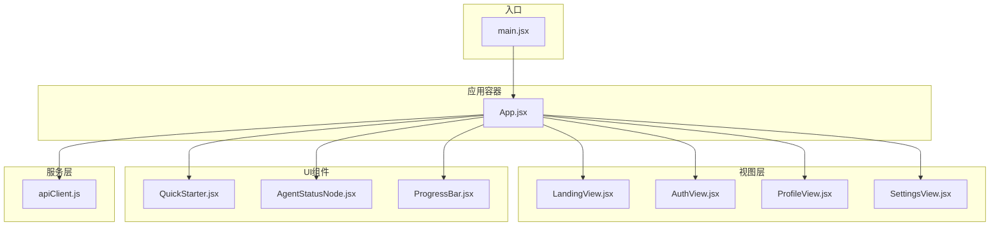
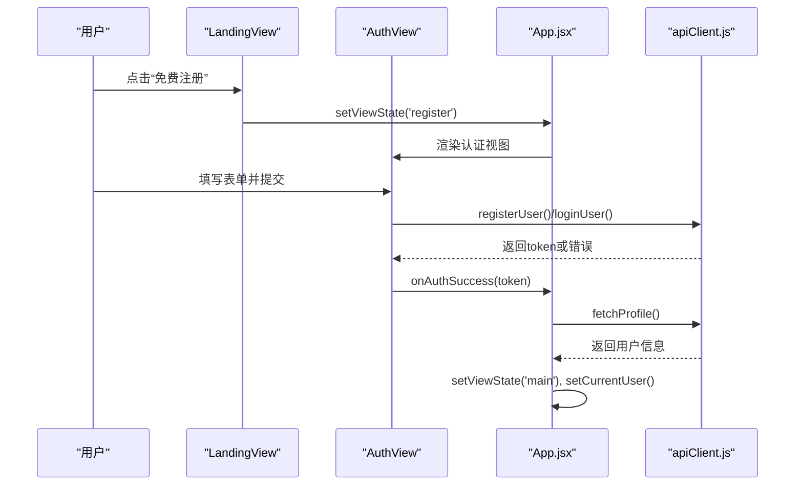
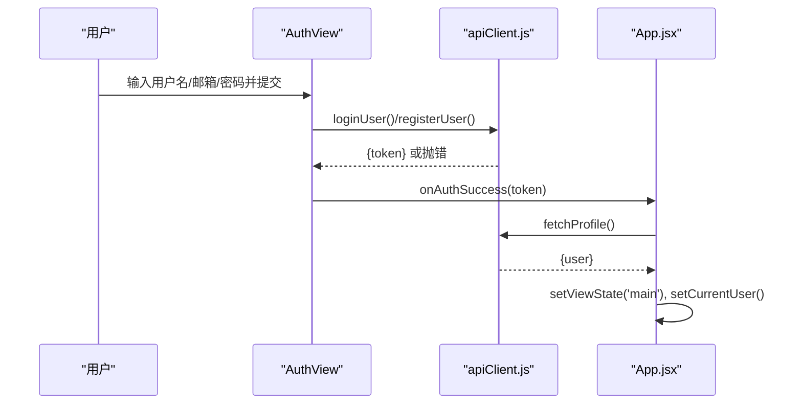
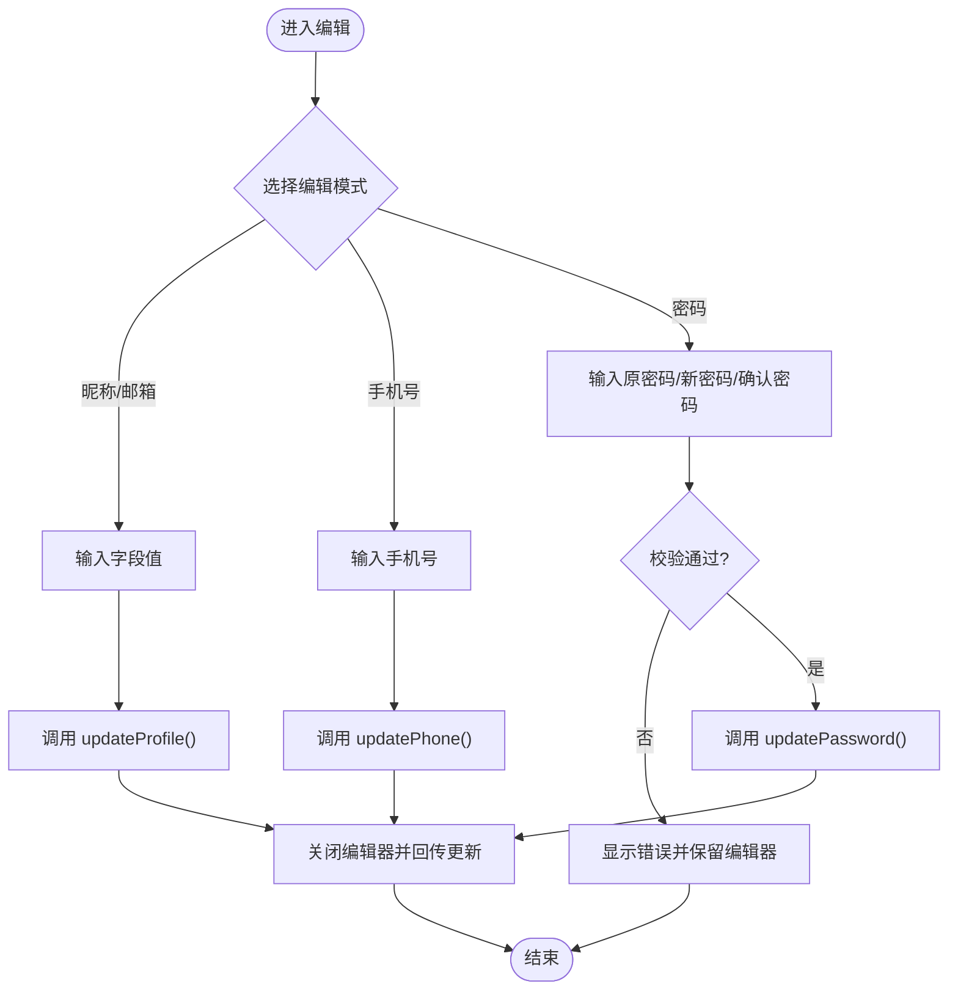
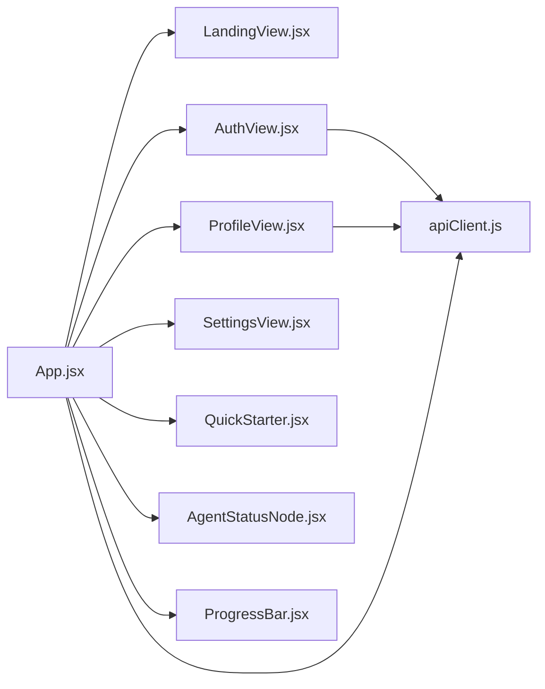

# 视图系统

<cite>
**本文引用的文件**
- [LandingView.jsx](file://src/web/src/components/views/LandingView.jsx)
- [AuthView.jsx](file://src/web/src/components/views/AuthView.jsx)
- [ProfileView.jsx](file://src/web/src/components/views/ProfileView.jsx)
- [SettingsView.jsx](file://src/web/src/components/views/SettingsView.jsx)
- [App.jsx](file://src/web/src/App.jsx)
- [main.jsx](file://src/web/src/main.jsx)
- [apiClient.js](file://src/web/src/services/apiClient.js)
- [QuickStarter.jsx](file://src/web/src/components/ui/QuickStarter.jsx)
- [AgentStatusNode.jsx](file://src/web/src/components/ui/AgentStatusNode.jsx)
- [ProgressBar.jsx](file://src/web/src/components/ui/ProgressBar.jsx)
</cite>

## 目录
1. [简介](#简介)
2. [项目结构](#项目结构)
3. [核心组件](#核心组件)
4. [架构总览](#架构总览)
5. [详细组件分析](#详细组件分析)
6. [依赖关系分析](#依赖关系分析)
7. [性能考量](#性能考量)
8. [故障排查指南](#故障排查指南)
9. [结论](#结论)

## 简介
本文件系统性梳理前端视图层的设计与实现，聚焦以下页面视图：
- LandingView 首页（landing）：背景特效、欢迎标语、视觉引导
- AuthView 认证视图（login/register）：登录/注册表单、表单验证、错误处理、用户反馈
- ProfileView 个人资料视图：用户信息展示、编辑功能、数据更新
- SettingsView 设置视图：配置选项、偏好设置、主题切换（示意）

并阐述视图间的导航机制（状态管理、路由控制、数据传递）、视图生命周期管理、性能优化与用户体验设计原则。

## 项目结构
视图系统位于 src/web/src/components/views 下，配合 App.jsx 作为顶层容器，main.jsx 作为入口挂载点。服务层通过 apiClient.js 封装 HTTP 请求与鉴权令牌管理。

图表来源
- [main.jsx](file://src/web/src/main.jsx#L1-L11)
- [App.jsx](file://src/web/src/App.jsx#L670-L1113)
- [LandingView.jsx](file://src/web/src/components/views/LandingView.jsx#L1-L64)
- [AuthView.jsx](file://src/web/src/components/views/AuthView.jsx#L1-L160)
- [ProfileView.jsx](file://src/web/src/components/views/ProfileView.jsx#L1-L342)
- [SettingsView.jsx](file://src/web/src/components/views/SettingsView.jsx#L1-L40)
- [apiClient.js](file://src/web/src/services/apiClient.js#L1-L130)

章节来源
- [main.jsx](file://src/web/src/main.jsx#L1-L11)
- [App.jsx](file://src/web/src/App.jsx#L670-L1113)

## 核心组件
- LandingView：首页视图，负责品牌展示、导航按钮与视觉引导，通过 setViewState 切换至登录/注册视图。
- AuthView：认证视图，支持登录/注册两种模式，内置表单字段与错误提示，提交后调用 apiClient 并回调 App.jsx 完成鉴权与跳转。
- ProfileView：个人资料视图，展示用户信息，支持昵称/邮箱/手机号/密码的分项编辑与保存，调用 apiClient 更新并回传给 App.jsx。
- SettingsView：设置视图，当前包含隐私与安全开关示意，未来可扩展更多配置项。
- App.jsx：顶层状态容器，维护 viewState、currentUser、聊天与分析流程状态，统一渲染不同视图并处理导航与数据流。
- apiClient.js：封装鉴权令牌、用户资料与工作流接口，统一错误处理与响应解析。

章节来源
- [LandingView.jsx](file://src/web/src/components/views/LandingView.jsx#L1-L64)
- [AuthView.jsx](file://src/web/src/components/views/AuthView.jsx#L1-L160)
- [ProfileView.jsx](file://src/web/src/components/views/ProfileView.jsx#L1-L342)
- [SettingsView.jsx](file://src/web/src/components/views/SettingsView.jsx#L1-L40)
- [App.jsx](file://src/web/src/App.jsx#L26-L74)
- [apiClient.js](file://src/web/src/services/apiClient.js#L1-L130)

## 架构总览
视图系统采用“状态驱动 + 事件回调”的模式：
- App.jsx 维护全局状态（viewState、currentUser、聊天/分析状态），根据状态决定渲染哪个视图。
- LandingView/AuthView 通过 setViewState 与 onAuthSuccess 与 App.jsx 通信。
- ProfileView 通过 onProfileUpdated 将更新后的用户信息回传 App.jsx。
- apiClient.js 统一处理鉴权头、错误抛出与响应解析，供各视图调用。

图表来源
- [LandingView.jsx](file://src/web/src/components/views/LandingView.jsx#L16-L27)
- [AuthView.jsx](file://src/web/src/components/views/AuthView.jsx#L15-L37)
- [App.jsx](file://src/web/src/App.jsx#L689-L705)
- [apiClient.js](file://src/web/src/services/apiClient.js#L43-L83)

## 详细组件分析

### LandingView 首页视图
- 设计要点
  - 导航栏：品牌图标与名称、登录/注册按钮，点击触发 setViewState 切换。
  - 英雄区：渐入动画标题与描述，强调产品价值主张。
  - 行动按钮：强调“立即开始使用”，带动画与阴影增强交互感。
  - 底部版权：简洁信息，提升品牌识别。
- 背景特效
  - App.jsx 在根容器中引入全局背景层，包含网格纹理、顶部红色光晕与右下暖色光晕，营造科技感氛围。
- 视觉引导
  - 动画序列：标题、描述、按钮按延迟依次入场，形成节奏感。
  - 按钮悬停：颜色与阴影变化，提供明确反馈。

章节来源
- [LandingView.jsx](file://src/web/src/components/views/LandingView.jsx#L1-L64)
- [App.jsx](file://src/web/src/App.jsx#L673-L681)

### AuthView 认证视图
- 表单设计
  - 用户名/邮箱/密码字段，带图标与占位符，必填校验。
  - 登录/注册模式切换：通过 viewState 决定显示与提交行为。
- 表单验证与错误处理
  - 提交前禁用按钮，加载态显示旋转指示器。
  - 捕获异常并显示错误消息，避免静默失败。
- 用户反馈
  - 成功后通过 onAuthSuccess 回调，App.jsx 写入 token、拉取用户资料并进入主界面。
- 数据传递
  - 登录：loginUser(username, password)
  - 注册：registerUser(username, email, password, nickname)

图表来源
- [AuthView.jsx](file://src/web/src/components/views/AuthView.jsx#L15-L37)
- [apiClient.js](file://src/web/src/services/apiClient.js#L43-L83)
- [App.jsx](file://src/web/src/App.jsx#L689-L705)

章节来源
- [AuthView.jsx](file://src/web/src/components/views/AuthView.jsx#L1-L160)
- [apiClient.js](file://src/web/src/services/apiClient.js#L43-L83)
- [App.jsx](file://src/web/src/App.jsx#L689-L705)

### ProfileView 个人资料视图
- 展示与编辑
  - 左侧头像占位与基本信息卡片，右侧账户信息列表，每项支持“修改”触发弹窗编辑。
  - 支持昵称、邮箱、手机号、密码四类编辑，分别进行字段级校验与保存。
- 编辑流程
  - 打开编辑器：openEditor(mode) 设置 editMode 并聚焦对应输入框。
  - 保存：handleSave 根据 editMode 调用 updateProfile/updatePhone/updatePassword，捕获错误并提示。
  - 关闭：closeEditor 清空错误并关闭弹窗。
- 数据更新与回传
  - 更新成功后合并用户对象并调用 onProfileUpdated，App.jsx 通过 setCurrentUser 同步状态。

图表来源
- [ProfileView.jsx](file://src/web/src/components/views/ProfileView.jsx#L50-L118)
- [apiClient.js](file://src/web/src/services/apiClient.js#L61-L83)

章节来源
- [ProfileView.jsx](file://src/web/src/components/views/ProfileView.jsx#L1-L342)
- [apiClient.js](file://src/web/src/services/apiClient.js#L61-L83)

### SettingsView 设置视图
- 当前实现
  - 隐私与安全模块，包含“数据分享”开关示意，便于后续扩展更多配置项。
- 扩展建议
  - 主题切换：浅色/深色模式，持久化到本地存储并在 App.jsx 初始化时读取。
  - 偏好设置：风险偏好、运行模式、通知偏好等，统一通过 apiClient 更新用户配置。

章节来源
- [SettingsView.jsx](file://src/web/src/components/views/SettingsView.jsx#L1-L40)

## 依赖关系分析
- 视图到容器
  - LandingView/AuthView/ProfileView/SettingsView 均由 App.jsx 通过 viewState 控制渲染。
- 视图到服务
  - AuthView/ProfileView 依赖 apiClient.js 进行认证与用户资料操作。
- 容器到服务
  - App.jsx 在初始化与分析流程中多次调用 apiClient.js。
- UI组件
  - QuickStarter、AgentStatusNode、ProgressBar 作为通用 UI 组件被 App.jsx 使用。

图表来源
- [App.jsx](file://src/web/src/App.jsx#L683-L783)
- [AuthView.jsx](file://src/web/src/components/views/AuthView.jsx#L1-L160)
- [ProfileView.jsx](file://src/web/src/components/views/ProfileView.jsx#L1-L342)
- [SettingsView.jsx](file://src/web/src/components/views/SettingsView.jsx#L1-L40)
- [apiClient.js](file://src/web/src/services/apiClient.js#L1-L130)
- [QuickStarter.jsx](file://src/web/src/components/ui/QuickStarter.jsx#L1-L15)
- [AgentStatusNode.jsx](file://src/web/src/components/ui/AgentStatusNode.jsx#L1-L17)
- [ProgressBar.jsx](file://src/web/src/components/ui/ProgressBar.jsx#L1-L13)

章节来源
- [App.jsx](file://src/web/src/App.jsx#L683-L783)
- [apiClient.js](file://src/web/src/services/apiClient.js#L1-L130)

## 性能考量
- 渲染优化
  - 使用动画入场（fade-in/slide-in）与延迟序列，避免一次性大量 DOM 渲染。
  - ProfileView 编辑弹窗采用固定定位与 backdrop-blur，减少主视图重绘。
- 状态管理
  - App.jsx 集中管理 viewState、currentUser、聊天/分析状态，降低跨组件通信成本。
- 请求与错误
  - apiClient.js 统一处理响应与错误，避免重复 try/catch。
- 加载与反馈
  - AuthView/ProfileView 在提交时禁用按钮并显示加载指示，提升可用性。
- 可访问性
  - 表单字段具备占位符与必填标识，按钮提供 hover/focus 状态反馈。

## 故障排查指南
- 认证失败
  - 现象：AuthView 显示错误消息。
  - 排查：检查 apiClient.js 中的请求路径与响应结构，确认后端返回的错误字段是否被正确读取。
- 用户资料更新失败
  - 现象：ProfileView 弹窗显示错误。
  - 排查：核对 updateProfile/updatePhone/updatePassword 的参数与后端接口签名，确保 token 已注入。
- 鉴权失效
  - 现象：App.jsx 初始化时无法获取用户资料。
  - 排查：确认本地 token 是否存在，fetchProfile 是否抛错；必要时清除 token 并回到 landing。
- 导航异常
  - 现象：点击按钮后未切换视图。
  - 排查：确认 setViewState 的调用与 viewState 的渲染分支逻辑一致。

章节来源
- [AuthView.jsx](file://src/web/src/components/views/AuthView.jsx#L116-L120)
- [ProfileView.jsx](file://src/web/src/components/views/ProfileView.jsx#L113-L117)
- [App.jsx](file://src/web/src/App.jsx#L54-L74)
- [apiClient.js](file://src/web/src/services/apiClient.js#L20-L41)

## 结论
本视图系统以 App.jsx 为核心，围绕 LandingView/AuthView/ProfileView/SettingsView 构建清晰的导航与数据流。通过统一的服务层封装与状态驱动渲染，实现了良好的用户体验与可维护性。建议后续在 SettingsView 中完善主题与偏好设置，并在 ProfileView 中增加更细粒度的校验与国际化支持，持续提升易用性与可扩展性。