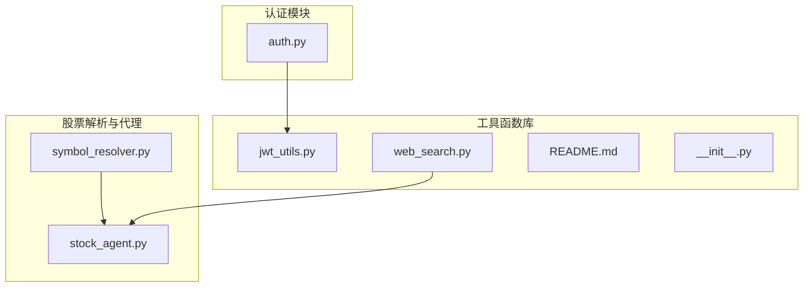
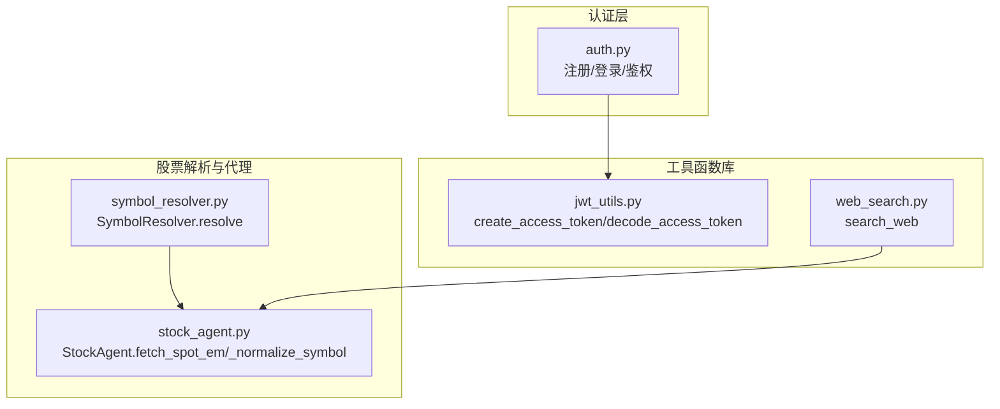
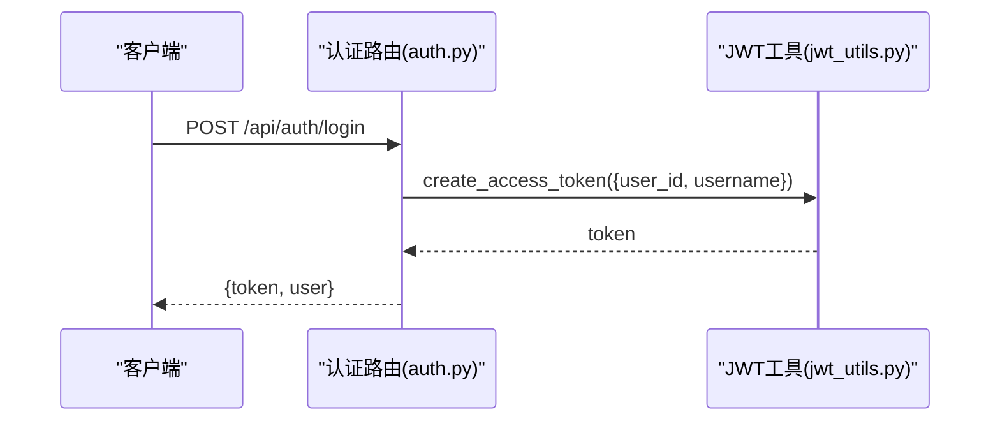
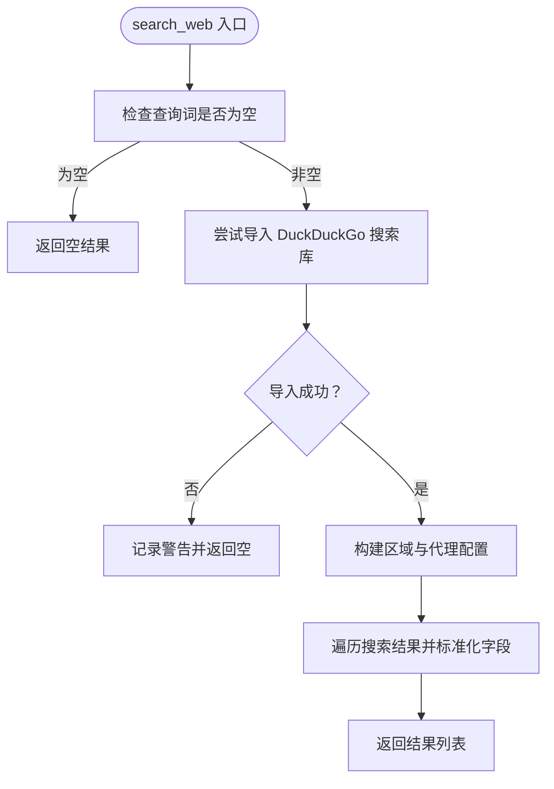
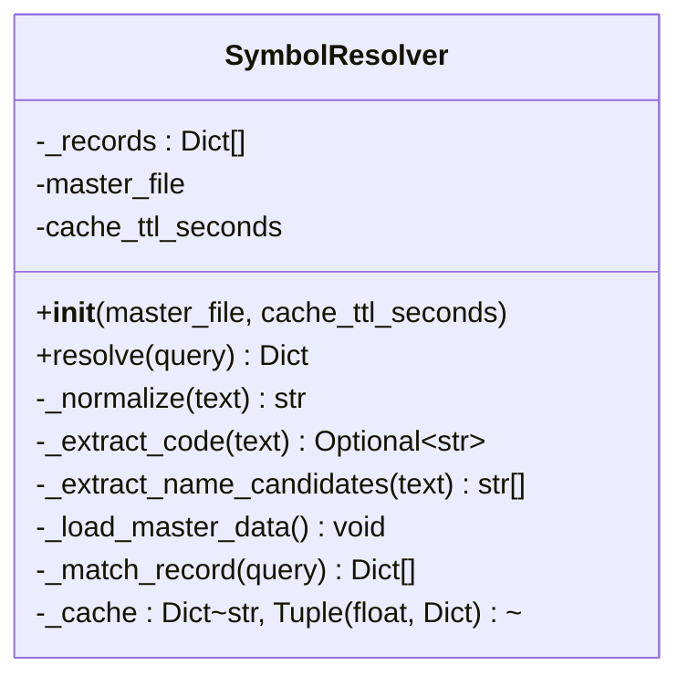
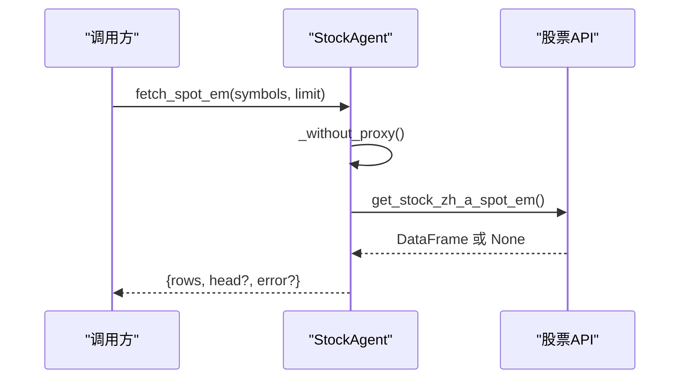
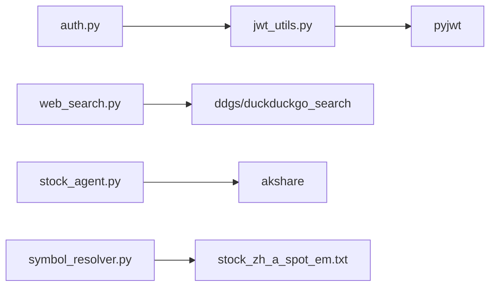

# 工具函数库

<cite>
**本文引用的文件**
- [src/utils/README.md](file://src/utils/README.md)
- [src/utils/__init__.py](file://src/utils/__init__.py)
- [src/utils/jwt_utils.py](file://src/utils/jwt_utils.py)
- [src/utils/web_search.py](file://src/utils/web_search.py)
- [src/utils/test/test_web_search.py](file://src/utils/test/test_web_search.py)
- [.env.example](file://.env.example)
- [src/api/auth.py](file://src/api/auth.py)
- [src/api/main.py](file://src/api/main.py)
- [src/agent/symbol_resolver.py](file://src/agent/symbol_resolver.py)
- [src/agent/stock_agent.py](file://src/agent/stock_agent.py)
- [src/agent/test/test_symbol_resolver.py](file://src/agent/test/test_symbol_resolver.py)
- [requirements.txt](file://requirements.txt)
</cite>

## 目录
1. [简介](#简介)
2. [项目结构](#项目结构)
3. [核心组件](#核心组件)
4. [架构概览](#架构概览)
5. [详细组件分析](#详细组件分析)
6. [依赖分析](#依赖分析)
7. [性能考虑](#性能考虑)
8. [故障排查指南](#故障排查指南)
9. [结论](#结论)
10. [附录](#附录)

## 简介
本文件系统性梳理工具函数库的设计与实现，重点覆盖以下方面：
- JWT 工具函数：令牌生成、验证与解码，结合认证模块的使用方式
- 联网搜索工具：基于 DuckDuckGo 的搜索封装，支持区域与代理控制
- 符号解析工具：股票代码解析、市场识别与格式标准化，结合股票 Agent 的回退策略
- 使用示例与最佳实践：错误处理、性能优化与安全注意事项
- 扩展指南：如何新增工具函数与自定义开发方法

工具函数库位于后端模块 src/utils 中，配合认证模块 src/api/auth.py 与股票解析模块 src/agent/symbol_resolver.py、src/agent/stock_agent.py 协同工作。

## 项目结构
工具函数库主要由以下文件组成：
- src/utils/jwt_utils.py：JWT 生成与解码
- src/utils/web_search.py：联网搜索封装（支持区域与代理控制）
- src/utils/README.md：模块说明与使用指引
- src/utils/test/test_web_search.py：搜索工具测试脚本
- src/utils/__init__.py：模块初始化（当前为空）

图表来源
- [src/utils/jwt_utils.py](file://src/utils/jwt_utils.py#L1-L36)
- [src/utils/web_search.py](file://src/utils/web_search.py#L1-L80)
- [src/api/auth.py](file://src/api/auth.py#L1-L136)
- [src/agent/symbol_resolver.py](file://src/agent/symbol_resolver.py#L1-L244)
- [src/agent/stock_agent.py](file://src/agent/stock_agent.py#L1-L200)

章节来源
- [src/utils/README.md](file://src/utils/README.md#L1-L22)
- [src/utils/__init__.py](file://src/utils/__init__.py#L1-L1)

## 核心组件
- JWT 工具函数：提供访问令牌生成与解码，用于用户登录态管理
- 联网搜索工具：封装 DuckDuckGo 搜索，支持区域设置与代理控制
- 符号解析工具：从用户查询中提取股票代码，优先使用本地主数据，回退至在线接口
- 股票代理工具：统一股票代码格式，兼容多种输入形式；提供历史与实时行情获取

章节来源
- [src/utils/jwt_utils.py](file://src/utils/jwt_utils.py#L18-L36)
- [src/utils/web_search.py](file://src/utils/web_search.py#L39-L80)
- [src/agent/symbol_resolver.py](file://src/agent/symbol_resolver.py#L190-L244)
- [src/agent/stock_agent.py](file://src/agent/stock_agent.py#L170-L207)

## 架构概览
工具函数库与认证、股票解析、股票代理之间的交互如下：

图表来源
- [src/api/auth.py](file://src/api/auth.py#L18-L136)
- [src/utils/jwt_utils.py](file://src/utils/jwt_utils.py#L18-L36)
- [src/utils/web_search.py](file://src/utils/web_search.py#L39-L80)
- [src/agent/symbol_resolver.py](file://src/agent/symbol_resolver.py#L190-L244)
- [src/agent/stock_agent.py](file://src/agent/stock_agent.py#L170-L207)

## 详细组件分析

### JWT 工具函数
- 功能概述
  - 生成访问令牌：向载荷追加过期时间并使用密钥签名
  - 解码访问令牌：验证签名与有效期，异常时返回空
- 关键点
  - 默认密钥来自环境变量，生产环境需替换
  - 默认过期时间为 7 天
  - 使用 HS256 算法
- 与认证模块的集成
  - 注册/登录成功后生成令牌并返回给客户端
  - 鉴权中间件通过 Authorization 头提取令牌并解码，查询用户信息

图表来源
- [src/api/auth.py](file://src/api/auth.py#L78-L118)
- [src/utils/jwt_utils.py](file://src/utils/jwt_utils.py#L18-L26)

章节来源
- [src/utils/jwt_utils.py](file://src/utils/jwt_utils.py#L13-L36)
- [src/api/auth.py](file://src/api/auth.py#L57-L101)
- [.env.example](file://.env.example#L1-L3)

### 联网搜索工具
- 功能概述
  - 使用 DuckDuckGo 搜索引擎进行网络检索
  - 支持区域设置与代理控制，避免地区偏差
  - 返回标题、链接、摘要等结构化结果
- 关键点
  - 优先尝试 ddgs 包，其次 duckduckgo_search 包
  - 支持通过环境变量禁用代理与设置区域
  - 异常时记录日志并返回空列表
- 使用示例
  - 在测试脚本中演示了不同区域与代理配置下的调用方式

图表来源
- [src/utils/web_search.py](file://src/utils/web_search.py#L39-L80)

章节来源
- [src/utils/web_search.py](file://src/utils/web_search.py#L39-L80)
- [src/utils/test/test_web_search.py](file://src/utils/test/test_web_search.py#L19-L32)

### 符号解析工具
- 功能概述
  - 从用户查询中解析股票代码，优先使用本地主数据
  - 支持显式代码直接匹配与模糊候选匹配
  - 提供缓存机制与评分排序，避免重复解析
- 关键点
  - 本地主数据来源于 A 股实时行情文件，自动去重与清洗
  - 支持拼音与别名匹配，提升识别准确率
  - 若本地未命中，回退至在线接口（由股票代理模块负责）
- 与股票代理的关系
  - 解析出的代码经股票代理统一格式化，兼容多种输入形式
  - 若解析失败，股票代理可尝试在线接口获取候选

图表来源
- [src/agent/symbol_resolver.py](file://src/agent/symbol_resolver.py#L18-L244)

章节来源
- [src/agent/symbol_resolver.py](file://src/agent/symbol_resolver.py#L190-L244)
- [src/agent/test/test_symbol_resolver.py](file://src/agent/test/test_symbol_resolver.py#L19-L37)

### 股票代理工具
- 功能概述
  - 统一股票代码格式：去除前缀与后缀，保留 6 位数字
  - 提供历史与实时行情获取，具备多数据源回退策略
  - 支持代理控制，避免网络限制导致的数据缺失
- 关键点
  - 实时行情接口：优先使用本地主数据，回退至在线接口
  - 历史行情接口：按数据源降级回退（东方财富 -> 腾讯 -> 新浪）
  - 日志记录与错误处理，便于定位问题

图表来源
- [src/agent/stock_agent.py](file://src/agent/stock_agent.py#L184-L207)

章节来源
- [src/agent/stock_agent.py](file://src/agent/stock_agent.py#L170-L207)

## 依赖分析
- 工具函数库依赖
  - JWT 工具：pyjwt、环境变量
  - 联网搜索：ddgs 或 duckduckgo_search
- 认证模块依赖
  - JWT 工具：用于生成与解码访问令牌
  - 数据库：用户模型与密码哈希
- 股票解析与代理依赖
  - 股票数据接口：akshare
  - 本地主数据文件：A 股实时行情文本

图表来源
- [requirements.txt](file://requirements.txt#L23-L40)
- [src/utils/jwt_utils.py](file://src/utils/jwt_utils.py#L8-L11)
- [src/utils/web_search.py](file://src/utils/web_search.py#L54-L60)
- [src/api/auth.py](file://src/api/auth.py#L12-L13)
- [src/agent/stock_agent.py](file://src/agent/stock_agent.py#L19-L27)
- [src/agent/symbol_resolver.py](file://src/agent/symbol_resolver.py#L22-L27)

章节来源
- [requirements.txt](file://requirements.txt#L1-L40)

## 性能考虑
- JWT 工具
  - 使用 HS256 算法，性能开销低；密钥长度建议足够长以增强安全性
  - 建议在生产环境启用 HTTPS，避免令牌在传输中被截获
- 联网搜索
  - 代理禁用可减少地区偏差，但可能增加请求失败概率；根据场景选择
  - 结果数量与区域设置会影响响应时间，建议按需调整
- 符号解析
  - 本地主数据加载一次即可，缓存 TTL 控制解析频率
  - 候选匹配采用评分排序，避免全量扫描
- 股票代理
  - 多数据源回退策略提升成功率，但会增加网络请求次数
  - 代理控制可避免网络限制，但可能引入额外延迟

## 故障排查指南
- JWT 工具
  - 现象：解码失败返回空
  - 排查：确认密钥一致、算法正确、令牌未过期
  - 参考路径：[src/utils/jwt_utils.py](file://src/utils/jwt_utils.py#L29-L36)
- 联网搜索
  - 现象：搜索不可用或失败
  - 排查：检查 ddgs/duckduckgo_search 是否安装；查看日志；尝试禁用代理
  - 参考路径：[src/utils/web_search.py](file://src/utils/web_search.py#L54-L60)
- 符号解析
  - 现象：解析不到代码或返回空
  - 排查：确认本地主数据文件存在且格式正确；检查候选提取逻辑
  - 参考路径：[src/agent/symbol_resolver.py](file://src/agent/symbol_resolver.py#L84-L130)
- 股票代理
  - 现象：实时/历史数据为空或报错
  - 排查：检查代理配置；确认 akshare 可用；查看回退链路日志
  - 参考路径：[src/agent/stock_agent.py](file://src/agent/stock_agent.py#L129-L168)

章节来源
- [src/utils/jwt_utils.py](file://src/utils/jwt_utils.py#L29-L36)
- [src/utils/web_search.py](file://src/utils/web_search.py#L54-L78)
- [src/agent/symbol_resolver.py](file://src/agent/symbol_resolver.py#L84-L130)
- [src/agent/stock_agent.py](file://src/agent/stock_agent.py#L129-L168)

## 结论
工具函数库提供了简洁高效的通用能力：
- JWT 工具确保认证安全与便捷
- 联网搜索工具支持灵活的区域与代理配置
- 符号解析工具结合本地主数据与在线接口，兼顾准确性与稳定性
- 股票代理工具提供统一的代码格式化与多数据源回退策略

建议在生产环境中：
- 替换默认密钥并启用 HTTPS
- 合理设置代理与区域参数
- 优化缓存与回退策略，平衡准确率与性能

## 附录

### 使用示例与最佳实践
- JWT 使用
  - 生成令牌：在注册/登录成功后调用生成访问令牌
  - 验证令牌：在受保护接口中从 Authorization 头提取并解码
  - 参考路径：[src/api/auth.py](file://src/api/auth.py#L57-L101)
- 联网搜索
  - 设置区域与代理：通过环境变量控制
  - 处理异常：捕获异常并记录日志，返回空结果
  - 参考路径：[src/utils/web_search.py](file://src/utils/web_search.py#L63-L78)
- 符号解析
  - 优先使用本地主数据：减少对外部接口依赖
  - 回退策略：解析失败时尝试在线接口
  - 参考路径：[src/agent/symbol_resolver.py](file://src/agent/symbol_resolver.py#L190-L244)
- 股票代理
  - 统一代码格式：使用代理工具规范化输入
  - 多数据源回退：提升数据获取成功率
  - 参考路径：[src/agent/stock_agent.py](file://src/agent/stock_agent.py#L170-L207)

### 安全性注意事项
- JWT 密钥：生产环境必须使用强密钥并通过环境变量注入
- 传输安全：启用 HTTPS，防止令牌与敏感数据泄露
- 输入校验：对用户输入进行清洗与校验，避免注入与歧义
- 日志脱敏：避免在日志中打印敏感信息

### 扩展指南与自定义开发
- 新增工具函数
  - 在 src/utils 下新增模块，遵循现有命名与注释规范
  - 明确输入输出类型与异常处理
  - 添加单元测试与使用示例
- 自定义搜索接口
  - 在 web_search.py 中扩展搜索库支持或添加新的区域配置
  - 保持与现有代理控制机制一致
- 自定义解析规则
  - 在 symbol_resolver.py 中扩展正则表达式与匹配逻辑
  - 优化评分与缓存策略，提升解析准确率

章节来源
- [src/utils/README.md](file://src/utils/README.md#L1-L22)
- [src/utils/test/test_web_search.py](file://src/utils/test/test_web_search.py#L19-L32)
- [src/agent/test/test_symbol_resolver.py](file://src/agent/test/test_symbol_resolver.py#L19-L37)