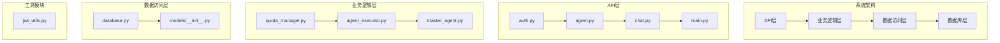
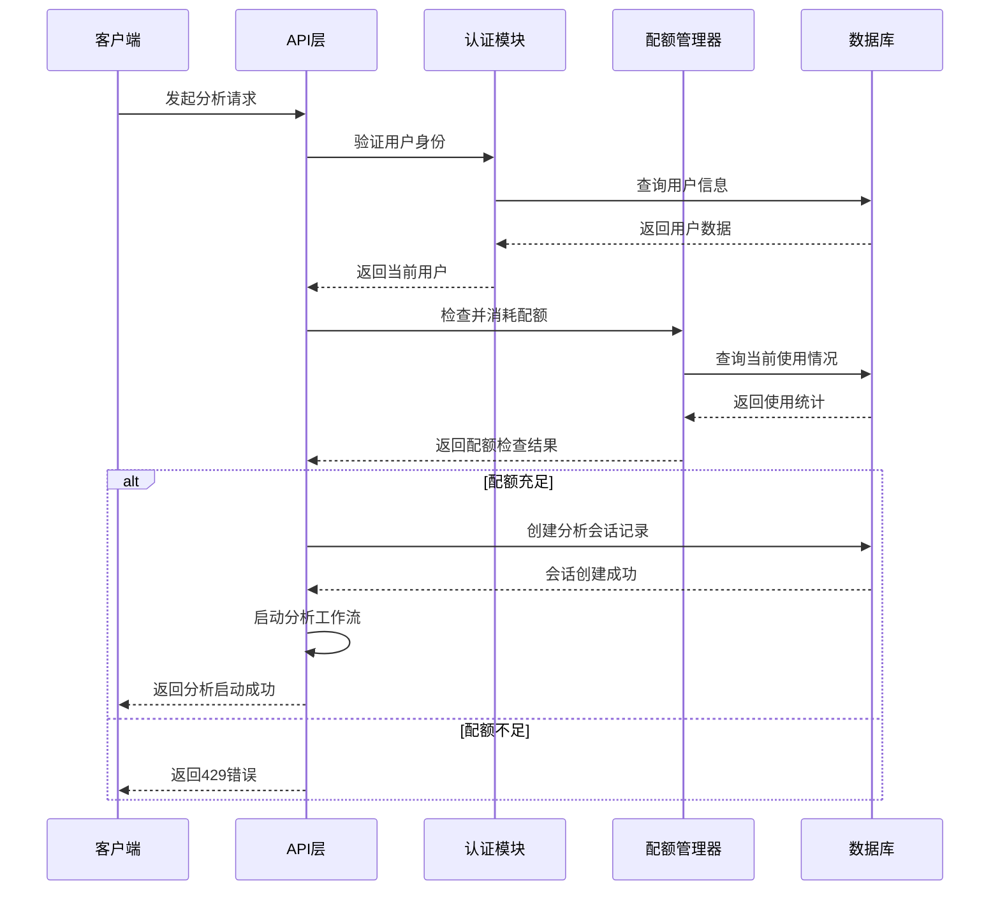
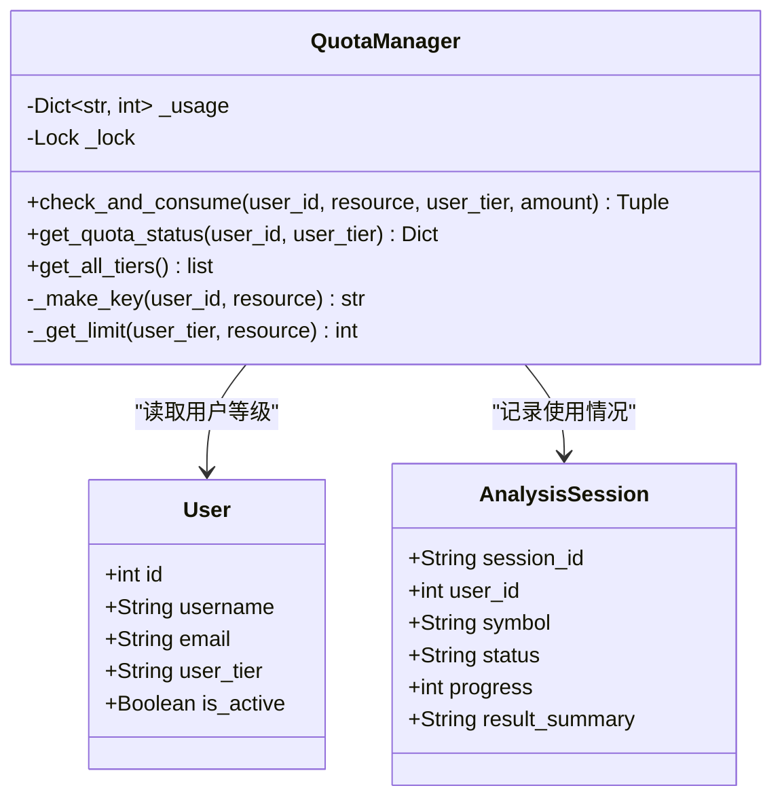
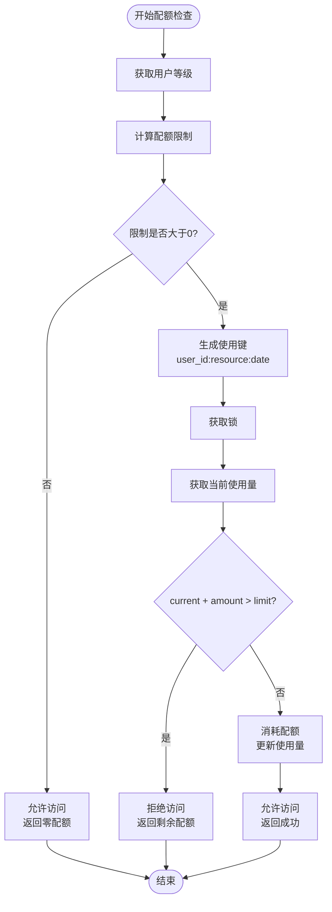
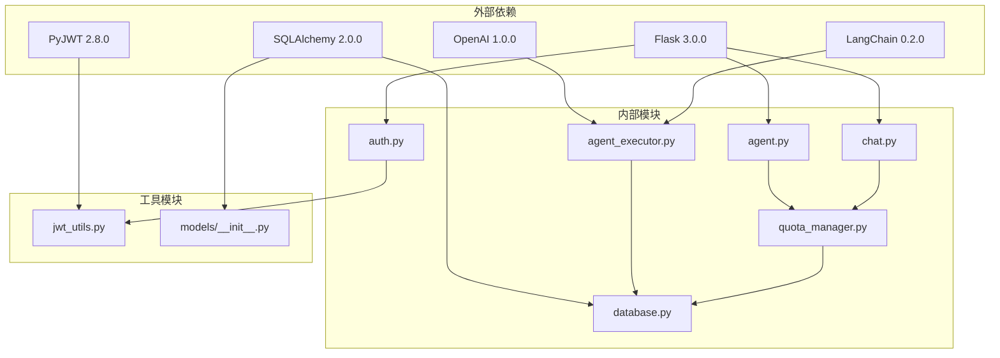

# 配额管理系统

<cite>
**本文档引用的文件**
- [quota_manager.py](file://src/utils/quota_manager.py)
- [database.py](file://src/models/database.py)
- [main.py](file://src/api/main.py)
- [auth.py](file://src/api/auth.py)
- [agent.py](file://src/api/agent.py)
- [chat.py](file://src/api/chat.py)
- [agent_executor.py](file://src/api/agent_executor.py)
- [jwt_utils.py](file://src/utils/jwt_utils.py)
- [models/__init__.py](file://src/models/__init__.py)
- [run.py](file://run.py)
- [requirements.txt](file://requirements.txt)
- [README.md](file://README.md)
- [DESIGN.md](file://DESIGN.md)
</cite>

## 目录
1. [简介](#简介)
2. [项目结构](#项目结构)
3. [核心组件](#核心组件)
4. [架构概览](#架构概览)
5. [详细组件分析](#详细组件分析)
6. [依赖关系分析](#依赖关系分析)
7. [性能考量](#性能考量)
8. [故障排除指南](#故障排除指南)
9. [结论](#结论)

## 简介

配额管理系统是AI投资分析系统中的核心功能模块，负责管理用户的每日使用配额，支持免费版、专业版和旗舰版三种用户等级。该系统采用基于内存的每日配额控制机制，结合数据库持久化存储，为用户提供分级的使用权限管理。

系统主要功能包括：
- 用户等级管理（free/pro/premium）
- 每日配额控制（analysis_per_day/chat_per_day）
- 实时配额检查和消耗
- 配额状态查询
- 用户升级管理

## 项目结构

**图表来源**
- [main.py:40-314](file://src/api/main.py#L40-L314)
- [quota_manager.py:47-139](file://src/utils/quota_manager.py#L47-L139)
- [database.py:24-87](file://src/models/database.py#L24-L87)

**章节来源**
- [README.md:24-40](file://README.md#L24-L40)
- [run.py:1-60](file://run.py#L1-L60)

## 核心组件

### 配额管理器 (QuotaManager)

配额管理器是系统的核心组件，采用单例模式设计，提供线程安全的配额管理功能。

**主要特性：**
- 基于内存的配额存储
- 每日配额重置机制
- 线程安全的并发访问
- 支持三种用户等级
- 实时配额检查和消耗

**配额配置：**
- 免费版：每日5次分析，20次聊天
- 专业版：每日30次分析，100次聊天  
- 旗舰版：每日100次分析，500次聊天

**章节来源**
- [quota_manager.py:47-139](file://src/utils/quota_manager.py#L47-L139)

### 数据模型

系统使用SQLAlchemy ORM框架定义数据模型，包含用户、聊天历史、分析会话和Agent日志等核心实体。

**用户模型 (User)：**
- 用户基本信息（用户名、邮箱、昵称等）
- 用户等级字段（user_tier）
- 激活状态管理

**分析会话模型 (AnalysisSession)：**
- 会话状态跟踪（pending/processing/completed/failed）
- 进度管理和结果存储
- 查询内容和股票代码关联

**章节来源**
- [database.py:24-87](file://src/models/database.py#L24-L87)

## 架构概览

**图表来源**
- [agent.py:58-132](file://src/api/agent.py#L58-L132)
- [quota_manager.py:64-105](file://src/utils/quota_manager.py#L64-L105)
- [auth.py:123-138](file://src/api/auth.py#L123-L138)

## 详细组件分析

### 配额管理器类结构

**图表来源**
- [quota_manager.py:47-139](file://src/utils/quota_manager.py#L47-L139)
- [database.py:24-72](file://src/models/database.py#L24-L72)

### 配额检查流程

**图表来源**
- [quota_manager.py:64-105](file://src/utils/quota_manager.py#L64-L105)

### API集成点

系统在多个API端点中集成了配额管理功能：

**分析API集成：**
- `/api/agent/analyze` - 股票分析配额检查
- `/api/agent/query` - 通用查询配额检查

**聊天API集成：**
- `/api/chat/ask` - 简短问答配额检查

**用户管理集成：**
- `/api/user/quota` - 配额状态查询
- `/api/user/tiers` - 等级信息查询
- `/api/user/upgrade` - 用户升级

**章节来源**
- [agent.py:80-88](file://src/api/agent.py#L80-L88)
- [chat.py:184-188](file://src/api/chat.py#L184-L188)
- [main.py:256-273](file://src/api/main.py#L256-L273)

## 依赖关系分析

**图表来源**
- [requirements.txt:1-41](file://requirements.txt#L1-L41)
- [main.py:22-29](file://src/api/main.py#L22-L29)

**章节来源**
- [requirements.txt:1-41](file://requirements.txt#L1-L41)
- [DESIGN.md:115-129](file://DESIGN.md#L115-L129)

## 性能考量

### 线程安全性
- 使用threading.Lock确保并发访问的安全性
- 内存中的配额状态在多线程环境下保持一致性

### 配额存储策略
- 采用内存存储提高访问速度
- 每日自动重置配额，无需复杂的数据库操作

### 数据库集成
- 用户等级信息存储在数据库中
- 分析会话和聊天历史持久化存储

### 扩展性考虑
- 支持动态添加新的配额类型
- 可配置的用户等级和配额限制
- 易于扩展到月度或其他周期的配额管理

## 故障排除指南

### 常见问题及解决方案

**配额检查失败**
- 检查用户是否存在且激活
- 验证JWT令牌的有效性
- 确认用户等级字段正确设置

**并发访问冲突**
- 确保使用线程安全的配额管理器实例
- 检查锁机制是否正常工作
- 监控高并发场景下的性能表现

**数据库连接问题**
- 验证DATABASE_URL环境变量配置
- 检查数据库连接池设置
- 确认表结构正确初始化

**章节来源**
- [auth.py:123-138](file://src/api/auth.py#L123-L138)
- [models/__init__.py:40-53](file://src/models/__init__.py#L40-L53)

## 结论

配额管理系统通过简洁而高效的架构设计，为AI投资分析系统提供了可靠的用户使用控制机制。系统采用内存+数据库的混合存储策略，在保证性能的同时实现了灵活的配额管理。

**主要优势：**
- 简洁的单例模式设计
- 线程安全的并发访问
- 灵活的等级和配额配置
- 与现有API架构无缝集成

**未来改进方向：**
- 添加配额审计日志功能
- 支持更复杂的配额类型（如月度配额）
- 实现配额预警和通知机制
- 增强配额统计和分析功能

该系统为AI投资分析平台的商业化运营奠定了坚实的技术基础，能够有效控制资源使用并为不同用户群体提供差异化服务体验。