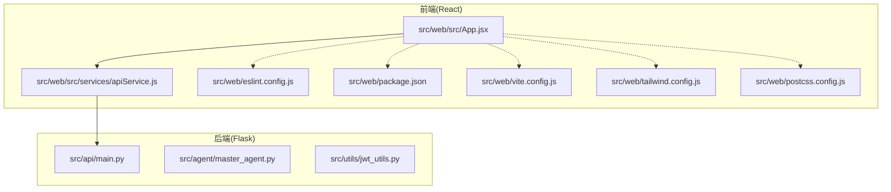
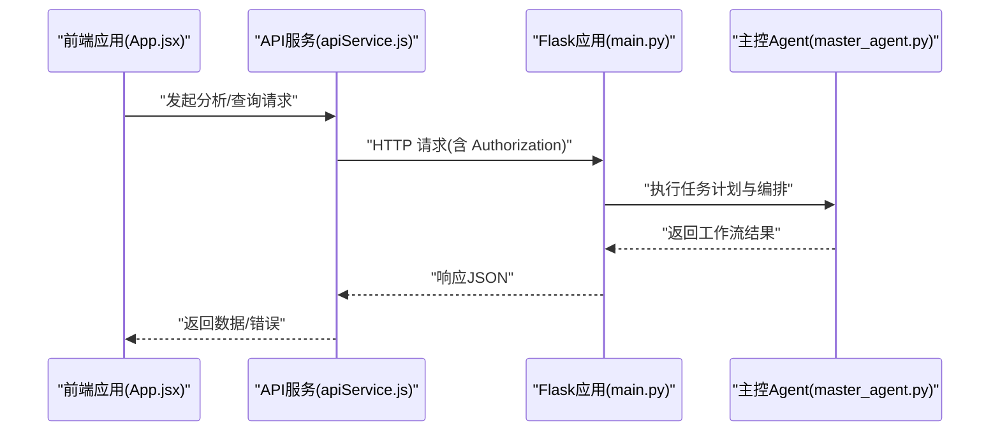
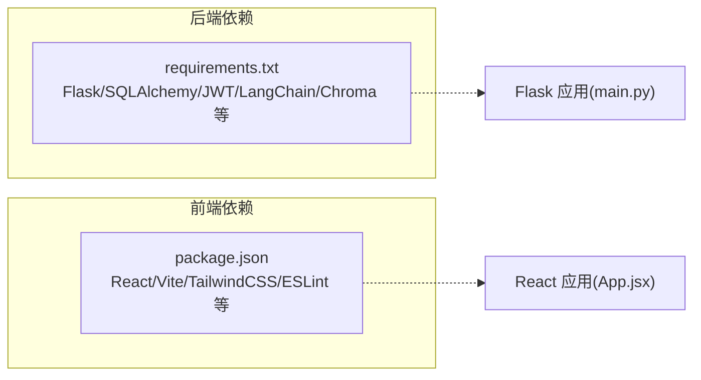

# 代码规范

<cite>
**本文引用的文件**
- [README.md](file://README.md)
- [requirements.txt](file://requirements.txt)
- [src/api/main.py](file://src/api/main.py)
- [src/agent/master_agent.py](file://src/agent/master_agent.py)
- [src/utils/jwt_utils.py](file://src/utils/jwt_utils.py)
- [src/web/eslint.config.js](file://src/web/eslint.config.js)
- [src/web/package.json](file://src/web/package.json)
- [src/web/vite.config.js](file://src/web/vite.config.js)
- [src/web/tailwind.config.js](file://src/web/tailwind.config.js)
- [src/web/postcss.config.js](file://src/web/postcss.config.js)
- [src/web/src/App.jsx](file://src/web/src/App.jsx)
- [src/web/src/services/apiService.js](file://src/web/src/services/apiService.js)
</cite>

## 目录
1. [简介](#简介)
2. [项目结构](#项目结构)
3. [核心组件](#核心组件)
4. [架构总览](#架构总览)
5. [详细组件分析](#详细组件分析)
6. [依赖关系分析](#依赖关系分析)
7. [性能考量](#性能考量)
8. [故障排查指南](#故障排查指南)
9. [结论](#结论)
10. [附录](#附录)

## 简介
本文件旨在建立并规范本项目的代码风格与最佳实践，覆盖后端 Python 与前端 JavaScript/React 两部分。内容依据仓库现有实现提炼形成，确保团队协作一致性与长期可维护性。

## 项目结构
项目采用前后端分离架构：
- 后端：Flask 应用，路由集中在 src/api 下，核心 Agent 逻辑在 src/agent，工具与鉴权在 src/utils。
- 前端：React + Vite + TailwindCSS，组件与服务位于 src/web/src 下，构建与样式配置位于 src/web。

图表来源
- [src/api/main.py](file://src/api/main.py#L1-L243)
- [src/agent/master_agent.py](file://src/agent/master_agent.py#L1-L351)
- [src/utils/jwt_utils.py](file://src/utils/jwt_utils.py#L1-L36)
- [src/web/src/App.jsx](file://src/web/src/App.jsx#L1-L1085)
- [src/web/src/services/apiService.js](file://src/web/src/services/apiService.js#L1-L175)
- [src/web/eslint.config.js](file://src/web/eslint.config.js#L1-L30)
- [src/web/package.json](file://src/web/package.json#L1-L33)
- [src/web/vite.config.js](file://src/web/vite.config.js#L1-L15)
- [src/web/tailwind.config.js](file://src/web/tailwind.config.js#L1-L9)
- [src/web/postcss.config.js](file://src/web/postcss.config.js#L1-L7)

章节来源
- [README.md](file://README.md#L24-L40)

## 核心组件
- 后端 API 应用：集中注册蓝图、统一日志、健康检查与错误处理。
- 主控 Agent：负责任务计划生成与多 Agent 编排，支持回退策略。
- JWT 工具：封装令牌创建与解码。
- 前端应用：统一状态管理、视图路由、聊天与分析工作流驱动。
- API 服务层：封装后端接口调用，统一鉴权头与错误处理。

章节来源
- [src/api/main.py](file://src/api/main.py#L40-L235)
- [src/agent/master_agent.py](file://src/agent/master_agent.py#L24-L351)
- [src/utils/jwt_utils.py](file://src/utils/jwt_utils.py#L18-L36)
- [src/web/src/App.jsx](file://src/web/src/App.jsx#L26-L750)
- [src/web/src/services/apiService.js](file://src/web/src/services/apiService.js#L14-L35)

## 架构总览
后端以 Flask 蓝图组织路由，前端通过服务层发起请求，统一鉴权头携带 Bearer Token；主控 Agent 在后端执行多 Agent 编排，前端负责交互与可视化。

图表来源
- [src/web/src/App.jsx](file://src/web/src/App.jsx#L184-L269)
- [src/web/src/services/apiService.js](file://src/web/src/services/apiService.js#L72-L94)
- [src/api/main.py](file://src/api/main.py#L52-L56)
- [src/agent/master_agent.py](file://src/agent/master_agent.py#L155-L318)

## 详细组件分析

### Python 后端规范

- PEP8 规范遵循
  - 缩进与空行：使用 4 空格缩进，函数/类之间保留空行分隔。
  - 行长与换行：尽量不超过 100 列，长表达式分行书写。
  - 空格与逗号：逗号后加空格，操作符两侧留空格。
  - 模块导入顺序：标准库、第三方库、项目内模块分组导入，每组内字母序排列。
  - 函数命名：采用小写下划线命名，清晰表达意图。
  - 类设计：类名采用帕斯卡命名；构造函数参数与私有属性使用下划线前缀；静态方法与类方法明确用途。
  - 异常处理：捕获具体异常类型，避免裸 pass/raise；错误路径统一返回 JSON 并记录日志。
  - 日志记录：使用标准库 logging，格式包含时间、模块名、级别与消息；请求级日志在 before/after 钩子中记录耗时。
  - 注释规范：模块顶部使用三引号文档字符串描述职责；类/函数使用简洁 docstring；复杂逻辑添加行内注释说明。

- 项目特定约定
  - Agent 类命名：以 Agent 结尾，如 MasterAgent、StockAgent、NewsAgent、AnalysisAgent、DecisionAgent。
  - API 路由命名：蓝图注册统一以 /api/{模块} 前缀，端点动宾结构，如 /agent/analyze、/stock/technical。
  - 变量命名：遵循小写下划线，避免缩写；布尔变量以 is_/has_ 等前缀增强可读性。
  - 配置与环境：敏感配置通过环境变量注入，如 JWT_SECRET_KEY、AGENT_ORCHESTRATOR、LOG_LEVEL。

- 示例路径（不展示具体代码）
  - 日志与请求钩子：[src/api/main.py](file://src/api/main.py#L31-L83)
  - 错误处理与统一响应：[src/api/main.py](file://src/api/main.py#L222-L234)
  - 主控 Agent 类与方法：[src/agent/master_agent.py](file://src/agent/master_agent.py#L24-L351)
  - JWT 工具函数：[src/utils/jwt_utils.py](file://src/utils/jwt_utils.py#L18-L36)

章节来源
- [src/api/main.py](file://src/api/main.py#L31-L83)
- [src/api/main.py](file://src/api/main.py#L222-L234)
- [src/agent/master_agent.py](file://src/agent/master_agent.py#L24-L351)
- [src/utils/jwt_utils.py](file://src/utils/jwt_utils.py#L18-L36)

### JavaScript/React 前端规范

- ESLint 规则
  - 推荐规则集：继承官方推荐配置与 React Hooks、React Refresh 插件。
  - 未使用变量：允许大写字母开头的变量被忽略，便于常量定义。
  - 语言特性：启用 ES2020，支持 JSX 语法，模块化源码。

- 组件命名规范
  - 文件与导出：组件文件采用帕斯卡命名，导出默认组件；功能模块文件采用小写下划线命名。
  - 组件职责：单一职责，UI 展示与业务逻辑分离；通过 props 传递数据与回调。

- Hook 使用规范
  - 状态与副作用：useState、useEffect、useRef 合理使用；清理副作用（定时器、事件监听）。
  - 依赖数组：useEffect 依赖项明确，避免遗漏或过度依赖导致重复执行。
  - 自定义 Hook：抽取可复用逻辑，命名以 use 开头。

- 状态管理约定
  - 全局状态：通过 React 状态与上下文管理；避免跨层级传递地狱。
  - 本地存储：鉴权令牌存于 localStorage，服务层统一封装 set/get。
  - 会话与历史：聊天会话 ID 作为参数贯穿请求，历史记录按页加载。

- 样式编写规范
  - TailwindCSS：使用原子类组合，主题扩展在 tailwind.config.js 中集中配置。
  - PostCSS：启用 autoprefixer 与 tailwindcss 插件，保证兼容性。
  - Vite 环境变量：通过 define 将环境变量注入全局，避免硬编码。

- API 调用规范
  - 统一请求：封装 apiRequest，自动附加 Authorization 头与错误处理。
  - 错误处理：非 2xx 响应抛出错误，前端捕获并提示用户。
  - 参数传递：查询参数使用 URLSearchParams，请求体 JSON 序列化。

- 项目特定约定
  - 组件命名：如 AgentStatusNode、ProgressBar、QuickStarter、LandingView、AuthView、ProfileView、SettingsView。
  - Hook 使用：useEffect 用于初始化与定时轮询，useRef 用于 DOM 引用与定时器句柄。
  - 状态命名：如 appState、viewState、progress、activeLogs、chatHistory、analysisResult 等，语义明确。
  - 路由与视图：根据 viewState 切换不同页面，Header 中用户菜单与登出逻辑。

- 示例路径（不展示具体代码）
  - ESLint 配置：[src/web/eslint.config.js](file://src/web/eslint.config.js#L7-L29)
  - 包管理与脚本：[src/web/package.json](file://src/web/package.json#L6-L11)
  - Vite 环境变量注入：[src/web/vite.config.js](file://src/web/vite.config.js#L9-L12)
  - Tailwind 配置：[src/web/tailwind.config.js](file://src/web/tailwind.config.js#L3-L7)
  - PostCSS 插件：[src/web/postcss.config.js](file://src/web/postcss.config.js#L1-L6)
  - 前端应用主组件：[src/web/src/App.jsx](file://src/web/src/App.jsx#L26-L750)
  - API 服务封装：[src/web/src/services/apiService.js](file://src/web/src/services/apiService.js#L14-L35)

章节来源
- [src/web/eslint.config.js](file://src/web/eslint.config.js#L7-L29)
- [src/web/package.json](file://src/web/package.json#L6-L11)
- [src/web/vite.config.js](file://src/web/vite.config.js#L9-L12)
- [src/web/tailwind.config.js](file://src/web/tailwind.config.js#L3-L7)
- [src/web/postcss.config.js](file://src/web/postcss.config.js#L1-L6)
- [src/web/src/App.jsx](file://src/web/src/App.jsx#L26-L750)
- [src/web/src/services/apiService.js](file://src/web/src/services/apiService.js#L14-L35)

### 注释规范
- 模块注释：模块顶部使用三引号文档字符串，简述模块职责与范围。
- 类注释：类定义上方使用文档字符串，说明类用途、关键属性与行为。
- 函数注释：函数签名下方使用文档字符串，描述参数、返回值与异常；复杂逻辑添加行内注释。
- 行内注释：仅在必要处解释“为什么”而非“是什么”，避免显而易见的注释。

章节来源
- [src/api/main.py](file://src/api/main.py#L4-L6)
- [src/agent/master_agent.py](file://src/agent/master_agent.py#L4-L7)
- [src/agent/master_agent.py](file://src/agent/master_agent.py#L24-L351)

### 错误处理与日志
- 后端：统一错误处理器返回 JSON；请求钩子记录耗时；异常时记录堆栈。
- 前端：服务层统一处理非 2xx 响应并抛错；组件层捕获错误并反馈用户。

章节来源
- [src/api/main.py](file://src/api/main.py#L222-L234)
- [src/api/main.py](file://src/api/main.py#L68-L83)
- [src/web/src/services/apiService.js](file://src/web/src/services/apiService.js#L22-L35)

## 依赖关系分析

图表来源
- [requirements.txt](file://requirements.txt#L1-L41)
- [src/web/package.json](file://src/web/package.json#L12-L31)
- [src/api/main.py](file://src/api/main.py#L22-L29)
- [src/web/src/App.jsx](file://src/web/src/App.jsx#L1-L50)

章节来源
- [requirements.txt](file://requirements.txt#L1-L41)
- [src/web/package.json](file://src/web/package.json#L12-L31)

## 性能考量
- 后端
  - 日志级别：通过环境变量控制，生产环境建议提升至 INFO 或更高。
  - 请求耗时：利用请求钩子记录耗时，便于定位慢接口。
  - Agent 回退：LangChain 不可用时自动回退自研编排，保障稳定性。
- 前端
  - 组件渲染：合理拆分组件，避免不必要的重渲染；使用 useMemo/useCallback 优化高频计算。
  - 网络请求：合并请求、节流/防抖输入框触发；统一错误提示减少重复请求。
  - 样式体积：Tailwind 原子类按需使用，避免无用类造成包体膨胀。

## 故障排查指南
- 后端
  - 404/500：查看统一错误处理器与日志输出；核对蓝图注册与路由前缀。
  - JWT 解码失败：检查密钥是否正确设置，令牌是否过期。
  - Agent 回退：关注 fallback_reason 字段，定位具体失败环节。
- 前端
  - 登录/鉴权：确认本地存储 token 是否存在，服务层是否正确设置 Authorization 头。
  - 接口调用：检查 apiRequest 的错误分支与控制台输出。
  - 样式/构建：确认 Vite、Tailwind、PostCSS 配置文件未被意外修改。

章节来源
- [src/api/main.py](file://src/api/main.py#L222-L234)
- [src/utils/jwt_utils.py](file://src/utils/jwt_utils.py#L29-L36)
- [src/agent/master_agent.py](file://src/agent/master_agent.py#L177-L187)
- [src/web/src/services/apiService.js](file://src/web/src/services/apiService.js#L14-L35)

## 结论
本规范以现有代码实现为基础，明确了 Python 与 JavaScript/React 的命名、结构、注释与错误处理约定，并给出前后端交互与日志记录的最佳实践。建议在后续迭代中持续完善并纳入自动化校验（如 pre-commit、CI），以确保规范落地。

## 附录
- 术语
  - Agent：多智能体中的角色类，负责特定任务。
  - 蓝图：Flask 的模块化路由组织方式。
  - Hook：React 状态与副作用的抽象。
- 参考
  - 项目概览与 API 路由：[README.md](file://README.md#L132-L162)