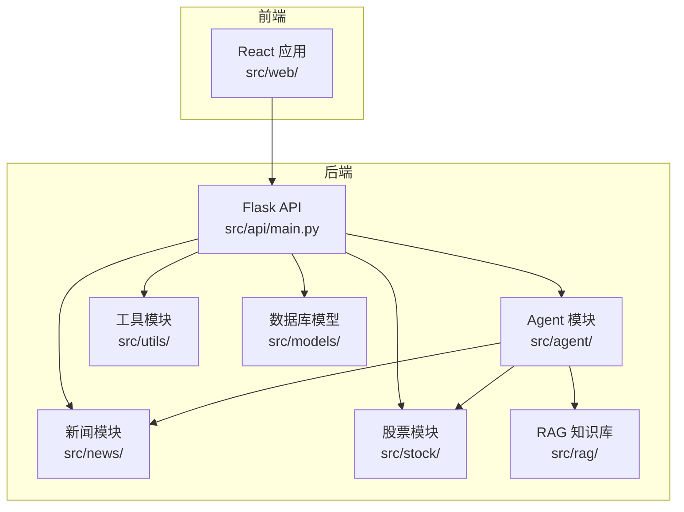
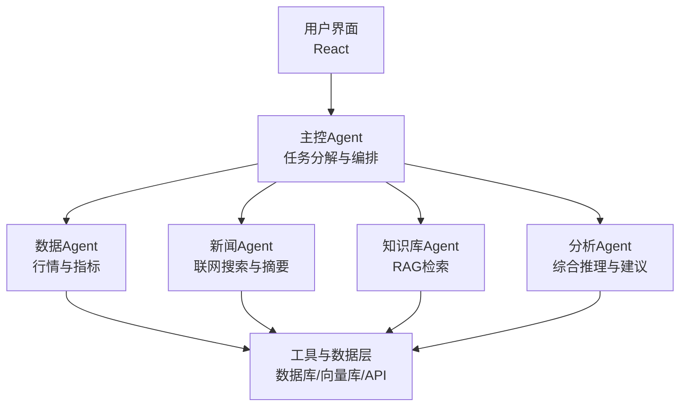
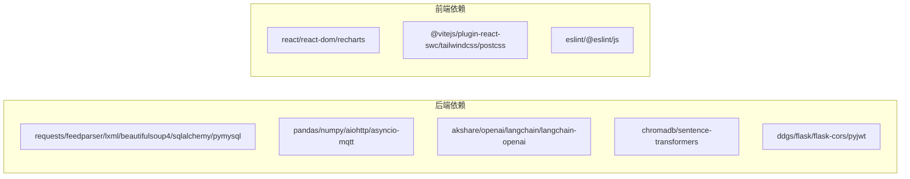

# 开发流程

<cite>
**本文引用的文件**
- [README.md](file://README.md)
- [DESIGN.md](file://DESIGN.md)
- [AGENTS.md](file://AGENTS.md)
- [requirements.txt](file://requirements.txt)
- [src/agent/README.md](file://src/agent/README.md)
- [src/news/README.md](file://src/news/README.md)
- [src/utils/README.md](file://src/utils/README.md)
- [src/web/package.json](file://src/web/package.json)
- [src/web/vite.config.js](file://src/web/vite.config.js)
- [src/web/eslint.config.js](file://src/web/eslint.config.js)
- [src/stock/requirements.txt](file://src/stock/requirements.txt)
- [src/news/requirements.txt](file://src/news/requirements.txt)
</cite>

## 目录
1. [简介](#简介)
2. [项目结构](#项目结构)
3. [核心组件](#核心组件)
4. [架构总览](#架构总览)
5. [详细组件分析](#详细组件分析)
6. [依赖分析](#依赖分析)
7. [性能考量](#性能考量)
8. [故障排查指南](#故障排查指南)
9. [结论](#结论)
10. [附录](#附录)

## 简介
本开发流程文档面向参与 AI 投资分析系统的开发者与协作成员，系统性阐述从开发准备、本地调试、分支与提交规范、代码审查、测试与文档更新，到版本发布、部署与回滚策略的全流程规范。文档同时提供 Pull Request 与 Issue 模板建议、贡献指南要点以及 CI/CD 与自动化测试策略建议，帮助团队建立高效、可追溯、可复现的协作机制。

## 项目结构
项目采用前后端分离与模块化设计，后端以 Flask 提供 API，前端以 React + Vite 构建，核心业务由多 Agent 协同完成，并辅以 RAG 知识检索与数据库持久化。整体结构便于分层开发与独立测试。

图表来源
- [README.md](file://README.md#L24-L40)
- [src/agent/README.md](file://src/agent/README.md#L1-L59)
- [src/news/README.md](file://src/news/README.md#L1-L46)
- [src/utils/README.md](file://src/utils/README.md#L1-L22)

章节来源
- [README.md](file://README.md#L24-L40)
- [src/agent/README.md](file://src/agent/README.md#L1-L59)
- [src/news/README.md](file://src/news/README.md#L1-L46)
- [src/utils/README.md](file://src/utils/README.md#L1-L22)

## 核心组件
- 后端 API：提供用户认证、聊天问答、股票与新闻查询、Agent 分析等接口，入口位于后端服务入口路径。
- Agent 协同：主控 Agent 负责任务分解与编排，子 Agent 分别负责数据、新闻、分析与知识检索，支持可切换编排器（LangChain 与自研）。
- 前端应用：React + Vite，提供登录、仪表盘、设置与个人资料等页面，通过 API 客户端与后端交互。
- 数据与检索：默认 SQLite，支持通过环境变量切换数据库；RAG 使用 ChromaDB 与向量嵌入模型，支持索引构建与查询。
- 工具与搜索：JWT 认证工具与联网搜索封装，支持区域与代理控制。

章节来源
- [README.md](file://README.md#L132-L162)
- [src/agent/README.md](file://src/agent/README.md#L19-L59)
- [src/utils/README.md](file://src/utils/README.md#L1-L22)

## 架构总览
系统采用“用户交互层 → Agent 协调层 → 工具与数据层”的分层架构，主控 Agent 将复杂任务拆解为子任务，由数据、新闻、分析与知识 Agent 并行执行，最终生成结构化建议与报告。

图表来源
- [DESIGN.md](file://DESIGN.md#L1-L191)
- [src/agent/README.md](file://src/agent/README.md#L19-L59)

章节来源
- [DESIGN.md](file://DESIGN.md#L1-L191)
- [src/agent/README.md](file://src/agent/README.md#L19-L59)

## 详细组件分析

### 分支管理策略（Git Flow）
- 主分支：master/main 用于发布稳定版本，合并前需通过代码审查与测试。
- 开发分支：develop 用于集成特性开发，定期同步主分支。
- 功能分支：feature/* 从 develop 拉取，完成后合并回 develop。
- 修复分支：hotfix/* 从主分支拉取，修复后同时合并回主分支与 develop。
- 发布分支：release/* 从 develop 拉取，用于最终测试与版本号标注，完成后合并回主分支与 develop。

最佳实践
- 严格使用 Pull Request 合并，禁止直接推送主分支。
- PR 合并前必须通过自动化测试与代码审查。

章节来源
- [AGENTS.md](file://AGENTS.md#L184-L196)

### 提交消息规范
- 类型：feat、fix、docs、style、refactor、perf、test、build、ci、chore、revert
- 范围：模块名（如 agent、news、stock、web、api）
- 描述：简洁明了，不超过 50 字；必要时在空行后补充背景与影响
- 示例：feat(agent): 新增降级编排器支持；fix(stock): 修正日期解析时区问题

章节来源
- [AGENTS.md](file://AGENTS.md#L184-L196)

### 代码审查流程
- PR 必须关联 Issue 或需求说明，描述变更范围与动机。
- 至少一名 reviewer 通过审查，确保代码风格、安全性与可维护性。
- 通过自动化测试与静态检查（Python/JS）后再合入。
- 合并后清理功能分支，保持仓库整洁。

章节来源
- [AGENTS.md](file://AGENTS.md#L184-L196)

### 测试要求
- 后端测试：使用 pytest，覆盖核心模块与 Agent 交互；提供示例命令。
- 前端测试：ESLint 代码检查；组件测试与端到端测试建议使用 React Testing Library 与 Playwright。
- RAG 与数据模块：提供独立测试入口与脚本，确保索引构建与查询稳定。

章节来源
- [README.md](file://README.md#L194-L203)
- [AGENTS.md](file://AGENTS.md#L197-L209)

### 文档更新流程
- 新增或修改功能需同步更新模块 README 与全局说明文档。
- API 变更需更新接口概览与路由说明。
- 设计变更需更新架构与工作流文档。

章节来源
- [AGENTS.md](file://AGENTS.md#L184-L196)

### 开发环境搭建与本地调试
- 环境要求：Python 3.10+、Node.js 18+、npm 9+。
- 安装后端依赖与前端依赖，按说明启动后端或前端，或一键启动。
- 前端通过 Vite 开发服务器访问，API 通过 Flask 提供。
- 数据库默认 SQLite，可通过环境变量切换至 MySQL 等。

章节来源
- [README.md](file://README.md#L42-L96)

### 版本发布流程
- 从 develop 创建 release/* 分支，进行最终测试与版本号标注。
- 合并回主分支打 Tag，随后合并回 develop。
- 更新 CHANGELOG 与发布说明，准备部署。

章节来源
- [DESIGN.md](file://DESIGN.md#L180-L189)

### 部署流程
- 后端：部署 Flask 应用，配置数据库连接与环境变量，启用 HTTPS 与限流。
- 前端：构建静态资源，部署至 CDN 或 Nginx，配置 API 域名与代理。
- RAG：部署向量数据库与索引，确保检索可用。

章节来源
- [README.md](file://README.md#L132-L162)

### 回滚策略
- 回滚至上一个稳定 Tag，恢复数据库迁移与配置。
- 回滚前端时清理浏览器缓存，确保静态资源一致。
- 回滚 Agent 编排器时切换回自研编排，确保服务可用。

章节来源
- [src/agent/README.md](file://src/agent/README.md#L40-L46)

### Pull Request 模板（建议）
- 标题：类型/模块：简要描述
- 摘要：变更动机、影响范围、风险提示
- 测试：测试用例与覆盖率
- 依赖：新增或变更的第三方库
- 备注：兼容性、部署注意事项

### Issue 模板（建议）
- 类型：Bug / Feature / Docs / Refactor / Perf
- 复现步骤：最小可复现步骤
- 期望行为：预期结果
- 实际行为：实际结果
- 日志与截图：便于定位问题

### Contribution Guidelines（建议）
- 遵循代码风格与命名约定
- 提交前运行 lint 与测试
- 保持提交粒度适中，便于审查
- 变更需附带测试与文档更新

## 依赖分析
后端依赖涵盖网络请求、数据处理、数据库、大模型调用、向量库与嵌入、联网搜索、Flask 与 CORS、JWT 等；前端依赖 React、Recharts、TailwindCSS 与 Vite 生态；各子模块有独立依赖清单，便于按需安装与升级。

图表来源
- [requirements.txt](file://requirements.txt#L1-L41)
- [src/web/package.json](file://src/web/package.json#L1-L33)
- [src/stock/requirements.txt](file://src/stock/requirements.txt#L1-L2)
- [src/news/requirements.txt](file://src/news/requirements.txt#L1-L19)

章节来源
- [requirements.txt](file://requirements.txt#L1-L41)
- [src/web/package.json](file://src/web/package.json#L1-L33)
- [src/stock/requirements.txt](file://src/stock/requirements.txt#L1-L2)
- [src/news/requirements.txt](file://src/news/requirements.txt#L1-L19)

## 性能考量
- 数据获取：对相同股票当日数据进行缓存，减少重复请求；对网络请求设置超时与重试。
- 检索优化：RAG 索引构建后定期更新；查询时限制返回条数与相似度阈值。
- 前端性能：按需加载组件与图表库；构建时开启压缩与 Tree-shaking。
- 数据库：合理索引与连接池配置；批量写入与事务控制。

## 故障排查指南
- 后端导入错误：确认在项目根目录运行命令，检查 Python 包路径与 __init__.py。
- 前端无法启动：确认 Node.js 与 npm 版本，执行安装依赖后再启动。
- 股票/新闻数据异常：检查网络状态与数据源可用性，查看日志与重试机制。
- RAG 检索效果差：重新构建索引，检查知识库内容与向量化质量。

章节来源
- [README.md](file://README.md#L205-L211)

## 结论
通过规范的分支与提交流程、严格的代码审查与测试、完善的文档更新机制，以及清晰的发布与回滚策略，团队可以在保证质量的前提下高效推进迭代。建议在现有基础上逐步引入 CI/CD 与自动化测试流水线，进一步提升交付效率与稳定性。

## 附录

### API 概览（节选）
- 健康检查：GET /api/health
- 认证：POST /api/auth/register、POST /api/auth/login
- 用户：GET/PUT /api/user/profile、PUT /api/user/phone、PUT /api/user/password
- 业务：/api/agent/analyze、/api/agent/query、/api/chat/ask、/api/stock/*、/api/news/*

章节来源
- [README.md](file://README.md#L132-L162)

### 前端开发命令
- 开发：npm run dev
- 构建：npm run build
- 预览：npm run preview
- 代码检查：npm run lint

章节来源
- [README.md](file://README.md#L163-L178)

### Vite 环境变量注入
- 通过 Vite 加载 .env 中的 API 密钥并注入到运行时，便于前端调用。

章节来源
- [src/web/vite.config.js](file://src/web/vite.config.js#L1-L15)

### ESLint 配置
- 基于 @eslint/js 与 React 相关插件，配置推荐规则与全局变量。

章节来源
- [src/web/eslint.config.js](file://src/web/eslint.config.js#L1-L30)