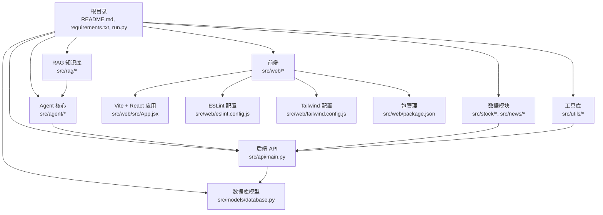
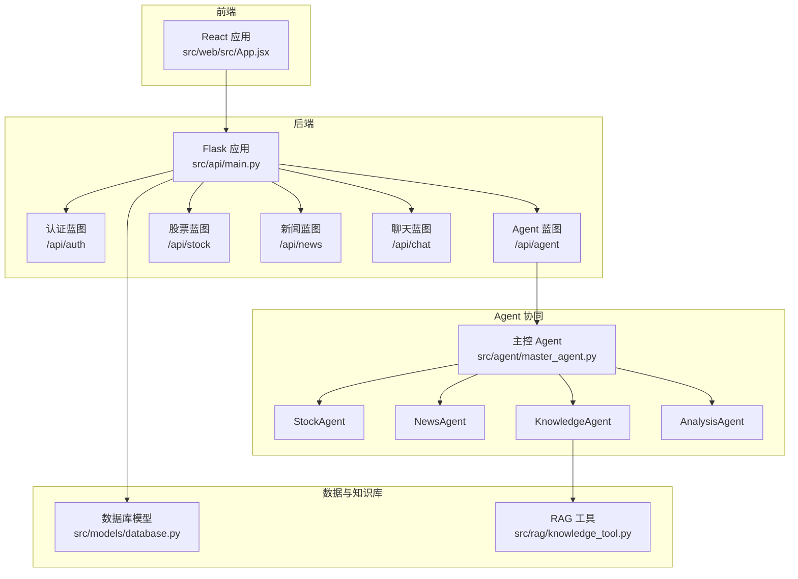
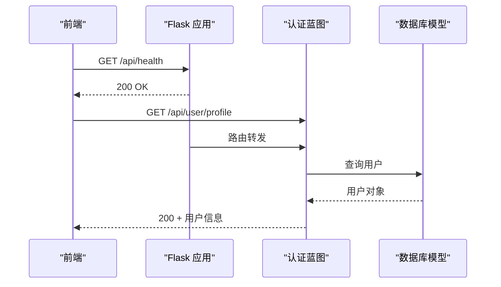
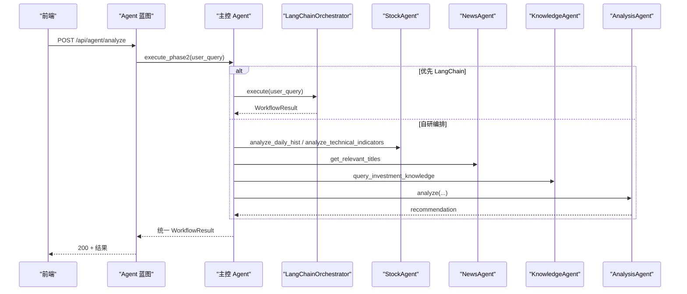
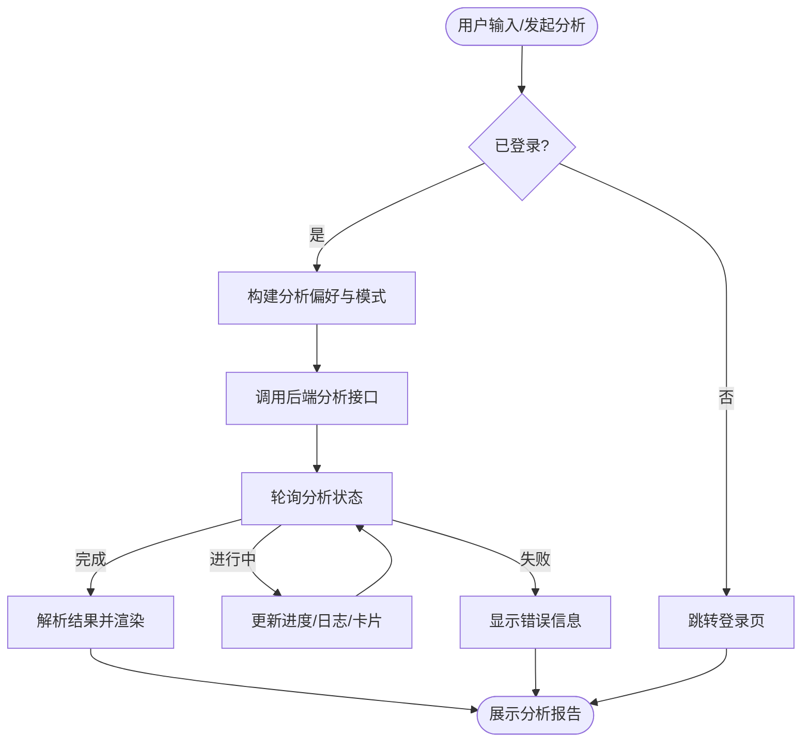
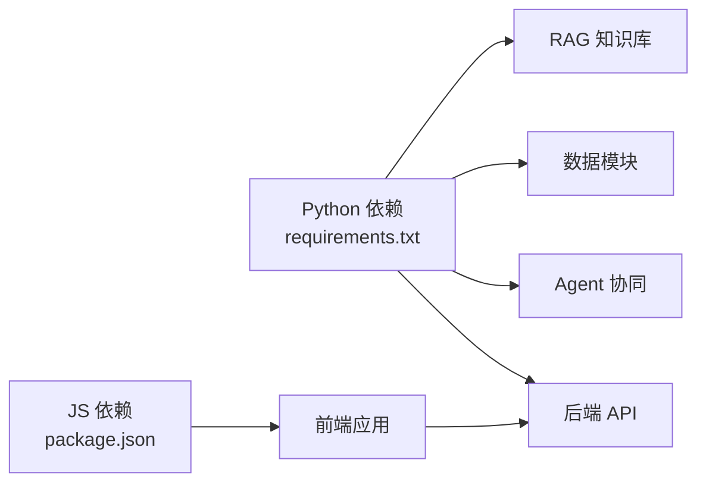

# 开发者指南

<cite>
**本文引用的文件**
- [README.md](file://README.md)
- [DESIGN.md](file://DESIGN.md)
- [AGENTS.md](file://AGENTS.md)
- [requirements.txt](file://requirements.txt)
- [src/agent/README.md](file://src/agent/README.md)
- [src/news/README.md](file://src/news/README.md)
- [src/utils/README.md](file://src/utils/README.md)
- [src/web/README.md](file://src/web/README.md)
- [src/web/eslint.config.js](file://src/web/eslint.config.js)
- [src/web/package.json](file://src/web/package.json)
- [src/web/tailwind.config.js](file://src/web/tailwind.config.js)
- [src/api/main.py](file://src/api/main.py)
- [src/models/database.py](file://src/models/database.py)
- [src/agent/master_agent.py](file://src/agent/master_agent.py)
- [src/web/src/App.jsx](file://src/web/src/App.jsx)
</cite>

## 目录
1. [简介](#简介)
2. [项目结构](#项目结构)
3. [核心组件](#核心组件)
4. [架构总览](#架构总览)
5. [详细组件分析](#详细组件分析)
6. [依赖分析](#依赖分析)
7. [性能考量](#性能考量)
8. [故障排查指南](#故障排查指南)
9. [结论](#结论)
10. [附录](#附录)

## 简介
本指南面向贡献者，提供从代码规范、开发流程、扩展开发到调试技巧的完整落地说明。项目采用“Flask + React + 多 Agent 协作”的架构，支持用户认证、股票与新闻信息聚合、对话分析与 RAG 知识检索。文档重点覆盖：
- Python 与 JavaScript 编码规范与命名约定
- 分支与提交流程、代码评审与测试要求
- 扩展开发：新增 Agent、API 接口、前端组件、数据库 Schema 变更
- 调试技巧：断点调试、日志分析、性能分析、内存泄漏检测
- 项目结构与模块依赖，帮助新开发者快速上手

## 项目结构
项目采用按功能域划分的模块化组织方式，后端以 Flask 提供 API，前端以 React/Vite 构建，Agent 协同与数据处理集中在 src 目录下。

图表来源
- [README.md](file://README.md#L24-L40)
- [src/api/main.py](file://src/api/main.py#L15-L56)
- [src/models/database.py](file://src/models/database.py#L8-L21)
- [src/web/src/App.jsx](file://src/web/src/App.jsx#L1-L25)

章节来源
- [README.md](file://README.md#L24-L40)

## 核心组件
- 后端 API：集中于 Flask 蓝图，提供认证、用户信息、Agent 分析、股票与新闻接口等。
- Agent 协同：主控 Agent 负责任务分解与编排，子 Agent 分别负责数据、新闻、知识检索与综合分析。
- 数据模块：股票与新闻模块分别封装数据获取与处理逻辑。
- RAG 知识库：Chroma 向量索引与检索工具。
- 工具库：JWT 与联网搜索等通用能力。
- 前端应用：React 组件与服务层对接后端 API，提供分析流程可视化与聊天交互。

章节来源
- [src/api/main.py](file://src/api/main.py#L22-L56)
- [src/agent/README.md](file://src/agent/README.md#L1-L59)
- [src/news/README.md](file://src/news/README.md#L1-L46)
- [src/utils/README.md](file://src/utils/README.md#L1-L22)
- [src/web/src/App.jsx](file://src/web/src/App.jsx#L1-L25)

## 架构总览
系统采用“前端-后端-API 蓝图-Agent 协同-数据与知识库”的分层架构。前端通过服务层调用后端 API，后端根据请求路由到不同蓝图，蓝图内调用 Agent 或数据模块，最终返回统一结构。

图表来源
- [src/api/main.py](file://src/api/main.py#L22-L56)
- [src/agent/master_agent.py](file://src/agent/master_agent.py#L24-L38)
- [src/models/database.py](file://src/models/database.py#L24-L86)

## 详细组件分析

### 后端 API 设计与路由
- 应用创建与蓝图注册：在应用工厂中注册认证、Agent、股票、新闻、聊天蓝图，并提供根与健康检查接口。
- 请求生命周期：before_request 记录开始时间，after_request 记录耗时与状态码，便于日志分析。
- 用户信息接口：提供获取与更新用户信息的接口，包含邮箱唯一性校验与密码更新校验。
- 错误处理：统一处理 404、500、401 等错误，保障前端友好提示。

图表来源
- [src/api/main.py](file://src/api/main.py#L58-L101)
- [src/models/database.py](file://src/models/database.py#L24-L38)

章节来源
- [src/api/main.py](file://src/api/main.py#L40-L83)
- [src/api/main.py](file://src/api/main.py#L85-L151)
- [src/api/main.py](file://src/api/main.py#L152-L221)

### 主控 Agent 与编排器
- 主控职责：解析用户查询、识别股票代码、构建任务计划、选择编排器（LangChain 或自研）、收集子 Agent 结果并生成最终建议。
- 编排器切换：通过环境变量控制，支持 auto/langchain/custom 三种模式，异常时自动回退。
- 统一输出：包含任务计划、各 Agent 结果、降级标记与最终建议文本。

图表来源
- [src/agent/README.md](file://src/agent/README.md#L19-L59)
- [src/agent/master_agent.py](file://src/agent/master_agent.py#L155-L318)

章节来源
- [src/agent/README.md](file://src/agent/README.md#L19-L59)
- [src/agent/master_agent.py](file://src/agent/master_agent.py#L24-L38)
- [src/agent/master_agent.py](file://src/agent/master_agent.py#L155-L318)

### 数据与知识库
- 股票数据：封装 AKShare 接口，提供历史行情与技术指标标准化输出。
- 新闻数据：支持多 RSS 源聚合、HTML 清洗、日期解析与时区处理，统一输出结构化新闻项。
- RAG 知识库：提供知识检索工具，支持向量索引与检索。

章节来源
- [src/news/README.md](file://src/news/README.md#L1-L46)
- [src/utils/README.md](file://src/utils/README.md#L1-L22)

### 前端应用与服务层
- 应用入口：React 组件负责状态管理、视图切换、分析流程与聊天交互。
- 服务层：封装 API 客户端，提供认证、分析、聊天、历史等调用。
- 可视化：进度条、日志列表、各 Agent 输出卡片、Markdown 渲染等。

图表来源
- [src/web/src/App.jsx](file://src/web/src/App.jsx#L184-L269)
- [src/web/src/App.jsx](file://src/web/src/App.jsx#L271-L355)
- [src/web/src/App.jsx](file://src/web/src/App.jsx#L416-L624)

章节来源
- [src/web/src/App.jsx](file://src/web/src/App.jsx#L1-L25)
- [src/web/src/App.jsx](file://src/web/src/App.jsx#L184-L269)
- [src/web/src/App.jsx](file://src/web/src/App.jsx#L271-L355)
- [src/web/src/App.jsx](file://src/web/src/App.jsx#L416-L624)

## 依赖分析
- 后端依赖：Flask、SQLAlchemy、JWT、LangChain、OpenAI、ChromaDB、sentence-transformers、ddgs、akshare 等。
- 前端依赖：React、TailwindCSS、Recharts、ESLint、Vite 等。
- 模块耦合：API 蓝图与 Agent 解耦，Agent 与数据模块解耦，前端通过服务层与后端解耦。

图表来源
- [requirements.txt](file://requirements.txt#L1-L41)
- [src/web/package.json](file://src/web/package.json#L12-L31)

章节来源
- [requirements.txt](file://requirements.txt#L1-L41)
- [src/web/package.json](file://src/web/package.json#L12-L31)

## 性能考量
- 后端性能
  - 请求耗时记录：通过 before/after_request 记录耗时，便于定位慢接口。
  - 编排器回退：LangChain 异常时自动回退自研编排，保障稳定性。
  - 数据缓存：建议在热点数据与外部 API 调用处增加缓存与限频策略。
- 前端性能
  - 组件懒加载与按需渲染，避免一次性渲染大量节点。
  - 图表组件按需加载，减少首屏负担。
  - ESLint 规则约束避免冗余渲染与不必要副作用。

章节来源
- [src/api/main.py](file://src/api/main.py#L68-L83)
- [src/agent/README.md](file://src/agent/README.md#L40-L46)

## 故障排查指南
- 后端常见问题
  - 模块导入错误：确保在项目根目录运行命令，检查 sys.path 插入顺序。
  - 数据库连接：默认 SQLite，可通过环境变量覆盖；检查数据库 URL 与权限。
  - Agent 编排：检查环境变量 AGENT_ORCHESTRATOR 设置与 LangChain 可用性。
- 前端常见问题
  - 依赖安装：确认 Node.js 与 npm 版本，执行 npm install。
  - ESLint 报错：运行 npm run lint 修复风格问题。
  - 构建失败：清理 node_modules 并重新安装，检查 Tailwind 配置。
- 通用排查
  - 日志分析：查看 Flask 日志与后端错误处理返回，定位具体错误。
  - 网络与 API：检查外部 API 可用性与代理设置，实现重试与降级。

章节来源
- [README.md](file://README.md#L205-L211)
- [src/web/README.md](file://src/web/README.md#L1-L17)
- [src/web/eslint.config.js](file://src/web/eslint.config.js#L1-L30)

## 结论
本指南提供了从代码规范、开发流程到扩展与调试的全流程实践建议。建议贡献者在新增功能时遵循既有风格与命名约定，严格进行测试与代码评审，并在文档与注释中保持一致性，以确保系统长期可维护性与可扩展性。

## 附录

### 代码规范与命名约定
- Python
  - 导入规范：标准库、第三方、本地模块分组导入，使用类型注解。
  - 命名约定：类名 PascalCase，函数/变量 snake_case，常量 UPPER_SNAKE_CASE，私有方法下划线前缀。
  - 文档字符串：函数/方法需包含参数、返回值与异常说明。
  - 错误处理：捕获特定异常并记录日志，未知异常重新抛出。
- JavaScript/React
  - 组件结构：函数组件 + hooks，props 解构，条件与列表渲染规范。
  - 命名约定：组件 PascalCase，变量/函数 camelCase，常量 UPPER_SNAKE_CASE，CSS 类 kebab-case。
  - JSX 规范：使用 Tailwind 类名，三元/逻辑 AND 条件渲染，列表渲染添加 key。
  - ESLint：遵循 eslint.config.js 规则，避免未使用变量等警告。

章节来源
- [AGENTS.md](file://AGENTS.md#L48-L116)
- [AGENTS.md](file://AGENTS.md#L117-L157)
- [src/web/eslint.config.js](file://src/web/eslint.config.js#L1-L30)

### 开发流程与测试要求
- 分支与提交
  - 建议采用功能分支开发，合并前进行代码评审。
  - 提交信息清晰描述变更目的与影响范围。
- 代码评审
  - 关注代码风格、命名一致性、错误处理与边界条件。
- 测试
  - 后端：pytest 框架，覆盖核心功能与 Agent 交互。
  - 前端：ESLint 与组件测试，端到端流程验证。
- 文档更新
  - 新增接口与 Agent 需同步更新 README 与相关模块文档。

章节来源
- [AGENTS.md](file://AGENTS.md#L184-L209)
- [README.md](file://README.md#L194-L203)

### 扩展开发指南
- 新增 Agent
  - 在 agent 目录下创建文件，实现统一协议结构，注册到主控编排。
  - 提供错误处理与降级输出，确保链路健壮性。
- API 接口扩展
  - 在对应蓝图中新增路由，遵循现有错误处理与日志记录。
  - 返回统一结构，便于前端消费。
- 前端组件开发
  - 遵循现有命名与样式规范，使用 Tailwind 类名。
  - 通过服务层封装 API 调用，避免直接在组件中处理网络细节。
- 数据库 Schema 变更
  - 使用 SQLAlchemy 声明式模型，迁移时注意向后兼容与索引设计。
  - 更新模型后同步更新相关查询与序列化逻辑。

章节来源
- [src/agent/README.md](file://src/agent/README.md#L10-L18)
- [src/models/database.py](file://src/models/database.py#L24-L86)
- [src/web/src/App.jsx](file://src/web/src/App.jsx#L1-L25)

### 调试技巧
- 断点调试
  - 后端：在关键函数入口设置断点，逐步跟踪 Agent 执行与数据流转。
  - 前端：在服务层与组件关键节点设置断点，观察状态与 props 变化。
- 日志分析
  - 后端：利用 after_request 记录耗时与状态，结合错误处理器定位异常。
  - 前端：在服务层与组件中打印关键参数与返回值，辅助定位问题。
- 性能分析
  - 后端：关注外部 API 调用与数据库查询，必要时引入缓存与限流。
  - 前端：使用 React DevTools 分析渲染与重渲染，优化不必要的状态更新。
- 内存泄漏检测
  - 前端：检查定时器与订阅是否在组件卸载时清理，避免闭包持有导致的泄漏。

章节来源
- [src/api/main.py](file://src/api/main.py#L68-L83)
- [src/web/src/App.jsx](file://src/web/src/App.jsx#L184-L269)