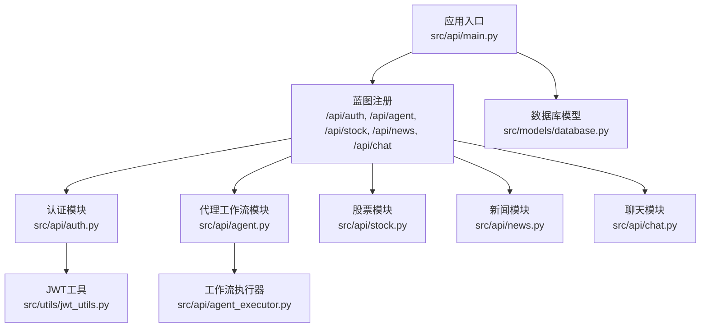
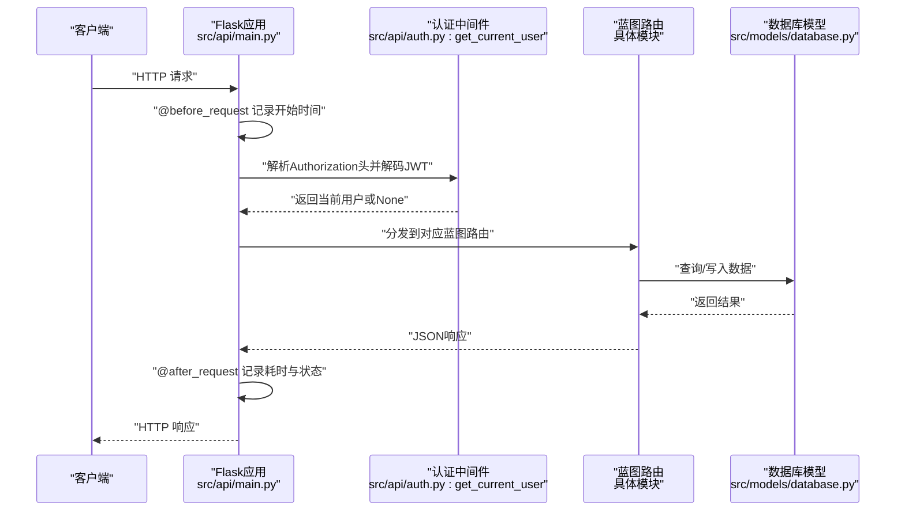
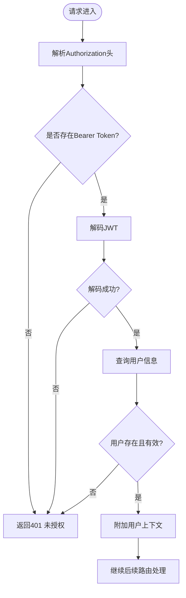
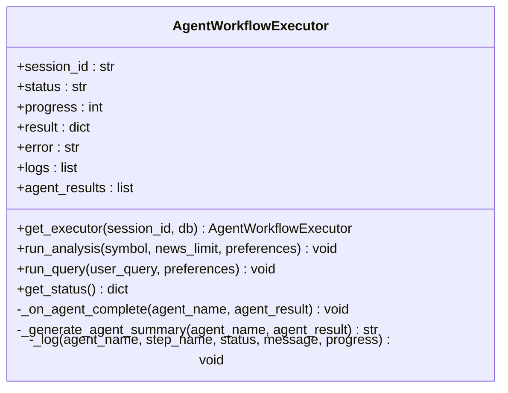
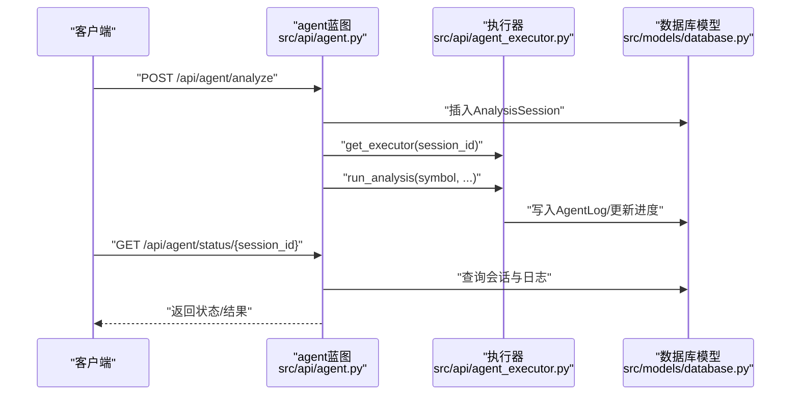
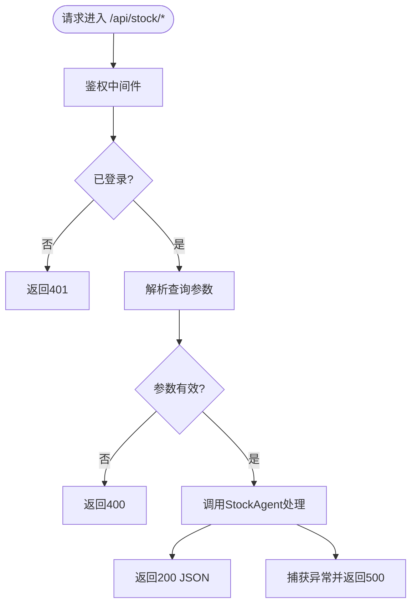
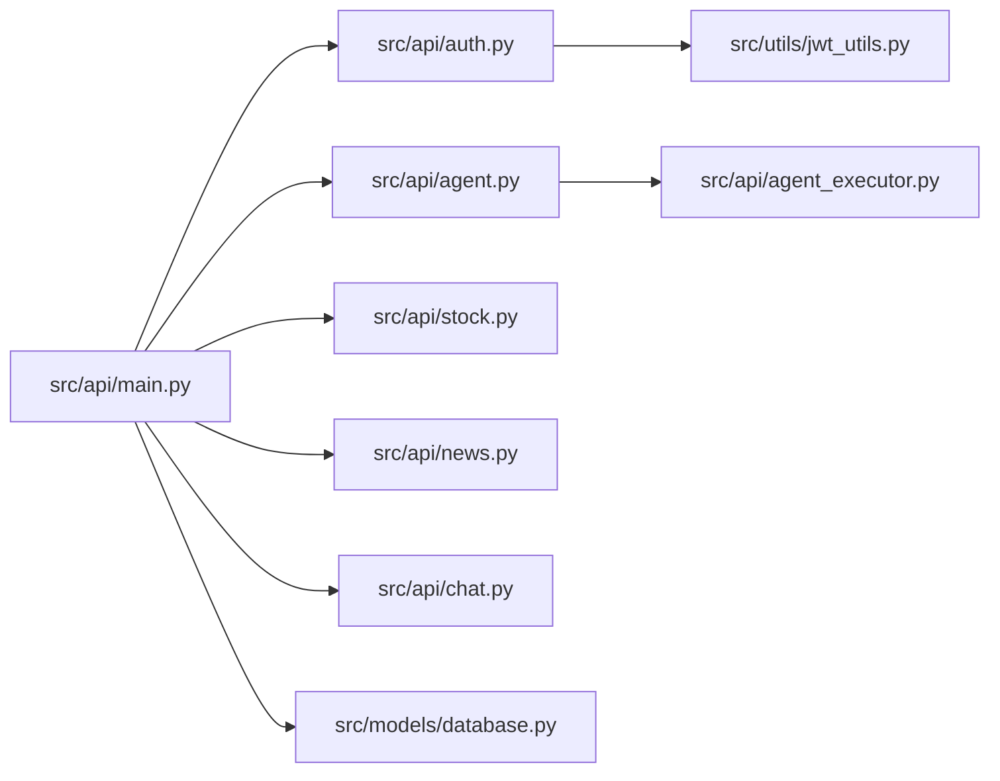

# API接口扩展

<cite>
**本文引用的文件**
- [src/api/main.py](file://src/api/main.py)
- [src/api/__init__.py](file://src/api/__init__.py)
- [src/api/auth.py](file://src/api/auth.py)
- [src/api/agent.py](file://src/api/agent.py)
- [src/api/stock.py](file://src/api/stock.py)
- [src/api/news.py](file://src/api/news.py)
- [src/api/chat.py](file://src/api/chat.py)
- [src/api/agent_executor.py](file://src/api/agent_executor.py)
- [src/models/database.py](file://src/models/database.py)
- [src/utils/jwt_utils.py](file://src/utils/jwt_utils.py)
- [requirements.txt](file://requirements.txt)
- [run.py](file://run.py)
</cite>

## 目录
1. [简介](#简介)
2. [项目结构](#项目结构)
3. [核心组件](#核心组件)
4. [架构总览](#架构总览)
5. [详细组件分析](#详细组件分析)
6. [依赖分析](#依赖分析)
7. [性能考量](#性能考量)
8. [故障排查指南](#故障排查指南)
9. [结论](#结论)
10. [附录](#附录)

## 简介
本指南面向希望在现有Flask API基础上进行扩展开发的工程师，系统讲解如何新增蓝图、定义路由、参数校验、统一响应格式；解释认证中间件与装饰器的使用方式；给出错误处理机制与常见问题定位方法；并提供API版本管理、文档生成、测试策略以及认证集成、权限控制、速率限制等安全实践的落地路径。

## 项目结构
后端采用Flask应用，通过蓝图模块化组织各业务域API，并在应用入口集中注册。数据库模型位于models层，认证与鉴权通过JWT工具与中间件函数实现，部分复杂流程由Agent工作流执行器异步驱动。

图表来源
- [src/api/main.py](file://src/api/main.py#L52-L56)
- [src/api/auth.py](file://src/api/auth.py#L15-L15)
- [src/api/agent.py](file://src/api/agent.py#L17-L17)
- [src/api/stock.py](file://src/api/stock.py#L12-L12)
- [src/api/news.py](file://src/api/news.py#L12-L12)
- [src/api/chat.py](file://src/api/chat.py#L17-L17)
- [src/api/agent_executor.py](file://src/api/agent_executor.py#L25-L56)
- [src/utils/jwt_utils.py](file://src/utils/jwt_utils.py#L13-L36)
- [src/models/database.py](file://src/models/database.py#L24-L86)

章节来源
- [src/api/main.py](file://src/api/main.py#L40-L56)
- [src/api/__init__.py](file://src/api/__init__.py#L1-L1)

## 核心组件
- 应用工厂与蓝图注册：应用工厂负责初始化CORS、日志、数据库、全局路由与错误处理器，并注册各业务蓝图。
- 认证与鉴权：提供注册、登录、当前用户解析等能力，使用JWT生成与解码。
- 业务模块：agent、stock、news、chat分别承载工作流调度、股票数据、新闻检索与聊天历史。
- 工作流执行器：以会话为单位协调多Agent执行，持久化进度与日志。
- 数据模型：用户、聊天历史、分析会话、Agent日志等。
- 安全与中间件：基于请求前/后钩子的日志统计，鉴权中间件通过当前用户解析函数实现。

章节来源
- [src/api/main.py](file://src/api/main.py#L40-L83)
- [src/api/auth.py](file://src/api/auth.py#L18-L136)
- [src/api/agent.py](file://src/api/agent.py#L20-L208)
- [src/api/stock.py](file://src/api/stock.py#L16-L126)
- [src/api/news.py](file://src/api/news.py#L16-L75)
- [src/api/chat.py](file://src/api/chat.py#L23-L216)
- [src/api/agent_executor.py](file://src/api/agent_executor.py#L25-L353)
- [src/models/database.py](file://src/models/database.py#L24-L86)
- [src/utils/jwt_utils.py](file://src/utils/jwt_utils.py#L18-L36)

## 架构总览
下图展示API启动、请求进入、认证中间件、路由处理与数据库交互的整体流程。

图表来源
- [src/api/main.py](file://src/api/main.py#L68-L83)
- [src/api/auth.py](file://src/api/auth.py#L121-L136)
- [src/models/database.py](file://src/models/database.py#L24-L86)

## 详细组件分析

### 认证与鉴权（auth）
- 蓝图与路由：提供注册、登录、当前用户解析等接口。
- 密码哈希：使用SHA-256对明文密码进行哈希存储。
- JWT工具：生成访问令牌与解码令牌，设置过期时间。
- 中间件模式：通过get_current_user从Authorization头中解析用户，未携带或无效令牌时返回未授权。

图表来源
- [src/api/auth.py](file://src/api/auth.py#L121-L136)
- [src/utils/jwt_utils.py](file://src/utils/jwt_utils.py#L29-L36)

章节来源
- [src/api/auth.py](file://src/api/auth.py#L23-L118)
- [src/utils/jwt_utils.py](file://src/utils/jwt_utils.py#L18-L36)

### 工作流执行器（agent_executor）
- 单例管理：按session_id缓存执行器实例，线程安全。
- 回调驱动：通过on_agent_complete回调实时汇总Agent结果、生成摘要、写入日志与进度。
- 事务与持久化：在数据库会话中更新AnalysisSession与AgentLog，保证状态一致性。
- 生命周期：run_analysis与run_query两种执行路径，最终统一落库结果与状态。

图表来源
- [src/api/agent_executor.py](file://src/api/agent_executor.py#L25-L353)

章节来源
- [src/api/agent_executor.py](file://src/api/agent_executor.py#L48-L93)
- [src/api/agent_executor.py](file://src/api/agent_executor.py#L191-L274)
- [src/api/agent_executor.py](file://src/api/agent_executor.py#L275-L341)

### 代理工作流（agent）
- 启动分析/查询：创建AnalysisSession，派发到AgentWorkflowExecutor，后台线程执行。
- 查询状态：根据session_id获取进度、日志、中间/最终结果。
- 列表查询：分页获取用户的历史会话。

图表来源
- [src/api/agent.py](file://src/api/agent.py#L20-L108)
- [src/api/agent.py](file://src/api/agent.py#L111-L168)
- [src/api/agent_executor.py](file://src/api/agent_executor.py#L191-L274)
- [src/models/database.py](file://src/models/database.py#L53-L86)

章节来源
- [src/api/agent.py](file://src/api/agent.py#L20-L208)

### 股票数据（stock）
- 接口覆盖：日线分析、技术指标、历史行情、股票汇总。
- 参数校验：要求必须提供symbol，其余参数可选。
- 异常处理：捕获异常并返回统一错误响应。

图表来源
- [src/api/stock.py](file://src/api/stock.py#L16-L126)

章节来源
- [src/api/stock.py](file://src/api/stock.py#L16-L126)

### 新闻（news）
- 接口覆盖：获取新闻标题、关键词筛选、相关标题。
- 参数校验：关键词列表必填，标题列表可选。
- 异常处理：统一错误响应。

章节来源
- [src/api/news.py](file://src/api/news.py#L16-L75)

### 聊天（chat）
- 接口覆盖：发送消息、获取历史、会话列表、清空历史、简短问答。
- 参数校验：内容必填，会话ID可选默认值。
- 异常处理：统一错误响应。

章节来源
- [src/api/chat.py](file://src/api/chat.py#L23-L216)

### 应用入口与中间件（main）
- 应用工厂：创建Flask应用、初始化CORS、日志级别、数据库。
- 全局路由：根路径、健康检查、用户资料读写、密码/手机修改。
- 中间件：before_request记录开始时间，after_request记录耗时与状态。
- 错误处理：404、500、401统一响应。

章节来源
- [src/api/main.py](file://src/api/main.py#L40-L83)
- [src/api/main.py](file://src/api/main.py#L222-L234)

## 依赖分析
- 外部依赖：Flask、Flask-CORS、SQLAlchemy、PyJWT、OpenAI/LangChain、akshare、chromadb等。
- 内部依赖：API模块依赖模型层与工具层；工作流模块依赖Agent层；认证模块依赖JWT工具。

图表来源
- [src/api/main.py](file://src/api/main.py#L22-L29)
- [src/api/agent.py](file://src/api/agent.py#L14-L15)
- [src/api/agent_executor.py](file://src/api/agent_executor.py#L16-L20)
- [src/utils/jwt_utils.py](file://src/utils/jwt_utils.py#L8-L15)

章节来源
- [requirements.txt](file://requirements.txt#L37-L41)
- [src/api/main.py](file://src/api/main.py#L22-L29)

## 性能考量
- 异步与并发：工作流执行器使用线程池执行长耗时任务，避免阻塞主线程。
- 数据库事务：每个路由在with上下文中操作数据库，确保回滚与提交的一致性。
- 日志与监控：统一记录请求耗时与状态，便于性能分析与问题定位。
- 缓存与索引：模型层对常用查询字段建立索引，减少慢查询。

章节来源
- [src/api/agent_executor.py](file://src/api/agent_executor.py#L50-L56)
- [src/api/main.py](file://src/api/main.py#L68-L83)
- [src/models/database.py](file://src/models/database.py#L29-L37)

## 故障排查指南
- 未授权访问：检查Authorization头是否以Bearer开头，JWT是否过期或签名错误。
- 数据库异常：确认数据库连接、事务回滚与commit时机，查看错误处理器返回。
- 路由404：确认蓝图url_prefix与路由路径一致，检查应用工厂注册顺序。
- 性能问题：关注after_request耗时日志，排查数据库慢查询与外部API调用。

章节来源
- [src/api/auth.py](file://src/api/auth.py#L121-L136)
- [src/api/main.py](file://src/api/main.py#L222-L234)
- [src/api/main.py](file://src/api/main.py#L68-L83)

## 结论
本项目以蓝图为中心的API架构清晰、职责明确，配合JWT中间件与统一错误处理，具备良好的扩展性。新增API时建议遵循既有模式：在对应模块创建蓝图与路由，复用鉴权中间件，使用统一响应格式，结合数据库事务与日志记录，确保可维护性与可观测性。

## 附录

### API扩展步骤清单
- 创建蓝图与路由：在目标模块新建蓝图，定义路由与视图函数。
- 参数校验：在视图函数内校验必需参数，必要时引入Schema校验库。
- 统一响应：返回JSON对象与状态码，参考现有路由风格。
- 鉴权集成：在路由顶部调用当前用户解析函数，未授权返回401。
- 数据持久化：使用with上下文与事务，异常时回滚。
- 错误处理：捕获异常并返回统一错误响应，必要时记录日志。
- 文档生成：为新增路由补充接口文档，标注请求/响应结构。
- 测试策略：编写单元测试与集成测试，覆盖正常与异常场景。
- 安全加固：启用CORS白名单、速率限制、输入过滤、敏感信息脱敏。

### API版本管理建议
- URL版本：如/api/v1/xxx，逐步迁移旧版本。
- 头部版本：X-API-Version，兼容多版本并行。
- 语义化变更：重大变更发布新版本，保留向后兼容接口一段时间。

### 文档生成与测试策略
- 文档生成：可结合Flask蓝图导出OpenAPI/Swagger，或手写Markdown接口文档。
- 测试策略：单元测试覆盖参数校验与业务逻辑，集成测试覆盖端到端流程，压力测试评估并发与限流效果。

### 安全措施实施要点
- 认证集成：使用JWT作为Bearer Token，设置合理过期时间。
- 权限控制：在视图函数中区分用户与资源归属，拒绝越权访问。
- 速率限制：在网关或应用层实现基于IP/用户ID的限流。
- 输入验证：对所有外部输入进行白名单/Schema校验，防止注入与异常输入。
- 日志审计：记录关键操作与异常事件，便于追踪与取证。