# Agent扩展开发

<cite>
**本文档引用的文件**
- [agent_protocol.py](file://src/agent/agent_protocol.py)
- [master_agent.py](file://src/agent/master_agent.py)
- [stock_agent.py](file://src/agent/stock_agent.py)
- [news_agent.py](file://src/agent/news_agent.py)
- [analysis_agent.py](file://src/agent/analysis_agent.py)
- [symbol_resolver.py](file://src/agent/symbol_resolver.py)
- [langchain_orchestrator.py](file://src/agent/langchain_orchestrator.py)
- [decision_agent.py](file://src/agent/decision_agent.py)
- [investment_expert_agent.py](file://src/agent/investment_expert_agent.py)
- [README.md](file://src/agent/README.md)
- [AGENTS.md](file://AGENTS.md)
- [test_master_agent.py](file://src/agent/test/test_master_agent.py)
- [test_stock_agent_fallback.py](file://src/agent/test/test_stock_agent_fallback.py)
- [test_symbol_resolver.py](file://src/agent/test/test_symbol_resolver.py)
</cite>

## 目录
1. [引言](#引言)
2. [项目结构](#项目结构)
3. [核心组件](#核心组件)
4. [架构概览](#架构概览)
5. [详细组件分析](#详细组件分析)
6. [依赖关系分析](#依赖关系分析)
7. [性能考虑](#性能考虑)
8. [故障排除指南](#故障排除指南)
9. [结论](#结论)
10. [附录](#附录)

## 引言

本指南面向希望扩展AI投资分析系统Agent能力的开发者，提供从协议定义到具体实现的完整开发流程。系统采用统一的Agent协议，定义了标准的消息格式、生命周期管理和错误处理机制，支持多Agent协同编排、任务调度和降级策略。

## 项目结构

Agent模块位于`src/agent/`目录下，包含以下核心文件：

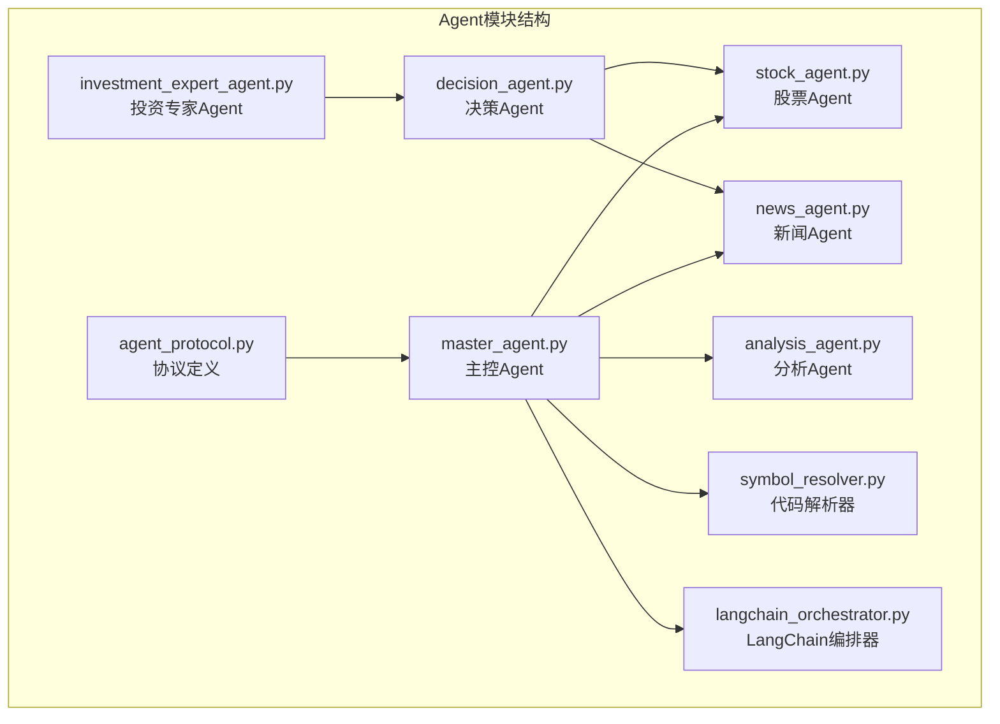

**图表来源**
- [agent_protocol.py](file://src/agent/agent_protocol.py#L1-L116)
- [master_agent.py](file://src/agent/master_agent.py#L1-L354)
- [stock_agent.py](file://src/agent/stock_agent.py#L1-L572)
- [news_agent.py](file://src/agent/news_agent.py#L1-L93)
- [analysis_agent.py](file://src/agent/analysis_agent.py#L1-L119)
- [symbol_resolver.py](file://src/agent/symbol_resolver.py#L1-L244)
- [langchain_orchestrator.py](file://src/agent/langchain_orchestrator.py#L1-L273)
- [decision_agent.py](file://src/agent/decision_agent.py#L1-L526)
- [investment_expert_agent.py](file://src/agent/investment_expert_agent.py#L1-L99)

**章节来源**
- [README.md](file://src/agent/README.md#L1-L59)
- [AGENTS.md](file://AGENTS.md#L158-L182)

## 核心组件

### Agent协议体系

系统定义了统一的Agent协议，确保不同Agent之间的互操作性和一致性：

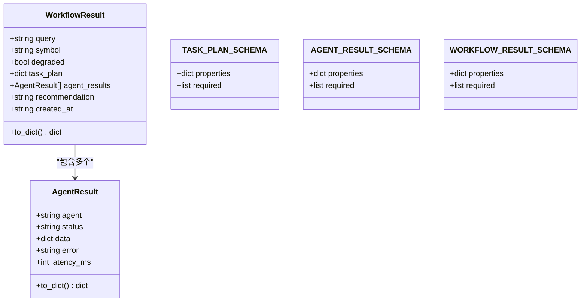

**图表来源**
- [agent_protocol.py](file://src/agent/agent_protocol.py#L74-L116)

协议特点：
- **标准化输出**：所有Agent必须返回统一格式的AgentResult
- **状态管理**：支持completed、failed、skipped三种状态
- **错误处理**：包含详细的错误信息和降级标记
- **性能监控**：内置延迟时间统计

**章节来源**
- [agent_protocol.py](file://src/agent/agent_protocol.py#L16-L116)

### 主控Agent架构

MasterAgent作为系统的核心协调者，负责任务分解、编排执行和结果汇总：

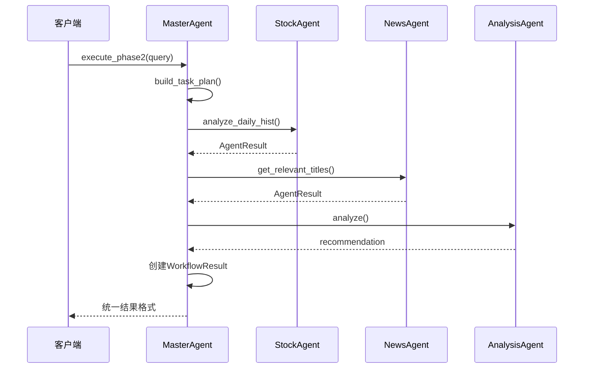

**图表来源**
- [master_agent.py](file://src/agent/master_agent.py#L155-L321)

**章节来源**
- [master_agent.py](file://src/agent/master_agent.py#L24-L354)

## 架构概览

系统采用双链路架构，支持不同的执行模式：

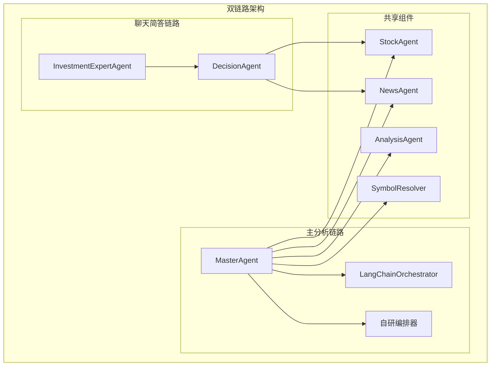

**图表来源**
- [master_agent.py](file://src/agent/master_agent.py#L39-L39)
- [langchain_orchestrator.py](file://src/agent/langchain_orchestrator.py#L20-L28)
- [decision_agent.py](file://src/agent/decision_agent.py#L61-L76)

**章节来源**
- [README.md](file://src/agent/README.md#L19-L59)

## 详细组件分析

### 股票Agent实现

StockAgent负责股票数据获取和分析，实现了完整的降级策略：

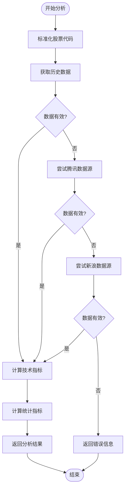

**图表来源**
- [stock_agent.py](file://src/agent/stock_agent.py#L129-L168)

关键特性：
- **多数据源降级**：东方财富 → 腾讯 → 新浪
- **代理环境处理**：自动处理代理配置
- **字段适配**：自动识别不同数据源的列名差异
- **性能优化**：支持缓存和批量处理

**章节来源**
- [stock_agent.py](file://src/agent/stock_agent.py#L30-L572)

### 新闻Agent实现

NewsAgent专注于新闻获取和关键词匹配：

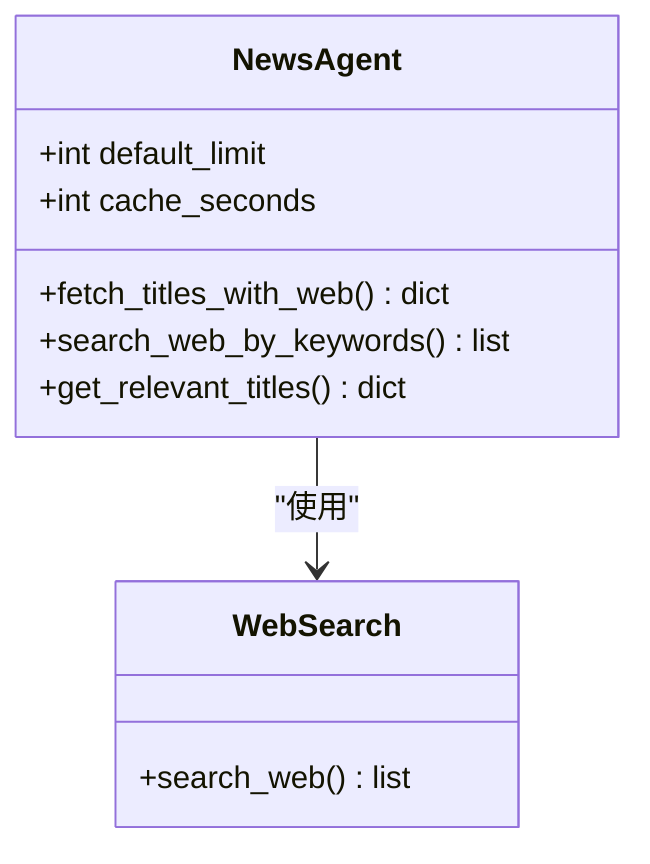

**图表来源**
- [news_agent.py](file://src/agent/news_agent.py#L18-L93)

实现要点：
- **关键词提取**：支持中文分词和关键词过滤
- **搜索集成**：集成多种搜索源
- **结果缓存**：内置缓存机制减少重复请求
- **时间戳管理**：精确的时间戳记录

**章节来源**
- [news_agent.py](file://src/agent/news_agent.py#L18-L93)

### 分析Agent实现

AnalysisAgent负责综合推理和建议生成：

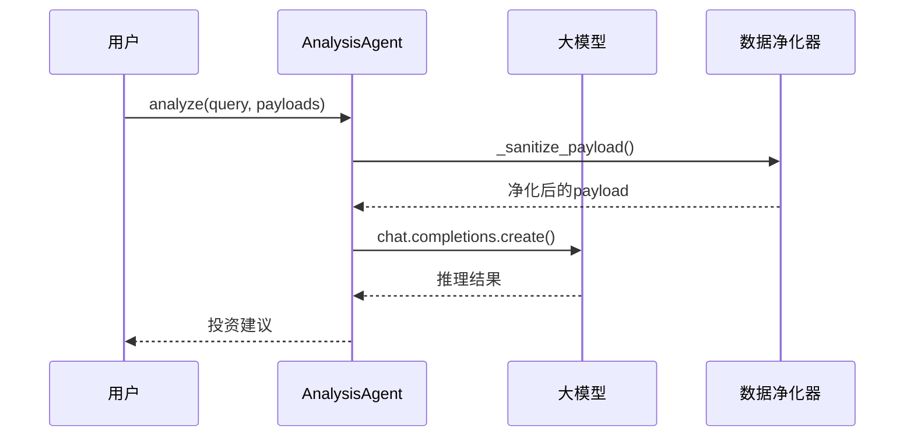

**图表来源**
- [analysis_agent.py](file://src/agent/analysis_agent.py#L27-L92)

设计特点：
- **双模式支持**：调试模式和使用模式
- **数据净化**：自动过滤敏感信息
- **合规输出**：确保输出符合金融合规要求
- **灵活配置**：支持多种大模型和参数

**章节来源**
- [analysis_agent.py](file://src/agent/analysis_agent.py#L15-L119)

### 代码解析器

SymbolResolver提供智能的股票代码解析能力：

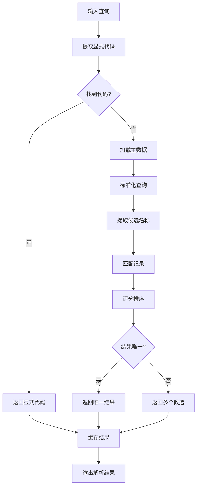

**图表来源**
- [symbol_resolver.py](file://src/agent/symbol_resolver.py#L190-L244)

核心功能：
- **多源匹配**：支持公司名、别名、拼音等多种匹配方式
- **智能缓存**：基于TTL的智能缓存机制
- **歧义处理**：自动处理多义名称的情况
- **离线优先**：优先使用本地主数据减少对外部依赖

**章节来源**
- [symbol_resolver.py](file://src/agent/symbol_resolver.py#L18-L244)

### LangChain编排器

LangChainOrchestrator提供可选的高级编排能力：

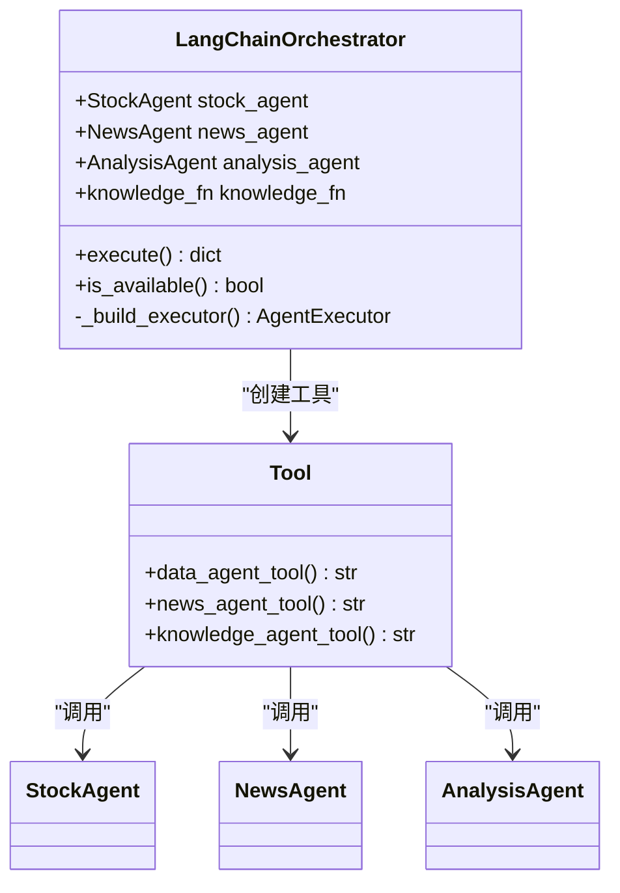

**图表来源**
- [langchain_orchestrator.py](file://src/agent/langchain_orchestrator.py#L20-L273)

**章节来源**
- [langchain_orchestrator.py](file://src/agent/langchain_orchestrator.py#L20-L273)

## 依赖关系分析

Agent系统采用松耦合的设计，通过协议层实现组件间的解耦：

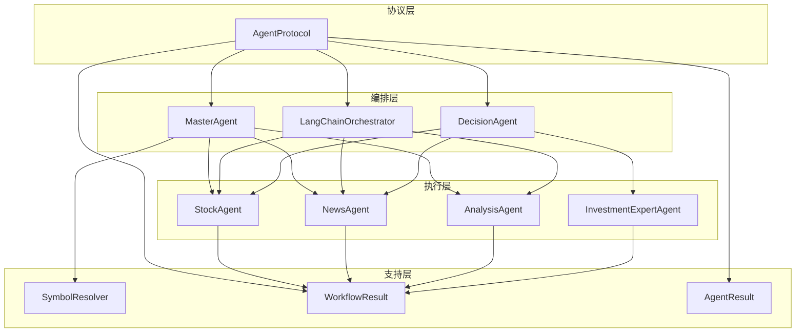

**图表来源**
- [agent_protocol.py](file://src/agent/agent_protocol.py#L74-L116)
- [master_agent.py](file://src/agent/master_agent.py#L24-L39)
- [langchain_orchestrator.py](file://src/agent/langchain_orchestrator.py#L23-L27)
- [decision_agent.py](file://src/agent/decision_agent.py#L64-L69)

**章节来源**
- [master_agent.py](file://src/agent/master_agent.py#L14-L21)
- [langchain_orchestrator.py](file://src/agent/langchain_orchestrator.py#L23-L27)
- [decision_agent.py](file://src/agent/decision_agent.py#L64-L69)

## 性能考虑

### 缓存策略

系统实现了多层次的缓存机制：

1. **符号解析缓存**：SymbolResolver使用TTL缓存
2. **工具调用缓存**：DecisionAgent支持全局和局部缓存
3. **代理环境缓存**：StockAgent的代理配置缓存

### 并发处理

- **线程池执行**：DecisionAgent使用ThreadPoolExecutor处理并发
- **超时保护**：工具调用设置超时时间防止阻塞
- **资源限制**：缓存大小和并发数可配置

### 降级策略

系统具备完整的降级机制：

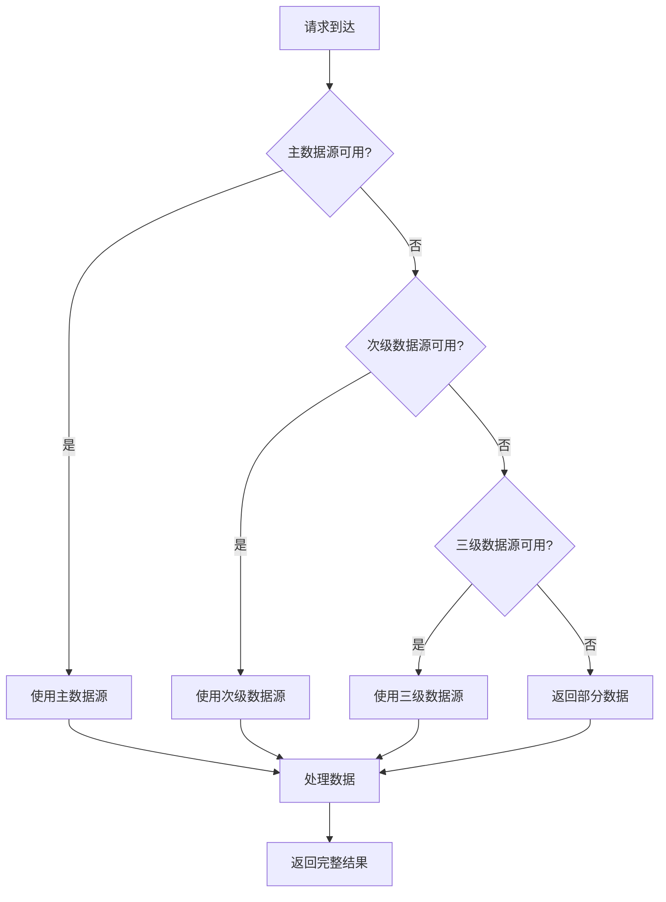

**章节来源**
- [stock_agent.py](file://src/agent/stock_agent.py#L129-L168)
- [decision_agent.py](file://src/agent/decision_agent.py#L77-L92)

## 故障排除指南

### 常见问题及解决方案

#### 1. Agent初始化失败

**症状**：Agent实例化时报错
**排查步骤**：
1. 检查依赖包是否正确安装
2. 验证环境变量配置
3. 确认数据文件路径

#### 2. 数据获取异常

**症状**：StockAgent无法获取数据
**排查步骤**：
1. 检查网络连接状态
2. 验证代理配置
3. 查看降级链路是否正常工作

#### 3. 编排器切换问题

**症状**：编排器无法按预期切换
**排查步骤**：
1. 检查环境变量AGENT_ORCHESTRATOR
2. 验证LangChain依赖是否安装
3. 查看回退日志

#### 4. 性能问题

**症状**：响应时间过长
**排查步骤**：
1. 检查缓存配置
2. 监控并发设置
3. 分析慢查询日志

**章节来源**
- [test_stock_agent_fallback.py](file://src/agent/test/test_stock_agent_fallback.py#L22-L83)
- [test_symbol_resolver.py](file://src/agent/test/test_symbol_resolver.py#L19-L38)

## 结论

本Agent扩展开发指南提供了从协议定义到具体实现的完整开发流程。系统通过统一的协议设计、多层降级策略和灵活的编排机制，为AI投资分析系统提供了强大的扩展能力。开发者可以基于现有组件快速实现新的Agent类型，同时保持系统的稳定性和可维护性。

## 附录

### 开发最佳实践

1. **遵循协议规范**：所有Agent必须实现统一的输入输出格式
2. **错误处理**：完善的异常捕获和错误信息记录
3. **性能监控**：内置性能指标收集和监控
4. **测试覆盖**：单元测试和集成测试并重
5. **文档维护**：保持代码注释和文档的同步更新

### 配置参考

- **编排器选择**：`AGENT_ORCHESTRATOR=auto|langchain|custom`
- **工具调用超时**：`AGENT_TOOL_TIMEOUT=15`
- **工具调用轮数**：`AGENT_TOOL_MAX_ROUNDS=2`
- **缓存TTL**：`AGENT_TOOL_CACHE_TTL=300`
- **最大缓存项**：`AGENT_TOOL_CACHE_MAX=256`
- **最大并发数**：`AGENT_TOOL_MAX_WORKERS=3`