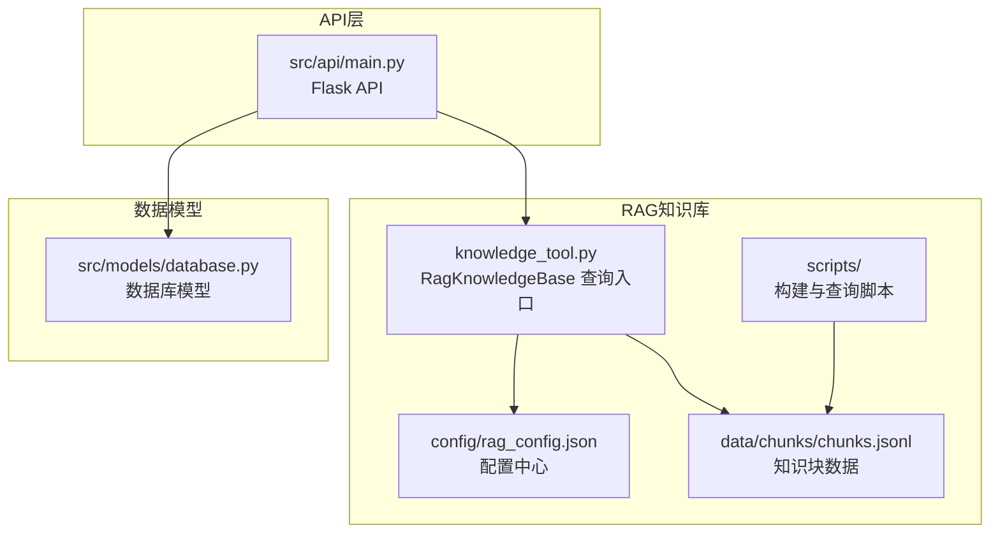
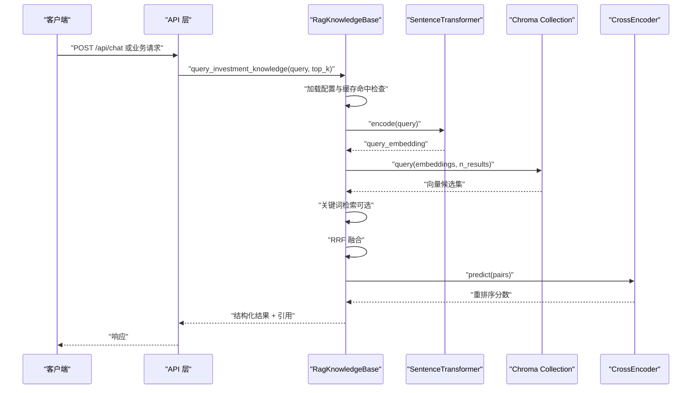
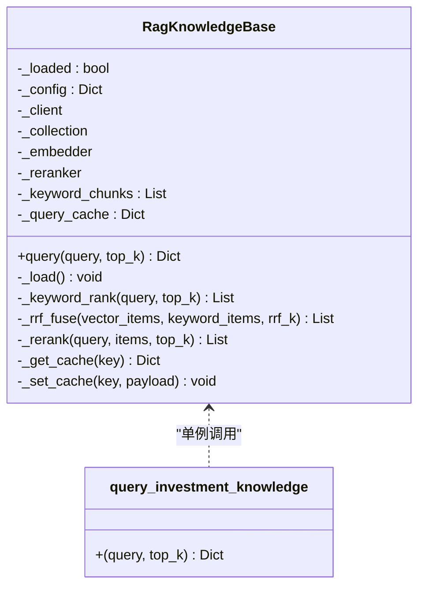
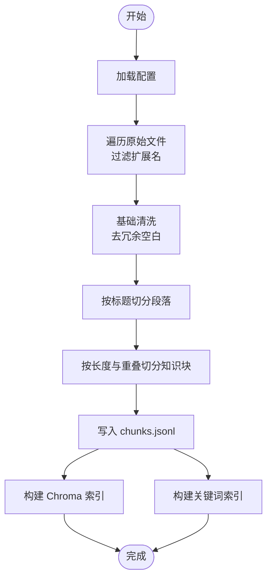
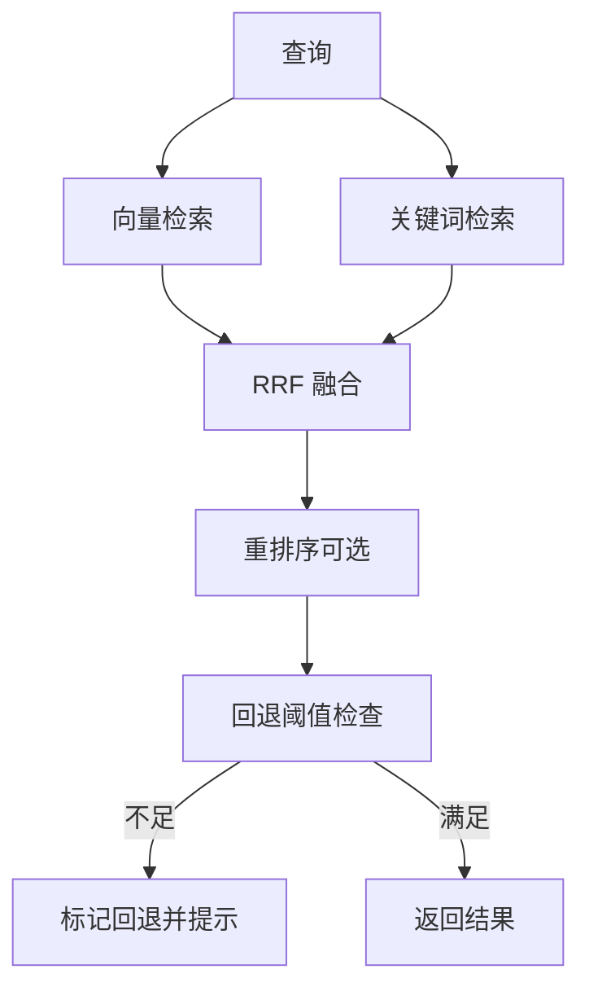
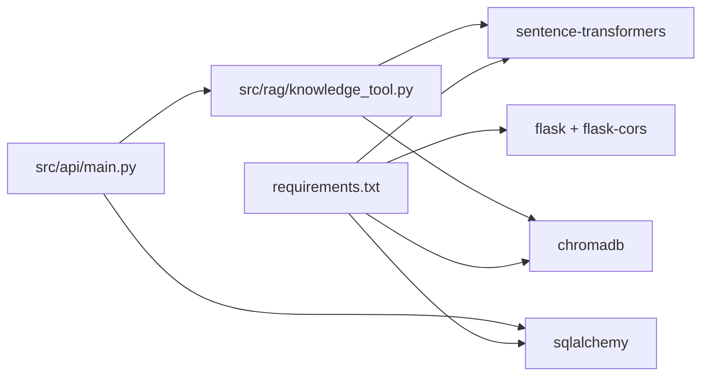

# RAG知识库扩展

<cite>
**本文引用的文件**
- [src/rag/knowledge_tool.py](file://src/rag/knowledge_tool.py)
- [src/rag/config/rag_config.json](file://src/rag/config/rag_config.json)
- [src/rag/scripts/build_index.py](file://src/rag/scripts/build_index.py)
- [src/rag/scripts/query_index.py](file://src/rag/scripts/query_index.py)
- [src/rag/scripts/prepare_chunks.py](file://src/rag/scripts/prepare_chunks.py)
- [src/rag/scripts/build_chroma_index.py](file://src/rag/scripts/build_chroma_index.py)
- [src/rag/scripts/query_chroma.py](file://src/rag/scripts/query_chroma.py)
- [src/rag/data/chunks/chunks.jsonl](file://src/rag/data/chunks/chunks.jsonl)
- [src/api/main.py](file://src/api/main.py)
- [src/models/database.py](file://src/models/database.py)
- [requirements.txt](file://requirements.txt)
</cite>

## 目录
1. [简介](#简介)
2. [项目结构](#项目结构)
3. [核心组件](#核心组件)
4. [架构总览](#架构总览)
5. [详细组件分析](#详细组件分析)
6. [依赖分析](#依赖分析)
7. [性能考虑](#性能考虑)
8. [故障排查指南](#故障排查指南)
9. [结论](#结论)
10. [附录](#附录)

## 简介
本指南面向需要扩展“AI投资分析系统”中RAG知识库的开发者，围绕向量嵌入模型选择、索引构建策略、检索算法优化、混合检索与重排序、上下文增强、知识库维护与更新、质量评估、RAG工作流优化、缓存策略与错误处理等方面，提供可操作的扩展方案与最佳实践。文档基于仓库现有实现，结合配置文件与脚本，帮助你在不破坏既有架构的前提下，安全、高效地扩展知识库能力。

## 项目结构
RAG相关代码集中在 src/rag 目录，包含：
- 知识库查询与工具：knowledge_tool.py
- 配置：config/rag_config.json
- 数据与中间产物：data/chunks/chunks.jsonl
- 索引构建与查询脚本：scripts 下的 prepare_chunks.py、build_index.py、query_index.py、build_chroma_index.py、query_chroma.py

**图表来源**
- [src/rag/knowledge_tool.py](file://src/rag/knowledge_tool.py#L1-L273)
- [src/rag/config/rag_config.json](file://src/rag/config/rag_config.json#L1-L58)
- [src/rag/data/chunks/chunks.jsonl](file://src/rag/data/chunks/chunks.jsonl#L1-L101)
- [src/rag/scripts/build_index.py](file://src/rag/scripts/build_index.py#L1-L59)
- [src/rag/scripts/query_index.py](file://src/rag/scripts/query_index.py#L1-L98)
- [src/rag/scripts/prepare_chunks.py](file://src/rag/scripts/prepare_chunks.py#L1-L165)
- [src/rag/scripts/build_chroma_index.py](file://src/rag/scripts/build_chroma_index.py#L1-L88)
- [src/rag/scripts/query_chroma.py](file://src/rag/scripts/query_chroma.py#L1-L90)
- [src/api/main.py](file://src/api/main.py#L1-L243)
- [src/models/database.py](file://src/models/database.py#L1-L86)

**章节来源**
- [src/rag/knowledge_tool.py](file://src/rag/knowledge_tool.py#L1-L273)
- [src/rag/config/rag_config.json](file://src/rag/config/rag_config.json#L1-L58)
- [src/rag/data/chunks/chunks.jsonl](file://src/rag/data/chunks/chunks.jsonl#L1-L101)
- [src/rag/scripts/build_index.py](file://src/rag/scripts/build_index.py#L1-L59)
- [src/rag/scripts/query_index.py](file://src/rag/scripts/query_index.py#L1-L98)
- [src/rag/scripts/prepare_chunks.py](file://src/rag/scripts/prepare_chunks.py#L1-L165)
- [src/rag/scripts/build_chroma_index.py](file://src/rag/scripts/build_chroma_index.py#L1-L88)
- [src/rag/scripts/query_chroma.py](file://src/rag/scripts/query_chroma.py#L1-L90)
- [src/api/main.py](file://src/api/main.py#L1-L243)
- [src/models/database.py](file://src/models/database.py#L1-L86)

## 核心组件
- 知识库查询器：RagKnowledgeBase 提供统一查询入口，支持向量检索、关键词检索、混合检索（RRF）、重排序（CrossEncoder）、缓存与回退策略。
- 配置中心：rag_config.json 控制嵌入模型、索引目录、缓存、混合检索参数、回退阈值等。
- 数据管线：prepare_chunks.py 清洗与切分原始文档为知识块；build_chroma_index.py 构建向量索引；build_index.py 构建轻量关键词索引；query_index.py 与 query_chroma.py 提供命令行查询。
- API集成：API层通过 knowledge_tool.py 的 query_investment_knowledge 暴露检索能力。

**章节来源**
- [src/rag/knowledge_tool.py](file://src/rag/knowledge_tool.py#L22-L273)
- [src/rag/config/rag_config.json](file://src/rag/config/rag_config.json#L1-L58)
- [src/rag/scripts/prepare_chunks.py](file://src/rag/scripts/prepare_chunks.py#L1-L165)
- [src/rag/scripts/build_chroma_index.py](file://src/rag/scripts/build_chroma_index.py#L1-L88)
- [src/rag/scripts/build_index.py](file://src/rag/scripts/build_index.py#L1-L59)
- [src/rag/scripts/query_index.py](file://src/rag/scripts/query_index.py#L1-L98)
- [src/rag/scripts/query_chroma.py](file://src/rag/scripts/query_chroma.py#L1-L90)
- [src/api/main.py](file://src/api/main.py#L1-L243)

## 架构总览
RAG检索工作流由“数据准备—索引构建—查询检索—重排序—结果返回”组成，支持混合检索与缓存加速。

**图表来源**
- [src/rag/knowledge_tool.py](file://src/rag/knowledge_tool.py#L177-L248)
- [src/rag/scripts/query_chroma.py](file://src/rag/scripts/query_chroma.py#L45-L85)
- [src/api/main.py](file://src/api/main.py#L1-L243)

## 详细组件分析

### 组件A：RagKnowledgeBase 查询器
- 职责：封装向量检索、关键词检索、混合融合（RRF）、重排序、缓存与回退策略。
- 关键流程：
  - 加载配置与模型（嵌入、重排、Chroma集合）。
  - 文本清洗与分词，关键词检索并打分。
  - 向量检索获取候选，与关键词结果进行RRF融合。
  - 条件重排序（CrossEncoder），按阈值与top_k截断。
  - 缓存查询结果，支持TTL与容量淘汰。
  - 回退策略：当结果数不足或最高分过低时标记回退并提示。
- 可扩展点：
  - 新增检索策略（如BM25、DPR、ColBERT）。
  - 新增重排序模型或多模型融合。
  - 新增上下文增强（prompt模板、检索上下文拼接）。
  - 新增质量评估指标（召回、精确、人工打分）。

**图表来源**
- [src/rag/knowledge_tool.py](file://src/rag/knowledge_tool.py#L22-L273)

**章节来源**
- [src/rag/knowledge_tool.py](file://src/rag/knowledge_tool.py#L22-L273)

### 组件B：配置中心 rag_config.json
- 控制项概览：
  - data：原始/清洗/知识块目录
  - chroma：持久化目录、集合名、重置开关、批量大小
  - embedding：嵌入模型名
  - rerank：启用开关、模型名、top_k、最小候选数
  - cache：启用开关、TTL、最大缓存条数
  - hf：本地模型文件开关
  - chunking：最大/最小/重叠字符、标题权重
  - query：默认返回条数
  - hybrid：混合检索开关、向量/关键词top_k、RRF参数
  - fallback：最小结果数、最小分数阈值
  - io：编码、允许扩展名
- 扩展建议：
  - 新增检索策略参数（如BM25权重、DPR参数）。
  - 新增重排序阈值与候选数策略。
  - 新增缓存策略（LRU、LFU、热数据分区）。

**章节来源**
- [src/rag/config/rag_config.json](file://src/rag/config/rag_config.json#L1-L58)

### 组件C：数据准备与索引构建
- prepare_chunks.py：读取原始文档，清洗、按标题切分、按字符长度与重叠切片，生成知识块并写入 chunks.jsonl。
- build_chroma_index.py：读取 chunks.jsonl，批量嵌入并写入 Chroma 集合。
- build_index.py：将 chunks.jsonl 构建为轻量关键词索引文件，便于无向量场景或对比实验。
- query_index.py：对关键词索引进行查询与评分。
- query_chroma.py：对向量索引进行查询与可选重排序。

**图表来源**
- [src/rag/scripts/prepare_chunks.py](file://src/rag/scripts/prepare_chunks.py#L141-L161)
- [src/rag/scripts/build_chroma_index.py](file://src/rag/scripts/build_chroma_index.py#L37-L83)
- [src/rag/scripts/build_index.py](file://src/rag/scripts/build_index.py#L30-L54)

**章节来源**
- [src/rag/scripts/prepare_chunks.py](file://src/rag/scripts/prepare_chunks.py#L1-L165)
- [src/rag/scripts/build_chroma_index.py](file://src/rag/scripts/build_chroma_index.py#L1-L88)
- [src/rag/scripts/build_index.py](file://src/rag/scripts/build_index.py#L1-L59)
- [src/rag/scripts/query_index.py](file://src/rag/scripts/query_index.py#L1-L98)
- [src/rag/scripts/query_chroma.py](file://src/rag/scripts/query_chroma.py#L1-L90)
- [src/rag/data/chunks/chunks.jsonl](file://src/rag/data/chunks/chunks.jsonl#L1-L101)

### 组件D：混合检索与重排序
- 混合检索（RRF）：对向量与关键词结果按各自排名位置进行倒数融合，提升召回多样性与稳健性。
- 重排序：对候选集与查询构造 pair，使用 CrossEncoder 模型打分并排序，提高相关性。
- 回退策略：当候选数不足或最高分低于阈值时，标记回退并提示“知识库覆盖不足”。

**图表来源**
- [src/rag/knowledge_tool.py](file://src/rag/knowledge_tool.py#L114-L151)
- [src/rag/knowledge_tool.py](file://src/rag/knowledge_tool.py#L177-L248)

**章节来源**
- [src/rag/knowledge_tool.py](file://src/rag/knowledge_tool.py#L114-L151)
- [src/rag/knowledge_tool.py](file://src/rag/knowledge_tool.py#L177-L248)

### 组件E：缓存与回退
- 缓存：基于字典的内存缓存，支持 TTL 与最大容量，命中则直接返回。
- 回退：基于最小结果数与最小分数阈值，自动判定是否需要提示“知识库覆盖不足”。

**章节来源**
- [src/rag/knowledge_tool.py](file://src/rag/knowledge_tool.py#L153-L176)
- [src/rag/knowledge_tool.py](file://src/rag/knowledge_tool.py#L225-L228)

### 组件F：API 集成与日志
- API 层通过路由暴露健康检查、用户信息、认证等接口，并记录请求耗时与状态码。
- knowledge_tool.py 的查询入口在异常时记录日志并返回空结果，避免中断上游流程。

**章节来源**
- [src/api/main.py](file://src/api/main.py#L64-L83)
- [src/rag/knowledge_tool.py](file://src/rag/knowledge_tool.py#L268-L272)

## 依赖分析
- 向量与嵌入：sentence-transformers（SentenceTransformer、CrossEncoder）
- 向量库：chromadb
- 数据处理：json、pathlib、typing
- API：Flask、CORS
- 数据库：SQLAlchemy（用户、聊天历史、分析会话、Agent日志）

**图表来源**
- [requirements.txt](file://requirements.txt#L1-L41)
- [src/api/main.py](file://src/api/main.py#L1-L243)
- [src/rag/knowledge_tool.py](file://src/rag/knowledge_tool.py#L1-L273)

**章节来源**
- [requirements.txt](file://requirements.txt#L1-L41)
- [src/api/main.py](file://src/api/main.py#L1-L243)
- [src/models/database.py](file://src/models/database.py#L1-L86)

## 性能考虑
- 向量检索
  - 批量嵌入：build_chroma_index.py 使用批量写入，减少IO往返。
  - 向量维度与模型：选择更小的中文嵌入模型可降低存储与计算开销，但需权衡精度。
  - 距离度量：Chroma 默认距离度量需与嵌入归一化策略一致（已启用 normalize_embeddings）。
- 混合检索
  - RRF 参数 k：增大 k 会拉平排名差异，提升召回但可能降低精确性；需结合业务调优。
  - 向量与关键词 top_k：建议向量 top_k > 关键词 top_k，以保证候选多样性。
- 重排序
  - 候选阈值与最小候选数：避免对少量或噪声候选进行重排序，节省推理成本。
  - 模型选择：CrossEncoder 比语义相似度更准确但更慢，可按场景选择是否启用。
- 缓存
  - TTL 与容量：根据热点查询频率与内存占用设置 TTL 与最大缓存条数。
  - 缓存键：包含查询、top_k、混合检索开关，避免误命中。
- I/O 与磁盘
  - Chroma 持久化目录与集合名需与配置一致，避免重建索引。
  - chunks.jsonl 作为中间产物，建议定期备份与校验。

[本节为通用性能建议，无需特定文件引用]

## 故障排查指南
- 常见问题
  - 未找到知识块文件：构建脚本会抛出 FileNotFoundError，检查 chunks.jsonl 是否存在。
  - Chroma 集合未创建：确认 persist_dir 与 collection 名称，必要时开启 reset。
  - 模型加载失败：检查 hf.local_files_only 与模型缓存路径。
  - 查询无结果：检查回退阈值与混合检索开关，确认关键词索引是否启用。
- 日志与错误
  - API 层记录请求耗时与状态码，便于定位慢请求。
  - knowledge_tool.py 在查询异常时记录日志并返回空结果，避免中断。

**章节来源**
- [src/rag/scripts/build_index.py](file://src/rag/scripts/build_index.py#L40-L42)
- [src/rag/scripts/build_chroma_index.py](file://src/rag/scripts/build_chroma_index.py#L53-L57)
- [src/rag/knowledge_tool.py](file://src/rag/knowledge_tool.py#L268-L272)
- [src/api/main.py](file://src/api/main.py#L68-L83)

## 结论
本指南基于现有实现，梳理了RAG知识库的数据管线、检索与重排序策略、缓存与回退机制，并给出了可扩展的方向。通过合理配置与参数调优，可在保证检索质量的同时提升性能与稳定性。后续扩展可围绕检索策略多样化、重排序模型融合、上下文增强与质量评估体系展开。

[本节为总结性内容，无需特定文件引用]

## 附录

### 扩展示例清单（步骤化）
- 新知识源接入
  - 在 data/raw 目录添加新文档，确保扩展名为 .md/.txt。
  - 运行 prepare_chunks.py 生成 chunks.jsonl。
  - 运行 build_chroma_index.py 重新构建向量索引。
  - 如需关键词检索，运行 build_index.py 生成轻量索引。
- 检索策略调整
  - 修改 rag_config.json 中 hybrid.vector_top_k、keyword_top_k、rrf_k。
  - 若需关闭重排序，将 rerank.enabled 设为 false。
- 性能优化
  - 调整 embedding.model_name 与 rerank.top_k。
  - 设置 cache.enabled、ttl_seconds、max_size。
  - 调整 fallback.min_results 与 min_score。
- 上下文增强与质量评估
  - 在 query_investment_knowledge 前后增加 prompt 模板拼接与人工评估指标收集。
  - 建议引入评估数据集（问题-标准答案-相关片段），定期评估召回与相关性。

**章节来源**
- [src/rag/scripts/prepare_chunks.py](file://src/rag/scripts/prepare_chunks.py#L141-L161)
- [src/rag/scripts/build_chroma_index.py](file://src/rag/scripts/build_chroma_index.py#L65-L83)
- [src/rag/scripts/build_index.py](file://src/rag/scripts/build_index.py#L50-L54)
- [src/rag/config/rag_config.json](file://src/rag/config/rag_config.json#L43-L56)
- [src/rag/knowledge_tool.py](file://src/rag/knowledge_tool.py#L177-L248)