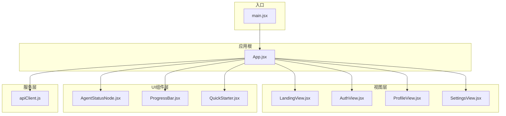
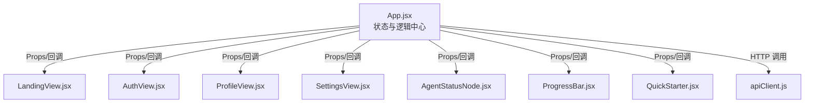
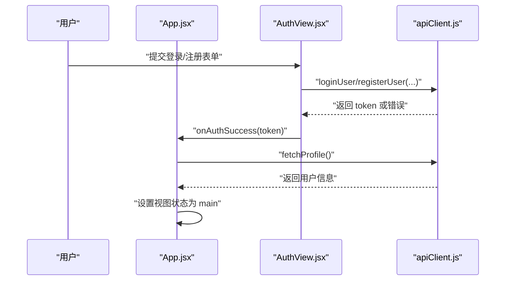
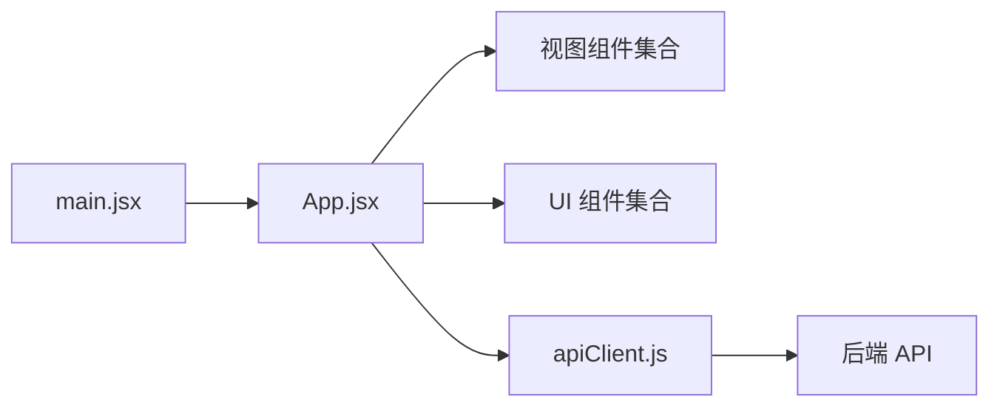

# 前端组件扩展

<cite>
**本文引用的文件**
- [src/web/src/App.jsx](file://src/web/src/App.jsx)
- [src/web/src/main.jsx](file://src/web/src/main.jsx)
- [src/web/src/components/views/AuthView.jsx](file://src/web/src/components/views/AuthView.jsx)
- [src/web/src/components/views/LandingView.jsx](file://src/web/src/components/views/LandingView.jsx)
- [src/web/src/components/views/ProfileView.jsx](file://src/web/src/components/views/ProfileView.jsx)
- [src/web/src/components/views/SettingsView.jsx](file://src/web/src/components/views/SettingsView.jsx)
- [src/web/src/components/ui/AgentStatusNode.jsx](file://src/web/src/components/ui/AgentStatusNode.jsx)
- [src/web/src/components/ui/ProgressBar.jsx](file://src/web/src/components/ui/ProgressBar.jsx)
- [src/web/src/components/ui/QuickStarter.jsx](file://src/web/src/components/ui/QuickStarter.jsx)
- [src/web/src/services/apiClient.js](file://src/web/src/services/apiClient.js)
- [src/web/src/index.css](file://src/web/src/index.css)
- [src/web/package.json](file://src/web/package.json)
- [src/web/vite.config.js](file://src/web/vite.config.js)
- [src/web/tailwind.config.js](file://src/web/tailwind.config.js)
- [src/web/postcss.config.js](file://src/web/postcss.config.js)
</cite>

## 目录
1. [简介](#简介)
2. [项目结构](#项目结构)
3. [核心组件](#核心组件)
4. [架构总览](#架构总览)
5. [组件详解](#组件详解)
6. [依赖关系分析](#依赖关系分析)
7. [性能考量](#性能考量)
8. [故障排查指南](#故障排查指南)
9. [结论](#结论)
10. [附录](#附录)

## 简介
本指南面向希望在现有前端代码基础上扩展新 React 组件的开发者，围绕组件设计原则、Props 定义、状态管理、事件处理、组件通信、上下文与 Hook 应用、样式与主题、响应式设计、测试、性能优化与可访问性最佳实践进行系统讲解。文档以仓库中的真实组件为范例，帮助你快速上手并高质量交付前端组件。

## 项目结构
前端采用 Vite + React + TailwindCSS 架构，组件按功能分层组织：
- 视图层：LandingView、AuthView、ProfileView、SettingsView
- UI 组件层：AgentStatusNode、ProgressBar、QuickStarter
- 服务层：apiClient 封装所有后端接口调用
- 根入口：main.jsx 引入全局样式与根组件 App.jsx

图表来源
- [src/web/src/main.jsx](file://src/web/src/main.jsx#L1-L11)
- [src/web/src/App.jsx](file://src/web/src/App.jsx#L1-L120)
- [src/web/src/components/views/LandingView.jsx](file://src/web/src/components/views/LandingView.jsx#L1-L64)
- [src/web/src/components/views/AuthView.jsx](file://src/web/src/components/views/AuthView.jsx#L1-L160)
- [src/web/src/components/views/ProfileView.jsx](file://src/web/src/components/views/ProfileView.jsx#L1-L342)
- [src/web/src/components/views/SettingsView.jsx](file://src/web/src/components/views/SettingsView.jsx#L1-L40)
- [src/web/src/components/ui/AgentStatusNode.jsx](file://src/web/src/components/ui/AgentStatusNode.jsx#L1-L17)
- [src/web/src/components/ui/ProgressBar.jsx](file://src/web/src/components/ui/ProgressBar.jsx#L1-L13)
- [src/web/src/components/ui/QuickStarter.jsx](file://src/web/src/components/ui/QuickStarter.jsx#L1-L15)
- [src/web/src/services/apiClient.js](file://src/web/src/services/apiClient.js#L1-L130)

章节来源
- [src/web/src/main.jsx](file://src/web/src/main.jsx#L1-L11)
- [src/web/src/App.jsx](file://src/web/src/App.jsx#L1-L120)
- [src/web/src/index.css](file://src/web/src/index.css#L1-L14)
- [src/web/package.json](file://src/web/package.json#L1-L33)
- [src/web/vite.config.js](file://src/web/vite.config.js#L1-L15)
- [src/web/tailwind.config.js](file://src/web/tailwind.config.js#L1-L9)
- [src/web/postcss.config.js](file://src/web/postcss.config.js#L1-L7)

## 核心组件
- 根组件 App.jsx：集中管理全局状态（查询、进度、日志、聊天、用户信息）、路由视图切换、定时器清理、Markdown 渲染、结果解析与摘要生成、Agent 输出卡片渲染等。
- 视图组件：LandingView（落地页）、AuthView（登录/注册）、ProfileView（个人资料）、SettingsView（设置）。
- UI 组件：AgentStatusNode（Agent 状态节点）、ProgressBar（进度条）、QuickStarter（快捷操作按钮）。
- 服务模块：apiClient.js 封装鉴权令牌、用户资料、会话、分析流程与聊天历史等 API。

章节来源
- [src/web/src/App.jsx](file://src/web/src/App.jsx#L1-L120)
- [src/web/src/components/views/LandingView.jsx](file://src/web/src/components/views/LandingView.jsx#L1-L64)
- [src/web/src/components/views/AuthView.jsx](file://src/web/src/components/views/AuthView.jsx#L1-L160)
- [src/web/src/components/views/ProfileView.jsx](file://src/web/src/components/views/ProfileView.jsx#L1-L342)
- [src/web/src/components/views/SettingsView.jsx](file://src/web/src/components/views/SettingsView.jsx#L1-L40)
- [src/web/src/components/ui/AgentStatusNode.jsx](file://src/web/src/components/ui/AgentStatusNode.jsx#L1-L17)
- [src/web/src/components/ui/ProgressBar.jsx](file://src/web/src/components/ui/ProgressBar.jsx#L1-L13)
- [src/web/src/components/ui/QuickStarter.jsx](file://src/web/src/components/ui/QuickStarter.jsx#L1-L15)
- [src/web/src/services/apiClient.js](file://src/web/src/services/apiClient.js#L1-L130)

## 架构总览
应用采用“容器组件 + 展示组件”混合模式：
- 容器组件：App.jsx 负责状态聚合、副作用与业务逻辑；视图组件负责页面布局与交互；UI 组件负责可复用的原子能力。
- 通信方式：父传子 Props、回调函数、全局状态（App.jsx 内部状态）、服务层统一调用后端接口。
- 样式与主题：TailwindCSS 提供原子化样式，深色主题由全局 CSS 与颜色变量组合实现。
- 响应式设计：通过 Tailwind 断点类与 Flex/Grid 布局实现自适应。

图表来源
- [src/web/src/App.jsx](file://src/web/src/App.jsx#L1-L120)
- [src/web/src/components/views/LandingView.jsx](file://src/web/src/components/views/LandingView.jsx#L1-L64)
- [src/web/src/components/views/AuthView.jsx](file://src/web/src/components/views/AuthView.jsx#L1-L160)
- [src/web/src/components/views/ProfileView.jsx](file://src/web/src/components/views/ProfileView.jsx#L1-L342)
- [src/web/src/components/views/SettingsView.jsx](file://src/web/src/components/views/SettingsView.jsx#L1-L40)
- [src/web/src/components/ui/AgentStatusNode.jsx](file://src/web/src/components/ui/AgentStatusNode.jsx#L1-L17)
- [src/web/src/components/ui/ProgressBar.jsx](file://src/web/src/components/ui/ProgressBar.jsx#L1-L13)
- [src/web/src/components/ui/QuickStarter.jsx](file://src/web/src/components/ui/QuickStarter.jsx#L1-L15)
- [src/web/src/services/apiClient.js](file://src/web/src/services/apiClient.js#L1-L130)

## 组件详解

### 设计原则与 Props 定义
- 单一职责：每个组件聚焦一个功能域，如 AuthView 仅处理认证表单，ProfileView 仅处理资料编辑。
- 明确的 Props 接口：父组件向子组件传递状态与回调，子组件通过回调向上反馈事件，避免跨层级直接修改父状态。
- 可复用性：UI 组件（如 AgentStatusNode、ProgressBar、QuickStarter）通过 Props 控制外观与行为，便于在不同场景复用。

章节来源
- [src/web/src/components/views/AuthView.jsx](file://src/web/src/components/views/AuthView.jsx#L5-L37)
- [src/web/src/components/views/ProfileView.jsx](file://src/web/src/components/views/ProfileView.jsx#L5-L59)
- [src/web/src/components/ui/AgentStatusNode.jsx](file://src/web/src/components/ui/AgentStatusNode.jsx#L4-L14)
- [src/web/src/components/ui/ProgressBar.jsx](file://src/web/src/components/ui/ProgressBar.jsx#L3-L9)
- [src/web/src/components/ui/QuickStarter.jsx](file://src/web/src/components/ui/QuickStarter.jsx#L4-L11)

### 状态管理与事件处理
- 全局状态：App.jsx 使用 useState 管理查询、进度、日志、聊天、用户信息、分析结果等；useEffect 管理鉴权初始化、点击外部关闭菜单、自动滚动、轮询工作流状态等。
- 本地状态：视图与 UI 组件内部使用 useState 管理表单字段、加载态、错误信息、编辑态等。
- 事件处理：统一通过回调函数（如 handleViewChange、handleLogout、handleChatSubmit）与服务层交互，保证状态变更路径清晰。

图表来源
- [src/web/src/components/views/AuthView.jsx](file://src/web/src/components/views/AuthView.jsx#L15-L37)
- [src/web/src/services/apiClient.js](file://src/web/src/services/apiClient.js#L43-L55)
- [src/web/src/App.jsx](file://src/web/src/App.jsx#L54-L74)

章节来源
- [src/web/src/App.jsx](file://src/web/src/App.jsx#L26-L74)
- [src/web/src/components/views/AuthView.jsx](file://src/web/src/components/views/AuthView.jsx#L15-L37)
- [src/web/src/components/views/ProfileView.jsx](file://src/web/src/components/views/ProfileView.jsx#L61-L118)

### 组件间通信模式
- 父子通信：App.jsx 通过 Props 向 LandingView、AuthView、ProfileView、SettingsView 传递 setViewState 等回调；子组件通过回调改变视图状态。
- 回调上行：AuthView 的 onAuthSuccess 将 token 传回 App.jsx，App.jsx 再拉取用户资料并切换视图。
- UI 组件复用：App.jsx 将状态与格式化函数（如 formatAgentLabel、deriveStageProgress）传递给 UI 组件，实现统一展示。

章节来源
- [src/web/src/App.jsx](file://src/web/src/App.jsx#L694-L710)
- [src/web/src/components/views/AuthView.jsx](file://src/web/src/components/views/AuthView.jsx#L23-L30)
- [src/web/src/components/ui/AgentStatusNode.jsx](file://src/web/src/components/ui/AgentStatusNode.jsx#L4-L14)

### Context 使用建议
- 当前项目未使用 React Context。若未来需要在多层级组件共享用户信息、主题或语言偏好，建议：
  - 创建 Context 并提供 Provider 包裹根组件。
  - 在子组件中使用 useContext 获取值，避免逐层传递 Props。
  - 结合 useReducer 管理复杂状态树，提升可维护性。

[本节为概念性指导，不直接分析具体文件]

### Hook 应用
- useState：用于管理本地与全局状态（查询、进度、日志、聊天、用户信息、编辑态等）。
- useEffect：用于副作用（鉴权初始化、点击外部关闭菜单、自动滚动、轮询工作流状态）。
- useRef：用于 DOM 引用（菜单容器、滚动锚点），避免不必要的重渲染。
- 自定义 Hook：可将通用逻辑抽取为自定义 Hook（如 useApi、useAuth、useChat），提升复用与测试性。

章节来源
- [src/web/src/App.jsx](file://src/web/src/App.jsx#L26-L74)
- [src/web/src/components/views/ProfileView.jsx](file://src/web/src/components/views/ProfileView.jsx#L16-L48)

### 开发新组件示例

#### UI 组件示例：状态指示器
- 功能：根据状态（待定/进行中/完成/失败）展示不同图标与样式。
- Props：icon、label、status。
- 设计要点：使用 Tailwind 类名映射状态到视觉样式，确保无障碍标签与动画过渡。

章节来源
- [src/web/src/components/ui/AgentStatusNode.jsx](file://src/web/src/components/ui/AgentStatusNode.jsx#L4-L14)

#### 业务组件示例：进度条
- 功能：展示分析流程进度百分比。
- Props：progress。
- 设计要点：宽度通过内联样式动态计算，过渡动画平滑。

章节来源
- [src/web/src/components/ui/ProgressBar.jsx](file://src/web/src/components/ui/ProgressBar.jsx#L3-L9)

#### 容器组件示例：快捷启动
- 功能：触发查询建议，简化用户输入。
- Props：text、onClick。
- 设计要点：点击回调由父组件注入，保持组件解耦。

章节来源
- [src/web/src/components/ui/QuickStarter.jsx](file://src/web/src/components/ui/QuickStarter.jsx#L4-L11)

#### 视图组件示例：登录/注册
- 功能：表单校验、加载态、错误提示、视图切换。
- Props：viewState、setViewState、onAuthSuccess。
- 设计要点：区分登录/注册分支，统一错误处理与加载态。

章节来源
- [src/web/src/components/views/AuthView.jsx](file://src/web/src/components/views/AuthView.jsx#L5-L37)

#### 视图组件示例：个人资料
- 功能：分组编辑昵称、邮箱、手机号、密码；保存成功后回调更新用户信息。
- Props：setViewState、user、onProfileUpdated。
- 设计要点：焦点管理、条件渲染、错误提示、保存状态。

章节来源
- [src/web/src/components/views/ProfileView.jsx](file://src/web/src/components/views/ProfileView.jsx#L5-L59)

### 样式管理、主题定制与响应式设计
- 原子化样式：使用 TailwindCSS 类名组合，减少自定义样式编写。
- 主题定制：通过全局 CSS 设置 color-scheme 与背景色，配合语义化颜色类名实现深色主题。
- 响应式设计：利用 Tailwind 断点类（sm/md/lg）与 Flex/Grid 布局适配不同屏幕尺寸。

章节来源
- [src/web/src/index.css](file://src/web/src/index.css#L5-L13)
- [src/web/tailwind.config.js](file://src/web/tailwind.config.js#L1-L9)
- [src/web/src/components/views/LandingView.jsx](file://src/web/src/components/views/LandingView.jsx#L32-L52)
- [src/web/src/components/views/ProfileView.jsx](file://src/web/src/components/views/ProfileView.jsx#L132-L161)

### 组件测试、性能优化与可访问性最佳实践
- 测试
  - 单元测试：针对纯函数（如 formatAgentLabel、parseResult、buildSummary）编写测试，验证输入输出。
  - 组件测试：使用测试库模拟 props 与事件，断言渲染内容与交互行为。
  - Mock 服务：对 apiClient 进行 Mock，隔离网络依赖。
- 性能优化
  - 状态最小化：仅在必要时提升状态到 App.jsx，减少重渲染范围。
  - 副作用清理：useEffect 返回清理函数（如定时器、事件监听），防止内存泄漏。
  - 懒加载与分割：对大型视图组件按需加载。
  - 图标与资源：使用矢量图标（lucide-react），避免大体积图片。
- 可访问性
  - 语义化标签：使用 button、label、fieldset 等。
  - 键盘导航：确保可聚焦元素支持 Enter/Space 激活。
  - 屏幕阅读器友好：为图标提供 aria-label，表单添加 label。
  - 对比度与色彩：遵循深色主题下的对比度要求，避免仅靠颜色传达信息。

[本节为通用最佳实践，不直接分析具体文件]

## 依赖关系分析
- 依赖注入：main.jsx 注入全局样式与根组件；App.jsx 作为唯一容器承载所有状态与逻辑。
- 组件依赖：视图组件依赖 UI 组件与服务层；UI 组件保持无副作用、可复用。
- 工具与构建：Vite 提供开发服务器与打包；TailwindCSS 与 PostCSS 负责样式管线。

图表来源
- [src/web/src/main.jsx](file://src/web/src/main.jsx#L1-L11)
- [src/web/src/App.jsx](file://src/web/src/App.jsx#L1-L120)
- [src/web/src/services/apiClient.js](file://src/web/src/services/apiClient.js#L1-L130)

章节来源
- [src/web/src/main.jsx](file://src/web/src/main.jsx#L1-L11)
- [src/web/src/App.jsx](file://src/web/src/App.jsx#L1-L120)
- [src/web/package.json](file://src/web/package.json#L12-L31)
- [src/web/vite.config.js](file://src/web/vite.config.js#L1-L15)

## 性能考量
- 状态下沉：将高频更新的状态局部化，避免不必要的重渲染。
- 渲染优化：对长列表（如聊天记录、Agent 输出卡片）使用虚拟化或分页。
- 请求去抖：对用户输入触发的查询使用防抖，减少无效请求。
- 缓存策略：对静态数据与重复请求进行缓存，降低网络开销。
- 图标与媒体：按需引入图标，避免一次性加载过多资源。

[本节为通用指导，不直接分析具体文件]

## 故障排查指南
- 鉴权失败
  - 现象：登录后无法进入主界面。
  - 排查：检查 token 是否写入 localStorage，fetchProfile 是否抛错，onAuthSuccess 回调是否正确调用。
- 聊天历史为空
  - 现象：进入主界面后聊天历史未加载。
  - 排查：确认会话 ID 是否存在，fetchChatHistory 是否返回数据，异常时是否清空历史。
- 工作流状态不更新
  - 现象：进度条不动、日志不刷新。
  - 排查：确认定时器是否启动与清理，getWorkflowStatus 是否返回预期数据，parseResult 与 buildSummary 是否正确处理字符串/对象。

章节来源
- [src/web/src/services/apiClient.js](file://src/web/src/services/apiClient.js#L57-L59)
- [src/web/src/App.jsx](file://src/web/src/App.jsx#L332-L344)
- [src/web/src/App.jsx](file://src/web/src/App.jsx#L217-L268)

## 结论
通过遵循单一职责、明确 Props、合理使用 Hook、统一服务层与样式体系，可以在现有项目上高效扩展高质量的前端组件。建议优先从 UI 组件与视图组件入手，逐步引入 Context 与自定义 Hook，持续完善测试与性能优化，最终形成可维护、可扩展的组件库。

## 附录
- 构建与运行
  - 开发：npm run dev
  - 构建：npm run build
  - 预览：npm run preview
- 环境变量
  - Vite 通过 define 将环境变量注入客户端代码，注意不要暴露敏感信息。
- 样式工具链
  - TailwindCSS + PostCSS + Autoprefixer，确保类名与浏览器兼容。

章节来源
- [src/web/package.json](file://src/web/package.json#L6-L11)
- [src/web/vite.config.js](file://src/web/vite.config.js#L9-L12)
- [src/web/postcss.config.js](file://src/web/postcss.config.js#L1-L6)