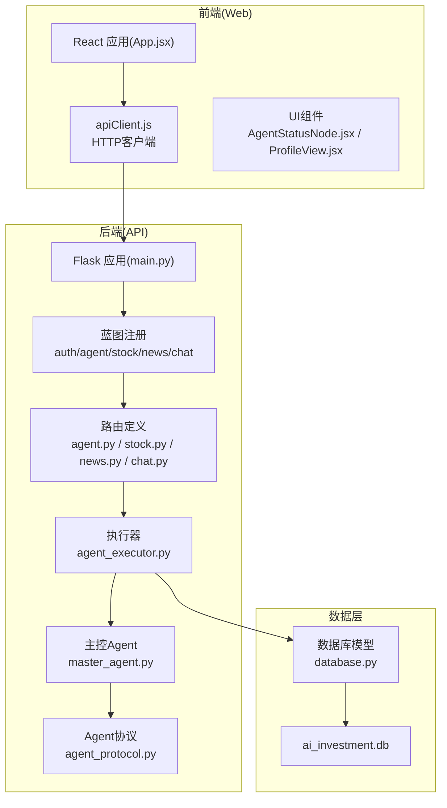
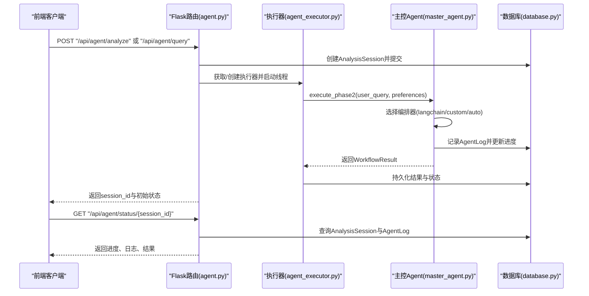
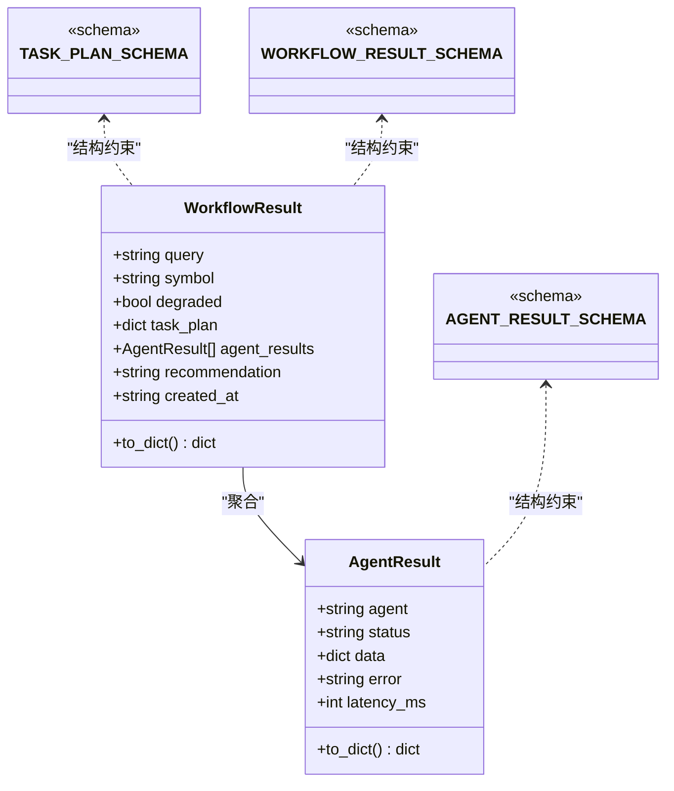
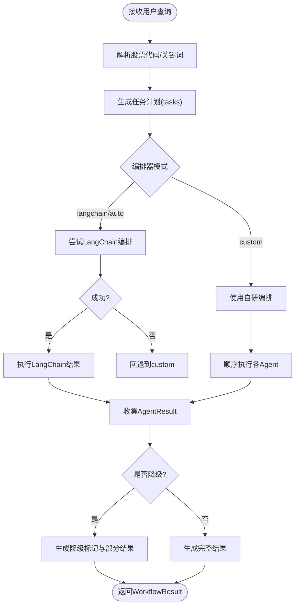
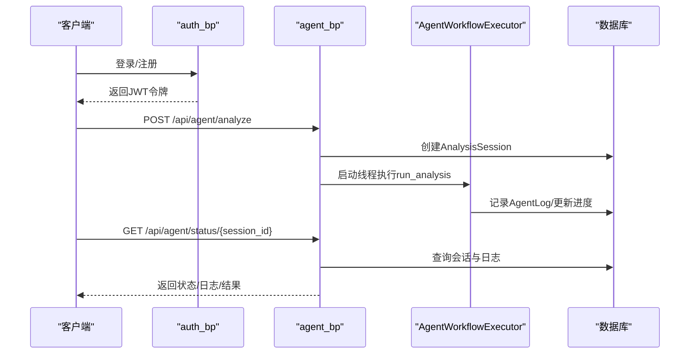
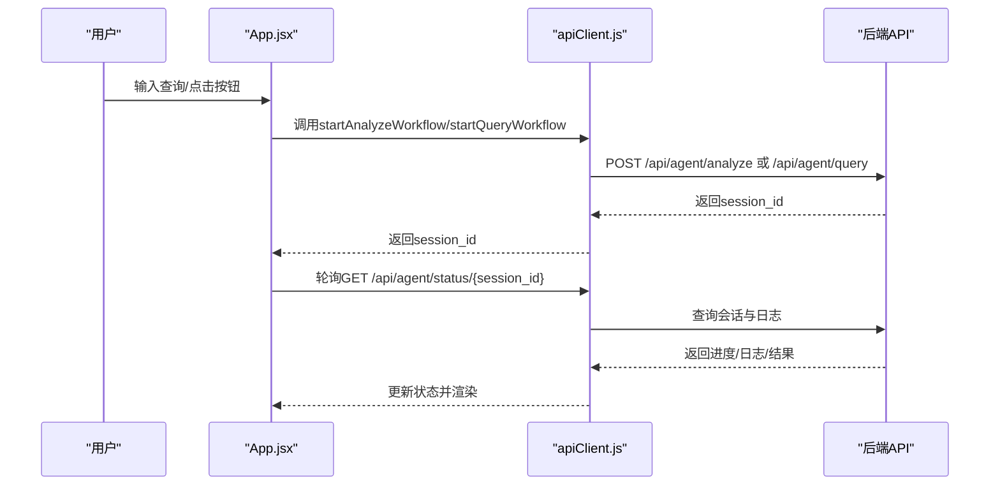
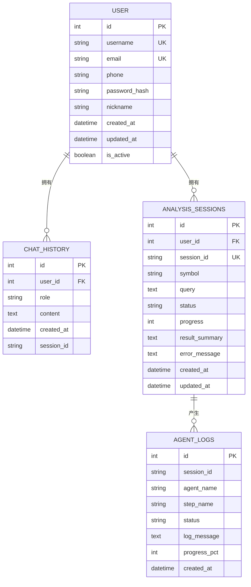
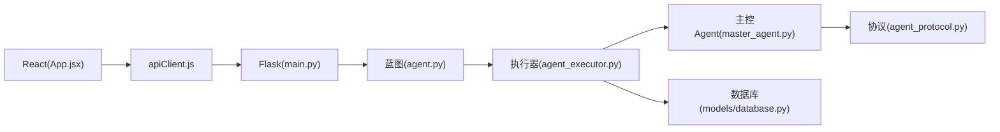

# 扩展开发指南

<cite>
**本文档引用的文件**
- [README.md](file://README.md)
- [AGENTS.md](file://AGENTS.md)
- [src/agent/agent_protocol.py](file://src/agent/agent_protocol.py)
- [src/agent/master_agent.py](file://src/agent/master_agent.py)
- [src/agent/README.md](file://src/agent/README.md)
- [src/api/main.py](file://src/api/main.py)
- [src/api/agent.py](file://src/api/agent.py)
- [src/api/agent_executor.py](file://src/api/agent_executor.py)
- [src/models/database.py](file://src/models/database.py)
- [src/web/src/App.jsx](file://src/web/src/App.jsx)
- [src/web/src/services/apiClient.js](file://src/web/src/services/apiClient.js)
- [src/web/src/components/ui/AgentStatusNode.jsx](file://src/web/src/components/ui/AgentStatusNode.jsx)
- [src/web/src/components/views/ProfileView.jsx](file://src/web/src/components/views/ProfileView.jsx)
- [run.py](file://run.py)
</cite>

## 目录
1. [简介](#简介)
2. [项目结构](#项目结构)
3. [核心组件](#核心组件)
4. [架构总览](#架构总览)
5. [详细组件分析](#详细组件分析)
6. [依赖关系分析](#依赖关系分析)
7. [性能考量](#性能考量)
8. [故障排查指南](#故障排查指南)
9. [结论](#结论)
10. [附录](#附录)

## 简介
本指南面向希望在现有AI投资分析系统上进行扩展开发的工程师，提供从Agent类型扩展、API接口扩展、前端组件开发到数据库Schema变更的全流程指导。文档基于仓库中的实际代码实现，强调可落地的最佳实践与扩展示例，帮助开发者快速理解并实现自定义功能。

## 项目结构
项目采用前后端分离架构：后端使用Flask提供REST API，前端使用React/Vite构建用户界面；数据层通过SQLAlchemy访问SQLite/可切换数据库；Agent编排层支持LangChain与自研编排器双轨并行与自动降级。

**图表来源**
- [src/web/src/App.jsx](file://src/web/src/App.jsx#L1-L120)
- [src/web/src/services/apiClient.js](file://src/web/src/services/apiClient.js#L1-L130)
- [src/api/main.py](file://src/api/main.py#L40-L84)
- [src/api/agent.py](file://src/api/agent.py#L17-L108)
- [src/api/agent_executor.py](file://src/api/agent_executor.py#L25-L92)
- [src/agent/master_agent.py](file://src/agent/master_agent.py#L24-L40)
- [src/agent/agent_protocol.py](file://src/agent/agent_protocol.py#L74-L116)
- [src/models/database.py](file://src/models/database.py#L24-L86)

**章节来源**
- [README.md](file://README.md#L24-L40)
- [src/agent/README.md](file://src/agent/README.md#L1-L59)

## 核心组件
- Agent协议与统一输出：定义任务计划、Agent结果与工作流结果的结构化Schema，确保不同Agent可替换与降级。
- 主控Agent：负责任务分解、编排器选择（LangChain或自研）、子Agent调度与最终汇总。
- API执行器：封装异步工作流执行、状态持久化与日志记录，提供统一的状态查询接口。
- 数据库模型：用户、聊天历史、分析会话、Agent日志等核心实体。
- 前端应用：React组件驱动的交互界面，通过apiClient.js与后端通信。

**章节来源**
- [src/agent/agent_protocol.py](file://src/agent/agent_protocol.py#L16-L116)
- [src/agent/master_agent.py](file://src/agent/master_agent.py#L24-L351)
- [src/api/agent_executor.py](file://src/api/agent_executor.py#L25-L282)
- [src/models/database.py](file://src/models/database.py#L24-L86)
- [src/web/src/App.jsx](file://src/web/src/App.jsx#L183-L270)

## 架构总览
后端通过Flask蓝图组织API，Agent工作流由AgentWorkflowExecutor异步执行，主控Agent根据环境变量选择编排器（LangChain或自研），并将统一的WorkflowResult返回给前端。

**图表来源**
- [src/api/agent.py](file://src/api/agent.py#L20-L108)
- [src/api/agent_executor.py](file://src/api/agent_executor.py#L93-L186)
- [src/agent/master_agent.py](file://src/agent/master_agent.py#L155-L318)
- [src/models/database.py](file://src/models/database.py#L53-L86)

## 详细组件分析

### Agent协议与消息格式
- 任务计划Schema(task_plan)：包含查询语句、关联股票代码、任务数组（agent、task、params）。
- Agent结果Schema(agent_result)：包含agent标识、状态(completed/failed/skipped)、数据、错误信息、耗时(ms)。
- 工作流结果Schema(workflow_result)：包含查询、符号、降级标记、任务计划、各Agent结果、最终建议、创建时间。
- 数据类AgentResult与WorkflowResult：提供to_dict序列化方法，便于API响应与数据库存储。

**图表来源**
- [src/agent/agent_protocol.py](file://src/agent/agent_protocol.py#L16-L116)

**章节来源**
- [src/agent/agent_protocol.py](file://src/agent/agent_protocol.py#L16-L116)

### 主控Agent生命周期与编排
- 符号解析与关键词抽取：支持从用户查询中提取股票代码与关键词，用于任务规划。
- 任务计划生成：根据是否有股票代码决定是否执行数据Agent；新闻与知识Agent始终参与；分析Agent负责综合生成建议。
- 编排器切换：通过环境变量控制优先使用LangChain或自研编排，异常时自动回退并记录原因。
- 执行阶段：依次调用StockAgent、NewsAgent、KnowledgeAgent、AnalysisAgent，收集AgentResult并生成WorkflowResult。

**图表来源**
- [src/agent/master_agent.py](file://src/agent/master_agent.py#L137-L318)

**章节来源**
- [src/agent/master_agent.py](file://src/agent/master_agent.py#L24-L351)
- [src/agent/README.md](file://src/agent/README.md#L40-L59)

### API接口扩展指南
- 蓝图创建：在src/api目录新增模块，定义Blueprint并注册路由前缀。
- 路由定义：在蓝图中添加HTTP方法与路径，使用get_current_user鉴权，必要时访问数据库模型。
- 参数验证：对请求体字段进行校验，返回400错误与明确错误信息。
- 响应格式化：统一返回JSON结构，包含状态码、消息与数据；错误处理器捕获404/500/401并格式化响应。
- 异步工作流：如需长时间任务，参考agent.py中的会话创建与agent_executor.py中的执行器模式，避免阻塞主线程。

**图表来源**
- [src/api/main.py](file://src/api/main.py#L52-L56)
- [src/api/agent.py](file://src/api/agent.py#L20-L108)
- [src/api/agent_executor.py](file://src/api/agent_executor.py#L93-L186)

**章节来源**
- [src/api/main.py](file://src/api/main.py#L40-L235)
- [src/api/agent.py](file://src/api/agent.py#L1-L208)
- [src/api/agent_executor.py](file://src/api/agent_executor.py#L25-L282)

### 前端组件开发指南
- React组件开发：遵循PascalCase命名，使用useState/useEffect管理状态与副作用；组件间通过props传递数据。
- 状态管理：在App.jsx中集中管理查询、进度、日志、分析结果、聊天历史等状态；通过ref管理定时器与DOM引用。
- 事件处理：登录/注册、发起分析、查询状态、发送聊天消息等事件通过apiClient.js封装的函数调用后端API。
- UI设计规范：使用Tailwind CSS类名，组件样式保持一致性；图标使用lucide-react；通过条件渲染与状态映射实现不同视图。

**图表来源**
- [src/web/src/App.jsx](file://src/web/src/App.jsx#L183-L270)
- [src/web/src/services/apiClient.js](file://src/web/src/services/apiClient.js#L85-L103)

**章节来源**
- [src/web/src/App.jsx](file://src/web/src/App.jsx#L1-L120)
- [src/web/src/services/apiClient.js](file://src/web/src/services/apiClient.js#L1-L130)
- [src/web/src/components/ui/AgentStatusNode.jsx](file://src/web/src/components/ui/AgentStatusNode.jsx#L1-L17)
- [src/web/src/components/views/ProfileView.jsx](file://src/web/src/components/views/ProfileView.jsx#L1-L342)

### 数据库Schema变更流程与迁移策略
- 新增表：在models/database.py中定义新表类，继承Base；确保主键、索引、外键与字段类型符合业务需求。
- 初始化与连接：在api/main.py中调用init_db()初始化数据库；通过models.get_db()/SessionLocal()获取会话。
- 迁移策略：
  - 小规模变更：直接修改模型类并重建数据库（开发环境）。
  - 生产环境：建议使用Alembic等迁移工具生成迁移脚本，逐步升级；变更前备份数据库。
- 数据模型扩展：新增字段时提供默认值或可空约束；对外键关系进行一致性校验；为高频查询字段建立索引。

**图表来源**
- [src/models/database.py](file://src/models/database.py#L24-L86)

**章节来源**
- [src/models/database.py](file://src/models/database.py#L1-L86)
- [src/api/main.py](file://src/api/main.py#L22-L50)

### 扩展示例与最佳实践

#### 示例1：开发新的Agent类型
- 步骤
  - 在src/agent目录新增Agent类，实现统一的输入输出结构（参考AgentResult/WorkflowResult）。
  - 在master_agent.py的任务计划生成逻辑中加入新Agent的task条目。
  - 在AgentWorkflowExecutor中记录AgentLog并更新进度。
  - 在前端App.jsx中渲染新Agent的输出卡片与状态节点。
- 最佳实践
  - 严格遵守Agent协议Schema，保证可替换性与降级兼容。
  - 对外部API调用进行超时与重试处理，失败时返回明确错误信息。
  - 使用日志记录关键步骤与耗时，便于监控与排障。

**章节来源**
- [src/agent/agent_protocol.py](file://src/agent/agent_protocol.py#L74-L116)
- [src/agent/master_agent.py](file://src/agent/master_agent.py#L137-L153)
- [src/api/agent_executor.py](file://src/api/agent_executor.py#L57-L92)
- [src/web/src/App.jsx](file://src/web/src/App.jsx#L416-L644)

#### 示例2：扩展API接口
- 步骤
  - 在src/api目录创建新模块（如src/api/portfolio.py），定义Blueprint与路由。
  - 在src/api/main.py中注册蓝图并设置url_prefix。
  - 在路由中进行参数校验与鉴权，调用业务逻辑并返回统一JSON结构。
- 最佳实践
  - 使用错误处理器统一处理404/500/401。
  - 对敏感操作增加权限校验与审计日志。
  - 对长耗时任务采用异步执行与状态轮询。

**章节来源**
- [src/api/main.py](file://src/api/main.py#L52-L56)
- [src/api/agent.py](file://src/api/agent.py#L17-L108)

#### 示例3：前端组件开发
- 步骤
  - 在src/web/src/components目录新增组件，遵循PascalCase命名与Tailwind类名规范。
  - 在App.jsx中引入组件并通过状态驱动渲染。
  - 通过apiClient.js封装HTTP请求，处理错误与加载状态。
- 最佳实践
  - 使用useEffect管理副作用与定时器清理。
  - 对用户输入进行防抖与校验，提升交互体验。
  - 组件间通过props传递数据，避免全局状态污染。

**章节来源**
- [src/web/src/App.jsx](file://src/web/src/App.jsx#L1-L120)
- [src/web/src/services/apiClient.js](file://src/web/src/services/apiClient.js#L1-L130)
- [src/web/src/components/ui/AgentStatusNode.jsx](file://src/web/src/components/ui/AgentStatusNode.jsx#L1-L17)
- [src/web/src/components/views/ProfileView.jsx](file://src/web/src/components/views/ProfileView.jsx#L1-L342)

#### 示例4：数据库Schema变更
- 步骤
  - 在models/database.py中定义新表类，确保字段类型与约束合理。
  - 在api/main.py中初始化数据库，确保新表创建成功。
  - 如需生产迁移，使用迁移工具生成脚本并逐步部署。
- 最佳实践
  - 变更前备份数据库，制定回滚方案。
  - 为高频查询字段建立索引，避免全表扫描。
  - 对外键关系进行一致性校验，防止脏数据。

**章节来源**
- [src/models/database.py](file://src/models/database.py#L1-L86)
- [src/api/main.py](file://src/api/main.py#L22-L50)

## 依赖关系分析
- 后端依赖：Flask、SQLAlchemy、第三方数据源SDK；蓝图模块化组织API；执行器与主控Agent解耦。
- 前端依赖：React、Vite、TailwindCSS、Recharts；通过apiClient.js统一管理HTTP请求。
- 数据库：默认SQLite，支持通过环境变量切换其他数据库；模型定义清晰，关系明确。

**图表来源**
- [src/api/main.py](file://src/api/main.py#L40-L84)
- [src/api/agent.py](file://src/api/agent.py#L17-L108)
- [src/api/agent_executor.py](file://src/api/agent_executor.py#L25-L92)
- [src/agent/master_agent.py](file://src/agent/master_agent.py#L24-L40)
- [src/agent/agent_protocol.py](file://src/agent/agent_protocol.py#L74-L116)
- [src/models/database.py](file://src/models/database.py#L24-L86)
- [src/web/src/App.jsx](file://src/web/src/App.jsx#L1-L120)
- [src/web/src/services/apiClient.js](file://src/web/src/services/apiClient.js#L1-L130)

**章节来源**
- [README.md](file://README.md#L16-L22)
- [src/agent/README.md](file://src/agent/README.md#L1-L59)

## 性能考量
- 异步执行：后端使用线程池执行长时间任务，避免阻塞请求；前端轮询状态，减少等待时间。
- 日志与监控：在Agent执行器中记录阶段日志与进度，便于定位瓶颈与异常。
- 编排器切换：LangChain编排器优先，异常时自动回退自研编排，保障稳定性。
- 前端优化：组件按需渲染、定时器及时清理、防抖处理高频交互。

[本节为通用指导，无需特定文件分析]

## 故障排查指南
- 后端启动与导入错误：确认在项目根目录运行run.py，检查PYTHONPATH与依赖安装。
- 前端无法启动：确认Node.js与npm版本，执行npm install后再启动。
- API调用失败：检查网络连通性、JWT令牌有效性与权限；查看后端日志与错误处理器返回信息。
- 数据异常：检查数据库连接字符串与迁移状态；核对模型字段与索引配置。
- Agent执行异常：查看AgentLog与AnalysisSession记录，定位失败阶段与错误信息。

**章节来源**
- [run.py](file://run.py#L1-L60)
- [README.md](file://README.md#L205-L211)
- [src/api/main.py](file://src/api/main.py#L222-L234)

## 结论
本指南提供了从Agent协议、主控编排、API扩展、前端组件到数据库Schema变更的系统化扩展路径。通过遵循统一的消息格式、异步执行与状态持久化、组件化与模块化设计，开发者可以高效地在现有系统上实现自定义功能，并保持良好的可维护性与可扩展性。

[本节为总结，无需特定文件分析]

## 附录
- 快速启动：在项目根目录执行run.py，默认启动前端开发服务器；也可分别启动后端或前端。
- 环境变量：支持数据库URL、日志级别、Agent编排器模式等配置。
- 测试：后端使用pytest，前端使用ESLint与组件测试工具。

**章节来源**
- [README.md](file://README.md#L48-L96)
- [AGENTS.md](file://AGENTS.md#L9-L46)
- [run.py](file://run.py#L35-L56)