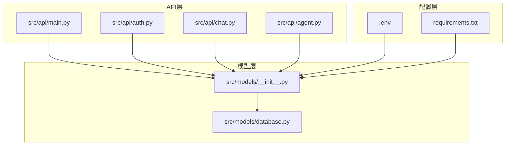
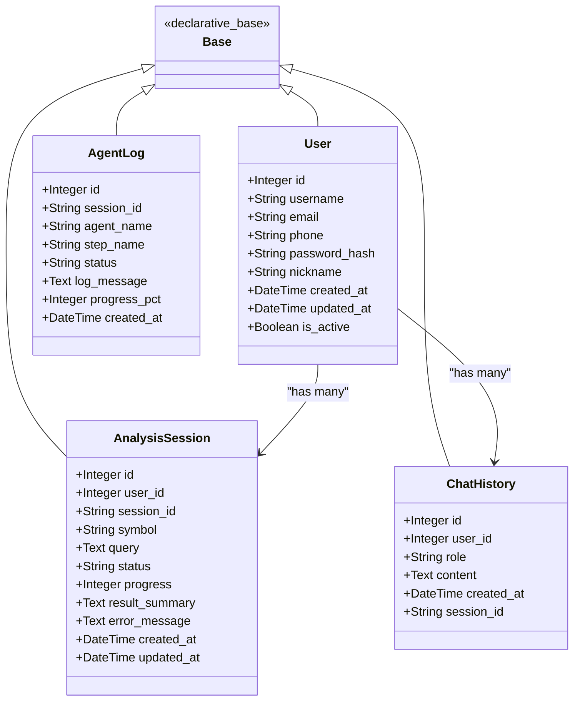
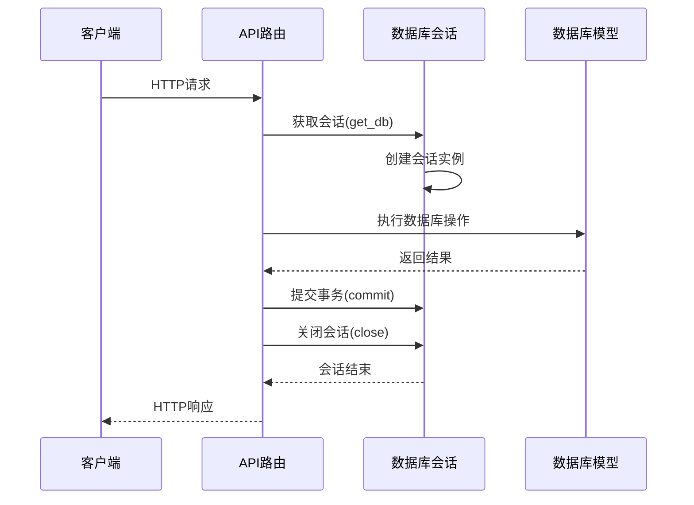
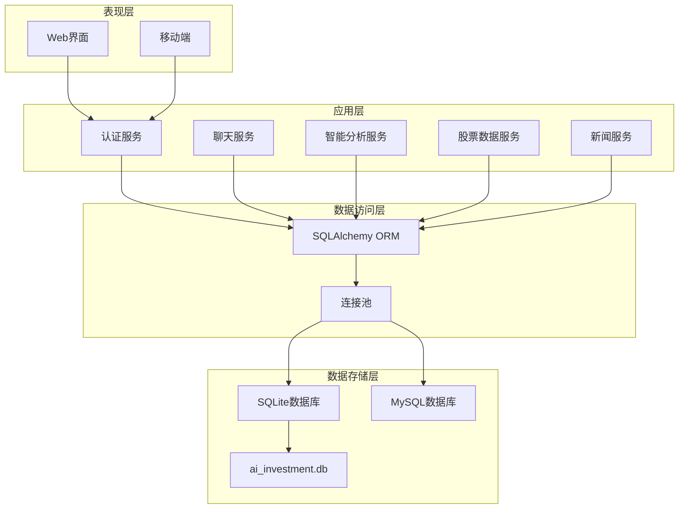
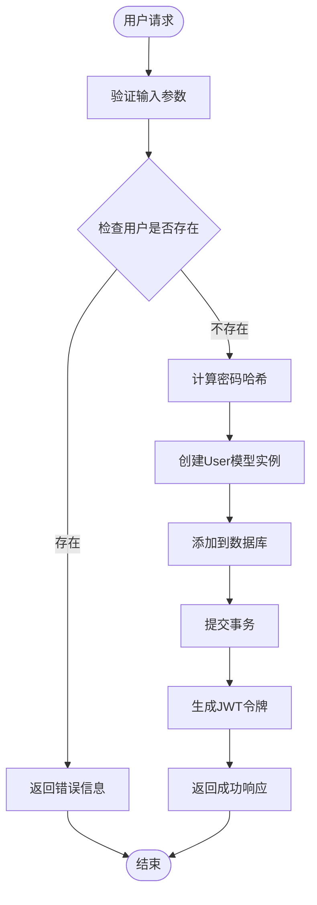
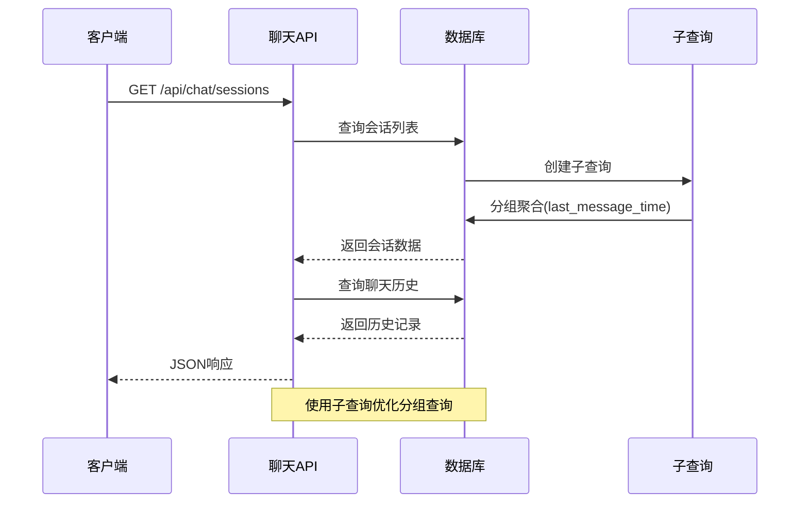
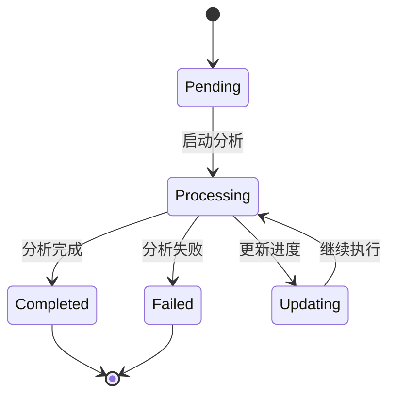
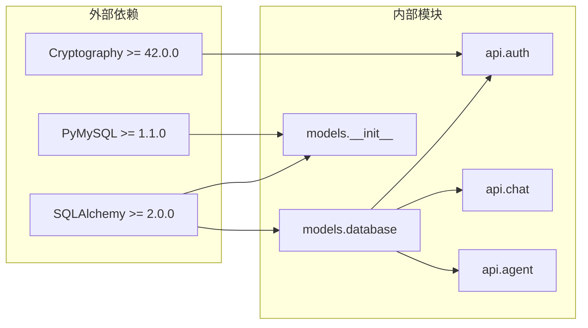
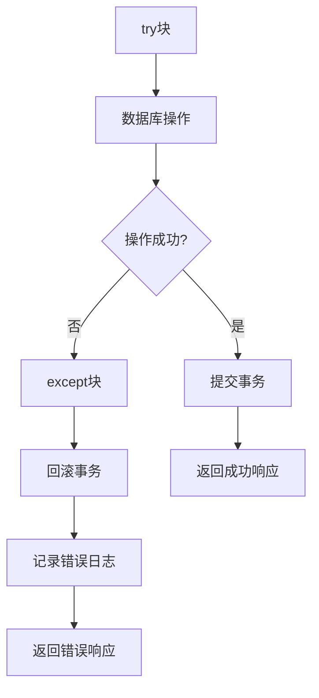

# 数据库Schema扩展

<cite>
**本文档引用的文件**
- [src/models/database.py](file://src/models/database.py)
- [src/models/__init__.py](file://src/models/__init__.py)
- [src/api/main.py](file://src/api/main.py)
- [src/api/auth.py](file://src/api/auth.py)
- [src/api/chat.py](file://src/api/chat.py)
- [src/api/agent.py](file://src/api/agent.py)
- [src/api/agent_executor.py](file://src/api/agent_executor.py)
- [.env](file://.env)
- [.env.example](file://.env.example)
- [requirements.txt](file://requirements.txt)
</cite>

## 目录
1. [简介](#简介)
2. [项目结构](#项目结构)
3. [核心组件](#核心组件)
4. [架构概览](#架构概览)
5. [详细组件分析](#详细组件分析)
6. [依赖关系分析](#依赖关系分析)
7. [性能考虑](#性能考虑)
8. [故障排除指南](#故障排除指南)
9. [结论](#结论)
10. [附录](#附录)

## 简介

本指南专注于AI投资分析系统的数据库Schema扩展开发。该系统基于SQLAlchemy ORM构建，采用SQLite作为默认数据库，并支持MySQL等关系型数据库。项目通过声明式ORM模型定义数据库表结构，使用Flask API提供RESTful接口，并实现了完整的用户认证、聊天历史管理和智能分析工作流功能。

本指南将详细说明如何扩展数据库模型，包括表结构设计、字段定义、关系建立、索引优化，以及SQLAlchemy ORM的使用方法、模型继承、查询优化策略。同时提供具体的Schema扩展示例，涵盖新表创建、现有表修改、数据迁移策略，以及数据库版本管理、备份恢复、性能监控的最佳实践。

## 项目结构

项目采用分层架构设计，数据库相关的核心组件分布如下：

**图表来源**
- [src/api/main.py](file://src/api/main.py#L22-L50)
- [src/models/__init__.py](file://src/models/__init__.py#L8-L22)
- [.env](file://.env#L39-L41)

项目采用模块化设计，每个API蓝图负责特定的功能领域，数据库模型集中管理，会话管理统一处理。

**章节来源**
- [src/models/database.py](file://src/models/database.py#L1-L86)
- [src/models/__init__.py](file://src/models/__init__.py#L1-L33)
- [src/api/main.py](file://src/api/main.py#L1-L243)

## 核心组件

### 数据库模型基类

系统使用SQLAlchemy声明式基类作为所有模型的基础：

**图表来源**
- [src/models/database.py](file://src/models/database.py#L21-L86)

### 数据库会话管理

系统提供了统一的数据库会话管理机制：

**图表来源**
- [src/models/__init__.py](file://src/models/__init__.py#L25-L32)
- [src/api/auth.py](file://src/api/auth.py#L36-L75)

**章节来源**
- [src/models/database.py](file://src/models/database.py#L24-L86)
- [src/models/__init__.py](file://src/models/__init__.py#L8-L32)

## 架构概览

系统采用三层架构设计，数据库层通过SQLAlchemy ORM抽象实现：

**图表来源**
- [src/api/main.py](file://src/api/main.py#L40-L56)
- [src/models/__init__.py](file://src/models/__init__.py#L14-L17)

系统支持多种数据库后端，通过环境变量配置实现灵活切换。

**章节来源**
- [src/api/main.py](file://src/api/main.py#L40-L83)
- [src/models/__init__.py](file://src/models/__init__.py#L14-L22)

## 详细组件分析

### 用户认证系统

用户认证系统是数据库Schema扩展的重要参考案例：

**图表来源**
- [src/api/auth.py](file://src/api/auth.py#L23-L75)

**章节来源**
- [src/api/auth.py](file://src/api/auth.py#L18-L136)
- [src/models/database.py](file://src/models/database.py#L24-L37)

### 聊天历史管理系统

聊天历史管理展示了复杂关联查询的实现：

**图表来源**
- [src/api/chat.py](file://src/api/chat.py#L103-L143)

**章节来源**
- [src/api/chat.py](file://src/api/chat.py#L59-L146)
- [src/models/database.py](file://src/models/database.py#L40-L50)

### 分析会话工作流

分析会话系统体现了复杂业务流程的数据持久化：

**图表来源**
- [src/models/database.py](file://src/models/database.py#L53-L70)
- [src/api/agent.py](file://src/api/agent.py#L20-L64)

**章节来源**
- [src/api/agent.py](file://src/api/agent.py#L20-L108)
- [src/models/database.py](file://src/models/database.py#L53-L85)

## 依赖关系分析

系统数据库依赖关系清晰明确：

**图表来源**
- [requirements.txt](file://requirements.txt#L7-L9)
- [src/models/database.py](file://src/models/database.py#L8-L17)

**章节来源**
- [requirements.txt](file://requirements.txt#L1-L41)
- [src/models/__init__.py](file://src/models/__init__.py#L8-L17)

## 性能考虑

### 索引优化策略

系统已在关键字段上建立了索引以提升查询性能：

| 表名 | 索引字段 | 索引类型 | 用途 |
|------|----------|----------|------|
| users | username | 唯一索引 | 快速用户查找 |
| users | email | 唯一索引 | 邮箱唯一性保证 |
| users | phone | 普通索引 | 手机号查询 |
| chat_history | user_id | 普通索引 | 用户聊天历史查询 |
| chat_history | session_id | 普通索引 | 会话历史查询 |
| chat_history | created_at | 普通索引 | 时间排序查询 |
| analysis_sessions | user_id | 普通索引 | 用户会话查询 |
| analysis_sessions | session_id | 唯一索引 | 会话标识查询 |
| agent_logs | session_id | 普通索引 | 会话日志查询 |

### 查询优化最佳实践

1. **使用适当的索引**：在频繁查询的字段上建立索引
2. **避免SELECT ***：只选择需要的字段
3. **合理使用LIMIT**：限制查询结果数量
4. **使用子查询优化**：对于复杂的分组查询使用子查询
5. **批量操作**：使用批量插入和更新减少数据库往返

### 连接池配置

系统使用SQLAlchemy连接池管理数据库连接：

- **自动提交**：关闭自动提交，手动控制事务
- **自动刷新**：关闭自动刷新，避免不必要的查询
- **连接池大小**：根据应用负载调整连接池大小

**章节来源**
- [src/models/database.py](file://src/models/database.py#L29-L37)
- [src/models/__init__.py](file://src/models/__init__.py#L16-L17)

## 故障排除指南

### 常见数据库问题

1. **连接失败**：检查DATABASE_URL环境变量配置
2. **权限错误**：确保数据库用户具有足够的权限
3. **表不存在**：运行数据库初始化脚本
4. **事务冲突**：检查并发访问和锁机制

### 错误处理机制

系统实现了完善的错误处理和事务回滚机制：

**图表来源**
- [src/api/auth.py](file://src/api/auth.py#L73-L75)
- [src/api/chat.py](file://src/api/chat.py#L54-L56)

**章节来源**
- [src/api/auth.py](file://src/api/auth.py#L73-L75)
- [src/api/chat.py](file://src/api/chat.py#L99-L100)

## 结论

本指南详细介绍了AI投资分析系统的数据库Schema扩展开发方法。通过分析现有的数据库模型和API实现，我们可以总结出以下关键要点：

1. **标准化的模型设计**：使用SQLAlchemy声明式ORM确保模型的一致性和可维护性
2. **完善的索引策略**：在关键查询字段上建立索引提升性能
3. **事务管理**：实现自动化的事务控制和错误处理
4. **灵活的数据库配置**：支持多种数据库后端的配置切换
5. **模块化的架构设计**：清晰的分层架构便于扩展和维护

这些实践经验为后续的数据库Schema扩展提供了坚实的基础，包括新表创建、现有表修改、数据迁移策略等方面的具体指导。

## 附录

### 数据库配置选项

| 配置项 | 默认值 | 说明 |
|--------|--------|------|
| DATABASE_URL | sqlite:///ai_investment.db | 数据库连接字符串 |
| SQLALCHEMY_TRACK_MODIFICATIONS | False | 是否跟踪模型修改 |
| SQLALCHEMY_ECHO | False | 是否输出SQL语句 |

### 支持的数据库类型

1. **SQLite**：开发和测试环境推荐
2. **MySQL**：生产环境推荐
3. **PostgreSQL**：企业级应用推荐

### 安全最佳实践

1. **密码哈希**：使用SHA-256进行密码哈希
2. **JWT令牌**：使用JWT进行用户身份验证
3. **输入验证**：对所有用户输入进行验证
4. **SQL注入防护**：使用ORM防止SQL注入攻击