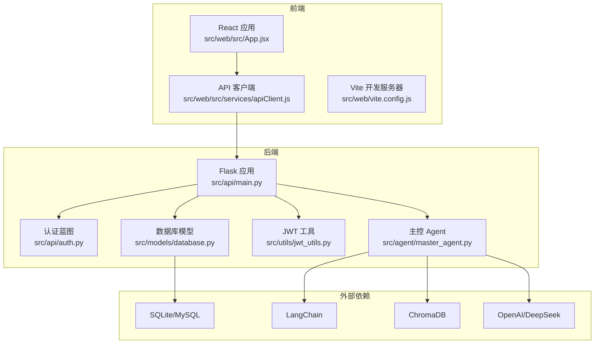
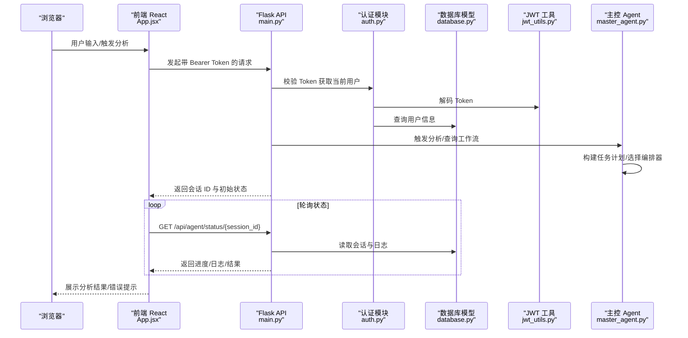
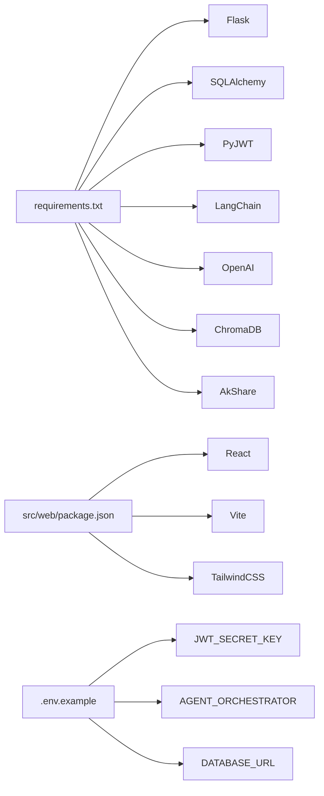

# 调试与故障排除

<cite>
**本文引用的文件**
- [run.py](file://run.py)
- [README.md](file://README.md)
- [src/api/main.py](file://src/api/main.py)
- [src/api/auth.py](file://src/api/auth.py)
- [src/models/database.py](file://src/models/database.py)
- [src/utils/jwt_utils.py](file://src/utils/jwt_utils.py)
- [src/web/src/App.jsx](file://src/web/src/App.jsx)
- [src/web/src/services/apiClient.js](file://src/web/src/services/apiClient.js)
- [src/web/package.json](file://src/web/package.json)
- [src/web/vite.config.js](file://src/web/vite.config.js)
- [src/agent/master_agent.py](file://src/agent/master_agent.py)
- [src/agent/test/test_master_agent.py](file://src/agent/test/test_master_agent.py)
- [.env.example](file://.env.example)
- [requirements.txt](file://requirements.txt)
</cite>

## 目录
1. [简介](#简介)
2. [项目结构](#项目结构)
3. [核心组件](#核心组件)
4. [架构总览](#架构总览)
5. [详细组件分析](#详细组件分析)
6. [依赖关系分析](#依赖关系分析)
7. [性能考量](#性能考量)
8. [故障排除指南](#故障排除指南)
9. [结论](#结论)
10. [附录](#附录)

## 简介
本文件面向开发与运维人员，提供针对本项目的系统化调试与故障排除方法论与实操指南。内容覆盖：
- 断点调试方法：后端 Flask 应用、前端 React 应用、浏览器开发者工具
- 日志分析：Flask 日志配置、错误追踪、性能监控
- 性能分析：API 响应时间、内存使用、数据库查询优化
- 常见问题诊断与解决方案：网络请求失败、数据解析错误、Agent 执行异常
- 调试工具推荐、监控仪表板配置、错误报告模板
- 故障排除的系统化方法论与实用工具

## 项目结构
项目采用前后端分离架构：
- 后端：Python Flask，提供认证、用户管理、Agent 工作流、新闻与股票接口
- 前端：React/Vite，提供用户交互、状态展示、与后端 API 通信
- 数据层：SQLAlchemy + SQLite/MySQL，默认 SQLite，支持通过环境变量切换
- 编排：LangChain AgentExecutor（可选）+ 自研编排器，支持自动回退
- 检索：RAG 知识库（Chroma + sentence-transformers）

图表来源
- [src/web/src/App.jsx](file://src/web/src/App.jsx#L1-L120)
- [src/web/src/services/apiClient.js](file://src/web/src/services/apiClient.js#L1-L130)
- [src/api/main.py](file://src/api/main.py#L40-L83)
- [src/api/auth.py](file://src/api/auth.py#L15-L136)
- [src/models/database.py](file://src/models/database.py#L24-L86)
- [src/utils/jwt_utils.py](file://src/utils/jwt_utils.py#L18-L36)
- [src/agent/master_agent.py](file://src/agent/master_agent.py#L24-L40)

章节来源
- [README.md](file://README.md#L24-L40)
- [run.py](file://run.py#L35-L60)

## 核心组件
- 启动器：run.py 提供后端/前端/全量启动入口，便于快速定位问题来源
- Flask 应用：统一日志级别、健康检查、请求耗时记录、错误处理器
- 认证模块：JWT 生成/校验、用户鉴权中间逻辑
- 数据库模型：用户、聊天历史、分析会话、Agent 执行日志
- 前端应用：状态机驱动的分析流程、聊天交互、错误提示与重试
- 主控 Agent：多 Agent 编排、回退机制、任务计划构建
- 环境配置：.env.example 提供关键密钥与开关项

章节来源
- [run.py](file://run.py#L8-L32)
- [src/api/main.py](file://src/api/main.py#L31-L83)
- [src/api/auth.py](file://src/api/auth.py#L18-L136)
- [src/models/database.py](file://src/models/database.py#L24-L86)
- [src/web/src/App.jsx](file://src/web/src/App.jsx#L183-L270)
- [src/agent/master_agent.py](file://src/agent/master_agent.py#L24-L40)
- [.env.example](file://.env.example#L1-L19)

## 架构总览
下图展示从浏览器到后端 API，再到数据库与外部服务的典型调用链路，以及关键的可观测性节点。

图表来源
- [src/web/src/App.jsx](file://src/web/src/App.jsx#L183-L270)
- [src/web/src/services/apiClient.js](file://src/web/src/services/apiClient.js#L85-L103)
- [src/api/main.py](file://src/api/main.py#L68-L83)
- [src/api/auth.py](file://src/api/auth.py#L121-L136)
- [src/models/database.py](file://src/models/database.py#L53-L86)
- [src/utils/jwt_utils.py](file://src/utils/jwt_utils.py#L29-L36)
- [src/agent/master_agent.py](file://src/agent/master_agent.py#L155-L200)

## 详细组件分析

### Flask 后端调试要点
- 日志级别与格式：通过环境变量控制日志等级，便于在不同场景下调整详细程度
- 请求耗时记录：before/after_request 记录每个请求的耗时，便于定位慢接口
- 错误处理：统一 404/500/401 处理，500 会记录异常堆栈
- 健康检查：/api/health 快速验证后端存活
- 认证中间件：鉴权失败时返回 401，便于前端区分未登录与权限不足

调试步骤建议
- 启动后端后访问 /api/health 与 / 接口，确认服务正常
- 使用浏览器或 curl 查看请求耗时与状态码
- 在高并发或长任务场景下观察 after_request 日志中的耗时分布
- 对于 500 错误，查看日志中的异常堆栈定位具体位置

章节来源
- [src/api/main.py](file://src/api/main.py#L31-L83)
- [src/api/main.py](file://src/api/main.py#L222-L234)
- [src/api/main.py](file://src/api/main.py#L64-L66)

### 前端 React 调试要点
- 状态机与生命周期：App.jsx 中通过 useState/useEffect 管理分析状态、定时轮询、错误处理
- API 客户端：apiClient.js 封装统一的请求与错误处理，便于集中调试
- Vite 开发服务器：vite.config.js 加载环境变量，确保 API 地址正确
- 用户体验：失败时显示简洁错误提示，成功时渲染总结与引用

调试步骤建议
- 打开浏览器开发者工具，Network 面板观察请求/响应与耗时
- Console 面板查看 React 渲染日志与错误
- Application/Storage 面板检查本地存储中的 Token 是否正确
- 在调试模式下观察分析流程的进度与日志展示

章节来源
- [src/web/src/App.jsx](file://src/web/src/App.jsx#L183-L270)
- [src/web/src/services/apiClient.js](file://src/web/src/services/apiClient.js#L20-L41)
- [src/web/vite.config.js](file://src/web/vite.config.js#L5-L14)

### 认证与 JWT 调试要点
- JWT 密钥：生产环境必须通过环境变量配置，避免硬编码
- 登录/注册：返回 token 与用户信息；失败时返回明确错误
- 当前用户：Authorization 头缺失或无效时返回空，便于前端跳转登录页

调试步骤建议
- 确认 .env 中 JWT_SECRET_KEY 设置
- 登录后检查本地存储中的 token 是否存在
- 使用无效 token 或缺失头时，后端应返回 401

章节来源
- [.env.example](file://.env.example#L1-L3)
- [src/api/auth.py](file://src/api/auth.py#L78-L118)
- [src/api/auth.py](file://src/api/auth.py#L121-L136)
- [src/utils/jwt_utils.py](file://src/utils/jwt_utils.py#L18-L36)

### 数据库与日志调试要点
- 数据库模型：用户、聊天历史、分析会话、Agent 执行日志
- 分析会话：包含状态、进度、错误信息，便于回溯
- Agent 日志：按会话记录 Agent 执行步骤、状态与消息

调试步骤建议
- 使用 SQLite 浏览器或命令行查看表数据，核对会话与日志
- 关注 AnalysisSession 的 status/progress/error_message 字段
- 结合后端日志与数据库日志交叉验证

章节来源
- [src/models/database.py](file://src/models/database.py#L24-L86)

### 主控 Agent 调试要点
- 编排器模式：auto/langchain/custom，异常时自动回退
- 任务计划：根据输入构建任务列表，支持符号解析与关键词抽取
- 执行链路：数据/新闻/知识/分析 Agent 协同，支持降级与错误传播

调试步骤建议
- 设置 AGENT_ORCHESTRATOR=custom，强制使用自研编排便于定位问题
- 在本地运行测试用例，观察主控 Agent 的输出与异常
- 结合前端“调试模式”参数，开启更详细的日志与延迟展示

章节来源
- [src/agent/master_agent.py](file://src/agent/master_agent.py#L24-L40)
- [src/agent/master_agent.py](file://src/agent/master_agent.py#L155-L200)
- [src/agent/test/test_master_agent.py](file://src/agent/test/test_master_agent.py#L21-L37)

## 依赖关系分析
- 后端依赖：Flask、SQLAlchemy、PyJWT、LangChain、OpenAI、ChromaDB 等
- 前端依赖：React、Vite、TailwindCSS、Recharts 等
- 环境变量：JWT_SECRET_KEY、OPENAI_*、DEEPSEEK_*、AGENT_ORCHESTRATOR、DATABASE_URL

图表来源
- [requirements.txt](file://requirements.txt#L1-L41)
- [src/web/package.json](file://src/web/package.json#L1-L33)
- [.env.example](file://.env.example#L1-L19)

章节来源
- [requirements.txt](file://requirements.txt#L1-L41)
- [src/web/package.json](file://src/web/package.json#L1-L33)
- [.env.example](file://.env.example#L1-L19)

## 性能考量
- API 响应时间
  - 后端：利用请求耗时记录定位慢接口；对长任务采用异步工作流与轮询状态
  - 前端：Network 面板观察请求耗时与重试行为
- 内存使用
  - 后端：避免在请求上下文中缓存大对象；及时释放临时资源
  - 前端：避免重复渲染与无用状态更新；合理使用 ref 与定时器清理
- 数据库查询优化
  - 使用索引列进行查询（如用户表的 username/email/phone）
  - 分页查询聊天历史与分析会话
  - 减少不必要的 JOIN 与子查询

章节来源
- [src/api/main.py](file://src/api/main.py#L68-L83)
- [src/models/database.py](file://src/models/database.py#L24-L86)

## 故障排除指南

### 一、断点调试方法
- 后端 Flask
  - 在 create_app 内部设置断点，验证日志级别与 CORS 配置
  - 在路由处理函数（如 /api/agent/analyze）设置断点，检查请求体与鉴权
  - 在异常分支设置断点，捕获 rollback 与错误返回路径
- 前端 React
  - 在 App.jsx 的分析流程入口设置断点，观察状态变化与定时器
  - 在 apiClient.js 的 apiRequest 处设置断点，检查响应与错误抛出
  - 在浏览器开发者工具 Sources 面板启用条件断点，按状态过滤
- 浏览器开发者工具
  - Network：查看请求/响应、状态码、耗时、Headers、Cookies
  - Console：查看错误堆栈与警告
  - Application：检查 Local Storage/Session Storage 中的 token
  - Performance：录制页面交互，定位卡顿与重绘热点

章节来源
- [src/api/main.py](file://src/api/main.py#L40-L83)
- [src/web/src/App.jsx](file://src/web/src/App.jsx#L183-L270)
- [src/web/src/services/apiClient.js](file://src/web/src/services/apiClient.js#L20-L41)

### 二、日志分析技巧
- Flask 日志配置
  - 通过 LOG_LEVEL 控制日志级别，建议在问题排查时设为 DEBUG/INFO
  - 关注请求耗时日志，定位慢接口与阻塞点
- 错误追踪
  - 500 错误会记录异常堆栈，优先查看异常发生位置
  - 结合数据库日志（分析会话与 Agent 日志）交叉验证
- 性能监控
  - 使用请求耗时日志作为基线，对比修复前后的变化
  - 对长任务增加中间态日志，细化瓶颈环节

章节来源
- [src/api/main.py](file://src/api/main.py#L31-L83)
- [src/api/main.py](file://src/api/main.py#L226-L234)
- [src/models/database.py](file://src/models/database.py#L53-L86)

### 三、性能分析方法
- API 响应时间分析
  - 后端：查看 after_request 中的耗时日志，定位慢路由与慢查询
  - 前端：Network 面板对比不同阶段耗时（DNS/TCP/SSL/TTTF/TTLS/下载）
- 内存使用监控
  - 后端：使用进程级监控工具观察内存增长趋势
  - 前端：Performance 面板查看堆内存与快照差异
- 数据库查询优化
  - 使用 EXPLAIN/EXPLAIN QUERY PLAN 分析慢查询
  - 为高频查询列添加索引，减少全表扫描

章节来源
- [src/api/main.py](file://src/api/main.py#L68-L83)
- [src/models/database.py](file://src/models/database.py#L24-L86)

### 四、常见问题诊断与解决方案
- 网络请求失败
  - 症状：前端报错“请求失败”，后端 502/504
  - 排查：检查 API 地址是否正确（VITE_API_BASE_URL），跨域与代理配置
  - 解决：修正环境变量与代理，确保后端监听 0.0.0.0
- 数据解析错误
  - 症状：前端解析 JSON 失败或显示“解析失败”
  - 排查：检查 apiClient.js 的响应解析与错误处理
  - 解决：在 apiRequest 中增加容错与错误消息透传
- Agent 执行异常
  - 症状：分析流程卡住或返回失败
  - 排查：设置 AGENT_ORCHESTRATOR=custom，观察任务计划与回退原因
  - 解决：修复外部服务（OpenAI/DeepSeek/Chroma/AkShare）配置与可用性

章节来源
- [src/web/src/services/apiClient.js](file://src/web/src/services/apiClient.js#L20-L41)
- [src/agent/master_agent.py](file://src/agent/master_agent.py#L155-L200)
- [src/web/vite.config.js](file://src/web/vite.config.js#L5-L14)

### 五、调试工具推荐
- 后端
  - Flask 开发服务器：启用 debug 与 reloader，便于热更新
  - Postman/curl：构造请求与验证响应
- 前端
  - 浏览器开发者工具：Network/Console/Performance/Application
  - React DevTools：检查组件树与状态
- 数据库
  - sqlite3 命令行或第三方 SQLite 浏览器
- 监控与日志
  - ELK/Graylog（可选）：集中收集后端日志
  - Prometheus/Grafana（可选）：自定义指标与仪表板

章节来源
- [src/api/main.py](file://src/api/main.py#L238-L243)
- [src/web/vite.config.js](file://src/web/vite.config.js#L5-L14)

### 六、监控仪表板配置（建议）
- 后端指标
  - HTTP 请求总量/错误率/平均响应时间/P95/P99
  - 数据库连接数/慢查询计数
- 前端指标
  - 页面加载时间/首次内容绘制/交互延迟
  - 错误上报与用户路径埋点
- 建议使用
  - Prometheus 收集指标，Grafana 可视化
  - Sentry/自研错误上报服务

[本节为通用实践建议，无需特定文件引用]

### 七、错误报告模板（建议）
- 环境信息
  - 操作系统、浏览器版本、Node/Python 版本
  - 后端日志级别、数据库类型与版本
- 复现步骤
  - 详细的操作顺序与输入
- 预期结果 vs 实际结果
- 截图/日志片段
  - 浏览器 Network 面板截图
  - 后端日志片段（含时间戳与请求 ID）

[本节为通用模板，无需特定文件引用]

## 结论
通过系统化的断点调试、日志分析、性能监控与问题诊断流程，可以高效定位并解决本项目中的各类问题。建议在开发与测试环境中固定日志级别与监控指标，在生产环境严格配置密钥与数据库连接，并建立标准化的错误报告与回溯机制。

## 附录

### A. 启动与环境配置
- 后端启动：python run.py --backend
- 前端启动：python run.py --frontend
- 环境变量：参考 .env.example，确保 JWT_SECRET_KEY、AGENT_ORCHESTRATOR、DATABASE_URL 等正确设置

章节来源
- [run.py](file://run.py#L35-L60)
- [.env.example](file://.env.example#L1-L19)

### B. API 路由与关键端点
- 健康检查：GET /api/health
- 认证：POST /api/auth/register、POST /api/auth/login
- 用户：GET/PUT /api/user/profile、PUT /api/user/phone、PUT /api/user/password
- 分析：POST /api/agent/analyze、POST /api/agent/query、GET /api/agent/status/{session_id}

章节来源
- [src/api/main.py](file://src/api/main.py#L64-L101)
- [src/api/auth.py](file://src/api/auth.py#L23-L118)