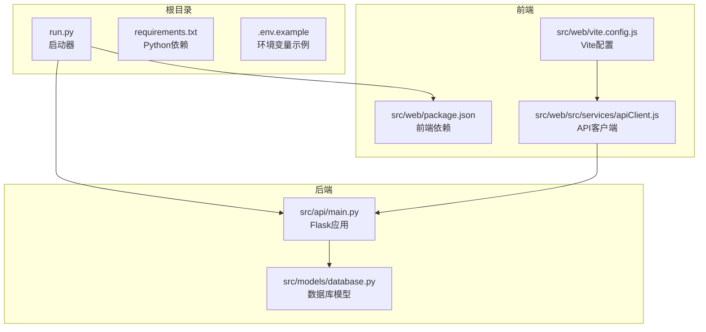
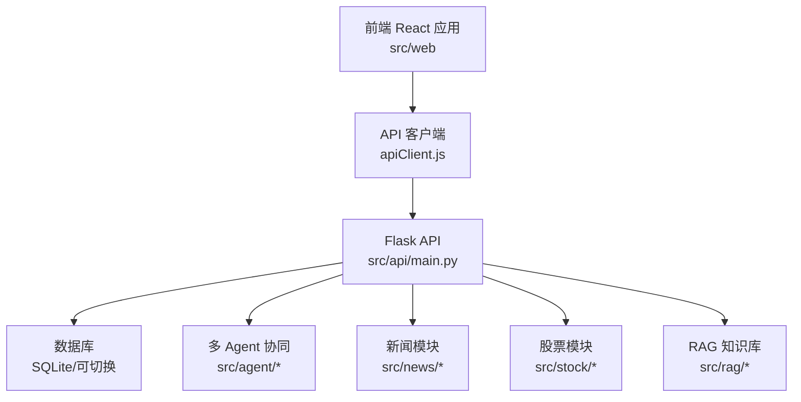
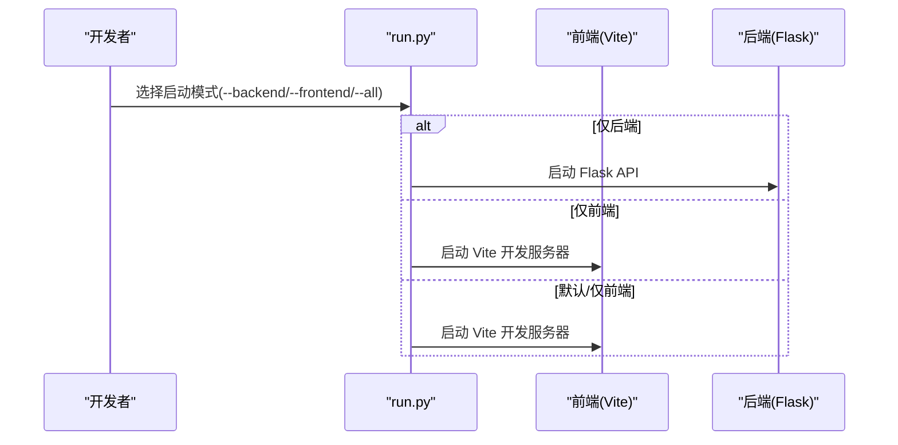
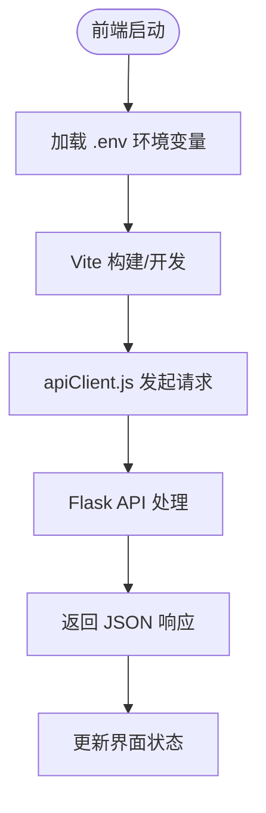
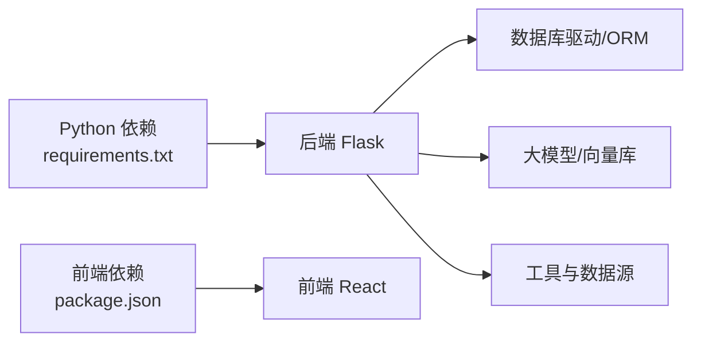

# 快速开始

<cite>
**本文引用的文件**
- [README.md](file://README.md)
- [requirements.txt](file://requirements.txt)
- [.env.example](file://.env.example)
- [run.py](file://run.py)
- [src/api/main.py](file://src/api/main.py)
- [src/models/database.py](file://src/models/database.py)
- [src/web/package.json](file://src/web/package.json)
- [src/web/vite.config.js](file://src/web/vite.config.js)
- [src/web/src/services/apiClient.js](file://src/web/src/services/apiClient.js)
- [AGENTS.md](file://AGENTS.md)
- [DESIGN.md](file://DESIGN.md)
</cite>

## 目录
1. [简介](#简介)
2. [项目结构](#项目结构)
3. [核心组件](#核心组件)
4. [架构概览](#架构概览)
5. [详细组件分析](#详细组件分析)
6. [依赖分析](#依赖分析)
7. [性能考虑](#性能考虑)
8. [故障排除指南](#故障排除指南)
9. [结论](#结论)
10. [附录](#附录)

## 简介
本指南面向首次接触 AI 投资分析系统的开发者，帮助你在最短时间内完成环境准备、依赖安装、配置与启动。项目采用后端 Python + Flask、前端 React + Vite 的双端架构，支持用户认证、股票与新闻聚合、多 Agent 协同分析与 RAG 知识检索。

## 项目结构
项目采用前后端分离与模块化组织，核心目录与职责如下：
- 根目录
  - 启动脚本：run.py
  - 依赖清单：requirements.txt
  - 示例环境变量：.env.example
- 后端 src/api：Flask 应用与路由蓝图
- 数据模型 src/models：数据库模型与初始化
- 前端 src/web：React + Vite 应用与服务层
- 功能模块 src/agent、src/news、src/rag、src/stock、src/utils：业务与工具模块



图表来源
- [run.py](file://run.py#L1-L60)
- [requirements.txt](file://requirements.txt#L1-L41)
- [.env.example](file://.env.example#L1-L19)
- [src/api/main.py](file://src/api/main.py#L1-L243)
- [src/models/database.py](file://src/models/database.py#L1-L86)
- [src/web/package.json](file://src/web/package.json#L1-L33)
- [src/web/vite.config.js](file://src/web/vite.config.js#L1-L15)
- [src/web/src/services/apiClient.js](file://src/web/src/services/apiClient.js#L1-L130)

章节来源
- [README.md](file://README.md#L24-L40)
- [AGENTS.md](file://AGENTS.md#L160-L182)

## 核心组件
- 启动器 run.py：提供统一启动入口，支持仅后端、仅前端与默认启动。
- Flask API：提供认证、用户资料、股票、新闻、聊天与 Agent 分析等接口。
- 数据库模型：定义用户、聊天历史、分析会话与 Agent 日志等表结构。
- 前端 React 应用：通过 apiClient.js 调用后端 API，提供登录、个人资料、分析与聊天等功能视图。
- 环境变量：.env.example 提供 JWT、大模型、编排器与数据库等关键配置项。

章节来源
- [run.py](file://run.py#L35-L56)
- [src/api/main.py](file://src/api/main.py#L40-L235)
- [src/models/database.py](file://src/models/database.py#L24-L86)
- [src/web/src/services/apiClient.js](file://src/web/src/services/apiClient.js#L1-L130)
- [.env.example](file://.env.example#L1-L19)

## 架构概览
系统采用前后端分离架构，前端通过 Vite 开发服务器提供本地调试体验，后端 Flask 提供 REST API，数据库默认使用 SQLite 文件数据库，也可通过环境变量切换为 MySQL 等。



图表来源
- [src/web/src/services/apiClient.js](file://src/web/src/services/apiClient.js#L1-L130)
- [src/api/main.py](file://src/api/main.py#L40-L235)
- [src/models/database.py](file://src/models/database.py#L24-L86)
- [DESIGN.md](file://DESIGN.md#L1-L191)

## 详细组件分析

### 启动器与多端启动方式
run.py 提供四种启动方式：
- 默认启动：启动前端开发服务器（Vite）
- 仅后端：启动 Flask API（默认监听 127.0.0.1:5000）
- 仅前端：启动 Vite 开发服务器（默认监听 127.0.0.1:5173）
- 同时启动：建议在两个终端分别执行后端与前端启动命令



图表来源
- [run.py](file://run.py#L35-L56)

章节来源
- [README.md](file://README.md#L48-L96)
- [run.py](file://run.py#L35-L56)

### 环境变量与配置
- JWT 密钥：用于开发环境的令牌签发，生产环境需替换为强随机密钥
- 大模型与代理：OpenAI/DeepSeek 的 API Key、Base URL 与模型名称
- 编排器模式：auto/langchain/custom，控制主分析链路的编排策略
- 数据库连接：默认 SQLite 文件数据库，可切换为 MySQL 等

章节来源
- [.env.example](file://.env.example#L1-L19)
- [README.md](file://README.md#L97-L131)

### 前端开发与 API 客户端
- 前端依赖：React、Recharts、TailwindCSS、Vite 等
- API 客户端：apiClient.js 统一封装请求、鉴权头与错误处理
- Vite 配置：加载 .env 中的环境变量并注入到构建产物



图表来源
- [src/web/package.json](file://src/web/package.json#L1-L33)
- [src/web/vite.config.js](file://src/web/vite.config.js#L1-L15)
- [src/web/src/services/apiClient.js](file://src/web/src/services/apiClient.js#L1-L130)

章节来源
- [src/web/package.json](file://src/web/package.json#L1-L33)
- [src/web/vite.config.js](file://src/web/vite.config.js#L1-L15)
- [src/web/src/services/apiClient.js](file://src/web/src/services/apiClient.js#L1-L130)

### 后端 API 与数据库
- Flask 应用：注册认证、Agent、股票、新闻、聊天等蓝图，提供健康检查与用户资料接口
- 数据库模型：用户、聊天历史、分析会话、Agent 日志等表，支持 SQLite 默认与可切换数据库
- 日志级别：通过 LOG_LEVEL 控制日志输出

```mermaid
classDiagram
class User {
+整型 id
+字符串 username
+字符串 email
+字符串 phone
+字符串 password_hash
+字符串 nickname
+时间 created_at
+时间 updated_at
+布尔 is_active
}
class ChatHistory {
+整型 id
+整型 user_id
+字符串 role
+文本 content
+时间 created_at
+字符串 session_id
}
class AnalysisSession {
+整型 id
+整型 user_id
+字符串 session_id
+字符串 symbol
+文本 query
+字符串 status
+整型 progress
+文本 result_summary
+文本 error_message
+时间 created_at
+时间 updated_at
}
class AgentLog {
+整型 id
+字符串 session_id
+字符串 agent_name
+字符串 step_name
+字符串 status
+文本 log_message
+整型 progress_pct
+时间 created_at
}
User ||--o{ ChatHistory : "拥有"
User ||--o{ AnalysisSession : "拥有"
AnalysisSession ||--o{ AgentLog : "产生日志"
```

图表来源
- [src/models/database.py](file://src/models/database.py#L24-L86)

章节来源
- [src/api/main.py](file://src/api/main.py#L40-L235)
- [src/models/database.py](file://src/models/database.py#L24-L86)

### Agent 编排与链路
- 编排器模式：auto（优先 LangChain，不可用时回退自研）、langchain（优先 LangChain）、custom（仅自研）
- 主分析链路：POST /api/agent/analyze 与 /api/agent/query，由 MasterAgent 协调各子 Agent
- 聊天简答链路：POST /api/chat/ask，由 DecisionAgent 与 InvestmentExpertAgent 组成

章节来源
- [README.md](file://README.md#L118-L162)
- [DESIGN.md](file://DESIGN.md#L59-L113)

## 依赖分析
- Python 依赖：requests、lxml、beautifulsoup4、feedparser、sqlalchemy、pymysql、colorlog、pandas、numpy、aiohttp、asyncio-mqtt、akshare、openai、langchain、langchain-openai、chromadb、sentence-transformers、ddgs、flask、flask-cors、pyjwt
- 前端依赖：react、react-dom、recharts、tailwindcss、vite、@vitejs/plugin-react-swc 等



图表来源
- [requirements.txt](file://requirements.txt#L1-L41)
- [src/web/package.json](file://src/web/package.json#L1-L33)

章节来源
- [requirements.txt](file://requirements.txt#L1-L41)
- [src/web/package.json](file://src/web/package.json#L1-L33)

## 性能考虑
- 启动性能：首次安装依赖后，前后端分别启动，避免同时占用过多资源
- 数据访问：SQLite 默认文件数据库，适合开发与小规模数据；生产可切换为 MySQL 并启用连接池
- API 调用：合理控制大模型与外部数据源的调用频率，必要时增加缓存与重试
- 前端构建：开发模式使用 Vite HMR，生产构建建议开启压缩与分包

## 故障排除指南
- 启动后端报模块导入错误：请在项目根目录执行命令，确保 PYTHONPATH 正确指向 src
- 前端无法启动：确认 Node.js 与 npm 已安装，执行 npm install 安装依赖后再启动
- 股票或新闻数据异常：检查网络状态与数据源可用性，必要时更换代理或调整请求频率
- RAG 检索效果不佳：先重新构建索引，检查 src/rag/data/ 内容是否完整
- 数据库连接失败：确认 DATABASE_URL 环境变量格式正确，或使用默认 SQLite 文件路径
- JWT 密钥问题：开发环境可使用默认密钥，生产环境务必替换为强随机密钥并关闭 debug

章节来源
- [README.md](file://README.md#L205-L211)
- [AGENTS.md](file://AGENTS.md#L210-L228)

## 结论
通过本快速开始指南，你可以完成环境准备、依赖安装与配置，并掌握多种启动方式。建议先以默认启动快速验证系统可用性，随后逐步完善环境变量与数据库配置，最后根据需要扩展 RAG 知识库与 Agent 编排策略。

## 附录

### 环境要求
- Python 3.10+（建议 3.11）
- Node.js 18+
- npm 9+

章节来源
- [README.md](file://README.md#L42-L46)

### 安装步骤
- 安装 Python 依赖：在项目根目录执行 pip install -r requirements.txt
- 安装前端依赖：cd src/web && npm install

章节来源
- [README.md](file://README.md#L50-L64)
- [AGENTS.md](file://AGENTS.md#L11-L25)

### 环境变量配置
- 复制 .env.example 为 .env 并填写以下关键项：
  - JWT_SECRET_KEY：JWT 密钥
  - OPENAI_API_KEY / OPENAI_BASE_URL / OPENAI_MODEL：OpenAI 配置
  - DEEPSEEK_API_KEY / DEEPSEEK_BASE_URL / DEEPSEEK_MODEL：DeepSeek 配置
  - AGENT_ORCHESTRATOR：编排器模式（auto/langchain/custom）
  - DATABASE_URL：数据库连接串（默认 sqlite:///ai_investment.db）

章节来源
- [.env.example](file://.env.example#L1-L19)
- [README.md](file://README.md#L97-L131)

### 启动方式
- 默认启动前端：python run.py
- 仅启动后端：python run.py --backend（默认地址 http://127.0.0.1:5000）
- 仅启动前端：python run.py --frontend（默认地址 http://127.0.0.1:5173）
- 分别启动：在两个终端分别执行后端与前端启动命令

章节来源
- [README.md](file://README.md#L66-L96)
- [run.py](file://run.py#L35-L56)