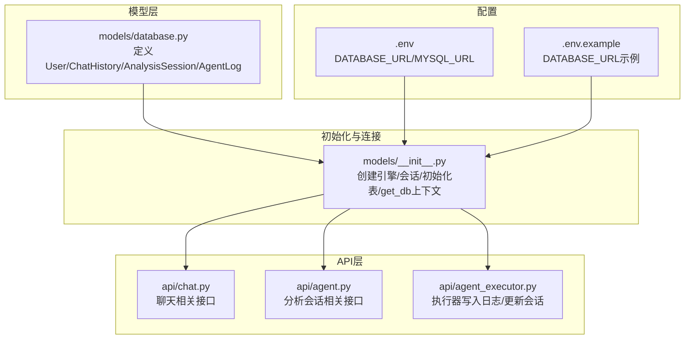
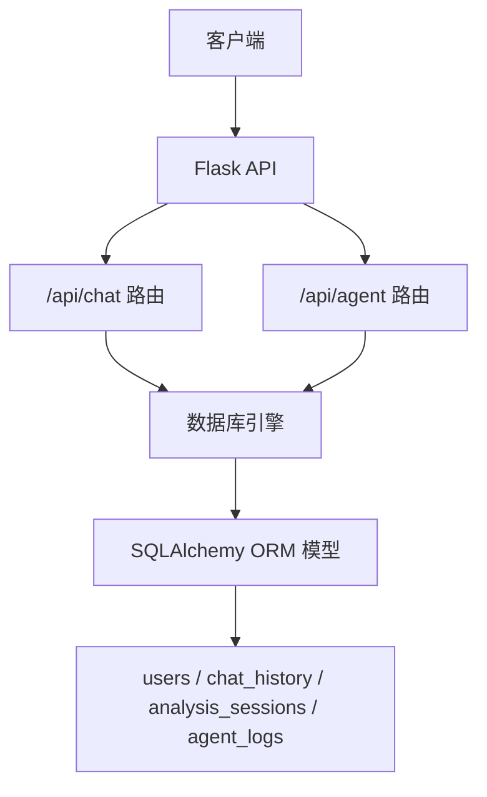
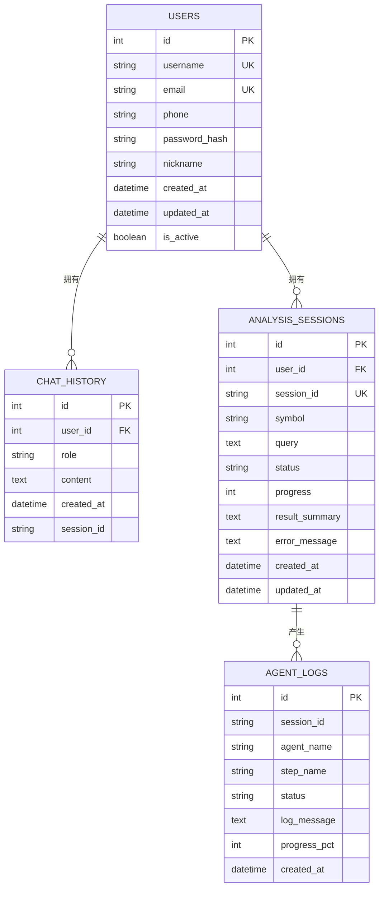
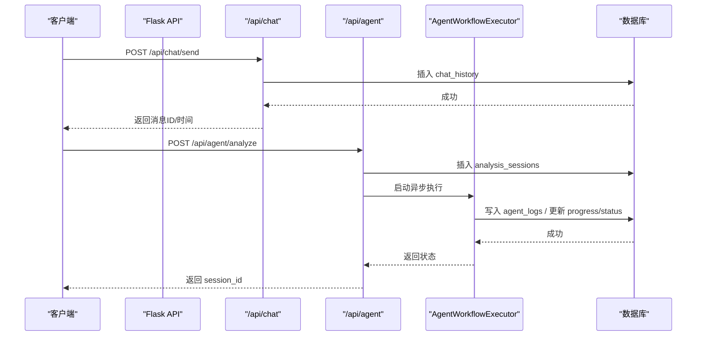
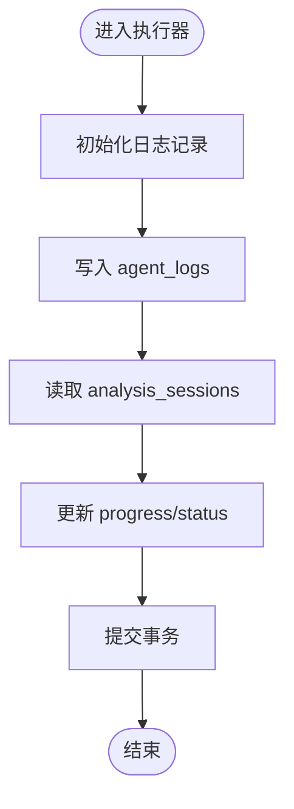
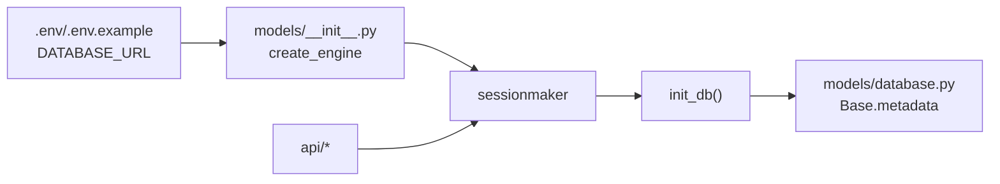

# 数据库设计

<cite>
**本文引用的文件**
- [src/models/database.py](file://src/models/database.py)
- [src/models/__init__.py](file://src/models/__init__.py)
- [src/api/chat.py](file://src/api/chat.py)
- [src/api/agent.py](file://src/api/agent.py)
- [src/api/agent_executor.py](file://src/api/agent_executor.py)
- [.env](file://.env)
- [.env.example](file://.env.example)
- [src/api/main.py](file://src/api/main.py)
</cite>

## 目录
1. [简介](#简介)
2. [项目结构](#项目结构)
3. [核心组件](#核心组件)
4. [架构总览](#架构总览)
5. [详细组件分析](#详细组件分析)
6. [依赖分析](#依赖分析)
7. [性能考虑](#性能考虑)
8. [故障排查指南](#故障排查指南)
9. [结论](#结论)
10. [附录](#附录)

## 简介
本文件面向数据库设计与实现，聚焦于SQLite数据库的表结构设计与关系模型，涵盖用户表、聊天历史表、分析会话表、Agent日志表等核心数据模型的字段定义、约束条件、索引设计，并解释实体关系图（ERD）、表间关联关系、外键约束与数据完整性保障。同时提供数据库迁移指南（Schema变更、数据备份与恢复、性能优化建议），以及数据库配置选项、连接池管理与事务处理策略，并说明可切换数据库的支持机制与配置方法。

## 项目结构
数据库相关代码主要分布在以下模块：
- 数据模型层：定义ORM模型与元数据
- 初始化与连接层：创建引擎、会话、初始化表
- API层：对外暴露REST接口，读写数据库
- 配置层：通过环境变量控制数据库URL与驱动

图表来源
- [src/models/database.py](file://src/models/database.py#L1-L86)
- [src/models/__init__.py](file://src/models/__init__.py#L1-L32)
- [src/api/chat.py](file://src/api/chat.py#L1-L216)
- [src/api/agent.py](file://src/api/agent.py#L1-L208)
- [src/api/agent_executor.py](file://src/api/agent_executor.py#L50-L210)
- [.env](file://.env#L39-L41)
- [.env.example](file://.env.example#L17-L19)

章节来源
- [src/models/database.py](file://src/models/database.py#L1-L86)
- [src/models/__init__.py](file://src/models/__init__.py#L1-L32)
- [src/api/chat.py](file://src/api/chat.py#L1-L216)
- [src/api/agent.py](file://src/api/agent.py#L1-L208)
- [src/api/agent_executor.py](file://src/api/agent_executor.py#L50-L210)
- [.env](file://.env#L39-L41)
- [.env.example](file://.env.example#L17-L19)

## 核心组件
- 用户表（users）
  - 主键：自增整数
  - 唯一性：用户名、邮箱
  - 索引：用户名、邮箱、电话
  - 字段：id、username、email、phone、password_hash、nickname、created_at、updated_at、is_active
- 聊天历史表（chat_history）
  - 主键：自增整数
  - 外键：user_id → users.id
  - 索引：user_id、created_at、session_id
  - 字段：id、user_id、role、content、created_at、session_id
- 分析会话表（analysis_sessions）
  - 主键：自增整数
  - 外键：user_id → users.id
  - 唯一性：session_id
  - 索引：user_id、session_id、created_at
  - 字段：id、user_id、session_id、symbol、query、status、progress、result_summary、error_message、created_at、updated_at
- Agent日志表（agent_logs）
  - 主键：自增整数
  - 索引：session_id、created_at
  - 字段：id、session_id、agent_name、step_name、status、log_message、progress_pct、created_at

章节来源
- [src/models/database.py](file://src/models/database.py#L24-L86)

## 架构总览
数据库层采用SQLAlchemy ORM，通过单一引擎与会话工厂提供连接；API层在请求生命周期内通过上下文管理器获取/释放会话，确保事务边界清晰。分析会话与Agent日志通过独立表记录执行过程与结果，便于审计与回溯。

图表来源
- [src/api/main.py](file://src/api/main.py#L50-L57)
- [src/models/__init__.py](file://src/models/__init__.py#L14-L32)
- [src/models/database.py](file://src/models/database.py#L24-L86)

## 详细组件分析

### 实体关系图（ERD）

图表来源
- [src/models/database.py](file://src/models/database.py#L24-L86)

章节来源
- [src/models/database.py](file://src/models/database.py#L24-L86)

### 数据模型字段与约束详解

- 用户表（users）
  - 主键：id（自增）
  - 唯一约束：username、email
  - 索引：username、email、phone（加速查询与去重）
  - 时间戳：created_at、updated_at（自动维护）
  - 其他：is_active（软删除/封禁标记）

- 聊天历史表（chat_history）
  - 外键：user_id → users.id（保证用户与消息关联）
  - 索引：user_id、created_at、session_id（支持按用户/时间/会话检索）
  - 角色枚举：role ∈ {user, assistant, system}

- 分析会话表（analysis_sessions）
  - 外键：user_id → users.id（保证会话归属）
  - 唯一约束：session_id（全局唯一会话标识）
  - 状态枚举：status ∈ {pending, processing, completed, failed}
  - 进度：progress（百分比）
  - 时间戳：created_at、updated_at（自动维护）

- Agent日志表（agent_logs）
  - 索引：session_id、created_at（快速定位会话日志与排序）
  - 状态枚举：status ∈ {pending, active, completed, failed}
  - 进度：progress_pct（百分比）

章节来源
- [src/models/database.py](file://src/models/database.py#L24-L86)

### 关系与外键约束
- users.id → chat_history.user_id
- users.id → analysis_sessions.user_id
- analysis_sessions.session_id → agent_logs.session_id

这些约束确保：
- 删除用户不会遗留聊天或会话记录
- 会话与日志一一对应且可追溯
- session_id全局唯一，避免并发冲突

章节来源
- [src/models/database.py](file://src/models/database.py#L40-L86)

### 索引设计与查询优化
- users：username、email、phone（唯一+普通索引）
- chat_history：user_id、created_at、session_id（复合/单列索引）
- analysis_sessions：user_id、session_id、created_at（唯一+普通索引）
- agent_logs：session_id、created_at（单列索引）

查询路径与索引匹配：
- 获取用户某会话历史：按 user_id + session_id + created_at 排序
- 列出用户会话列表：按 user_id + 最近时间分组
- 查询分析会话状态：按 session_id 唯一定位
- Agent日志审计：按 session_id + created_at 排序

章节来源
- [src/api/chat.py](file://src/api/chat.py#L59-L143)
- [src/api/agent.py](file://src/api/agent.py#L171-L208)
- [src/models/database.py](file://src/models/database.py#L40-L86)

### 事务处理策略
- 使用上下文管理器获取/释放会话，确保异常时回滚
- 写操作（新增/更新/删除）均在单次请求内提交
- 并发场景下，建议在业务层加锁或使用数据库事务隔离级别控制

章节来源
- [src/models/__init__.py](file://src/models/__init__.py#L25-L32)
- [src/api/chat.py](file://src/api/chat.py#L38-L56)
- [src/api/agent.py](file://src/api/agent.py#L37-L64)

### API工作流与数据写入

图表来源
- [src/api/chat.py](file://src/api/chat.py#L23-L56)
- [src/api/agent.py](file://src/api/agent.py#L20-L64)
- [src/api/agent_executor.py](file://src/api/agent_executor.py#L57-L91)

章节来源
- [src/api/chat.py](file://src/api/chat.py#L23-L56)
- [src/api/agent.py](file://src/api/agent.py#L20-L64)
- [src/api/agent_executor.py](file://src/api/agent_executor.py#L57-L91)

### 复杂逻辑流程（会话状态与日志更新）

图表来源
- [src/api/agent_executor.py](file://src/api/agent_executor.py#L57-L91)

章节来源
- [src/api/agent_executor.py](file://src/api/agent_executor.py#L57-L91)

## 依赖分析
- 模型依赖：所有表依赖统一的Base元数据
- 初始化依赖：init_db()在应用启动时创建所有表
- 运行时依赖：get_db()上下文管理器提供线程安全的会话
- 配置依赖：DATABASE_URL决定底层数据库类型（默认SQLite）

图表来源
- [.env](file://.env#L39-L41)
- [.env.example](file://.env.example#L17-L19)
- [src/models/__init__.py](file://src/models/__init__.py#L14-L22)
- [src/models/database.py](file://src/models/database.py#L21-L21)

章节来源
- [.env](file://.env#L39-L41)
- [.env.example](file://.env.example#L17-L19)
- [src/models/__init__.py](file://src/models/__init__.py#L14-L22)
- [src/models/database.py](file://src/models/database.py#L21-L21)

## 性能考虑
- 索引策略
  - 在高频过滤/排序字段上建立索引（如 user_id、session_id、created_at）
  - 对唯一字段（username、email、session_id）建立唯一索引
- 查询优化
  - 使用分页（limit/offset）避免一次性返回大量数据
  - 对会话列表查询使用子查询聚合最近时间，减少全表扫描
- 连接与事务
  - 使用上下文管理器确保会话及时释放
  - 将多个写操作合并为一次事务提交，减少锁竞争
- 数据库切换
  - 通过 DATABASE_URL 支持MySQL等其他数据库，注意字符集与引擎差异
- I/O与存储
  - SQLite适合小规模数据与开发测试；生产建议使用MySQL/PostgreSQL并启用连接池

章节来源
- [src/api/chat.py](file://src/api/chat.py#L114-L131)
- [src/models/__init__.py](file://src/models/__init__.py#L14-L17)
- [README.md](file://README.md#L99-L112)

## 故障排查指南
- 未授权访问
  - API层对未登录用户返回401，检查鉴权中间件与JWT配置
- 数据库连接失败
  - 检查 DATABASE_URL 是否正确（默认SQLite文件路径）
  - 确认数据库文件权限与路径存在
- 会话不存在或越权
  - 分析会话查询需校验 user_id + session_id，确认传参与权限
- 写入异常
  - 所有写操作均在try/finally中回滚并返回500，查看后端日志定位具体异常
- 日志缺失
  - 确认执行器是否持有有效会话并正确提交事务

章节来源
- [src/api/chat.py](file://src/api/chat.py#L26-L28)
- [src/api/agent.py](file://src/api/agent.py#L114-L126)
- [src/api/agent_executor.py](file://src/api/agent_executor.py#L178-L185)
- [src/models/__init__.py](file://src/models/__init__.py#L25-L32)

## 结论
本数据库设计围绕用户、聊天、分析会话与Agent日志四类核心实体展开，采用外键约束与唯一索引保障数据完整性与一致性。通过上下文化会话管理与明确的事务边界，满足API层的读写需求。结合索引与查询优化策略，可在中小规模场景下获得良好性能。生产部署建议使用可扩展数据库并配合连接池与监控体系。

## 附录

### 数据库迁移指南
- Schema变更
  - 使用SQLAlchemy Alembic进行迁移（推荐）
  - 若使用SQLite，注意ALTER TABLE限制较多，建议重建表+数据迁移
- 数据备份与恢复
  - SQLite：直接复制数据库文件；生产建议定期归档
  - MySQL：使用mysqldump或物理备份工具
- 性能优化建议
  - 建立合适索引，避免全表扫描
  - 控制单次查询数据量，使用分页
  - 对热点表启用缓存（如Redis）与只读副本

### 数据库配置与可切换机制
- 默认配置
  - SQLite：sqlite:///ai_investment.db
- 环境变量
  - DATABASE_URL：覆盖默认数据库URL
  - MYSQL_URL：示例MySQL连接串（用于对照）
- 切换步骤
  - 修改 DATABASE_URL 为目标数据库URL
  - 确保安装对应驱动（如PyMySQL/MySQL Connector）
  - 启动应用前执行 init_db() 创建表结构

章节来源
- [.env](file://.env#L39-L41)
- [.env.example](file://.env.example#L17-L19)
- [src/models/__init__.py](file://src/models/__init__.py#L14-L22)
- [README.md](file://README.md#L99-L112)