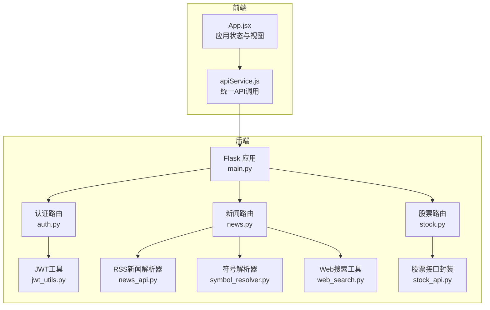
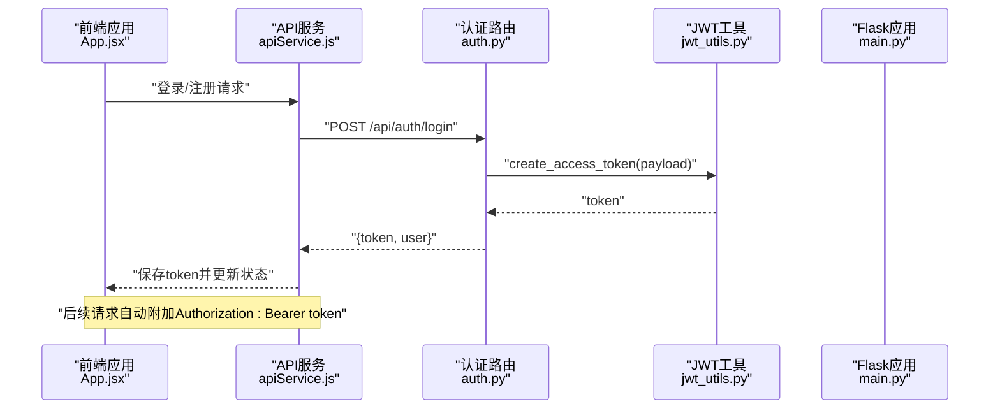
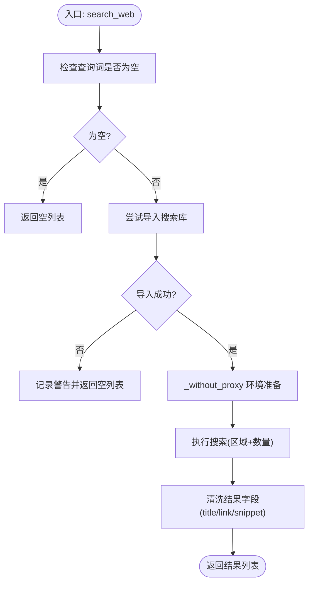
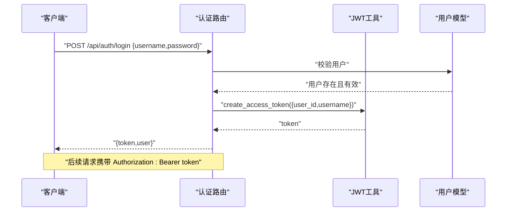
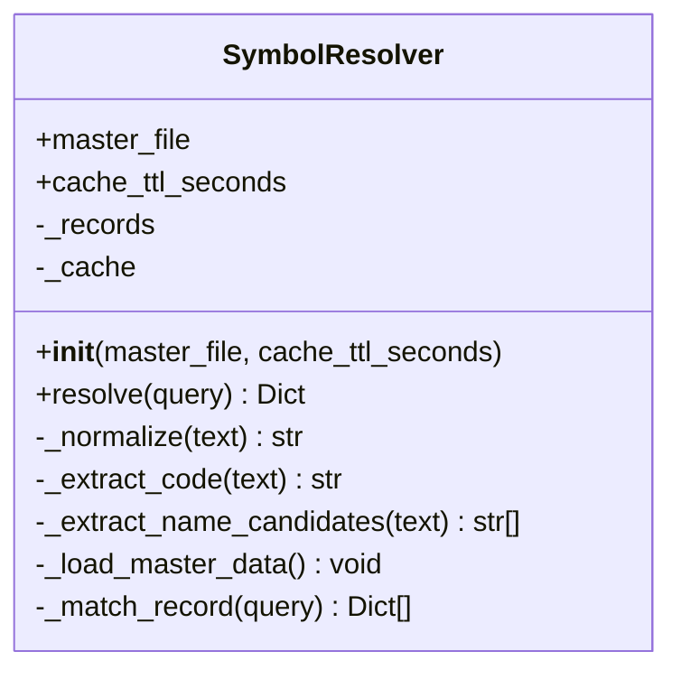
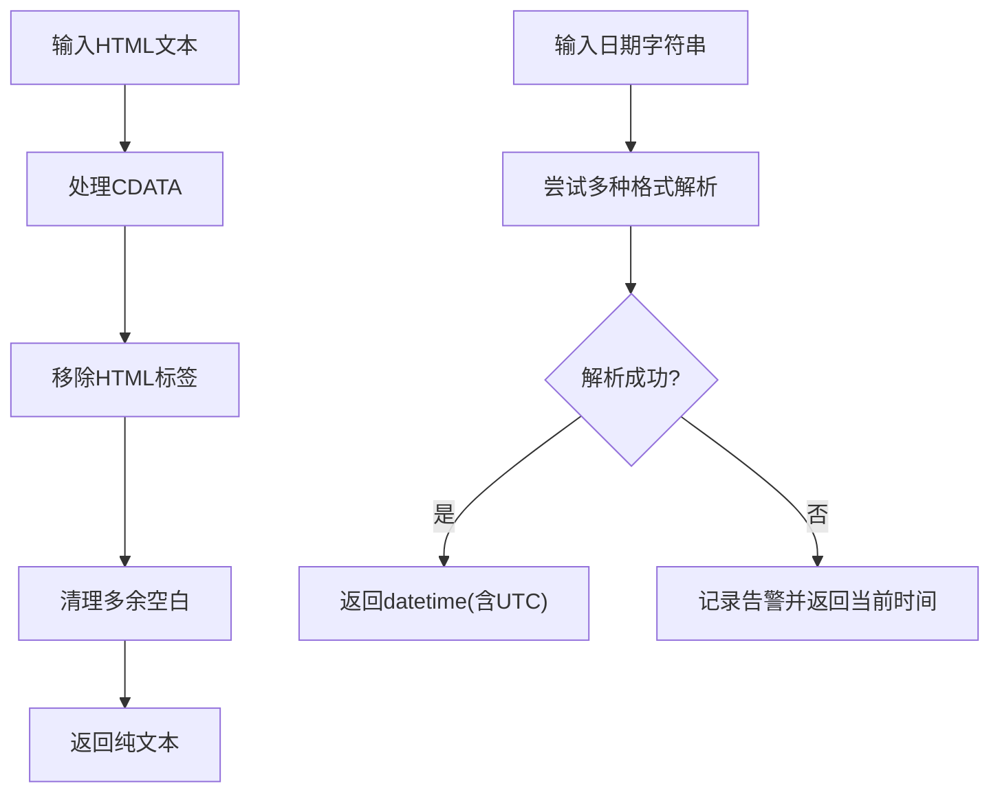
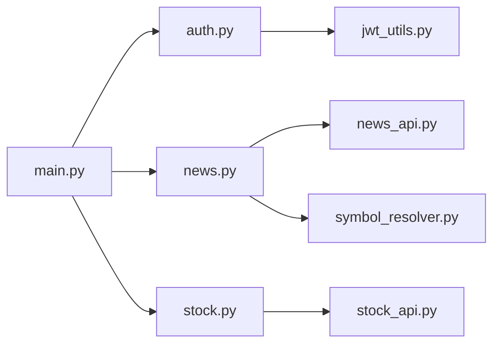

# 数据处理工具

<cite>
**本文引用的文件**
- [src/utils/web_search.py](file://src/utils/web_search.py)
- [src/utils/jwt_utils.py](file://src/utils/jwt_utils.py)
- [src/agent/symbol_resolver.py](file://src/agent/symbol_resolver.py)
- [src/news/news_api.py](file://src/news/news_api.py)
- [src/stock/stock_api.py](file://src/stock/stock_api.py)
- [src/api/main.py](file://src/api/main.py)
- [src/api/auth.py](file://src/api/auth.py)
- [src/api/news.py](file://src/api/news.py)
- [src/api/stock.py](file://src/api/stock.py)
- [src/utils/README.md](file://src/utils/README.md)
- [src/utils/test/test_web_search.py](file://src/utils/test/test_web_search.py)
- [src/agent/test/test_symbol_resolver.py](file://src/agent/test/test_symbol_resolver.py)
- [src/web/src/services/apiService.js](file://src/web/src/services/apiService.js)
- [src/web/src/App.jsx](file://src/web/src/App.jsx)
</cite>

## 目录
1. [引言](#引言)
2. [项目结构](#项目结构)
3. [核心组件](#核心组件)
4. [架构总览](#架构总览)
5. [详细组件分析](#详细组件分析)
6. [依赖关系分析](#依赖关系分析)
7. [性能考虑](#性能考虑)
8. [故障排查指南](#故障排查指南)
9. [结论](#结论)
10. [附录](#附录)

## 引言
本文件面向“数据处理工具”的使用与扩展，重点涵盖以下方面：
- Web搜索工具：搜索引擎集成、结果解析、内容提取与代理控制
- JWT工具函数：令牌生成、验证流程与安全配置
- 符号解析器：股票代码标准化、市场识别、格式转换与缓存策略
- 数据格式化工具：HTML清理、日期解析、格式标准化
- 错误处理机制、性能优化策略与扩展开发指南
- 使用示例与最佳实践建议

## 项目结构
该系统采用前后端分离架构，后端以Flask提供REST API，前端React负责交互与状态管理。数据处理工具主要位于后端模块，包括工具函数、API路由与前端服务层。

图表来源
- [src/api/main.py](file://src/api/main.py#L40-L83)
- [src/api/auth.py](file://src/api/auth.py#L1-L136)
- [src/api/news.py](file://src/api/news.py#L1-L75)
- [src/api/stock.py](file://src/api/stock.py#L1-L126)
- [src/utils/web_search.py](file://src/utils/web_search.py#L1-L80)
- [src/utils/jwt_utils.py](file://src/utils/jwt_utils.py#L1-L36)
- [src/agent/symbol_resolver.py](file://src/agent/symbol_resolver.py#L1-L244)
- [src/news/news_api.py](file://src/news/news_api.py#L1-L248)
- [src/stock/stock_api.py](file://src/stock/stock_api.py#L1-L425)
- [src/web/src/services/apiService.js](file://src/web/src/services/apiService.js#L1-L175)
- [src/web/src/App.jsx](file://src/web/src/App.jsx#L1-L200)

章节来源
- [src/api/main.py](file://src/api/main.py#L40-L83)
- [src/web/src/services/apiService.js](file://src/web/src/services/apiService.js#L1-L175)

## 核心组件
- Web搜索工具：封装DuckDuckGo搜索，支持区域设置与代理禁用，返回标题、链接、摘要
- JWT工具：生成访问令牌与解码校验，支持密钥与算法配置
- 符号解析器：本地主数据驱动的公司名/别名到股票代码解析，含缓存与模糊匹配
- 数据格式化工具：RSS解析器的HTML清理与日期解析，股票接口的代码格式规范化
- API路由：认证、新闻、股票模块的对外接口
- 前端服务：统一API调用、鉴权头注入与错误处理

章节来源
- [src/utils/web_search.py](file://src/utils/web_search.py#L39-L80)
- [src/utils/jwt_utils.py](file://src/utils/jwt_utils.py#L18-L36)
- [src/agent/symbol_resolver.py](file://src/agent/symbol_resolver.py#L190-L244)
- [src/news/news_api.py](file://src/news/news_api.py#L54-L98)
- [src/stock/stock_api.py](file://src/stock/stock_api.py#L15-L63)
- [src/api/auth.py](file://src/api/auth.py#L18-L136)
- [src/api/news.py](file://src/api/news.py#L16-L75)
- [src/api/stock.py](file://src/api/stock.py#L16-L126)
- [src/web/src/services/apiService.js](file://src/web/src/services/apiService.js#L14-L35)

## 架构总览
系统通过Flask蓝图组织功能模块，工具函数在业务路由中被调用，前端通过apiService.js进行统一请求，自动携带Authorization头。

图表来源
- [src/api/auth.py](file://src/api/auth.py#L78-L118)
- [src/utils/jwt_utils.py](file://src/utils/jwt_utils.py#L18-L26)
- [src/web/src/services/apiService.js](file://src/web/src/services/apiService.js#L14-L35)
- [src/api/main.py](file://src/api/main.py#L68-L83)

## 详细组件分析

### Web搜索工具
- 功能概述
  - 使用DuckDuckGo进行文本搜索，支持区域设置与代理禁用
  - 返回标准结构的标题、链接、摘要列表
- 关键点
  - 代理控制：通过环境变量禁用HTTP/HTTPS/all代理，避免地区偏差
  - 容错：依赖库缺失或异常时记录警告并返回空列表
  - 结果清洗：统一字段命名，兼容不同字段名
- 使用示例
  - 在测试脚本中演示了查询、失败回退与代理禁用
- 最佳实践
  - 设置DDGS_REGION以适配目标语言/地区
  - 在网络受限环境下启用DDGS_DISABLE_PROXY=1
  - 控制max_results避免过多请求

图表来源
- [src/utils/web_search.py](file://src/utils/web_search.py#L39-L80)

章节来源
- [src/utils/web_search.py](file://src/utils/web_search.py#L16-L80)
- [src/utils/README.md](file://src/utils/README.md#L10-L18)
- [src/utils/test/test_web_search.py](file://src/utils/test/test_web_search.py#L19-L36)

### JWT工具函数
- 功能概述
  - 生成访问令牌：携带过期时间，使用HS256算法
  - 解码令牌：验证签名与有效期，异常返回None
- 安全机制
  - 密钥来自环境变量，生产环境必须替换默认值
  - 默认过期时间为7天
  - 前端通过Authorization: Bearer token传递令牌
- 使用示例
  - 认证路由中用于登录/注册成功后签发token
  - 获取当前用户时解码token并查询数据库

图表来源
- [src/api/auth.py](file://src/api/auth.py#L78-L118)
- [src/utils/jwt_utils.py](file://src/utils/jwt_utils.py#L18-L36)

章节来源
- [src/utils/jwt_utils.py](file://src/utils/jwt_utils.py#L13-L36)
- [src/api/auth.py](file://src/api/auth.py#L18-L136)
- [src/web/src/services/apiService.js](file://src/web/src/services/apiService.js#L14-L35)

### 符号解析器（股票代码解析）
- 功能概述
  - 优先使用本地主数据进行公司名/别名到股票代码解析
  - 支持显式代码直接解析、模糊匹配与缓存
- 处理逻辑
  - 标准化输入：去空白、转小写、去除分隔符
  - 正则提取：从文本中提取6位数字代码
  - 名称候选：过滤停用词，提取中文词组
  - 匹配评分：基于精确匹配、别名、拼音、候选词综合打分
  - 去重与排序：按分数降序，去重后返回唯一候选
  - 缓存：TTL控制，避免重复解析
- 输出结构
  - symbol、method（解析方式）、confidence（置信度）、candidates（候选列表）

图表来源
- [src/agent/symbol_resolver.py](file://src/agent/symbol_resolver.py#L18-L244)

章节来源
- [src/agent/symbol_resolver.py](file://src/agent/symbol_resolver.py#L18-L244)
- [src/agent/test/test_symbol_resolver.py](file://src/agent/test/test_symbol_resolver.py#L19-L38)

### 数据格式化工具
- HTML清理（RSS解析器）
  - 处理CDATA、移除HTML标签、清理多余空白
  - 统一返回纯文本
- 日期解析（RSS解析器）
  - 支持多种常见格式，自动补全UTC时区
  - 解析失败时记录告警并使用当前时间
- 股票代码格式化（股票接口封装）
  - 东方财富格式：去除市场前缀，统一为6位
  - 新浪/腾讯格式：自动添加小写市场前缀
  - 雪球格式：自动添加大写市场前缀

图表来源
- [src/news/news_api.py](file://src/news/news_api.py#L54-L98)
- [src/stock/stock_api.py](file://src/stock/stock_api.py#L15-L63)

章节来源
- [src/news/news_api.py](file://src/news/news_api.py#L54-L98)
- [src/stock/stock_api.py](file://src/stock/stock_api.py#L15-L63)

## 依赖关系分析
- 组件耦合
  - 认证路由依赖JWT工具进行令牌生成与校验
  - 新闻路由依赖RSS解析器与符号解析器
  - 股票路由依赖股票接口封装
- 外部依赖
  - Web搜索：DuckDuckGo搜索库（ddgs/duckduckgo_search）
  - 股票数据：akshare库
  - 请求：requests库
- 潜在循环依赖
  - 当前模块间为单向依赖，无明显循环

图表来源
- [src/api/auth.py](file://src/api/auth.py#L1-L136)
- [src/api/news.py](file://src/api/news.py#L1-L75)
- [src/api/stock.py](file://src/api/stock.py#L1-L126)
- [src/api/main.py](file://src/api/main.py#L52-L56)
- [src/news/news_api.py](file://src/news/news_api.py#L1-L248)
- [src/agent/symbol_resolver.py](file://src/agent/symbol_resolver.py#L1-L244)
- [src/stock/stock_api.py](file://src/stock/stock_api.py#L1-L425)
- [src/utils/jwt_utils.py](file://src/utils/jwt_utils.py#L1-L36)

章节来源
- [src/api/main.py](file://src/api/main.py#L52-L56)
- [src/api/auth.py](file://src/api/auth.py#L1-L136)
- [src/api/news.py](file://src/api/news.py#L1-L75)
- [src/api/stock.py](file://src/api/stock.py#L1-L126)

## 性能考虑
- 缓存策略
  - 符号解析器使用TTL缓存，减少重复解析开销
- 网络与超时
  - RSS解析器设置请求超时，避免阻塞
  - 股票接口封装对高频调用给出限流/封禁提示
- 代理与区域
  - Web搜索支持禁用代理以减少地区偏差，提高命中质量
- 建议
  - 对高频查询增加本地缓存
  - 合理设置max_results与limit，避免过度请求
  - 在前端聚合多次请求，减少往返次数

## 故障排查指南
- Web搜索不可用
  - 现象：返回空列表并记录警告
  - 排查：确认安装duckduckgo_search或ddgs依赖；检查DDGS_REGION与DDGS_DISABLE_PROXY环境变量
- 令牌无效
  - 现象：解码失败返回None，导致未授权
  - 排查：确认JWT_SECRET_KEY正确；检查令牌是否过期；核对前端Authorization头
- 符号解析失败
  - 现象：返回空symbol与not_found方法
  - 排查：确认本地主数据文件存在且可读；检查输入是否包含6位数字代码
- 新闻解析异常
  - 现象：请求失败或XML解析错误
  - 排查：检查RSS源可用性；确认网络与超时设置；查看日志告警

章节来源
- [src/utils/web_search.py](file://src/utils/web_search.py#L55-L80)
- [src/utils/jwt_utils.py](file://src/utils/jwt_utils.py#L29-L36)
- [src/agent/symbol_resolver.py](file://src/agent/symbol_resolver.py#L84-L130)
- [src/news/news_api.py](file://src/news/news_api.py#L186-L194)

## 结论
本文件梳理了数据处理工具的核心能力与实现要点，包括Web搜索、JWT认证、符号解析与数据格式化。通过合理的错误处理、缓存与性能优化策略，这些工具能够稳定支撑上层业务。建议在生产环境中严格管理密钥与环境变量，并结合实际场景调整缓存与请求策略。

## 附录
- 环境变量
  - DDGS_REGION：覆盖默认区域
  - DDGS_DISABLE_PROXY=1：临时禁用代理
  - JWT_SECRET_KEY：JWT密钥（生产必须修改）
- 前端鉴权
  - apiService.js会自动在请求头附加Authorization: Bearer token
- 测试参考
  - Web搜索测试脚本与符号解析测试脚本可用于快速验证

章节来源
- [src/utils/README.md](file://src/utils/README.md#L14-L22)
- [src/utils/test/test_web_search.py](file://src/utils/test/test_web_search.py#L19-L36)
- [src/agent/test/test_symbol_resolver.py](file://src/agent/test/test_symbol_resolver.py#L19-L38)
- [src/web/src/services/apiService.js](file://src/web/src/services/apiService.js#L14-L35)