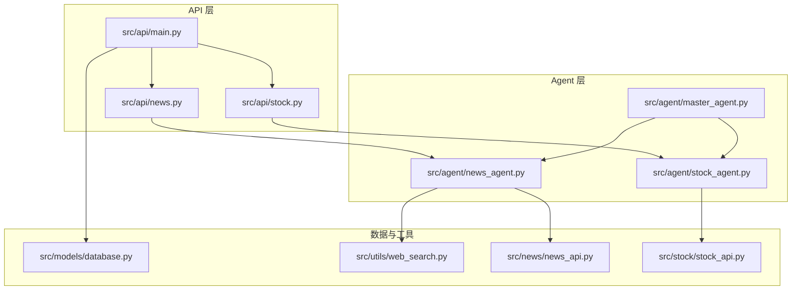
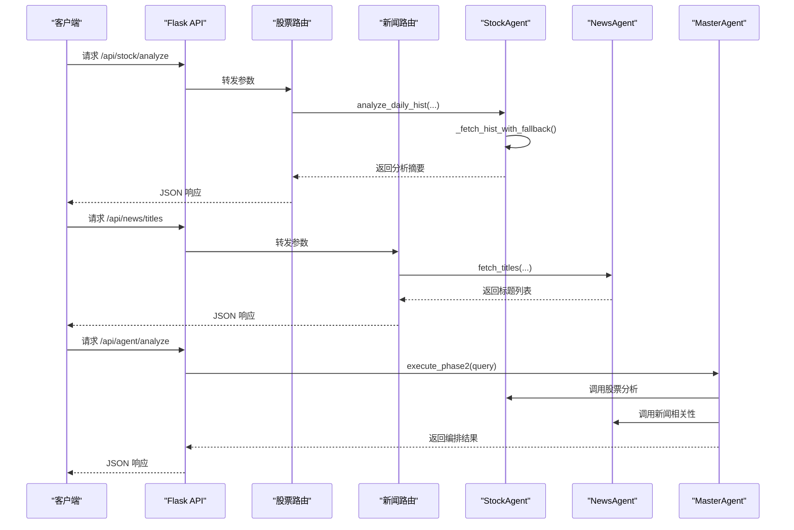
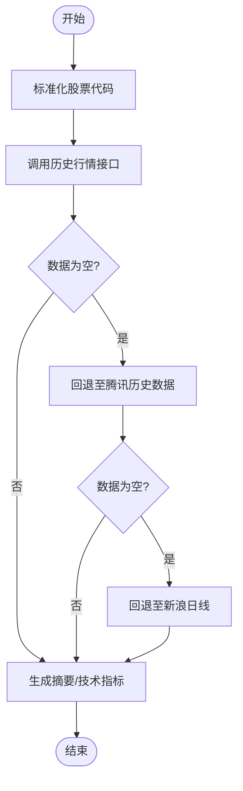
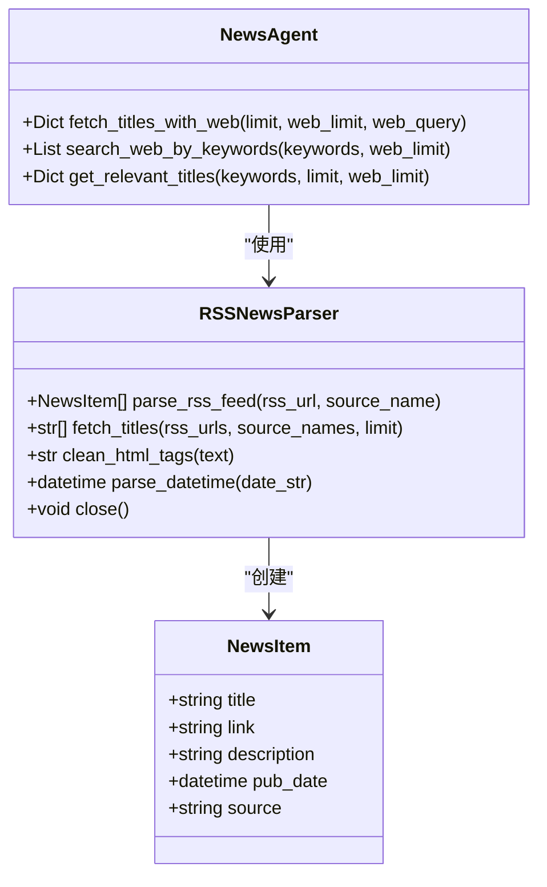
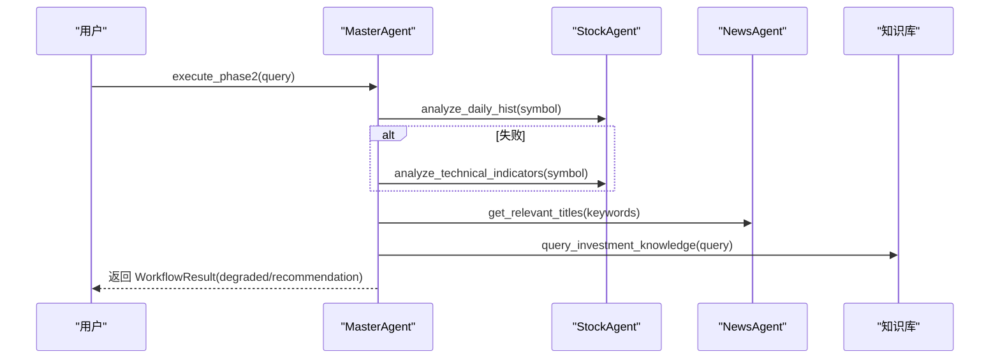
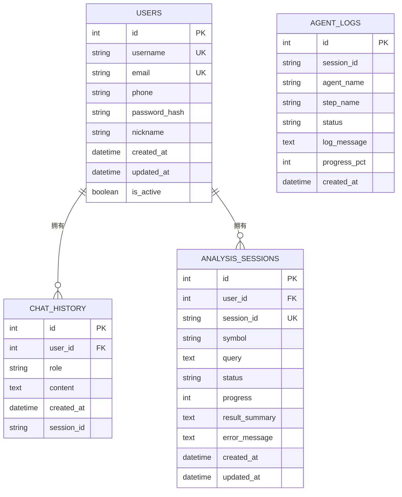
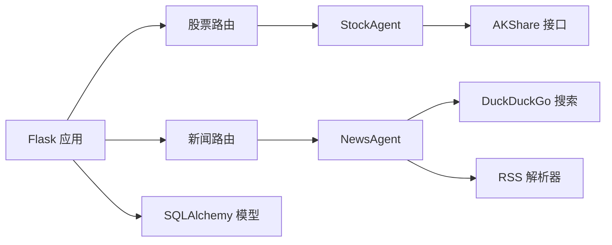

# 数据服务系统

<cite>
**本文引用的文件**
- [README.md](file://README.md)
- [requirements.txt](file://requirements.txt)
- [src/api/main.py](file://src/api/main.py)
- [src/api/stock.py](file://src/api/stock.py)
- [src/api/news.py](file://src/api/news.py)
- [src/models/database.py](file://src/models/database.py)
- [src/stock/stock_api.py](file://src/stock/stock_api.py)
- [src/agent/stock_agent.py](file://src/agent/stock_agent.py)
- [src/agent/news_agent.py](file://src/agent/news_agent.py)
- [src/agent/master_agent.py](file://src/agent/master_agent.py)
- [src/news/news_api.py](file://src/news/news_api.py)
- [src/utils/web_search.py](file://src/utils/web_search.py)
</cite>

## 目录
1. [简介](#简介)
2. [项目结构](#项目结构)
3. [核心组件](#核心组件)
4. [架构总览](#架构总览)
5. [详细组件分析](#详细组件分析)
6. [依赖关系分析](#依赖关系分析)
7. [性能考量](#性能考量)
8. [故障排查指南](#故障排查指南)
9. [结论](#结论)
10. [附录](#附录)

## 简介
本项目是一个基于 Flask + React + 多 Agent 协作的投资分析系统，提供用户认证、股票与新闻信息聚合、对话分析与 RAG 知识检索能力。系统围绕“数据服务”这一核心目标，整合 AKShare 数据源与联网搜索能力，形成稳定的股票数据获取与新闻数据处理机制，并通过主控 Agent 协调各子 Agent 完成端到端的分析链路。

## 项目结构
系统采用模块化分层组织：
- API 层：Flask 蓝图定义业务路由，负责鉴权、参数校验与响应封装
- Agent 层：多 Agent 协同，分别负责股票数据获取与分析、新闻标题获取与筛选、主控编排与决策
- 数据层：SQLAlchemy 模型定义用户、聊天历史、分析会话与 Agent 执行日志
- 工具层：联网搜索工具、RSS 新闻解析器等
- 资源层：RAG 知识库、前端静态资源

图表来源
- [src/api/main.py](file://src/api/main.py#L40-L57)
- [src/api/stock.py](file://src/api/stock.py#L12-L13)
- [src/api/news.py](file://src/api/news.py#L12-L13)
- [src/agent/master_agent.py](file://src/agent/master_agent.py#L24-L39)
- [src/agent/stock_agent.py](file://src/agent/stock_agent.py#L30-L67)
- [src/agent/news_agent.py](file://src/agent/news_agent.py#L18-L24)
- [src/models/database.py](file://src/models/database.py#L24-L86)
- [src/utils/web_search.py](file://src/utils/web_search.py#L39-L80)
- [src/news/news_api.py](file://src/news/news_api.py#L41-L248)
- [src/stock/stock_api.py](file://src/stock/stock_api.py#L1-L425)

章节来源
- [README.md](file://README.md#L24-L40)
- [src/api/main.py](file://src/api/main.py#L40-L57)

## 核心组件
- 股票数据服务：封装 AKShare 接口，提供标准化的历史行情、实时行情、市场总貌与技术指标计算
- 新闻数据服务：RSS 解析与联网搜索结合，提供标题获取与相关性检索
- 主控 Agent：统一任务规划与多 Agent 编排，支持 LangChain 与自研编排双模式
- 数据模型：用户、聊天历史、分析会话、Agent 执行日志的持久化
- API 路由：鉴权、参数校验、错误处理与响应封装

章节来源
- [src/agent/stock_agent.py](file://src/agent/stock_agent.py#L30-L572)
- [src/agent/news_agent.py](file://src/agent/news_agent.py#L18-L93)
- [src/agent/master_agent.py](file://src/agent/master_agent.py#L24-L351)
- [src/models/database.py](file://src/models/database.py#L24-L86)
- [src/api/stock.py](file://src/api/stock.py#L16-L126)
- [src/api/news.py](file://src/api/news.py#L16-L75)

## 架构总览
系统以 Flask 为入口，API 蓝图将请求路由至对应 Agent；Agent 负责调用底层数据源（AKShare、RSS、联网搜索），并在主控 Agent 中实现多 Agent 协同与降级回退策略。数据库模型支撑用户态与分析过程的持久化。

图表来源
- [src/api/stock.py](file://src/api/stock.py#L16-L44)
- [src/api/news.py](file://src/api/news.py#L16-L31)
- [src/agent/stock_agent.py](file://src/agent/stock_agent.py#L305-L432)
- [src/agent/news_agent.py](file://src/agent/news_agent.py#L69-L93)
- [src/agent/master_agent.py](file://src/agent/master_agent.py#L155-L318)

## 详细组件分析

### 股票数据获取与处理
- 数据源集成：通过 AKShare 封装多接口，覆盖上交所/深交所市场总貌、实时行情、历史行情、分时数据、盘前数据、个股信息、报价与同行比较等
- 参数规范化：统一股票代码格式，兼容带市场前缀与后缀的多种输入
- 降级回退：历史行情获取优先使用东方财富，失败后依次回退至腾讯、新浪，提升可用性
- 数据格式化：返回摘要字典，包含行数、列名、样本数据等；技术指标计算支持动态均线窗口与趋势判断
- 错误处理：捕获异常并记录日志，返回结构化错误信息

图表来源
- [src/agent/stock_agent.py](file://src/agent/stock_agent.py#L129-L168)
- [src/agent/stock_agent.py](file://src/agent/stock_agent.py#L305-L432)

章节来源
- [src/stock/stock_api.py](file://src/stock/stock_api.py#L1-L425)
- [src/agent/stock_agent.py](file://src/agent/stock_agent.py#L68-L572)

### 新闻数据采集与处理
- RSS 解析：支持标准 RSS 与 Atom 格式，解析标题、链接、描述与发布日期，清理 HTML 标签，统一时区
- 联网搜索：基于 DuckDuckGo SDK 进行关键词搜索，支持区域与代理控制
- 标题获取：默认使用内置 RSS 源，支持自定义源与数量限制
- 相关性检索：按关键词组合联网搜索，返回结构化结果摘要

图表来源
- [src/news/news_api.py](file://src/news/news_api.py#L25-L248)
- [src/agent/news_agent.py](file://src/agent/news_agent.py#L18-L93)
- [src/utils/web_search.py](file://src/utils/web_search.py#L39-L80)

章节来源
- [src/news/news_api.py](file://src/news/news_api.py#L1-L248)
- [src/agent/news_agent.py](file://src/agent/news_agent.py#L1-L93)
- [src/utils/web_search.py](file://src/utils/web_search.py#L1-L80)

### 主控编排与降级策略
- 任务规划：从用户查询中抽取股票代码与关键词，生成统一任务计划
- 编排模式：支持 LangChain 与自研编排，异常时自动回退并记录原因
- 降级执行：任一 Agent 失败标记为降级状态，返回推荐结论与降级信息
- 性能监控：记录各 Agent 的执行耗时，便于性能分析

图表来源
- [src/agent/master_agent.py](file://src/agent/master_agent.py#L155-L318)

章节来源
- [src/agent/master_agent.py](file://src/agent/master_agent.py#L1-L351)

### API 路由与鉴权
- 股票路由：提供分析、技术指标、历史行情与汇总接口，统一参数校验与异常处理
- 新闻路由：提供标题获取、关键词筛选与相关性检索接口
- 鉴权中间件：统一获取当前用户，未授权返回 401
- 健康检查：/api/health 返回服务状态

章节来源
- [src/api/stock.py](file://src/api/stock.py#L1-L126)
- [src/api/news.py](file://src/api/news.py#L1-L75)
- [src/api/main.py](file://src/api/main.py#L64-L83)

### 数据质量保证与错误处理
- 数据源可用性：通过降级回退策略提升成功率
- 参数校验：API 层对必填参数进行校验，缺失时返回明确错误
- 异常捕获：Agent 层对网络与解析异常进行捕获与日志记录
- 降级标记：编排层根据 Agent 执行状态设置降级标志，保障输出可用性

章节来源
- [src/agent/stock_agent.py](file://src/agent/stock_agent.py#L129-L168)
- [src/agent/news_agent.py](file://src/agent/news_agent.py#L49-L67)
- [src/api/stock.py](file://src/api/stock.py#L29-L43)
- [src/api/news.py](file://src/api/news.py#L40-L52)
- [src/agent/master_agent.py](file://src/agent/master_agent.py#L309-L318)

### 数据存储设计与生命周期
- 用户表：用户名、邮箱、手机号、昵称、密码哈希、激活状态与时间戳
- 聊天历史表：角色、内容、会话 ID 与时间戳
- 分析会话表：用户 ID、会话 ID、股票代码、查询内容、状态、进度、结果摘要与错误信息
- Agent 执行日志表：会话 ID、Agent 名称、步骤名称、状态、日志消息与进度百分比

图表来源
- [src/models/database.py](file://src/models/database.py#L24-L86)

章节来源
- [src/models/database.py](file://src/models/database.py#L1-L86)

## 依赖关系分析
- 运行时依赖：Flask、SQLAlchemy、pandas、numpy、akshare、openai/langchain、chromadb、sentence-transformers、ddgs 等
- 模块间耦合：API 蓝图依赖 Agent；Agent 依赖工具与数据源；主控 Agent 协调多个子 Agent
- 外部依赖：AKShare、RSS 源、联网搜索服务，均存在可用性波动，需通过降级策略与日志监控保障稳定性

图表来源
- [requirements.txt](file://requirements.txt#L1-L41)
- [src/api/main.py](file://src/api/main.py#L22-L29)
- [src/agent/stock_agent.py](file://src/agent/stock_agent.py#L19-L27)
- [src/agent/news_agent.py](file://src/agent/news_agent.py#L15-L16)
- [src/news/news_api.py](file://src/news/news_api.py#L18-L22)
- [src/utils/web_search.py](file://src/utils/web_search.py#L54-L60)

章节来源
- [requirements.txt](file://requirements.txt#L1-L41)
- [src/api/main.py](file://src/api/main.py#L22-L29)

## 性能考量
- 网络请求超时与重试：RSS 解析与联网搜索设置合理超时，避免阻塞
- 代理控制：支持禁用代理以规避网络环境差异导致的失败
- 数据量控制：标题与搜索结果数量限制，降低内存与带宽压力
- 缓存策略：新闻 Agent 提供缓存秒数配置入口，便于扩展缓存机制
- 降级回退：多数据源回退减少单点故障影响，提升整体可用性

章节来源
- [src/news/news_api.py](file://src/news/news_api.py#L120-L122)
- [src/utils/web_search.py](file://src/utils/web_search.py#L63-L64)
- [src/agent/news_agent.py](file://src/agent/news_agent.py#L21-L23)
- [src/agent/stock_agent.py](file://src/agent/stock_agent.py#L34-L54)

## 故障排查指南
- 启动后端报模块导入错误：确保在项目根目录执行命令
- 前端无法启动：确认 Node.js 与 npm 已安装并执行安装依赖
- 股票或新闻数据异常：检查网络状态、数据源可用性与代理配置
- RAG 检索效果不佳：重新构建索引并检查知识库内容
- API 返回 401：确认鉴权状态与请求头携带的令牌有效性
- 数据为空：检查股票代码格式、日期范围与数据源可用性

章节来源
- [README.md](file://README.md#L205-L211)
- [src/api/main.py](file://src/api/main.py#L222-L234)

## 结论
本数据服务系统通过 AKShare 与联网搜索实现股票与新闻数据的稳定获取，借助主控 Agent 的多 Agent 编排与降级策略，保障在复杂网络环境下的一致性输出。数据库模型支撑用户态与分析过程的持久化，API 层提供清晰的接口边界与错误处理。未来可在缓存策略、数据源扩展与性能优化方面持续演进。

## 附录

### 数据源扩展指南
- 添加新的数据源接口
  - 在对应模块新增函数，遵循现有命名与注释规范
  - 在推荐接口清单中登记稳定接口，便于后续统一调度
- 数据格式适配
  - 统一列名映射（如日期、开盘、收盘、涨跌幅、成交量等）
  - 提供标准化返回结构，便于上层 Agent 一致处理
- 性能优化建议
  - 引入缓存层（如 Redis/本地缓存），结合 TTL 控制
  - 对高频请求进行批量处理与并发控制
  - 为不同数据源设置独立超时与重试策略
- 错误处理与降级
  - 明确异常类型与回退顺序，记录降级原因
  - 对外部服务失败进行快速失败与熔断保护

章节来源
- [src/stock/stock_api.py](file://src/stock/stock_api.py#L412-L425)
- [src/agent/stock_agent.py](file://src/agent/stock_agent.py#L129-L168)
- [src/news/news_api.py](file://src/news/news_api.py#L100-L195)