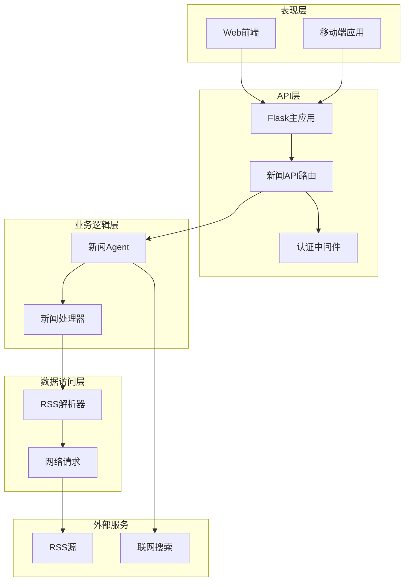
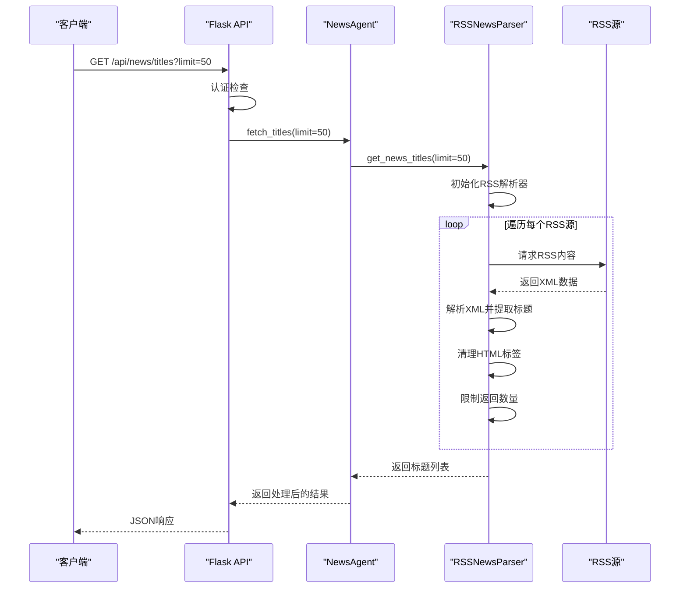
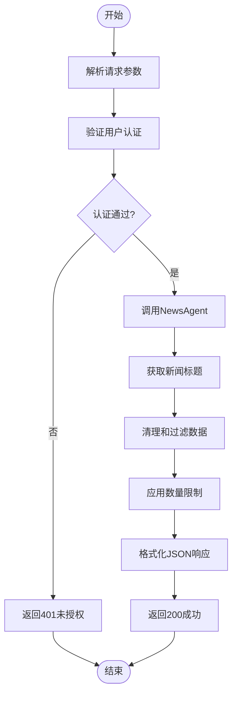
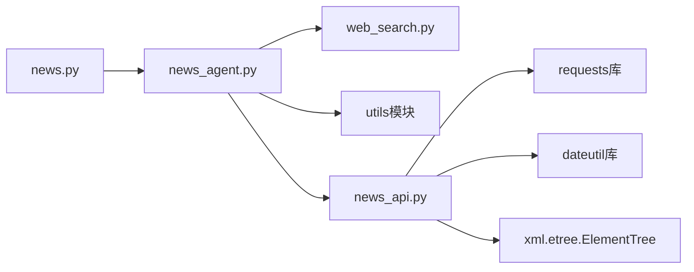

# 新闻API接口

<cite>
**本文档引用的文件**
- [news_api.py](file://src/news/news_api.py)
- [news.py](file://src/api/news.py)
- [main.py](file://src/api/main.py)
- [news_agent.py](file://src/agent/news_agent.py)
- [web_search.py](file://src/utils/web_search.py)
- [test_news_api.py](file://src/news/test/test_news_api.py)
- [README.md](file://src/news/README.md)
- [requirements.txt](file://requirements.txt)
- [apiService.js](file://src/web/src/services/apiService.js)
</cite>

## 目录
1. [简介](#简介)
2. [项目结构](#项目结构)
3. [核心组件](#核心组件)
4. [架构概览](#架构概览)
5. [详细组件分析](#详细组件分析)
6. [依赖关系分析](#依赖关系分析)
7. [性能考虑](#性能考虑)
8. [故障排除指南](#故障排除指南)
9. [结论](#结论)
10. [附录](#附录)

## 简介

本项目提供了一个完整的新闻API接口系统，专门用于获取和处理新闻标题数据。该系统基于RSS源聚合技术，能够从多个新闻源自动抓取最新的财经新闻标题，并通过RESTful API提供给上层应用使用。

系统的核心功能包括：
- 多RSS源聚合抓取
- 自动化的HTML标签清理
- 标准化的日期时间处理
- 统一的JSON响应格式
- 完整的错误处理机制

## 项目结构

新闻API系统的整体架构采用分层设计，主要分为以下几个层次：



**图表来源**
- [main.py](file://src/api/main.py#L40-L56)
- [news.py](file://src/api/news.py#L12-L13)
- [news_agent.py](file://src/agent/news_agent.py#L18-L23)

**章节来源**
- [main.py](file://src/api/main.py#L40-L56)
- [news.py](file://src/api/news.py#L12-L13)

## 核心组件

### get_news_titles 函数

`get_news_titles` 是系统对外提供的主要接口函数，负责获取新闻标题列表。该函数是整个新闻API系统的核心入口点。

#### 函数签名与参数

```python
def get_news_titles(limit: int = 100, sources: Optional[List[tuple]] = None) -> List[str]:
```

**参数规范：**
- `limit` (int): 最多返回的标题数量，默认值为100
- `sources` (List[tuple], 可选): 自定义RSS源列表，每个元素为(地址, 名称)元组

**返回值格式：**
- 返回类型：`List[str]`
- 返回内容：新闻标题字符串列表
- 编码格式：UTF-8 Unicode

**章节来源**
- [news_api.py](file://src/news/news_api.py#L233-L248)

### RSSNewsParser 类

`RSSNewsParser` 是内部使用的RSS解析器类，负责处理具体的RSS源抓取和数据解析工作。

#### 主要方法

1. **`parse_rss_feed(rss_url: str, source_name: str = None)`**
   - 解析单个RSS源并返回NewsItem对象列表

2. **`fetch_titles(rss_urls: List[str] = None, source_names: List[str] = None, limit: int = 100)`**
   - 聚合多个RSS源并返回标题列表

3. **`clean_html_tags(text: str)`**
   - 清理HTML标签和特殊字符

4. **`parse_datetime(date_str: str)`**
   - 解析多种格式的日期字符串

**章节来源**
- [news_api.py](file://src/news/news_api.py#L41-L231)

### 默认数据源配置

系统预置了两个默认的RSS数据源：

| 数据源名称 | RSS地址 | 描述 |
|------------|---------|------|
| 财富中文网 | https://plink.anyfeeder.com/fortunechina | 财经新闻权威来源 |
| 经济日报 | https://plink.anyfeeder.com/jingjiribao | 国家级经济媒体 |

这些数据源通过`DEFAULT_SOURCES`常量进行定义，可以在调用`get_news_titles`函数时通过`sources`参数进行覆盖。

**章节来源**
- [news_api.py](file://src/news/news_api.py#L35-L38)

## 架构概览

新闻API系统采用典型的三层架构设计，实现了清晰的职责分离：



**图表来源**
- [news.py](file://src/api/news.py#L16-L30)
- [news_agent.py](file://src/agent/news_agent.py#L18-L23)
- [news_api.py](file://src/news/news_api.py#L233-L248)

## 详细组件分析

### API路由设计

系统提供了三个主要的API端点：

#### 1. 获取新闻标题端点

**端点**: `GET /api/news/titles`
**参数**: 
- `limit` (查询参数): 返回的标题数量限制，默认50

**响应格式**:
```json
{
    "titles": ["标题1", "标题2", "标题3"],
    "count": 3
}
```

#### 2. 关键词筛选端点

**端点**: `POST /api/news/filter`
**请求体**:
```json
{
    "keywords": ["关键词1", "关键词2"],
    "titles": ["标题1", "标题2", "标题3"]
}
```

**响应格式**:
```json
{
    "filtered_news": ["匹配的标题1", "匹配的标题2"],
    "count": 2
}
```

#### 3. 相关新闻获取端点

**端点**: `POST /api/news/relevant`
**请求体**:
```json
{
    "keywords": ["关键词1", "关键词2"],
    "limit": 50
}
```

**响应格式**:
```json
{
    "timestamp": "2024-01-01T12:00:00+08:00",
    "total_titles": 0,
    "relevant_titles": [],
    "web_results": []
}
```

**章节来源**
- [news.py](file://src/api/news.py#L16-L74)

### 数据处理流程

系统的数据处理流程遵循以下步骤：



**图表来源**
- [news.py](file://src/api/news.py#L16-L30)
- [news_agent.py](file://src/agent/news_agent.py#L18-L23)

### 错误处理机制

系统实现了多层次的错误处理机制：

1. **认证错误**: 未登录用户返回401状态码
2. **参数错误**: 缺少必需参数返回400状态码  
3. **服务器错误**: 内部异常返回500状态码
4. **网络错误**: RSS源访问失败时记录日志并继续处理其他源

**章节来源**
- [news.py](file://src/api/news.py#L19-L30)

## 依赖关系分析

### 外部依赖

系统的主要外部依赖包括：

| 依赖包 | 版本要求 | 用途 |
|--------|----------|------|
| requests | >=2.31.0 | HTTP请求处理 |
| feedparser | >=6.0.0 | RSS/Atom格式解析 |
| lxml | >=4.9.0 | XML解析 |
| beautifulsoup4 | >=4.12.0 | HTML标签清理 |
| python-dateutil | >=2.8.0 | 日期时间解析 |
| flask | >=3.0.0 | Web框架 |
| flask-cors | >=4.0.0 | 跨域支持 |
| pandas | >=2.0.0 | 数据处理 |
| numpy | >=1.24.0 | 数值计算 |

### 内部组件依赖



**图表来源**
- [news.py](file://src/api/news.py#L8-L10)
- [news_agent.py](file://src/agent/news_agent.py#L15)
- [news_api.py](file://src/news/news_api.py#L18-L18)

**章节来源**
- [requirements.txt](file://requirements.txt#L1-L41)

## 性能考虑

### 性能特征

1. **响应时间**: 
   - 单个RSS源平均响应时间: 2-5秒
   - 多源聚合响应时间: 5-15秒
   - 取决于网络状况和RSS源可用性

2. **并发处理**:
   - 系统支持多线程并发访问
   - 每个RSS源之间有1秒延迟避免过度请求
   - 建议在高并发场景下实施限流策略

3. **内存使用**:
   - 单次请求最多处理约100个标题
   - 内存占用相对较小，适合长时间运行

### 使用限制

1. **最大返回条数**: 默认50条，可通过limit参数调整
2. **调用频率**: 建议每分钟不超过10次请求
3. **并发访问**: 建议同时不超过5个并发连接
4. **缓存策略**: 建议在应用层实现1-5分钟缓存

### 优化建议

1. **客户端缓存**: 在应用层实现智能缓存机制
2. **批量请求**: 合并多个API调用减少网络开销
3. **错误重试**: 实现指数退避的错误重试机制
4. **监控告警**: 设置请求成功率和响应时间监控

## 故障排除指南

### 常见问题及解决方案

#### 1. 认证失败 (401错误)
**症状**: 返回"未授权"错误
**原因**: 缺少有效的认证令牌
**解决方案**: 
- 确保在请求头中包含正确的Authorization令牌
- 检查令牌是否过期
- 重新登录获取新的令牌

#### 2. RSS源访问失败
**症状**: 部分或全部RSS源无法获取数据
**原因**: 网络连接问题或RSS源不可用
**解决方案**:
- 检查网络连接状态
- 验证RSS源地址的有效性
- 查看系统日志获取详细错误信息

#### 3. 响应超时
**症状**: API请求超时或响应缓慢
**原因**: 网络延迟或RSS源响应慢
**解决方案**:
- 增加请求超时时间
- 实现重试机制
- 考虑使用本地缓存

#### 4. 数据格式异常
**症状**: 返回的数据格式不符合预期
**原因**: RSS源格式变化或解析错误
**解决方案**:
- 检查RSS源的最新格式
- 更新解析器以支持新格式
- 实施数据验证和清理

**章节来源**
- [news.py](file://src/api/news.py#L19-L30)
- [news_api.py](file://src/news/news_api.py#L186-L194)

### 调试技巧

1. **启用详细日志**: 设置环境变量`LOG_LEVEL=DEBUG`
2. **监控网络请求**: 使用浏览器开发者工具查看API调用
3. **测试独立功能**: 直接调用`get_news_titles`函数进行单元测试
4. **检查依赖版本**: 确保所有依赖包版本符合要求

**章节来源**
- [test_news_api.py](file://src/news/test/test_news_api.py#L10-L14)

## 结论

本新闻API接口系统提供了完整、可靠的新闻数据获取解决方案。通过合理的架构设计和完善的错误处理机制，系统能够在保证稳定性的同时提供高质量的新闻数据服务。

**主要优势**：
- 多RSS源聚合，确保数据来源的多样性
- 自动化的数据清理和标准化处理
- 完善的错误处理和监控机制
- 灵活的参数配置和扩展能力

**适用场景**：
- 财经新闻聚合应用
- 投资决策支持系统
- 新闻推荐算法
- 实时市场监控

## 附录

### API使用示例

#### 基本调用示例

**JavaScript (前端)**:
```javascript
// 获取默认数量的新闻标题
const titles = await newsService.getTitles();

// 获取指定数量的新闻标题
const limitedTitles = await newsService.getTitles(100);

// 关键词筛选
const filtered = await newsService.filter(['股票', '市场'], titles);

// 获取相关新闻
const relevant = await newsService.getRelevant(['A股', '政策']);
```

**Python (后端)**:
```python
from news_api import get_news_titles

# 获取默认数量的标题
titles = get_news_titles()

# 获取指定数量的标题
limited_titles = get_news_titles(limit=50)

# 使用自定义数据源
custom_sources = [
    ("https://example.com/rss", "自定义源1"),
    ("https://news.example.com/rss", "自定义源2")
]
custom_titles = get_news_titles(limit=100, sources=custom_sources)
```

#### 错误处理示例

```javascript
try {
    const response = await newsService.getTitles(50);
    if (response.error) {
        throw new Error(response.error);
    }
    console.log(`获取到 ${response.count} 条新闻`);
} catch (error) {
    console.error('获取新闻失败:', error.message);
}
```

### 最佳实践建议

1. **参数验证**: 始终验证输入参数的有效性
2. **错误恢复**: 实现优雅的错误恢复和降级策略
3. **性能监控**: 建立完整的性能监控和告警机制
4. **安全考虑**: 实施适当的访问控制和速率限制
5. **文档维护**: 保持API文档与代码实现同步更新

### 扩展开发指南

1. **添加新RSS源**: 在`DEFAULT_SOURCES`中添加新的数据源配置
2. **自定义解析器**: 扩展`RSSNewsParser`类以支持新的数据格式
3. **增强过滤功能**: 在`NewsAgent`中添加更复杂的筛选逻辑
4. **集成更多服务**: 扩展系统以支持更多的外部服务集成

**章节来源**
- [README.md](file://src/news/README.md#L37-L45)