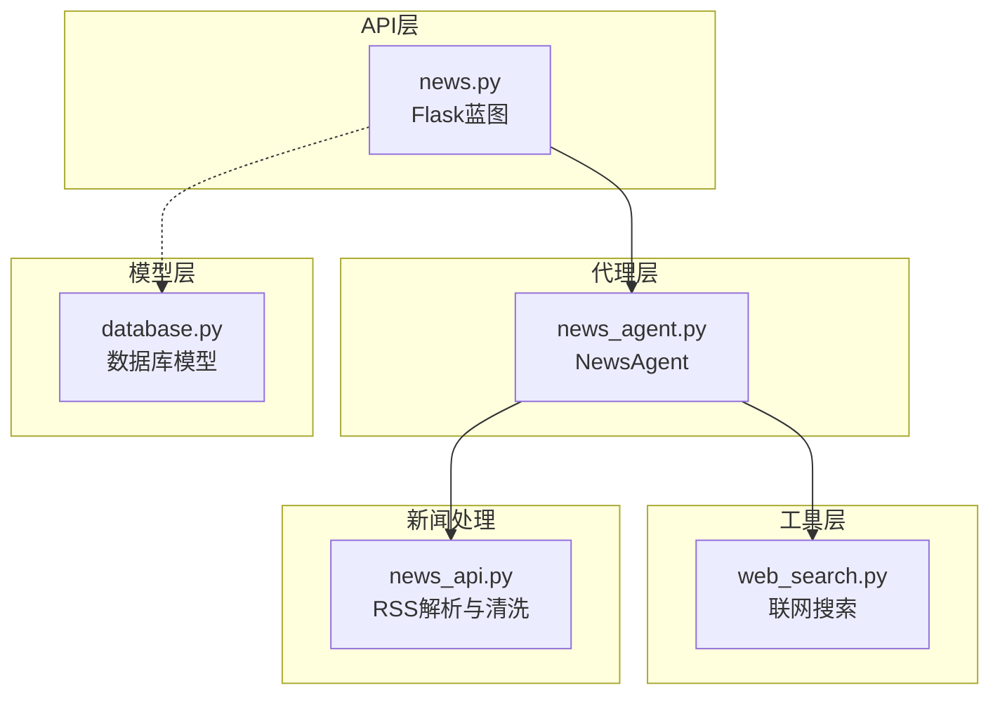
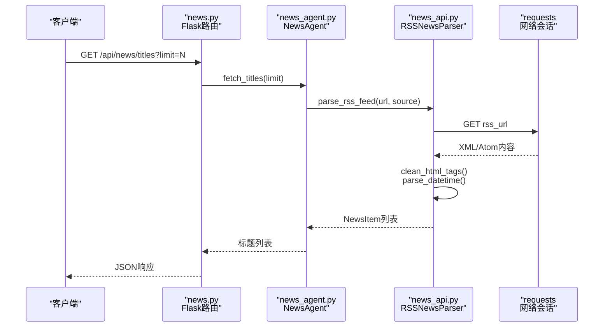
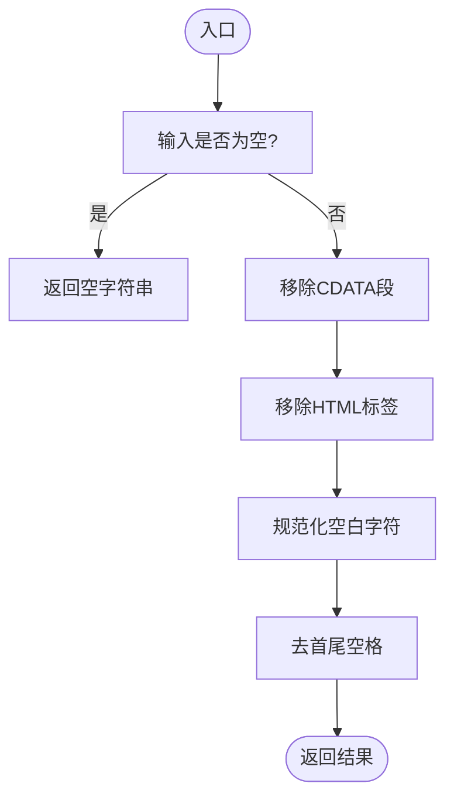
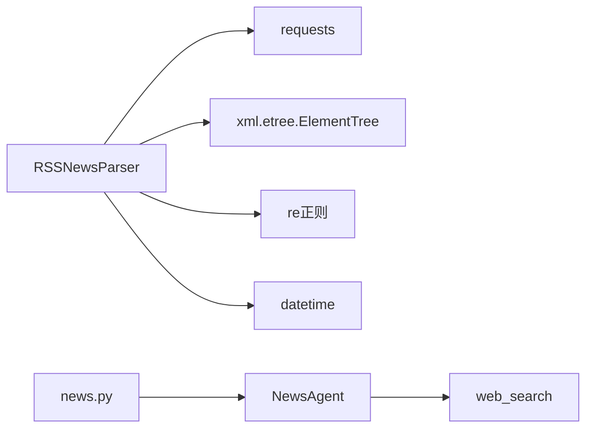

# 新闻内容处理

<cite>
**本文引用的文件**
- [src/news/news_api.py](file://src/news/news_api.py)
- [src/news/README.md](file://src/news/README.md)
- [src/news/test/test_news_api.py](file://src/news/test/test_news_api.py)
- [src/news/requirements.txt](file://src/news/requirements.txt)
- [src/agent/news_agent.py](file://src/agent/news_agent.py)
- [src/api/news.py](file://src/api/news.py)
- [src/utils/web_search.py](file://src/utils/web_search.py)
- [src/models/database.py](file://src/models/database.py)
- [src/api/main.py](file://src/api/main.py)
</cite>

## 目录
1. [引言](#引言)
2. [项目结构](#项目结构)
3. [核心组件](#核心组件)
4. [架构总览](#架构总览)
5. [详细组件分析](#详细组件分析)
6. [依赖关系分析](#依赖关系分析)
7. [性能考虑](#性能考虑)
8. [故障排查指南](#故障排查指南)
9. [结论](#结论)
10. [附录](#附录)

## 引言
本文件面向“新闻内容处理”模块，系统性阐述从RSS源抓取、解析、清洗到统一输出的全流程，重点覆盖以下方面：
- HTML标签清理、文本规范化、编码与空白处理
- 日期时间解析与多格式兼容、时区处理
- 新闻项数据结构设计与字段处理逻辑
- 内容质量控制（空值处理、重复过滤、长度校验）
- 文本清理算法（正则表达式、特殊字符去除、格式标准化）
- 性能优化策略与内存管理建议

该模块为上层Agent与API提供结构化新闻数据，支撑投资分析与决策。

## 项目结构
新闻相关内容主要分布在如下位置：
- news子模块：RSS解析、清洗与对外接口
- agent层：NewsAgent负责整合RSS与联网搜索
- api层：Flask蓝图提供REST接口
- utils层：联网搜索工具
- models层：数据库模型（与新闻处理无直接耦合）

图表来源
- [src/api/news.py](file://src/api/news.py#L1-L75)
- [src/agent/news_agent.py](file://src/agent/news_agent.py#L1-L93)
- [src/utils/web_search.py](file://src/utils/web_search.py#L1-L80)
- [src/news/news_api.py](file://src/news/news_api.py#L1-L248)
- [src/models/database.py](file://src/models/database.py#L1-L86)

章节来源
- [src/news/README.md](file://src/news/README.md#L1-L46)
- [src/news/news_api.py](file://src/news/news_api.py#L1-L248)
- [src/agent/news_agent.py](file://src/agent/news_agent.py#L1-L93)
- [src/api/news.py](file://src/api/news.py#L1-L75)
- [src/utils/web_search.py](file://src/utils/web_search.py#L1-L80)
- [src/models/database.py](file://src/models/database.py#L1-L86)

## 核心组件
- RSSNewsParser：负责RSS/Atom解析、HTML标签清理、日期时间解析、NewsItem构建与聚合
- NewsItem：统一的新闻项数据结构，包含标题、链接、描述、发布时间、来源
- NewsAgent：对外提供标题获取、关键词筛选、联网搜索整合
- API路由：提供/titles、/filter、/relevant等端点
- 联网搜索工具：基于DuckDuckGo的搜索封装

章节来源
- [src/news/news_api.py](file://src/news/news_api.py#L25-L33)
- [src/news/news_api.py](file://src/news/news_api.py#L41-L231)
- [src/agent/news_agent.py](file://src/agent/news_agent.py#L18-L93)
- [src/api/news.py](file://src/api/news.py#L16-L74)
- [src/utils/web_search.py](file://src/utils/web_search.py#L39-L80)

## 架构总览
下面以序列图展示一次“获取新闻标题”的端到端流程：

图表来源
- [src/api/news.py](file://src/api/news.py#L16-L31)
- [src/agent/news_agent.py](file://src/agent/news_agent.py#L25-L47)
- [src/news/news_api.py](file://src/news/news_api.py#L100-L195)

## 详细组件分析

### RSSNewsParser：数据清洗与解析
- HTML标签清理
  - 处理CDATA段
  - 移除所有HTML标签
  - 规范化空白字符，去首尾空格
- 日期时间解析
  - 支持RFC 2822、ISO 8601等多种格式
  - 自动补全UTC时区
  - 解析失败回退至当前UTC时间
- RSS/Atom解析
  - 兼容标准RSS与Atom格式
  - 提取title/link/description/pubDate/updated
  - 生成NewsItem并填充source
- 聚合与限制
  - 支持多源聚合，按limit截断
  - 单源间加入短暂延迟避免触发限流

图表来源
- [src/news/news_api.py](file://src/news/news_api.py#L54-L69)

章节来源
- [src/news/news_api.py](file://src/news/news_api.py#L54-L98)
- [src/news/news_api.py](file://src/news/news_api.py#L100-L195)
- [src/news/news_api.py](file://src/news/news_api.py#L196-L226)

### NewsItem：统一数据结构
- 字段
  - title：标题（已清理HTML）
  - link：原文链接
  - description：摘要（已清理HTML）
  - pub_date：发布时间（datetime，UTC）
  - source：来源名称
- 设计要点
  - 严格的数据类型约束
  - 统一的时区处理（UTC）
  - 便于后续排序、去重与持久化

章节来源
- [src/news/news_api.py](file://src/news/news_api.py#L25-L33)

### NewsAgent：标题获取与筛选
- fetch_titles_with_web：结合联网搜索结果
- search_web_by_keywords：关键词拼接并调用web_search
- get_relevant_titles：返回时间戳、总数、相关标题占位等（实际筛选逻辑可扩展）

章节来源
- [src/agent/news_agent.py](file://src/agent/news_agent.py#L25-L92)

### API路由：对外接口
- GET /api/news/titles：分页参数limit，返回标题数组与数量
- POST /api/news/filter：按关键词对给定标题集合进行筛选（占位实现）
- POST /api/news/relevant：根据关键词返回相关结果摘要（占位实现）

章节来源
- [src/api/news.py](file://src/api/news.py#L16-L74)

### 联网搜索工具：web_search
- 基于DuckDuckGo，支持区域与代理控制
- 输出统一的标题/链接/摘要字段
- 失败时记录日志并返回空列表

章节来源
- [src/utils/web_search.py](file://src/utils/web_search.py#L39-L80)

## 依赖关系分析
- 外部依赖（news子模块）
  - requests：网络请求
  - lxml/beautifulsoup4：XML/HTML解析（注：RSS解析使用xml.etree.ElementTree）
  - feedparser：可选增强（当前未直接使用）
  - python-dateutil：日期解析（当前使用datetime.strptime）
  - pandas/numpy：数据分析（当前未直接使用）
  - aiohttp/asyncio-mqtt：可选异步支持（当前未直接使用）

图表来源
- [src/news/news_api.py](file://src/news/news_api.py#L10-L18)
- [src/agent/news_agent.py](file://src/agent/news_agent.py#L15-L16)
- [src/api/news.py](file://src/api/news.py#L8-L13)

章节来源
- [src/news/requirements.txt](file://src/news/requirements.txt#L1-L19)
- [src/news/news_api.py](file://src/news/news_api.py#L10-L18)
- [src/agent/news_agent.py](file://src/agent/news_agent.py#L15-L16)
- [src/api/news.py](file://src/api/news.py#L8-L13)

## 性能考虑
- 网络与解析
  - 使用requests.Session复用连接，减少握手开销
  - 单源解析后sleep短间隔，降低被限流风险
  - XML解析采用ElementTree，轻量高效
- 正则与字符串处理
  - 清洗流程为单次正则替换+空白规范化，复杂度O(n)
  - 建议对大文本分块处理或流式读取（当前实现按字段处理，无需额外优化）
- 内存管理
  - 逐条解析并立即产出NewsItem，避免累积大量中间对象
  - 限制返回数量（limit），防止内存膨胀
  - 使用生成器模式可进一步降低峰值内存（当前聚合后一次性返回）
- 并发与缓存
  - 当前未引入并发抓取；若扩展可考虑线程池/异步
  - 已有全局工具缓存（DecisionAgent中），可借鉴ttl与容量控制策略

章节来源
- [src/news/news_api.py](file://src/news/news_api.py#L44-L52)
- [src/news/news_api.py](file://src/news/news_api.py#L222-L226)
- [src/agent/decision_agent.py](file://src/agent/decision_agent.py#L77-L92)

## 故障排查指南
- 网络请求失败
  - 现象：解析XML失败或返回空列表
  - 排查：检查RSS URL可达性、超时设置、代理配置
  - 日志：查看API层与news_api层的日志输出
- 日期解析异常
  - 现象：pubDate回退为当前UTC时间
  - 排查：确认RSS源pubDate格式是否在支持列表内
- HTML标签残留
  - 现象：标题/描述仍含HTML片段
  - 排查：确认CDATA处理与标签移除顺序
- 关键词筛选无效
  - 现象：/filter端点返回占位结果
  - 排查：确认NewsAgent中filter_by_keywords实现是否完善

章节来源
- [src/news/news_api.py](file://src/news/news_api.py#L186-L194)
- [src/news/news_api.py](file://src/news/news_api.py#L71-L98)
- [src/api/news.py](file://src/api/news.py#L29-L30)
- [src/agent/news_agent.py](file://src/agent/news_agent.py#L69-L92)

## 结论
本模块提供了完整的RSS新闻采集、清洗与输出能力，具备：
- 稳健的HTML清理与日期解析
- 统一的数据结构与简洁的对外接口
- 可扩展的筛选与整合能力（NewsAgent与API路由预留）

建议在生产环境中：
- 增加重复内容过滤与内容长度校验
- 引入并发抓取与缓存策略
- 扩展关键词筛选与内容质量评分

## 附录

### 数据结构设计与字段处理
- NewsItem字段
  - title：必填，HTML清理后输出
  - link：可选，优先取text，否则取href属性
  - description：必填，HTML清理后输出
  - pub_date：必填，解析失败回退UTC当前时间
  - source：必填，来自URL域名或显式传入

章节来源
- [src/news/news_api.py](file://src/news/news_api.py#L25-L33)
- [src/news/news_api.py](file://src/news/news_api.py#L140-L177)

### 内容质量控制机制（建议）
- 空值处理
  - 标题/描述为空时丢弃该项或填充占位符
- 重复内容过滤
  - 基于标题相似度或指纹去重
- 内容长度验证
  - 设置最小/最大长度阈值，剔除异常样本
- 编码与格式标准化
  - 统一转为UTF-8，去除不可见字符与多余空白

[本节为通用实践建议，不直接分析具体文件，故无章节来源]