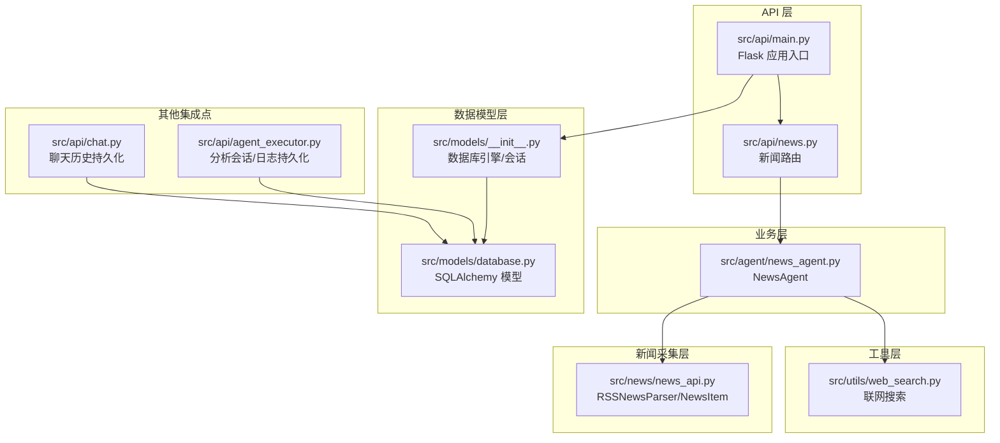
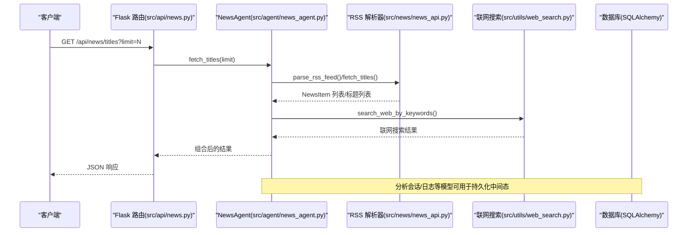
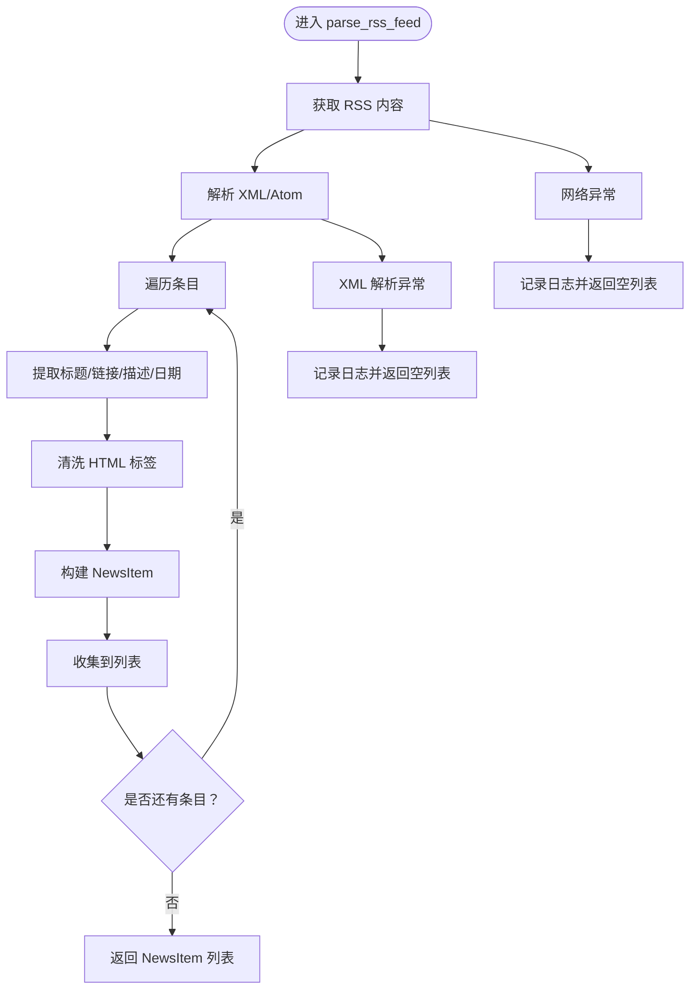
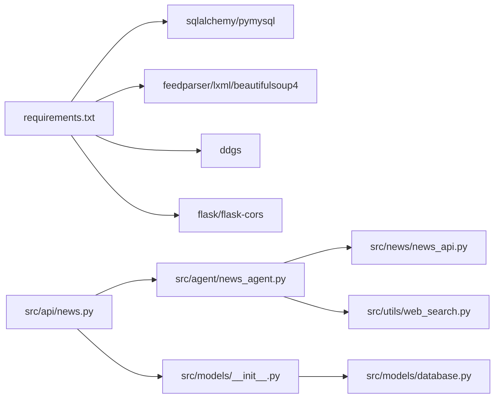

# 新闻数据存储

<cite>
**本文引用的文件**
- [src/news/news_api.py](file://src/news/news_api.py)
- [src/news/README.md](file://src/news/README.md)
- [src/models/database.py](file://src/models/database.py)
- [src/models/__init__.py](file://src/models/__init__.py)
- [src/api/news.py](file://src/api/news.py)
- [src/api/main.py](file://src/api/main.py)
- [src/agent/news_agent.py](file://src/agent/news_agent.py)
- [src/utils/web_search.py](file://src/utils/web_search.py)
- [src/api/agent_executor.py](file://src/api/agent_executor.py)
- [src/api/chat.py](file://src/api/chat.py)
- [.env](file://.env)
- [requirements.txt](file://requirements.txt)
- [run.py](file://run.py)
</cite>

## 目录
1. [引言](#引言)
2. [项目结构](#项目结构)
3. [核心组件](#核心组件)
4. [架构总览](#架构总览)
5. [详细组件分析](#详细组件分析)
6. [依赖关系分析](#依赖关系分析)
7. [性能考虑](#性能考虑)
8. [故障排查指南](#故障排查指南)
9. [结论](#结论)
10. [附录](#附录)

## 引言
本文件面向“新闻数据存储系统”的设计与实现，聚焦以下目标：
- 新闻数据的存储策略与数据模型设计，重点说明 NewsItem 数据类的字段定义与关系映射。
- 新闻数据的持久化方案：数据序列化、存储格式、索引策略等技术实现现状与建议。
- 数据生命周期管理：导入、更新、删除、归档等操作流程。
- 数据备份与恢复机制：完整性检查、故障恢复、版本迁移等保障措施。
- 存储性能优化策略：批量写入、事务处理、并发控制等。
- 存储扩展指南与容量规划建议。

说明：当前仓库中未发现直接持久化 NewsItem 的数据库模型或持久化逻辑。本文在现有代码基础上，给出基于现有数据结构与接口的存储策略建议与实现路径，帮助读者在不破坏现有架构的前提下扩展新闻数据的持久化能力。

## 项目结构
本项目采用分层与功能域划分的组织方式：
- API 层：Flask 蓝图提供新闻相关接口，负责鉴权与路由转发。
- 业务层：NewsAgent 负责新闻标题获取与筛选，可结合联网搜索增强相关性。
- 新闻采集层：RSSNewsParser 提供 RSS/Atom 解析与清洗，输出统一的 NewsItem 数据类。
- 数据模型层：SQLAlchemy 定义用户、聊天历史、分析会话与 Agent 日志等模型。
- 工具层：联网搜索工具提供网络检索能力，辅助新闻相关性筛选。
- 配置与依赖：环境变量与 requirements 文件定义数据库连接与外部依赖。

图表来源
- [src/api/news.py](file://src/api/news.py#L1-L75)
- [src/api/main.py](file://src/api/main.py#L1-L243)
- [src/agent/news_agent.py](file://src/agent/news_agent.py#L1-L93)
- [src/news/news_api.py](file://src/news/news_api.py#L1-L248)
- [src/models/database.py](file://src/models/database.py#L1-L86)
- [src/models/__init__.py](file://src/models/__init__.py#L1-L32)
- [src/utils/web_search.py](file://src/utils/web_search.py#L1-L80)
- [src/api/agent_executor.py](file://src/api/agent_executor.py#L50-L210)
- [src/api/chat.py](file://src/api/chat.py#L54-L100)

章节来源
- [src/api/news.py](file://src/api/news.py#L1-L75)
- [src/api/main.py](file://src/api/main.py#L1-L243)
- [src/agent/news_agent.py](file://src/agent/news_agent.py#L1-L93)
- [src/news/news_api.py](file://src/news/news_api.py#L1-L248)
- [src/models/database.py](file://src/models/database.py#L1-L86)
- [src/models/__init__.py](file://src/models/__init__.py#L1-L32)
- [src/utils/web_search.py](file://src/utils/web_search.py#L1-L80)
- [src/api/agent_executor.py](file://src/api/agent_executor.py#L50-L210)
- [src/api/chat.py](file://src/api/chat.py#L54-L100)

## 核心组件
- NewsItem 数据类：统一的新闻项结构，包含标题、链接、描述、发布时间、来源等字段，用于跨模块的数据交换。
- RSSNewsParser：负责 RSS/Atom 订阅源解析、HTML 标签清洗、日期解析与时区处理，并输出 NewsItem 列表。
- NewsAgent：封装新闻获取与筛选逻辑，支持联网搜索增强相关性。
- API 路由：提供标题获取、关键词筛选、相关新闻查询等接口。
- 数据模型：当前包含用户、聊天历史、分析会话、Agent 日志等模型，可用于承载新闻相关的中间态或元数据。

章节来源
- [src/news/news_api.py](file://src/news/news_api.py#L25-L33)
- [src/news/news_api.py](file://src/news/news_api.py#L41-L231)
- [src/agent/news_agent.py](file://src/agent/news_agent.py#L18-L93)
- [src/api/news.py](file://src/api/news.py#L1-L75)
- [src/models/database.py](file://src/models/database.py#L24-L86)

## 架构总览
下图展示从 API 请求到业务处理、数据采集与存储的整体流程。当前实现中，新闻标题获取主要通过 RSS 解析与联网搜索完成，未直接持久化 NewsItem；分析会话与日志等模型可用于承载中间态或元数据。

图表来源
- [src/api/news.py](file://src/api/news.py#L16-L31)
- [src/agent/news_agent.py](file://src/agent/news_agent.py#L25-L47)
- [src/news/news_api.py](file://src/news/news_api.py#L100-L226)
- [src/utils/web_search.py](file://src/utils/web_search.py#L39-L80)
- [src/models/database.py](file://src/models/database.py#L53-L86)

## 详细组件分析

### NewsItem 数据类与关系映射
- 字段定义
  - 标题：字符串，用于展示与检索。
  - 链接：字符串，指向原文链接。
  - 描述：字符串，摘要或正文片段。
  - 发布时间：日期时间，含时区信息，便于排序与过滤。
  - 来源：字符串，标识 RSS 源或网站域名。
- 关系映射
  - 当前未在 SQLAlchemy 中定义 NewsItem 的持久化模型，NewsItem 主要用于内存中的数据结构与跨模块传递。
  - 若需持久化，可在数据库模型层新增“新闻条目”表，并与用户、会话等实体建立外键关联（建议在后续章节给出建模建议）。

章节来源
- [src/news/news_api.py](file://src/news/news_api.py#L25-L33)
- [src/news/news_api.py](file://src/news/news_api.py#L100-L195)

### RSS 新闻解析器（RSSNewsParser）
- 功能要点
  - 支持标准 RSS 与 Atom 格式。
  - 清洗 HTML 标签并规范化空白。
  - 多种日期格式解析与时区处理。
  - 聚合多个 RSS 源并限制返回数量。
- 错误处理
  - 网络请求异常、XML 解析异常均被捕获并记录日志，避免中断流程。
- 性能特性
  - 单次抓取后 sleep 以降低频率，缓解源站点压力。

图表来源
- [src/news/news_api.py](file://src/news/news_api.py#L100-L195)

章节来源
- [src/news/news_api.py](file://src/news/news_api.py#L41-L231)

### NewsAgent 与联网搜索
- 能力概述
  - 提供 fetch_titles_with_web、search_web_by_keywords、get_relevant_titles 等方法。
  - 通过联网搜索补充 RSS 之外的新闻来源，提升相关性。
- 缓存与限频
  - 提供默认缓存时长与限制参数，便于在上层调用侧实施缓存与限频策略。

章节来源
- [src/agent/news_agent.py](file://src/agent/news_agent.py#L18-L93)
- [src/utils/web_search.py](file://src/utils/web_search.py#L39-L80)

### API 路由与鉴权
- 路由接口
  - 获取标题：GET /api/news/titles
  - 关键词筛选：POST /api/news/filter
  - 相关新闻：POST /api/news/relevant
- 鉴权与错误处理
  - 所有路由均需通过 get_current_user 鉴权，失败返回 401。
  - 异常统一捕获并返回 500。

章节来源
- [src/api/news.py](file://src/api/news.py#L16-L75)
- [src/api/main.py](file://src/api/main.py#L85-L101)

### 数据模型与数据库初始化
- 模型清单
  - 用户表：用户基本信息与活跃状态。
  - 聊天历史表：用户对话记录，支持按会话 ID 查询。
  - 分析会话表：分析任务的状态、进度与中间结果摘要。
  - Agent 日志表：记录各 Agent 执行步骤与状态。
- 初始化与会话
  - 通过 DATABASE_URL 连接数据库（默认 SQLite），创建所有表。
  - 提供上下文管理器 get_db 以确保会话正确关闭。

章节来源
- [src/models/database.py](file://src/models/database.py#L24-L86)
- [src/models/__init__.py](file://src/models/__init__.py#L14-L32)
- [.env](file://.env#L39-L41)

### 数据持久化现状与建议
- 现状
  - 未发现直接持久化 NewsItem 的模型或写入逻辑。
  - 分析会话与日志模型可用于承载中间态或元数据，便于追踪与恢复。
- 建议
  - 新增“新闻条目”表，字段建议包含：标题、链接、描述、发布时间、来源、创建时间、更新时间等。
  - 与“分析会话”建立关联，记录每次分析所用的新闻集合。
  - 在入库前进行去重（基于标题/链接）、标准化（时间、来源）与校验。

章节来源
- [src/models/database.py](file://src/models/database.py#L24-L86)
- [src/api/agent_executor.py](file://src/api/agent_executor.py#L191-L210)

## 依赖关系分析
- 外部依赖
  - requests、feedparser、lxml、beautifulsoup4 用于网络请求与解析。
  - sqlalchemy、pymysql 用于数据库访问。
  - ddgs 用于联网搜索。
- 内部依赖
  - API 路由依赖 NewsAgent；NewsAgent 依赖 RSS 解析器与联网搜索工具。
  - 数据模型依赖 SQLAlchemy；数据库初始化依赖环境变量 DATABASE_URL。

图表来源
- [requirements.txt](file://requirements.txt#L1-L41)
- [src/api/news.py](file://src/api/news.py#L1-L75)
- [src/agent/news_agent.py](file://src/agent/news_agent.py#L1-L93)
- [src/news/news_api.py](file://src/news/news_api.py#L1-L248)
- [src/utils/web_search.py](file://src/utils/web_search.py#L1-L80)
- [src/models/__init__.py](file://src/models/__init__.py#L1-L32)
- [src/models/database.py](file://src/models/database.py#L1-L86)

章节来源
- [requirements.txt](file://requirements.txt#L1-L41)
- [src/api/news.py](file://src/api/news.py#L1-L75)
- [src/agent/news_agent.py](file://src/agent/news_agent.py#L1-L93)
- [src/news/news_api.py](file://src/news/news_api.py#L1-L248)
- [src/utils/web_search.py](file://src/utils/web_search.py#L1-L80)
- [src/models/__init__.py](file://src/models/__init__.py#L1-L32)
- [src/models/database.py](file://src/models/database.py#L1-L86)

## 性能考虑
- 批量写入
  - 建议在新增新闻条目表后，采用批量插入（ORM 批量或原生 SQL）减少往返开销。
- 事务处理
  - 使用 get_db 的上下文管理器确保事务边界清晰，失败自动回滚。
- 并发控制
  - API 层无显式锁；若引入入库操作，建议在入库前加互斥锁或使用数据库行级锁。
- 索引策略
  - 对“标题”、“来源”、“发布时间”建立索引，提升查询与去重效率。
- 缓存与限频
  - RSS 解析器已内置限频；建议在上层调用侧增加缓存与限速策略，避免源站点压力过大。

章节来源
- [src/news/news_api.py](file://src/news/news_api.py#L222-L226)
- [src/models/__init__.py](file://src/models/__init__.py#L25-L32)
- [src/models/database.py](file://src/models/database.py#L24-L86)

## 故障排查指南
- 数据库连接问题
  - 检查 DATABASE_URL 是否正确（默认 SQLite，生产建议 MySQL）。
  - 确认 init_db 已在应用启动时调用。
- 网络请求失败
  - RSS 源不可达或格式异常会被捕获并记录日志；检查网络代理与超时设置。
- 联网搜索不可用
  - ddgs 依赖缺失或代理配置不当会导致搜索失败；检查 DDGS_* 环境变量。
- API 鉴权失败
  - 未登录或 Token 无效将返回 401；确认鉴权中间件与前端请求头。

章节来源
- [.env](file://.env#L39-L41)
- [src/models/__init__.py](file://src/models/__init__.py#L20-L22)
- [src/news/news_api.py](file://src/news/news_api.py#L186-L194)
- [src/utils/web_search.py](file://src/utils/web_search.py#L55-L60)
- [src/api/news.py](file://src/api/news.py#L19-L21)

## 结论
- 当前系统以 RSS 解析与联网搜索为核心，提供新闻标题与相关内容的获取能力。
- 数据持久化方面尚未实现 NewsItem 的直接入库，但分析会话与日志模型为后续扩展提供了良好的基础。
- 建议尽快引入“新闻条目”表与索引策略，配合批量写入与事务控制，形成完整的新闻数据存储闭环。

## 附录

### 数据生命周期管理（建议流程）
- 导入
  - 从 RSS 源与联网搜索获取 NewsItem 列表，入库前去重与标准化。
- 更新
  - 对热点新闻可定期重抓取并更新描述/链接；按来源设定刷新周期。
- 删除
  - 基于时间窗口（如超过一定期限）清理旧数据；删除前先备份。
- 归档
  - 将历史数据迁移到冷存储或只读副本，保留查询接口。

### 数据备份与恢复机制（建议）
- 备份
  - SQLite：直接复制数据库文件；MySQL：使用 mysqldump 或物理备份。
- 恢复
  - 停机窗口内替换数据库文件或导入 SQL；验证关键索引与外键。
- 完整性检查
  - 定期校验新闻条目数量与索引一致性；对异常批次进行修复。
- 版本迁移
  - 通过 Alembic 或自定义脚本迁移表结构；迁移前做好回滚预案。

### 存储扩展指南与容量规划
- 扩展方向
  - 引入分区表（按时间）与物化视图加速统计查询。
  - 使用列式存储或向量化索引（如向量库）支撑语义检索。
- 容量规划
  - 估算每日新增新闻条目数与平均大小，预留 3 年以上空间。
  - 控制索引数量与大小，避免过度占用磁盘与内存。

### 数据模型设计建议（新增）
- 新闻条目表（示例字段）
  - id、标题、链接、描述、发布时间、来源、创建时间、更新时间
  - 建议索引：标题全文索引、来源+发布时间组合索引
- 与分析会话关联
  - 在分析会话表中记录本次分析使用的新闻集合标识，便于回溯与审计

章节来源
- [src/models/database.py](file://src/models/database.py#L53-L86)
- [src/api/agent_executor.py](file://src/api/agent_executor.py#L191-L210)