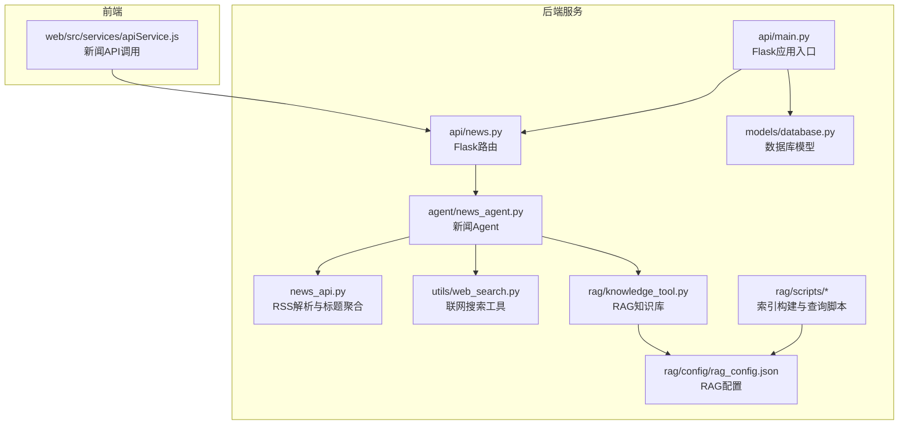
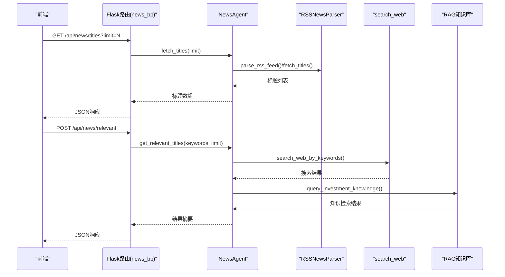
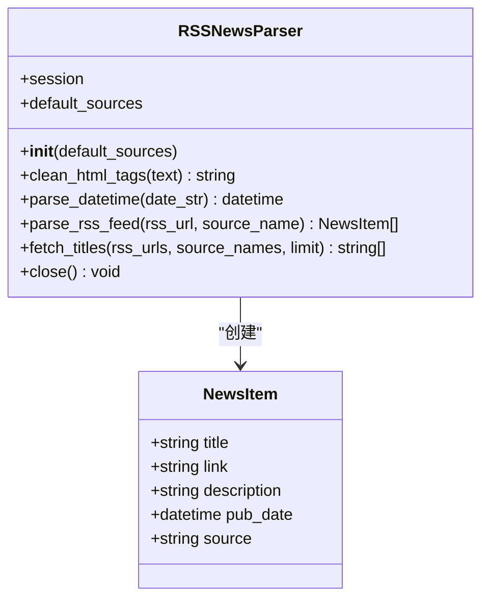
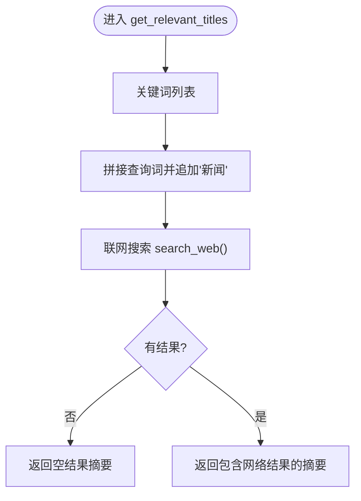
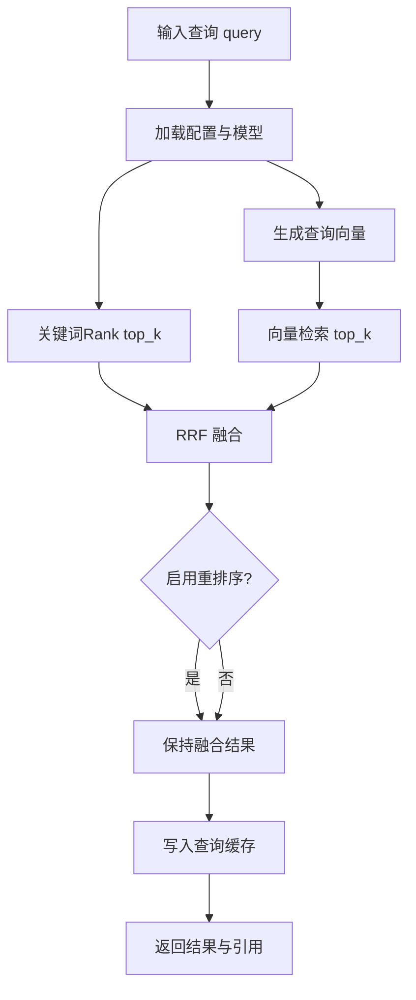
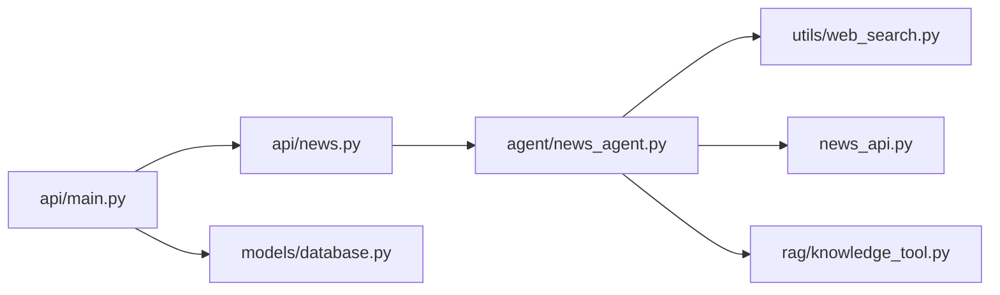

# 新闻数据服务

<cite>
**本文档引用的文件**
- [src/news/news_api.py](file://src/news/news_api.py)
- [src/news/README.md](file://src/news/README.md)
- [src/news/test/test_news_api.py](file://src/news/test/test_news_api.py)
- [src/api/news.py](file://src/api/news.py)
- [src/agent/news_agent.py](file://src/agent/news_agent.py)
- [src/utils/web_search.py](file://src/utils/web_search.py)
- [src/api/main.py](file://src/api/main.py)
- [src/models/database.py](file://src/models/database.py)
- [src/rag/knowledge_tool.py](file://src/rag/knowledge_tool.py)
- [src/rag/config/rag_config.json](file://src/rag/config/rag_config.json)
- [src/rag/scripts/build_index.py](file://src/rag/scripts/build_index.py)
- [src/rag/scripts/query_index.py](file://src/rag/scripts/query_index.py)
- [src/web/src/services/apiService.js](file://src/web/src/services/apiService.js)
- [requirements.txt](file://requirements.txt)
</cite>

## 目录
1. [简介](#简介)
2. [项目结构](#项目结构)
3. [核心组件](#核心组件)
4. [架构总览](#架构总览)
5. [详细组件分析](#详细组件分析)
6. [依赖关系分析](#依赖关系分析)
7. [性能考虑](#性能考虑)
8. [故障排除指南](#故障排除指南)
9. [结论](#结论)
10. [附录](#附录)

## 简介
本文件面向“新闻数据服务”的综合文档，聚焦于财经新闻数据的采集、处理与分析机制。当前系统采用多源采集策略，主要包括：
- RSS订阅源聚合：从多个财经媒体RSS源抓取新闻标题与描述
- 联网搜索集成：基于搜索引擎的关键词检索，补充热点与实时信息
- 内容预处理：HTML标签清洗、日期解析与时区处理、标题聚合
- 质量控制：超时与异常处理、日期解析回退策略
- 存储与索引：RAG知识库（向量化+重排序+关键词融合），支持混合检索与缓存
- API接口：提供新闻标题获取、关键词筛选、相关新闻推荐等REST接口
- 扩展指南：新增RSS源、自定义处理规则、性能优化建议

该服务为上层智能体（Agent）与前端应用提供结构化的新闻数据，支撑投资分析与决策。

## 项目结构
新闻数据服务主要分布在以下模块：
- news子模块：RSS解析与标题聚合
- utils子模块：联网搜索工具
- agent子模块：新闻Agent编排与关键词检索
- api子模块：Flask路由与接口
- rag子模块：RAG知识库与检索脚本
- web前端：新闻相关API调用示例

图表来源
- [src/news/news_api.py](file://src/news/news_api.py#L1-L248)
- [src/utils/web_search.py](file://src/utils/web_search.py#L1-L80)
- [src/agent/news_agent.py](file://src/agent/news_agent.py#L1-L93)
- [src/api/news.py](file://src/api/news.py#L1-L75)
- [src/api/main.py](file://src/api/main.py#L1-L200)
- [src/models/database.py](file://src/models/database.py#L1-L86)
- [src/rag/knowledge_tool.py](file://src/rag/knowledge_tool.py#L1-L273)
- [src/rag/config/rag_config.json](file://src/rag/config/rag_config.json#L1-L58)
- [src/web/src/services/apiService.js](file://src/web/src/services/apiService.js#L133-L151)

章节来源
- [src/news/news_api.py](file://src/news/news_api.py#L1-L248)
- [src/news/README.md](file://src/news/README.md#L1-L46)
- [src/api/news.py](file://src/api/news.py#L1-L75)
- [src/agent/news_agent.py](file://src/agent/news_agent.py#L1-L93)
- [src/utils/web_search.py](file://src/utils/web_search.py#L1-L80)
- [src/rag/knowledge_tool.py](file://src/rag/knowledge_tool.py#L1-L273)
- [src/rag/config/rag_config.json](file://src/rag/config/rag_config.json#L1-L58)
- [src/api/main.py](file://src/api/main.py#L1-L200)
- [src/models/database.py](file://src/models/database.py#L1-L86)
- [src/web/src/services/apiService.js](file://src/web/src/services/apiService.js#L133-L151)

## 核心组件
- RSS新闻解析器（RSSNewsParser）
  - 功能：解析RSS/Atom源，清洗HTML标签，解析日期，聚合标题
  - 输出：NewsItem对象列表或标题字符串列表
- 新闻Agent（NewsAgent）
  - 功能：整合RSS与联网搜索，按关键词检索相关新闻摘要
- 联网搜索工具（search_web）
  - 功能：基于DuckDuckGo的关键词搜索，支持区域与代理控制
- Flask新闻路由（news_bp）
  - 功能：提供标题获取、关键词筛选、相关新闻推荐接口
- RAG知识库（RagKnowledgeBase）
  - 功能：向量化检索、关键词融合、重排序、查询缓存与回退策略

章节来源
- [src/news/news_api.py](file://src/news/news_api.py#L25-L248)
- [src/agent/news_agent.py](file://src/agent/news_agent.py#L18-L93)
- [src/utils/web_search.py](file://src/utils/web_search.py#L39-L80)
- [src/api/news.py](file://src/api/news.py#L16-L75)
- [src/rag/knowledge_tool.py](file://src/rag/knowledge_tool.py#L22-L273)

## 架构总览
新闻数据服务的整体流程如下：
- 前端通过apiService.js调用后端Flask接口
- Flask路由(news_bp)将请求转发给NewsAgent
- NewsAgent组合RSS解析与联网搜索，返回结构化结果
- RAG知识库可作为知识增强来源参与上层分析

图表来源
- [src/web/src/services/apiService.js](file://src/web/src/services/apiService.js#L133-L151)
- [src/api/news.py](file://src/api/news.py#L16-L75)
- [src/agent/news_agent.py](file://src/agent/news_agent.py#L25-L92)
- [src/news/news_api.py](file://src/news/news_api.py#L100-L226)
- [src/utils/web_search.py](file://src/utils/web_search.py#L39-L80)
- [src/rag/knowledge_tool.py](file://src/rag/knowledge_tool.py#L177-L248)

## 详细组件分析

### RSS新闻解析器（RSSNewsParser）
- 数据结构
  - NewsItem：包含标题、链接、描述、发布时间、来源
- 处理流程
  - 初始化HTTP会话与User-Agent
  - 支持RSS与Atom格式解析
  - 清洗HTML标签、解析多种日期格式、时区标准化
  - 聚合多个RSS源，限制返回数量
- 错误处理
  - 请求异常、XML解析异常均记录日志并安全返回空结果

图表来源
- [src/news/news_api.py](file://src/news/news_api.py#L25-L248)

章节来源
- [src/news/news_api.py](file://src/news/news_api.py#L25-L248)
- [src/news/README.md](file://src/news/README.md#L18-L28)

### 新闻Agent（NewsAgent）
- 功能
  - fetch_titles_with_web：结合RSS与联网搜索
  - search_web_by_keywords：按关键词搜索网络结果
  - get_relevant_titles：返回时间戳、总数、相关标题与网络结果摘要
- 设计要点
  - 默认limit与缓存秒数可配置
  - 关键词拼接与查询构造
  - 日志记录与异常捕获

图表来源
- [src/agent/news_agent.py](file://src/agent/news_agent.py#L69-L92)
- [src/utils/web_search.py](file://src/utils/web_search.py#L39-L80)

章节来源
- [src/agent/news_agent.py](file://src/agent/news_agent.py#L18-L93)

### 联网搜索工具（search_web）
- 功能
  - 使用DuckDuckGo进行关键词搜索，支持区域与代理控制
  - 自动降级兼容不同库名
- 输出
  - 标准化结果字典列表（标题、链接、摘要）

章节来源
- [src/utils/web_search.py](file://src/utils/web_search.py#L39-L80)

### Flask新闻路由（news_bp）
- 接口
  - GET /api/news/titles：获取新闻标题（支持limit参数）
  - POST /api/news/filter：按关键词筛选标题
  - POST /api/news/relevant：获取相关新闻摘要
- 认证
  - 调用get_current_user进行鉴权，未授权返回401

章节来源
- [src/api/news.py](file://src/api/news.py#L16-L75)
- [src/api/main.py](file://src/api/main.py#L1-L200)

### RAG知识库（RagKnowledgeBase）
- 检索策略
  - 向量化检索（SentenceTransformer）+ 关键词Rank融合（RRF）+ 交叉编码重排序
  - 支持混合检索与查询缓存
- 配置
  - 通过rag_config.json控制数据路径、嵌入模型、重排序、缓存、分块策略等
- 回退策略
  - 当结果不足或分数过低时标记fallback并返回提示

图表来源
- [src/rag/knowledge_tool.py](file://src/rag/knowledge_tool.py#L177-L248)
- [src/rag/config/rag_config.json](file://src/rag/config/rag_config.json#L1-L58)

章节来源
- [src/rag/knowledge_tool.py](file://src/rag/knowledge_tool.py#L22-L273)
- [src/rag/config/rag_config.json](file://src/rag/config/rag_config.json#L1-L58)

### 前端API调用（apiService.js）
- 方法
  - getTitles(limit)：获取新闻标题
  - filter(keywords, titles)：关键词筛选
  - getRelevant(keywords, limit)：获取相关新闻摘要
- 与后端路由对应

章节来源
- [src/web/src/services/apiService.js](file://src/web/src/services/apiService.js#L133-L151)

## 依赖关系分析
- 组件耦合
  - api/news.py依赖agent/news_agent.py
  - agent/news_agent.py依赖utils/web_search.py
  - news_api.py独立提供RSS解析能力，可被其他模块复用
  - rag/knowledge_tool.py独立提供检索能力，供上层分析使用
- 外部依赖
  - requests、feedparser、beautifulsoup4、lxml、python-dateutil等用于RSS解析
  - ddgs用于联网搜索
  - chromadb、sentence-transformers、cross-encoder用于RAG检索
  - flask、flask-cors用于API服务

图表来源
- [src/api/news.py](file://src/api/news.py#L1-L75)
- [src/agent/news_agent.py](file://src/agent/news_agent.py#L1-L93)
- [src/utils/web_search.py](file://src/utils/web_search.py#L1-L80)
- [src/news/news_api.py](file://src/news/news_api.py#L1-L248)
- [src/rag/knowledge_tool.py](file://src/rag/knowledge_tool.py#L1-L273)
- [src/api/main.py](file://src/api/main.py#L1-L200)
- [src/models/database.py](file://src/models/database.py#L1-L86)

章节来源
- [requirements.txt](file://requirements.txt#L1-L41)

## 性能考虑
- RSS抓取
  - 单次请求超时控制与逐源延时，避免触发目标站点限流
  - 建议在上层调用侧增加缓存与限频策略
- 联网搜索
  - 代理环境可通过环境变量控制，避免网络异常导致阻塞
- RAG检索
  - 启用查询缓存与混合检索，减少重复计算
  - 重排序仅在候选充足时启用，降低开销
- API层
  - 统一日志与请求耗时统计，便于监控与优化

## 故障排除指南
- RSS解析失败
  - 现象：返回空列表或日志报错
  - 排查：确认RSS URL可用、网络超时设置合理、日期格式是否符合预期
- 联网搜索不可用
  - 现象：返回空结果或警告日志
  - 排查：确认ddgs库安装、代理环境变量配置、地区参数正确
- API鉴权失败
  - 现象：返回401未授权
  - 排查：确认认证中间件与令牌有效性
- RAG检索异常
  - 现象：返回空结果或异常日志
  - 排查：确认配置文件路径、模型下载状态、索引构建情况

章节来源
- [src/news/news_api.py](file://src/news/news_api.py#L186-L194)
- [src/utils/web_search.py](file://src/utils/web_search.py#L55-L60)
- [src/api/news.py](file://src/api/news.py#L19-L30)
- [src/rag/knowledge_tool.py](file://src/rag/knowledge_tool.py#L268-L273)

## 结论
本新闻数据服务以RSS聚合为基础，结合联网搜索与RAG知识库，形成多源互补的信息体系。通过清晰的模块划分与接口设计，为上层智能体与前端应用提供了稳定、可扩展的新闻数据能力。建议在生产环境中进一步完善增量更新、去重与质量评估机制，并持续优化检索与缓存策略以提升性能与稳定性。

## 附录

### API接口设计
- 获取新闻标题
  - 方法：GET
  - 路径：/api/news/titles
  - 查询参数：limit（整数，默认50）
  - 成功响应：包含标题数组与数量
  - 错误：未授权返回401，服务器异常返回500
- 关键词筛选
  - 方法：POST
  - 路径：/api/news/filter
  - 请求体：keywords（数组）、titles（数组）
  - 成功响应：过滤后的新闻数组与数量
  - 错误：缺少关键词返回400，服务器异常返回500
- 获取相关新闻
  - 方法：POST
  - 路径：/api/news/relevant
  - 请求体：keywords（数组）、limit（整数，默认50）
  - 成功响应：包含时间戳、总数、相关标题、网络结果摘要
  - 错误：缺少关键词返回400，服务器异常返回500

章节来源
- [src/api/news.py](file://src/api/news.py#L16-L75)
- [src/web/src/services/apiService.js](file://src/web/src/services/apiService.js#L133-L151)

### 扩展指南
- 新增RSS源
  - 在调用处传入自定义sources参数，或修改默认源列表
  - 确保RSS/Atom格式兼容，必要时扩展parse_rss_feed解析分支
- 自定义处理规则
  - 在RSSNewsParser中扩展clean_html_tags、parse_datetime等方法
  - 在NewsAgent中扩展关键词拼接与筛选逻辑
- 性能优化建议
  - RSS抓取增加并发与限速控制
  - RAG启用更高效的嵌入模型与重排序阈值
  - 前端缓存最近查询结果，减少重复请求

章节来源
- [src/news/news_api.py](file://src/news/news_api.py#L35-L50)
- [src/news/README.md](file://src/news/README.md#L35-L46)
- [src/agent/news_agent.py](file://src/agent/news_agent.py#L21-L23)