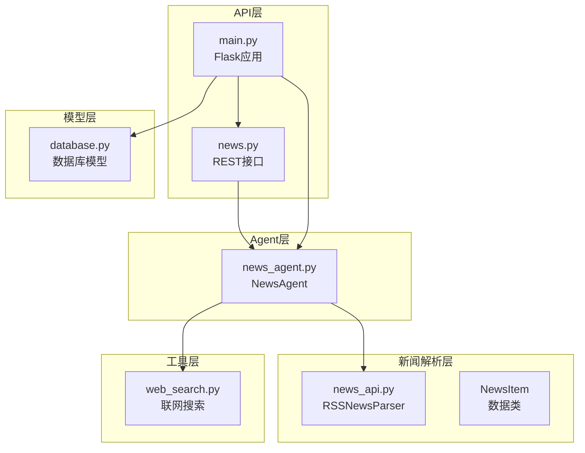
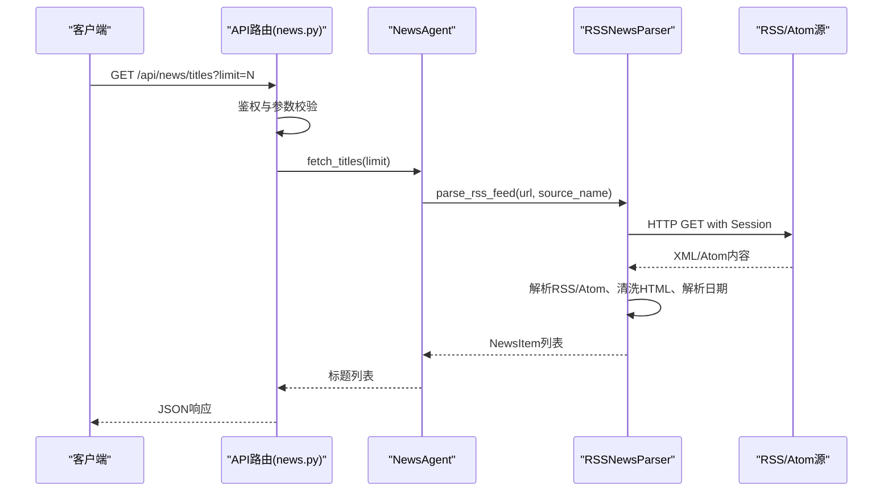
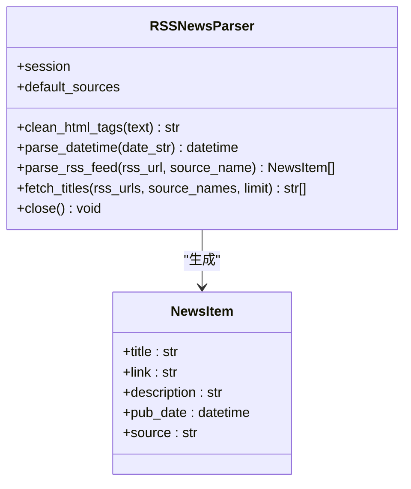
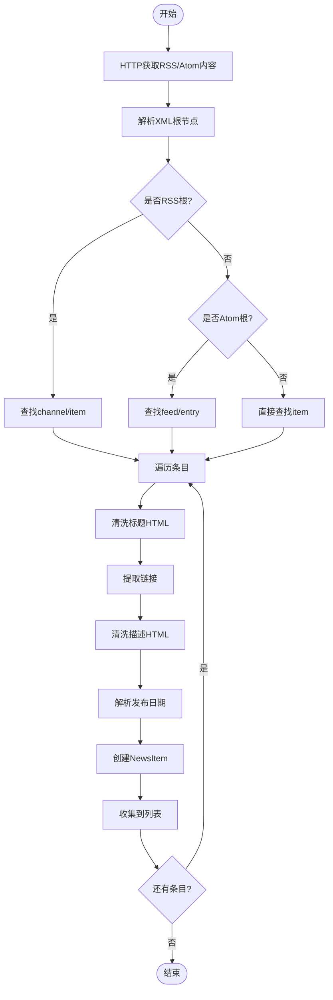
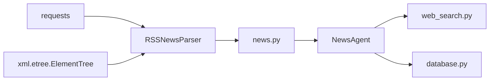

# 新闻数据采集

<cite>
**本文引用的文件**
- [news_api.py](file://src/news/news_api.py)
- [README.md](file://src/news/README.md)
- [requirements.txt](file://src/news/requirements.txt)
- [test_news_api.py](file://src/news/test/test_news_api.py)
- [news.py](file://src/api/news.py)
- [main.py](file://src/api/main.py)
- [news_agent.py](file://src/agent/news_agent.py)
- [web_search.py](file://src/utils/web_search.py)
- [database.py](file://src/models/database.py)
- [run.py](file://run.py)
</cite>

## 目录
1. [引言](#引言)
2. [项目结构](#项目结构)
3. [核心组件](#核心组件)
4. [架构总览](#架构总览)
5. [详细组件分析](#详细组件分析)
6. [依赖关系分析](#依赖关系分析)
7. [性能考虑](#性能考虑)
8. [故障排除指南](#故障排除指南)
9. [结论](#结论)
10. [附录](#附录)

## 引言
本文件面向“新闻数据采集”模块，重点围绕RSS/Atom新闻解析器的实现原理与工程实践展开，涵盖：
- RSS/Atom格式解析策略与多源数据采集流程
- HTTP请求处理机制与会话管理
- 错误处理与容错策略（网络异常、XML解析、日期格式）
- 性能优化建议（请求间隔、并发、缓存）
- 新增数据源的扩展指南与最佳实践

该模块为上层Agent提供结构化的新闻标题与元数据，支撑投资分析与决策。

## 项目结构
新闻采集子系统由以下层次构成：
- API层：提供REST接口，负责鉴权、参数校验与响应封装
- Agent层：编排与组合数据源，提供关键词筛选与相关性聚合
- 新闻解析层：核心RSS/Atom解析器，负责HTTP抓取、XML解析、数据清洗与标准化
- 工具层：联网搜索辅助（可选），用于补充外部信息
- 模型层：数据库模型（用户、聊天历史、分析会话、Agent日志）

图表来源
- [news.py](file://src/api/news.py#L1-L75)
- [main.py](file://src/api/main.py#L1-L243)
- [news_agent.py](file://src/agent/news_agent.py#L1-L93)
- [news_api.py](file://src/news/news_api.py#L1-L248)
- [web_search.py](file://src/utils/web_search.py#L1-L80)
- [database.py](file://src/models/database.py#L1-L86)

章节来源
- [news_api.py](file://src/news/news_api.py#L1-L248)
- [README.md](file://src/news/README.md#L1-L46)
- [requirements.txt](file://src/news/requirements.txt#L1-L19)
- [news.py](file://src/api/news.py#L1-L75)
- [main.py](file://src/api/main.py#L1-L243)
- [news_agent.py](file://src/agent/news_agent.py#L1-L93)
- [web_search.py](file://src/utils/web_search.py#L1-L80)
- [database.py](file://src/models/database.py#L1-L86)

## 核心组件
- RSSNewsParser：核心解析器，负责HTTP会话、请求头、超时、RSS/Atom解析、HTML清洗、日期解析与统一输出
- NewsItem：标准化新闻数据结构，包含标题、链接、描述、发布时间、来源
- DEFAULT_SOURCES：默认数据源集合（财富中文网、经济日报）
- NewsAgent：上层编排器，提供标题获取、关键词筛选、相关性聚合与联网搜索辅助
- API路由：提供REST接口，将请求转发至NewsAgent并返回JSON响应

章节来源
- [news_api.py](file://src/news/news_api.py#L25-L38)
- [news_api.py](file://src/news/news_api.py#L41-L248)
- [news_agent.py](file://src/agent/news_agent.py#L18-L93)
- [news.py](file://src/api/news.py#L16-L75)

## 架构总览
整体数据流从API路由进入，经过鉴权与参数校验，调用NewsAgent，再由RSSNewsParser抓取与解析RSS/Atom源，最终返回结构化标题列表。

图表来源
- [news.py](file://src/api/news.py#L16-L31)
- [news_agent.py](file://src/agent/news_agent.py#L69-L92)
- [news_api.py](file://src/news/news_api.py#L100-L194)

## 详细组件分析

### RSSNewsParser 类设计与实现
- 会话管理：使用requests.Session，设置User-Agent请求头，复用TCP连接，降低握手开销
- 请求头配置：统一User-Agent，提升兼容性
- 超时处理：HTTP请求设置超时，避免阻塞
- 多格式解析：自动识别RSS与Atom根节点，分别提取条目
- HTML清洗：移除CDATA与HTML标签，规范化空白
- 日期解析：支持多种常见格式，无法解析时回退为当前UTC时间
- 错误处理：对网络异常、XML解析错误、单条目解析异常进行捕获与日志记录，保证整体流程健壮性
- 输出：返回NewsItem列表，供上层聚合

图表来源
- [news_api.py](file://src/news/news_api.py#L41-L248)

章节来源
- [news_api.py](file://src/news/news_api.py#L41-L248)

### 默认数据源配置
- 财富中文网
- 经济日报
- 可通过对外接口参数覆盖默认源，实现灵活扩展

章节来源
- [news_api.py](file://src/news/news_api.py#L35-L38)
- [news_api.py](file://src/news/news_api.py#L233-L248)
- [README.md](file://src/news/README.md#L30-L35)

### HTTP请求处理机制
- 使用Session复用连接
- 设置User-Agent提升兼容性
- 超时控制（默认30秒）
- 异常捕获：网络异常、XML解析错误、通用异常
- 单条目解析异常隔离，不影响整体流程

章节来源
- [news_api.py](file://src/news/news_api.py#L44-L48)
- [news_api.py](file://src/news/news_api.py#L120-L121)
- [news_api.py](file://src/news/news_api.py#L186-L194)

### RSS/Atom解析流程

图表来源
- [news_api.py](file://src/news/news_api.py#L100-L194)

### 错误处理与容错策略
- 网络异常：捕获请求异常，记录错误并返回空列表
- XML解析错误：捕获解析异常，记录错误并返回空列表
- 单条目解析异常：局部异常不影响整体解析
- 日期解析失败：回退为当前UTC时间并记录警告
- 上层调用：对外接口在finally中确保会话关闭，避免资源泄漏

章节来源
- [news_api.py](file://src/news/news_api.py#L186-L194)
- [news_api.py](file://src/news/news_api.py#L71-L98)
- [news_api.py](file://src/news/news_api.py#L228-L230)
- [news_api.py](file://src/news/news_api.py#L244-L248)

### API与Agent集成
- API路由：鉴权、参数校验、异常处理、JSON响应
- NewsAgent：提供标题获取、关键词筛选、相关性聚合与联网搜索辅助
- 依赖关系：API路由依赖NewsAgent；NewsAgent依赖RSSNewsParser与联网搜索工具

章节来源
- [news.py](file://src/api/news.py#L16-L75)
- [news_agent.py](file://src/agent/news_agent.py#L18-L93)
- [web_search.py](file://src/utils/web_search.py#L39-L80)

## 依赖关系分析
- 新闻解析层依赖requests进行HTTP请求，依赖xml.etree.ElementTree解析XML
- API层依赖Flask蓝图注册与路由装饰器
- Agent层依赖工具层的联网搜索功能
- 模型层提供用户与会话相关数据结构

图表来源
- [news_api.py](file://src/news/news_api.py#L18-L18)
- [news.py](file://src/api/news.py#L8-L10)
- [news_agent.py](file://src/agent/news_agent.py#L15-L15)
- [web_search.py](file://src/utils/web_search.py#L54-L58)
- [database.py](file://src/models/database.py#L8-L17)

章节来源
- [requirements.txt](file://src/news/requirements.txt#L1-L19)
- [news_api.py](file://src/news/news_api.py#L18-L18)
- [news.py](file://src/api/news.py#L8-L10)
- [news_agent.py](file://src/agent/news_agent.py#L15-L15)
- [web_search.py](file://src/utils/web_search.py#L54-L58)
- [database.py](file://src/models/database.py#L8-L17)

## 性能考虑
- 请求间隔控制：解析器在不同源之间有固定休眠，避免过于频繁访问
- 并发处理：当前实现为顺序拉取，未使用并发；如需提升吞吐，可在上层引入线程池或异步HTTP客户端
- 缓存策略：解析器未内置缓存；建议在上层调用侧增加内存缓存或Redis缓存，结合时间戳与源标识进行键控
- 超时与重试：HTTP请求已设置超时；可在外层包装重试逻辑（指数退避）以增强鲁棒性
- 数据量限制：对外接口支持limit参数，避免一次性返回过多标题

章节来源
- [news_api.py](file://src/news/news_api.py#L222-L222)
- [news_api.py](file://src/news/news_api.py#L233-L248)
- [news.py](file://src/api/news.py#L23-L23)

## 故障排除指南
- 无法获取RSS内容
  - 检查网络连通性与代理设置
  - 查看日志中的请求异常信息
  - 确认RSS源URL有效且可访问
- XML解析失败
  - 检查返回内容是否为标准RSS/Atom格式
  - 查看日志中的解析异常信息
- 日期解析异常
  - 检查pubDate或updated字段格式是否符合支持的格式列表
  - 如格式不匹配，解析器会回退为当前UTC时间
- 标题为空或缺失
  - 检查RSS源是否包含title字段
  - 确认HTML清洗过程未误删标题内容
- 会话资源泄漏
  - 确保调用对外接口后会话被正确关闭（finally块已保障）

章节来源
- [news_api.py](file://src/news/news_api.py#L186-L194)
- [news_api.py](file://src/news/news_api.py#L71-L98)
- [news_api.py](file://src/news/news_api.py#L228-L230)
- [news_api.py](file://src/news/news_api.py#L244-L248)

## 结论
本模块以RSSNewsParser为核心，提供了稳健的RSS/Atom解析能力与多源聚合策略，并通过API与Agent层向上层提供统一的新闻标题服务。其设计强调：
- 明确的错误隔离与回退策略
- 规范化的数据结构与可扩展的数据源配置
- 健壮的HTTP请求与会话管理
- 可在上层进行性能优化（缓存、并发、限频）

## 附录

### 新增数据源扩展指南
- 在调用对外接口时通过sources参数传入新的RSS源元组（URL, 名称）
- 确保RSS/Atom格式规范，至少包含title、link、description、pubDate或updated字段
- 如需自定义默认源，可在初始化RSSNewsParser时传入自定义列表
- 建议在上层增加缓存与限频策略，避免对新源造成过大压力

章节来源
- [news_api.py](file://src/news/news_api.py#L35-L38)
- [news_api.py](file://src/news/news_api.py#L233-L248)
- [README.md](file://src/news/README.md#L30-L35)

### 测试与运行
- 单元测试：提供简单的命令行测试脚本，验证标题获取功能
- 启动方式：通过run.py启动后端API服务，或直接运行Flask应用入口

章节来源
- [test_news_api.py](file://src/news/test/test_news_api.py#L10-L14)
- [run.py](file://run.py#L8-L17)
- [main.py](file://src/api/main.py#L238-L243)