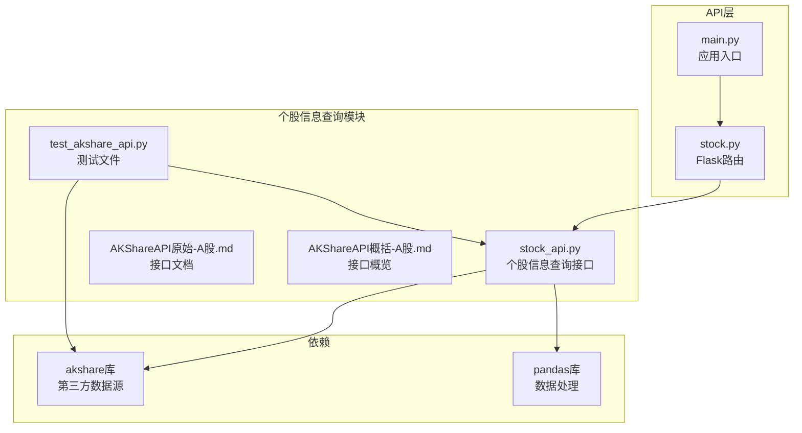
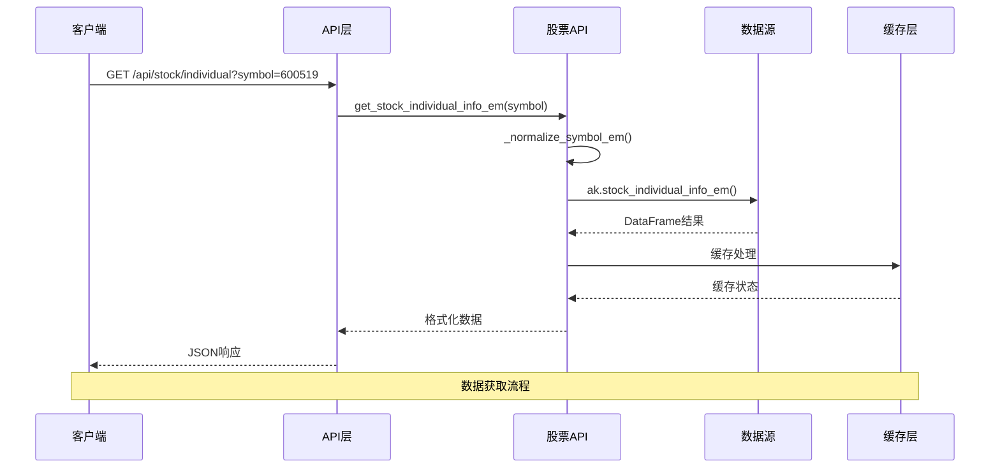
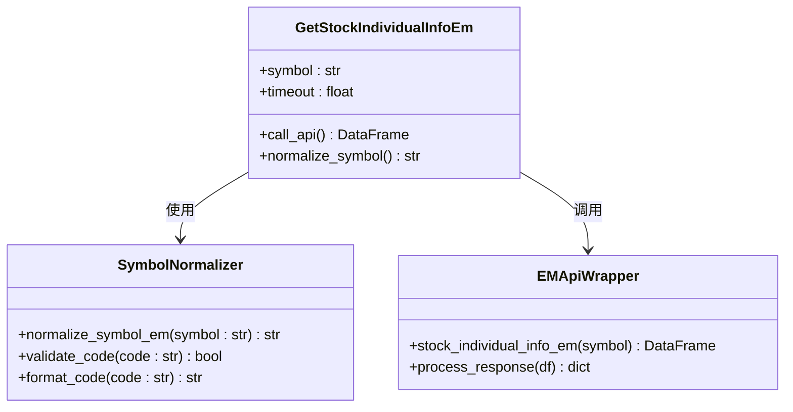
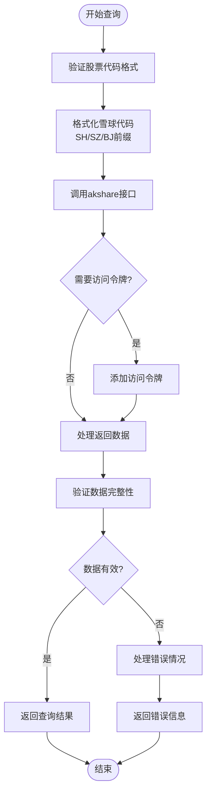
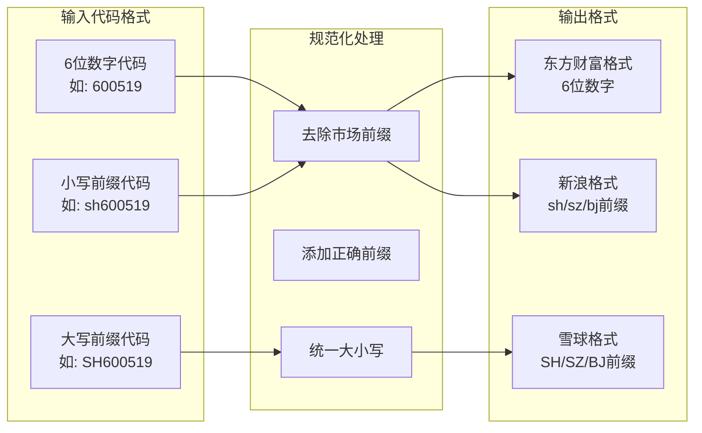
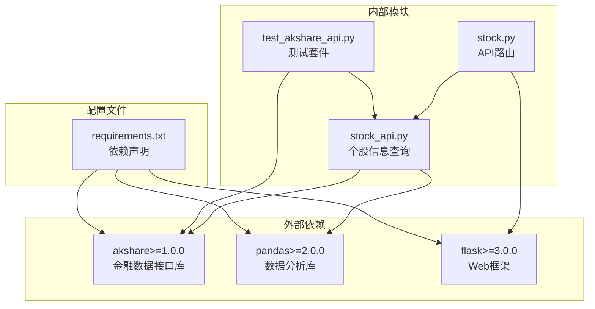

# 个股信息查询

<cite>
**本文档引用的文件**
- [stock_api.py](file://src/stock/stock_api.py)
- [AKShareAPI原始-A股.md](file://src/stock/AKShareAPI原始-A股.md)
- [AKShareAPI概括-A股.md](file://src/stock/AKShareAPI概括-A股.md)
- [test_akshare_api.py](file://src/stock/test/test_akshare_api.py)
- [requirements.txt](file://requirements.txt)
- [stock.py](file://src/api/stock.py)
- [main.py](file://src/api/main.py)
</cite>

## 目录
1. [简介](#简介)
2. [项目结构](#项目结构)
3. [核心组件](#核心组件)
4. [架构概览](#架构概览)
5. [详细组件分析](#详细组件分析)
6. [依赖关系分析](#依赖关系分析)
7. [性能考虑](#性能考虑)
8. [故障排除指南](#故障排除指南)
9. [结论](#结论)
10. [附录](#附录)

## 简介

本文档详细介绍AI投资分析系统中的个股信息查询模块，深入解释AKShare个股信息接口的实现和数据内容。该模块提供了从多个数据源获取个股信息的能力，包括东方财富和雪球财经等主流金融数据平台。

个股信息查询模块的核心功能包括：
- 东方财富个股信息查询（股票基本信息、财务数据、行业分类）
- 雪球公司概况查询（公司简介、管理层信息、业务范围）
- 多数据源参数规范化处理
- 接口调用成功率监控和错误处理

## 项目结构

个股信息查询模块位于项目的股票数据子系统中，采用模块化设计，便于维护和扩展。



**图表来源**
- [stock_api.py](file://src/stock/stock_api.py#L1-L50)
- [AKShareAPI原始-A股.md](file://src/stock/AKShareAPI原始-A股.md#L1-L50)
- [AKShareAPI概括-A股.md](file://src/stock/AKShareAPI概括-A股.md#L1-L50)

**章节来源**
- [stock_api.py](file://src/stock/stock_api.py#L1-L50)
- [requirements.txt](file://requirements.txt#L23-L23)

## 核心组件

个股信息查询模块包含以下核心组件：

### 1. 参数规范化组件
- **东方财富代码格式化**：处理6位数字代码格式
- **新浪/腾讯代码格式化**：处理sh/sz/bj前缀格式
- **雪球代码格式化**：处理SH/SZ/BJ大写前缀格式

### 2. 个股信息查询接口
- **get_stock_individual_info_em**：东方财富个股信息查询
- **get_stock_individual_basic_info_xq**：雪球公司概况查询
- **get_stock_bid_ask_em**：行情报价查询

### 3. 数据处理组件
- **DataFrame结果处理**：统一返回pandas DataFrame格式
- **错误处理机制**：网络异常、数据源不可用等情况的处理
- **超时控制**：可配置的请求超时参数

**章节来源**
- [stock_api.py](file://src/stock/stock_api.py#L15-L63)
- [stock_api.py](file://src/stock/stock_api.py#L335-L357)

## 架构概览

个股信息查询模块采用分层架构设计，确保代码的可维护性和扩展性。



**图表来源**
- [stock.py](file://src/api/stock.py#L16-L44)
- [stock_api.py](file://src/stock/stock_api.py#L335-L344)

**章节来源**
- [stock.py](file://src/api/stock.py#L16-L44)
- [stock_api.py](file://src/stock/stock_api.py#L335-L357)

## 详细组件分析

### 东方财富个股信息查询

#### 接口实现
东方财富个股信息查询接口提供全面的个股基本信息，包括财务数据、行业分类、市值规模等关键指标。



**图表来源**
- [stock_api.py](file://src/stock/stock_api.py#L335-L344)
- [stock_api.py](file://src/stock/stock_api.py#L15-L24)

#### 数据内容结构
东方财富个股信息返回标准的键值对格式，包含以下主要字段：

| 字段名称 | 数据类型 | 描述 | 示例值 |
|---------|---------|------|--------|
| item | object | 参数名称 | "最新"、"股票代码"、"总股本" |
| value | object | 参数值 | "7.05"、"000002"、"11930709471.0" |

**章节来源**
- [AKShareAPI原始-A股.md](file://src/stock/AKShareAPI原始-A股.md#L324-L335)
- [AKShareAPI概括-A股.md](file://src/stock/AKShareAPI概括-A股.md#L394-L396)

### 雪球公司概况查询

#### 接口实现
雪球公司概况查询接口提供详细的公司基本信息，涵盖公司治理、业务范围、财务状况等多个维度。



**图表来源**
- [stock_api.py](file://src/stock/stock_api.py#L347-L356)

#### 数据内容结构
雪球公司概况返回丰富的公司信息，包括但不限于：

| 信息类别 | 关键字段 | 描述 |
|---------|---------|------|
| 基本信息 | org_id, org_name_cn, org_short_name_cn | 公司识别码和名称 |
| 业务信息 | main_operation_business, operating_scope | 主营业务和经营范围 |
| 地理信息 | district_encode, reg_address_cn | 注册地区编码和地址 |
| 财务信息 | reg_asset, staff_num, issue_price | 注册资本、员工人数、发行价格 |
| 治理信息 | legal_representative, general_manager, chairman | 法人代表、总经理、董事长 |

**章节来源**
- [AKShareAPI原始-A股.md](file://src/stock/AKShareAPI原始-A股.md#L362-L403)
- [AKShareAPI概括-A股.md](file://src/stock/AKShareAPI概括-A股.md#L405-L407)

### 参数规范化处理

#### 代码格式化策略
模块实现了智能的股票代码格式化，确保不同数据源的兼容性：



**图表来源**
- [stock_api.py](file://src/stock/stock_api.py#L15-L62)

**章节来源**
- [stock_api.py](file://src/stock/stock_api.py#L15-L62)

## 依赖关系分析

个股信息查询模块的依赖关系清晰明确，遵循单一职责原则。



**图表来源**
- [requirements.txt](file://requirements.txt#L23-L23)
- [stock_api.py](file://src/stock/stock_api.py#L8-L10)

**章节来源**
- [requirements.txt](file://requirements.txt#L23-L23)
- [stock_api.py](file://src/stock/stock_api.py#L8-L10)

## 性能考虑

### 数据获取优化
- **批量查询支持**：支持同时查询多个股票代码，提高效率
- **缓存机制**：合理利用数据缓存减少重复请求
- **超时控制**：可配置的请求超时参数，避免长时间阻塞

### 错误处理策略
- **网络异常处理**：自动重试机制和错误降级
- **数据源可用性检测**：动态检测数据源状态
- **超时保护**：防止长时间等待造成系统阻塞

## 故障排除指南

### 常见问题及解决方案

#### 1. 接口调用失败
**症状**：`stock_individual_info_em`或`stock_individual_basic_info_xq`调用失败
**原因**：
- 网络连接不稳定
- 数据源临时不可用
- 股票代码格式不正确

**解决方案**：
- 检查网络连接状态
- 验证股票代码格式
- 查看数据源可用性状态

#### 2. 雪球接口认证失败
**症状**：`stock_individual_basic_info_xq`返回认证错误
**原因**：缺少有效的访问令牌
**解决方案**：
- 设置环境变量 `XUEQIU_TOKEN`
- 验证令牌有效性
- 检查令牌权限范围

#### 3. 数据格式不匹配
**症状**：返回的数据格式与预期不符
**原因**：股票代码格式未正确规范化
**解决方案**：
- 使用内置的代码格式化函数
- 验证输入参数格式
- 检查数据源特定要求

**章节来源**
- [test_akshare_api.py](file://src/stock/test/test_akshare_api.py#L22-L56)
- [test_akshare_api.py](file://src/stock/test/test_akshare_api.py#L207-L215)

## 结论

个股信息查询模块通过标准化的接口设计和智能的参数处理，为AI投资分析系统提供了可靠的基础数据支持。模块具有以下优势：

1. **多数据源支持**：同时支持东方财富和雪球财经等主流数据源
2. **智能参数处理**：自动处理不同数据源的代码格式差异
3. **健壮的错误处理**：完善的异常处理和降级机制
4. **易于扩展**：模块化设计便于添加新的数据源和功能

该模块为后续的股票分析、投资决策支持等功能奠定了坚实的数据基础。

## 附录

### 接口使用示例

#### 基本查询示例
```python
# 东方财富个股信息查询
result = get_stock_individual_info_em("600519")

# 雪球公司概况查询
result = get_stock_individual_basic_info_xq("SH600519")
```

#### 参数规范
- **股票代码格式**：支持6位数字、sh/sz/bj前缀、SH/SZ/BJ前缀
- **超时设置**：可选的timeout参数，默认不设置
- **访问令牌**：雪球接口可选的token参数

### 数据解读指南

#### 东方财富数据字段含义
- **最新**：当前股价
- **股票代码**：标准化的6位数字代码
- **总股本/流通股**：公司总股本和可流通股本
- **总市值/流通市值**：公司总市值和流通市值
- **行业**：所属行业分类
- **上市时间**：股票上市日期

#### 雪球数据字段解读
- **公司基本信息**：组织机构代码、公司名称、成立日期
- **业务范围**：主营业务和经营范围
- **治理结构**：管理层信息、董事会构成
- **财务指标**：注册资本、员工数量、发行价格