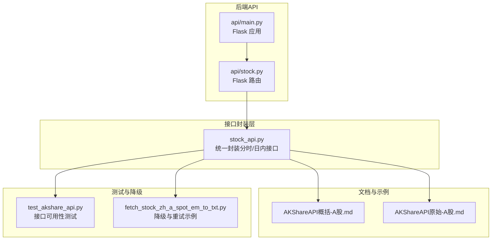
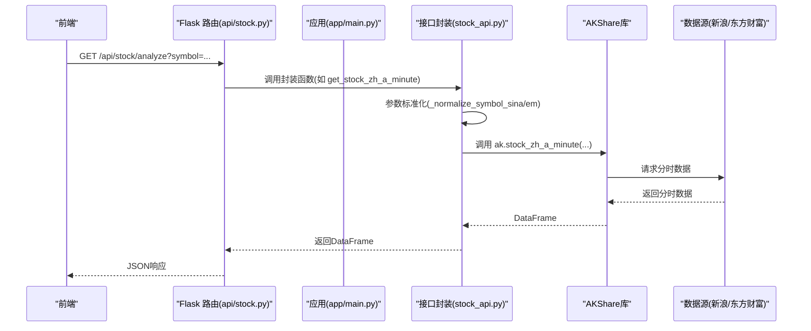
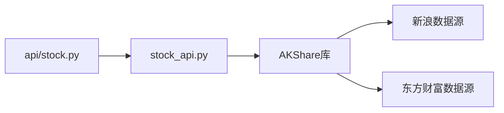

# 分时与日内数据

<cite>
**本文引用的文件**
- [src/stock/stock_api.py](file://src/stock/stock_api.py)
- [src/stock/AKShareAPI概括-A股.md](file://src/stock/AKShareAPI概括-A股.md)
- [src/stock/AKShareAPI原始-A股.md](file://src/stock/AKShareAPI原始-A股.md)
- [src/stock/test/test_akshare_api.py](file://src/stock/test/test_akshare_api.py)
- [src/stock/scripts/fetch_stock_zh_a_spot_em_to_txt.py](file://src/stock/scripts/fetch_stock_zh_a_spot_em_to_txt.py)
- [src/api/stock.py](file://src/api/stock.py)
- [src/api/main.py](file://src/api/main.py)
</cite>

## 目录
1. [引言](#引言)
2. [项目结构](#项目结构)
3. [核心组件](#核心组件)
4. [架构总览](#架构总览)
5. [详细组件分析](#详细组件分析)
6. [依赖关系分析](#依赖关系分析)
7. [性能考虑](#性能考虑)
8. [故障排查指南](#故障排查指南)
9. [结论](#结论)
10. [附录](#附录)

## 引言
本文件聚焦于“分时与日内数据”模块，系统梳理并解释 AKShare 分时数据接口在本项目中的实现与应用，涵盖以下内容：
- 分时数据接口能力：新浪分时(get_stock_zh_a_minute)、东方财富每日分时(get_stock_zh_a_hist_min_em)、盘前数据(get_stock_zh_a_hist_pre_min_em)、日内分时数据(get_stock_intraday_em)等。
- 频率选项与适用场景：1分钟、5分钟、15分钟、30分钟、60分钟。
- 时间窗口限制：交易日盘前时段有效性、非交易时段数据为空的处理。
- 数据格式与时间序列处理、数据清洗方法。
- 高频数据获取的性能优化与限流策略。

## 项目结构
围绕分时与日内数据的相关文件组织如下：
- 接口封装层：src/stock/stock_api.py 提供统一的分时/日内数据封装函数，并对不同数据源的参数进行标准化。
- 文档与示例：src/stock/AKShareAPI概括-A股.md 与 AKShareAPI原始-A股.md 提供接口定义、参数与输出字段说明。
- 测试与降级：src/stock/test/test_akshare_api.py 提供接口可用性测试；src/stock/scripts/fetch_stock_zh_a_spot_em_to_txt.py 展示了降级策略与重试机制。
- API 路由：src/api/stock.py 与 src/api/main.py 提供后端服务入口，便于前端调用。

图表来源
- [src/stock/stock_api.py](file://src/stock/stock_api.py#L255-L330)
- [src/stock/AKShareAPI概括-A股.md](file://src/stock/AKShareAPI概括-A股.md#L262-L383)
- [src/stock/AKShareAPI原始-A股.md](file://src/stock/AKShareAPI原始-A股.md#L1450-L1744)
- [src/stock/test/test_akshare_api.py](file://src/stock/test/test_akshare_api.py#L149-L198)
- [src/stock/scripts/fetch_stock_zh_a_spot_em_to_txt.py](file://src/stock/scripts/fetch_stock_zh_a_spot_em_to_txt.py#L21-L44)
- [src/api/stock.py](file://src/api/stock.py#L16-L126)
- [src/api/main.py](file://src/api/main.py#L50-L57)

章节来源
- [src/stock/stock_api.py](file://src/stock/stock_api.py#L255-L330)
- [src/stock/AKShareAPI概括-A股.md](file://src/stock/AKShareAPI概括-A股.md#L262-L383)
- [src/stock/AKShareAPI原始-A股.md](file://src/stock/AKShareAPI原始-A股.md#L1450-L1744)
- [src/stock/test/test_akshare_api.py](file://src/stock/test/test_akshare_api.py#L149-L198)
- [src/stock/scripts/fetch_stock_zh_a_spot_em_to_txt.py](file://src/stock/scripts/fetch_stock_zh_a_spot_em_to_txt.py#L21-L44)
- [src/api/stock.py](file://src/api/stock.py#L16-L126)
- [src/api/main.py](file://src/api/main.py#L50-L57)

## 核心组件
- 分时数据封装函数
  - 新浪分时(get_stock_zh_a_minute)：支持1/5/15/30/60分钟周期，返回时间序列OHLCV。
  - 东方财富每日分时(get_stock_zh_a_hist_min_em)：支持1/5/15/30/60分钟周期，1分钟数据仅近5个交易日且不复权，其他周期支持复权。
  - 盘前数据(get_stock_zh_a_hist_pre_min_em)：返回最近一个交易日的分钟级行情，包含最新价。
  - 日内分时(get_stock_intraday_em)：返回最近一个交易日的分笔明细（时间、成交价、手数、买卖盘性质）。
  - 日内分时-新浪(get_stock_intraday_sina)：按日期获取分笔明细，仅近期数据，且仅返回大单（≥400手）。
- 参数标准化
  - _normalize_symbol_em/_normalize_symbol_sina/_normalize_symbol_xq：统一不同数据源的股票代码格式，确保接口调用正确。
- 推荐稳定接口(get_recommended_apis)：包含get_stock_zh_a_minute等相对稳定的接口集合。

章节来源
- [src/stock/stock_api.py](file://src/stock/stock_api.py#L255-L330)
- [src/stock/stock_api.py](file://src/stock/stock_api.py#L15-L63)
- [src/stock/stock_api.py](file://src/stock/stock_api.py#L409-L425)

## 架构总览
下图展示从前端到后端再到数据源的整体流程，以及分时与日内数据的关键调用链。

图表来源
- [src/api/stock.py](file://src/api/stock.py#L16-L44)
- [src/api/main.py](file://src/api/main.py#L50-L57)
- [src/stock/stock_api.py](file://src/stock/stock_api.py#L255-L270)
- [src/stock/AKShareAPI概括-A股.md](file://src/stock/AKShareAPI概括-A股.md#L262-L278)

## 详细组件分析

### 新浪分时数据(get_stock_zh_a_minute)
- 功能概述
  - 获取指定股票或指数的分时数据，支持1/5/15/30/60分钟周期，可选择是否复权。
  - 返回时间序列OHLCV，列名包含day/open/high/low/close/volume。
- 参数与输出
  - 输入：symbol(股票或指数代码)、period(周期)、adjust(复权类型)。
  - 输出：时间列day与OHLCV等。
- 使用场景
  - 快速查看当日走势、构建K线图、计算短期技术指标。
- 时间窗口与限制
  - 该接口返回“最近交易日的历史分时行情数据”，注意调用频率，避免被限流/封禁。
- 代码路径
  - [get_stock_zh_a_minute](file://src/stock/stock_api.py#L258-L269)
  - [AKShare接口说明](file://src/stock/AKShareAPI概括-A股.md#L262-L278)
  - [AKShare原始文档](file://src/stock/AKShareAPI原始-A股.md#L1450-L1490)

章节来源
- [src/stock/stock_api.py](file://src/stock/stock_api.py#L258-L269)
- [src/stock/AKShareAPI概括-A股.md](file://src/stock/AKShareAPI概括-A股.md#L262-L278)
- [src/stock/AKShareAPI原始-A股.md](file://src/stock/AKShareAPI原始-A股.md#L1450-L1490)

### 东方财富每日分时(get_stock_zh_a_hist_min_em)
- 功能概述
  - 获取“每日分时行情”，支持1/5/15/30/60分钟周期。
  - 1分钟数据仅返回近5个交易日且不复权；其他周期支持复权。
- 参数与输出
  - 输入：symbol、start_date、end_date、period、adjust。
  - 输出：1分钟数据包含时间、OHLC、成交量、成交额、均价；其他周期包含涨跌幅、涨跌额、振幅、换手率等。
- 使用场景
  - 需要复权数据的回测场景；对比不同周期的日内波动。
- 时间窗口与限制
  - 仅返回“近期”的分时数据，注意时间区间设置。
- 代码路径
  - [get_stock_zh_a_hist_min_em](file://src/stock/stock_api.py#L272-L283)
  - [AKShare接口说明](file://src/stock/AKShareAPI概括-A股.md#L279-L312)
  - [AKShare原始文档](file://src/stock/AKShareAPI原始-A股.md#L1490-L1560)

章节来源
- [src/stock/stock_api.py](file://src/stock/stock_api.py#L272-L283)
- [src/stock/AKShareAPI概括-A股.md](file://src/stock/AKShareAPI概括-A股.md#L279-L312)
- [src/stock/AKShareAPI原始-A股.md](file://src/stock/AKShareAPI原始-A股.md#L1490-L1560)

### 盘前数据(get_stock_zh_a_hist_pre_min_em)
- 功能概述
  - 获取最近一个交易日的盘前分钟级行情，包含开盘、收盘、最高、最低、成交量、成交额、最新价。
- 参数与输出
  - 输入：symbol、start_time、end_time。
  - 输出：时间、开盘、收盘、最高、最低、成交量、成交额、最新价。
- 使用场景
  - 关注集合竞价与早盘走势，辅助开盘策略制定。
- 时间窗口与限制
  - 仅交易日盘前时段有效；非交易时段可能为空。
- 代码路径
  - [get_stock_zh_a_hist_pre_min_em](file://src/stock/stock_api.py#L289-L298)
  - [AKShare接口说明](file://src/stock/AKShareAPI概括-A股.md#L315-L333)
  - [AKShare原始文档](file://src/stock/AKShareAPI原始-A股.md#L1698-L1744)

章节来源
- [src/stock/stock_api.py](file://src/stock/stock_api.py#L289-L298)
- [src/stock/AKShareAPI概括-A股.md](file://src/stock/AKShareAPI概括-A股.md#L315-L333)
- [src/stock/AKShareAPI原始-A股.md](file://src/stock/AKShareAPI原始-A股.md#L1698-L1744)

### 日内分时数据(get_stock_intraday_em)
- 功能概述
  - 获取最近一个交易日的分笔明细，包含时间、成交价、手数、买卖盘性质。
- 参数与输出
  - 输入：symbol。
  - 输出：时间、成交价、手数、买卖盘性质。
- 使用场景
  - 精细化分析日内流动性、买卖盘强度、异常跳点。
- 时间窗口与限制
  - 仅交易日盘中有效；非交易时段可能为空。
- 代码路径
  - [get_stock_intraday_em](file://src/stock/stock_api.py#L304-L313)
  - [AKShare接口说明](file://src/stock/AKShareAPI概括-A股.md#L354-L367)
  - [AKShare原始文档](file://src/stock/AKShareAPI原始-A股.md#L1640-L1697)

章节来源
- [src/stock/stock_api.py](file://src/stock/stock_api.py#L304-L313)
- [src/stock/AKShareAPI概括-A股.md](file://src/stock/AKShareAPI概括-A股.md#L354-L367)
- [src/stock/AKShareAPI原始-A股.md](file://src/stock/AKShareAPI原始-A股.md#L1640-L1697)

### 日内分时数据-新浪(get_stock_intraday_sina)
- 功能概述
  - 按日期获取分笔明细，仅近期数据，且仅返回大单（成交量≥400手）。
- 参数与输出
  - 输入：symbol、date。
  - 输出：symbol、name、ticktime、price、volume、prev_price、kind。
- 使用场景
  - 对特定交易日的分笔进行回溯分析，关注大单流向。
- 时间窗口与限制
  - 仅能获取近期数据，且仅返回大单。
- 代码路径
  - [get_stock_intraday_sina](file://src/stock/stock_api.py#L316-L329)
  - [AKShare接口说明](file://src/stock/AKShareAPI概括-A股.md#L368-L383)
  - [AKShare原始文档](file://src/stock/AKShareAPI原始-A股.md#L1680-L1697)

章节来源
- [src/stock/stock_api.py](file://src/stock/stock_api.py#L316-L329)
- [src/stock/AKShareAPI概括-A股.md](file://src/stock/AKShareAPI概括-A股.md#L368-L383)
- [src/stock/AKShareAPI原始-A股.md](file://src/stock/AKShareAPI原始-A股.md#L1680-L1697)

### 参数标准化与代码格式规范
- _normalize_symbol_em：统一东方财富类6位代码，去除市场前缀。
- _normalize_symbol_sina：统一新浪/腾讯类小写市场前缀(sh/sz/bj)。
- _normalize_symbol_xq：统一雪球类大写市场前缀(SH/SZ/BJ)。
- 作用：保证不同数据源的股票代码格式一致，提升接口调用成功率。

章节来源
- [src/stock/stock_api.py](file://src/stock/stock_api.py#L15-L63)

### 推荐稳定接口
- get_recommended_apis：包含get_stock_zh_a_minute等相对稳定的接口集合，便于在生产环境中优先使用。

章节来源
- [src/stock/stock_api.py](file://src/stock/stock_api.py#L409-L425)

## 依赖关系分析
- 组件耦合
  - stock_api.py 作为接口封装层，向上提供统一函数，向下依赖 AKShare 库。
  - api/stock.py 作为 Flask 路由层，调用 stock_api.py 的封装函数，形成清晰的职责分离。
- 外部依赖
  - AKShare：提供各数据源的分时与日内数据接口。
  - 数据源：新浪/东方财富等，受网络与数据源稳定性影响。
- 潜在风险
  - 新浪接口高频调用易被限流/封禁，需增加延时与重试策略。
  - 部分接口在非交易时段可能返回空数据，需在上层逻辑中处理空结果。

图表来源
- [src/api/stock.py](file://src/api/stock.py#L16-L44)
- [src/stock/stock_api.py](file://src/stock/stock_api.py#L255-L330)
- [src/stock/AKShareAPI概括-A股.md](file://src/stock/AKShareAPI概括-A股.md#L262-L383)

章节来源
- [src/api/stock.py](file://src/api/stock.py#L16-L44)
- [src/stock/stock_api.py](file://src/stock/stock_api.py#L255-L330)
- [src/stock/AKShareAPI概括-A股.md](file://src/stock/AKShareAPI概括-A股.md#L262-L383)

## 性能考虑
- 调用频率限制
  - 新浪接口高频调用可能触发限流/封禁，建议增加请求间隔与重试机制。
  - 东方财富接口相对稳定，但仍需控制并发与批量大小。
- 数据量与内存
  - 分时数据量较大，建议按需获取（限定时间段、周期），避免一次性拉取过多数据。
- 缓存策略
  - 对于高频访问的分时数据，可在应用层引入缓存（如Redis），降低重复请求压力。
- 并发与限流
  - 在Flask层或上游网关处实施速率限制，防止突发流量冲击数据源。
- 复权与清洗
  - 1分钟数据不复权，其他周期支持复权；清洗时注意缺失值与异常值处理（如成交量为0、价格异常跳变）。

[本节为通用指导，无需具体文件引用]

## 故障排查指南
- 接口调用失败
  - 检查网络连通性与代理配置；部分接口可能因数据源问题暂时不可用。
  - 参考测试脚本中的降级策略：尝试备用接口或等待一段时间重试。
- 返回空数据
  - 非交易时段或盘前/盘后时段，部分接口可能为空；需在上层逻辑中判断空结果并给出提示。
- 参数格式错误
  - 确保股票代码格式符合数据源要求（如新浪需小写市场前缀，东方财富需6位代码）。
- 代码路径参考
  - [接口测试脚本](file://src/stock/test/test_akshare_api.py#L22-L56)
  - [降级与重试示例](file://src/stock/scripts/fetch_stock_zh_a_spot_em_to_txt.py#L21-L44)

章节来源
- [src/stock/test/test_akshare_api.py](file://src/stock/test/test_akshare_api.py#L22-L56)
- [src/stock/scripts/fetch_stock_zh_a_spot_em_to_txt.py](file://src/stock/scripts/fetch_stock_zh_a_spot_em_to_txt.py#L21-L44)

## 结论
本模块通过统一的接口封装与参数标准化，实现了对 AKShare 分时与日内数据的稳定接入。结合测试与降级策略，能够在不同数据源与网络环境下保持较高的可用性。建议在高频场景中配合缓存、限流与合理的数据清洗策略，以获得更佳的性能与稳定性。

[本节为总结，无需具体文件引用]

## 附录

### 分时数据频率与适用场景
- 1分钟：适合高频策略与盘中监控；注意1分钟数据不复权且仅近5个交易日。
- 5/15/30/60分钟：适合中短期趋势分析与回测；支持复权，便于长期对比。

章节来源
- [src/stock/AKShareAPI概括-A股.md](file://src/stock/AKShareAPI概括-A股.md#L262-L312)
- [src/stock/AKShareAPI原始-A股.md](file://src/stock/AKShareAPI原始-A股.md#L1490-L1560)

### 数据格式与时间序列处理
- 时间列命名与索引：确保时间列为可解析的datetime类型，便于后续重采样与对齐。
- OHLCV与衍生指标：开盘、最高、最低、收盘、成交量；可计算涨跌幅、振幅、换手率等。
- 分笔明细：时间、成交价、手数、买卖盘性质，适合流动性与大单分析。

章节来源
- [src/stock/AKShareAPI概括-A股.md](file://src/stock/AKShareAPI概括-A股.md#L262-L367)
- [src/stock/AKShareAPI原始-A股.md](file://src/stock/AKShareAPI原始-A股.md#L1450-L1697)

### API 路由与调用
- 路由入口：/api/stock/analyze 等，接收symbol、start_date、end_date、period、adjust等参数。
- 返回：JSON格式的DataFrame结果，便于前端渲染与进一步分析。

章节来源
- [src/api/stock.py](file://src/api/stock.py#L16-L126)
- [src/api/main.py](file://src/api/main.py#L50-L57)