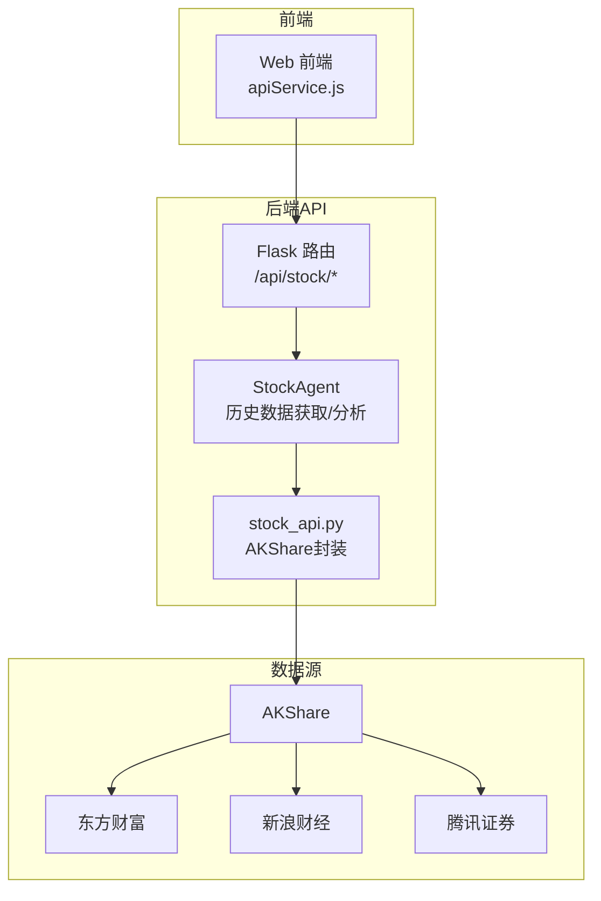
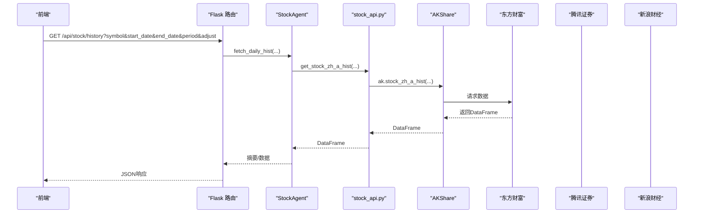
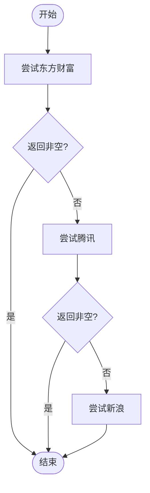
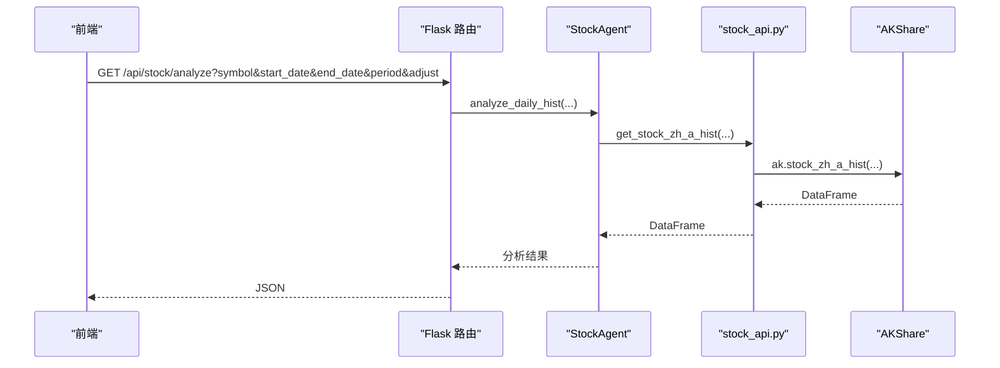
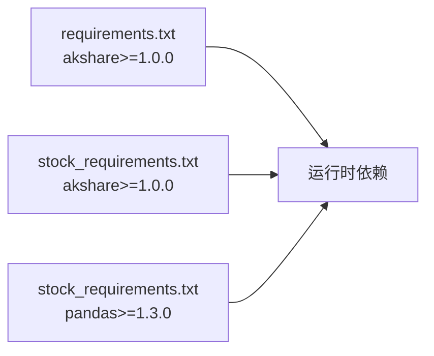

# 历史行情数据

<cite>
**本文引用的文件**
- [stock_api.py](file://src/stock/stock_api.py)
- [AKShareAPI概括-A股.md](file://src/stock/AKShareAPI概括-A股.md)
- [AKShareAPI原始-A股.md](file://src/stock/AKShareAPI原始-A股.md)
- [test_akshare_api.py](file://src/stock/test/test_akshare_api.py)
- [stock_agent.py](file://src/agent/stock_agent.py)
- [stock.py](file://src/api/stock.py)
- [apiService.js](file://src/web/src/services/apiService.js)
- [requirements.txt](file://requirements.txt)
- [stock_requirements.txt](file://src/stock/requirements.txt)
</cite>

## 目录
1. [简介](#简介)
2. [项目结构](#项目结构)
3. [核心组件](#核心组件)
4. [架构总览](#架构总览)
5. [详细组件分析](#详细组件分析)
6. [依赖关系分析](#依赖关系分析)
7. [性能考量](#性能考量)
8. [故障排查指南](#故障排查指南)
9. [结论](#结论)
10. [附录](#附录)

## 简介
本文件面向“历史行情数据”模块，系统性梳理 AKShare 在本项目中的封装与使用，重点覆盖以下方面：
- 不同历史数据源接口的差异与适用场景：东方财富日线(get_stock_zh_a_hist)、新浪日线(get_stock_zh_a_daily)、腾讯日线(get_stock_zh_a_hist_tx)
- 时间范围限制、复权处理机制(前复权qfq、后复权hfq)、周期参数(period: daily/weekly/monthly)的使用方法
- 参数规范：股票代码格式、日期格式、数据范围限制
- 数据质量检查、缺失数据处理、数据完整性验证
- 批量历史数据获取的优化策略与性能考虑

## 项目结构
历史行情数据模块由三层组成：
- API封装层：对 AKShare 接口进行统一封装，提供标准化参数与返回结构
- 代理层：StockAgent 提供历史数据获取、回退策略、技术分析与汇总
- API路由层：Flask 路由暴露历史行情、技术指标、分析等接口，前端通过 JS 服务调用

图表来源
- [stock.py](file://src/api/stock.py#L16-L105)
- [stock_agent.py](file://src/agent/stock_agent.py#L68-L168)
- [stock_api.py](file://src/stock/stock_api.py#L212-L252)

章节来源
- [stock.py](file://src/api/stock.py#L16-L105)
- [stock_agent.py](file://src/agent/stock_agent.py#L68-L168)
- [stock_api.py](file://src/stock/stock_api.py#L212-L252)

## 核心组件
- 股票API封装(stock_api.py)
  - 提供 get_stock_zh_a_hist、get_stock_zh_a_daily、get_stock_zh_a_hist_tx 等接口的统一入口，并内置代码格式规范化
- 代理层(StockAgent)
  - 实现历史数据获取与回退策略(优先东方财富→腾讯→新浪)
  - 提供分析与技术指标计算
- API路由(stock.py)
  - 对外暴露历史行情、技术指标、分析等接口，参数透传至代理层
- 前端调用(apiService.js)
  - 统一构造查询参数，调用后端接口

章节来源
- [stock_api.py](file://src/stock/stock_api.py#L212-L252)
- [stock_agent.py](file://src/agent/stock_agent.py#L68-L168)
- [stock.py](file://src/api/stock.py#L16-L105)
- [apiService.js](file://src/web/src/services/apiService.js#L96-L105)

## 架构总览
历史数据获取的典型调用链如下：

图表来源
- [stock.py](file://src/api/stock.py#L78-L105)
- [stock_agent.py](file://src/agent/stock_agent.py#L68-L168)
- [stock_api.py](file://src/stock/stock_api.py#L212-L226)

## 详细组件分析

### 1) 接口差异与适用场景
- 东方财富日线(get_stock_zh_a_hist)
  - 适用：高质量日线数据，支持周期(daily/weekly/monthly)与复权(qfq/hfq)
  - 特点：数据质量高，访问无限制
- 新浪日线(get_stock_zh_a_daily)
  - 适用：历史日线数据，支持复权与复权因子
  - 注意：高频调用易被封IP，建议切换为东方财富接口
- 腾讯日线(get_stock_zh_a_hist_tx)
  - 适用：日线数据，支持复权
  - 特点：支持三种复权方式

章节来源
- [AKShareAPI概括-A股.md](file://src/stock/AKShareAPI概括-A股.md#L196-L258)
- [AKShareAPI原始-A股.md](file://src/stock/AKShareAPI原始-A股.md#L1165-L1239)

### 2) 参数规范与格式要求
- 股票代码格式
  - 东方财富：6位数字代码(可带.SH/.SZ/.BJ后缀，内部自动规范化)
  - 新浪/腾讯：需带市场前缀(sh/sz/bj)，例如 sh600519
- 日期格式
  - 年月日：YYYYMMDD
  - 年月：YYYYMM
- 周期参数(period)
  - daily/weekly/monthly
- 复权参数(adjust)
  - ""(不复权)、"qfq"(前复权)、"hfq"(后复权)

章节来源
- [stock_api.py](file://src/stock/stock_api.py#L15-L62)
- [AKShareAPI概括-A股.md](file://src/stock/AKShareAPI概括-A股.md#L199-L204)
- [AKShareAPI概括-A股.md](file://src/stock/AKShareAPI概括-A股.md#L225-L229)
- [AKShareAPI概括-A股.md](file://src/stock/AKShareAPI概括-A股.md#L246-L249)

### 3) 时间范围限制
- 上交所每日概况：仅支持 20211227(含)之后日期
- 新浪日线：多次获取易封IP，建议控制频率
- 腾讯日线：起止日期范围较宽(示例为 19000101 至 20500101)

章节来源
- [AKShareAPI概括-A股.md](file://src/stock/AKShareAPI概括-A股.md#L87-L99)
- [AKShareAPI原始-A股.md](file://src/stock/AKShareAPI原始-A股.md#L1174-L1175)
- [AKShareAPI概括-A股.md](file://src/stock/AKShareAPI概括-A股.md#L247-L248)

### 4) 复权处理机制
- 前复权(qfq)：以除权除息日为基准向前调整历史价格序列
- 后复权(hfq)：以当前价格为基准向后调整历史价格序列
- 代理层支持传入 adjust 参数，优先使用东方财富接口，失败时回退至腾讯/新浪

章节来源
- [stock_agent.py](file://src/agent/stock_agent.py#L129-L168)
- [AKShareAPI概括-A股.md](file://src/stock/AKShareAPI概括-A股.md#L204-L204)
- [AKShareAPI概括-A股.md](file://src/stock/AKShareAPI概括-A股.md#L229-L229)
- [AKShareAPI概括-A股.md](file://src/stock/AKShareAPI概括-A股.md#L249-L249)

### 5) 数据获取与回退策略
- 优先级：东方财富 → 腾讯 → 新浪
- 若某数据源返回空或异常，则尝试下一个数据源
- 代理层对股票代码进行统一规范化，兼容多种输入格式

图表来源
- [stock_agent.py](file://src/agent/stock_agent.py#L129-L168)

章节来源
- [stock_agent.py](file://src/agent/stock_agent.py#L129-L168)

### 6) 数据质量检查与完整性验证
- 返回 DataFrame 的行数与列名记录在摘要中
- 若返回空或异常，记录错误信息并返回
- 代理层对列名进行兼容性选择(中文/英文字段名)

章节来源
- [stock_agent.py](file://src/agent/stock_agent.py#L119-L127)
- [stock_agent.py](file://src/agent/stock_agent.py#L363-L376)

### 7) 批量历史数据获取的优化策略
- 控制并发与频率：避免高频调用导致封IP
- 优先使用东方财富接口，因其数据质量高且访问无限制
- 使用回退策略减少失败率
- 前端按需请求，后端缓存热点数据(建议在代理层或数据库层实现)

章节来源
- [AKShareAPI概括-A股.md](file://src/stock/AKShareAPI概括-A股.md#L224-L224)
- [AKShareAPI概括-A股.md](file://src/stock/AKShareAPI概括-A股.md#L163-L163)
- [stock_agent.py](file://src/agent/stock_agent.py#L129-L168)

### 8) 接口封装与调用示例
- 后端路由参数透传至代理层
- 代理层调用封装接口，内部再调用 AKShare
- 前端通过 apiService.js 统一构造查询参数

图表来源
- [stock.py](file://src/api/stock.py#L16-L44)
- [stock_agent.py](file://src/agent/stock_agent.py#L305-L362)
- [stock_api.py](file://src/stock/stock_api.py#L212-L226)

章节来源
- [stock.py](file://src/api/stock.py#L16-L44)
- [stock_agent.py](file://src/agent/stock_agent.py#L305-L362)
- [stock_api.py](file://src/stock/stock_api.py#L212-L226)
- [apiService.js](file://src/web/src/services/apiService.js#L96-L105)

## 依赖关系分析
- 运行时依赖
  - akshare>=1.0.0
  - pandas>=1.3.0
- 项目依赖
  - requirements.txt 中包含 akshare 与 pandas
  - src/stock/requirements.txt 限定版本范围

图表来源
- [requirements.txt](file://requirements.txt#L23-L23)
- [requirements.txt](file://requirements.txt#L15-L16)
- [stock_requirements.txt](file://src/stock/requirements.txt#L1-L2)

章节来源
- [requirements.txt](file://requirements.txt#L23-L23)
- [requirements.txt](file://requirements.txt#L15-L16)
- [stock_requirements.txt](file://src/stock/requirements.txt#L1-L2)

## 性能考量
- 数据源优先级与回退策略降低失败率，提升可用性
- 代理层对股票代码进行规范化，减少无效请求
- 建议在代理层或数据库层引入缓存与增量更新策略，避免重复拉取相同时间段的历史数据
- 前端按需请求，后端限制并发与频率，避免触发数据源限流

## 故障排查指南
- 常见问题
  - 网络不稳定或数据源不可用：检查代理设置与网络连通性
  - 高频调用被封IP：降低请求频率或使用缓存
  - 参数格式不正确：确认股票代码格式与日期格式
- 日志与错误处理
  - 代理层记录详细日志，包含 symbol、start_date、end_date、period、adjust
  - 路由层捕获异常并返回友好错误信息
- 自动降级
  - 代理层按顺序尝试多个数据源，确保在某个数据源异常时仍能获取数据

章节来源
- [stock_agent.py](file://src/agent/stock_agent.py#L34-L54)
- [stock_agent.py](file://src/agent/stock_agent.py#L103-L114)
- [stock_agent.py](file://src/agent/stock_agent.py#L141-L168)
- [stock.py](file://src/api/stock.py#L42-L43)
- [stock.py](file://src/api/stock.py#L104-L105)

## 结论
本模块通过三层架构实现了对 AKShare 历史行情数据的统一接入与优化使用：
- 接口封装层提供一致的参数与返回结构
- 代理层实现回退策略与数据分析能力
- 路由层对外暴露标准接口，前端按需调用
- 复权、周期、时间范围等关键参数均有明确规范，便于在项目中稳定使用

## 附录

### A. 参数对照表
- 股票代码
  - 东方财富：6位数字(可带.SH/.SZ/.BJ后缀)
  - 新浪/腾讯：sh/sz/bj 前缀 + 6位数字
- 日期格式
  - 年月日：YYYYMMDD
  - 年月：YYYYMM
- 周期(period)：daily/weekly/monthly
- 复权(adjust)：""/qfq/hfq

章节来源
- [stock_api.py](file://src/stock/stock_api.py#L15-L62)
- [AKShareAPI概括-A股.md](file://src/stock/AKShareAPI概括-A股.md#L199-L204)
- [AKShareAPI概括-A股.md](file://src/stock/AKShareAPI概括-A股.md#L225-L229)
- [AKShareAPI概括-A股.md](file://src/stock/AKShareAPI概括-A股.md#L246-L249)

### B. 接口对比与建议
- 优先使用东方财富日线接口，数据质量高且访问无限制
- 新浪日线接口适合特定场景，但需注意封IP风险
- 腾讯日线接口作为回退方案，支持复权

章节来源
- [AKShareAPI概括-A股.md](file://src/stock/AKShareAPI概括-A股.md#L196-L258)
- [AKShareAPI概括-A股.md](file://src/stock/AKShareAPI概括-A股.md#L224-L224)
- [AKShareAPI概括-A股.md](file://src/stock/AKShareAPI概括-A股.md#L163-L163)