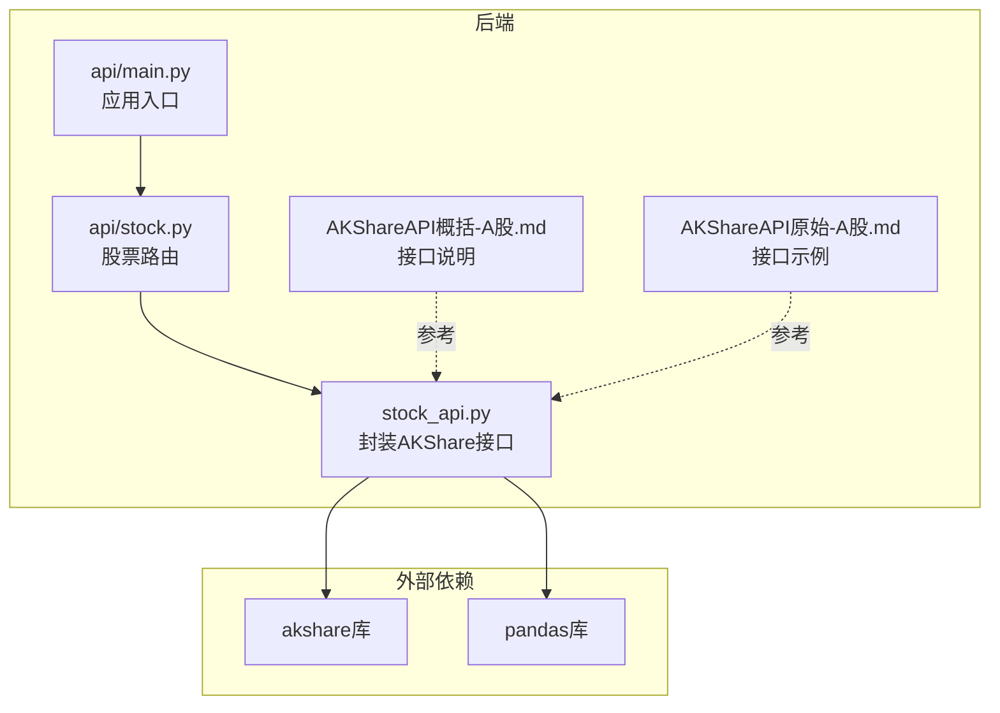
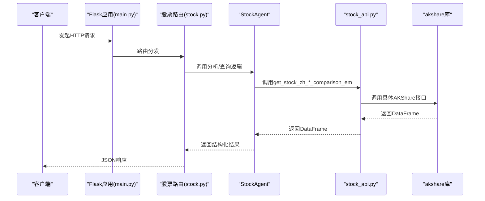
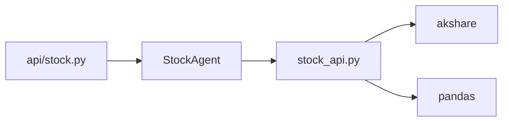

# 同行比较数据

<cite>
**本文引用的文件**
- [stock_api.py](file://src/stock/stock_api.py)
- [AKShareAPI概括-A股.md](file://src/stock/AKShareAPI概括-A股.md)
- [AKShareAPI原始-A股.md](file://src/stock/AKShareAPI原始-A股.md)
- [test_akshare_api.py](file://src/stock/test/test_akshare_api.py)
- [requirements.txt](file://src/stock/requirements.txt)
- [stock.py](file://src/api/stock.py)
- [main.py](file://src/api/main.py)
- [.env.example](file://.env.example)
</cite>

## 目录
1. [引言](#引言)
2. [项目结构](#项目结构)
3. [核心组件](#核心组件)
4. [架构总览](#架构总览)
5. [详细组件分析](#详细组件分析)
6. [依赖关系分析](#依赖关系分析)
7. [性能考量](#性能考量)
8. [故障排查指南](#故障排查指南)
9. [结论](#结论)
10. [附录](#附录)

## 引言
本文件围绕“同行比较数据模块”展开，系统梳理 AKShare 在 A 股市场提供的“同行比较”系列接口的实现与使用方法，并结合项目现有封装层，给出四个主要维度的评估指标、计算方法、数据解读与实践建议。四个维度分别为：
- 成长性比较（get_stock_zh_growth_comparison_em）
- 估值比较（get_stock_zh_valuation_comparison_em）
- 杜邦分析比较（get_stock_zh_dupont_comparison_em）
- 公司规模比较（get_stock_zh_scale_comparison_em）

同时，本文提供基准选择策略、行业分类标准、数据时效性与样本筛选条件、可比性分析，以及在投资分析中的应用案例与决策支持方法。

## 项目结构
该项目采用前后端分离的 Flask 架构，股票数据接口由 Python 后端统一暴露，前端通过 REST API 调用。与“同行比较数据模块”直接相关的文件与职责如下：
- 后端封装层：src/stock/stock_api.py 提供对 AKShare 接口的二次封装与推荐接口清单
- 文档与示例：src/stock/AKShareAPI概括-A股.md 与 AKShareAPI原始-A股.md 提供接口定义、字段说明与示例
- API 路由：src/api/stock.py 定义股票相关路由，便于在系统中集成调用
- 主应用：src/api/main.py 注册蓝图并启动服务
- 测试与依赖：src/stock/test/test_akshare_api.py 提供接口可用性测试思路；requirements.txt 规定依赖版本

**图表来源**
- [stock_api.py](file://src/stock/stock_api.py#L374-L425)
- [AKShareAPI概括-A股.md](file://src/stock/AKShareAPI概括-A股.md#L423-L523)
- [AKShareAPI原始-A股.md](file://src/stock/AKShareAPI原始-A股.md#L1804-L1987)
- [stock.py](file://src/api/stock.py#L1-L126)
- [main.py](file://src/api/main.py#L40-L57)

**章节来源**
- [stock_api.py](file://src/stock/stock_api.py#L374-L425)
- [AKShareAPI概括-A股.md](file://src/stock/AKShareAPI概括-A股.md#L423-L523)
- [AKShareAPI原始-A股.md](file://src/stock/AKShareAPI原始-A股.md#L1804-L1987)
- [stock.py](file://src/api/stock.py#L1-L126)
- [main.py](file://src/api/main.py#L40-L57)

## 核心组件
- 同行比较接口封装（src/stock/stock_api.py）
  - 成长性比较：get_stock_zh_growth_comparison_em
  - 估值比较：get_stock_zh_valuation_comparison_em
  - 杜邦分析比较：get_stock_zh_dupont_comparison_em
  - 公司规模比较：get_stock_zh_scale_comparison_em
  - 推荐接口清单：get_recommended_apis（包含上述四项）
- 接口文档与示例（AKShareAPI概括-A股.md、AKShareAPI原始-A股.md）
  - 字段定义、示例数据与使用说明
- API 路由与主应用（src/api/stock.py、src/api/main.py）
  - 将封装好的接口接入 Web 服务，便于前端调用
- 依赖与环境（requirements.txt、.env.example）
  - akshare 与 pandas 的版本要求
  - JWT、模型服务等环境变量配置

**章节来源**
- [stock_api.py](file://src/stock/stock_api.py#L374-L425)
- [AKShareAPI概括-A股.md](file://src/stock/AKShareAPI概括-A股.md#L423-L523)
- [AKShareAPI原始-A股.md](file://src/stock/AKShareAPI原始-A股.md#L1804-L1987)
- [requirements.txt](file://src/stock/requirements.txt#L1-L2)
- [.env.example](file://.env.example#L1-L19)

## 架构总览
下图展示从 API 请求到数据返回的关键路径，以及四个“同行比较”接口在整体架构中的位置：

**图表来源**
- [main.py](file://src/api/main.py#L40-L57)
- [stock.py](file://src/api/stock.py#L1-L126)
- [stock_api.py](file://src/stock/stock_api.py#L374-L425)

## 详细组件分析

### 成长性比较（get_stock_zh_growth_comparison_em）
- 接口定位
  - 东方财富-行情中心-同行比较-成长性比较
  - 输入：股票代码（可选，用于确定行业/可比公司池）
  - 输出：包含“基本每股收益增长率”“营业收入增长率”“净利润增长率”的多列指标，以及各指标的复合年均与 TTM 等
- 关键指标与含义
  - 基本每股收益增长率：衡量公司盈利能力增长趋势，常以3年复合、TTM、未来年度预期（25E/26E/27E）呈现
  - 营业收入增长率：反映主营业务扩张能力，同样提供复合与滚动指标
  - 净利润增长率：体现归母净利润的增长态势，亦提供复合与滚动指标
  - 排名：用于横向比较，识别相对位置
- 计算方法与数据口径
  - 复合年均增长率（CAGR）：通常基于历史区间（如3年）计算
  - TTM（最近十二个月）：滚动期财务数据，更贴近当前经营状况
  - 预期增长率（E）：基于分析师预测或公开披露的指引
- 解读要点
  - 对比“行业中值/行业平均”与目标公司，关注趋势一致性与偏离度
  - 结合 TTM 与复合指标，判断增长可持续性
  - 关注排名变化，识别相对领先或落后企业
- 基准与样本筛选
  - 基准：以“行业中值/行业平均”作为参照系
  - 样本：通常为同一行业或细分领域的可比公司集合
- 适用场景
  - 识别高成长赛道与优质企业
  - 评估管理层盈利驱动能力与战略执行效果

**章节来源**
- [stock_api.py](file://src/stock/stock_api.py#L377-L382)
- [AKShareAPI概括-A股.md](file://src/stock/AKShareAPI概括-A股.md#L425-L451)
- [AKShareAPI原始-A股.md](file://src/stock/AKShareAPI原始-A股.md#L1804-L1843)

### 估值比较（get_stock_zh_valuation_comparison_em）
- 接口定位
  - 东方财富-行情中心-同行比较-估值比较
  - 输出：包含 PEG、市盈率（24A/TTM/E）、市销率（24A/TTM/E）、市净率（24A/MRQ）、市现率（PCE/PCF，24A/TTM）、EV/EBITDA（24A）等
- 关键指标与含义
  - PEG：市盈率与盈利增长率的比值，用于衡量“高增长低估值”或“高增长高估”程度
  - 市盈率（PE）：相对股价与盈利水平，区分历史（24A）与滚动（TTM）与预期（E）
  - 市销率（PS）：衡量销售规模与估值的关系
  - 市净率（PB）：衡量账面价值与市场价值的关系
  - 市现率（PCF/PCE）：衡量自由现金流与估值的关系
  - EV/EBITDA：企业价值与息税前利润倍数，适用于资本结构差异较大的比较
- 计算方法与数据口径
  - 各比率 = 相关价格指标 / 相关财务指标
  - TTM 与 MRQ 用于反映最新财务状况
  - E（预期）用于前瞻评估
- 解读要点
  - PEG 低于1通常被视为“低估”，但需结合行业与增长前景综合判断
  - 不同行业估值中枢差异显著，应以“行业中值/行业平均”为基准进行横向比较
  - 结合现金流与EV/EBITDA，评估企业内在价值与资本效率
- 基准与样本筛选
  - 基准：以“行业中值/行业平均”为参照
  - 样本：同行业可比公司，剔除极端值与异常波动样本
- 适用场景
  - 价值投资与成长投资的平衡判断
  - 产业周期与政策变化下的估值修复机会识别

**章节来源**
- [stock_api.py](file://src/stock/stock_api.py#L385-L390)
- [AKShareAPI概括-A股.md](file://src/stock/AKShareAPI概括-A股.md#L453-L480)
- [AKShareAPI原始-A股.md](file://src/stock/AKShareAPI原始-A股.md#L1844-L1898)

### 杜邦分析比较（get_stock_zh_dupont_comparison_em）
- 接口定位
  - 东方财富-行情中心-同行比较-杜邦分析比较
  - 输出：ROE 与三大要素（净利率、总资产周转率、权益乘数）的多年度指标与平均值
- 关键指标与含义
  - ROE（净资产收益率）：衡量股东投入资本的回报效率
  - 净利率：反映盈利能力与成本控制能力
  - 总资产周转率：衡量资产使用效率
  - 权益乘数：衡量财务杠杆水平
- 杜邦分解关系
  - ROE = 净利率 × 总资产周转率 × 权益乘数
  - 通过分解识别 ROE 变化的驱动因素（盈利、运营、杠杆）
- 计算方法与数据口径
  - 各项指标均为多年度与平均值，便于趋势分析
- 解读要点
  - 若 ROE 提升而净利率下降，可能是资产效率提升或杠杆加杠杆推动
  - 若 ROE 下降，需区分是盈利能力恶化、资产效率下滑还是杠杆收缩
  - 结合“行业中值/行业平均”评估相对竞争力
- 基准与样本筛选
  - 基准：以“行业中值/行业平均”为参照
  - 样本：同行业可比公司，剔除财务结构异常样本
- 适用场景
  - 分析企业盈利质量与经营模式差异
  - 识别高 ROE 的可持续性与风险点

**章节来源**
- [stock_api.py](file://src/stock/stock_api.py#L393-L398)
- [AKShareAPI概括-A股.md](file://src/stock/AKShareAPI概括-A股.md#L481-L506)
- [AKShareAPI原始-A股.md](file://src/stock/AKShareAPI原始-A股.md#L1899-L1951)

### 公司规模比较（get_stock_zh_scale_comparison_em）
- 接口定位
  - 东方财富-行情中心-同行比较-公司规模
  - 输出：总市值、流通市值、营业收入、净利润及其排名
- 关键指标与含义
  - 总市值/流通市值：衡量公司体量与流动性
  - 营业收入/净利润：衡量经营规模与盈利能力
  - 排名：用于横向对比相对规模位置
- 计算方法与数据口径
  - 以最新财务与市值数据为基础
  - 排名基于各项指标的绝对值排序
- 解读要点
  - 规模与效率并非线性关系，需结合 ROE、毛利率等指标综合判断
  - “大而不强”或“小而精”的企业特征不同，应结合行业地位与竞争格局分析
- 基准与样本筛选
  - 基准：以“行业中值/行业平均”为参照
  - 样本：同行业可比公司，剔除异常样本
- 适用场景
  - 资产配置与组合构建中的规模偏好设定
  - 识别行业龙头与细分头部企业的相对地位

**章节来源**
- [stock_api.py](file://src/stock/stock_api.py#L401-L406)
- [AKShareAPI概括-A股.md](file://src/stock/AKShareAPI概括-A股.md#L507-L523)
- [AKShareAPI原始-A股.md](file://src/stock/AKShareAPI原始-A股.md#L1952-L1987)

### 推荐接口与集成路径
- 推荐接口清单（get_recommended_apis）包含四项“同行比较”接口，便于在系统中稳定调用
- 在 API 层（src/api/stock.py）可将上述接口纳入路由，供前端或上层 Agent 使用
- 依赖版本要求：akshare 与 pandas

**章节来源**
- [stock_api.py](file://src/stock/stock_api.py#L412-L425)
- [stock.py](file://src/api/stock.py#L1-L126)
- [requirements.txt](file://src/stock/requirements.txt#L1-L2)

## 依赖关系分析
- 组件耦合
  - API 路由依赖 StockAgent，StockAgent 依赖 stock_api.py 的封装函数
  - stock_api.py 依赖 akshare 与 pandas
- 外部依赖
  - akshare：提供数据源与接口实现
  - pandas：提供 DataFrame 数据结构与分析工具
- 潜在风险
  - 数据源稳定性与网络波动可能影响调用成功率
  - 频繁调用可能触发限流或封禁，需合理控制频率

**图表来源**
- [stock.py](file://src/api/stock.py#L1-L126)
- [stock_api.py](file://src/stock/stock_api.py#L19-L27)
- [requirements.txt](file://src/stock/requirements.txt#L1-L2)

**章节来源**
- [stock.py](file://src/api/stock.py#L1-L126)
- [stock_api.py](file://src/stock/stock_api.py#L19-L27)
- [requirements.txt](file://src/stock/requirements.txt#L1-L2)

## 性能考量
- 接口调用频率
  - 部分接口存在调用频率限制，建议在系统中加入节流与重试机制
- 数据量与内存
  - 同行比较接口返回全量数据，建议在前端分页或后端分批处理
- 网络与超时
  - 建议设置合理的超时与重试策略，避免阻塞主线程
- 缓存策略
  - 对于不频繁变化的“行业中值/行业平均”类数据，可考虑短期缓存以降低请求压力

## 故障排查指南
- 常见问题
  - 网络不稳定导致调用失败：检查代理设置与网络连通性
  - 频繁调用被限流：增加请求间隔或使用缓存
  - 数据为空：确认股票代码格式与数据源可用性
- 测试参考
  - 可参考测试脚本中的测试模式与断言逻辑，快速验证接口可用性

**章节来源**
- [test_akshare_api.py](file://src/stock/test/test_akshare_api.py#L22-L56)
- [test_akshare_api.py](file://src/stock/test/test_akshare_api.py#L96-L238)

## 结论
“同行比较数据模块”通过四个维度（成长性、估值、杜邦、规模）提供了系统性的可比视角，能够辅助投资者在不同阶段做出更稳健的决策。结合项目现有的封装与路由能力，建议在实际应用中：
- 明确基准与样本筛选标准，确保可比性
- 关注数据时效性与指标口径，避免误判
- 将四项指标综合运用，形成“增长—估值—质量—规模”的多维画像
- 在系统层面做好频率控制、缓存与容错设计，保障稳定性与用户体验

## 附录

### 同行比较四维指标对照表
- 成长性比较
  - 基本每股收益增长率（3年复合/24A/TTM/25E/26E/27E）
  - 营业收入增长率（3年复合/24A/TTM/25E/26E/27E）
  - 净利润增长率（3年复合/24A/TTM/25E/26E/27E）
  - 基本每股收益增长率-3年复合排名
- 估值比较
  - PEG、市盈率（24A/TTM/E）、市销率（24A/TTM/E）、市净率（24A/MRQ）、市现率（PCE/PCF，24A/TTM）、EV/EBITDA（24A）
  - PEG 排名
- 杜邦分析比较
  - ROE（3年平均/22A/23A/24A）、净利率（3年平均/22A/23A/24A）、总资产周转率（3年平均/22A/23A/24A）、权益乘数（3年平均/22A/23A/24A）
  - ROE-3年平均排名
- 公司规模比较
  - 总市值、总市值排名、流通市值、流通市值排名、营业收入、营业收入排名、净利润、净利润排名

**章节来源**
- [AKShareAPI概括-A股.md](file://src/stock/AKShareAPI概括-A股.md#L425-L523)
- [AKShareAPI原始-A股.md](file://src/stock/AKShareAPI原始-A股.md#L1804-L1987)

### 数据解读与应用案例
- 基准选择策略
  - 以“行业中值/行业平均”为基准，兼顾可比性与代表性
- 行业分类标准
  - 建议采用证监会/国证行业分类标准，或根据业务相似性进行聚类
- 样本筛选条件
  - 财务连续性（至少3年）、市值门槛、业务相关性、无异常波动样本
- 数据可比性分析
  - 统一会计准则、报告期一致、剔除一次性损益影响
- 投资决策支持方法
  - 成长性：识别高增长与可持续增长企业
  - 估值：结合PEG与行业中枢判断性价比
  - 杜邦：识别ROE驱动因素与风险点
  - 规模：结合效率与集中度判断行业地位

[本节为通用方法论，无需特定文件引用]